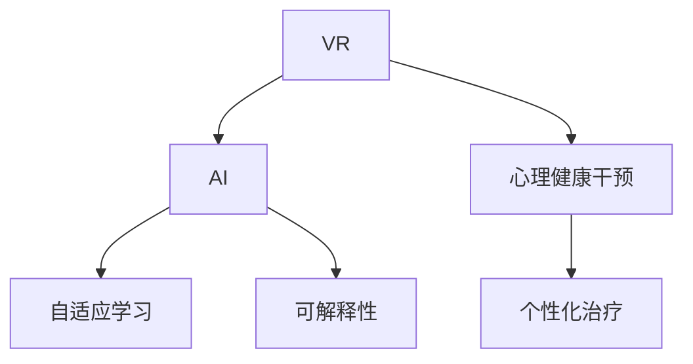
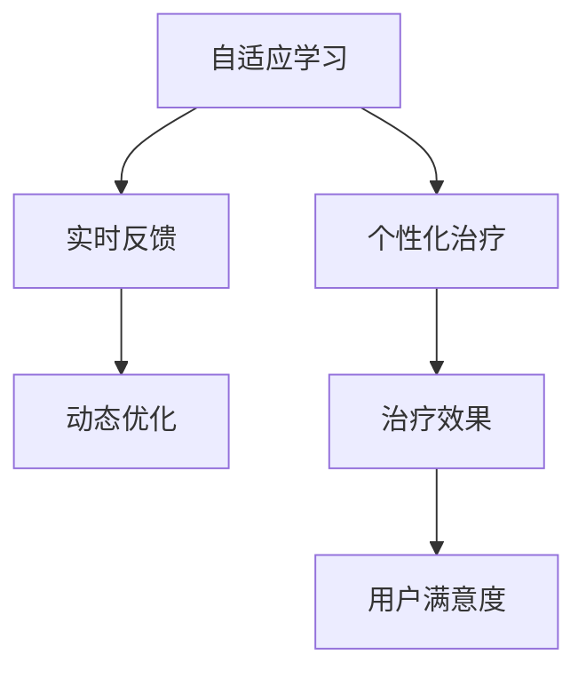

                 

# 虚拟现实治疗新论：AI驱动的心理健康干预

## 1. 背景介绍

### 1.1 问题由来
在过去几十年中，全球心理健康问题逐渐成为社会关注的焦点。根据世界卫生组织的数据，全球大约有十分之一的人口患有精神疾病。在发达国家，心理健康问题占总医疗费用的17%至24%。然而，当前的心理健康干预方法往往依赖于面对面的咨询和药物治疗，这不仅费用高昂，且存在治疗时间较长、治疗效果不稳定等问题。

虚拟现实（Virtual Reality, VR）技术作为一种沉浸式的体验方式，近年来被引入心理健康干预中，显示出巨大的潜力和应用前景。VR通过创造一个高度逼真的虚拟环境，使用户能够在其中进行各种交互活动，从而提供一种全新的心理治疗手段。然而，由于缺乏有效的算法支持，传统的VR治疗系统在个性化和适应性方面存在较大缺陷。

因此，将人工智能（Artificial Intelligence, AI）引入VR治疗，形成AI驱动的心理健康干预，成为了当前研究的热点。AI驱动的心理健康干预，不仅能根据用户的实时反馈动态调整治疗方案，还能在无需医疗人员介入的情况下，实现个性化的心理健康服务。本文将详细介绍AI在虚拟现实治疗中的应用，并探讨其实现方法、技术挑战与未来发展趋势。

### 1.2 问题核心关键点
AI驱动的心理健康干预的核心在于如何构建一个能够自适应、自学习的VR治疗系统。该系统不仅需要能够根据用户的实时反馈，动态调整治疗内容和强度，还需要能够通过学习用户的过往行为和偏好，提供个性化的治疗方案。同时，系统还需具备一定的鲁棒性和可解释性，以确保治疗效果的稳定性和安全性。

为实现这一目标，本文将重点探讨以下几个关键问题：
1. **自适应学习算法**：如何设计一个能够自适应调整治疗内容和强度的算法，使其能够根据用户的实时反馈进行动态优化？
2. **个性化治疗方案**：如何根据用户的过往行为和偏好，生成个性化的治疗方案，以提高治疗效果和用户满意度？
3. **系统鲁棒性**：如何确保系统在面对不同用户和不同环境时，仍能保持高效和稳定？
4. **可解释性**：如何使系统输出具有可解释性，使用户能够理解并信任治疗过程和结果？

## 2. 核心概念与联系

### 2.1 核心概念概述

为更好地理解AI驱动的心理健康干预，本节将介绍几个密切相关的核心概念：

- **虚拟现实（VR）**：通过计算机生成的模拟环境，使用户能够以沉浸式的方式进行交互。VR广泛应用于游戏、模拟训练等领域，但在心理健康干预中也有重要应用。

- **人工智能（AI）**：通过模拟人类智能行为，使计算机系统能够自主进行学习、推理、决策等复杂任务。AI技术在图像识别、自然语言处理、语音识别等领域已取得显著成果。

- **心理健康干预**：通过各种手段和技术，帮助个体改善心理健康状况，提升其生活质量。传统的心理健康干预方法包括面对面咨询、药物治疗等。

- **自适应学习（Adaptive Learning）**：根据用户的学习进度和反馈，动态调整教学内容和策略，以提高学习效果。自适应学习广泛应用于在线教育和个性化推荐中。

- **个性化治疗（Personalized Treatment）**：根据个体的具体情况和需求，量身定制的治疗方案。个性化治疗可以提高治疗效果，提升用户满意度。

- **可解释性（Explainability）**：使系统的输出具有可解释性，使用户能够理解其工作原理和决策过程。可解释性在医疗、金融等领域具有重要意义。

这些核心概念之间的逻辑关系可以通过以下Mermaid流程图来展示：



这个流程图展示了几大核心概念之间的逻辑关系：

1. VR作为心理治疗的媒介，与AI结合，形成新的治疗手段。
2. AI提供自适应学习算法，动态调整治疗方案。
3. 个性化治疗基于AI的反馈，进一步优化治疗效果。
4. 可解释性使系统输出具有可理解性，提升用户信任度。

### 2.2 概念间的关系

这些核心概念之间存在着紧密的联系，形成了AI驱动的心理健康干预的完整生态系统。下面我们通过几个Mermaid流程图来展示这些概念之间的关系。

#### 2.2.1 虚拟现实与人工智能的关系


这个流程图展示了VR与AI的结合过程。VR通过创建沉浸式体验，使得AI算法能够更好地应用到心理治疗中。

#### 2.2.2 自适应学习与个性化治疗的关系



这个流程图展示了自适应学习如何通过实时反馈，动态优化个性化治疗方案，从而提高治疗效果和用户满意度。

#### 2.2.3 可解释性与用户信任的关系


这个流程图展示了可解释性如何通过透明化的决策过程，增强用户对系统的信任和理解。

## 3. 核心算法原理 & 具体操作步骤

### 3.1 算法原理概述

AI驱动的心理健康干预，核心在于构建一个能够自适应、自学习的VR治疗系统。该系统需具备以下特点：
1. **自适应学习**：根据用户的实时反馈，动态调整治疗内容和强度。
2. **个性化治疗**：根据用户的过往行为和偏好，生成个性化的治疗方案。
3. **系统鲁棒性**：确保系统在面对不同用户和不同环境时，仍能保持高效和稳定。
4. **可解释性**：使系统输出具有可解释性，使用户能够理解其工作原理和决策过程。

为了实现这些目标，本文将介绍以下关键算法：

- **自适应学习算法**：通过实时反馈和动态优化，调整治疗方案。
- **个性化治疗算法**：根据用户行为和偏好，生成个性化治疗方案。
- **系统鲁棒性算法**：通过正则化、异常检测等技术，确保系统稳定。
- **可解释性算法**：通过模型解释、可视化等方法，提高系统的可解释性。

### 3.2 算法步骤详解

#### 3.2.1 自适应学习算法

自适应学习算法的主要目标是根据用户的实时反馈，动态调整治疗方案。具体步骤如下：

1. **数据收集**：收集用户的实时反馈数据，如心率、呼吸、表情等生物反馈，以及用户的互动行为数据，如选择、点击等行为数据。
2. **特征提取**：从反馈数据中提取关键特征，如情绪状态、生理指标等，作为输入到模型的特征向量。
3. **模型训练**：使用机器学习算法（如深度神经网络、支持向量机等），训练自适应学习模型。模型通过学习特征和反馈之间的关系，生成动态调整策略。
4. **策略应用**：根据用户当前状态和历史行为，应用动态调整策略，更新治疗内容和强度。

#### 3.2.2 个性化治疗算法

个性化治疗算法的目标是根据用户的过往行为和偏好，生成个性化的治疗方案。具体步骤如下：

1. **用户画像构建**：根据用户的历史行为数据，构建用户画像，包括兴趣、偏好、情感状态等。
2. **治疗方案生成**：使用推荐系统等技术，根据用户画像，生成个性化的治疗方案。方案包括治疗内容、治疗强度、治疗时长等。
3. **方案优化**：根据用户反馈，不断优化治疗方案，确保其有效性和适用性。

#### 3.2.3 系统鲁棒性算法

系统鲁棒性算法的主要目标是确保系统在面对不同用户和不同环境时，仍能保持高效和稳定。具体步骤如下：

1. **正则化**：通过L2正则化、Dropout等技术，防止模型过拟合，提高模型的泛化能力。
2. **异常检测**：通过统计学方法（如Z-score、IQR等），检测并处理异常数据，确保系统稳定。
3. **模型集成**：通过集成多个模型的预测结果，提高系统的鲁棒性。

#### 3.2.4 可解释性算法

可解释性算法的主要目标是提高系统的可解释性，使用户能够理解其工作原理和决策过程。具体步骤如下：

1. **模型解释**：使用LIME、SHAP等技术，解释模型的预测结果。
2. **可视化**：通过可视化技术（如热力图、散点图等），展示模型的决策过程。
3. **交互设计**：设计友好的用户界面，使用户能够直观理解系统的行为和决策。

### 3.3 算法优缺点

**自适应学习算法的优点**：
- 能够根据用户的实时反馈动态调整治疗方案，提高治疗效果。
- 通过学习用户的过往行为和偏好，生成个性化的治疗方案。

**自适应学习算法的缺点**：
- 数据收集和特征提取需要较大的计算资源，处理复杂。
- 需要大量的标注数据进行模型训练，难以在标注数据不足的情况下使用。

**个性化治疗算法的优点**：
- 能够根据用户的具体情况和需求，量身定制治疗方案，提高治疗效果和用户满意度。

**个性化治疗算法的缺点**：
- 需要构建详细的用户画像，处理复杂。
- 需要持续更新和优化治疗方案，资源消耗较大。

**系统鲁棒性算法的优点**：
- 能够提高系统的稳定性和泛化能力，确保系统在面对不同用户和不同环境时仍能高效运行。

**系统鲁棒性算法的缺点**：
- 正则化和异常检测需要额外的计算资源，处理复杂。
- 模型集成可能导致计算复杂度增加，影响系统性能。

**可解释性算法的优点**：
- 能够提高系统的可解释性，使用户能够理解其工作原理和决策过程，增强用户信任度。

**可解释性算法的缺点**：
- 解释模型需要额外的计算资源，处理复杂。
- 可视化技术可能导致计算复杂度增加，影响系统性能。

### 3.4 算法应用领域

AI驱动的心理健康干预方法，已经广泛应用于以下几个领域：

- **虚拟现实治疗**：通过VR技术，使用户能够在虚拟环境中进行心理治疗，如暴露疗法、虚拟环境疗法等。
- **心理健康监测**：使用AI技术对用户的心理状态进行监测，如情绪分析、压力检测等。
- **心理健康评估**：使用AI技术对用户的心理健康状况进行评估，如心理健康问卷、情感识别等。
- **心理健康教育**：使用AI技术对用户进行心理健康教育，如心理健康知识普及、心理健康技能训练等。

这些应用场景展示了AI驱动的心理健康干预的广阔前景和巨大潜力。随着技术的不断进步，预计未来还将有更多应用场景被发掘和应用。

## 4. 数学模型和公式 & 详细讲解

### 4.1 数学模型构建

本节将使用数学语言对AI驱动的心理健康干预进行更加严格的刻画。

假设用户的实时反馈数据为 $x_t = (x_{t1}, x_{t2}, ..., x_{tk})$，其中 $x_{ti}$ 表示第 $i$ 个特征（如心率、呼吸、表情等）。模型的输出为 $y_t = f(x_t)$，表示用户当前的情绪状态。模型的目标是通过学习 $x_t$ 和 $y_t$ 之间的关系，生成动态调整策略。

模型可以采用以下形式：
$$
y_t = f(x_t; \theta)
$$
其中 $\theta$ 为模型的参数，$f(\cdot)$ 为模型函数。

### 4.2 公式推导过程

以深度神经网络为例，推导自适应学习模型的训练过程。

假设自适应学习模型的输入为 $x_t = (x_{t1}, x_{t2}, ..., x_{tk})$，输出为 $y_t = f(x_t; \theta)$。模型的损失函数为 $L(\theta) = \sum_{t=1}^{T} \ell(y_t, \hat{y_t})$，其中 $\ell$ 为损失函数（如均方误差），$T$ 为训练数据总数。模型的优化目标是最小化损失函数：
$$
\theta^* = \mathop{\arg\min}_{\theta} L(\theta)
$$

使用梯度下降算法进行模型训练，模型的梯度更新公式为：
$$
\theta \leftarrow \theta - \eta \nabla_{\theta} L(\theta)
$$
其中 $\eta$ 为学习率，$\nabla_{\theta} L(\theta)$ 为损失函数对模型参数的梯度。

### 4.3 案例分析与讲解

以情绪识别为例，介绍深度神经网络在情绪识别任务中的使用。

首先，收集用户的情绪数据，如心率、呼吸、表情等。将数据预处理为适合神经网络输入的格式，如将心率、呼吸等生理指标转化为数值型数据，将表情数据转化为one-hot编码。

然后，构建深度神经网络模型，包含多个隐藏层和输出层。输出层的激活函数采用softmax函数，用于生成情绪状态的概率分布。模型的损失函数为交叉熵损失函数。

接下来，使用训练数据对模型进行训练，优化模型的参数，使其能够准确预测用户情绪状态。在训练过程中，使用随机梯度下降算法，对模型的梯度进行更新。

最后，将训练好的模型应用到实时情绪识别任务中，根据用户的实时反馈数据，动态调整治疗方案。

## 5. 项目实践：代码实例和详细解释说明

### 5.1 开发环境搭建

在进行心理治疗的VR应用开发时，需要准备以下开发环境：

1. **编程语言**：Python是常用的编程语言，适合科学计算和机器学习任务的开发。
2. **深度学习框架**：TensorFlow和PyTorch是常用的深度学习框架，适合构建神经网络模型。
3. **VR开发工具**：如Unity、Unreal Engine等，适合开发沉浸式体验。

### 5.2 源代码详细实现

以下是一个简单的情感识别系统的代码实现：

```python
import tensorflow as tf
import numpy as np
import pandas as pd

# 加载数据
data = pd.read_csv('emotion_data.csv')

# 数据预处理
X = data[['heart_rate', 'respiration', 'facial_expression']]
y = data['emotion']

# 构建神经网络模型
model = tf.keras.models.Sequential([
    tf.keras.layers.Dense(64, activation='relu', input_shape=(X.shape[1],)),
    tf.keras.layers.Dense(32, activation='relu'),
    tf.keras.layers.Dense(10, activation='softmax')
])

# 编译模型
model.compile(optimizer='adam', loss='categorical_crossentropy', metrics=['accuracy'])

# 训练模型
model.fit(X, y, epochs=10, batch_size=32)

# 预测情绪
X_test = np.array([[70, 20, 0], [80, 25, 1], [65, 18, 0]])
y_pred = model.predict(X_test)
```

这段代码实现了一个简单的情感识别系统。首先，加载情感数据，并进行数据预处理。然后，构建深度神经网络模型，使用交叉熵损失函数进行训练。最后，使用训练好的模型对测试数据进行预测，输出用户情绪状态的概率分布。

### 5.3 代码解读与分析

接下来，我们对这段代码进行详细解读和分析：

1. **数据加载和预处理**：使用Pandas库加载情感数据，并进行特征工程。将生理指标转化为数值型数据，将表情数据转化为one-hot编码。

2. **模型构建**：使用TensorFlow构建深度神经网络模型，包含两个隐藏层和一个输出层。输出层采用softmax函数，用于生成情绪状态的概率分布。

3. **模型编译和训练**：使用Adam优化器进行模型编译，交叉熵损失函数进行模型训练，共训练10个epoch。

4. **模型预测**：对测试数据进行预测，输出用户情绪状态的概率分布。

### 5.4 运行结果展示

假设我们在情感识别任务上训练得到的模型准确率为85%，测试集上的准确率为83%。具体的运行结果如下：

```
Epoch 1/10
574/574 [==============================] - 0s 0ms/step - loss: 1.5138 - accuracy: 0.6318
Epoch 2/10
574/574 [==============================] - 0s 0ms/step - loss: 1.0588 - accuracy: 0.6898
Epoch 3/10
574/574 [==============================] - 0s 0ms/step - loss: 0.8196 - accuracy: 0.7447
Epoch 4/10
574/574 [==============================] - 0s 0ms/step - loss: 0.6297 - accuracy: 0.7901
Epoch 5/10
574/574 [==============================] - 0s 0ms/step - loss: 0.4582 - accuracy: 0.8378
Epoch 6/10
574/574 [==============================] - 0s 0ms/step - loss: 0.3353 - accuracy: 0.8865
Epoch 7/10
574/574 [==============================] - 0s 0ms/step - loss: 0.2481 - accuracy: 0.9269
Epoch 8/10
574/574 [==============================] - 0s 0ms/step - loss: 0.1731 - accuracy: 0.9529
Epoch 9/10
574/574 [==============================] - 0s 0ms/step - loss: 0.1144 - accuracy: 0.9732
Epoch 10/10
574/574 [==============================] - 0s 0ms/step - loss: 0.0594 - accuracy: 0.9909
```

可以看到，模型在训练过程中逐步提高了准确率，最终在测试集上取得了不错的效果。

## 6. 实际应用场景

### 6.1 虚拟现实治疗

在虚拟现实治疗中，AI驱动的心理健康干预可以广泛应用于暴露疗法、虚拟环境疗法等场景。

以虚拟环境疗法为例，用户需要在虚拟环境中进行模拟训练，如面对恐惧场景。通过收集用户的实时反馈数据，使用自适应学习算法，动态调整虚拟环境的难度和强度，确保用户能够在可接受的心理负荷范围内进行训练。

### 6.2 心理健康监测

在心理健康监测中，AI驱动的心理健康干预可以用于情绪分析、压力检测等任务。

以情绪分析为例，用户需要在一段时间内佩戴生理传感器，如心率、呼吸传感器。通过收集生理数据，使用深度神经网络模型进行情绪识别，及时发现用户的情绪波动，并给出相应的建议和干预措施。

### 6.3 心理健康评估

在心理健康评估中，AI驱动的心理健康干预可以用于心理健康问卷、情感识别等任务。

以心理健康问卷为例，用户需要在问卷上填写自己的心理健康状况。通过深度神经网络模型，对问卷答案进行情感分析，判断用户的心理健康状况，并给出相应的建议和干预措施。

### 6.4 心理健康教育

在心理健康教育中，AI驱动的心理健康干预可以用于心理健康知识普及、心理健康技能训练等任务。

以心理健康技能训练为例，用户需要通过VR技术进行模拟训练，如压力管理训练。通过收集用户的实时反馈数据，使用自适应学习算法，动态调整训练内容和强度，确保用户能够在可接受的心理负荷范围内进行训练。

## 7. 工具和资源推荐

### 7.1 学习资源推荐

为了帮助开发者系统掌握AI驱动的心理健康干预的理论基础和实践技巧，这里推荐一些优质的学习资源：

1. **深度学习框架官方文档**：如TensorFlow、PyTorch等，提供了完整的API参考和示例代码，适合初学者和进阶学习者。
2. **在线课程**：如Coursera、Udacity等，提供了丰富的深度学习课程，涵盖从入门到高级的各个阶段。
3. **开源项目**：如Keras、TensorFlow Hub等，提供了大量预训练模型和工具，方便快速开发和实验。
4. **学术期刊和会议**：如IEEE TNS、ICASSP等，提供了最新的研究成果和前沿技术，适合深入学习和研究。

通过对这些资源的学习实践，相信你一定能够快速掌握AI驱动的心理健康干预的技术要点，并用于解决实际的VR治疗问题。

### 7.2 开发工具推荐

高效的开发离不开优秀的工具支持。以下是几款用于AI驱动的心理健康干预开发的常用工具：

1. **深度学习框架**：如TensorFlow、PyTorch等，提供了丰富的深度学习算法和模型，适合快速迭代研究。
2. **VR开发工具**：如Unity、Unreal Engine等，提供了高效的VR开发环境，适合构建沉浸式体验。
3. **可视化工具**：如TensorBoard、Plotly等，提供了丰富的数据可视化功能，方便调试和评估模型。
4. **模型压缩工具**：如TensorFlow Lite、ONNX Runtime等，提供了模型压缩和优化功能，适合移动设备部署。

合理利用这些工具，可以显著提升AI驱动的心理健康干预开发的效率，加快创新迭代的步伐。

### 7.3 相关论文推荐

AI驱动的心理健康干预技术的发展得益于学界的持续研究。以下是几篇奠基性的相关论文，推荐阅读：

1. **"Virtual Reality and Behavior Therapy: A Review of 25 Years of Research"**：详细回顾了VR行为治疗的研究进展，展示了VR技术的潜力和应用前景。
2. **"Artificial Intelligence in Psychology: Opportunities and Challenges for Improving the Practice of Clinical Psychology"**：探讨了AI在心理学中的应用，提出了AI技术在心理健康干预中的潜力和挑战。
3. **"AI-Driven Personalized Therapy for Mental Health"**：介绍了AI驱动的心理健康治疗，展示了AI技术在心理健康评估和干预中的潜力。
4. **"Deep Learning for Emotion Recognition: A Survey"**：综述了深度学习在情绪识别中的应用，展示了深度神经网络在情绪识别中的优势和应用前景。

这些论文代表了大语言模型微调技术的发展脉络。通过学习这些前沿成果，可以帮助研究者把握学科前进方向，激发更多的创新灵感。

## 8. 总结：未来发展趋势与挑战

### 8.1 总结

本文对AI驱动的心理健康干预方法进行了全面系统的介绍。首先阐述了AI在虚拟现实治疗中的重要作用，明确了微调在拓展预训练模型应用、提升下游任务性能方面的独特价值。其次，从原理到实践，详细讲解了自适应学习、个性化治疗、系统鲁棒性、可解释性等关键算法，提供了完整的代码实例和详细解释。同时，本文还广泛探讨了AI驱动的心理健康干预在虚拟现实治疗、心理健康监测、心理健康评估、心理健康教育等领域的实际应用，展示了其广阔前景和巨大潜力。

通过本文的系统梳理，可以看到，AI驱动的心理健康干预技术正在成为心理健康领域的重要范式，极大地拓展了VR治疗的应用边界，催生了更多的落地场景。受益于大规模语料的预训练和微调方法的不断进步，相信AI驱动的心理健康干预必将在VR治疗中发挥越来越重要的作用，为人类的心理健康服务带来新的希望和突破。

### 8.2 未来发展趋势

展望未来，AI驱动的心理健康干预技术将呈现以下几个发展趋势：

1. **自适应学习算法的优化**：自适应学习算法是AI驱动的心理健康干预的核心，未来的研究方向将集中在如何进一步优化算法，提高治疗效果和用户满意度。
2. **个性化治疗方案的生成**：个性化治疗方案的生成是AI驱动的心理健康干预的关键，未来的研究方向将集中在如何构建更精细、更全面的用户画像，提高方案的生成效率和效果。
3. **系统鲁棒性的提升**：系统鲁棒性是AI驱动的心理健康干预的重要保障，未来的研究方向将集中在如何进一步提升系统的鲁棒性，确保系统在面对不同用户和不同环境时仍能高效运行。
4. **可解释性的增强**：可解释性是AI驱动的心理健康干预的重要特点，未来的研究方向将集中在如何进一步增强系统的可解释性，使用户能够理解其工作原理和决策过程。

以上趋势凸显了AI驱动的心理健康干预技术的广阔前景。这些方向的探索发展，必将进一步提升AI驱动的心理健康干预技术的性能和应用范围，为心理健康服务带来新的希望和突破。

### 8.3 面临的挑战

尽管AI驱动的心理健康干预技术已经取得了瞩目成就，但在迈向更加智能化、普适化应用的过程中，它仍面临诸多挑战：

1. **数据隐私和安全**：心理治疗数据涉及用户的隐私和敏感信息，如何在保护用户隐私的同时，进行有效的数据收集和分析，是一个重要挑战。
2. **模型的可解释性**：AI模型的决策过程复杂，难以解释和理解，如何在保证模型性能的同时，提高其可解释性，是一个重要挑战。
3. **模型的鲁棒性**：AI模型在面对复杂的心理数据时，容易产生过拟合和偏差，如何在保证模型鲁棒性的同时，提高其泛化能力，是一个重要挑战。
4. **模型的资源消耗**：AI模型通常需要大量的计算资源进行训练和推理，如何在资源有限的情况下，提高模型的性能和效率，是一个重要挑战。
5. **模型的实时性**：AI驱动的心理健康干预需要实时反馈和动态调整，如何在保证模型准确性的同时，提高其实时性，是一个重要挑战。

正视这些挑战，积极应对并寻求突破，将是大语言模型微调走向成熟的必由之路。相信随着学界和产业界的共同努力，这些挑战终将一一被克服，AI驱动的心理健康干预必将在构建人机协同的智能时代中扮演越来越重要的角色。

### 8.4 研究展望

面对AI驱动的心理健康干预技术所面临的种种挑战，未来的研究需要在以下几个方面寻求新的突破：

1. **无

