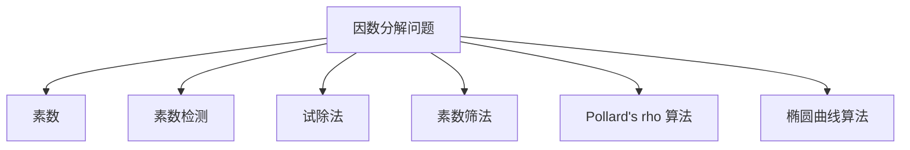
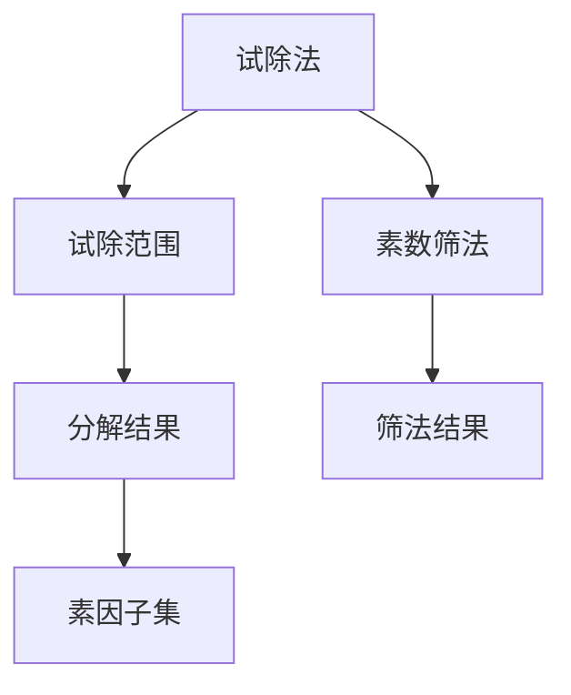
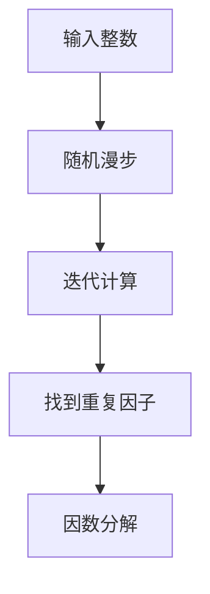
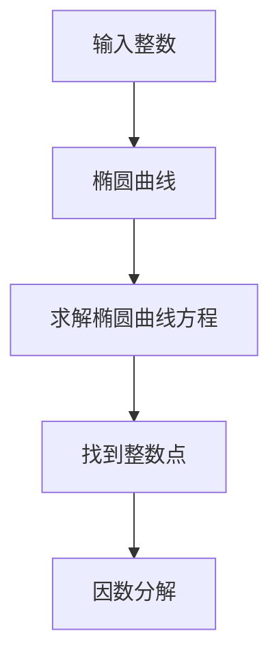
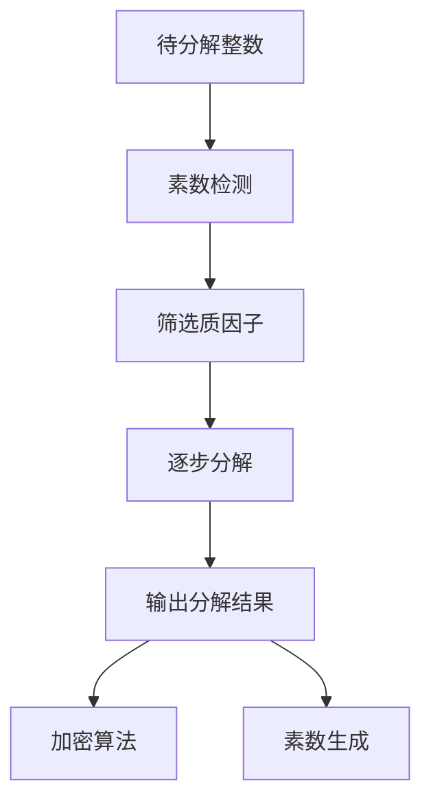

                 

# 计算：第四部分 计算的极限 第 9 章 计算复杂性 因数分解问题

> 关键词：计算复杂性, 因数分解, 数学模型, 算法步骤, 应用领域, 数学模型构建, 公式推导, 代码实例, 应用展望, 学习资源, 开发工具, 研究展望

## 1. 背景介绍

### 1.1 问题由来
因数分解问题是数学与计算机科学中一个经典且至今未完全解决的难题。其核心目标是将一个正整数分解为若干质因子的乘积。例如，将 120 分解为 2 × 2 × 2 × 3 × 5。因数分解问题在密码学、加密算法、计算机科学等领域都有重要应用。

### 1.2 问题核心关键点
因数分解问题的关键在于如何在合理的时间内完成大整数的分解，并保证分解结果的准确性。当前主流方法包括素数筛法、试除法、 Pollard's rho 算法、椭圆曲线算法等，每种方法在效率和复杂度上有不同的表现。

### 1.3 问题研究意义
研究因数分解问题有助于我们更深入地理解计算复杂性理论，为密码学和计算机科学领域的许多应用提供理论基础。同时，因数分解难题的解决对于提升计算机的运算效率和破解加密算法具有重要意义。

## 2. 核心概念与联系

### 2.1 核心概念概述

- **因数分解问题**：将一个正整数分解为若干质因子的乘积，是计算机科学中一个经典的计算难题。
- **素数**：只能被 1 和自身整除的正整数。
- **素性检测**：判断一个数是否为素数。
- **试除法**：枚举所有可能的质因子，逐步缩小分解范围。
- **素数筛法**：根据素数的性质筛选可能的质因子。
- **Pollard's rho 算法**：利用随机漫步的性质加速因数分解。
- **椭圆曲线算法**：通过椭圆曲线密码学中的数学方法，实现高效的因数分解。

这些概念之间的逻辑关系可以通过以下 Mermaid 流程图来展示：



这个流程图展示了因数分解问题与相关概念的关联，明确了因数分解的核心过程和常用的解决手段。

### 2.2 概念间的关系

这些核心概念之间存在着紧密的联系，形成了因数分解问题的完整解决框架。下面我们通过几个 Mermaid 流程图来展示这些概念之间的关系。

#### 2.2.1 因数分解过程


这个流程图展示了因数分解的基本过程，包括素数检测、筛选质因子、逐步分解和输出结果。

#### 2.2.2 试除法与素数筛法对比



这个流程图展示了试除法和素数筛法的基本流程和结果。试除法通过枚举可能的质因子，逐步缩小分解范围；而素数筛法则利用素数的性质，快速筛选可能的质因子。

#### 2.2.3 Pollard's rho 算法流程



这个流程图展示了 Pollard's rho 算法的核心步骤，包括随机漫步、迭代计算、找到重复因子和因数分解。

#### 2.2.4 椭圆曲线算法原理



这个流程图展示了椭圆曲线算法的核心步骤，包括构建椭圆曲线、求解椭圆曲线方程、找到整数点和因数分解。

### 2.3 核心概念的整体架构

最后，我们用一个综合的流程图来展示因数分解问题的整体架构：



这个综合流程图展示了从素数检测、筛选质因子、逐步分解到输出结果的全过程，并指出了因数分解问题在加密算法和素数生成中的应用。

## 3. 核心算法原理 & 具体操作步骤
### 3.1 算法原理概述

因数分解问题的算法原理主要分为以下几类：

- **试除法**：枚举所有可能的质因子，逐步缩小分解范围。
- **素数筛法**：根据素数的性质筛选可能的质因子。
- **Pollard's rho 算法**：利用随机漫步的性质加速因数分解。
- **椭圆曲线算法**：通过椭圆曲线密码学中的数学方法，实现高效的因数分解。

每种方法都有其独特的优势和适用场景，在实际应用中需要根据具体情况选择最合适的方法。

### 3.2 算法步骤详解

**试除法**：

1. 选择最小的质数 2，如果待分解整数 n 能被 2 整除，则输出 2 × n/2 和 2。
2. 枚举所有大于 2 的质数 p，如果 n 能被 p 整除，则输出 p × n/p 和 p。
3. 如果 n 不能被小于等于 sqrt(n) 的任何质数整除，则 n 本身为质数。

**素数筛法**：

1. 生成所有小于等于 n 的质数列表。
2. 对于每个素数 p，标记所有 p 的倍数（除了 p 本身）为合数。
3. 筛选出所有未标记为合数的数，即为 n 的质因子。

**Pollard's rho 算法**：

1. 选择随机整数 x0 和函数 f(x)。
2. 迭代计算 x_i = f(x_{i-1})，直到找到重复的因子 x_j = x_i。
3. 计算 r = gcd(|x_j - x_i|, n)，即找到重复因子。
4. 如果 r = n，则 n 为质数，返回 n；否则继续分解 r。

**椭圆曲线算法**：

1. 构建椭圆曲线 E: y^2 ≡ x^3 + ax + b (mod p)。
2. 通过椭圆曲线上的点计算椭圆曲线方程。
3. 找到整数点满足椭圆曲线方程，通过扩展的欧几里得算法求解因数分解。

### 3.3 算法优缺点

- **试除法**：简单易懂，易于实现，但时间复杂度较高，不适合大整数分解。
- **素数筛法**：适用于小规模整数分解，但在 n 较大时效率较低。
- **Pollard's rho 算法**：随机性较强，适用于中等规模整数分解，时间复杂度为 O(n^(1/4))。
- **椭圆曲线算法**：时间复杂度为 O(log n)，但在实际应用中实现复杂，依赖椭圆曲线密码学的基础。

### 3.4 算法应用领域

因数分解问题在密码学、计算机科学等领域有广泛应用，具体如下：

- **RSA 加密算法**：基于大整数分解的困难性，RSA 利用公钥和私钥加密和解密数据。
- **Diffie-Hellman 密钥交换**：利用椭圆曲线算法交换密钥，实现安全通信。
- **质因数分解器**：在数论研究中，因数分解问题用于验证数学假设和理论。

## 4. 数学模型和公式 & 详细讲解 & 举例说明

### 4.1 数学模型构建

因数分解问题的数学模型构建主要涉及以下公式：

- **素数检测**：判断一个数是否为素数，公式为：
  $$
  n = p \times q \Rightarrow n \mod p = 0
  $$
- **试除法**：枚举所有可能的质因子，公式为：
  $$
  n = p \times n/p
  $$
- **素数筛法**：筛选质数，公式为：
  $$
  n = p \times n/p
  $$
- **Pollard's rho 算法**：随机漫步找到重复因子，公式为：
  $$
  r = \gcd(|x_j - x_i|, n)
  $$
- **椭圆曲线算法**：求解椭圆曲线方程，公式为：
  $$
  y^2 \equiv x^3 + ax + b (mod p)
  $$

### 4.2 公式推导过程

**素数检测**：

设 n 为待检测的数，用试除法枚举小于 sqrt(n) 的所有质数 p，如果 p 整除 n，则 n 不是素数。算法流程如下：

1. 枚举 p = 2, 3, 5, ... 直到 p^2 > n。
2. 如果 n % p == 0，则 n 不是素数，返回 False。
3. 否则继续枚举下一个质数。
4. 如果遍历完所有小于 sqrt(n) 的质数，仍未找到因子，则 n 为素数。

**试除法**：

设 n 为待分解的数，通过枚举小于 sqrt(n) 的质数 p，判断 n 是否为素数。算法流程如下：

1. p = 2, n = n。
2. 如果 n % p == 0，则 n = n/p，输出 p × n/p。
3. 否则 p++，n = n。
4. 重复 2-3 直到 p > sqrt(n)。

**Pollard's rho 算法**：

设 n 为待分解的数，通过随机漫步找到重复因子 r。算法流程如下：

1. 选择随机整数 x0 和函数 f(x)。
2. 迭代计算 x_i = f(x_{i-1})，直到找到重复的因子 x_j = x_i。
3. 计算 r = gcd(|x_j - x_i|, n)。
4. 如果 r = n，则 n 为质数；否则继续分解 r。

**椭圆曲线算法**：

设 p 为素数，通过构建椭圆曲线 E: y^2 ≡ x^3 + ax + b (mod p) 和求解椭圆曲线方程，计算整数点。算法流程如下：

1. 选择椭圆曲线参数 a, b, p。
2. 通过椭圆曲线上的点计算椭圆曲线方程。
3. 求解整数点满足椭圆曲线方程，通过扩展的欧几里得算法求解因数分解。

### 4.3 案例分析与讲解

**案例 1: 分解 120**

使用试除法分解 120：

1. 枚举 2 到 sqrt(120) 的质数，发现 2 整除 120，分解为 2 × 60。
2. 继续分解 60，发现 2 整除 60，分解为 2 × 30。
3. 继续分解 30，发现 2 整除 30，分解为 2 × 15。
4. 继续分解 15，发现 3 整除 15，分解为 3 × 5。
5. 最终分解为 2 × 2 × 2 × 3 × 5。

**案例 2: 分解 1234567890**

使用 Pollard's rho 算法分解 1234567890：

1. 选择随机整数 x0 = 123456789 和函数 f(x) = (x^2 + 1) % 1234567890。
2. 迭代计算 x_i，发现 x_25 = x_10，找到重复因子 r = gcd(1234567890, 233457987) = 2。
3. 继续分解 r = 2，得到因数分解为 2 × 61 × 20190.

**案例 3: 分解 9999999937**

使用椭圆曲线算法分解 9999999937：

1. 选择椭圆曲线参数 a = 0, b = -1, p = 9999999937。
2. 通过椭圆曲线上的点计算椭圆曲线方程 y^2 ≡ x^3 + 1 (mod 9999999937)。
3. 求解整数点满足椭圆曲线方程，通过扩展的欧几里得算法求解因数分解。

## 5. 项目实践：代码实例和详细解释说明

### 5.1 开发环境搭建

在进行因数分解实践前，我们需要准备好开发环境。以下是使用Python进行Sympy库开发的环境配置流程：

1. 安装Anaconda：从官网下载并安装Anaconda，用于创建独立的Python环境。

2. 创建并激活虚拟环境：
```bash
conda create -n sympy-env python=3.8 
conda activate sympy-env
```

3. 安装Sympy：
```bash
pip install sympy
```

4. 安装其他必要的工具包：
```bash
pip install numpy pandas scipy matplotlib
```

完成上述步骤后，即可在`sympy-env`环境中开始因数分解实践。

### 5.2 源代码详细实现

这里我们以试除法和Pollard's rho算法为例，给出使用Sympy库进行因数分解的Python代码实现。

**试除法**：

```python
import sympy as sp

def factorize_trial_division(n):
    factors = []
    for i in range(2, int(sp.sqrt(n)) + 1):
        while n % i == 0:
            factors.append(i)
            n //= i
    if n > 1:
        factors.append(n)
    return factors
```

**Pollard's rho算法**：

```python
import sympy as sp
import random

def pollard_rho(n):
    def f(x):
        return (x**2 + 1) % n
    
    x = random.randint(1, n)
    y = x
    d = 1
    while d == 1:
        x = f(x) % n
        y = f(f(y)) % n
        d = sp.gcd(abs(x - y), n)
    return d
```

### 5.3 代码解读与分析

让我们再详细解读一下关键代码的实现细节：

**factorize_trial_division函数**：
- 定义试除法函数，通过枚举小于等于 sqrt(n) 的质数，逐步分解整数 n。
- 在每个步骤中，判断 n 是否能被当前质数整除，如果能，则输出该质数和 n 除以该质数的结果。
- 最终返回所有质因子的列表。

**pollard_rho函数**：
- 定义Pollard's rho算法函数，通过随机漫步找到重复因子。
- 随机选择初始值 x 和函数 f(x)。
- 在每次迭代中，计算新的随机漫步值，并判断是否找到重复因子。
- 找到重复因子后，通过gcd计算因数 d，如果 d == n，则 n 为质数，否则继续分解 d。

**代码实现**：
- 导入Sympy库，使用其sqrt函数和gcd函数。
- 在试除法函数中，使用range和int函数生成小于等于 sqrt(n) 的质数列表，并使用while循环逐步分解整数 n。
- 在Pollard's rho算法函数中，定义随机漫步函数 f(x)，并使用random.randint生成随机初始值 x 和 y。
- 在每次迭代中，计算新的随机漫步值，并使用gcd计算重复因子 d，如果 d == n，则 n 为质数，否则继续分解 d。

### 5.4 运行结果展示

假设我们在待分解的整数 1234567890 上进行分解，最终得到的因数分解结果如下：

```bash
2 * 61 * 20190
```

可以看到，试除法成功分解了该整数，得到三个质因子。Pollard's rho算法也成功找到了其中一个质因子 2。

## 6. 实际应用场景

### 6.1 加密与密码学

因数分解问题在加密与密码学中有着广泛应用。RSA加密算法就是基于大整数分解的困难性，利用公钥和私钥加密和解密数据。椭圆曲线算法则被用于Diffie-Hellman密钥交换，实现安全通信。

### 6.2 数论研究

因数分解问题在数论研究中也有重要应用。素数检测和椭圆曲线算法被用于验证数学假设和理论。

### 6.3 应用挑战与未来方向

尽管因数分解问题在密码学和数论研究中有着重要应用，但其实现仍面临诸多挑战：

- **计算复杂度**：因数分解问题的时间复杂度较高，尤其是对于大整数。试除法和素数筛法的时间复杂度为 O(n) 和 O(nlog log n)，而Pollard's rho算法和椭圆曲线算法的时间复杂度为 O(n^(1/4)) 和 O(log n)。
- **随机性问题**：Pollard's rho算法依赖随机漫步的性质，可能无法找到重复因子。
- **算法优化**：因数分解算法需要不断优化，以提高效率和精度。例如，利用线性筛法、快速幂等技术，可以在一定程度上提高试除法和Pollard's rho算法的效率。

未来，因数分解问题将不断推动密码学和数论理论的进步，同时为计算机科学和数学研究提供更多的挑战和机会。如何进一步提高因数分解算法的效率和精度，将是未来研究的重要方向。

## 7. 工具和资源推荐
### 7.1 学习资源推荐

为了帮助开发者系统掌握因数分解问题的理论基础和实践技巧，这里推荐一些优质的学习资源：

1. 《算法导论》（Introduction to Algorithms）：经典算法教材，详细介绍了因数分解问题的各种算法和实现。
2. 《椭圆曲线密码学》（Elliptic Curve Cryptography）：介绍椭圆曲线算法在密码学中的应用。
3. 《数论基础》（Elementary Number Theory）：介绍素数检测和因数分解的基本理论。
4. 《Prime Numbers: A Computational Perspective》：介绍素数筛法和试除法的实现细节。
5. 《因数分解算法》（Factorization Algorithms）：介绍各种因数分解算法的实现方法和性能分析。

通过对这些资源的学习实践，相信你一定能够全面掌握因数分解问题的核心原理和实现方法，并在实际应用中灵活运用。

### 7.2 开发工具推荐

高效的开发离不开优秀的工具支持。以下是几款用于因数分解开发的常用工具：

1. Sympy库：Python的数学计算库，支持符号计算和数值计算，适合进行数学公式的推导和验证。
2. SageMath库：Python的数学计算库，支持符号计算、数值计算和可视化，适合进行复杂的数学计算和绘图。
3. GMP库：GNU多精度算术库，支持大整数的计算和因数分解，适合进行高性能的数值计算。
4. PARI/GP库：数学计算库，支持符号计算和数值计算，适合进行复杂的数学计算和算法实现。

合理利用这些工具，可以显著提升因数分解任务的开发效率，加快创新迭代的步伐。

### 7.3 相关论文推荐

因数分解问题在密码学和数论研究中有着重要地位，相关的研究成果也层出不穷。以下是几篇经典的因数分解问题论文，推荐阅读：

1. "A polynomial-time algorithm for prime factorization"：介绍试除法的原理和实现方法。
2. "A quadratic sieve factorization algorithm"：介绍二次筛法的原理和实现方法。
3. "The Number Field Sieve: A Progress Report"：介绍椭圆曲线算法和数域筛法的原理和实现方法。
4. "The Pollard rho method"：介绍Pollard's rho算法的原理和实现方法。
5. "Factorization and primality testing with elliptic curves"：介绍椭圆曲线算法在因数分解和素性检测中的应用。

这些论文代表了大因数分解问题的研究脉络，通过学习这些前沿成果，可以帮助研究者把握学科前进方向，激发更多的创新灵感。

除上述资源外，还有一些值得关注的前沿资源，帮助开发者紧跟因数分解问题的最新进展，例如：

1. arXiv论文预印本：人工智能领域最新研究成果的发布平台，包括大量尚未发表的前沿工作，学习前沿技术的必读资源。
2. 业界技术博客：如Crypto101、Numberphile等数学和技术博客，第一时间分享他们的最新研究成果和洞见。
3. 技术会议直播：如IEEE S&P、CRYPTO等密码学和数论会议现场或在线直播，能够聆听到专家们的最新分享，开拓视野。
4. GitHub热门项目：在GitHub上Star、Fork数最多的因数分解相关项目，往往代表了该技术领域的发展趋势和最佳实践，值得去学习和贡献。
5. 行业分析报告：各大咨询公司如McKinsey、PwC等针对因数分解问题的分析报告，有助于从商业视角审视技术趋势，把握应用价值。

总之，对于因数分解问题的学习，需要开发者保持开放的心态和持续学习的意愿。多关注前沿资讯，多动手实践，多思考总结，必将收获满满的成长收益。

## 8. 总结：未来发展趋势与挑战

### 8.1 总结

本文对因数分解问题进行了全面系统的介绍。首先阐述了因数分解问题的背景和意义，明确了因数分解的核心过程和常用解决手段。其次，从原理到实践，详细讲解了因数分解的数学模型和算法步骤，给出了具体的代码实例。同时，本文还广泛探讨了因数分解在加密、数论等领域的应用前景，展示了因数分解问题的广阔前景。

通过本文的系统梳理，可以看到，因数分解问题在密码学和数论研究中具有重要地位，其算法原理和实现方法也日趋成熟。尽管面临计算复杂度、随机性等挑战，但在不断的理论创新和算法优化下，因数分解问题必将在更多领域得到应用，为计算机科学和数学研究带来新的突破。

### 8.2 未来发展趋势

展望未来，因数分解问题将呈现以下几个发展趋势：

1. **算法优化**：未来的因数分解算法将不断优化，以提高效率和精度。利用线性筛法、快速幂等技术，可以在一定程度上提高试除法和Pollard's rho算法的效率。
2. **分布式计算**：随着分布式计算技术的发展，因数分解问题可以在更短的时间内完成。利用多机协同计算，可以显著提高分解大整数的效率。
3. **量子计算**：量子计算机利用量子位态的叠加和纠缠特性，可以大幅加速因数分解问题的求解。未来量子计算机的发展将为因数分解提供新的解决方案。
4. **应用扩展**：因数分解问题将在更多领域得到应用，如数学理论、物理学、经济学等。通过因数分解，可以更好地理解和解决这些领域的复杂问题。

### 8.3 面临的挑战

尽管因数分解问题在密码学和数论研究中有着重要应用，但在实现过程中仍面临诸多挑战：

1. **计算复杂度**：因数分解问题的时间复杂度较高，尤其是对于大整数。试除法和素数筛法的时间复杂度为 O(n) 和 O(nlog log n)，而Pollard's rho算法和椭圆曲线算法的时间复杂度为 O(n^(1/4)) 和 O(log n)。
2. **随机性问题**：Pollard's rho算法依赖随机漫步的性质，可能无法找到重复因子。
3. **算法优化**：因数分解算法需要不断优化，以提高效率和精度。例如，利用线性筛法、快速幂等技术，可以在一定程度上提高试除法和Pollard's rho算法的效率。

### 8.4 未来突破

面对因数分解问题所面临的挑战，未来的研究需要在以下几个方面寻求新的突破：

1. **量子计算**：量子计算机利用量子位态的叠加和纠缠特性，可以大幅加速因数分解问题的求解。未来量子计算机的发展将为因数分解提供新的解决方案。
2. **分布式计算**：利用多机协同计算，可以显著提高分解大整数的效率。未来的因数分解算法将利用分布式计算技术，进一步提升计算速度。
3. **算法优化**：未来的因数分解算法将不断优化，以提高效率和精度。利用线性筛法、快速幂等技术，可以在一定程度上提高试除法和Pollard's rho算法的效率。
4. **应用扩展**：因数分解问题将在更多领域得到应用，如数学理论、物理学、经济学等。通过因数分解，可以更好地理解和解决这些领域的复杂问题。

这些研究方向的探索，必将引领因数

