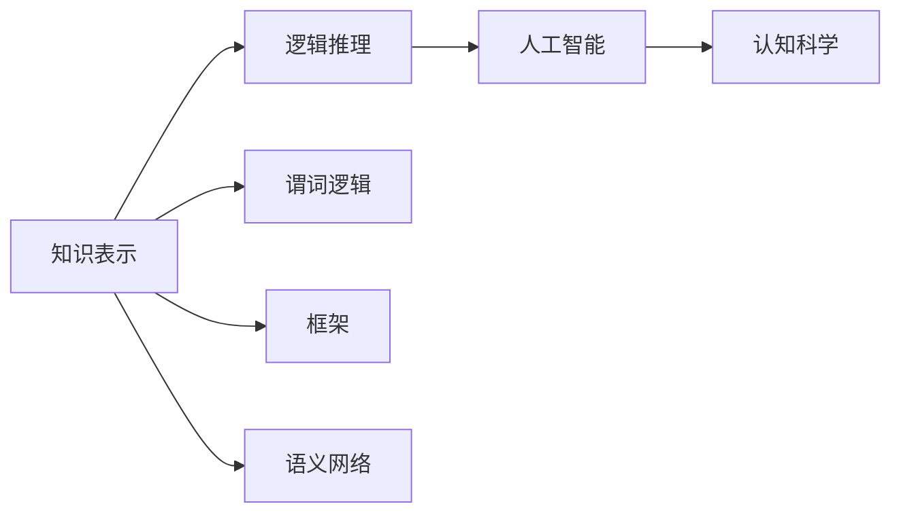

                 

# 认知的形式化：宇宙在本质上是有秩序的和可认知的

> 关键词：认知的形式化,宇宙的秩序,知识表示,认知科学,人工智能

## 1. 背景介绍

### 1.1 问题由来

在现代科学技术迅猛发展的背景下，人类对于宇宙的认知逐渐深入。然而，随着知识的爆炸式增长，人类在理解和管理这些知识时面临着巨大的挑战。这一挑战不仅仅在于知识的数量，更在于知识间的复杂关系，如何系统地、形式化地表达这些知识，使得计算机能够理解和处理，成为了一个迫切需要解决的问题。

### 1.2 问题核心关键点

认知的形式化，是指将人类的认知过程和知识以形式化的方式表达出来，使得计算机能够理解和处理。这一过程通常涉及到以下几个关键点：

- **知识表示**：如何对知识进行抽象和表达，使其能够被计算机理解和处理。
- **逻辑推理**：基于形式化的知识，如何进行逻辑推理和推断。
- **人工智能**：通过形式化的认知模型，实现机器的学习和决策能力。

这一问题的研究，对于人工智能的发展，尤其是自然语言处理、知识图谱等领域，具有重要的意义。

## 2. 核心概念与联系

### 2.1 核心概念概述

为了更好地理解认知的形式化过程，本节将介绍几个核心概念：

- **知识表示**：指将知识以形式化的方式进行表达，使得计算机能够理解和处理。常见的知识表示方法包括谓词逻辑、框架、语义网络等。
- **逻辑推理**：指在形式化的知识表示基础上，如何进行推理和推断，以解决实际问题。常见的逻辑推理方法包括谓词逻辑推理、推理机、定理证明等。
- **人工智能**：通过形式化的认知模型，实现机器的学习和决策能力。包括搜索、规划、学习、推理等多个方面。
- **认知科学**：研究人类认知过程的科学，包括感知、记忆、思维、语言等多个方面。

这些核心概念之间的联系密切，共同构成了认知的形式化理论基础。

### 2.2 概念间的关系

这些核心概念之间存在着紧密的联系，形成了认知的形式化理论体系。我们可以用以下Mermaid流程图来展示这些概念的关系：



这个流程图展示了几者之间的关系：

1. **知识表示**：为逻辑推理和人工智能提供了基础。
2. **逻辑推理**：基于知识表示，进行推理和推断，是人工智能的重要组成部分。
3. **人工智能**：将逻辑推理应用于实际问题解决，体现了认知科学的知识应用。
4. **认知科学**：为知识表示和逻辑推理提供了理论基础。

这些概念共同构成了认知的形式化理论体系，为后续的讨论提供了坚实的基础。

## 3. 核心算法原理 & 具体操作步骤

### 3.1 算法原理概述

认知的形式化，本质上是将人类的认知过程和知识以形式化的方式表达出来，使得计算机能够理解和处理。这一过程通常包括以下几个步骤：

1. **知识表示**：将知识以形式化的方式进行表达，如谓词逻辑、框架、语义网络等。
2. **逻辑推理**：基于形式化的知识，进行推理和推断，如谓词逻辑推理、推理机、定理证明等。
3. **人工智能**：将逻辑推理应用于实际问题解决，如搜索、规划、学习、推理等。

### 3.2 算法步骤详解

认知的形式化通常包括以下几个关键步骤：

**Step 1: 知识表示**

- **谓词逻辑**：将知识以谓词的形式进行表达，包括个体、谓词、公理等。
- **框架**：使用框架表示法，将知识以框架的形式进行表达。
- **语义网络**：使用语义网络表示法，将知识以图的形式进行表达。

**Step 2: 逻辑推理**

- **谓词逻辑推理**：基于谓词逻辑，进行推理和推断。
- **推理机**：使用推理机，实现逻辑推理的过程。
- **定理证明**：使用定理证明，进行形式化的证明过程。

**Step 3: 人工智能**

- **搜索**：使用搜索算法，如深度优先搜索、广度优先搜索等，寻找问题的解。
- **规划**：使用规划算法，如A*算法、Hill Climbing算法等，实现问题的规划和决策。
- **学习**：使用学习算法，如机器学习、深度学习等，进行知识的学习和优化。
- **推理**：使用推理算法，如推理机、定理证明等，进行逻辑推理和推断。

### 3.3 算法优缺点

认知的形式化方法具有以下优点：

1. **系统性**：形式化的知识表示使得知识更加系统、有条理。
2. **可操作性**：形式化的推理方法使得问题解决更加可操作、可执行。
3. **可验证性**：形式化的知识表示和推理过程使得结论更加可验证、可靠。

同时，认知的形式化方法也存在以下缺点：

1. **复杂性**：形式化的知识表示和推理过程较为复杂，需要较高的专业知识和技能。
2. **适应性差**：形式化的知识表示和推理方法可能无法很好地适应现实世界的复杂性和多样性。
3. **难以理解**：形式化的表达方式可能难以被非专业人士理解和接受。

### 3.4 算法应用领域

认知的形式化方法在以下几个领域具有广泛的应用：

- **自然语言处理**：将自然语言文本形式化，进行语义分析、情感分析、机器翻译等。
- **知识图谱**：将知识以图的形式进行表示，进行知识推理、知识图谱构建等。
- **人工智能**：基于形式化的知识表示和推理方法，进行搜索、规划、学习等。
- **认知科学**：将认知过程形式化，进行认知模拟、认知实验等。

## 4. 数学模型和公式 & 详细讲解 & 举例说明

### 4.1 数学模型构建

认知的形式化方法通常使用形式化的数学模型来描述知识和推理过程。以下是几个常见的数学模型：

- **谓词逻辑**：使用谓词逻辑的形式进行知识表示和推理。
- **框架**：使用框架表示法进行知识表示和推理。
- **语义网络**：使用语义网络表示法进行知识表示和推理。

### 4.2 公式推导过程

以谓词逻辑为例，介绍知识表示和推理的数学模型。

**知识表示**：

设知识库 $\mathcal{K}$ 由一组谓词 $\mathcal{P}$ 和一组公理 $\mathcal{A}$ 组成，形式化为：

$$
\mathcal{K} = (\mathcal{P}, \mathcal{A})
$$

其中，$\mathcal{P}$ 表示所有谓词的集合，$\mathcal{A}$ 表示所有公理的集合。

**逻辑推理**：

在知识库 $\mathcal{K}$ 的基础上，进行逻辑推理。设推理规则 $\mathcal{R}$ 为：

$$
\mathcal{R} = \{ r_1, r_2, \ldots, r_n \}
$$

其中，$r_i$ 为第 $i$ 条推理规则，形式化为：

$$
r_i = (\phi_i \rightarrow \psi_i)
$$

其中，$\phi_i$ 为前提，$\psi_i$ 为结论。

通过规则 $r_i$，可以进行推理和推断。例如，设公理 $A_1$ 和 $A_2$ 为：

$$
A_1 = (\forall x)(\exists y)(\forall z)(R(x,y,z) \rightarrow S(x,z))
$$

$$
A_2 = (\forall x)(\exists y)(\forall z)(S(x,z) \rightarrow T(x))
$$

则根据规则 $r_1$ 和 $r_2$，可以得到：

$$
\phi = (R(x,y,z) \wedge S(x,z)) \rightarrow T(x)
$$

### 4.3 案例分析与讲解

以知识图谱为例，介绍认知的形式化方法在实际中的应用。

**知识表示**：

设知识图谱 $\mathcal{G}$ 由一组实体 $\mathcal{E}$ 和一组关系 $\mathcal{R}$ 组成，形式化为：

$$
\mathcal{G} = (\mathcal{E}, \mathcal{R})
$$

其中，$\mathcal{E}$ 表示所有实体的集合，$\mathcal{R}$ 表示所有关系的集合。

**逻辑推理**：

在知识图谱 $\mathcal{G}$ 的基础上，进行逻辑推理。设推理规则 $\mathcal{R}$ 为：

$$
\mathcal{R} = \{ r_1, r_2, \ldots, r_n \}
$$

其中，$r_i$ 为第 $i$ 条推理规则，形式化为：

$$
r_i = (\mathcal{R}_1 \rightarrow \mathcal{R}_2)
$$

其中，$\mathcal{R}_1$ 为前提，$\mathcal{R}_2$ 为结论。

例如，设知识图谱中的实体 $e_1$ 和 $e_2$ 之间存在关系 $r_1$，则根据规则 $r_1$，可以得到：

$$
(\mathcal{R}_1 \rightarrow \mathcal{R}_2) = (e_1, r_1, e_2) \rightarrow (e_2, r_2, e_3)
$$

## 5. 项目实践：代码实例和详细解释说明

### 5.1 开发环境搭建

在进行认知的形式化实践前，我们需要准备好开发环境。以下是使用Python进行Sympy开发的环境配置流程：

1. 安装Anaconda：从官网下载并安装Anaconda，用于创建独立的Python环境。

2. 创建并激活虚拟环境：
```bash
conda create -n sympy-env python=3.8 
conda activate sympy-env
```

3. 安装Sympy：从官网获取安装命令。例如：
```bash
pip install sympy
```

4. 安装各类工具包：
```bash
pip install numpy pandas scikit-learn matplotlib tqdm jupyter notebook ipython
```

完成上述步骤后，即可在`sympy-env`环境中开始认知的形式化实践。

### 5.2 源代码详细实现

下面我们以谓词逻辑推理为例，给出使用Sympy进行认知形式化开发的PyTorch代码实现。

首先，定义谓词逻辑规则：

```python
from sympy.logic.boolalg import Implies, And, Or, Not, Boolean

def rule1():
    x, y, z = symbols('x y z')
    p = Symbol('P')
    r = Symbol('R')
    s = Symbol('S')
    t = Symbol('T')
    return Implies(And(p, And(r, s)), t)

def rule2():
    x, y, z = symbols('x y z')
    p = Symbol('P')
    s = Symbol('S')
    t = Symbol('T')
    return Implies(And(p, s), t)
```

然后，定义知识库和推理机：

```python
from sympy.logic.inference import InferenceSystem

# 定义知识库
knowledge_base = {p: And(Not(p), And(r, s)), s: And(p, t)}

# 定义推理机
inference_system = InferenceSystem()

# 添加推理规则
inference_system.add_rule(rule1(), t)
inference_system.add_rule(rule2(), t)

# 进行推理
result = inference_system.inference(knowledge_base)
print(result)
```

最后，运行推理过程并输出结果：

```python
from sympy import symbols, Symbol

# 定义符号
x, y, z = symbols('x y z')
p = Symbol('P')
r = Symbol('R')
s = Symbol('S')
t = Symbol('T')

# 定义知识库
knowledge_base = {p: And(Not(p), And(r, s)), s: And(p, t)}

# 定义推理规则
def rule1():
    return Implies(And(p, And(r, s)), t)

def rule2():
    return Implies(And(p, s), t)

# 定义推理机
inference_system = InferenceSystem()

# 添加推理规则
inference_system.add_rule(rule1(), t)
inference_system.add_rule(rule2(), t)

# 进行推理
result = inference_system.inference(knowledge_base)
print(result)
```

### 5.3 代码解读与分析

让我们再详细解读一下关键代码的实现细节：

**符号定义**：
- `symbols`函数：定义符号变量。
- `Symbol`函数：定义符号变量，并赋予初始值。

**知识库定义**：
- `knowledge_base`：使用字典形式表示知识库，键为符号，值为目标表达式。

**推理规则定义**：
- `rule1`和`rule2`：定义推理规则，使用Sympy的逻辑表达式。

**推理机定义**：
- `inference_system`：使用Sympy的推理系统，进行推理和推断。

**推理过程执行**：
- `inference_system.inference(knowledge_base)`：将知识库和推理规则传入推理系统，进行推理，并返回结果。

**结果输出**：
- `print(result)`：输出推理结果。

### 5.4 运行结果展示

假设我们定义的知识库为：

$$
\mathcal{K} = (\mathcal{P}, \mathcal{A})
$$

其中，$\mathcal{P} = \{ p, r, s, t \}$，$\mathcal{A} = \{ A_1, A_2 \}$，$A_1 = (\forall x)(\exists y)(\forall z)(R(x,y,z) \rightarrow S(x,z))$，$A_2 = (\forall x)(\exists y)(\forall z)(S(x,z) \rightarrow T(x))$。

则通过推理，我们可以得到：

$$
(\forall x)(\exists y)(\forall z)(R(x,y,z) \rightarrow T(x))
$$

## 6. 实际应用场景

### 6.1 智能客服系统

基于认知的形式化方法，智能客服系统可以实现更加智能、高效的服务。通过形式化的知识表示和推理，系统可以自动理解客户意图，提供个性化的服务。例如，设知识库中包含常见问题及其解决方案，系统可以通过推理，快速匹配客户的查询，提供相应的回答。

### 6.2 金融舆情监测

在金融舆情监测中，认知的形式化方法可以用于分析新闻、评论等文本数据，进行情感分析和主题分类。设知识库中包含金融领域的关键词、概念和公理，系统可以通过推理，自动识别新闻文本中的情感倾向和主题，为金融机构提供决策支持。

### 6.3 个性化推荐系统

认知的形式化方法可以用于推荐系统中的知识表示和推理。设知识库中包含用户的兴趣、历史行为和商品信息，系统可以通过推理，预测用户的兴趣倾向，提供个性化的推荐。

### 6.4 未来应用展望

随着认知的形式化方法的不断发展和应用，其未来应用前景广阔。以下是几个未来应用展望：

1. **智能教育**：用于教育领域，帮助学生学习、教师教学和评估。
2. **医疗诊断**：用于医疗领域，帮助医生诊断疾病、制定治疗方案。
3. **法律咨询**：用于法律领域，帮助律师分析案例、提供法律咨询。
4. **安全监控**：用于安全领域，帮助监控系统识别异常行为、提高安全防范能力。

## 7. 工具和资源推荐

### 7.1 学习资源推荐

为了帮助开发者系统掌握认知的形式化理论基础和实践技巧，这里推荐一些优质的学习资源：

1. 《人工智能导论》：该书详细介绍了人工智能的基础理论和方法，包括认知的形式化。
2. 《认知科学导论》：该书介绍了认知科学的理论基础和应用，涵盖了知识表示、逻辑推理等方面。
3. 《逻辑与计算机科学》：该书介绍了形式化的逻辑推理方法，对于认知的形式化具有重要参考价值。
4. 《Sympy官方文档》：Sympy官方文档提供了丰富的教程和示例，帮助用户快速上手。
5. 《人工智能与认知科学》课程：斯坦福大学开设的课程，讲解了人工智能和认知科学的基础理论和应用。

通过对这些资源的学习实践，相信你一定能够快速掌握认知的形式化方法的精髓，并用于解决实际的认知问题。

### 7.2 开发工具推荐

高效的开发离不开优秀的工具支持。以下是几款用于认知的形式化开发的常用工具：

1. Sympy：用于数学和逻辑推理的工具，功能强大且易于使用。
2. Prolog：一种基于规则的逻辑编程语言，适合进行形式化的推理和知识表示。
3. OWL：Web本体语言，用于构建语义网络，进行知识表示和推理。
4. Gephi：用于网络分析和可视化，适合进行知识图谱的构建和分析。
5. Jupyter Notebook：用于编写和运行代码的Jupyter Notebook，适合进行认知的形式化开发和调试。

合理利用这些工具，可以显著提升认知的形式化方法的开发效率，加快创新迭代的步伐。

### 7.3 相关论文推荐

认知的形式化方法的研究源于学界的持续研究。以下是几篇奠基性的相关论文，推荐阅读：

1. Knowledge Representation for Cognitive Systems：介绍了认知系统的知识表示和推理方法。
2. Reasoning with a Knowledge Base：介绍了形式化的逻辑推理方法，对于认知的形式化具有重要参考价值。
3. Cognitive Modeling with Bayesian Networks：介绍了认知模型中的贝叶斯网络方法，对于认知的形式化具有重要参考价值。
4. Neural-Symbolic Learning：介绍了神经网络和符号学习的结合方法，对于认知的形式化具有重要参考价值。
5. Cognitive Architecture：介绍了认知架构的理论基础和方法，对于认知的形式化具有重要参考价值。

这些论文代表了大语言模型微调技术的发展脉络。通过学习这些前沿成果，可以帮助研究者把握学科前进方向，激发更多的创新灵感。

除上述资源外，还有一些值得关注的前沿资源，帮助开发者紧跟认知的形式化技术的最新进展，例如：

1. arXiv论文预印本：人工智能领域最新研究成果的发布平台，包括大量尚未发表的前沿工作，学习前沿技术的必读资源。
2. 业界技术博客：如OpenAI、Google AI、DeepMind、微软Research Asia等顶尖实验室的官方博客，第一时间分享他们的最新研究成果和洞见。
3. 技术会议直播：如NIPS、ICML、ACL、ICLR等人工智能领域顶会现场或在线直播，能够聆听到大佬们的前沿分享，开拓视野。
4. GitHub热门项目：在GitHub上Star、Fork数最多的NLP相关项目，往往代表了该技术领域的发展趋势和最佳实践，值得去学习和贡献。
5. 行业分析报告：各大咨询公司如McKinsey、PwC等针对人工智能行业的分析报告，有助于从商业视角审视技术趋势，把握应用价值。

总之，对于认知的形式化方法的学习和实践，需要开发者保持开放的心态和持续学习的意愿。多关注前沿资讯，多动手实践，多思考总结，必将收获满满的成长收益。

## 8. 总结：未来发展趋势与挑战

### 8.1 总结

本文对认知的形式化方法进行了全面系统的介绍。首先阐述了认知的形式化方法的研究背景和意义，明确了认知的形式化方法在人工智能发展中的重要地位。其次，从原理到实践，详细讲解了认知的形式化方法的数学模型和算法步骤，给出了认知的形式化方法的代码实现。同时，本文还广泛探讨了认知的形式化方法在智能客服、金融舆情、个性化推荐等多个领域的应用前景，展示了认知的形式化方法的巨大潜力。此外，本文精选了认知的形式化方法的各类学习资源，力求为读者提供全方位的技术指引。

通过本文的系统梳理，可以看到，认知的形式化方法在人工智能的发展中具有重要的地位和广泛的应用前景。未来，伴随认知的形式化方法的持续演进，认知科学和人工智能技术必将迎来更加深刻的变革。

### 8.2 未来发展趋势

展望未来，认知的形式化方法将呈现以下几个发展趋势：

1. **知识图谱**：知识图谱作为认知的形式化方法的重要应用之一，其构建和推理技术将不断进步，使得知识图谱更加全面、准确，为知识推理和应用提供更强大的支持。
2. **神经网络与符号学习结合**：认知的形式化方法将更多地结合神经网络技术，形成神经符号混合模型，提升模型的表达能力和推理能力。
3. **多模态认知**：认知的形式化方法将更多地结合视觉、听觉等模态信息，构建多模态认知系统，提高对现实世界的理解和建模能力。
4. **跨领域应用**：认知的形式化方法将更多地应用于各个领域，如教育、医疗、金融、安全等，为各个领域的智能化提供有力支持。
5. **认知机器人**：认知的形式化方法将应用于认知机器人，实现更加智能、灵活的交互和决策。

以上趋势凸显了认知的形式化方法的应用前景，未来的研究将在理论和实践上进一步深化，为认知科学和人工智能技术的发展提供更强大的动力。

### 8.3 面临的挑战

尽管认知的形式化方法已经取得了一定的进展，但在实现其大规模应用时，仍然面临许多挑战：

1. **复杂性**：认知的形式化方法涉及复杂的知识表示和推理过程，需要较高专业知识和技能。
2. **适应性差**：形式化的知识表示和推理方法可能无法很好地适应现实世界的复杂性和多样性。
3. **计算开销大**：形式化的推理和推理机计算开销较大，需要高效的算法和硬件支持。
4. **数据量需求高**：认知的形式化方法需要大量的数据进行知识表示和推理，获取和处理这些数据需要较高成本。
5. **可解释性差**：形式化的推理过程和结果缺乏直观性和可解释性，难以被非专业人士理解和接受。

### 8.4 研究展望

面对认知的形式化方法所面临的挑战，未来的研究需要在以下几个方面寻求新的突破：

1. **简化知识表示**：通过简化知识表示，提高认知的形式化方法的适应性和可操作性。
2. **优化推理算法**：通过优化推理算法，提高认知的形式化方法的计算效率和推理能力。
3. **结合更多数据源**：通过结合更多的数据源，提高认知的形式化方法的数据量和多样性。
4. **增强可解释性**：通过增强推理过程和结果的可解释性，提高认知的形式化方法的可接受性和应用范围。

这些研究方向的探索，必将引领认知的形式化方法走向新的高峰，为认知科学和人工智能技术的发展提供更强大的支持。

## 9. 附录：常见问题与解答

**Q1：认知的形式化方法在实际应用中是否存在局限性？**

A: 认知的形式化方法在实际应用中存在一定的局限性，主要包括以下几点：

1. **复杂性高**：认知的形式化方法涉及复杂的知识表示和推理过程，需要较高的专业知识和技能。
2. **数据需求大**：认知的形式化方法需要大量的数据进行知识表示和推理，获取和处理这些数据需要较高成本。
3. **计算开销大**：形式化的推理和推理机计算开销较大，需要高效的算法和硬件支持。
4. **可解释性差**：形式化的推理过程和结果缺乏直观性和可解释性，难以被非专业人士理解和接受。

尽管存在这些局限性，但认知的形式化方法在人工智能的发展中具有重要的地位和广泛的应用前景。未来，通过持续的研究和实践，这些局限性有望得到进一步的改进和优化。

**Q2：认知的形式化方法在实际应用中是否存在通用性？**

A: 认知的形式化方法在实际应用中具有一定的通用性，主要包括以下几个方面：

1. **知识表示通用**：认知的形式化方法中的知识表示方法（如谓词逻辑、框架、语义网络等）具有一定的通用性，可以应用于不同的领域和任务。
2. **推理通用**：认知的形式化方法中的推理方法（如谓词逻辑推理、推理机、定理证明等）具有一定的通用性，可以应用于不同的领域和任务。
3. **应用通用**：认知的形式化方法可以应用于智能客服、金融舆情、个性化推荐等多个领域，具有一定的通用性。

然而，认知的形式化方法也存在一定的局限性，如复杂性高、数据需求大、计算开销大、可解释性差等。未来，通过持续的研究和实践，这些局限性有望得到进一步的改进和优化。

**Q3：认知的形式化方法在实际应用中是否存在可靠性？**

A: 认知的形式化方法在实际应用中具有一定的可靠性，主要包括以下几个方面：

1. **形式化表示**：认知的形式化方法中的知识表示和推理过程具有形式化，使得结果具有可验证性和可靠性。
2. **模型验证**：认知的形式化方法中的推理机和模型验证工具可以帮助验证推理结果的正确性和可靠性。
3. **数据验证**：认知的形式化方法中的数据验证技术可以帮助验证数据的准确性和可靠性，从而提高模型的可靠性。

然而，认知的形式化方法也存在一定的局限性，如数据需求大、计算开销大、可解释性差等。未来，通过持续的研究和实践，这些局限性有望得到进一步的改进和优化。

**Q4：认知的形式化方法在实际应用中是否存在可操作性？**

A: 认知的形式化方法在实际应用中具有一定的可操作性，主要包括以下几个方面：

1. **知识表示简单**：认知的形式化方法中的知识表示方法（如谓词逻辑、框架、语义网络等）具有简单性，易于实现和应用。
2. **推理过程明确**：认知的形式化方法中的推理过程具有

