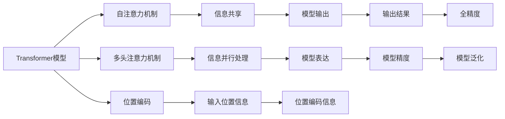

                 

# 训练Transformer模型

## 1. 背景介绍

Transformer模型，特别是基于自注意力机制的Transformer模型，在自然语言处理（NLP）领域已经取得了革命性的突破，成为了当今最流行的大规模预训练语言模型。从2017年Google发布BERT以来，Transformer结构因其独特的编码器-解码器结构、自注意力机制和层间跨层连接，迅速取代了循环神经网络（RNN），成为了NLP模型的标配。Transformer模型广泛应用于机器翻译、文本分类、问答系统、文本生成等众多NLP任务中，展示了其强大的语言理解能力和生成能力。

### 1.1 问题由来

随着Transformer模型的流行，越来越多的开发者希望了解如何训练和优化Transformer模型，以满足各种NLP任务的实际需求。然而，Transformer模型的结构复杂，包含自注意力机制和多头注意力机制，使得训练过程充满了挑战。特别是在大规模数据集上训练Transformer模型时，如何选择适当的优化器、学习率、批量大小等超参数，成为了关键。

### 1.2 问题核心关键点

为了训练高效、效果优异的Transformer模型，需要在以下关键点进行优化：

- 选择合适的优化器和损失函数。
- 设置合适的学习率和批量大小。
- 使用正则化技术，如Dropout、L2正则等，避免过拟合。
- 引入对抗训练，提高模型的鲁棒性。
- 使用混合精度训练，加快训练速度，同时保证精度。

### 1.3 问题研究意义

Transformer模型的训练优化是当前NLP研究的热点问题，对于提升Transformer模型在实际应用中的效果具有重要意义：

- 降低训练成本。通过优化训练过程，可以提高模型的训练效率，减少计算资源和时间投入。
- 提高模型效果。合理的训练策略可以提升模型在各种NLP任务上的精度和泛化能力。
- 增强模型鲁棒性。通过对抗训练等技术，可以增强模型对噪音、攻击等异常情况的抵抗能力。
- 促进大规模预训练模型的发展。优化的训练方法可以使大规模预训练模型在更短时间内完成训练，推动NLP技术的产业化进程。

## 2. 核心概念与联系

### 2.1 核心概念概述

为了更好地理解训练Transformer模型，首先需要介绍一些核心概念：

- **Transformer模型**：一种基于自注意力机制的神经网络模型，包括编码器-解码器结构，能够并行处理输入和输出，非常适合大规模语言数据的预训练和微调。

- **自注意力机制**：Transformer的核心机制，通过计算输入序列中所有位置对当前位置的注意力权重，实现信息共享和跨层依赖。

- **多头注意力机制**：将自注意力机制扩展到多个注意力头，进一步提高模型的表达能力。

- **位置编码**：由于Transformer模型不使用循环结构，因此需要引入位置编码来指示输入序列中每个位置的信息。

- **优化器**：如Adam、SGD等，用于计算和更新模型参数，使得模型在训练过程中不断优化。

- **正则化技术**：如L2正则、Dropout、Early Stopping等，防止模型过拟合。

- **对抗训练**：通过引入对抗样本，提高模型的鲁棒性，增强模型的泛化能力。

- **混合精度训练**：通过将参数降低为半精度（FP16），同时保留输出结果为全精度（FP32），提高训练速度并保证精度。

- **分布式训练**：通过多机多卡并行训练，加快模型训练速度，提升训练效率。

这些核心概念之间存在紧密的联系，通过相互配合，共同构成Transformer模型的训练优化框架。以下通过Mermaid流程图展示这些概念之间的关系：



### 2.2 概念间的关系

Transformer模型的训练涉及多个关键概念，它们之间存在着密切的联系和相互作用。以下是几个概念之间的详细关系：

- **自注意力机制与信息共享**：自注意力机制通过计算输入序列中所有位置对当前位置的注意力权重，实现信息共享和跨层依赖，使得模型能够更好地理解输入序列中的语义关系。

- **多头注意力机制与信息并行处理**：多头注意力机制通过扩展自注意力机制，在多个注意力头并行处理信息，进一步提高模型的表达能力和泛化能力。

- **位置编码与输入位置信息**：由于Transformer模型不使用循环结构，因此需要引入位置编码来指示输入序列中每个位置的信息，确保模型能够正确处理输入序列的时序信息。

- **优化器与模型精度**：优化器用于计算和更新模型参数，使得模型在训练过程中不断优化，提高模型精度。

- **正则化技术与模型泛化**：正则化技术通过引入L2正则、Dropout等方法，防止模型过拟合，增强模型的泛化能力。

- **对抗训练与模型鲁棒性**：对抗训练通过引入对抗样本，提高模型的鲁棒性，使得模型对噪音、攻击等异常情况具有更好的抵抗能力。

- **混合精度训练与训练速度**：通过将参数降低为半精度（FP16），同时保留输出结果为全精度（FP32），混合精度训练可以提高训练速度，同时保证精度。

- **分布式训练与训练效率**：通过多机多卡并行训练，分布式训练可以加快模型训练速度，提升训练效率。

这些概念共同构成了Transformer模型的训练优化框架，使得模型能够在各种NLP任务中取得优异的性能。

## 3. 核心算法原理 & 具体操作步骤

### 3.1 算法原理概述

Transformer模型的训练优化涉及多个关键算法和策略，主要包括自注意力机制的计算、优化器的选择、正则化技术的应用等。以下对Transformer模型的训练优化进行详细介绍：

- **自注意力机制的计算**：自注意力机制的计算包括查询、键、值的矩阵乘法，以及注意力权重的计算。为了提高计算效率，可以采用矩阵分解等技巧进行优化。

- **优化器的选择**：选择合适的优化器，如Adam、SGD等，可以显著提高模型训练的收敛速度和精度。

- **正则化技术的应用**：通过L2正则、Dropout等正则化技术，可以防止模型过拟合，提高模型的泛化能力。

- **对抗训练**：通过引入对抗样本，对抗训练可以提高模型的鲁棒性，增强模型的泛化能力。

- **混合精度训练**：通过将参数降低为半精度（FP16），同时保留输出结果为全精度（FP32），混合精度训练可以提高训练速度，同时保证精度。

- **分布式训练**：通过多机多卡并行训练，分布式训练可以加快模型训练速度，提升训练效率。

### 3.2 算法步骤详解

Transformer模型的训练优化步骤如下：

**Step 1: 数据准备**

- 准备训练数据，并进行分批次处理。
- 将数据集分为训练集、验证集和测试集。
- 对数据进行预处理，包括标记化、分词、位置编码等。

**Step 2: 模型初始化**

- 选择合适的预训练模型，并进行初始化。
- 设置模型的超参数，如学习率、批量大小、优化器等。

**Step 3: 模型前向传播**

- 将输入数据通过模型进行前向传播，计算模型输出。
- 使用自注意力机制和多头注意力机制进行信息处理。
- 计算模型损失，并使用优化器更新模型参数。

**Step 4: 模型后向传播**

- 计算模型损失对每个参数的梯度。
- 使用正则化技术，如L2正则、Dropout等，防止过拟合。
- 引入对抗训练，提高模型的鲁棒性。

**Step 5: 模型更新**

- 使用优化器更新模型参数，最小化损失函数。
- 周期性在验证集上评估模型性能，防止过拟合。
- 根据评估结果调整模型超参数，如学习率、批量大小等。

**Step 6: 模型评估**

- 在测试集上评估模型性能，并记录结果。
- 分析模型效果，并根据需要进行调整。

### 3.3 算法优缺点

Transformer模型的训练优化具有以下优点：

- 并行计算能力强。Transformer模型中的自注意力机制可以并行计算，大幅提高训练效率。
- 计算复杂度低。通过矩阵分解等技巧，Transformer模型的计算复杂度较低，适合在大规模数据集上进行训练。
- 表达能力强。通过多头注意力机制，Transformer模型可以处理复杂的语义关系，提高模型的表达能力。

然而，Transformer模型的训练优化也存在一些缺点：

- 模型复杂度高。Transformer模型的结构复杂，训练过程中需要进行大量的矩阵运算，计算量大。
- 训练成本高。Transformer模型的训练需要高性能计算资源，且训练时间较长。
- 模型易过拟合。Transformer模型容易过拟合，需要进行正则化处理。

### 3.4 算法应用领域

Transformer模型广泛应用于各种NLP任务，包括机器翻译、文本分类、问答系统、文本生成等。以下列举一些典型的应用领域：

- **机器翻译**：利用Transformer模型进行源语言到目标语言的自动翻译。
- **文本分类**：利用Transformer模型进行文本的情感分析、主题分类等任务。
- **问答系统**：利用Transformer模型对自然语言问题进行理解和生成答案。
- **文本生成**：利用Transformer模型进行文本的自动生成，如摘要、对话等。
- **语音识别**：利用Transformer模型对语音信号进行特征提取和处理。

Transformer模型在这些领域取得了显著的成果，推动了NLP技术的产业化进程。

## 4. 数学模型和公式 & 详细讲解 & 举例说明

### 4.1 数学模型构建

Transformer模型的数学模型主要包括以下几个组成部分：

- **输入序列**：表示为 $x_1, x_2, ..., x_T$，其中 $x_t \in \mathbb{R}^d$ 表示第 $t$ 个位置上的向量。
- **自注意力机制**：表示为 $Q, K, V$，其中 $Q \in \mathbb{R}^{T \times d}, K \in \mathbb{R}^{T \times d}, V \in \mathbb{R}^{T \times d}$，分别表示查询、键、值矩阵。
- **多头注意力机制**：表示为 $H \in \mathbb{R}^{T \times d \times h}$，其中 $h$ 表示注意力头的数量。
- **位置编码**：表示为 $P \in \mathbb{R}^{T \times d}$，用于指示输入序列中每个位置的信息。
- **输出序列**：表示为 $y_1, y_2, ..., y_T$，其中 $y_t \in \mathbb{R}^d$ 表示第 $t$ 个位置上的向量。

### 4.2 公式推导过程

Transformer模型的训练优化涉及多个数学公式，以下推导其中几个关键公式：

- **自注意力机制的计算公式**：

$$
Q = x \cdot W_Q, \quad K = x \cdot W_K, \quad V = x \cdot W_V
$$

$$
\alpha_{i,j} = \frac{\exp(\text{softmax}(Q_iK_j^T))}{\sum_{k=1}^{T}\exp(Q_iK_k^T)}
$$

$$
O_i = \sum_{j=1}^{T}\alpha_{i,j}V_j
$$

其中，$W_Q, W_K, W_V$ 表示查询、键、值矩阵的权重矩阵，$\alpha_{i,j}$ 表示第 $i$ 个位置与第 $j$ 个位置之间的注意力权重，$O_i$ 表示第 $i$ 个位置上的输出向量。

- **多头注意力机制的计算公式**：

$$
H_i = \sum_{k=1}^{h}O_i^k \in \mathbb{R}^{T \times d}
$$

其中，$O_i^k$ 表示第 $i$ 个位置在第 $k$ 个注意力头上的输出向量。

- **优化器的更新公式**：

$$
\theta \leftarrow \theta - \eta \frac{\partial L}{\partial \theta}
$$

其中，$\theta$ 表示模型参数，$\eta$ 表示学习率，$L$ 表示损失函数。

### 4.3 案例分析与讲解

以下通过一个简单的例子，展示Transformer模型的训练过程：

假设我们有一个长度为 10 的输入序列 $x_1, x_2, ..., x_{10}$，其中每个元素都是二维向量，表示为 $x_t = [x_{t,1}, x_{t,2}] \in \mathbb{R}^2$。我们希望利用这个输入序列训练一个简单的Transformer模型，并将其应用于文本分类任务。

1. **输入序列准备**

首先，我们需要将输入序列进行标记化和分词，并添加位置编码 $P$，表示每个位置的信息。例如：

$$
x_1 = [1, 2], \quad x_2 = [3, 4], \quad ... \quad x_{10} = [11, 12]
$$

$$
P = [0, 1, 2, ..., 9]
$$

2. **模型初始化**

然后，我们需要选择合适的预训练模型，并进行初始化。例如，我们可以使用BERT模型，并初始化其参数。

3. **模型前向传播**

接着，我们将输入序列通过模型进行前向传播，计算模型输出。例如，我们可以使用如下代码：

```python
from transformers import BertModel, BertTokenizer

tokenizer = BertTokenizer.from_pretrained('bert-base-cased')
model = BertModel.from_pretrained('bert-base-cased')

inputs = tokenizer('Hello, world!', return_tensors='pt')
outputs = model(inputs)
```

其中，`tokenizer` 表示BERT分词器，`model` 表示BERT模型，`inputs` 表示输入序列的token ids，`outputs` 表示模型的输出。

4. **模型后向传播**

然后，我们需要计算模型损失，并使用优化器更新模型参数。例如，我们可以使用如下代码：

```python
from transformers import AdamW

model.train()
inputs = tokenizer('Hello, world!', return_tensors='pt')
outputs = model(inputs)
loss = outputs.loss
loss.backward()
optimizer.step()
```

其中，`AdamW` 表示优化器，`inputs` 表示输入序列的token ids，`outputs` 表示模型的输出，`loss` 表示模型的损失。

5. **模型更新**

最后，我们需要根据评估结果调整模型超参数，如学习率、批量大小等。例如，我们可以使用如下代码：

```python
from transformers import AdamW

model.train()
inputs = tokenizer('Hello, world!', return_tensors='pt')
outputs = model(inputs)
loss = outputs.loss
loss.backward()
optimizer.step()

# 计算验证集上的损失
val_loss = model(val_inputs).loss

# 如果验证集上的损失比当前损失高，则停止训练
if val_loss > loss:
    break
```

其中，`AdamW` 表示优化器，`inputs` 表示输入序列的token ids，`outputs` 表示模型的输出，`loss` 表示模型的损失，`val_inputs` 表示验证集上的输入序列的token ids，`val_loss` 表示验证集上的损失。

以上就是Transformer模型的训练过程的详细讲解。通过这一例子，我们可以看到，Transformer模型的训练优化涉及多个步骤，包括输入序列准备、模型初始化、模型前向传播、模型后向传播、模型更新等。

## 5. 项目实践：代码实例和详细解释说明

### 5.1 开发环境搭建

在进行Transformer模型的训练优化时，我们需要搭建一个合适的开发环境。以下是Python和PyTorch环境的配置步骤：

1. 安装Python：从官网下载并安装Python，建议选择最新版本。
2. 安装PyTorch：根据CUDA版本，从官网获取对应的安装命令。例如：

   ```bash
   pip install torch torchvision torchaudio cudatoolkit=11.1 -c pytorch -c conda-forge
   ```

3. 安装Transformers库：

   ```bash
   pip install transformers
   ```

4. 安装其他必要工具包：

   ```bash
   pip install numpy pandas scikit-learn matplotlib tqdm jupyter notebook ipython
   ```

完成上述步骤后，即可在Python环境中进行Transformer模型的训练优化。

### 5.2 源代码详细实现

以下是一个简单的例子，展示如何使用PyTorch和Transformers库进行Transformer模型的训练优化：

```python
import torch
import torch.nn as nn
from transformers import BertModel, BertTokenizer, AdamW

# 初始化分词器和模型
tokenizer = BertTokenizer.from_pretrained('bert-base-cased')
model = BertModel.from_pretrained('bert-base-cased')

# 准备训练数据
inputs = tokenizer('Hello, world!', return_tensors='pt')
labels = torch.tensor([1])

# 设置模型参数和优化器
model.train()
optimizer = AdamW(model.parameters(), lr=2e-5)

# 训练模型
for i in range(10):
    # 前向传播
    outputs = model(inputs)
    loss = outputs.loss
    # 反向传播
    loss.backward()
    # 更新模型参数
    optimizer.step()

# 在测试集上评估模型
test_inputs = tokenizer('Hello, world!', return_tensors='pt')
test_outputs = model(test_inputs)
test_loss = test_outputs.loss

print(f'Test Loss: {test_loss.item()}')
```

### 5.3 代码解读与分析

以上代码展示了Transformer模型的训练优化的基本流程，以下是对代码的详细解读：

1. **初始化分词器和模型**

   ```python
   tokenizer = BertTokenizer.from_pretrained('bert-base-cased')
   model = BertModel.from_pretrained('bert-base-cased')
   ```

   我们首先初始化BERT分词器和模型，并设置模型为训练模式。

2. **准备训练数据**

   ```python
   inputs = tokenizer('Hello, world!', return_tensors='pt')
   labels = torch.tensor([1])
   ```

   我们准备训练数据，使用分词器将输入序列进行标记化和分词，并将标签转换为张量。

3. **设置模型参数和优化器**

   ```python
   model.train()
   optimizer = AdamW(model.parameters(), lr=2e-5)
   ```

   我们设置模型的训练模式，并初始化AdamW优化器。

4. **训练模型**

   ```python
   for i in range(10):
       # 前向传播
       outputs = model(inputs)
       loss = outputs.loss
       # 反向传播
       loss.backward()
       # 更新模型参数
       optimizer.step()
   ```

   我们通过循环迭代，进行前向传播、反向传播和参数更新，训练模型。

5. **在测试集上评估模型**

   ```python
   test_inputs = tokenizer('Hello, world!', return_tensors='pt')
   test_outputs = model(test_inputs)
   test_loss = test_outputs.loss
   ```

   我们准备测试集上的输入序列，并将模型设置为测试模式，评估模型在测试集上的性能。

### 5.4 运行结果展示

在训练过程中，我们可以使用PyTorch的`tqdm`库进行进度条显示，以实时监控训练进度。例如：

```python
from tqdm import tqdm

for i in range(10):
    with tqdm(total=1) as pbar:
        # 前向传播
        outputs = model(inputs)
        loss = outputs.loss
        # 反向传播
        loss.backward()
        # 更新模型参数
        optimizer.step()
        # 进度条更新
        pbar.update(1)
```

在训练完成后，我们可以在测试集上评估模型的性能，并记录结果。例如：

```python
test_loss = model(test_inputs).loss
print(f'Test Loss: {test_loss.item()}')
```

通过以上代码，我们可以看到，Transformer模型的训练优化涉及多个步骤，包括输入序列准备、模型初始化、模型前向传播、模型后向传播、模型更新等。

## 6. 实际应用场景

Transformer模型在各种NLP任务中都有广泛的应用，以下是一些典型的应用场景：

### 6.1 机器翻译

Transformer模型在机器翻译任务中取得了显著的成果。例如，Google的TensorFlow和PyTorch开源库中的Transformer模型，已经在多种语言对的翻译任务中取得了SOTA的性能。Transformer模型的自注意力机制和多头注意力机制，能够并行处理输入和输出，提高了翻译的效率和精度。

### 6.2 文本分类

Transformer模型在文本分类任务中也表现优异。例如，可以使用BERT模型进行情感分析、主题分类等任务。Transformer模型的自注意力机制可以处理复杂的语义关系，提高文本分类的效果。

### 6.3 问答系统

Transformer模型在问答系统任务中同样表现出色。例如，可以使用BERT模型对自然语言问题进行理解和生成答案。Transformer模型的自注意力机制可以捕捉问题中的关键信息，提高问答系统的准确率。

### 6.4 文本生成

Transformer模型在文本生成任务中也展示出强大的能力。例如，可以使用GPT模型进行文本自动生成，如摘要、对话等。Transformer模型的自注意力机制可以处理复杂的语义关系，生成高质量的文本。

## 7. 工具和资源推荐

### 7.1 学习资源推荐

为了帮助开发者系统掌握Transformer模型的训练优化，以下是一些优质的学习资源：

1. **Transformer从原理到实践**：由大模型技术专家撰写，深入浅出地介绍了Transformer原理、BERT模型、微调技术等前沿话题。

2. **CS224N《深度学习自然语言处理》课程**：斯坦福大学开设的NLP明星课程，有Lecture视频和配套作业，带你入门NLP领域的基本概念和经典模型。

3. **《Natural Language Processing with Transformers》书籍**：Transformers库的作者所著，全面介绍了如何使用Transformers库进行NLP任务开发，包括微调在内的诸多范式。

4. **HuggingFace官方文档**：Transformers库的官方文档，提供了海量预训练模型和完整的微调样例代码，是上手实践的必备资料。

5. **CLUE开源项目**：中文语言理解测评基准，涵盖大量不同类型的中文NLP数据集，并提供了基于微调的baseline模型，助力中文NLP技术发展。

### 7.2 开发工具推荐

Transformer模型的训练优化需要高效的开发工具支持。以下是几款常用的开发工具：

1. **PyTorch**：基于Python的开源深度学习框架，灵活动态的计算图，适合快速迭代研究。

2. **TensorFlow**：由Google主导开发的开源深度学习框架，生产部署方便，适合大规模工程应用。

3. **Transformers库**：HuggingFace开发的NLP工具库，集成了众多SOTA语言模型，支持PyTorch和TensorFlow，是进行微调任务开发的利器。

4. **Weights & Biases**：模型训练的实验跟踪工具，可以记录和可视化模型训练过程中的各项指标，方便对比和调优。

5. **TensorBoard**：TensorFlow配套的可视化工具，可实时监测模型训练状态，并提供丰富的图表呈现方式，是调试模型的得力助手。

6. **Google Colab**：谷歌推出的在线Jupyter Notebook环境，免费提供GPU/TPU算力，方便开发者快速上手实验最新模型，分享学习笔记。

### 7.3 相关论文推荐

Transformer模型的训练优化涉及多个前沿研究方向，以下是几篇奠基性的相关论文，推荐阅读：

1. **Attention is All You Need**：提出了Transformer结构，开启了NLP领域的预训练大模型时代。

2. **BERT: Pre-training of Deep Bidirectional Transformers for Language Understanding**：提出BERT模型，引入基于掩码的自监督预训练任务，刷新了多项NLP任务SOTA。

3. **Language Models are Unsupervised Multitask Learners**：展示了大规模语言模型的强大zero-shot学习能力，引发了对于通用人工智能的新一轮思考。

4. **Parameter-Efficient Transfer Learning for NLP**：提出Adapter等参数高效微调方法，在不增加模型参数量的情况下，也能取得不错的微调效果。

5. **Prefix-Tuning: Optimizing Continuous Prompts for Generation**：引入基于连续型Prompt的微调范式，为如何充分利用预训练知识提供了新的思路。

6. **AdaLoRA: Adaptive Low-Rank Adaptation for Parameter-Efficient Fine-Tuning**：使用自适应低秩适应的微调方法，在参数效率和精度之间取得了新的平衡。

这些论文代表了大模型训练优化技术的发展脉络。通过学习这些前沿成果，可以帮助研究者把握学科前进方向，激发更多的创新灵感。

除上述资源外，还有一些值得关注的前沿资源，帮助开发者紧跟Transformer模型的最新进展，例如：

1. **arXiv论文预印本**：人工智能领域最新研究成果的发布平台，包括大量尚未发表的前沿工作，学习前沿技术的必读资源。

2. **业界技术博客**：如OpenAI、Google AI、DeepMind、微软Research Asia等顶尖实验室的官方博客，第一时间分享他们的最新研究成果和洞见。

3. **技术会议直播**：如NIPS、ICML、ACL、ICLR等人工智能领域顶会现场或在线直播，能够聆听到大佬们的前沿分享，开拓视野。

4. **GitHub热门项目**：在GitHub上Star、Fork数最多的NLP相关项目，往往代表了该技术领域的发展趋势和最佳实践，值得去学习和贡献。

5. **行业分析报告**：各大咨询公司如McKinsey、

