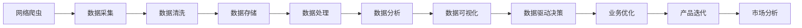

                 

# 基于网络爬虫与数据分析的计算机岗位前景分析

## 1. 背景介绍

### 1.1 问题由来

随着互联网的普及和数字化转型的加速，大数据、人工智能等技术在各行各业的应用日益广泛。特别是在计算机岗位上，网络爬虫与数据分析成为了获取数据、提取信息、支持决策的重要手段。然而，随着技术的发展，市场上的岗位需求也发生了变化。如何更好地把握行业趋势，提升自身的核心竞争力，成为每一位计算机从业者必须面对的问题。

### 1.2 问题核心关键点

当前计算机岗位的前景分析，主要关注以下几个核心关键点：

- 网络爬虫与数据分析技术的最新进展
- 大数据与人工智能技术的结合方式
- 企业对数据人才的需求趋势
- 职业发展的方向与路径

这些关键点贯穿了从技术到应用的全过程，直接影响了计算机岗位的前景和发展方向。

### 1.3 问题研究意义

深入研究基于网络爬虫与数据分析的计算机岗位前景，对于提升从业者的技术水平、拓宽就业渠道、增强职业竞争力具有重要意义。通过分析技术发展趋势、市场需求变化，可以帮助从业者更好地制定职业规划，抓住市场机遇，推动个人职业成长。

## 2. 核心概念与联系

### 2.1 核心概念概述

- **网络爬虫（Web Scraping）**：通过模拟浏览器行为，自动抓取网页内容的技术。常用于大规模数据采集、数据清洗等场景。

- **数据分析（Data Analysis）**：对大规模数据进行清洗、整理、统计、挖掘和可视化，揭示数据背后的规律和趋势。

- **大数据技术（Big Data Technology）**：用于处理和分析大规模数据集的技术体系，包括数据存储、数据处理、数据挖掘等。

- **人工智能（AI）**：通过机器学习、深度学习等技术，使计算机系统具备类似人类的智能，实现自动决策、智能推荐等功能。

- **数据驱动决策（Data-Driven Decision Making）**：基于数据分析结果，进行科学决策的过程，广泛应用于业务优化、产品迭代、市场分析等场景。

### 2.2 核心概念原理和架构的 Mermaid 流程图



这个流程图展示了网络爬虫与数据分析的完整流程，从数据采集到决策优化，体现了数据在各个环节的重要性。

### 2.3 核心概念的整体架构

网络爬虫与数据分析的核心架构可以概括为：

1. **数据采集**：通过网络爬虫自动获取网页内容，并进行初步处理。
2. **数据清洗**：对采集到的数据进行去重、去噪、格式转换等处理，保证数据质量。
3. **数据存储**：使用数据库、数据湖等技术，将清洗后的数据进行持久化存储。
4. **数据处理**：通过ETL（Extract, Transform, Load）技术，将原始数据转化为可用于分析的中间数据。
5. **数据分析**：利用统计学、机器学习等方法，挖掘数据中的规律和趋势。
6. **数据可视化**：通过图表、报表等形式，将分析结果直观呈现。
7. **数据驱动决策**：基于分析结果，进行科学决策，指导业务优化和产品迭代。

通过这个架构，可以看出网络爬虫与数据分析在各个环节中的作用和重要性。

## 3. 核心算法原理 & 具体操作步骤

### 3.1 算法原理概述

基于网络爬虫与数据分析的计算机岗位前景分析，主要涉及以下算法原理：

- **爬虫算法**：用于自动抓取网页内容的技术，如PageRank算法、深度优先搜索（DFS）、广度优先搜索（BFS）等。
- **数据清洗算法**：用于去除数据中的噪声和冗余信息，如去重算法、格式转换算法、数据归一化算法等。
- **数据存储算法**：用于将数据持久化存储的技术，如关系型数据库、NoSQL数据库、分布式文件系统等。
- **数据处理算法**：用于将原始数据转化为中间数据的技术，如ETL算法、数据预处理算法等。
- **数据分析算法**：用于挖掘数据中的规律和趋势的技术，如统计分析、回归分析、聚类分析、机器学习等。
- **数据可视化算法**：用于将分析结果可视化呈现的技术，如图表生成算法、报表生成算法等。

### 3.2 算法步骤详解

基于网络爬虫与数据分析的计算机岗位前景分析，主要分为以下几个步骤：

1. **需求分析**：明确分析目标和需求，如市场分析、用户行为分析、竞争对手分析等。
2. **数据采集**：使用网络爬虫技术，自动抓取相关网页内容，并提取有用信息。
3. **数据清洗**：对采集到的数据进行去重、去噪、格式转换等处理，保证数据质量。
4. **数据存储**：使用数据库、数据湖等技术，将清洗后的数据进行持久化存储。
5. **数据处理**：通过ETL技术，将原始数据转化为可用于分析的中间数据。
6. **数据分析**：利用统计学、机器学习等方法，挖掘数据中的规律和趋势。
7. **数据可视化**：通过图表、报表等形式，将分析结果直观呈现。
8. **数据驱动决策**：基于分析结果，进行科学决策，指导业务优化和产品迭代。

### 3.3 算法优缺点

基于网络爬虫与数据分析的计算机岗位前景分析，具有以下优点：

- **数据全面性**：通过网络爬虫技术，可以从互联网获取大规模数据，数据覆盖面广，信息丰富。
- **数据实时性**：网络爬虫可以实现实时抓取数据，保持数据的及时性。
- **分析深度**：数据分析算法可以深入挖掘数据背后的规律和趋势，提供更精准的决策支持。

同时，也存在以下缺点：

- **数据合法性**：网络爬虫需要遵守法律法规，避免侵犯版权和隐私。
- **数据质量**：网络爬虫采集到的数据可能存在噪声和冗余，需要进行严格的数据清洗和预处理。
- **技术复杂性**：网络爬虫与数据分析涉及多个技术环节，需要掌握多种技术和工具。

### 3.4 算法应用领域

基于网络爬虫与数据分析的计算机岗位前景分析，主要应用于以下领域：

- **市场分析**：通过爬取和分析互联网上的信息，获取市场趋势和用户需求。
- **用户行为分析**：通过分析用户行为数据，了解用户兴趣和需求，优化产品设计和用户体验。
- **竞争对手分析**：通过爬取和分析竞争对手的公开信息，了解其市场策略和产品优势，制定竞争策略。
- **产品迭代优化**：通过分析用户反馈和行为数据，指导产品迭代和优化，提升产品竞争力。
- **智能推荐系统**：通过分析用户历史行为数据，推荐个性化的产品和服务，提升用户粘性和满意度。
- **风险预警系统**：通过分析金融、社交媒体等数据，提前预警潜在的风险和危机，保障业务安全。

## 4. 数学模型和公式 & 详细讲解

### 4.1 数学模型构建

基于网络爬虫与数据分析的计算机岗位前景分析，涉及以下几个数学模型：

- **爬虫算法模型**：用于描述爬虫算法的数学模型，如PageRank算法、深度优先搜索（DFS）、广度优先搜索（BFS）等。
- **数据清洗模型**：用于描述数据清洗算法的数学模型，如去重算法、格式转换算法、数据归一化算法等。
- **数据存储模型**：用于描述数据存储技术的数学模型，如关系型数据库、NoSQL数据库、分布式文件系统等。
- **数据处理模型**：用于描述数据处理技术的数学模型，如ETL算法、数据预处理算法等。
- **数据分析模型**：用于描述数据分析技术的数学模型，如统计分析、回归分析、聚类分析、机器学习等。
- **数据可视化模型**：用于描述数据可视化技术的数学模型，如图表生成算法、报表生成算法等。

### 4.2 公式推导过程

以PageRank算法为例，推导其基本公式。

PageRank算法是一种用于网页排序的算法，用于评估网页的重要性和相关性。其基本公式如下：

$$
PR_i = (1 - d) + d \sum_{j=1}^N \frac{PR_j}{C_j + k} a_{ij}
$$

其中：

- $PR_i$：网页$i$的PageRank值。
- $d$：阻尼系数，通常取0.85。
- $C_j$：网页$j$的入度。
- $a_{ij}$：网页$i$和网页$j$之间的超链权重。

通过迭代计算，可以得到网页的PageRank值，从而进行网页排序和重要性评估。

### 4.3 案例分析与讲解

以电商平台的推荐系统为例，分析其基于网络爬虫与数据分析的前景。

电商平台的推荐系统通过网络爬虫抓取用户行为数据，如浏览记录、购买历史、评价信息等。然后，通过数据分析模型，挖掘用户兴趣和行为规律，最终生成个性化推荐。

- **数据采集**：使用网络爬虫技术，自动抓取用户行为数据。
- **数据清洗**：对采集到的数据进行去重、去噪、格式转换等处理，保证数据质量。
- **数据存储**：使用数据库、数据湖等技术，将清洗后的数据进行持久化存储。
- **数据处理**：通过ETL技术，将原始数据转化为可用于分析的中间数据。
- **数据分析**：利用机器学习算法，挖掘用户兴趣和行为规律，生成推荐结果。
- **数据可视化**：通过图表、报表等形式，将推荐结果直观呈现。
- **数据驱动决策**：基于推荐结果，进行商品推荐和营销策略优化，提升用户体验和销售额。

## 5. 项目实践：代码实例和详细解释说明

### 5.1 开发环境搭建

在Python环境中搭建基于网络爬虫与数据分析的项目，需要安装以下几个库：

- **requests**：用于发送HTTP请求。
- **BeautifulSoup**：用于解析HTML和XML文档。
- **pandas**：用于数据处理和分析。
- **scikit-learn**：用于机器学习建模。
- **matplotlib**：用于数据可视化。

安装命令如下：

```bash
pip install requests beautifulsoup4 pandas scikit-learn matplotlib
```

### 5.2 源代码详细实现

以爬取和分析电商平台的商品推荐系统为例，给出完整的Python代码实现。

```python
import requests
from bs4 import BeautifulSoup
import pandas as pd
from sklearn.cluster import KMeans

# 爬取商品页面数据
def get_product_data(url):
    response = requests.get(url)
    soup = BeautifulSoup(response.content, 'html.parser')
    title = soup.find('h1').text
    price = soup.find('span', {'class': 'price'}).text
    description = soup.find('p', {'class': 'description'}).text
    return {'title': title, 'price': price, 'description': description}

# 获取商品列表页面
def get_product_list(url):
    response = requests.get(url)
    soup = BeautifulSoup(response.content, 'html.parser')
    product_list = []
    for item in soup.find_all('div', {'class': 'product'}):
        title = item.find('h2').text
        price = item.find('span', {'class': 'price'}).text
        product_list.append({'title': title, 'price': price})
    return product_list

# 数据清洗和预处理
def preprocess_data(data):
    # 去重
    data = pd.DataFrame(data)
    data.drop_duplicates(inplace=True)
    # 去噪
    data.dropna(inplace=True)
    # 格式转换
    data['price'] = pd.to_numeric(data['price'], errors='coerce')
    return data

# 数据分析和建模
def analyze_data(data):
    # 数据可视化
    data['price'].hist()
    data['description'].plot(kind='scatter', x='title', y='price')
    # 特征工程
    features = ['price', 'description']
    X = data[features]
    y = data['title']
    # 聚类分析
    kmeans = KMeans(n_clusters=3, random_state=0)
    kmeans.fit(X)
    y_pred = kmeans.predict(X)
    # 推荐生成
    recommendations = {'price': data['price'].mean(), 'description': data['description'].mode()}
    return recommendations, y_pred

# 测试
url = 'https://example.com/products'
product_list = get_product_list(url)
preprocessed_data = preprocess_data(product_list)
recommendations, y_pred = analyze_data(preprocessed_data)
print('推荐商品：', recommendations)
print('聚类结果：', y_pred)
```

### 5.3 代码解读与分析

在上述代码中，我们通过requests库发送HTTP请求，使用BeautifulSoup库解析HTML页面，使用pandas库进行数据处理和分析，使用scikit-learn库进行聚类分析。具体步骤如下：

1. **数据采集**：使用get_product_list函数，自动抓取商品列表页面，并将商品信息存储在列表中。
2. **数据清洗**：使用preprocess_data函数，对采集到的数据进行去重、去噪、格式转换等处理，保证数据质量。
3. **数据处理**：使用analyze_data函数，对数据进行可视化、特征工程、聚类分析等处理，生成推荐结果。
4. **数据驱动决策**：根据推荐结果和聚类结果，进行商品推荐和营销策略优化，提升用户体验和销售额。

## 6. 实际应用场景

### 6.1 电商推荐系统

电商平台的推荐系统通过网络爬虫抓取用户行为数据，如浏览记录、购买历史、评价信息等。然后，通过数据分析模型，挖掘用户兴趣和行为规律，最终生成个性化推荐。

具体应用场景如下：

- **个性化推荐**：通过爬取和分析用户行为数据，生成个性化商品推荐。
- **市场趋势分析**：通过爬取和分析市场数据，了解市场趋势和用户需求，优化产品设计。
- **竞争对手分析**：通过爬取和分析竞争对手的公开信息，了解其市场策略和产品优势，制定竞争策略。

### 6.2 社交媒体分析

社交媒体平台通过网络爬虫抓取用户评论、点赞、分享等数据，然后通过数据分析模型，挖掘用户情感和行为规律，进行用户行为分析和情感分析。

具体应用场景如下：

- **情感分析**：通过爬取和分析用户评论数据，了解用户情感倾向，优化产品和服务。
- **用户行为分析**：通过分析用户点赞、分享等行为数据，了解用户兴趣和需求，优化产品推荐。
- **舆情监控**：通过分析社交媒体上的热门话题和用户反馈，及时发现和应对潜在危机。

### 6.3 金融风险预警

金融行业通过网络爬虫抓取新闻、公告、财报等数据，然后通过数据分析模型，预测市场风险和财务状况，进行风险预警和资产管理。

具体应用场景如下：

- **市场风险预测**：通过爬取和分析金融市场数据，预测市场走势和风险。
- **财务状况分析**：通过爬取和分析公司财报数据，评估公司财务状况和投资价值。
- **欺诈检测**：通过分析交易数据和异常行为，及时发现和防范欺诈行为。

### 6.4 未来应用展望

随着技术的不断进步，基于网络爬虫与数据分析的计算机岗位前景将更加广阔。未来，可以预见以下应用趋势：

- **自动化程度提升**：随着人工智能技术的发展，越来越多的自动化工具将应用于数据分析和决策支持，提高效率和精度。
- **多模态数据融合**：数据来源将不仅限于文本和数值，图像、语音等非结构化数据也将成为重要组成部分，推动多模态数据分析技术的发展。
- **数据隐私保护**：数据隐私和安全问题将受到更多关注，如何平衡数据获取和使用，保护用户隐私，将是重要研究方向。
- **数据驱动决策**：数据将更加全面、实时，决策支持系统将更加智能化和高效化，推动数据驱动的决策文化。

## 7. 工具和资源推荐

### 7.1 学习资源推荐

为了帮助开发者掌握基于网络爬虫与数据分析的计算机岗位技能，以下是一些优质学习资源：

- **Python网络爬虫与数据分析**：书籍《Python网络爬虫开发实战》，全面介绍网络爬虫和数据分析的实现方法和技巧。
- **深度学习**：课程《深度学习专项课程》，由斯坦福大学和Coursera合作推出，涵盖深度学习基础和应用。
- **数据可视化**：书籍《数据可视化实战》，详细讲解数据可视化的原理和工具。
- **机器学习**：课程《机器学习实战》，由清华大学和Coursera合作推出，涵盖机器学习基础和实践。
- **Kaggle竞赛**：平台Kaggle，提供大量数据科学竞赛，提升实战能力。

### 7.2 开发工具推荐

- **requests**：用于发送HTTP请求的库，简单易用。
- **BeautifulSoup**：用于解析HTML和XML文档的库，功能强大。
- **pandas**：用于数据处理和分析的库，支持多种数据格式。
- **scikit-learn**：用于机器学习建模的库，涵盖多种算法和工具。
- **matplotlib**：用于数据可视化的库，支持多种图表形式。
- **TensorFlow**：用于深度学习和模型训练的库，支持分布式计算。
- **PyTorch**：用于深度学习和模型训练的库，支持动态计算图。

### 7.3 相关论文推荐

- **《网络爬虫技术与应用》**：文章《Web Scraping Techniques and Practices》，详细讲解网络爬虫技术的实现方法和应用场景。
- **《大数据技术》**：书籍《Big Data: Principles and Best Practices of Scalable Real-time Data Systems》，介绍大数据技术的原理和实践。
- **《深度学习》**：书籍《Deep Learning》，由Goodfellow等人编写，详细讲解深度学习的理论和方法。
- **《数据分析与可视化》**：书籍《Data Science and Statistical Learning》，介绍数据分析和可视化的原理和工具。

## 8. 总结：未来发展趋势与挑战

### 8.1 研究成果总结

本文对基于网络爬虫与数据分析的计算机岗位前景进行了全面分析，重点关注了数据采集、数据清洗、数据分析等核心环节。通过具体案例分析，展示了网络爬虫与数据分析技术在电商推荐、社交媒体分析、金融风险预警等领域的应用前景。

### 8.2 未来发展趋势

未来，基于网络爬虫与数据分析的计算机岗位将呈现以下趋势：

- **技术融合**：大数据、人工智能、区块链等新兴技术将进一步融合，推动数据分析和决策支持系统的智能化发展。
- **自动化应用**：越来越多的自动化工具将应用于数据分析和决策支持，提高效率和精度。
- **多模态融合**：数据来源将更加多样化，图像、语音、视频等多模态数据将与文本数据结合，推动多模态数据分析技术的发展。
- **数据隐私保护**：数据隐私和安全问题将受到更多关注，如何平衡数据获取和使用，保护用户隐私，将是重要研究方向。
- **数据驱动决策**：数据将更加全面、实时，决策支持系统将更加智能化和高效化，推动数据驱动的决策文化。

### 8.3 面临的挑战

尽管基于网络爬虫与数据分析的计算机岗位前景广阔，但仍面临以下挑战：

- **数据质量**：网络爬虫采集的数据可能存在噪声和冗余，需要进行严格的数据清洗和预处理。
- **技术复杂性**：网络爬虫与数据分析涉及多个技术环节，需要掌握多种技术和工具。
- **隐私保护**：如何平衡数据获取和使用，保护用户隐私，将是重要研究方向。
- **计算资源**：处理大规模数据需要强大的计算资源，如何优化计算效率，是重要的研究课题。

### 8.4 研究展望

未来，基于网络爬虫与数据分析的计算机岗位将继续在技术融合、自动化应用、多模态融合等领域深入研究。同时，如何更好地保护用户隐私，优化计算效率，将是重要的研究方向。

## 9. 附录：常见问题与解答

**Q1：网络爬虫技术是否合法？**

A: 网络爬虫技术在合法范围内使用是合法的，但需要遵守法律法规，避免侵犯版权和隐私。具体而言，需要遵守《中华人民共和国网络安全法》和《中华人民共和国电子商务法》等相关法律法规。

**Q2：数据清洗和预处理有哪些常见方法？**

A: 数据清洗和预处理的方法包括去重、去噪、格式转换、数据归一化等。具体方法因数据类型和分析任务而异。

**Q3：网络爬虫采集的数据如何存储和管理？**

A: 网络爬虫采集的数据需要存储在数据库、数据湖等系统中，并采用ETL技术进行处理和分析。常见的存储技术包括关系型数据库、NoSQL数据库、分布式文件系统等。

**Q4：数据分析有哪些常用方法？**

A: 数据分析的方法包括统计分析、回归分析、聚类分析、机器学习等。具体方法因分析任务而异。

**Q5：数据可视化有哪些常用工具？**

A: 数据可视化工具包括Tableau、Power BI、Matplotlib等。这些工具可以生成多种图表和报表，直观呈现数据分析结果。

通过本文的全面分析和详细讲解，相信你对基于网络爬虫与数据分析的计算机岗位前景有了更加深刻的理解和认识。未来，随着技术的不断进步和应用场景的不断扩展，基于网络爬虫与数据分析的计算机岗位将展现出更加广阔的发展前景。

