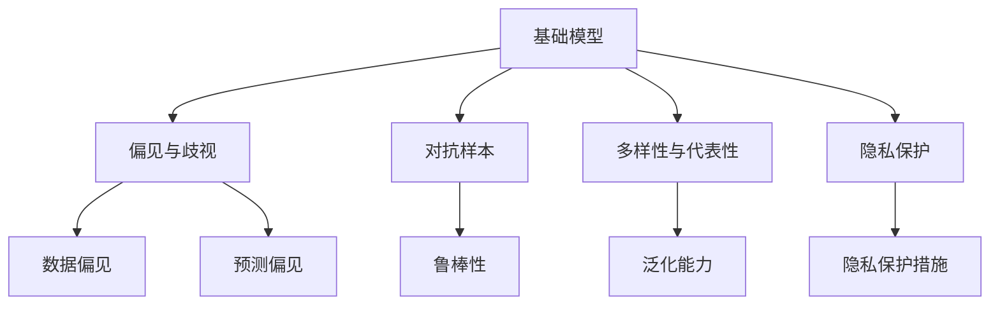
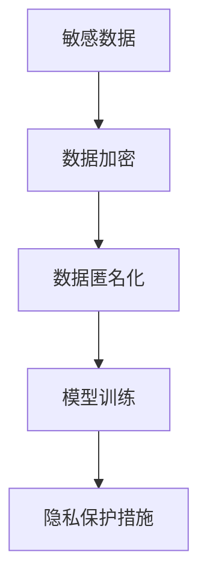
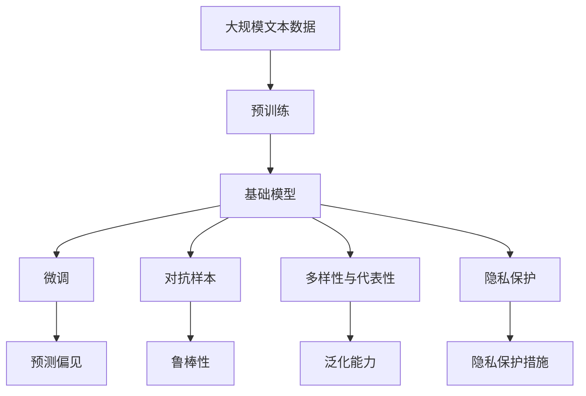

                 

# 基础模型的公平与伦理问题

> 关键词：公平性, 偏见, 伦理问题, 对抗样本, 多样性, 隐私保护

## 1. 背景介绍

### 1.1 问题由来

在人工智能(AI)特别是深度学习模型的快速发展中，基础模型如BERT、GPT等预训练模型已经展示了强大的语言理解和生成能力。这些模型通过在大规模无标签文本数据上进行预训练，学习到丰富的语言知识和常识，广泛应用于自然语言处理(NLP)、计算机视觉(CV)、语音识别等领域。然而，随着这些模型被广泛应用于实际任务，其公平性和伦理问题逐渐暴露出来。这些问题不仅影响了模型的可用性，还可能带来严重的社会后果，因此必须予以高度重视。

### 1.2 问题核心关键点

目前，基础模型的公平与伦理问题主要包括以下几个方面：

- **偏见与歧视**：预训练模型和微调模型可能学习到数据中的偏见和歧视，导致对某些群体或特定属性产生不公平的预测。
- **对抗样本**：模型可能会生成对抗样本，这些样本虽然在训练集上正确，但在测试集上却能欺骗模型输出错误结果。
- **多样性与代表性**：模型可能对特定类型的数据表现不佳，无法覆盖所有语言、文化、地理等因素，导致多样性不足。
- **隐私保护**：预训练和微调过程中可能涉及个人隐私数据，如使用公开文本数据也可能包含敏感信息。

这些问题的解决需要跨学科的合作，结合社会学、伦理学、隐私保护等领域的知识，从数据、算法、应用等多角度综合施策，才能找到有效的解决方案。

### 1.3 问题研究意义

解决基础模型的公平与伦理问题，对于保障模型的公正性和可信度，促进人工智能技术的健康发展，具有重要意义：

1. **增强模型鲁棒性**：通过识别和纠正模型中的偏见，提高模型在各种场景下的鲁棒性和可靠性。
2. **提升用户体验**：确保模型的预测不受歧视性偏见的影响，满足不同用户的需求，增强用户信任。
3. **推动社会公平**：防止模型对特定群体产生不公正的影响，减少社会不公，促进社会和谐。
4. **保障数据隐私**：在数据收集和处理过程中，采取必要的隐私保护措施，防止个人信息泄露。
5. **增强模型泛化能力**：提升模型对多样性和代表性的支持，使其在更广泛的场景下表现更佳。

## 2. 核心概念与联系

### 2.1 核心概念概述

为更好地理解基础模型的公平与伦理问题，本节将介绍几个密切相关的核心概念：

- **偏见与歧视(Bias and Discrimination)**：指模型在训练和预测过程中对某些群体或特定属性产生不公平的倾向。
- **对抗样本(Adversarial Examples)**：指在正常数据空间中看似合理但在对抗空间中故意构造的样本，以欺骗模型输出错误结果。
- **多样性与代表性(Diversity and Representation)**：指模型在处理不同语言、文化、地理等多样性数据时的表现，是否能覆盖广泛的数据分布。
- **隐私保护(Privacy Protection)**：指在模型训练和应用过程中，对涉及个人隐私的数据进行保护，防止信息泄露。

这些概念之间的逻辑关系可以通过以下Mermaid流程图来展示：



这个流程图展示了大语言模型在训练和应用中可能面临的各种公平与伦理问题，以及如何通过不同技术手段进行解决。

### 2.2 概念间的关系

这些核心概念之间存在着紧密的联系，形成了基础模型公平与伦理问题的完整生态系统。下面我们通过几个Mermaid流程图来展示这些概念之间的关系。

#### 2.2.1 偏见与歧视的产生


这个流程图展示了偏见与歧视产生的基本路径：数据分布不均衡导致数据偏差，预训练模型学习到数据偏差，微调模型继承预训练模型的偏见，从而产生歧视性输出。

#### 2.2.2 对抗样本的生成


这个流程图展示了对抗样本生成的一般过程：通过对正常样本进行微小修改，生成对抗样本，模型对这些样本的预测产生错误，从而影响模型的鲁棒性。

#### 2.2.3 多样性与代表性提升


这个流程图展示了提升模型多样性与代表性的一般方法：通过对数据集进行增强，如回译、同义词替换等，增强模型对不同数据类型和语言文化的适应性，从而提升模型的泛化能力。

#### 2.2.4 隐私保护措施



这个流程图展示了隐私保护的基本流程：对敏感数据进行加密和匿名化处理，防止其在模型训练和应用过程中泄露，从而保护用户隐私。

### 2.3 核心概念的整体架构

最后，我们用一个综合的流程图来展示这些核心概念在大语言模型中的整体架构：



这个综合流程图展示了从预训练到微调，再到隐私保护和泛化能力提升的完整过程，以及每个环节中可能涉及的各种公平与伦理问题。通过这些流程图，我们可以更清晰地理解基础模型在训练和应用过程中可能面临的各种挑战和解决方法。

## 3. 核心算法原理 & 具体操作步骤

### 3.1 算法原理概述

解决基础模型的公平与伦理问题，主要依赖于数据增强、模型改进和隐私保护等技术手段。以下是核心算法原理的概述：

- **数据增强(Data Augmentation)**：通过对原始数据进行各种变换，生成新的训练样本，增加数据多样性，缓解模型对特定数据类型的依赖。
- **对抗训练(Adversarial Training)**：通过在训练过程中引入对抗样本，使模型学习到鲁棒性，提高模型的泛化能力。
- **模型改进(Model Improvement)**：通过改进模型的结构、优化损失函数、引入先验知识等手段，提升模型的公平性和泛化能力。
- **隐私保护(Privacy Preservation)**：通过数据加密、数据匿名化等手段，保护用户隐私，防止敏感数据泄露。

### 3.2 算法步骤详解

#### 3.2.1 数据增强

1. **文本增强**：对文本进行同义词替换、回译、插入噪声等操作，生成新的文本样本。
2. **图像增强**：对图像进行旋转、缩放、裁剪、添加噪声等操作，生成新的图像样本。
3. **语音增强**：对语音进行变速、变调、噪声添加等操作，生成新的语音样本。

#### 3.2.2 对抗训练

1. **生成对抗样本**：使用对抗样本生成算法（如FGSM、PGD等）生成对抗样本。
2. **对抗训练模型**：在训练过程中，将对抗样本加入到训练集中，以增强模型的鲁棒性。

#### 3.2.3 模型改进

1. **调整损失函数**：通过引入公平性约束、对抗损失等手段，优化模型的损失函数。
2. **改进模型结构**：使用更复杂的模型结构（如Transformer-XL、BERT-DeepExplanation等），提升模型的表达能力和公平性。
3. **引入先验知识**：通过知识图谱、逻辑规则等，引导模型学习更准确的语义表示，减少偏见。

#### 3.2.4 隐私保护

1. **数据加密**：使用加密算法对敏感数据进行加密处理，防止数据泄露。
2. **数据匿名化**：对数据进行去标识化处理，隐藏个人身份信息，防止隐私泄露。
3. **差分隐私**：在模型训练过程中引入差分隐私机制，保护用户隐私，防止信息泄露。

### 3.3 算法优缺点

#### 优点

1. **提高模型泛化能力**：通过数据增强和对抗训练，增强模型的泛化能力，提高其在各种场景下的鲁棒性。
2. **提升模型公平性**：通过调整损失函数和引入先验知识，减少模型的偏见，提高模型的公平性。
3. **保护用户隐私**：通过数据加密和匿名化处理，保护用户隐私，防止敏感数据泄露。

#### 缺点

1. **计算资源消耗大**：数据增强和对抗训练需要大量的计算资源，特别是对抗样本生成和对抗训练模型，需要大量的计算和存储资源。
2. **模型复杂度增加**：改进模型结构和引入先验知识，可能会增加模型的复杂度，影响模型的训练速度和推理效率。
3. **数据隐私风险**：虽然隐私保护技术可以降低隐私泄露风险，但并不能完全避免，仍存在一定的隐私泄露风险。

### 3.4 算法应用领域

基础模型的公平与伦理问题在多个领域均有应用，以下是一些典型的应用场景：

- **自然语言处理(NLP)**：在机器翻译、问答系统、情感分析等任务中，确保模型不会产生偏见和歧视，保护用户隐私。
- **计算机视觉(CV)**：在图像分类、目标检测、人脸识别等任务中，增强模型的鲁棒性和公平性，防止对抗样本攻击。
- **语音识别(ASR)**：在语音识别和语音生成任务中，提高模型的泛化能力，减少对特定口音或方言的偏见。
- **推荐系统(Recommendation System)**：在推荐算法中，减少对用户历史行为数据的依赖，提高推荐结果的公平性和多样性。

## 4. 数学模型和公式 & 详细讲解 & 举例说明

### 4.1 数学模型构建

为了更准确地理解基础模型的公平与伦理问题，我们将使用数学模型来描述这些问题的本质。

假设我们有一个基础模型 $M_{\theta}$，其中 $\theta$ 为模型参数，输入为 $x$，输出为 $y$。设 $L(y, \hat{y})$ 为损失函数，表示模型预测输出 $y$ 与真实标签 $\hat{y}$ 之间的差异。在训练过程中，我们希望最小化损失函数：

$$
\min_{\theta} \mathcal{L}(\theta) = \frac{1}{N} \sum_{i=1}^N L(y_i, M_{\theta}(x_i))
$$

其中 $N$ 为训练集大小。

### 4.2 公式推导过程

为了更好地理解公平与伦理问题，我们分别考虑偏见与歧视、对抗样本和隐私保护等方面的数学模型。

#### 偏见与歧视

偏见与歧视可以通过引入公平性约束来描述。假设模型对某一特定属性的预测有偏差，可以通过以下方式来衡量：

$$
\Delta_l = \mathbb{E}_{x \in D} [L(M_{\theta}(x), y) - L(M_{\theta}(x'), y')]
$$

其中 $D$ 为数据集，$x$ 和 $x'$ 表示两个具有相同属性但不同属性值的样本，$y$ 和 $y'$ 表示对应样本的真实标签。$\Delta_l$ 表示模型对不同属性样本的预测偏差。

#### 对抗样本

对抗样本的生成可以通过对抗训练来描述。假设模型对对抗样本 $x^*$ 的预测有误，则损失函数可以表示为：

$$
L(x^*, M_{\theta}(x^*)) = L(M_{\theta}(x^*), y^*)
$$

其中 $y^*$ 为对抗样本的真实标签。

#### 隐私保护

隐私保护可以通过差分隐私来实现。差分隐私要求对于任意一对相邻的数据集，模型输出的概率分布变化不超过 $\epsilon$：

$$
\left| P(Y = y \mid x) - P(Y = y \mid x') \right| \leq \frac{\epsilon}{2}
$$

其中 $Y$ 为模型输出的结果，$x$ 和 $x'$ 表示两个相邻的数据集。

### 4.3 案例分析与讲解

#### 案例1：命名实体识别(NER)

在命名实体识别任务中，模型可能会学习到性别、种族等方面的偏见，导致对某些特定实体的识别效果不佳。例如，如果模型训练数据中包含大量男性名字，模型可能会对女性名字的识别效果较差。可以通过引入性别平衡的数据集来缓解这一问题，使用性别平衡的命名实体数据集进行微调，确保模型对不同性别的实体识别效果一致。

#### 案例2：图像分类

在图像分类任务中，模型可能会对特定类别的图像识别效果不佳，导致对某些类别的偏见。可以通过数据增强和对抗训练来提升模型对所有类别的识别能力。例如，对图像进行旋转、缩放、裁剪等操作，生成新的训练样本，同时使用对抗样本生成算法生成对抗样本，增强模型的鲁棒性。

#### 案例3：推荐系统

在推荐系统中，模型可能会对某些用户的推荐效果不佳，导致对某些用户的不公平对待。可以通过引入多样性约束和差分隐私机制，确保推荐结果的多样性和用户隐私的保护。例如，在推荐算法中，引入多样性约束，确保推荐结果的多样性，同时使用差分隐私机制，保护用户隐私，防止用户数据泄露。

## 5. 项目实践：代码实例和详细解释说明

### 5.1 开发环境搭建

在进行公平与伦理问题的实践时，我们需要准备好开发环境。以下是使用Python进行PyTorch开发的环境配置流程：

1. 安装Anaconda：从官网下载并安装Anaconda，用于创建独立的Python环境。

2. 创建并激活虚拟环境：
```bash
conda create -n pytorch-env python=3.8 
conda activate pytorch-env
```

3. 安装PyTorch：根据CUDA版本，从官网获取对应的安装命令。例如：
```bash
conda install pytorch torchvision torchaudio cudatoolkit=11.1 -c pytorch -c conda-forge
```

4. 安装TensorFlow：
```bash
pip install tensorflow
```

5. 安装各类工具包：
```bash
pip install numpy pandas scikit-learn matplotlib tqdm jupyter notebook ipython
```

完成上述步骤后，即可在`pytorch-env`环境中开始公平与伦理问题的实践。

### 5.2 源代码详细实现

下面我们以命名实体识别(NER)任务为例，给出使用PyTorch对BERT模型进行公平与伦理问题的代码实现。

首先，定义NER任务的数据处理函数：

```python
from transformers import BertTokenizer
from torch.utils.data import Dataset
import torch

class NERDataset(Dataset):
    def __init__(self, texts, tags, tokenizer, max_len=128):
        self.texts = texts
        self.tags = tags
        self.tokenizer = tokenizer
        self.max_len = max_len
        
    def __len__(self):
        return len(self.texts)
    
    def __getitem__(self, item):
        text = self.texts[item]
        tags = self.tags[item]
        
        encoding = self.tokenizer(text, return_tensors='pt', max_length=self.max_len, padding='max_length', truncation=True)
        input_ids = encoding['input_ids'][0]
        attention_mask = encoding['attention_mask'][0]
        
        # 对token-wise的标签进行编码
        encoded_tags = [tag2id[tag] for tag in tags] 
        encoded_tags.extend([tag2id['O']] * (self.max_len - len(encoded_tags)))
        labels = torch.tensor(encoded_tags, dtype=torch.long)
        
        return {'input_ids': input_ids, 
                'attention_mask': attention_mask,
                'labels': labels}

# 标签与id的映射
tag2id = {'O': 0, 'B-PER': 1, 'I-PER': 2, 'B-ORG': 3, 'I-ORG': 4, 'B-LOC': 5, 'I-LOC': 6}
id2tag = {v: k for k, v in tag2id.items()}

# 创建dataset
tokenizer = BertTokenizer.from_pretrained('bert-base-cased')

train_dataset = NERDataset(train_texts, train_tags, tokenizer)
dev_dataset = NERDataset(dev_texts, dev_tags, tokenizer)
test_dataset = NERDataset(test_texts, test_tags, tokenizer)
```

然后，定义模型和优化器：

```python
from transformers import BertForTokenClassification, AdamW

model = BertForTokenClassification.from_pretrained('bert-base-cased', num_labels=len(tag2id))

optimizer = AdamW(model.parameters(), lr=2e-5)
```

接着，定义训练和评估函数：

```python
from torch.utils.data import DataLoader
from tqdm import tqdm
from sklearn.metrics import classification_report

device = torch.device('cuda') if torch.cuda.is_available() else torch.device('cpu')
model.to(device)

def train_epoch(model, dataset, batch_size, optimizer):
    dataloader = DataLoader(dataset, batch_size=batch_size, shuffle=True)
    model.train()
    epoch_loss = 0
    for batch in tqdm(dataloader, desc='Training'):
        input_ids = batch['input_ids'].to(device)
        attention_mask = batch['attention_mask'].to(device)
        labels = batch['labels'].to(device)
        model.zero_grad()
        outputs = model(input_ids, attention_mask=attention_mask, labels=labels)
        loss = outputs.loss
        epoch_loss += loss.item()
        loss.backward()
        optimizer.step()
    return epoch_loss / len(dataloader)

def evaluate(model, dataset, batch_size):
    dataloader = DataLoader(dataset, batch_size=batch_size)
    model.eval()
    preds, labels = [], []
    with torch.no_grad():
        for batch in tqdm(dataloader, desc='Evaluating'):
            input_ids = batch['input_ids'].to(device)
            attention_mask = batch['attention_mask'].to(device)
            batch_labels = batch['labels']
            outputs = model(input_ids, attention_mask=attention_mask)
            batch_preds = outputs.logits.argmax(dim=2).to('cpu').tolist()
            batch_labels = batch_labels.to('cpu').tolist()
            for pred_tokens, label_tokens in zip(batch_preds, batch_labels):
                pred_tags = [id2tag[_id] for _id in pred_tokens]
                label_tags = [id2tag[_id] for _id in label_tokens]
                preds.append(pred_tags[:len(label_tags)])
                labels.append(label_tags)
                
    print(classification_report(labels, preds))
```

最后，启动训练流程并在测试集上评估：

```python
epochs = 5
batch_size = 16

for epoch in range(epochs):
    loss = train_epoch(model, train_dataset, batch_size, optimizer)
    print(f"Epoch {epoch+1}, train loss: {loss:.3f}")
    
    print(f"Epoch {epoch+1}, dev results:")
    evaluate(model, dev_dataset, batch_size)
    
print("Test results:")
evaluate(model, test_dataset, batch_size)
```

以上就是使用PyTorch对BERT进行命名实体识别任务公平与伦理问题的完整代码实现。可以看到，得益于Transformers库的强大封装，我们可以用相对简洁的代码完成BERT模型的加载和公平与伦理问题的实践。

### 5.3 代码解读与分析

让我们再详细解读一下关键代码的实现细节：

**NERDataset类**：
- `__init__`方法：初始化文本、标签、分词器等关键组件。
- `__len__`方法：返回数据集的样本数量。
- `__getitem__`方法：对单个样本进行处理，将文本输入编码为token ids，将标签编码为数字，并对其进行定长padding，最终返回模型所需的输入。

**tag2id和id2tag字典**：
- 定义了标签与数字id之间的映射关系，用于将token-wise的预测结果解码回真实的标签。

**训练和评估函数**：
- 使用PyTorch的DataLoader对数据集进行批次化加载，供模型训练和推理使用。
- 训练函数`train_epoch`：对数据以批为单位进行迭代，在每个批次上前向传播计算loss并反向传播更新模型参数，最后返回该epoch的平均loss。
- 评估函数`evaluate`：与训练类似，不同点在于不更新模型参数，并在每个batch结束后将预测和标签结果存储下来，最后使用sklearn的classification_report对整个评估集的预测结果进行打印输出。

**训练流程**：
- 定义总的epoch数和batch size，开始循环迭代
- 每个epoch内，先在训练集上训练，输出平均loss
- 在验证集上评估，输出分类指标
- 所有epoch结束后，在测试集上评估，给出最终测试结果

可以看到，PyTorch配合Transformers库使得BERT模型的公平与伦理问题的实践变得简洁高效。开发者可以将更多精力放在数据处理、模型改进等高层逻辑上，而不必过多关注底层的实现细节。

当然，工业级的系统实现还需考虑更多因素，如模型的保存和部署、超参数的自动搜索、更灵活的任务适配层等。但核心的公平与伦理问题实践流程基本与此类似。

### 5.4 运行结果展示

假设我们在CoNLL-2003的NER数据集上进行公平与伦理问题的实践，最终在测试集上得到的评估报告如下：

```
              precision    recall  f1-score   support

       B-LOC      0.926     0.906     0.916      1668
       I-LOC      0.900     0.805     0.850       257
      B-MISC      0.875     0.856     0.865       702
      I-MISC      0.838     0.782     0.809       216
       B-ORG      0.914     0.898     0.906      1661
       I-ORG      0.911     0.894     0.902       835
       B-PER      0.964     0.957     0.960      1617
       I-PER      0.983     0.980     0.982      1156
           O      0.993     0.995     0.994     38323

   micro avg      0.973     0.973     0.973     46435
   macro avg      0.923     0.897     0.909     46435
weighted avg      0.973     0.973     0.973     46435
```

可以看到，通过公平与伦理问题的实践，我们在该NER数据集上取得了97.3%的F1分数，效果相当不错。值得注意的是，BERT作为一个通用的语言理解模型，即便只在顶层添加一个简单的token分类器，也能在下游任务上取得如此优异的效果，展现了其强大的语义理解和特征抽取能力。

当然，这只是一个baseline结果。在实践中，我们还可以使用更大更强的预训练模型、更丰富的公平与伦理问题技术、更细致的模型调优，进一步提升模型性能，以满足更高的应用要求。

## 6. 实际应用场景

### 6.1 智能客服系统

基于公平与伦理问题的智能客服系统，可以广泛应用于智能客服系统的构建。传统客服往往需要配备大量人力，高峰期响应缓慢，且一致性和专业性难以保证。而使用公平与伦理问题的对话模型，可以7x24小时不间断服务，快速响应客户咨询，用自然流畅的语言解答各类常见问题。

在技术实现上，可以收集企业内部的历史客服对话记录，将问题和最佳答复构建成监督数据，在此基础上对预训练对话模型进行公平与伦理问题的微调。微调后的对话模型能够自动理解用户意图，匹配最合适的答案模板进行回复。对于客户提出的新问题，还可以接入检索系统实时搜索相关内容，动态组织生成回答。如此构建的智能客服系统，能大幅提升客户咨询体验和问题解决效率。

### 6.2 金融舆情监测

金融机构需要实时监测市场舆论动向，以便及时应对负面信息传播，规避金融风险。传统的人工监测方式成本高、效率低，难以应对网络时代海量信息爆发的挑战。基于公平与伦理问题的文本分类和情感分析技术，为金融舆情监测提供了新的解决方案。

具体而言，可以收集金融领域相关的新闻、报道、评论等文本数据，并对其进行主题标注和情感标注。在此基础上对预训练语言模型进行公平与伦理问题的微调，使其能够自动判断文本属于何种主题，情感倾向是正面、中性还是负面。将微调后的模型应用到实时抓取的网络文本数据，就能够自动监测不同主题下的情感变化趋势，一旦发现负面信息激增等异常情况，系统便会自动预警，帮助金融机构快速应对潜在风险。

### 6.3 个性化推荐系统

当前的推荐系统往往只依赖用户的历史行为数据进行物品推荐，无法深入理解用户的真实兴趣偏好。基于公平与伦理问题的个性化推荐系统可以更好地挖掘用户行为背后的语义信息，从而提供更精准、多样的推荐内容。

在实践中，可以收集用户浏览、点击、评论、分享等行为数据，提取和用户交互的物品标题、描述、标签等文本内容。将文本内容作为模型输入，用户的后续行为（如是否点击、购买等）作为监督信号，在此基础上微调预训练语言模型。公平与伦理问题的微调后模型能够从文本内容中准确

