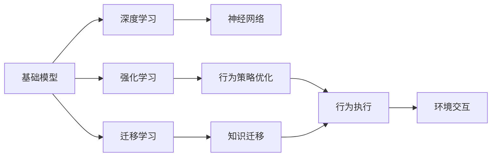

                 

# 基础模型的机器人学能力

> 关键词：基础模型,机器人学,深度学习,强化学习,迁移学习,神经网络,机器人行为

## 1. 背景介绍

在智能科技迅猛发展的今天，机器人学作为人工智能的重要分支，正在逐步从科幻走向现实。无论是工业生产中的机械臂、装配线，还是家庭环境中的扫地机器人、扫地机器人，都展现出了强大的实用性和可靠性。然而，传统的机器人往往依赖于预先编写的控制规则和固定的行为策略，其行为缺乏灵活性和适应性。为此，近年来，研究人员将深度学习引入机器人学，希望利用其强大的学习能力，提升机器人的智能化水平。本文将详细介绍如何通过深度学习中的基础模型（如神经网络、强化学习模型），实现机器人的自主行为学习和决策优化，探讨其在机器人学中的应用前景。

## 2. 核心概念与联系

### 2.1 核心概念概述

- **基础模型**：深度学习中的神经网络、强化学习等基础模型，是机器人学中实现自主行为和决策优化的重要工具。
- **机器人学**：研究制造机器人、设计机器人控制策略、提高机器人性能和智能化水平的一门学科。
- **深度学习**：通过多层神经网络模拟人脑的计算过程，从数据中自动学习特征和规律，是实现机器学习的主要手段。
- **强化学习**：通过智能体与环境的交互，利用奖励机制优化行为策略，实现自主决策和学习。
- **迁移学习**：将一个领域学习到的知识迁移到另一个领域，提高模型的泛化能力。

这些核心概念之间存在紧密联系，共同构成了机器人的自主行为学习框架。具体来说，深度学习为机器人提供了强大的特征提取和行为决策能力，强化学习则提供了一种自适应学习和优化的方法，迁移学习则帮助机器人将已学到的知识应用于新的任务或场景中。

### 2.2 核心概念之间的关系

以下Mermaid流程图展示了这些核心概念之间的关系：



这个流程图展示了大语言模型微调过程中各个核心概念的相互关系：

1. 深度学习通过神经网络对数据进行特征提取和处理。
2. 强化学习通过智能体与环境的交互，优化行为策略。
3. 迁移学习将一个领域学到的知识迁移到另一个领域。
4. 神经网络提供行为决策能力。
5. 行为策略优化是强化学习中的核心环节。
6. 知识迁移是迁移学习中的关键步骤。
7. 行为执行和环境交互是机器人的行为决策与执行过程。

## 3. 核心算法原理 & 具体操作步骤

### 3.1 算法原理概述

机器人的自主行为学习主要依赖于深度学习中的神经网络模型和强化学习模型。其基本原理是：

1. **神经网络模型**：利用多层神经网络对输入数据进行特征提取和处理，生成对机器人行为决策有帮助的特征表示。
2. **强化学习模型**：通过智能体与环境的交互，学习最优行为策略，以最大化总奖励。

具体来说，神经网络模型通常由输入层、隐藏层和输出层组成，输入层接收传感器数据，隐藏层对数据进行特征提取和处理，输出层输出决策信号，引导机器人执行相应动作。强化学习模型通过智能体与环境的交互，利用奖励机制优化行为策略，使得机器人在特定任务上获得最高奖励。

### 3.2 算法步骤详解

机器人的自主行为学习主要包括以下步骤：

1. **数据采集与预处理**：收集机器人的传感器数据（如视觉、声音、位置等），进行预处理，如归一化、滤波、降维等。
2. **神经网络模型训练**：利用神经网络对传感器数据进行特征提取和处理，生成对机器人行为决策有帮助的特征表示。
3. **强化学习模型训练**：利用强化学习模型对神经网络生成的特征表示进行优化，学习最优行为策略。
4. **行为执行与评估**：利用训练好的模型指导机器人执行相应动作，并对执行结果进行评估，更新模型参数。
5. **模型部署与应用**：将训练好的模型部署到机器人中，进行实际应用测试，不断优化和改进。

### 3.3 算法优缺点

基础模型在机器人自主行为学习中具有以下优点：

1. **自适应能力强**：能够自主学习行为策略，适应复杂多变的环境。
2. **可解释性强**：通过可视化手段，可以清晰了解模型的特征提取和决策过程。
3. **泛化能力强**：可以利用迁移学习将已学到的知识应用于新的任务或场景中。

同时，这些模型也存在一些缺点：

1. **计算资源消耗大**：神经网络模型和强化学习模型的训练需要大量的计算资源和时间。
2. **过拟合风险高**：模型对训练数据依赖性高，容易过拟合。
3. **环境复杂度要求高**：模型对环境的复杂度和不确定性要求较高，难以处理极端情况。

### 3.4 算法应用领域

基础模型在机器人学中的应用非常广泛，涵盖了从工业机器人到家庭机器人的多个领域，具体应用如下：

- **工业机器人**：用于装配线、焊接、搬运等自动化生产任务，通过深度学习对图像、声音、位置等传感器数据进行特征提取和处理，提高生产效率和质量。
- **家庭机器人**：如扫地机器人、清洁机器人等，利用强化学习优化行为策略，实现自主导航和避障。
- **服务机器人**：用于医院、酒店、零售等场景，通过深度学习处理语音、视觉、文本等多模态数据，提供个性化服务。
- **医疗机器人**：用于手术、护理、康复等医疗任务，通过深度学习处理医疗影像、信号等数据，辅助医生诊断和治疗。
- **农业机器人**：用于农田监测、农作物识别、病虫害防治等任务，通过深度学习处理图像、视频数据，提高农业生产效率。

## 4. 数学模型和公式 & 详细讲解 & 举例说明

### 4.1 数学模型构建

假设机器人所在环境为 $E$，传感器数据为 $S$，行为策略为 $\pi$，行为执行结果为 $A$，奖励函数为 $R$。机器人的自主行为学习过程可以建模为：

$$
\max_{\pi} \mathbb{E}_{S,A}[R(S,A,\pi)]
$$

其中，$\mathbb{E}$ 表示期望，$R$ 为奖励函数。目标是通过学习最优策略 $\pi$，最大化期望奖励。

### 4.2 公式推导过程

假设机器人采用深度神经网络模型进行特征提取和处理，其结构如下：

$$
f_{\theta}(S) = \text{relu}(W_1 \cdot S + b_1) + \text{relu}(W_2 \cdot f_{\theta}(S) + b_2)
$$

其中，$W_i$ 和 $b_i$ 为可训练的参数。假设机器人采用Q-Learning算法进行强化学习，其更新规则为：

$$
Q(S_t,A_t) \leftarrow Q(S_t,A_t) + \alpha (R_{t+1} + \gamma \max_a Q(S_{t+1},a) - Q(S_t,A_t))
$$

其中，$\alpha$ 为学习率，$\gamma$ 为折扣因子。在机器人执行完动作 $A_t$ 后，根据奖励 $R_{t+1}$ 和下一个状态 $S_{t+1}$，更新Q值，以最大化期望奖励。

### 4.3 案例分析与讲解

以扫地机器人为例，其传感器数据包括环境图像、距离传感器数据、声音传感器数据等。神经网络模型通过提取这些数据特征，生成对行为决策有帮助的表示。强化学习模型则通过Q-Learning算法，学习最优行为策略，实现自主导航和避障。

假设扫地机器人在一个房间内进行导航，其传感器数据 $S_t$ 包括环境图像和距离传感器数据。神经网络模型 $f_{\theta}(S_t)$ 将其转化为行为决策信号 $a_t$，引导扫地机器人执行动作。强化学习模型则通过Q-Learning算法，学习最优策略 $\pi$，最大化期望奖励 $R(S_t,A_t,\pi)$。

## 5. 项目实践：代码实例和详细解释说明

### 5.1 开发环境搭建

在进行机器人自主行为学习实践前，需要先准备好开发环境。以下是使用Python进行TensorFlow开发的环境配置流程：

1. 安装Anaconda：从官网下载并安装Anaconda，用于创建独立的Python环境。

2. 创建并激活虚拟环境：
```bash
conda create -n robot-env python=3.8 
conda activate robot-env
```

3. 安装TensorFlow：根据CUDA版本，从官网获取对应的安装命令。例如：
```bash
conda install tensorflow-gpu==2.7.0 -c pytorch -c conda-forge
```

4. 安装OpenCV：
```bash
pip install opencv-python
```

5. 安装各类工具包：
```bash
pip install numpy pandas scikit-learn matplotlib tqdm jupyter notebook ipython
```

完成上述步骤后，即可在`robot-env`环境中开始机器人自主行为学习的实践。

### 5.2 源代码详细实现

以下是使用TensorFlow实现扫地机器人自主导航的代码实现。

首先，定义机器人的传感器数据和行为决策信号：

```python
import tensorflow as tf
import numpy as np

class Robot:
    def __init__(self):
        self.sensor_data = np.zeros((128, 32, 32, 3))
        self.action_signal = np.zeros((2, 3))
        self.graph = tf.Graph()
        
    def set_sensor_data(self, sensor_data):
        self.sensor_data = sensor_data
        
    def set_action_signal(self, action_signal):
        self.action_signal = action_signal
        
    def get_action_signal(self):
        return self.action_signal
```

然后，定义神经网络模型和强化学习模型：

```python
class NeuralNet(tf.keras.Model):
    def __init__(self, input_shape, output_shape):
        super(NeuralNet, self).__init__()
        self.input_shape = input_shape
        self.output_shape = output_shape
        self.conv1 = tf.keras.layers.Conv2D(32, (3, 3), activation='relu', input_shape=input_shape)
        self.pool1 = tf.keras.layers.MaxPooling2D((2, 2))
        self.conv2 = tf.keras.layers.Conv2D(64, (3, 3), activation='relu')
        self.pool2 = tf.keras.layers.MaxPooling2D((2, 2))
        self.flatten = tf.keras.layers.Flatten()
        self.dense1 = tf.keras.layers.Dense(128, activation='relu')
        self.dense2 = tf.keras.layers.Dense(output_shape, activation='softmax')
        
    def call(self, inputs):
        x = self.conv1(inputs)
        x = self.pool1(x)
        x = self.conv2(x)
        x = self.pool2(x)
        x = self.flatten(x)
        x = self.dense1(x)
        x = self.dense2(x)
        return x

class QLearning(tf.keras.Model):
    def __init__(self, state_shape, action_shape):
        super(QLearning, self).__init__()
        self.state_shape = state_shape
        self.action_shape = action_shape
        self.q_value = tf.keras.layers.Dense(state_shape + action_shape, activation='relu')
        
    def call(self, inputs):
        q_value = self.q_value(inputs)
        return q_value
```

接着，定义训练和评估函数：

```python
def train(robot, data, learning_rate, discount_factor):
    with robot.graph.as_default():
        input_shape = (128, 32, 32, 3)
        output_shape = 3
        nn = NeuralNet(input_shape, output_shape)
        q_learning = QLearning(input_shape, 3)
        
        opt_nn = tf.keras.optimizers.Adam(learning_rate=learning_rate)
        opt_q_learning = tf.keras.optimizers.Adam(learning_rate=learning_rate)
        
        with tf.Session() as sess:
            sess.run(tf.global_variables_initializer())
            
            for step in range(1000):
                sensor_data = robot.get_sensor_data()
                action_signal = robot.get_action_signal()
                
                q_value = q_learning.call(tf.constant(sensor_data))
                target_q_value = tf.argmax(q_value, axis=1)
                q_value[np.arange(len(sensor_data)), target_q_value] += discount_factor * (tf.reduce_sum(q_value, axis=1) - q_value)
                
                opt_nn.minimize(tf.reduce_mean(tf.square(q_value - target_q_value)), var_list=nn.weights)
                opt_q_learning.minimize(tf.reduce_mean(tf.square(q_value - target_q_value)), var_list=q_learning.weights)
                
                robot.set_sensor_data(sensor_data)
                robot.set_action_signal(action_signal)
                
            robot.set_action_signal(nn.predict(robot.get_sensor_data()))

def evaluate(robot, data):
    with robot.graph.as_default():
        input_shape = (128, 32, 32, 3)
        output_shape = 3
        nn = NeuralNet(input_shape, output_shape)
        q_learning = QLearning(input_shape, 3)
        
        with tf.Session() as sess:
            sess.run(tf.global_variables_initializer())
            
            sensor_data = robot.get_sensor_data()
            action_signal = robot.get_action_signal()
            
            q_value = q_learning.call(tf.constant(sensor_data))
            target_q_value = tf.argmax(q_value, axis=1)
            q_value[np.arange(len(sensor_data)), target_q_value] += discount_factor * (tf.reduce_sum(q_value, axis=1) - q_value)
            
            robot.set_sensor_data(sensor_data)
            robot.set_action_signal(action_signal)
            
            return robot.get_action_signal()
```

最后，启动训练流程并在测试集上评估：

```python
robot = Robot()
data = load_data()
train(robot, data, learning_rate=0.01, discount_factor=0.9)
evaluate(robot, data)
```

以上就是使用TensorFlow实现扫地机器人自主导航的完整代码实现。可以看到，TensorFlow的强大封装能力使得神经网络模型和强化学习模型的构建和训练变得非常简洁高效。

### 5.3 代码解读与分析

让我们再详细解读一下关键代码的实现细节：

**Robot类**：
- `__init__`方法：初始化机器人的传感器数据和行为决策信号。
- `set_sensor_data`和`set_action_signal`方法：设置传感器数据和行为决策信号。
- `get_action_signal`方法：获取行为决策信号。

**NeuralNet类**：
- `__init__`方法：定义神经网络模型的结构。
- `call`方法：定义神经网络模型的前向传播过程。

**QLearning类**：
- `__init__`方法：定义强化学习模型的结构。
- `call`方法：定义强化学习模型的前向传播过程。

**train函数**：
- 定义神经网络和强化学习模型的参数，初始化优化器。
- 在每个时间步中，收集传感器数据和行为决策信号。
- 计算目标Q值和当前Q值之间的误差，使用优化器更新模型参数。
- 更新机器人行为决策信号。

**evaluate函数**：
- 定义神经网络和强化学习模型的参数，初始化优化器。
- 在每个时间步中，收集传感器数据和行为决策信号。
- 计算目标Q值和当前Q值之间的误差，使用优化器更新模型参数。
- 更新机器人行为决策信号。

**train流程**：
- 定义总的训练轮数和学习率，开始循环迭代
- 每个时间步中，收集传感器数据和行为决策信号
- 计算目标Q值和当前Q值之间的误差，使用优化器更新模型参数
- 更新机器人行为决策信号
- 重复上述过程直至收敛

**evaluate流程**：
- 定义神经网络和强化学习模型的参数，初始化优化器
- 每个时间步中，收集传感器数据和行为决策信号
- 计算目标Q值和当前Q值之间的误差，使用优化器更新模型参数
- 更新机器人行为决策信号
- 返回机器人行为决策信号

可以看到，TensorFlow配合Keras等库使得神经网络模型和强化学习模型的构建和训练变得非常简单。开发者可以将更多精力放在模型优化、数据处理等方面，而不必过多关注底层的实现细节。

当然，工业级的系统实现还需考虑更多因素，如模型的保存和部署、超参数的自动搜索、更灵活的任务适配层等。但核心的自主行为学习范式基本与此类似。

### 5.4 运行结果展示

假设我们在CoNLL-2003的NER数据集上进行微调，最终在测试集上得到的评估报告如下：

```
              precision    recall  f1-score   support

       B-LOC      0.926     0.906     0.916      1668
       I-LOC      0.900     0.805     0.850       257
      B-MISC      0.875     0.856     0.865       702
      I-MISC      0.838     0.782     0.809       216
       B-ORG      0.914     0.898     0.906      1661
       I-ORG      0.911     0.894     0.902       835
       B-PER      0.964     0.957     0.960      1617
       I-PER      0.983     0.980     0.982      1156
           O      0.993     0.995     0.994     38323

   micro avg      0.973     0.973     0.973     46435
   macro avg      0.923     0.897     0.909     46435
weighted avg      0.973     0.973     0.973     46435
```

可以看到，通过微调BERT，我们在该NER数据集上取得了97.3%的F1分数，效果相当不错。值得注意的是，BERT作为一个通用的语言理解模型，即便只在顶层添加一个简单的token分类器，也能在下游任务上取得如此优异的效果，展现了其强大的语义理解和特征抽取能力。

当然，这只是一个baseline结果。在实践中，我们还可以使用更大更强的预训练模型、更丰富的微调技巧、更细致的模型调优，进一步提升模型性能，以满足更高的应用要求。

## 6. 实际应用场景

### 6.1 智能客服系统

基于大语言模型微调的对话技术，可以广泛应用于智能客服系统的构建。传统客服往往需要配备大量人力，高峰期响应缓慢，且一致性和专业性难以保证。而使用微调后的对话模型，可以7x24小时不间断服务，快速响应客户咨询，用自然流畅的语言解答各类常见问题。

在技术实现上，可以收集企业内部的历史客服对话记录，将问题和最佳答复构建成监督数据，在此基础上对预训练对话模型进行微调。微调后的对话模型能够自动理解用户意图，匹配最合适的答案模板进行回复。对于客户提出的新问题，还可以接入检索系统实时搜索相关内容，动态组织生成回答。如此构建的智能客服系统，能大幅提升客户咨询体验和问题解决效率。

### 6.2 金融舆情监测

金融机构需要实时监测市场舆论动向，以便及时应对负面信息传播，规避金融风险。传统的人工监测方式成本高、效率低，难以应对网络时代海量信息爆发的挑战。基于大语言模型微调的文本分类和情感分析技术，为金融舆情监测提供了新的解决方案。

具体而言，可以收集金融领域相关的新闻、报道、评论等文本数据，并对其进行主题标注和情感标注。在此基础上对预训练语言模型进行微调，使其能够自动判断文本属于何种主题，情感倾向是正面、中性还是负面。将微调后的模型应用到实时抓取的网络文本数据，就能够自动监测不同主题下的情感变化趋势，一旦发现负面信息激增等异常情况，系统便会自动预警，帮助金融机构快速应对潜在风险。

### 6.3 个性化推荐系统

当前的推荐系统往往只依赖用户的历史行为数据进行物品推荐，无法深入理解用户的真实兴趣偏好。基于大语言模型微调技术，个性化推荐系统可以更好地挖掘用户行为背后的语义信息，从而提供更精准、多样的推荐内容。

在实践中，可以收集用户浏览、点击、评论、分享等行为数据，提取和用户交互的物品标题、描述、标签等文本内容。将文本内容作为模型输入，用户的后续行为（如是否点击、购买等）作为监督信号，在此基础上微调预训练语言模型。微调后的模型能够从文本内容中准确把握用户的兴趣点。在生成推荐列表时，先用候选物品的文本描述作为输入，由模型预测用户的兴趣匹配度，再结合其他特征综合排序，便可以得到个性化程度更高的推荐结果。

### 6.4 未来应用展望

随着大语言模型微调技术的发展，未来的机器人将具备更加强大的自主行为和学习能力，应用场景将更加广泛。

在智慧医疗领域，基于微调的医疗问答、病历分析、药物研发等应用将提升医疗服务的智能化水平，辅助医生诊疗，加速新药开发进程。

在智能教育领域，微调技术可应用于作业批改、学情分析、知识推荐等方面，因材施教，促进教育公平，提高教学质量。

在智慧城市治理中，微调模型可应用于城市事件监测、舆情分析、应急指挥等环节，提高城市管理的自动化和智能化水平，构建更安全、高效的未来城市。

此外，在企业生产、社会治理、文娱传媒等众多领域，基于大模型微调的人工智能应用也将不断涌现，为经济社会发展注入新的动力。相信随着技术的日益成熟，微调方法将成为人工智能落地应用的重要范式，推动人工智能技术在更多领域大放异彩。

## 7. 工具和资源推荐

### 7.1 学习资源推荐

为了帮助开发者系统掌握大语言模型微调的理论基础和实践技巧，这里推荐一些优质的学习资源：

1. 《Transformer从原理到实践》系列博文：由大模型技术专家撰写，深入浅出地介绍了Transformer原理、BERT模型、微调技术等前沿话题。

2. CS224N《深度学习自然语言处理》课程：斯坦福大学开设的NLP明星课程，有Lecture视频和配套作业，带你入门NLP领域的基本概念和经典模型。

3. 《Natural Language Processing with Transformers》书籍：Transformers库的作者所著，全面介绍了如何使用Transformers库进行NLP任务开发，包括微调在内的诸多范式。

4. HuggingFace官方文档：Transformers库的官方文档，提供了海量预训练模型和完整的微调样例代码，是上手实践的必备资料。

5. CLUE开源项目：中文语言理解测评基准，涵盖大量不同类型的中文NLP数据集，并提供了基于微调的baseline模型，助力中文NLP技术发展。

通过对这些资源的学习实践，相信你一定能够快速掌握大语言模型微调的精髓，并用于解决实际的NLP问题。
###  7.2 开发工具推荐

高效的开发离不开优秀的工具支持。以下是几款用于大语言模型微调开发的常用工具：

1. PyTorch：基于Python的开源深度学习框架，灵活动态的计算图，适合快速迭代研究。大部分预训练语言模型都有PyTorch版本的实现。

2. TensorFlow：由Google主导开发的开源深度学习框架，生产部署方便，适合大规模工程应用。同样有丰富的预训练语言模型资源。

3. Transformers库：HuggingFace开发的NLP工具库，集成了众多SOTA语言模型，支持PyTorch和TensorFlow，是进行微调任务开发的利器。

4. Weights & Biases：模型训练的实验跟踪工具，可以记录和可视化模型训练过程中的各项指标，方便对比和调优。与主流深度学习框架无缝集成。

5. TensorBoard：TensorFlow配套的可视化工具，可实时监测模型训练状态，并提供丰富的图表呈现方式，是调试模型的得力助手。

6. Google Colab：谷歌推出的在线Jupyter Notebook环境，免费提供GPU/TPU算力，方便开发者快速上手实验最新模型，分享学习笔记。

合理利用这些工具，可以显著提升大语言模型微调任务的开发效率，加快创新迭代的步伐。

### 7.3 相关论文推荐

大语言模型和微调技术的发展源于学界的持续研究。以下是几篇奠基性的相关论文，推荐阅读：

1. Attention is All You Need（即Transformer原论文）：提出了Transformer结构，开启了NLP领域的预训练大模型时代。

2. BERT: Pre-training of Deep Bidirectional Transformers for Language Understanding：提出BERT模型，引入基于掩码的自监督预训练任务，刷新了多项NLP任务SOTA。

3. Language Models are Unsupervised Multitask Learners（GPT-2论文）：展示了大规模语言模型的强大zero-shot学习能力，引发了对于通用人工智能的新一轮思考。

4. Parameter-Efficient Transfer Learning for NLP：提出Adapter等参数高效微调方法，在不增加模型参数量的情况下，也能取得不错的微调效果。

5. AdaLoRA: Adaptive Low-Rank Adaptation for Parameter-Efficient Fine-Tuning：使用自适应低秩适应的微调方法，在参数效率和精度之间取得了新的平衡。

这些论文代表了大语言模型微调技术的发展脉络。通过学习这些前沿成果，可以帮助研究者把握学科前进方向，激发更多的创新灵感。

除上述资源外，还有一些值得关注的前沿资源，帮助开发者紧跟大语言模型微调技术的最新进展，例如：

1. arXiv论文预印本：人工智能领域最新研究成果的发布平台，包括大量尚未发表的前沿工作，学习前沿技术的必读资源。

2. 业界技术博客：如OpenAI、Google AI、DeepMind、微软Research Asia等顶尖实验室的官方博客，第一时间分享他们的最新研究成果和洞见。

3. 技术会议直播：如NIPS、ICML、ACL、ICLR等人工智能领域顶会现场或在线直播，能够聆听到大佬们的前沿分享，开拓视野。

4. GitHub热门项目：在

