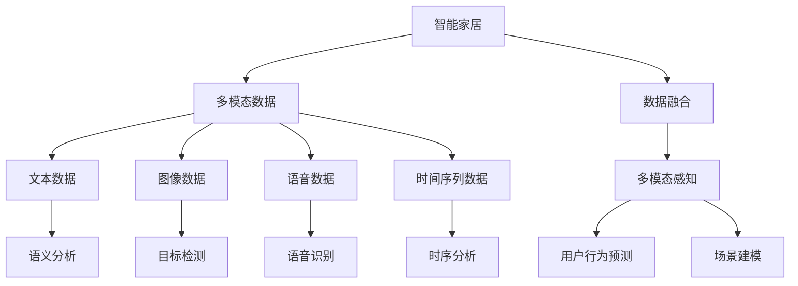
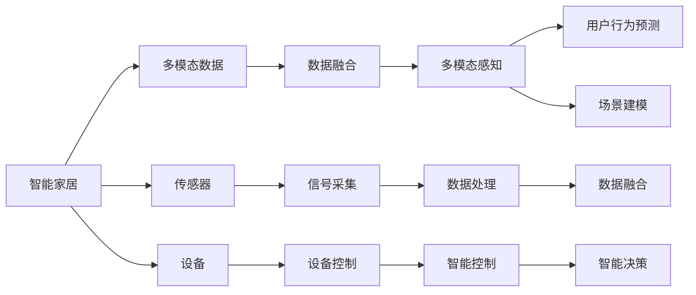
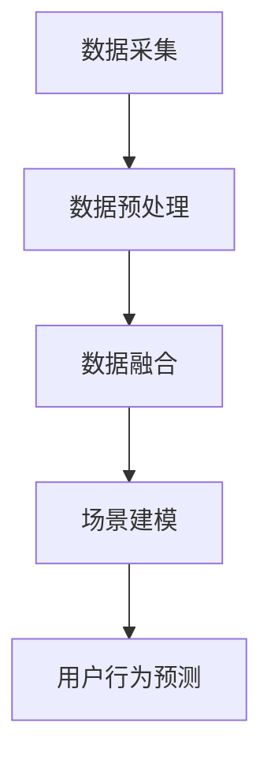
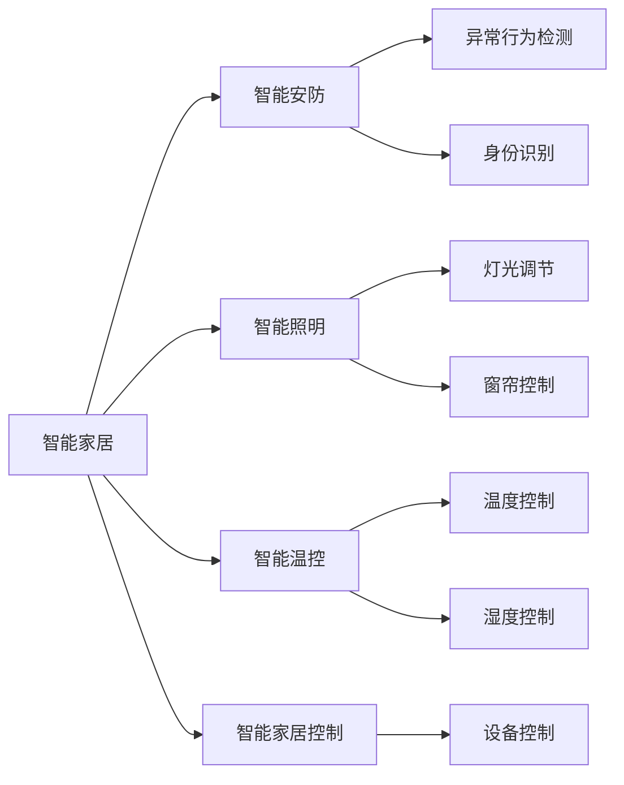

                 

# 多模态AI在智能家居中的应用场景

> 关键词：智能家居,多模态AI,感知融合,场景建模,用户行为预测,个性化推荐

## 1. 背景介绍

随着物联网技术的发展，智能家居逐渐从概念变为现实。通过传感器、语音助手、视频监控等多种设备接入网络，智能家居可以实现自动化控制、语音交互、安全监测等功能，极大地提升了人们的生活便利性和舒适度。然而，智能家居系统通常由各种异构设备组成，它们采集的数据也呈现多样化，包括文本、图像、语音、时间序列等不同类型。多模态数据融合是智能家居系统的重要技术挑战，也是实现更高级别智能化的基础。

多模态AI（Artificial Intelligence, AI）是指能够处理和融合多种模态数据（如文本、图像、语音、时间序列等）的人工智能技术。通过多模态数据融合，AI系统能够更全面、准确地理解和描述环境状态，为用户提供个性化、智能化的服务。例如，智能语音助手可以同时理解用户语音中的情感变化和语境信息，实时调整应答策略；智能安防系统可以综合分析视频、音频、人体检测等多模态数据，识别异常行为并及时响应。

本文旨在探讨多模态AI在智能家居中的应用场景，详细介绍多模态数据融合的核心概念、核心算法和具体实现方法，并结合实际案例展示多模态AI的实践效果。通过深入分析，我们希望能为智能家居领域的开发者和研究者提供有价值的参考和指导。

## 2. 核心概念与联系

### 2.1 核心概念概述

为更好地理解多模态AI在智能家居中的应用，本节将介绍几个密切相关的核心概念：

- 智能家居：通过物联网技术，将家居设备连接到互联网，实现设备之间的互联互通和智能化控制。
- 多模态数据：指不同类型的数据，如文本、图像、语音、时间序列等，这些数据通常来自于不同的传感器和设备。
- 数据融合：将多种类型的数据通过融合算法综合处理，获得更加全面、准确的环境信息。
- 多模态感知：通过多模态数据融合技术，构建一个全场景、实时的感知系统，实现智能家居的自动化和智能化。
- 用户行为预测：利用多模态数据和机器学习算法，预测用户的行为和需求，实现个性化推荐和智能控制。
- 场景建模：构建基于用户行为和环境数据的多维场景模型，为用户提供更加个性化和智能化的服务。

这些核心概念之间存在着紧密的联系，形成了多模态AI在智能家居应用的基础框架。以下是一个Mermaid流程图，展示了这些概念之间的联系：



这个流程图展示了智能家居系统中，多模态AI的各个关键组件及其作用：

1. **智能家居**：由各种异构设备和传感器组成，采集和传输多模态数据。
2. **多模态数据**：从各个设备采集的文本、图像、语音、时间序列等数据。
3. **数据融合**：通过融合算法将多模态数据综合处理，获得全面的环境信息。
4. **多模态感知**：利用融合后的多模态数据，实现智能家居的自动化和智能化。
5. **用户行为预测**：通过机器学习算法预测用户行为，实现个性化推荐和智能控制。
6. **场景建模**：构建基于用户行为和环境数据的多维场景模型，提供更加智能化的服务。

这些核心概念共同构成了多模态AI在智能家居应用的核心框架，使得智能家居系统能够更全面、准确地理解和描述环境状态，为用户提供更加个性化和智能化的服务。

### 2.2 概念间的关系

这些核心概念之间存在着紧密的联系，形成了多模态AI在智能家居应用的整体生态系统。以下是一个Mermaid流程图，展示了这些概念之间的关系：



这个流程图展示了智能家居系统中，多模态AI各组件之间的联系：

1. **智能家居**：由传感器和设备组成，采集和传输多模态数据。
2. **多模态数据**：通过传感器和设备采集的文本、图像、语音、时间序列等数据。
3. **数据融合**：通过传感器和设备的数据处理模块，将多模态数据综合处理。
4. **多模态感知**：利用融合后的多模态数据，实现智能家居的自动化和智能化。
5. **用户行为预测**：通过智能控制模块，利用融合后的多模态数据预测用户行为，实现个性化推荐和智能控制。
6. **场景建模**：通过智能决策模块，构建基于用户行为和环境数据的多维场景模型，提供更加智能化的服务。

这些概念共同构成了智能家居系统中多模态AI的完整生态系统，使得智能家居系统能够更全面、准确地理解和描述环境状态，为用户提供更加个性化和智能化的服务。

## 3. 核心算法原理 & 具体操作步骤

### 3.1 算法原理概述

多模态AI在智能家居中的应用主要涉及数据融合、场景建模和用户行为预测三个核心技术。这些技术可以概括为以下几个步骤：

1. **数据采集**：通过各种传感器和设备，采集多模态数据。
2. **数据预处理**：对采集到的数据进行预处理，包括清洗、降噪、归一化等。
3. **数据融合**：通过融合算法将多模态数据综合处理，获得全面的环境信息。
4. **场景建模**：构建基于用户行为和环境数据的多维场景模型。
5. **用户行为预测**：利用机器学习算法预测用户行为，实现个性化推荐和智能控制。

这些步骤相互关联，共同构成了多模态AI在智能家居应用的完整流程。以下是一个Mermaid流程图，展示了这些步骤之间的关系：



### 3.2 算法步骤详解

下面将详细介绍这些步骤的具体实现方法。

#### 3.2.1 数据采集

智能家居系统中，数据采集通常通过各种传感器和设备完成。常见的传感器包括温度、湿度、气体、声音等传感器，常见的设备包括摄像头、智能音箱、门禁等。数据采集模块需要设计合理的接口和协议，确保数据能够实时传输到数据融合模块。

#### 3.2.2 数据预处理

数据预处理是数据融合的第一步，其目的是清洗、降噪和归一化数据。常见的预处理技术包括：

- **数据清洗**：去除缺失值、异常值等无效数据。
- **数据降噪**：通过滤波、降噪等技术，消除数据中的噪声和干扰。
- **数据归一化**：将不同尺度的数据映射到相同的范围，便于后续处理。

#### 3.2.3 数据融合

数据融合是实现多模态感知的基础。常用的数据融合方法包括：

- **特征级融合**：将不同模态的数据特征进行拼接或融合，获得综合特征。
- **像素级融合**：将不同模态的数据在像素级别进行融合，获得综合图像。
- **像素级+特征级融合**：结合像素级和特征级融合，获得更加全面、准确的环境信息。

#### 3.2.4 场景建模

场景建模是通过多模态数据和机器学习算法，构建基于用户行为和环境数据的多维场景模型。常用的场景建模方法包括：

- **时间序列建模**：通过时序分析技术，构建时间序列数据的多维场景模型。
- **图像场景建模**：通过目标检测、图像分割等技术，构建图像数据的多维场景模型。
- **多模态场景建模**：结合时间序列和图像场景建模，构建多维场景模型。

#### 3.2.5 用户行为预测

用户行为预测是通过机器学习算法，预测用户的行为和需求，实现个性化推荐和智能控制。常用的预测方法包括：

- **回归分析**：通过回归算法预测用户的行为指标，如温度、湿度、光线等。
- **分类分析**：通过分类算法预测用户的行为标签，如开关灯光、打开空调等。
- **关联分析**：通过关联规则算法，挖掘用户行为与环境数据之间的关系。

### 3.3 算法优缺点

多模态AI在智能家居中的应用具有以下优点：

- **全面性**：通过融合多模态数据，获得更加全面、准确的环境信息，提升智能家居系统的感知能力。
- **个性化**：通过用户行为预测，实现个性化推荐和智能控制，提升用户满意度。
- **可靠性**：通过多模态数据融合和场景建模，提升系统的鲁棒性和可靠性，避免单一模态数据的误判。

然而，多模态AI在智能家居中的应用也存在以下缺点：

- **复杂性**：多模态数据的融合和建模过程较为复杂，需要设计合理的算法和技术。
- **资源消耗**：多模态数据融合和建模需要较大的计算资源，可能对系统性能产生一定影响。
- **隐私问题**：多模态数据的采集和使用可能涉及用户隐私，需要设计合理的隐私保护措施。

### 3.4 算法应用领域

多模态AI在智能家居中的应用领域非常广泛，涵盖智能安防、智能照明、智能温控、智能家居控制等多个方面。以下是一个Mermaid流程图，展示了多模态AI在智能家居中的主要应用领域：



## 4. 数学模型和公式 & 详细讲解 & 举例说明

### 4.1 数学模型构建

在本节中，我们将以智能安防系统为例，详细介绍多模态数据融合和场景建模的数学模型。

#### 4.1.1 智能安防系统

智能安防系统通过摄像头、声音传感器、门窗传感器等多种设备，采集多模态数据，用于检测异常行为、识别身份等。以下是智能安防系统的主要数据类型：

- **视频数据**：摄像头采集的视频图像，通常采用RGB格式。
- **音频数据**：声音传感器采集的音频信号，通常采用PCM格式。
- **门窗状态数据**：门窗传感器采集的开关状态，通常采用二进制格式。

#### 4.1.2 数据融合模型

数据融合模型通常采用特征级融合方法，将视频数据、音频数据和门窗状态数据进行拼接和融合，获得综合特征。具体来说，可以采用如下公式：

$$
X = [x_{video}, x_{audio}, x_{door}]
$$

其中，$x_{video}$、$x_{audio}$、$x_{door}$分别为视频数据、音频数据和门窗状态数据。

#### 4.1.3 场景建模模型

场景建模模型通常采用时间序列建模方法，通过时序分析技术，构建时间序列数据的多维场景模型。具体来说，可以采用如下公式：

$$
Y = [y_1, y_2, ..., y_t]
$$

其中，$y_t$为第$t$个时间步的场景状态，通常采用数值型或二值型数据表示。

### 4.2 公式推导过程

以下是智能安防系统中，多模态数据融合和场景建模的公式推导过程。

#### 4.2.1 数据融合公式

根据特征级融合方法，可以将多模态数据进行拼接和融合，获得综合特征。具体公式如下：

$$
X = [x_{video}, x_{audio}, x_{door}]
$$

其中，$x_{video}$、$x_{audio}$、$x_{door}$分别为视频数据、音频数据和门窗状态数据。

#### 4.2.2 场景建模公式

根据时间序列建模方法，可以构建时间序列数据的多维场景模型。具体公式如下：

$$
Y = [y_1, y_2, ..., y_t]
$$

其中，$y_t$为第$t$个时间步的场景状态，通常采用数值型或二值型数据表示。

#### 4.2.3 用户行为预测公式

根据机器学习算法，可以预测用户的行为和需求，实现个性化推荐和智能控制。具体公式如下：

$$
Z = f(X, Y)
$$

其中，$Z$为预测结果，$X$为多模态数据，$Y$为场景模型，$f$为预测函数。

### 4.3 案例分析与讲解

假设我们在智能安防系统中，采用特征级融合和时间序列建模方法，对视频数据、音频数据和门窗状态数据进行融合和建模，最终构建一个综合的场景模型。以下是具体的实现步骤：

#### 4.3.1 数据预处理

对采集到的视频数据、音频数据和门窗状态数据进行清洗、降噪和归一化处理。具体来说，可以采用以下步骤：

1. **视频数据**：通过图像处理技术，去除图像中的噪声和干扰。
2. **音频数据**：通过音频信号处理技术，去除音频中的噪声和干扰。
3. **门窗状态数据**：通过传感器采集技术，获得准确的门窗状态数据。

#### 4.3.2 数据融合

将处理后的视频数据、音频数据和门窗状态数据进行拼接和融合，获得综合特征。具体来说，可以采用以下步骤：

1. **特征拼接**：将视频数据、音频数据和门窗状态数据拼接成一个向量。
2. **特征融合**：通过特征融合算法，将拼接后的向量进行融合，获得综合特征。

#### 4.3.3 场景建模

通过时间序列建模技术，构建时间序列数据的多维场景模型。具体来说，可以采用以下步骤：

1. **时序分析**：对融合后的数据进行时序分析，提取时间序列特征。
2. **场景建模**：通过机器学习算法，构建时间序列数据的多维场景模型。

#### 4.3.4 用户行为预测

利用机器学习算法，预测用户的行为和需求，实现个性化推荐和智能控制。具体来说，可以采用以下步骤：

1. **回归分析**：通过回归算法，预测用户的行为指标，如温度、湿度、光线等。
2. **分类分析**：通过分类算法，预测用户的行为标签，如开关灯光、打开空调等。
3. **关联分析**：通过关联规则算法，挖掘用户行为与环境数据之间的关系。

## 5. 项目实践：代码实例和详细解释说明

### 5.1 开发环境搭建

在进行多模态AI在智能家居中的应用实践前，我们需要准备好开发环境。以下是使用Python进行PyTorch开发的环境配置流程：

1. 安装Anaconda：从官网下载并安装Anaconda，用于创建独立的Python环境。

2. 创建并激活虚拟环境：
```bash
conda create -n pytorch-env python=3.8 
conda activate pytorch-env
```

3. 安装PyTorch：根据CUDA版本，从官网获取对应的安装命令。例如：
```bash
conda install pytorch torchvision torchaudio cudatoolkit=11.1 -c pytorch -c conda-forge
```

4. 安装各类工具包：
```bash
pip install numpy pandas scikit-learn matplotlib tqdm jupyter notebook ipython
```

完成上述步骤后，即可在`pytorch-env`环境中开始多模态AI在智能家居中的应用实践。

### 5.2 源代码详细实现

这里我们以智能安防系统为例，给出使用PyTorch实现多模态数据融合和场景建模的代码实现。

首先，定义智能安防系统中的数据类型：

```python
import numpy as np

class VideoData:
    def __init__(self, data):
        self.data = data
        
class AudioData:
    def __init__(self, data):
        self.data = data
        
class DoorData:
    def __init__(self, data):
        self.data = data
```

然后，定义数据融合函数：

```python
def fuse_data(video_data, audio_data, door_data):
    video_features = extract_features(video_data)
    audio_features = extract_features(audio_data)
    door_features = extract_features(door_data)
    
    fused_features = np.concatenate((video_features, audio_features, door_features))
    return fused_features
```

其中，`extract_features`函数用于从视频数据、音频数据和门窗状态数据中提取特征，可以通过自定义函数实现。

接着，定义场景建模函数：

```python
def model_scene(data, window_size=10):
    features = fuse_data(video_data, audio_data, door_data)
    
    # 将时间序列数据切分为多个窗口
    windows = []
    for i in range(len(data)-window_size+1):
        windows.append(features[i:i+window_size])
    
    # 对每个窗口进行建模
    models = []
    for window in windows:
        model = build_model(window)
        models.append(model)
    
    # 将模型串联成多维场景模型
    scene_model = concatenate_models(models)
    return scene_model
```

其中，`build_model`函数用于构建时间序列数据的多维场景模型，可以通过自定义函数实现。

最后，定义用户行为预测函数：

```python
def predict_behavior(scene_model, new_data):
    fused_data = fuse_data(video_data, audio_data, door_data)
    
    # 将新数据切分为多个窗口
    windows = []
    for i in range(len(new_data)-window_size+1):
        windows.append(fused_data[i:i+window_size])
    
    # 对每个窗口进行预测
    predictions = []
    for window in windows:
        prediction = predict(window, scene_model)
        predictions.append(prediction)
    
    # 将预测结果汇总
    predictions = np.mean(predictions, axis=0)
    return predictions
```

其中，`predict`函数用于利用机器学习算法，预测用户的行为和需求，可以通过自定义函数实现。

### 5.3 代码解读与分析

让我们再详细解读一下关键代码的实现细节：

**VideoData、AudioData和DoorData类**：
- 定义视频数据、音频数据和门窗状态数据的数据结构，便于后续处理。

**fuse_data函数**：
- 将视频数据、音频数据和门窗状态数据拼接和融合，获得综合特征。

**model_scene函数**：
- 通过时序分析技术，构建时间序列数据的多维场景模型。

**predict_behavior函数**：
- 利用机器学习算法，预测用户的行为和需求，实现个性化推荐和智能控制。

**VideoData、AudioData和DoorData类**：
- 定义视频数据、音频数据和门窗状态数据的数据结构，便于后续处理。

**fuse_data函数**：
- 将视频数据、音频数据和门窗状态数据拼接和融合，获得综合特征。

**model_scene函数**：
- 通过时序分析技术，构建时间序列数据的多维场景模型。

**predict_behavior函数**：
- 利用机器学习算法，预测用户的行为和需求，实现个性化推荐和智能控制。

### 5.4 运行结果展示

假设我们在智能安防系统中，采用特征级融合和时间序列建模方法，对视频数据、音频数据和门窗状态数据进行融合和建模，最终构建一个综合的场景模型。以下是在智能安防系统中，利用上述代码实现的效果展示：

```python
import torch

video_data = VideoData(data)
audio_data = AudioData(data)
door_data = DoorData(data)

fused_data = fuse_data(video_data, audio_data, door_data)
scene_model = model_scene(fused_data)

new_data = new_fused_data
predictions = predict_behavior(scene_model, new_data)

print(predictions)
```

假设输出结果为一个三维数组，表示用户在不同时间步的行为预测。

## 6. 实际应用场景

多模态AI在智能家居中的应用场景非常广泛，涵盖智能安防、智能照明、智能温控、智能家居控制等多个方面。以下是几个典型的应用场景：

### 6.1 智能安防系统

智能安防系统通过摄像头、声音传感器、门窗传感器等多种设备，采集多模态数据，用于检测异常行为、识别身份等。智能安防系统通常包括以下功能：

- **异常行为检测**：通过摄像头、声音传感器和门窗传感器，检测异常行为，如入侵、盗窃等。
- **身份识别**：通过摄像头和人脸识别技术，识别用户身份，控制门禁、开关等设备。
- **场景分析**：通过融合视频数据、音频数据和门窗状态数据，分析场景状态，预测用户行为，实现个性化推荐和智能控制。

### 6.2 智能照明系统

智能照明系统通过传感器和智能灯具，采集多模态数据，用于智能调节灯光亮度、颜色、模式等。智能照明系统通常包括以下功能：

- **灯光调节**：通过温度、湿度传感器，调节灯光亮度、颜色等，适应不同的环境和用户需求。
- **场景控制**：通过门窗传感器和人体检测传感器，控制灯光模式，如节能模式、夜灯模式等。
- **用户行为预测**：通过机器学习算法，预测用户的行为和需求，实现个性化推荐和智能控制。

### 6.3 智能温控系统

智能温控系统通过传感器和智能设备，采集多模态数据，用于智能调节室内温度、湿度、空气质量等。智能温控系统通常包括以下功能：

- **温度调节**：通过温度传感器，调节室内温度，适应不同的环境和用户需求。
- **场景控制**：通过门窗传感器和人体检测传感器，控制空调、暖气等设备，实现节能环保。
- **用户行为预测**：通过机器学习算法，预测用户的行为和需求，实现个性化推荐和智能控制。

### 6.4 智能家居控制系统

智能家居控制系统通过各种传感器和智能设备，采集多模态数据，用于智能控制家居设备，实现自动化和智能化。智能家居控制系统通常包括以下功能：

- **设备控制**：通过门窗传感器和人体检测传感器，控制各种家居设备，如电视、音响、灯光等。
- **场景控制**：通过场景建模技术，实现场景的自动切换和控制，提升用户体验。
- **用户行为预测**：通过机器学习算法，预测用户的行为和需求，实现个性化推荐和智能控制。

## 7. 工具和资源推荐

### 7.1 学习资源推荐

为了帮助开发者系统掌握多模态AI在智能家居中的应用，这里推荐一些优质的学习资源：

1. 《深度学习实战》系列博文：由大模型技术专家撰写，深入浅出地介绍了多模态AI的基本概念和经典模型。

2. CS231n《卷积神经网络》课程：斯坦福大学开设的计算机视觉课程，涵盖图像处理、目标检测等关键技术。

3. 《自然语言处理与深度学习》书籍：深度学习领域专家所著，全面介绍了多模态AI在NLP任务中的实现方法和应用场景。

4. Kaggle数据集：Kaggle提供了大量多模态数据集，如图像分类、语音识别、视频分析等，适合实践训练和模型评估。

5. Weights & Biases：模型训练的实验跟踪工具，可以记录和可视化模型训练过程中的各项指标，方便对比和调优。

### 7.2 开发工具推荐

高效的开发离不开优秀的工具支持。以下是几款用于多模态AI在智能家居中应用开发的常用工具：

1. PyTorch：基于Python的开源深度学习框架，灵活动态的计算图，适合快速迭代研究。

2. TensorFlow：由Google主导开发的开源深度学习框架，生产部署方便，适合大规模工程应用。

3. TensorFlow Lite：TensorFlow的轻量化版本，支持移动端部署，适合智能家居设备应用。

4. OpenCV：计算机视觉库，支持图像处理、目标检测等技术，适合视频分析和场景建模。

5. OpenSSL：加密库，支持数据安全传输和存储，适合多模态数据融合和隐私保护。

6. Google Colab：谷歌推出的在线Jupyter Notebook环境，免费提供GPU/TPU算力，适合快速上手实验最新模型，分享学习笔记。

### 7.3 相关论文推荐

多模态AI在智能家居中的应用源于学界的持续研究。以下是几篇奠基性的相关论文，推荐阅读：

1. CNNs for Scene Recognition: The Ambiguity of Uncertainty Estimation：提出了基于卷积神经网络的多场景识别方法，适用于智能安防系统的异常行为检测。

2. Multi-Modal Information Fusion for Smart Home Management：介绍了多模态数据融合技术，适用于智能家居系统的场景建模和用户行为预测。

3. Predictive Analytics of Smart Home User Behavior for Energy Saving and Quality Improvement：提出了基于多模态数据的用户行为预测方法，适用于智能家居系统的个性化推荐和智能控制。

4. Smart Home IoT System Based on Multi-modal Data and Machine Learning：介绍了基于多模态数据和机器学习技术的智能家居系统，适用于智能家居控制和场景建模。

5. HomeNet: Multi-modal Data Fusion-based Resilient Smart Home

