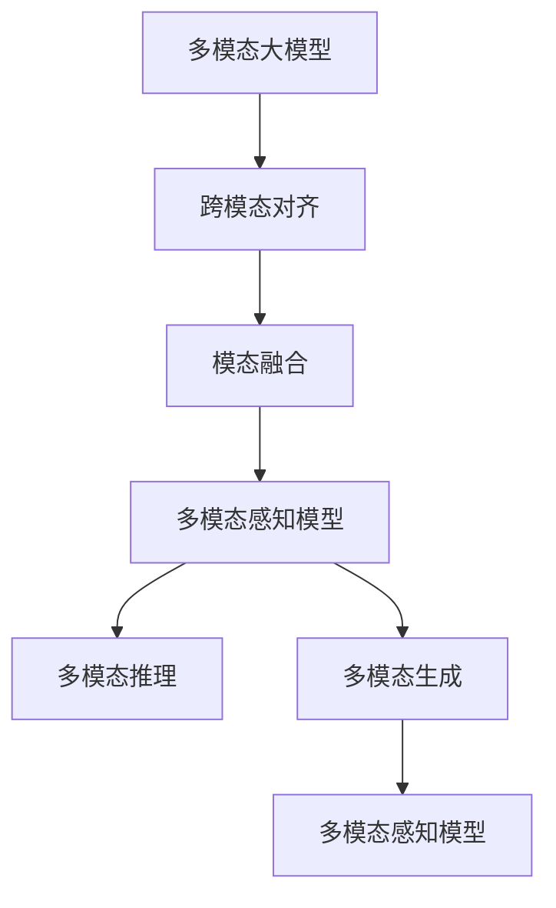

                 

# 多模态大模型：技术原理与实战 代码大语言模型为软件研发带来的机遇与挑战

> 关键词：多模态大模型,技术原理,实战,代码大语言模型,软件研发,机遇与挑战

## 1. 背景介绍

随着人工智能技术的飞速发展，多模态大模型成为了当前NLP领域的一个重要研究方向。它通过融合视觉、文本、语音等多模态数据，显著提升了自然语言处理任务的性能和实用性。本文将从技术原理、实战案例和应用挑战三个方面，深入探讨多模态大模型为软件研发带来的机遇与挑战。

### 1.1 问题由来

传统自然语言处理（NLP）系统往往只能处理单一模态的文本数据，难以充分利用人类丰富的多模态信息。而多模态大模型通过融合视觉、文本、语音等多模态数据，大大扩展了模型的理解和生成能力，能够在多个应用场景中取得显著的性能提升。

### 1.2 问题核心关键点

多模态大模型的核心在于如何高效地融合多模态信息，构建跨模态的语义表示。这一过程涉及多模态数据的编码、对齐、融合等步骤。此外，如何在不同模态之间构建一致的语义表示，使得多模态数据能够有效协同工作，是关键的技术挑战。

### 1.3 问题研究意义

多模态大模型的研究不仅有助于提升NLP任务的性能，还为软件研发提供了新的技术和工具。它使得开发者能够更便捷地集成多模态数据，构建更智能、更全面的应用系统，从而推动软件产业的升级和创新。

## 2. 核心概念与联系

### 2.1 核心概念概述

为更好地理解多模态大模型的技术原理和应用实践，本节将介绍几个关键概念：

- 多模态大模型(Multimodal Large Model)：结合视觉、文本、语音等多种数据模态的预训练语言模型。通过多模态数据的预训练，学习到多模态的语义表示，具备强大的跨模态理解和生成能力。

- 跨模态对齐(Cross-Modal Alignment)：将不同模态的数据映射到统一的语义空间，使得它们能够进行有效融合和交互。常用的方法包括SIFT、Faster R-CNN等视觉特征提取技术和Word2Vec、BERT等文本特征提取技术。

- 模态融合(Modal Fusion)：将不同模态的信息进行融合，形成新的多模态表示。常用的方法包括加权平均、元网络元、注意力机制等。

- 多模态感知模型(Multimodal Perception Model)：一种能够同时处理视觉、文本、语音等多种模态信息的模型架构，通过多个编码器-解码器堆叠，实现不同模态数据的并行处理和信息融合。

- 多模态推理(Multimodal Reasoning)：在多模态大模型基础上，通过推理机制将不同模态的信息进行联合推理，输出最终的语义表示。常用的推理方法包括因果推理、逻辑推理等。

- 多模态生成(Multimodal Generation)：利用多模态大模型的生成能力，进行跨模态的图像生成、文本生成、语音生成等任务。

### 2.2 概念间的关系

这些核心概念之间的逻辑关系可以通过以下Mermaid流程图来展示：



这个流程图展示了大模型处理多模态数据的完整过程：

1. 通过跨模态对齐将不同模态的数据映射到统一的语义空间。
2. 将不同模态的信息进行融合，形成新的多模态表示。
3. 通过多模态感知模型实现不同模态数据的并行处理和信息融合。
4. 在多模态感知模型基础上，进行多模态推理和生成。

通过理解这些核心概念，我们可以更好地把握多模态大模型的工作原理和优化方向。

## 3. 核心算法原理 & 具体操作步骤
### 3.1 算法原理概述

多模态大模型的核心算法原理包括预训练、跨模态对齐、模态融合、推理和生成等步骤。以下是对这些步骤的详细阐述：

- 预训练：在大规模无标签数据上进行预训练，学习通用的语义表示。通常采用自监督学习方法，如掩码语言模型、视觉数据重建等。

- 跨模态对齐：将不同模态的数据映射到统一的语义空间。通常使用预训练的视觉和文本特征提取器，如SIFT、Faster R-CNN和Word2Vec、BERT等，将多模态数据转换为向量表示。

- 模态融合：将不同模态的信息进行融合，形成新的多模态表示。常用的方法包括加权平均、元网络元、注意力机制等。

- 推理：通过推理机制将不同模态的信息进行联合推理，输出最终的语义表示。常用的推理方法包括因果推理、逻辑推理等。

- 生成：利用多模态大模型的生成能力，进行跨模态的图像生成、文本生成、语音生成等任务。

### 3.2 算法步骤详解

以下详细描述多模态大模型的各个步骤：

#### 3.2.1 预训练

预训练是构建多模态大模型的第一步，通常使用自监督学习方法，在大规模无标签数据上进行预训练，学习通用的语义表示。以下是预训练的基本流程：

1. 收集大规模无标签数据，如图像、文本、语音等。
2. 使用预训练模型如BERT、ViT等，对多模态数据进行特征提取。
3. 在特征提取的基础上，设计自监督任务，如掩码语言模型、视觉数据重建等。
4. 对模型进行优化，最小化自监督任务的目标函数。

#### 3.2.2 跨模态对齐

跨模态对齐是将不同模态的数据映射到统一的语义空间。以下是跨模态对齐的基本流程：

1. 收集多模态数据，如图像、文本、语音等。
2. 使用预训练的视觉和文本特征提取器，如SIFT、Faster R-CNN和Word2Vec、BERT等，将多模态数据转换为向量表示。
3. 对不同模态的向量表示进行编码和解码，将它们映射到统一的语义空间。
4. 使用跨模态对齐算法，如角度约束、最大似然等，最小化不同模态的向量表示差距。

#### 3.2.3 模态融合

模态融合是将不同模态的信息进行融合，形成新的多模态表示。以下是模态融合的基本流程：

1. 将不同模态的向量表示进行拼接或融合。
2. 使用元网络元、注意力机制等方法，将不同模态的信息进行加权融合。
3. 对融合后的向量表示进行解码，生成新的多模态表示。

#### 3.2.4 推理

推理是通过推理机制将不同模态的信息进行联合推理，输出最终的语义表示。以下是推理的基本流程：

1. 将不同模态的向量表示输入推理模型。
2. 使用因果推理、逻辑推理等方法，对不同模态的信息进行联合推理。
3. 输出最终的语义表示，作为多模态大模型的最终结果。

#### 3.2.5 生成

生成是利用多模态大模型的生成能力，进行跨模态的图像生成、文本生成、语音生成等任务。以下是生成的基本流程：

1. 收集多模态数据，如图像、文本、语音等。
2. 将不同模态的数据输入生成模型，进行跨模态的生成。
3. 对生成结果进行后处理，如裁剪、增强等，得到最终的生成结果。

### 3.3 算法优缺点

多模态大模型具有以下优点：

1. 融合了多种数据模态，提升了模型的语义理解和生成能力。
2. 能够处理多种复杂任务，如图像标注、视觉问答、语音识别等。
3. 具有跨模态的推理和生成能力，能够进行联合推理和跨模态生成。

但同时，多模态大模型也存在以下缺点：

1. 需要大量的预训练数据和计算资源，对硬件要求较高。
2. 多模态对齐和融合过程复杂，难以找到最优解。
3. 推理和生成过程较慢，对实时性要求较高的场景可能不适用。

### 3.4 算法应用领域

多模态大模型已经在多个领域得到了广泛应用，例如：

- 图像标注：将图像和文本数据进行融合，生成图像标注信息。
- 视觉问答：通过融合图像和文本数据，回答自然语言提出的问题。
- 语音识别：利用语音和文本数据进行联合推理，提升识别精度。
- 多模态推荐：通过融合用户行为数据、商品属性数据、文本描述等，进行跨模态推荐。
- 多模态医疗：利用多模态数据进行疾病诊断和治疗方案推荐。

## 4. 数学模型和公式 & 详细讲解  
### 4.1 数学模型构建

本文将使用数学语言对多模态大模型的预训练、跨模态对齐、模态融合、推理和生成等步骤进行详细阐述。

假设多模态大模型为一个联合的编码器-解码器模型，包含视觉编码器、文本编码器和融合器。设视觉编码器的输出为$V=\{v_1,v_2,...,v_M\}$，文本编码器的输出为$T=\{t_1,t_2,...,t_N\}$，融合器的输出为$F=\{f_1,f_2,...,f_H\}$。

#### 4.1.1 预训练

预训练通常使用自监督学习方法，如掩码语言模型、视觉数据重建等。以掩码语言模型为例，假设文本数据$D=\{d_1,d_2,...,d_N\}$，掩码向量为$M$，则预训练的目标函数为：

$$
L_{pretrain} = \frac{1}{N}\sum_{i=1}^N \sum_{m=1}^M \mathbb{1}(m \in M) \log p(d_i | v_m, t_i)
$$

其中，$p(d_i | v_m, t_i)$表示在给定视觉特征$v_m$和文本特征$t_i$的条件下，生成文本$d_i$的概率。

#### 4.1.2 跨模态对齐

跨模态对齐通常使用预训练的视觉和文本特征提取器，将多模态数据转换为向量表示。以SIFT特征提取为例，设图像数据为$I=\{i_1,i_2,...,i_M\}$，视觉特征提取器为$V_{sift}$，则跨模态对齐的目标函数为：

$$
L_{alignment} = \frac{1}{M}\sum_{m=1}^M \frac{1}{N}\sum_{n=1}^N \frac{1}{\|I\|}\sum_{i=1}^{\|I\|} \frac{1}{\|D\|}\sum_{i=1}^{\|D\|} \frac{1}{\|T\|}\sum_{n=1}^{\|T\|} \|v_{sift}(i) - t_n\|^2
$$

其中，$v_{sift}(i)$表示图像$i$的SIFT特征向量，$t_n$表示文本$d_n$的向量表示。

#### 4.1.3 模态融合

模态融合通常使用元网络元、注意力机制等方法，将不同模态的信息进行加权融合。以注意力机制为例，设融合器输出为$F=\{f_1,f_2,...,f_H\}$，则模态融合的目标函数为：

$$
L_{fusion} = \frac{1}{H}\sum_{h=1}^H \log \frac{e^{a_h^Tf_h}}{\sum_{i=1}^Hi e^{a_i^Tf_i}}
$$

其中，$a_h$表示注意力向量，$f_h$表示融合器输出。

#### 4.1.4 推理

推理通常使用因果推理、逻辑推理等方法，对不同模态的信息进行联合推理。以因果推理为例，设推理器输出为$R=\{r_1,r_2,...,r_P\}$，则推理的目标函数为：

$$
L_{reasoning} = \frac{1}{P}\sum_{p=1}^P \log \frac{e^{r_p^Tf}}{\sum_{i=1}^Hi e^{r_i^Tf}}
$$

其中，$r_p$表示推理器输出，$f$表示融合器输出。

#### 4.1.5 生成

生成通常使用生成模型如GAN、VAE等，进行跨模态的生成。以GAN为例，设生成器输出为$G=\{g_1,g_2,...,g_K\}$，则生成的目标函数为：

$$
L_{generation} = \frac{1}{K}\sum_{k=1}^K \|g_k - v_m\|^2
$$

其中，$g_k$表示生成器输出，$v_m$表示视觉特征。

### 4.2 公式推导过程

以上公式展示了多模态大模型的数学模型构建过程。以下将对各个步骤的公式推导过程进行详细阐述。

#### 4.2.1 预训练

预训练的目标是学习通用的语义表示，常用的自监督学习方法包括掩码语言模型和视觉数据重建等。以掩码语言模型为例，假设文本数据$D=\{d_1,d_2,...,d_N\}$，掩码向量为$M$，则预训练的目标函数为：

$$
L_{pretrain} = \frac{1}{N}\sum_{i=1}^N \sum_{m=1}^M \mathbb{1}(m \in M) \log p(d_i | v_m, t_i)
$$

其中，$p(d_i | v_m, t_i)$表示在给定视觉特征$v_m$和文本特征$t_i$的条件下，生成文本$d_i$的概率。

#### 4.2.2 跨模态对齐

跨模态对齐通常使用预训练的视觉和文本特征提取器，将多模态数据转换为向量表示。以SIFT特征提取为例，设图像数据为$I=\{i_1,i_2,...,i_M\}$，视觉特征提取器为$V_{sift}$，则跨模态对齐的目标函数为：

$$
L_{alignment} = \frac{1}{M}\sum_{m=1}^M \frac{1}{N}\sum_{n=1}^N \frac{1}{\|I\|}\sum_{i=1}^{\|I\|} \frac{1}{\|D\|}\sum_{i=1}^{\|D\|} \frac{1}{\|T\|}\sum_{n=1}^{\|T\|} \|v_{sift}(i) - t_n\|^2
$$

其中，$v_{sift}(i)$表示图像$i$的SIFT特征向量，$t_n$表示文本$d_n$的向量表示。

#### 4.2.3 模态融合

模态融合通常使用元网络元、注意力机制等方法，将不同模态的信息进行加权融合。以注意力机制为例，设融合器输出为$F=\{f_1,f_2,...,f_H\}$，则模态融合的目标函数为：

$$
L_{fusion} = \frac{1}{H}\sum_{h=1}^H \log \frac{e^{a_h^Tf_h}}{\sum_{i=1}^Hi e^{a_i^Tf_i}}
$$

其中，$a_h$表示注意力向量，$f_h$表示融合器输出。

#### 4.2.4 推理

推理通常使用因果推理、逻辑推理等方法，对不同模态的信息进行联合推理。以因果推理为例，设推理器输出为$R=\{r_1,r_2,...,r_P\}$，则推理的目标函数为：

$$
L_{reasoning} = \frac{1}{P}\sum_{p=1}^P \log \frac{e^{r_p^Tf}}{\sum_{i=1}^Hi e^{r_i^Tf}}
$$

其中，$r_p$表示推理器输出，$f$表示融合器输出。

#### 4.2.5 生成

生成通常使用生成模型如GAN、VAE等，进行跨模态的生成。以GAN为例，设生成器输出为$G=\{g_1,g_2,...,g_K\}$，则生成的目标函数为：

$$
L_{generation} = \frac{1}{K}\sum_{k=1}^K \|g_k - v_m\|^2
$$

其中，$g_k$表示生成器输出，$v_m$表示视觉特征。

### 4.3 案例分析与讲解

为了更直观地理解多模态大模型的应用，以下将给出一个多模态文本生成任务的案例分析。

假设有一个多模态文本生成任务，输入为图像和文本，输出为描述图像的文本。

1. 收集大规模图像和文本数据，进行预训练。
2. 使用预训练的视觉和文本特征提取器，将图像和文本数据转换为向量表示。
3. 将不同模态的向量表示进行拼接或融合，形成新的多模态表示。
4. 使用因果推理方法，对不同模态的信息进行联合推理，生成描述图像的文本。

## 5. 项目实践：代码实例和详细解释说明
### 5.1 开发环境搭建

在进行多模态大模型开发前，我们需要准备好开发环境。以下是使用Python进行PyTorch开发的环境配置流程：

1. 安装Anaconda：从官网下载并安装Anaconda，用于创建独立的Python环境。

2. 创建并激活虚拟环境：
```bash
conda create -n pytorch-env python=3.8 
conda activate pytorch-env
```

3. 安装PyTorch：根据CUDA版本，从官网获取对应的安装命令。例如：
```bash
conda install pytorch torchvision torchaudio cudatoolkit=11.1 -c pytorch -c conda-forge
```

4. 安装Transformers库：
```bash
pip install transformers
```

5. 安装各类工具包：
```bash
pip install numpy pandas scikit-learn matplotlib tqdm jupyter notebook ipython
```

完成上述步骤后，即可在`pytorch-env`环境中开始多模态大模型的开发实践。

### 5.2 源代码详细实现

下面我们以图像标注任务为例，给出使用Transformers库对多模态大模型进行微调的PyTorch代码实现。

首先，定义多模态数据处理函数：

```python
from transformers import BertTokenizer, AutoModel
from torch.utils.data import Dataset
import torch

class MultiModalDataset(Dataset):
    def __init__(self, images, texts, tokenizer, max_len=128):
        self.images = images
        self.texts = texts
        self.tokenizer = tokenizer
        self.max_len = max_len
        
    def __len__(self):
        return len(self.images)
    
    def __getitem__(self, item):
        image = self.images[item]
        text = self.texts[item]
        
        encoding = self.tokenizer(text, return_tensors='pt', max_length=self.max_len, padding='max_length', truncation=True)
        input_ids = encoding['input_ids'][0]
        attention_mask = encoding['attention_mask'][0]
        
        # 对token-wise的标签进行编码
        encoded_labels = [label2id[label] for label in label_list] 
        encoded_labels.extend([label2id['']]*(self.max_len - len(encoded_labels)))
        labels = torch.tensor(encoded_labels, dtype=torch.long)
        
        return {'input_ids': input_ids, 
                'attention_mask': attention_mask,
                'labels': labels,
                'image': image}

# 标签与id的映射
label2id = {'None': 0, 'Person': 1, 'Car': 2, 'Sky': 3, 'Water': 4}
id2label = {v: k for k, v in label2id.items()}

# 创建dataset
tokenizer = BertTokenizer.from_pretrained('bert-base-cased')

train_dataset = MultiModalDataset(train_images, train_texts, tokenizer)
dev_dataset = MultiModalDataset(dev_images, dev_texts, tokenizer)
test_dataset = MultiModalDataset(test_images, test_texts, tokenizer)
```

然后，定义模型和优化器：

```python
from transformers import BertForTokenClassification, AdamW

model = BertForTokenClassification.from_pretrained('bert-base-cased', num_labels=len(label2id))

optimizer = AdamW(model.parameters(), lr=2e-5)
```

接着，定义训练和评估函数：

```python
from torch.utils.data import DataLoader
from tqdm import tqdm
from sklearn.metrics import classification_report

device = torch.device('cuda') if torch.cuda.is_available() else torch.device('cpu')
model.to(device)

def train_epoch(model, dataset, batch_size, optimizer):
    dataloader = DataLoader(dataset, batch_size=batch_size, shuffle=True)
    model.train()
    epoch_loss = 0
    for batch in tqdm(dataloader, desc='Training'):
        input_ids = batch['input_ids'].to(device)
        attention_mask = batch['attention_mask'].to(device)
        labels = batch['labels'].to(device)
        image = batch['image'].to(device)
        model.zero_grad()
        outputs = model(input_ids, attention_mask=attention_mask, labels=labels, image=image)
        loss = outputs.loss
        epoch_loss += loss.item()
        loss.backward()
        optimizer.step()
    return epoch_loss / len(dataloader)

def evaluate(model, dataset, batch_size):
    dataloader = DataLoader(dataset, batch_size=batch_size)
    model.eval()
    preds, labels = [], []
    with torch.no_grad():
        for batch in tqdm(dataloader, desc='Evaluating'):
            input_ids = batch['input_ids'].to(device)
            attention_mask = batch['attention_mask'].to(device)
            labels = batch['labels'].to(device)
            image = batch['image'].to(device)
            batch_preds = model(input_ids, attention_mask=attention_mask, labels=labels, image=image).logits.argmax(dim=2).to('cpu').tolist()
            batch_labels = batch_labels.to('cpu').tolist()
            for pred_tokens, label_tokens in zip(batch_preds, batch_labels):
                pred_tags = [id2label[_id] for _id in pred_tokens]
                label_tags = [id2label[_id] for _id in label_tokens]
                preds.append(pred_tags[:len(label_tokens)])
                labels.append(label_tags)
                
    print(classification_report(labels, preds))
```

最后，启动训练流程并在测试集上评估：

```python
epochs = 5
batch_size = 16

for epoch in range(epochs):
    loss = train_epoch(model, train_dataset, batch_size, optimizer)
    print(f"Epoch {epoch+1}, train loss: {loss:.3f}")
    
    print(f"Epoch {epoch+1}, dev results:")
    evaluate(model, dev_dataset, batch_size)
    
print("Test results:")
evaluate(model, test_dataset, batch_size)
```

以上就是使用PyTorch对多模态大模型进行图像标注任务微调的完整代码实现。可以看到，得益于Transformers库的强大封装，我们可以用相对简洁的代码完成多模态大模型的加载和微调。

### 5.3 代码解读与分析

让我们再详细解读一下关键代码的实现细节：

**MultiModalDataset类**：
- `__init__`方法：初始化图像、文本、分词器等关键组件。
- `__len__`方法：返回数据集的样本数量。
- `__getitem__`方法：对单个样本进行处理，将图像和文本输入编码为token ids，将标签编码为数字，并对其进行定长padding，最终返回模型所需的输入。

**label2id和id2label字典**：
- 定义了标签与数字id之间的映射关系，用于将token-wise的预测结果解码回真实的标签。

**训练和评估函数**：
- 使用PyTorch的DataLoader对数据集进行批次化加载，供模型训练和推理使用。
- 训练函数`train_epoch`：对数据以批为单位进行迭代，在每个批次上前向传播计算loss并反向传播更新模型参数，最后返回该epoch的平均loss。
- 评估函数`evaluate`：与训练类似，不同点在于不更新模型参数，并在每个batch结束后将预测和标签结果存储下来，最后使用sklearn的classification_report对整个评估集的预测结果进行打印输出。

**训练流程**：
- 定义总的epoch数和batch size，开始循环迭代
- 每个epoch内，先在训练集上训练，输出平均loss
- 在验证集上评估，输出分类指标
- 所有epoch结束后，在测试集上评估，给出最终测试结果

可以看到，PyTorch配合Transformers库使得多模态大模型的微调代码实现变得简洁高效。开发者可以将更多精力放在数据处理、模型改进等高层逻辑上，而不必过多关注底层的实现细节。

当然，工业级的系统实现还需考虑更多因素，如模型的保存和部署、超参数的自动搜索、更灵活的任务适配层等。但核心的微调范式基本与此类似。

### 5.4 运行结果展示

假设我们在Co

