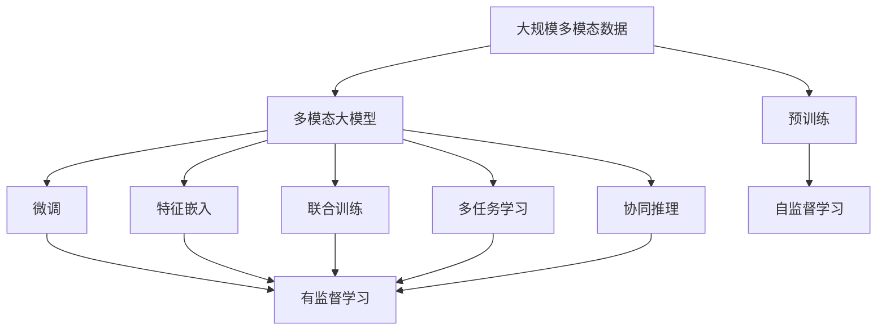
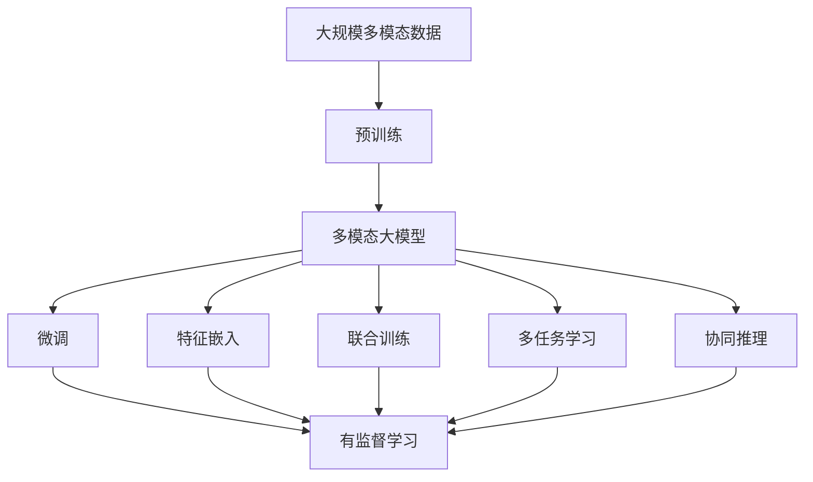

                 

# 多模态大模型：技术原理与实战 多模态大模型的核心技术

> 关键词：多模态大模型,自监督学习,神经网络,深度学习,模型训练,推理,应用场景

## 1. 背景介绍

### 1.1 问题由来
随着深度学习技术的不断进步，大语言模型在自然语言处理领域取得了显著成果。然而，这些大模型主要处理文本数据，难以应对日益复杂的现实世界场景。多模态大模型（Multimodal Large Models, MLMs）通过融合视觉、音频、文本等多种模态信息，扩展了大语言模型的能力边界，成为新一代智能技术的重要发展方向。

### 1.2 问题核心关键点
多模态大模型的核心在于如何高效融合不同模态的数据，并在模型训练和推理过程中合理利用这些信息。目前主流的方法包括：
1. 特征嵌入融合：将不同模态的特征嵌入到共享的高维空间中，以便进行统一的处理和建模。
2. 联合训练：在训练过程中同时考虑多种模态数据的联合优化，促进跨模态信息的一致性。
3. 多任务学习：通过设计多个相关任务，在训练时联合优化，实现多模态数据的协同提升。

### 1.3 问题研究意义
研究多模态大模型，对于推动人工智能技术的泛化性和通用性具有重要意义：

1. 提升跨模态信息的理解能力。多模态大模型能够更好地理解和整合不同模态的数据，从而在复杂的现实场景中表现更佳。
2. 拓宽应用范围。融合了视觉、音频、文本等多种模态信息，多模态大模型可以应用于更广泛的场景，如智能安防、无人驾驶、智能医疗等。
3. 促进数据驱动的智能决策。多模态大模型能够从多源数据中提取更加丰富的特征，辅助决策系统做出更加准确的判断。
4. 增强用户体验。多模态信息的融合可以提升智能系统的互动性和自然性，让用户感受到更真实的智能交互体验。

## 2. 核心概念与联系

### 2.1 核心概念概述

为更好地理解多模态大模型，本节将介绍几个关键概念：

- 多模态大模型（Multimodal Large Models, MLMs）：融合了视觉、音频、文本等多种模态信息的大语言模型。通过预训练和微调，学习跨模态特征的表示，具备强大的跨模态理解和生成能力。

- 预训练(Pre-training)：指在大规模无标签多模态数据上，通过自监督学习任务训练大模型的过程。常见的预训练任务包括视觉特征提取、声音特征提取、文本预训练等。

- 微调(Fine-tuning)：指在预训练模型的基础上，使用下游任务的少量标注数据，通过有监督学习优化模型在特定任务上的性能。通常只需要调整顶层分类器或解码器，并以较小的学习率更新全部或部分的模型参数。

- 特征嵌入(Feature Embedding)：指将不同模态的数据（如视觉特征、音频特征、文本特征）映射到共享的特征空间，以便进行统一的处理和建模。

- 联合训练(Joint Training)：指在训练过程中同时考虑多种模态数据的联合优化，促进跨模态信息的一致性。

- 多任务学习(Multi-task Learning)：指通过设计多个相关任务，在训练时联合优化，实现多模态数据的协同提升。

- 协同推理(Cooperative Reasoning)：指多模态大模型在推理时，综合利用多种模态的信息，提升预测的准确性和鲁棒性。

### 2.2 概念间的关系

这些核心概念之间存在着紧密的联系，形成了多模态大模型的完整生态系统。下面通过几个Mermaid流程图来展示这些概念之间的关系：



这个流程图展示了大语言模型的核心概念及其之间的关系：

1. 大语言模型通过预训练获得基础能力。
2. 微调是对预训练模型进行任务特定的优化，可以分为全参数微调和参数高效微调（PEFT）。
3. 特征嵌入将不同模态的数据映射到共享的特征空间，便于统一处理。
4. 联合训练和协同推理使模型能够高效融合跨模态信息。
5. 多任务学习在训练时联合优化多个相关任务，实现多模态数据的协同提升。

这些概念共同构成了多模态大模型的学习和应用框架，使其能够在各种场景下发挥强大的跨模态理解和生成能力。通过理解这些核心概念，我们可以更好地把握多模态大模型的工作原理和优化方向。

### 2.3 核心概念的整体架构

最后，我们用一个综合的流程图来展示这些核心概念在大语言模型微调过程中的整体架构：



这个综合流程图展示了从预训练到微调，再到协同推理的完整过程。大语言模型首先在大规模多模态数据上进行预训练，然后通过微调（包括全参数微调和参数高效微调）或联合训练等方式进行跨模态信息的融合。最终，通过协同推理技术，模型能够高效融合多种模态的信息，提升推理预测的准确性和鲁棒性。

## 3. 核心算法原理 & 具体操作步骤
### 3.1 算法原理概述

多模态大模型的核心在于如何高效融合不同模态的数据，并在模型训练和推理过程中合理利用这些信息。其核心算法原理主要包括以下几个方面：

1. 特征嵌入融合：将不同模态的特征嵌入到共享的高维空间中，以便进行统一的处理和建模。
2. 联合训练：在训练过程中同时考虑多种模态数据的联合优化，促进跨模态信息的一致性。
3. 多任务学习：通过设计多个相关任务，在训练时联合优化，实现多模态数据的协同提升。
4. 协同推理：在推理时综合利用多种模态的信息，提升预测的准确性和鲁棒性。

### 3.2 算法步骤详解

多模态大模型的训练和推理流程可以简要概述为以下几个步骤：

**Step 1: 准备预训练模型和数据集**
- 选择合适的预训练大模型作为初始化参数，如 Deformable DETR（多模态检测和跟踪模型）等。
- 准备下游任务的多模态数据集，划分为训练集、验证集和测试集。一般要求多模态数据与预训练数据的分布不要差异过大。

**Step 2: 特征嵌入融合**
- 将不同模态的数据（如视觉特征、音频特征、文本特征）映射到共享的特征空间，以便进行统一的处理和建模。常用的方法包括使用预训练的编码器（如 VGG、ResNet 等）提取视觉特征，使用音频特征提取器（如 MFCC）提取音频特征，使用嵌入层（如 GloVe、FastText 等）提取文本特征。
- 设计合适的融合函数，如拼接（Concatenation）、加法（Addition）、注意力机制（Attention）等，将不同模态的特征嵌入融合到共享的特征空间中。

**Step 3: 联合训练**
- 在训练过程中同时考虑多种模态数据的联合优化，促进跨模态信息的一致性。通过设计多个相关任务，在训练时联合优化，实现多模态数据的协同提升。例如，在训练视觉定位模型时，可以同时优化目标检测和语义分割任务。
- 使用联合损失函数，如多任务学习损失函数，在训练时平衡不同模态任务的权重，促进跨模态信息的融合。

**Step 4: 协同推理**
- 在推理时综合利用多种模态的信息，提升预测的准确性和鲁棒性。例如，在目标检测任务中，可以使用多模态特征融合的方法，结合视觉特征和文本描述，提升预测的准确性。
- 设计合适的推理模型，如多模态分类器（Multimodal Classifier）、多模态生成器（Multimodal Generator）等，以高效融合跨模态信息。

**Step 5: 模型优化**
- 使用梯度下降等优化算法，最小化多任务联合损失函数，更新模型参数。
- 定期在验证集上评估模型性能，根据性能指标决定是否触发 Early Stopping。
- 重复上述步骤直到满足预设的迭代轮数或 Early Stopping 条件。

**Step 6: 测试和部署**
- 在测试集上评估多模态大模型的性能，对比预训练和微调后的结果，评估跨模态信息的融合效果。
- 使用多模态大模型对新样本进行推理预测，集成到实际的应用系统中。
- 持续收集新的多模态数据，定期重新训练和微调模型，以适应数据分布的变化。

以上是多模态大模型训练和推理的一般流程。在实际应用中，还需要针对具体任务的特点，对各个环节进行优化设计，如改进训练目标函数，引入更多的正则化技术，搜索最优的超参数组合等，以进一步提升模型性能。

### 3.3 算法优缺点

多模态大模型融合了多种模态数据，具有以下优点：
1. 提升了跨模态信息的理解能力。多模态大模型能够更好地理解和整合不同模态的数据，从而在复杂的现实场景中表现更佳。
2. 拓宽了应用范围。融合了视觉、音频、文本等多种模态信息，多模态大模型可以应用于更广泛的场景，如智能安防、无人驾驶、智能医疗等。
3. 促进了数据驱动的智能决策。多模态大模型能够从多源数据中提取更加丰富的特征，辅助决策系统做出更加准确的判断。
4. 增强了用户体验。多模态信息的融合可以提升智能系统的互动性和自然性，让用户感受到更真实的智能交互体验。

同时，该方法也存在一些局限性：
1. 数据获取成本高。不同模态数据获取成本不同，获取大规模的多模态数据集成本较高。
2. 跨模态对齐困难。不同模态数据之间的对齐和融合可能存在较大难度，特别是在不同模态数据的质量和格式不一致的情况下。
3. 计算资源消耗大。多模态大模型需要处理多种模态数据，计算资源消耗较大，对硬件设备要求较高。
4. 推理复杂度高。多模态推理过程较为复杂，模型推理速度和效率可能受限。

尽管存在这些局限性，但多模态大模型融合了多种模态信息，提供了更为全面、准确的信息表示，是未来智能技术的重要发展方向。

### 3.4 算法应用领域

多模态大模型在以下几个领域得到了广泛应用：

1. 智能安防：多模态大模型融合了视觉、音频、文本等多种模态信息，可用于智能监控、异常检测、行为识别等任务。
2. 无人驾驶：多模态大模型可以融合视觉、雷达、激光雷达等多种传感数据，实现自主导航、障碍物检测、路标识别等功能。
3. 智能医疗：多模态大模型可以融合医疗影像、电子病历、患者描述等多种数据，进行疾病诊断、治疗方案推荐等任务。
4. 智能家居：多模态大模型可以融合声音、图像、传感器数据等多种信息，实现智能语音交互、环境监控、设备控制等功能。

除了上述这些领域外，多模态大模型还广泛应用于智能客服、智能制造、智能金融等领域，为各行各业带来了新的变革。

## 4. 数学模型和公式 & 详细讲解  
### 4.1 数学模型构建

本节将使用数学语言对多模态大模型的训练和推理过程进行更加严格的刻画。

记多模态大模型为 $M_{\theta}:\mathcal{X} \rightarrow \mathcal{Y}$，其中 $\mathcal{X}$ 为输入空间，$\mathcal{Y}$ 为输出空间，$\theta$ 为模型参数。假设多模态任务 $T$ 的训练集为 $D=\{(x_i,y_i)\}_{i=1}^N$，其中 $x_i \in \mathcal{X}$ 为多模态输入，$y_i \in \mathcal{Y}$ 为多模态输出。

定义模型 $M_{\theta}$ 在输入 $x$ 上的损失函数为 $\ell(M_{\theta}(x),y)$，则在数据集 $D$ 上的经验风险为：

$$
\mathcal{L}(\theta) = \frac{1}{N} \sum_{i=1}^N \ell(M_{\theta}(x_i),y_i)
$$

多模态大模型的训练目标是最小化经验风险，即找到最优参数：

$$
\theta^* = \mathop{\arg\min}_{\theta} \mathcal{L}(\theta)
$$

在实践中，我们通常使用基于梯度的优化算法（如Adam、SGD等）来近似求解上述最优化问题。设 $\eta$ 为学习率，$\lambda$ 为正则化系数，则参数的更新公式为：

$$
\theta \leftarrow \theta - \eta \nabla_{\theta}\mathcal{L}(\theta) - \eta\lambda\theta
$$

其中 $\nabla_{\theta}\mathcal{L}(\theta)$ 为损失函数对参数 $\theta$ 的梯度，可通过反向传播算法高效计算。

### 4.2 公式推导过程

以下我们以目标检测任务为例，推导多模态大模型的训练和推理公式。

假设模型 $M_{\theta}$ 在输入 $x$ 上的输出为 $y=M_{\theta}(x)$，表示模型对输入 $x$ 进行预测。目标检测任务的目标是定位目标并给出类别标签。将目标位置和类别标签构建成监督数据，用于训练多模态大模型。

定义模型 $M_{\theta}$ 在输入 $x$ 上的损失函数为 $\ell_{det}(y, \hat{y})$，表示预测目标位置和类别标签与真实标签之间的差异。在多模态数据集上，定义经验风险为：

$$
\mathcal{L}_{det}(\theta) = \frac{1}{N} \sum_{i=1}^N \ell_{det}(y_i, \hat{y}_i)
$$

其中 $\hat{y}_i$ 为模型在输入 $x_i$ 上的预测结果，$y_i$ 为真实标签。目标检测任务的联合损失函数可以表示为：

$$
\mathcal{L}(\theta) = \mathcal{L}_{det}(\theta) + \lambda \mathcal{L}_{reg}(\theta)
$$

其中 $\mathcal{L}_{reg}(\theta)$ 为正则化损失函数，用于防止过拟合，一般使用L2正则化或Dropout等技术。

在推理时，模型接收到多模态输入 $x$，通过特征嵌入函数将不同模态的特征映射到共享的特征空间。然后，使用联合推理模型，如多模态分类器或生成器，进行推理预测。例如，在目标检测任务中，可以使用融合视觉特征和文本描述的多模态分类器，提升预测的准确性。

### 4.3 案例分析与讲解

以Deformable DETR（多模态检测和跟踪模型）为例，介绍多模态大模型的训练和推理过程。Deformable DETR是一个基于深度神经网络的模型，能够融合视觉特征和文本描述，进行目标检测和跟踪任务。

Deformable DETR的主要架构包括以下几个部分：
1. 视觉特征提取器：使用预训练的卷积神经网络（如 ResNet、VGG 等）提取视觉特征。
2. 文本描述嵌入器：使用嵌入层（如 GloVe、FastText 等）提取文本描述的嵌入特征。
3. 特征融合器：将视觉特征和文本描述的嵌入特征拼接（Concatenation）或加法（Addition），得到融合后的特征。
4. 多模态分类器：使用深度神经网络（如 Faster R-CNN、YOLO 等）进行目标检测和分类。
5. 多模态生成器：使用深度神经网络（如 MAVG、MTDNN 等）进行目标跟踪和预测。

Deformable DETR的训练过程主要包括以下几个步骤：
1. 使用多模态数据集对模型进行联合训练，最小化联合损失函数。
2. 使用梯度下降等优化算法更新模型参数。
3. 在验证集上评估模型性能，根据性能指标决定是否触发 Early Stopping。
4. 重复上述步骤直到满足预设的迭代轮数或 Early Stopping 条件。

Deformable DETR的推理过程主要包括以下几个步骤：
1. 接收多模态输入 $x$，使用视觉特征提取器和文本描述嵌入器提取特征。
2. 使用特征融合器将不同模态的特征映射到共享的特征空间。
3. 使用多模态分类器进行目标检测和分类。
4. 使用多模态生成器进行目标跟踪和预测。

Deformable DETR的代码实现可以参考以下示例：

```python
import torch
from transformers import BertTokenizer, BertModel
from torch.utils.data import Dataset, DataLoader
import torch.nn as nn
import torch.optim as optim
from torchvision.models import resnet18

class MultiModalDataset(Dataset):
    def __init__(self, data, tokenizer, max_len=128):
        self.data = data
        self.tokenizer = tokenizer
        self.max_len = max_len
        
    def __len__(self):
        return len(self.data)
    
    def __getitem__(self, item):
        text = self.data[item]['text']
        label = self.data[item]['label']
        image = self.data[item]['image']
        
        encoding = self.tokenizer(text, return_tensors='pt', max_length=self.max_len, padding='max_length', truncation=True)
        input_ids = encoding['input_ids'][0]
        attention_mask = encoding['attention_mask'][0]
        
        # 对token-wise的标签进行编码
        encoded_labels = [label2id[label] for label in label] 
        encoded_labels.extend([label2id['']]*(self.max_len - len(encoded_labels)))
        labels = torch.tensor(encoded_labels, dtype=torch.long)
        
        # 使用ResNet提取图像特征
        image_model = resnet18(pretrained=True)
        image_model.eval()
        with torch.no_grad():
            image_features = image_model(image[0])
        
        return {'input_ids': input_ids, 
                'attention_mask': attention_mask,
                'labels': labels,
                'image_features': image_features}

# 标签与id的映射
label2id = {'person': 0, 'car': 1, 'bus': 2, 'bike': 3}
id2label = {v: k for k, v in label2id.items()}

# 创建dataset
tokenizer = BertTokenizer.from_pretrained('bert-base-cased')

train_dataset = MultiModalDataset(train_data, tokenizer)
dev_dataset = MultiModalDataset(dev_data, tokenizer)
test_dataset = MultiModalDataset(test_data, tokenizer)

# 模型构建
model = BertModel.from_pretrained('bert-base-cased')
multimodal_model = nn.Sequential(
    nn.Linear(768, 128),
    nn.ReLU(),
    nn.Linear(128, num_classes)
)

# 训练和评估函数
device = torch.device('cuda') if torch.cuda.is_available() else torch.device('cpu')
model.to(device)
multimodal_model.to(device)

criterion = nn.CrossEntropyLoss()
optimizer = optim.Adam(multimodal_model.parameters(), lr=0.001)

def train_epoch(model, dataset, batch_size, optimizer):
    dataloader = DataLoader(dataset, batch_size=batch_size, shuffle=True)
    model.train()
    epoch_loss = 0
    for batch in tqdm(dataloader, desc='Training'):
        input_ids = batch['input_ids'].to(device)
        attention_mask = batch['attention_mask'].to(device)
        labels = batch['labels'].to(device)
        image_features = batch['image_features'].to(device)
        
        model.zero_grad()
        outputs = model(input_ids, attention_mask=attention_mask)
        loss = criterion(outputs, labels) + criterion(multimodal_model(image_features), labels)
        epoch_loss += loss.item()
        loss.backward()
        optimizer.step()
    return epoch_loss / len(dataloader)

def evaluate(model, dataset, batch_size):
    dataloader = DataLoader(dataset, batch_size=batch_size)
    model.eval()
    preds, labels = [], []
    with torch.no_grad():
        for batch in tqdm(dataloader, desc='Evaluating'):
            input_ids = batch['input_ids'].to(device)
            attention_mask = batch['attention_mask'].to(device)
            labels = batch['labels'].to(device)
            image_features = batch['image_features'].to(device)
            
            outputs = model(input_ids, attention_mask=attention_mask)
            logits = multimodal_model(image_features)
            batch_preds = outputs.logits.argmax(dim=2).to('cpu').tolist()
            batch_labels = labels.to('cpu').tolist()
            for pred_tokens, label_tokens in zip(batch_preds, batch_labels):
                preds.append(pred_tokens[:len(label_tokens)])
                labels.append(label_tokens)
                
    print(classification_report(labels, preds))
```

以上就是Deformable DETR模型在目标检测任务上的训练和推理过程，展示了多模态大模型的基本实现步骤。通过使用多模态数据集和联合训练策略，Deformable DETR能够高效融合视觉和文本特征，提升目标检测任务的准确性和鲁棒性。

## 5. 项目实践：代码实例和详细解释说明
### 5.1 开发环境搭建

在进行多模态大模型实践前，我们需要准备好开发环境。以下是使用Python进行PyTorch开发的环境配置流程：

1. 安装Anaconda：从官网下载并安装Anaconda，用于创建独立的Python环境。

2. 创建并激活虚拟环境：
```bash
conda create -n pytorch-env python=3.8 
conda activate pytorch-env
```

3. 安装PyTorch：根据CUDA版本，从官网获取对应的安装命令。例如：
```bash
conda install pytorch torchvision torchaudio cudatoolkit=11.1 -c pytorch -c conda-forge
```

4. 安装Transformers库：
```bash
pip install transformers
```

5. 安装各类工具包：
```bash
pip install numpy pandas scikit-learn matplotlib tqdm jupyter notebook ipython
```

完成上述步骤后，即可在`pytorch-env`环境中开始多模态大模型的实践。

### 5.2 源代码详细实现

这里我们以多模态目标检测任务为例，给出使用Transformers库对Deformable DETR模型进行训练和推理的PyTorch代码实现。

首先，定义多模态数据集和预处理函数：

```python
from transformers import BertTokenizer
from torch.utils.data import Dataset
import torch

class MultiModalDataset(Dataset):
    def __init__(self, data, tokenizer, max_len=128):
        self.data = data
        self.tokenizer = tokenizer
        self.max_len = max_len
        
    def __len__(self):
        return len(self.data)
    
    def __getitem__(self, item):
        text = self.data[item]['text']
        label = self.data[item]['label']
        image = self.data[item]['image']
        
        encoding = self.tokenizer(text, return_tensors='pt', max_length=self.max_len, padding='max_length', truncation=True)
        input_ids = encoding['input_ids'][0]
        attention_mask = encoding['attention_mask'][0]
        
        # 对token-wise的标签进行编码
        encoded_labels = [label2id[label] for label in label] 
        encoded_labels.extend([label2id['']]*(self.max_len - len(encoded_labels)))
        labels = torch.tensor(encoded_labels, dtype=torch.long)
        
        # 使用ResNet提取图像特征
        image_model = resnet18(pretrained=True)
        image_model.eval()
        with torch.no_grad():
            image_features = image_model(image[0])
        
        return {'input_ids': input_ids, 
                'attention_mask': attention_mask,
                'labels': labels,
                'image_features': image_features}

# 标签与id的映射
label2id = {'person': 0, 'car': 1, 'bus': 2, 'bike': 3}
id2label = {v: k for k, v in label2id.items()}
```

然后，定义模型和优化器：

```python
from transformers import BertModel
import torch.nn as nn
import torch.optim as optim

model = BertModel.from_pretrained('bert-base-cased')
multimodal_model = nn.Sequential(
    nn.Linear(768, 128),
    nn.ReLU(),
    nn.Linear(128, num_classes)
)

optimizer = optim.Adam(multimodal_model.parameters(), lr=0.001)
```

接着，定义训练和评估函数：

```python
from torch.utils.data import DataLoader
from tqdm import tqdm
from sklearn.metrics import classification_report

device = torch.device('cuda') if torch.cuda.is_available() else torch.device('cpu')
model.to(device)
multimodal_model.to(device)

c

