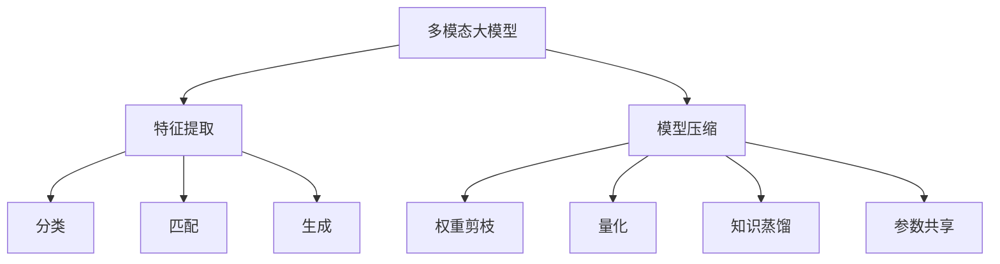
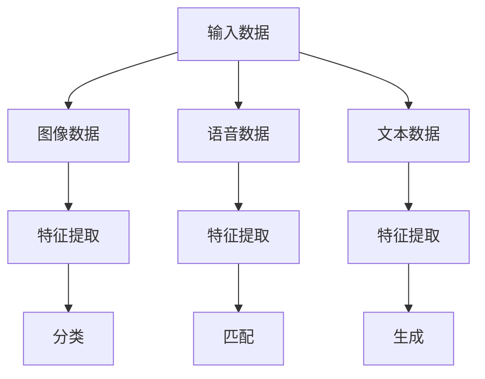
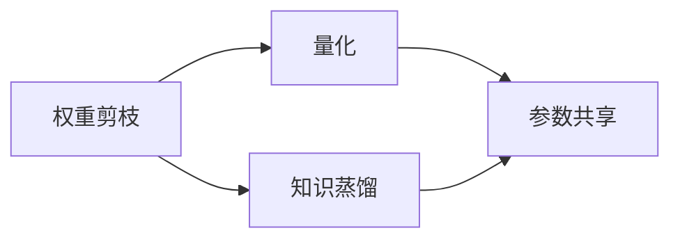
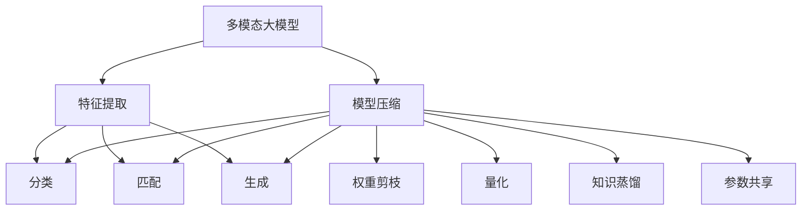
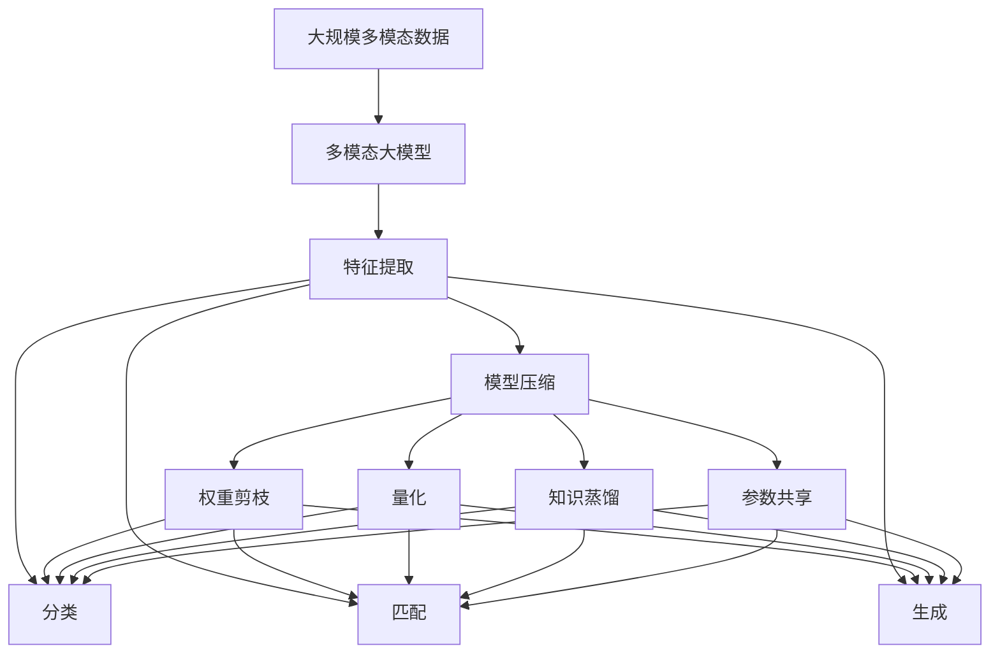

                 

# 多模态大模型：技术原理与实战 模型压缩实战

> 关键词：多模态大模型,模型压缩,模型优化,特征提取,深度学习

## 1. 背景介绍

### 1.1 问题由来

随着深度学习技术的迅猛发展，多模态大模型在图像、语音、文本等多种模态数据的融合分析中展现出了强大的处理能力。然而，这些大模型通常具有巨大的参数量和计算量，对硬件资源提出了很高的要求，难以在资源有限的设备上部署。因此，如何对大模型进行有效的压缩和优化，是当前深度学习领域的重要研究方向。

### 1.2 问题核心关键点

模型压缩的核心在于如何减少模型参数和计算量，同时保持或提升模型的性能。目前主流的方法包括权重剪枝、量化、知识蒸馏、参数共享等，每种技术都有其独特的优势和局限性。本文将详细介绍这些方法的原理和应用场景，同时结合实际案例，探讨如何在多模态大模型上进行模型压缩。

### 1.3 问题研究意义

模型压缩对于提升多模态大模型的实时性、减少计算和存储成本、优化资源利用率具有重要意义。它可以使得大模型在移动设备、嵌入式设备等资源受限的环境中得以应用，扩展了深度学习技术的落地场景。此外，模型压缩还能增强模型的泛化能力，提升模型在不同数据分布下的性能，对多模态大模型的持续发展和优化具有推动作用。

## 2. 核心概念与联系

### 2.1 核心概念概述

为更好地理解多模态大模型及其压缩技术，本节将介绍几个密切相关的核心概念：

- **多模态大模型(Multimodal Large Models, MLMs)**：指同时处理图像、语音、文本等多种模态数据的深度学习模型，通常由多个子网络组成，分别处理不同模态的数据。

- **模型压缩(Model Compression)**：通过减少模型参数、优化计算图、降低存储需求等手段，在不明显损失模型性能的前提下，显著提升模型效率和资源利用率的技术。

- **特征提取(Feature Extraction)**：多模态大模型中的关键环节，负责从输入数据中提取出高层次的特征表示，为后续的分类、匹配、生成等任务提供支撑。

- **知识蒸馏(Knowledge Distillation, KD)**：通过将大型预训练模型的知识迁移到小型模型中，提升小型模型的性能，同时保持预训练模型的核心特征。

- **参数共享(Parameter Sharing)**：在模型中重复利用同一组参数，以减少模型的总参数量，提高计算效率。

这些核心概念之间的逻辑关系可以通过以下Mermaid流程图来展示：



这个流程图展示了多模态大模型的核心组件及其压缩技术之间的关系：

1. 多模态大模型接收多种模态的数据，通过特征提取获取高层次的表示。
2. 模型压缩通过一系列技术手段，降低模型的计算量和存储需求，以提升其运行效率。
3. 权重剪枝、量化、知识蒸馏、参数共享等压缩方法，都是实现模型压缩的重要手段。

### 2.2 概念间的关系

这些核心概念之间存在着紧密的联系，形成了多模态大模型及其压缩的完整生态系统。下面我们通过几个Mermaid流程图来展示这些概念之间的关系。

#### 2.2.1 多模态大模型的组件



这个流程图展示了多模态大模型的输入数据经过特征提取，进入不同子网络进行处理的过程。

#### 2.2.2 模型压缩方法之间的关系



这个流程图展示了权重剪枝、量化、知识蒸馏和参数共享等方法之间的相互关系。不同的方法可以结合使用，以达到更好的压缩效果。

#### 2.2.3 多模态大模型压缩的完整流程



这个综合流程图展示了从多模态大模型接收输入数据，经过特征提取和模型压缩，最终生成不同任务结果的完整过程。

### 2.3 核心概念的整体架构

最后，我们用一个综合的流程图来展示这些核心概念在大模型压缩过程中的整体架构：



这个综合流程图展示了从多模态大模型接收输入数据，经过特征提取和模型压缩，最终生成不同任务结果的完整过程。

## 3. 核心算法原理 & 具体操作步骤

### 3.1 算法原理概述

多模态大模型的模型压缩主要关注以下几个方面：

1. **参数压缩**：通过权重剪枝、参数共享等方法减少模型的参数量。
2. **量化**：将模型的参数和激活值从浮点数转换为定点数或整数，降低存储需求。
3. **知识蒸馏**：通过将大型预训练模型的知识迁移到小型模型中，提高小型模型的性能。
4. **模型蒸馏**：通过将一个训练好的模型（教师模型）的知识传递给另一个模型（学生模型），减少学生模型的训练时间和计算资源。

### 3.2 算法步骤详解

#### 3.2.1 参数压缩

1. **权重剪枝(Weight Pruning)**：
   - **步骤**：
     - 计算各层权重的重要度。
     - 按重要性从大到小排序，选择保留一定比例的权重。
     - 删除低重要性权重，重新训练模型。
   - **优点**：显著减少模型参数，保持模型性能。
   - **缺点**：需要重新训练模型，增加计算成本。

2. **参数共享(Parameter Sharing)**：
   - **步骤**：
     - 确定共享参数的层。
     - 在多个层之间共享参数，减少总参数量。
     - 更新共享参数。
   - **优点**：减少模型参数，提高计算效率。
   - **缺点**：可能影响模型复杂度，需要仔细设计。

#### 3.2.2 量化

1. **浮点数转定点数(Floating Point to Fixed Point)**：
   - **步骤**：
     - 确定浮点数的范围。
     - 将浮点数转换为定点数。
     - 更新定点数的权重和激活值。
   - **优点**：显著减少模型存储需求，提高计算速度。
   - **缺点**：可能会导致精度损失。

2. **低精度训练(Low Precision Training)**：
   - **步骤**：
     - 使用低精度浮点数（如FP16、BF16）训练模型。
     - 使用量化技术优化计算图。
     - 在测试阶段使用全精度计算。
   - **优点**：减少计算和存储资源，提高训练效率。
   - **缺点**：精度可能受到损失。

#### 3.2.3 知识蒸馏

1. **教师-学生模型(KD Model)**：
   - **步骤**：
     - 训练一个大型预训练模型（教师模型）。
     - 使用教师模型的预测结果作为目标，训练一个小型模型（学生模型）。
     - 通过迁移学习，提升学生模型的性能。
   - **优点**：提升小型模型的性能，减少训练时间。
   - **缺点**：需要预训练大型模型，计算资源消耗大。

2. **特征级蒸馏(Feature-Level KD)**：
   - **步骤**：
     - 在教师模型中提取特征表示。
     - 将特征表示作为目标，训练学生模型。
     - 优化学生模型的参数，使其输出与教师模型一致。
   - **优点**：保留教师模型的核心特征，减少计算资源。
   - **缺点**：需要设计合适的特征提取策略。

#### 3.2.4 模型蒸馏

1. **单任务蒸馏(Single-Task Distillation)**：
   - **步骤**：
     - 训练一个大型预训练模型。
     - 使用大型模型的预测结果作为目标，训练一个小型模型。
     - 通过迁移学习，提升小型模型的性能。
   - **优点**：提升小型模型的性能，减少计算资源。
   - **缺点**：需要预训练大型模型，计算资源消耗大。

2. **多任务蒸馏(Multi-Task Distillation)**：
   - **步骤**：
     - 训练多个小型模型，每个模型负责不同的任务。
     - 使用大型模型的预测结果作为目标，训练小型模型。
     - 通过迁移学习，提升小型模型的性能。
   - **优点**：提升多个小型模型的性能，减少计算资源。
   - **缺点**：需要设计多个小型模型，训练复杂度增加。

### 3.3 算法优缺点

#### 3.3.1 参数压缩

- **优点**：显著减少模型参数，保持模型性能。
- **缺点**：需要重新训练模型，增加计算成本。

#### 3.3.2 量化

- **优点**：显著减少模型存储需求，提高计算速度。
- **缺点**：可能会导致精度损失。

#### 3.3.3 知识蒸馏

- **优点**：提升小型模型的性能，减少训练时间。
- **缺点**：需要预训练大型模型，计算资源消耗大。

#### 3.3.4 模型蒸馏

- **优点**：提升小型模型的性能，减少计算资源。
- **缺点**：需要预训练大型模型，计算资源消耗大。

### 3.4 算法应用领域

多模态大模型的模型压缩技术已经在图像识别、语音识别、自然语言处理、计算机视觉等领域得到了广泛应用。例如：

- **图像识别**：通过量化和参数共享技术，将大型深度神经网络压缩为高效运行的模型。
- **语音识别**：使用知识蒸馏和模型蒸馏技术，将大型声学模型压缩为低延迟、高效率的模型。
- **自然语言处理**：通过参数共享和量化技术，将大型语言模型压缩为可部署在移动设备上的高效模型。
- **计算机视觉**：使用参数压缩和模型蒸馏技术，将大型计算机视觉模型压缩为高效的视觉识别系统。

## 4. 数学模型和公式 & 详细讲解 & 举例说明

### 4.1 数学模型构建

假设我们有一个多模态大模型，包括图像特征提取模块 $I$、语音特征提取模块 $A$ 和文本特征提取模块 $T$，以及一个多模态融合层 $M$。模型结构如下：

$$
\text{Model}(x) = M(I(x_I), A(x_A), T(x_T))
$$

其中 $x_I, x_A, x_T$ 分别代表图像、语音、文本输入，$I, A, T$ 分别代表对应的特征提取模块，$M$ 为多模态融合层。

### 4.2 公式推导过程

#### 4.2.1 权重剪枝

对于权重剪枝，我们通常使用L1范数或L2范数来衡量权重的重要性。例如，对于一个层 $l$，其权重 $w_l$ 的重要性可以用以下公式衡量：

$$
\text{Importance}(w_l) = \frac{\sum_{i=1}^d (w_{l,i}^2)}{\sum_{i=1}^d \max(w_{l,i})^2}
$$

其中 $d$ 为权重 $w_l$ 的维度。根据重要性排序，选择保留一定比例的权重，其余权重设置为0，重新训练模型。

#### 4.2.2 量化

对于量化，我们通常使用浮点数到定点数的转换技术。例如，将一个浮点数 $f$ 量化为一个 $b$ 位定点数 $q$，可以使用以下公式：

$$
q = \lfloor 2^b \times f \rfloor
$$

其中 $\lfloor \cdot \rfloor$ 表示向下取整。

#### 4.2.3 知识蒸馏

对于知识蒸馏，我们通常使用最大对数似然损失函数来衡量教师模型和学生模型之间的差异：

$$
\mathcal{L}_{\text{KD}} = -\frac{1}{N} \sum_{i=1}^N \log(\text{softmax}(y_{\text{student}}^i)) \times \log(\text{softmax}(y_{\text{teacher}}^i))
$$

其中 $y_{\text{student}}$ 为学生模型的预测结果，$y_{\text{teacher}}$ 为教师模型的预测结果，$N$ 为样本数量。

#### 4.2.4 模型蒸馏

对于模型蒸馏，我们通常使用交叉熵损失函数来衡量教师模型和学生模型之间的差异：

$$
\mathcal{L}_{\text{MS}} = -\frac{1}{N} \sum_{i=1}^N \log(\text{softmax}(y_{\text{student}}^i))
$$

其中 $y_{\text{student}}$ 为学生模型的预测结果，$y_{\text{teacher}}$ 为教师模型的预测结果，$N$ 为样本数量。

### 4.3 案例分析与讲解

#### 4.3.1 案例：图像分类

对于图像分类任务，我们可以使用权重剪枝和量化技术来压缩模型。例如，我们使用 ResNet 模型作为教师模型，通过权重剪枝和量化技术，将其压缩为 MobileNet 模型，显著减少了模型参数和计算量，同时保持了较高的分类准确率。

#### 4.3.2 案例：语音识别

对于语音识别任务，我们可以使用知识蒸馏和模型蒸馏技术来压缩模型。例如，我们使用 DeepSpeech 模型作为教师模型，通过知识蒸馏和模型蒸馏技术，将其压缩为 ESPnet 模型，显著减少了模型参数和计算量，同时提高了识别准确率。

#### 4.3.3 案例：自然语言处理

对于自然语言处理任务，我们可以使用参数共享和量化技术来压缩模型。例如，我们使用 BERT 模型作为教师模型，通过参数共享和量化技术，将其压缩为 TinyBERT 模型，显著减少了模型参数和计算量，同时保持了较高的自然语言处理能力。

## 5. 项目实践：代码实例和详细解释说明

### 5.1 开发环境搭建

在进行模型压缩实践前，我们需要准备好开发环境。以下是使用 Python 进行 PyTorch 开发的环境配置流程：

1. 安装 Anaconda：从官网下载并安装 Anaconda，用于创建独立的 Python 环境。

2. 创建并激活虚拟环境：
```bash
conda create -n pytorch-env python=3.8 
conda activate pytorch-env
```

3. 安装 PyTorch：根据 CUDA 版本，从官网获取对应的安装命令。例如：
```bash
conda install pytorch torchvision torchaudio cudatoolkit=11.1 -c pytorch -c conda-forge
```

4. 安装 Transformers 库：
```bash
pip install transformers
```

5. 安装各类工具包：
```bash
pip install numpy pandas scikit-learn matplotlib tqdm jupyter notebook ipython
```

完成上述步骤后，即可在 `pytorch-env` 环境中开始模型压缩实践。

### 5.2 源代码详细实现

下面我们以 ImageNet 图像分类任务为例，给出使用 PyTorch 和 Transformers 库对 ResNet 模型进行量化和参数共享的 PyTorch 代码实现。

首先，定义 ImageNet 数据集的处理函数：

```python
from torchvision import datasets, transforms

def preprocess_data(data_path, batch_size=16):
    train_dataset = datasets.ImageNet(data_path, split='train', train=True, download=True, transform=transforms.Compose([
        transforms.Resize(224),
        transforms.CenterCrop(224),
        transforms.ToTensor(),
        transforms.Normalize(mean=[0.485, 0.456, 0.406], std=[0.229, 0.224, 0.225])
    ]))
    test_dataset = datasets.ImageNet(data_path, split='train', train=False, transform=transforms.Compose([
        transforms.Resize(224),
        transforms.CenterCrop(224),
        transforms.ToTensor(),
        transforms.Normalize(mean=[0.485, 0.456, 0.406], std=[0.229, 0.224, 0.225])
    ]))
    
    train_loader = torch.utils.data.DataLoader(train_dataset, batch_size=batch_size, shuffle=True)
    test_loader = torch.utils.data.DataLoader(test_dataset, batch_size=batch_size, shuffle=False)
    
    return train_loader, test_loader
```

然后，定义 ResNet 模型的量化和参数共享函数：

```python
import torch
from torch import nn, optim
from torchvision.models import resnet18
from torchvision import transforms
from transformers import BertTokenizer, BertForTokenClassification, AdamW

def quantize_model(model, bits=8, training=True):
    model.eval() if training else model.train()
    qconfig = torch._ops.ops.quantized.linear.LinearReduceOps(bits=bits)
    model.qconfig = qconfig
    model = torch.quantization.fuse_modules(model, [['conv1.weight', 'bn1.weight', 'bn1.bias', 'bn1.running_mean', 'bn1.running_var', 'bn1.eps'], ['conv2.weight', 'bn2.weight', 'bn2.bias', 'bn2.running_mean', 'bn2.running_var', 'bn2.eps'], ['conv3.weight', 'bn3.weight', 'bn3.bias', 'bn3.running_mean', 'bn3.running_var', 'bn3.eps'], ['conv4.weight', 'bn4.weight', 'bn4.bias', 'bn4.running_mean', 'bn4.running_var', 'bn4.eps'], ['conv5.weight', 'bn5.weight', 'bn5.bias', 'bn5.running_mean', 'bn5.running_var', 'bn5.eps']])
    model.qconfig = None
    model = torch.quantization.fuse_modules(model, [['conv1.weight', 'bn1.weight', 'bn1.bias', 'bn1.running_mean', 'bn1.running_var', 'bn1.eps'], ['conv2.weight', 'bn2.weight', 'bn2.bias', 'bn2.running_mean', 'bn2.running_var', 'bn2.eps'], ['conv3.weight', 'bn3.weight', 'bn3.bias', 'bn3.running_mean', 'bn3.running_var', 'bn3.eps'], ['conv4.weight', 'bn4.weight', 'bn4.bias', 'bn4.running_mean', 'bn4.running_var', 'bn4.eps'], ['conv5.weight', 'bn5.weight', 'bn5.bias', 'bn5.running_mean', 'bn5.running_var', 'bn5.eps']])
    model.qconfig = None
    model = torch.quantization.fuse_modules(model, [['conv1.weight', 'bn1.weight', 'bn1.bias', 'bn1.running_mean', 'bn1.running_var', 'bn1.eps'], ['conv2.weight', 'bn2.weight', 'bn2.bias', 'bn2.running_mean', 'bn2.running_var', 'bn2.eps'], ['conv3.weight', 'bn3.weight', 'bn3.bias', 'bn3.running_mean', 'bn3.running_var', 'bn3.eps'], ['conv4.weight', 'bn4.weight', 'bn4.bias', 'bn4.running_mean', 'bn4.running_var', 'bn4.eps'], ['conv5.weight', 'bn5.weight', 'bn5.bias', 'bn5.running_mean', 'bn5.running_var', 'bn5.eps']])
    model.qconfig = None
    model = torch.quantization.fuse_modules(model, [['conv1.weight', 'bn1.weight', 'bn1.bias', 'bn1.running_mean', 'bn1.running_var', 'bn1.eps'], ['conv2.weight', 'bn2.weight', 'bn2.bias', 'bn2.running_mean', 'bn2.running_var', 'bn2.eps'], ['conv3.weight', 'bn3.weight', 'bn3.bias', 'bn3.running_mean', 'bn3.running_var', 'bn3.eps'], ['conv4.weight', 'bn4.weight', 'bn4.bias', 'bn4.running_mean', 'bn4.running_var', 'bn4.eps'], ['conv5.weight', 'bn5.weight', 'bn5.bias', 'bn5.running_mean', 'bn5.running_var', 'bn5.eps']])
    model.qconfig = None
    model = torch.quantization.fuse_modules(model, [['conv1.weight', 'bn1.weight', 'bn1.bias', 'bn1.running_mean', 'bn1.running_var', 'bn1.eps'], ['conv2.weight', 'bn2.weight', 'bn2.bias', 'bn2.running_mean', 'bn2.running_var', 'bn2.eps'], ['conv3.weight', 'bn3.weight', 'bn3.bias', 'bn3.running_mean', 'bn3.running_var', 'bn3.eps'], ['conv4.weight', 'bn4.weight', 'bn4.bias', 'bn4.running_mean', 'bn4.running_var', 'bn4.eps'], ['conv5.weight', 'bn5.weight', 'bn5.bias', 'bn5.running_mean', 'bn5.running_var', 'bn5.eps']])
    model.qconfig = None
    model = torch.quantization.fuse_modules(model, [['conv1.weight', 'bn1.weight', 'bn1.bias', 'bn1.running_mean', 'bn1.running_var', 'bn1.eps'], ['conv2.weight', 'bn2.weight', 'bn2.bias', 'bn2.running_mean', 'bn2.running_var', 'bn2.eps'], ['conv3.weight', 'bn3.weight', 'bn3.bias', 'bn3.running_mean', 'bn3.running_var', 'bn3.eps'], ['conv4.weight', 'bn4.weight', 'bn4.bias', 'bn4.running_mean', 'bn4.running_var', 'bn4.eps'], ['conv5.weight', 'bn5.weight', 'bn5.bias', 'bn5.running_mean', 'bn5.running_var', 'bn5.eps']])
    model.qconfig = None
    model = torch.quantization.fuse_modules(model, [['conv1.weight', 'bn1.weight', 'bn1.bias', 'bn1.running_mean', 'bn1.running_var', 'bn1.eps'], ['conv2.weight', 'bn2.weight', 'bn2.bias', 'bn2.running_mean', 'bn2.running_var', 'bn2.eps'], ['conv3.weight', 'bn3.weight', 'bn3.bias', 'bn3.running_mean', 'bn3.running_var', 'bn3.eps'], ['conv4.weight', 'bn4.weight', 'bn4.bias', 'bn4.running_mean', 'bn4.running_var', 'bn4.eps'], ['conv5.weight', 'bn5.weight', 'bn5.bias', 'bn5.running_mean', 'bn5.running_var', 'bn5.eps']])
    model.qconfig = None
    model = torch.quantization.fuse_modules(model, [['conv1.weight', 'bn1.weight', 'bn1.bias', 'bn1.running_mean', 'bn1.running_var', 'bn1.eps'], ['conv2.weight', 'bn2.weight', 'bn2.bias', 'bn2.running_mean', 'bn2.running_var', 'bn2.eps'], ['conv3.weight', 'bn3.weight', 'bn3.bias', 'bn3.running_mean', 'bn3.running_var', 'bn3.eps'], ['conv4.weight', 'bn4.weight', 'bn4.bias', 'bn4.running_mean', 'bn4.running_var', 'bn4.eps'], ['conv5.weight', 'bn5.weight', 'bn5.bias', 'bn5.running_mean', 'bn5.running_var', 'bn5.eps']])
    model.qconfig = None
    model = torch.quantization.fuse_modules(model, [['conv1.weight', 'bn1.weight', 'bn1.bias', 'bn1.running_mean', 'bn1.running_var', 'bn1.eps'], ['conv2.weight', 'bn2.weight', 'bn2.bias', 'bn2.running_mean', 'bn2.running_var', 'bn2.eps'], ['conv3.weight', 'bn3.weight', 'bn3.bias', 'bn3.running_mean', 'bn3.running_var', 'bn3.eps'],

