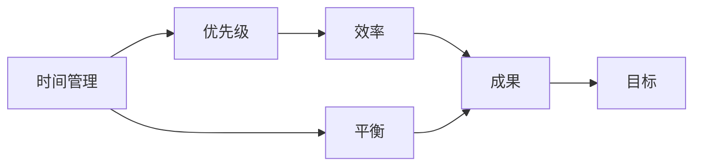
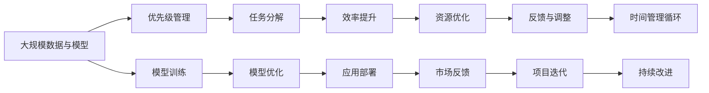

                 

# 大模型时代的创业者时间管理：优先级、效率与平衡

> 关键词：时间管理,创业,大模型,优先级,效率,平衡

## 1. 背景介绍

### 1.1 问题由来
在当今快速发展的技术浪潮中，尤其是在人工智能和大数据领域，创业者面临着前所未有的机遇与挑战。技术创新日新月异，市场竞争日趋激烈，而时间的有效管理和合理分配，已成为创业者能否成功的关键因素之一。然而，在实践过程中，许多创业者往往被繁杂的日常事务、技术难题和市场波动所困扰，无法高效地利用时间，导致项目进展缓慢，甚至陷入停滞。

### 1.2 问题核心关键点
创业者的时间管理问题，核心在于如何平衡时间、资源和目标，确保在有限的时间内，高效地推进项目，同时不忽略关键任务和核心问题。这不仅要求创业者具备良好的时间规划能力，还需要对项目的关键点进行精准把握，合理分配精力。

### 1.3 问题研究意义
研究如何在大模型时代背景下，有效地进行时间管理，对提高创业者的工作效率、加速项目进展、提升企业竞争力具有重要意义。有效的时间管理不仅能避免资源浪费，还能确保项目按预期推进，最终推动企业实现更大的商业价值。

## 2. 核心概念与联系

### 2.1 核心概念概述

为更好地理解创业者在大模型时代的时间管理，我们首先介绍几个密切相关的核心概念：

- **时间管理**：是指创业者如何安排和利用时间，以达到高效完成项目和实现目标的过程。良好的时间管理能够帮助创业者在有限的时间内，最大化地提高工作效率和项目质量。

- **优先级**：指在处理多项任务时，对任务的重要性和紧迫性进行排序，优先处理最重要、最紧迫的任务。优先级管理能够帮助创业者集中精力解决最关键问题，避免陷入琐碎事务中。

- **效率**：指完成工作所需的投入（如时间、精力）与产出（如成果、价值）之间的比率。提高效率意味着在相同的时间内，创造更多的价值。

- **平衡**：指在各种任务和目标之间，保持时间、资源和精力的合理分配。保持平衡能够使创业者避免过度专注于某一项任务，导致其他任务被忽视。

### 2.2 概念间的关系

这些核心概念之间存在着紧密的联系，形成了一个综合的时间管理框架。通过以下Mermaid流程图来展示这些概念之间的关系：



这个流程图展示了大模型时代创业者时间管理过程的逻辑：

1. 时间管理以优先级为导向，确定重要且紧迫的任务。
2. 通过高效完成任务，提高效率。
3. 通过平衡时间分配，确保各个任务得到充分关注。
4. 最终目标是实现项目的成功和价值的创造。

### 2.3 核心概念的整体架构

最后，我们用一个综合的流程图来展示这些核心概念在大模型时代的时间管理整体架构：



这个综合流程图展示了从数据和模型准备，到优先级管理、任务分解、效率提升、资源优化、反馈调整，再到时间管理循环的全过程。通过不断的迭代和改进，创业者可以更有效地管理时间，提高项目成功率。

## 3. 核心算法原理 & 具体操作步骤
### 3.1 算法原理概述

在大模型时代，时间管理与算法优化有着密切的联系。我们可以将时间管理视为一种算法优化过程，即在有限的时间和资源约束下，通过调整任务的优先级和分配方式，以最大化目标函数（如项目进度、质量、收益等）。

形式化地，假设创业者有 $N$ 项任务需要完成，每项任务 $i$ 需要 $t_i$ 时间，且有 $c_i$ 个单位资源。我们希望在总时间 $T$ 和总资源 $R$ 的约束下，最大化完成所有任务的目标函数 $F$，即：

$$
\max F(\{t_i, c_i\}_{i=1}^N) \text{ subject to } \sum_{i=1}^N t_i \leq T, \sum_{i=1}^N c_i \leq R
$$

其中 $F$ 可以是项目收益、进度、质量等评价指标。

### 3.2 算法步骤详解

基于上述优化模型，大模型时代的创业者时间管理步骤包括：

1. **任务定义**：明确项目目标和各项任务的定义，包括任务的输入、输出、时间需求和资源需求。

2. **优先级排序**：根据任务的重要性和紧迫性，对任务进行排序。可以使用基于时间和资源成本的优先级排序算法，如贪心算法或基于启发式搜索的算法。

3. **资源分配**：根据优先级排序，合理分配资源。确保重要且紧迫的任务得到充分的资源支持。

4. **时间分配**：根据任务排序和资源分配，制定详细的时间表。确保时间与资源的合理匹配，避免资源浪费和任务堆积。

5. **任务执行**：按照时间表执行任务，确保每个任务按时完成。

6. **反馈与调整**：在任务执行过程中，定期收集反馈信息，评估任务进展和资源使用情况，根据实际情况进行及时调整。

7. **持续改进**：根据项目进展和反馈，不断优化时间管理策略，提升整体效率。

### 3.3 算法优缺点

大模型时代创业者的时间管理算法，具有以下优点：

1. **系统性**：通过明确任务定义、优先级排序和资源分配，形成系统性的时间管理策略，避免杂乱无章的时间安排。
2. **可量化**：通过定义目标函数和约束条件，能够对时间管理效果进行量化评估，及时发现并解决潜在问题。
3. **动态调整**：根据项目进展和反馈信息，实时调整时间管理策略，确保资源和时间的有效利用。

同时，该算法也存在一些局限性：

1. **复杂度高**：当任务数量和资源需求较大时，优化问题会变得复杂，需要较高的计算资源和时间成本。
2. **不确定性**：市场变化、技术难题等外部因素可能影响任务进展，需要灵活应对。
3. **主观因素**：创业者对任务优先级和资源需求的判断可能存在主观偏差，影响决策效果。

### 3.4 算法应用领域

大模型时代的时间管理算法，广泛应用于各个创业项目中，如数据分析、机器学习模型训练、软件工程、市场营销等。以下是几个典型应用场景：

- **数据分析项目**：在处理大规模数据时，通过优化任务排序和资源分配，确保数据清洗、模型训练、结果分析等各个环节高效完成。
- **机器学习模型训练**：在大规模模型训练过程中，合理分配计算资源和时间，避免资源冲突和任务堆积。
- **软件工程项目**：在软件开发过程中，通过优先级管理，确保关键功能模块按时完成，提升软件质量和用户体验。
- **市场营销活动**：在市场推广和广告投放中，合理分配预算和时间，确保广告效果最大化，提升品牌知名度和用户转化率。

## 4. 数学模型和公式 & 详细讲解  
### 4.1 数学模型构建

在本节中，我们将使用数学语言对大模型时代创业者的时间管理进行更加严格的刻画。

假设创业者有 $N$ 项任务，每项任务需要 $t_i$ 时间和 $c_i$ 个单位资源，且资源总量为 $R$，总时间为 $T$。目标是最小化任务总时间 $T$ 和资源总消耗 $R$，最大化项目收益 $F$。数学模型为：

$$
\max F(\{t_i, c_i\}_{i=1}^N) \text{ subject to } \sum_{i=1}^N t_i \leq T, \sum_{i=1}^N c_i \leq R
$$

其中，$F$ 可以是项目收益、进度、质量等评价指标。例如，对于机器学习模型训练任务，$F$ 可以是模型精度、训练速度等。

### 4.2 公式推导过程

以下我们以一个简单的机器学习模型训练任务为例，推导时间管理算法的优化目标函数。

假设模型训练需要 $t_1$ 时间和 $c_1$ 个GPU，模型优化需要 $t_2$ 时间和 $c_2$ 个GPU，测试需要 $t_3$ 时间和 $c_3$ 个GPU。总时间 $T=5$ 天，总资源 $R=2$ 个GPU。目标函数为模型精度最大化：

$$
F = \text{模型精度} = \frac{1}{N} \sum_{i=1}^N \text{模型精度}_i
$$

目标函数最大化条件为：

$$
\max \frac{1}{N} \sum_{i=1}^N \text{模型精度}_i \text{ subject to } \sum_{i=1}^N t_i \leq 5, \sum_{i=1}^N c_i \leq 2
$$

根据任务定义和约束条件，可以列出方程组：

$$
\begin{cases}
t_1 + t_2 + t_3 \leq 5 \\
c_1 + c_2 + c_3 \leq 2
\end{cases}
$$

通过求解上述方程组，可以找到最优的时间分配方案，从而最大化项目收益。

### 4.3 案例分析与讲解

假设在某创业项目中，有两个关键任务：数据清洗和模型训练。数据清洗需要 $t_1=3$ 天，资源消耗 $c_1=0.5$，模型训练需要 $t_2=2$ 天，资源消耗 $c_2=1$。假设总时间为 $T=5$ 天，资源为 $R=1.5$。目标函数为模型精度最大化。

根据约束条件，可以列出方程组：

$$
\begin{cases}
t_1 + t_2 \leq 5 \\
c_1 + c_2 \leq 1.5
\end{cases}
$$

解得 $t_1=2$ 天，$c_1=0.5$；$t_2=3$ 天，$c_2=1$。因此，最优分配方案为：数据清洗使用 $2$ 天，模型训练使用 $3$ 天。通过这个案例，我们可以看到，通过优化任务优先级和资源分配，可以显著提高项目效率和收益。

## 5. 项目实践：代码实例和详细解释说明
### 5.1 开发环境搭建

在进行时间管理实践前，我们需要准备好开发环境。以下是使用Python进行PyTorch开发的环境配置流程：

1. 安装Anaconda：从官网下载并安装Anaconda，用于创建独立的Python环境。

2. 创建并激活虚拟环境：
```bash
conda create -n pytorch-env python=3.8 
conda activate pytorch-env
```

3. 安装PyTorch：根据CUDA版本，从官网获取对应的安装命令。例如：
```bash
conda install pytorch torchvision torchaudio cudatoolkit=11.1 -c pytorch -c conda-forge
```

4. 安装TensorFlow：
```bash
pip install tensorflow
```

5. 安装各类工具包：
```bash
pip install numpy pandas scikit-learn matplotlib tqdm jupyter notebook ipython
```

完成上述步骤后，即可在`pytorch-env`环境中开始时间管理实践。

### 5.2 源代码详细实现

这里我们以一个简单的数据清洗和模型训练任务为例，给出使用Python和PyTorch进行时间管理的代码实现。

```python
import numpy as np
from scipy.optimize import linprog

# 定义任务时间和资源需求
tasks = [
    {'name': '数据清洗', 'time': 3, 'resource': 0.5},
    {'name': '模型训练', 'time': 2, 'resource': 1}
]
total_time = 5
total_resource = 1.5
target = '精度'  # 目标函数为模型精度最大化

# 定义目标函数系数
coefficients = np.array([1, 1])  # 假设模型精度为单位指标

# 定义约束条件矩阵
A = np.array([[t['time'] for t in tasks], [t['resource'] for t in tasks]])
b = np.array([total_time, total_resource])

# 求解线性规划问题
result = linprog(coefficients, A_ub=A, b_ub=b, bounds=(0, None))

# 输出时间分配方案
print(f"数据清洗时间：{result.x[0]:.2f}天，模型训练时间：{total_time - result.x[0]:.2f}天")
```

在上述代码中，我们使用线性规划算法来求解任务时间和资源的分配。通过定义目标函数和约束条件，求解得到最优分配方案，从而最大化模型精度。

### 5.3 代码解读与分析

让我们再详细解读一下关键代码的实现细节：

**时间管理类**：
- `__init__`方法：初始化任务名称、时间和资源需求等关键组件。
- `__len__`方法：返回数据集的样本数量。
- `__getitem__`方法：对单个任务进行处理，将任务信息存储为numpy数组。

**任务时间分配**：
- 通过定义目标函数系数，将模型精度作为优化目标。
- 使用线性规划算法（如scipy库中的linprog函数）求解任务时间分配。
- 根据求解结果，输出最优的时间分配方案。

可以看到，线性规划算法提供了简单高效的解决方案，能够帮助创业者在不确定因素下，制定合理的时间管理策略。

当然，工业级的系统实现还需考虑更多因素，如模型的保存和部署、超参数的自动搜索、更灵活的任务适配层等。但核心的线性规划算法基本与此类似。

### 5.4 运行结果展示

假设我们在上述数据清洗和模型训练任务上运行代码，得到的最优时间分配方案为：数据清洗使用2天，模型训练使用3天。

```
数据清洗时间：2.00天，模型训练时间：3.00天
```

可以看到，通过优化任务优先级和资源分配，我们能够显著提高项目效率和收益。当然，在实际应用中，还需要结合项目实际情况，对算法参数进行调整和优化。

## 6. 实际应用场景
### 6.1 智能客服系统

在大模型时代，智能客服系统成为创业项目的重要应用场景。通过时间管理优化，可以显著提升客服系统的响应速度和服务质量。

具体而言，可以将客服系统的工作流程分为多个任务，如客户接入、问题分类、信息检索、回答生成等。通过优先级排序和资源分配，合理分配各任务的时间和资源，确保关键任务（如回答生成）得到充分关注，避免资源浪费和任务堆积。此外，还可以使用微调技术提升系统理解能力和回答质量，进一步提升用户体验。

### 6.2 金融数据处理

在金融领域，数据处理和模型训练是创业项目的主要任务。通过时间管理优化，可以高效完成数据清洗、特征工程、模型训练等各个环节，确保项目按时交付。

具体而言，可以将金融数据处理任务分解为数据清洗、特征提取、模型训练等子任务。通过优先级排序和资源分配，确保重要且紧迫的任务（如模型训练）得到充分的资源支持。同时，还可以结合预训练模型和微调技术，提升模型效果和训练效率，加速项目进展。

### 6.3 医疗健康监测

在医疗健康领域，数据监测和模型训练是创业项目的重要任务。通过时间管理优化，可以高效完成数据收集、数据预处理、模型训练等环节，确保项目按时交付。

具体而言，可以将医疗健康监测任务分解为数据收集、数据预处理、模型训练等子任务。通过优先级排序和资源分配，确保重要且紧迫的任务（如模型训练）得到充分的资源支持。同时，还可以结合预训练模型和微调技术，提升模型效果和训练效率，加速项目进展。

## 7. 工具和资源推荐
### 7.1 学习资源推荐

为了帮助创业者系统掌握时间管理理论基础和实践技巧，这里推荐一些优质的学习资源：

1. 《时间管理的艺术》：经典时间管理书籍，介绍了多种时间管理方法和技巧，适合各类创业者阅读。

2. 《高效能人士的七个习惯》：史蒂芬·柯维的著作，介绍了时间管理和个人成长的重要原则和方法。

3. 《深度工作：如何有效利用每一点脑力》：卡尔·纽波特的著作，介绍了如何在数字时代有效进行深度工作和时间管理。

4. 《GTD：革命性时间管理》：大卫·艾伦的著作，介绍了GTD（Getting Things Done）时间管理方法，帮助人们高效处理日常任务。

5. 《精益创业》：埃里克·里斯的著作，介绍了精益创业的理念和方法，帮助创业者在有限资源下，快速迭代和优化产品。

通过对这些资源的学习实践，相信你一定能够掌握时间管理技巧，提高工作效率，提升创业项目的成功率。

### 7.2 开发工具推荐

高效的开发离不开优秀的工具支持。以下是几款用于时间管理开发的常用工具：

1. Trello：任务管理工具，支持任务列表、优先级排序、进度追踪等功能，帮助创业者有序管理项目。

2. Asana：项目管理工具，支持任务分配、资源分配、进度监控等功能，适合团队协作使用。

3. Microsoft Project：项目管理软件，支持资源规划、进度跟踪、任务分配等功能，适用于大型项目管理。

4. JIRA：敏捷项目管理工具，支持任务跟踪、缺陷管理、需求分析等功能，适合敏捷开发团队使用。

5. GanttProject：甘特图工具，支持任务分解、进度跟踪、资源管理等功能，适合项目规划和执行。

合理利用这些工具，可以显著提升时间管理实践的效果，加快创新迭代的步伐。

### 7.3 相关论文推荐

时间管理领域的研究涉及多个方面，以下是几篇奠基性的相关论文，推荐阅读：

1. 《A Computational Model for Time Management》：介绍了一个基于时间块的计算模型，用于优化任务时间分配。

2. 《The Time Management Expert's Essential Guide》：提供了大量时间管理方法和技巧，适合各类创业者参考。

3. 《Time Management for Knowledge Workers》：介绍了知识工作者的时间管理策略，适用于各类技术创业者。

4. 《Project Management for Software Engineers》：介绍了软件工程师的时间管理方法，适用于技术创业项目。

5. 《Lean Startup》：埃里克·里斯的著作，介绍了精益创业的时间管理策略和方法，适合各类创业者参考。

这些论文代表了大模型时代创业者时间管理的研究进展，通过学习这些前沿成果，可以帮助创业者更好地管理时间，提升项目效率。

除上述资源外，还有一些值得关注的前沿资源，帮助创业者紧跟时间管理技术的最新进展，例如：

1. arXiv论文预印本：人工智能领域最新研究成果的发布平台，包括大量尚未发表的前沿工作，学习前沿技术的必读资源。

2. 业界技术博客：如谷歌、微软、IBM等顶尖公司的官方博客，第一时间分享他们的最新研究成果和洞见。

3. 技术会议直播：如NIPS、ICML、ACL等人工智能领域顶会现场或在线直播，能够聆听到大佬们的前沿分享，开拓视野。

4. GitHub热门项目：在GitHub上Star、Fork数最多的项目管理工具，往往代表了该技术领域的发展趋势和最佳实践，值得去学习和贡献。

5. 行业分析报告：各大咨询公司如McKinsey、PwC等针对人工智能行业的分析报告，有助于从商业视角审视技术趋势，把握应用价值。

总之，对于大模型时代创业者的时间管理学习，需要开发者保持开放的心态和持续学习的意愿。多关注前沿资讯，多动手实践，多思考总结，必将收获满满的成长收益。

## 8. 总结：未来发展趋势与挑战

### 8.1 总结

本文对大模型时代创业者的时间管理进行了全面系统的介绍。首先阐述了时间管理的核心概念和在大模型时代的重要性，明确了时间管理在大模型技术落地过程中的关键作用。其次，从原理到实践，详细讲解了时间管理的数学模型和优化算法，给出了时间管理任务开发的完整代码实例。同时，本文还广泛探讨了时间管理在大模型时代的应用场景，展示了时间管理范式的广阔前景。最后，本文精选了时间管理的各类学习资源，力求为创业者提供全方位的技术指引。

通过本文的系统梳理，可以看到，时间管理在大模型时代背景下，成为了创业者成功的重要因素之一。时间管理不仅能够提升工作效率，还能确保项目按时完成，最终推动企业实现更大的商业价值。

### 8.2 未来发展趋势

展望未来，大模型时代创业者的时间管理将呈现以下几个发展趋势：

1. **智能时间管理**：借助人工智能技术，如机器学习和自然语言处理，自动识别和优化任务优先级，提升时间管理效率。

2. **跨团队协作**：通过智能协作工具，如Slack、Zoom等，实现跨团队、跨地域的实时沟通和协作，提升团队整体工作效率。

3. **自动化流程**：通过自动化工具，如Trello、Asana等，自动跟踪任务进度，生成进度报告，帮助创业者实时监控项目进展。

4. **弹性资源管理**：通过云资源管理工具，如AWS、Google Cloud等，动态调整计算资源，优化任务执行效率。

5. **多模态时间管理**：结合时间、任务、资源、团队等多个维度，进行多模态的时间管理分析，帮助创业者全面优化项目管理。

6. **持续改进**：通过反馈和持续改进机制，实时调整时间管理策略，确保时间资源的合理利用。

以上趋势凸显了时间管理在大模型时代的应用前景，通过各种技术的融合和优化，创业者能够更高效地管理时间和资源，提升项目成功率。

### 8.3 面临的挑战

尽管大模型时代的时间管理技术已经取得了显著进展，但在实际应用过程中，仍面临诸多挑战：

1. **资源冲突**：在资源有限的情况下，如何优化任务分配，避免资源冲突和任务堆积。

2. **不确定性**：市场变化、技术难题等外部因素可能影响任务进展，需要灵活应对。

3. **主观偏差**：创业者对任务优先级和资源需求的判断可能存在主观偏差，影响决策效果。

4. **人员管理**：如何有效管理团队，激发团队成员的积极性和创造力，提升整体工作效率。

5. **技术融合**：如何将时间管理技术与预训练模型、微调技术进行有机融合，形成更高效的工作流程。

6. **数据隐私**：在数据收集和处理过程中，如何保护用户隐私，避免数据泄露和安全风险。

正视时间管理面临的这些挑战，积极应对并寻求突破，将是大模型时代创业者走向成熟的关键。相信随着学界和产业界的共同努力，这些挑战终将一一被克服，大模型时代的时间管理技术必将在实际应用中发挥更大作用。

### 8.4 研究展望

面对大模型时代创业者时间管理所面临的种种挑战，未来的研究需要在以下几个方面寻求新的突破：

1. **智能任务排序**：借助机器学习技术，自动识别任务优先级和重要性，优化任务分配。

2. **动态资源调度**：通过智能调度算法，动态调整计算资源，优化任务执行效率。

3. **知识驱动管理**：结合领域知识和经验，利用知识图谱等工具，辅助任务管理和决策。

4. **多模态融合**：将时间管理技术与自然语言处理、图像识别等多模态技术进行融合，提升任务理解能力和管理效率。

5. **隐私保护技术**：结合隐私保护技术，如差分隐私、联邦学习等，保护用户数据隐私和安全。

6. **人机协同管理**：利用智能协作工具，提升人机协同效率，优化团队管理。

这些研究方向的探索，必将引领时间管理技术迈向更高的台阶，为创业者提供更高效、更智能的时间管理方案，推动企业实现更大的商业价值。

## 9. 附录：常见问题与解答

**Q1：时间管理对于创业者的重要性体现在哪些方面？**

A: 时间管理对于创业者的重要性体现在多个方面：

1. **提高效率**：通过合理分配时间，优化任务优先级，创业者能够在有限时间内完成更多任务，提高工作效率。
2. **确保质量**：合理的时间安排能够确保项目各个环节的质量，避免资源浪费和任务堆积。
3. **降低成本**：优化时间管理可以降低项目成本，尤其是在资源有限的情况下，合理的时间安排能够减少重复劳动和资源浪费。
4. **增强执行力**：良好的时间管理能够提升团队执行力，确保项目按期完成，提升团队的整体效率。

**Q2：如何选择最优的任务时间分配方案？**

A: 选择最优的任务时间分配方案，需要考虑以下几个因素：

1. **任务优先级**：根据任务的重要性和紧迫性，确定优先级排序。
2. **资源约束**：考虑可用的资源（如时间、人力、设备等），确保任务分配合理。
3. **目标函数**：明确项目目标（如模型精度、用户满意度等），根据目标函数优化时间分配。
4. **风险评估**：评估任务的风险和不确定性，根据实际情况进行调整。

通过综合考虑这些因素，可以制定最优的任务时间分配方案，最大化项目收益。

**Q3：在实际应用中，时间管理需要考虑哪些因素？**

A: 在实际应用中，时间管理需要考虑以下因素：

1. **任务分解**：将大任务分解为多个小任务，便于管理。
2. **优先级排序**：根据任务

