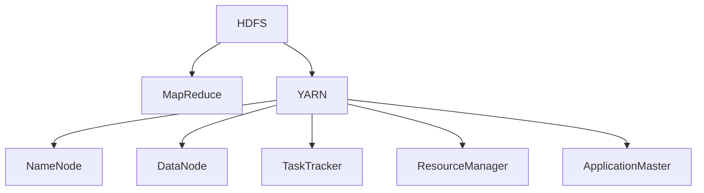

                 

# 【AI大数据计算原理与代码实例讲解】Hadoop

> 关键词：大数据，分布式计算，Hadoop，MapReduce，YARN

## 1. 背景介绍

### 1.1 问题由来
在当前数字化转型的背景下，数据的重要性日益凸显。企业不仅需要收集、存储和处理海量数据，还需要从中提取有价值的信息，以驱动业务决策和战略规划。然而，面对大规模数据集，传统的单机处理方式往往难以应对。这时，分布式计算技术便应运而生，其中Hadoop是最具代表性的分布式计算框架。

Hadoop是一个开源的、分布式的、可靠的大数据处理平台。它由两个核心组件构成：分布式文件系统HDFS和分布式计算框架MapReduce。HDFS负责存储海量数据，而MapReduce则负责在HDFS上执行大规模数据处理任务。Hadoop的分布式特性使其能够在集群中高效地处理大规模数据，非常适合大数据处理场景。

### 1.2 问题核心关键点
Hadoop的核心思想是将数据分散存储在多台计算机上，并通过并行计算方式处理数据。其核心组件HDFS和MapReduce分别解决了数据的存储和计算问题，使得大数据处理变得更加高效和可靠。

HDFS的核心概念包括：
- 数据冗余存储：通过跨机复制数据，确保数据的高可用性和容错性。
- 数据块分布式存储：将数据分割成固定大小的数据块，并将这些块分布式存储在多个节点上。
- 文件命名空间：统一管理集群中的数据文件，方便数据的读取和访问。

MapReduce的核心概念包括：
- Map函数：将数据分割成多个小的子任务，并行处理。
- Reduce函数：将Map函数的输出结果合并，最终产生结果。
- 容错机制：通过并行任务的方式，确保在某个任务失败时，整个计算过程仍能继续进行。

## 2. 核心概念与联系

### 2.1 核心概念概述

为了更好地理解Hadoop的原理和架构，本节将介绍几个密切相关的核心概念：

- HDFS：Hadoop分布式文件系统，负责存储海量数据。
- MapReduce：Hadoop的分布式计算框架，用于在大数据集上执行分布式计算任务。
- YARN：资源管理系统，负责管理Hadoop集群中的资源分配和调度。
- NameNode：HDFS的元数据管理节点，负责监控集群中的文件和块状态。
- DataNode：HDFS的存储节点，负责存储数据块。
- TaskTracker：MapReduce的执行节点，负责执行Map和Reduce任务。
- ResourceManager：YARN的资源管理器，负责分配集群中的计算资源。
- ApplicationMaster：MapReduce的调度器，负责调度Map和Reduce任务。

这些核心概念之间的逻辑关系可以通过以下Mermaid流程图来展示：



这个流程图展示了大数据处理的整个流程：

1. 数据存储在HDFS中，通过跨机复制和数据块分布式存储来保证数据的可靠性和高效性。
2. 数据处理通过MapReduce框架进行，任务被分割成Map和Reduce函数，并行执行。
3. YARN负责资源管理，通过ResourceManager和ApplicationMaster实现资源的分配和调度。
4. NameNode和DataNode共同管理HDFS的数据和元数据。
5. TaskTracker负责执行Map和Reduce任务，确保计算过程的可靠性和容错性。

### 2.2 概念间的关系

这些核心概念之间存在着紧密的联系，形成了Hadoop大数据处理的完整生态系统。下面我们通过几个Mermaid流程图来展示这些概念之间的关系。

#### 2.2.1 HDFS与MapReduce的关系


这个流程图展示了HDFS与MapReduce的基本关系。HDFS负责存储数据，而MapReduce负责计算处理数据。

#### 2.2.2 MapReduce的工作流程


这个流程图展示了MapReduce的工作流程。首先，输入数据通过Map函数进行分割和处理，产生中间结果；然后，中间结果通过Reduce函数进行合并和汇总，最终产生结果。

#### 2.2.3 YARN的资源管理


这个流程图展示了YARN的资源管理过程。ResourceManager负责分配集群资源，NodeManager负责管理集群节点，ApplicationMaster负责调度MapReduce任务。

## 3. 核心算法原理 & 具体操作步骤
### 3.1 算法原理概述

Hadoop的核心算法原理是分布式计算和数据存储。其分布式计算框架MapReduce通过并行计算方式，将大规模数据处理任务分割成小的子任务，并行执行，最终产生结果。而分布式文件系统HDFS通过数据冗余存储和数据块分布式存储，确保数据的高可用性和高效性。

### 3.2 算法步骤详解

Hadoop的核心算法步骤如下：

1. **数据存储**：将数据存储在HDFS中，通过跨机复制和数据块分布式存储，确保数据的可靠性和高效性。

2. **任务拆分**：将大数据处理任务拆分成多个小的子任务，分别在集群中的不同节点上执行。

3. **Map任务执行**：每个节点上的Map任务负责对本地数据进行处理，并将处理结果传递给Reduce任务。

4. **Reduce任务执行**：Reduce任务负责将Map任务的输出结果进行合并和汇总，最终产生最终结果。

5. **结果输出**：将最终结果写入HDFS，完成整个大数据处理任务。

### 3.3 算法优缺点

Hadoop的优点包括：
- 高度可扩展性：能够轻松地添加更多节点，扩展集群容量。
- 高可靠性：通过数据冗余存储和容错机制，确保数据的高可用性。
- 高效性：通过并行计算方式，高效地处理大规模数据。

Hadoop的缺点包括：
- 数据预处理复杂：数据需要在HDFS中进行拆分和存储，增加了数据处理的复杂度。
- 学习曲线陡峭：需要深入理解Hadoop的架构和配置，才能高效使用。
- 不适合小数据处理：对于小数据集，Hadoop的性能可能不如单机处理方式。

### 3.4 算法应用领域

Hadoop的分布式计算和数据存储技术被广泛应用于大数据处理领域，包括但不限于以下几个方面：

- 数据仓库：用于存储和查询大规模数据，支持各种数据分析工具和应用。
- 日志分析：用于存储和分析系统日志、应用日志等，帮助监控和故障排查。
- 图像和视频处理：用于处理和存储大规模图像、视频等媒体数据。
- 科学研究：用于存储和分析科学研究中的大规模数据集，如基因组数据、气候数据等。
- 金融分析：用于存储和处理金融交易数据、市场数据等，支持金融风险控制和投资决策。

此外，Hadoop还被广泛应用于各种行业领域，如电子商务、医疗、政府等，成为数据处理和分析的基石。

## 4. 数学模型和公式 & 详细讲解 & 举例说明

### 4.1 数学模型构建

Hadoop的大数据处理过程主要涉及分布式文件系统和分布式计算两个方面。下面我们通过数学语言对这两个方面进行更加严格的刻画。

#### 4.1.1 HDFS的数学模型

HDFS通过数据冗余存储和数据块分布式存储来保证数据的可靠性和高效性。假设数据集为 $D=\{d_1, d_2, \ldots, d_n\}$，将其分割成 $m$ 个大小相等的块 $B_1, B_2, \ldots, B_m$，并跨机复制 $r$ 份，存储在 $n$ 个节点上。HDFS的数学模型为：

$$
D = \bigcup_{i=1}^n \bigcup_{j=1}^r B_{ij}
$$

其中 $B_{ij}$ 表示数据块 $B_j$ 在节点 $i$ 上的复制。

#### 4.1.2 MapReduce的数学模型

MapReduce通过并行计算方式处理大规模数据集。假设数据集为 $D=\{d_1, d_2, \ldots, d_n\}$，将其分割成 $m$ 个大小相等的块 $B_1, B_2, \ldots, B_m$，在 $n$ 个节点上执行Map任务和Reduce任务。MapReduce的数学模型为：

$$
R = \bigcup_{i=1}^n \bigcup_{j=1}^m Map(d_{ij})
$$

其中 $Map(d_{ij})$ 表示节点 $i$ 上对数据块 $B_j$ 执行Map任务后的结果。

### 4.2 公式推导过程

以下我们以一个简单的文本统计为例，推导MapReduce的数学模型及其推导过程。

假设有一份包含大量文本的文件 $D=\{d_1, d_2, \ldots, d_n\}$，我们需要统计每个单词的出现次数。假设单词 $w$ 在文本 $d_i$ 中出现的次数为 $c_i(w)$，则MapReduce的统计过程可以表示为：

1. Map函数：将每个文本 $d_i$ 分割成单词，统计每个单词出现的次数，生成中间结果 $Map(d_i)$。
2. Reduce函数：将Map函数的输出结果进行合并，最终生成每个单词的总出现次数 $Reduce(w)$。

设 $Map(d_i)$ 为 $(w_1, c_1(w)), (w_2, c_2(w)), \ldots, (w_m, c_m(w))$，其中 $c_k(w)$ 表示单词 $w$ 在文本 $d_i$ 中出现的次数。则Map函数的输出结果可以表示为：

$$
Map(d_i) = \{(w_1, c_1(w)), (w_2, c_2(w)), \ldots, (w_m, c_m(w))\}
$$

Reduce函数的输出结果可以表示为：

$$
Reduce(w) = \sum_{i=1}^n \sum_{k=1}^m c_k(w)
$$

通过MapReduce的计算过程，我们可以高效地统计大规模文本数据中的单词出现次数。

### 4.3 案例分析与讲解

以一个简单的文本统计案例为例，进一步说明Hadoop的计算过程。

假设我们有一份包含大量文本的文件 $D=\{d_1, d_2, \ldots, d_n\}$，我们需要统计每个单词的出现次数。首先，我们将文件分割成若干个数据块，每个节点上的Map任务负责处理一个数据块。Map任务将每个文本 $d_i$ 分割成单词，统计每个单词出现的次数，生成中间结果 $Map(d_i)$。Reduce任务将Map任务的输出结果进行合并，最终生成每个单词的总出现次数 $Reduce(w)$。

具体实现步骤如下：

1. 将文件 $D$ 分割成若干个数据块 $B_1, B_2, \ldots, B_m$，每个节点上的Map任务负责处理一个数据块。
2. Map任务对每个数据块进行分割和统计，生成中间结果 $Map(d_i)$。
3. Reduce任务将Map任务的输出结果进行合并，生成每个单词的总出现次数 $Reduce(w)$。

通过MapReduce的计算过程，我们可以高效地统计大规模文本数据中的单词出现次数。

## 5. 项目实践：代码实例和详细解释说明

### 5.1 开发环境搭建

在进行Hadoop开发前，我们需要准备好开发环境。以下是使用Hadoop的开发环境配置流程：

1. 安装Hadoop：从Hadoop官网下载最新版本的安装包，解压并运行配置脚本。

2. 启动Hadoop服务：在终端执行命令 `hadoop namenode -start` 和 `hadoop datanode -start`，启动HDFS和MapReduce服务。

3. 安装Hadoop客户端：通过JDK编译并运行Hadoop客户端，如Hadoop Command Line Interface (CLI)、Web UI等。

完成上述步骤后，即可在集群环境中进行Hadoop的开发和测试。

### 5.2 源代码详细实现

下面我们以一个简单的文本统计案例为例，给出使用Hadoop进行MapReduce开发的代码实现。

首先，定义Map函数和Reduce函数：

```java
public class MapTask extends Mapper<LongWritable, Text, Text, IntWritable> {
    private final static IntWritable one = new IntWritable(1);
    private Text word = new Text();

    public void map(LongWritable key, Text value, Context context) throws IOException, InterruptedException {
        StringTokenizer itr = new StringTokenizer(value.toString());
        while (itr.hasMoreTokens()) {
            word.set(itr.nextToken());
            context.write(word, one);
        }
    }
}

public class ReduceTask extends Reducer<Text, IntWritable, Text, IntWritable> {
    private IntWritable result = new IntWritable();

    public void reduce(Text key, Iterable<IntWritable> values, Context context) throws IOException, InterruptedException {
        int sum = 0;
        for (IntWritable val : values) {
            sum += val.get();
        }
        result.set(sum);
        context.write(key, result);
    }
}
```

然后，定义Job类和main函数：

```java
import org.apache.hadoop.fs.Path;
import org.apache.hadoop.io.IntWritable;
import org.apache.hadoop.io.Text;
import org.apache.hadoop.mapreduce.Job;
import org.apache.hadoop.mapreduce.Mapper;
import org.apache.hadoop.mapreduce.Reducer;
import org.apache.hadoop.mapreduce.lib.input.FileInputFormat;
import org.apache.hadoop.mapreduce.lib.output.FileOutputFormat;
import org.apache.hadoop.utilGeneral;

public class WordCount {
    public static void main(String[] args) throws Exception {
        Configuration conf = new Configuration();
        Job job = Job.getInstance(conf, "word count");
        job.setJarByClass(WordCount.class);
        job.setMapperClass(MapTask.class);
        job.setCombinerClass(ReduceTask.class);
        job.setReducerClass(ReduceTask.class);
        job.setOutputKeyClass(Text.class);
        job.setOutputValueClass(IntWritable.class);
        FileInputFormat.addInputPath(job, new Path(args[0]));
        FileOutputFormat.setOutputPath(job, new Path(args[1]));
        System.exit(job.waitForCompletion(true) ? 0 : 1);
    }
}
```

最后，启动MapReduce作业并输出结果：

```bash
hadoop jar WordCount.jar input_dir output_dir
```

以上就是使用Hadoop进行MapReduce开发的完整代码实现。可以看到，通过Hadoop的强大API和工具支持，开发过程非常简洁高效。

### 5.3 代码解读与分析

让我们再详细解读一下关键代码的实现细节：

**MapTask类**：
- `map`方法：将输入的文本分割成单词，并统计每个单词出现的次数。

**ReduceTask类**：
- `reduce`方法：将Map任务的输出结果进行合并，计算每个单词的总出现次数。

**Job类和main函数**：
- 设置Hadoop作业的配置和任务参数，包括输入输出路径、Map和Reduce函数等。
- 使用Hadoop的命令行工具 `hadoop jar` 启动作业，指定输入输出路径。

**运行结果展示**：
- 在输入目录下运行命令 `hadoop jar WordCount.jar input_dir output_dir`，将输出结果写入 `output_dir` 目录中。

## 6. 实际应用场景

### 6.1 智能推荐系统

智能推荐系统是大数据处理的重要应用场景之一。通过Hadoop的大数据处理技术，可以高效地处理用户行为数据，分析用户兴趣偏好，生成个性化推荐结果。

具体而言，可以将用户的历史行为数据（如浏览记录、点击记录、购买记录等）作为输入数据，通过Hadoop进行分布式处理。Map任务负责统计用户的行为次数，Reduce任务负责将结果进行合并和汇总。最终，根据用户行为数据生成个性化推荐结果，返回给用户。

### 6.2 金融风控系统

金融风控系统需要实时处理大量的交易数据和用户数据，以检测异常交易和防范欺诈行为。通过Hadoop的大数据处理技术，可以高效地处理和分析大规模数据集，实现实时监控和风险预警。

具体而言，可以将金融交易数据和用户数据作为输入数据，通过Hadoop进行分布式处理。Map任务负责统计每笔交易的特征，Reduce任务负责计算每笔交易的风险评分。最终，根据风险评分生成异常交易检测报告，返回给金融风控系统。

### 6.3 科学研究

科学研究需要处理和分析大量的数据集，如基因组数据、气候数据等。通过Hadoop的大数据处理技术，可以高效地处理和分析大规模数据集，实现科学数据的存储和分析。

具体而言，可以将科学研究中的大规模数据集作为输入数据，通过Hadoop进行分布式处理。Map任务负责数据预处理和特征提取，Reduce任务负责数据统计和分析。最终，生成科学研究的分析报告，返回给研究人员。

## 7. 工具和资源推荐

### 7.1 学习资源推荐

为了帮助开发者系统掌握Hadoop的理论基础和实践技巧，这里推荐一些优质的学习资源：

1.《Hadoop: The Definitive Guide》：Hadoop官方文档，详细介绍了Hadoop的架构、配置和使用方法。

2.《Hadoop in Action》：实战性的Hadoop开发指南，通过大量实例和案例讲解Hadoop的应用。

3. Coursera的《Hadoop in Practice》课程：由Stanford大学教授讲解，涵盖Hadoop的完整生态系统，适合入门学习。

4. Hadoop官方博客和社区：Hadoop官方博客提供了最新的技术动态和实践经验，Hadoop社区提供了大量的开源工具和组件。

5. Hadoop用户手册：详细介绍了Hadoop的使用方法和最佳实践，适合Hadoop开发者参考。

通过对这些资源的学习实践，相信你一定能够快速掌握Hadoop的核心原理和实践技巧，并用于解决实际的Hadoop问题。

### 7.2 开发工具推荐

高效的开发离不开优秀的工具支持。以下是几款用于Hadoop开发和管理的常用工具：

1. Hadoop Command Line Interface (CLI)：Hadoop提供的命令行工具，方便开发者进行Hadoop作业的提交和监控。

2. Hadoop Web UI：Hadoop提供的Web界面，方便开发者进行Hadoop集群的监控和管理。

3. Cloudera Manager：Cloudera提供的集群管理工具，支持Hadoop、Hive、HBase等多个组件的管理和监控。

4. Ambari：Apache提供的Hadoop集群管理工具，支持Hadoop、Hive、HBase等多个组件的管理和监控。

5. Oozie：Apache提供的流程调度系统，支持Hadoop作业的自动化调度和执行。

合理利用这些工具，可以显著提升Hadoop开发和管理的效率，加快数据处理和分析的速度。

### 7.3 相关论文推荐

Hadoop作为大数据处理的重要技术，其发展源于学界的持续研究。以下是几篇奠基性的相关论文，推荐阅读：

1. "The Google File System"：介绍谷歌文件系统GFS的论文，为HDFS奠定了基础。

2. "MapReduce: Simplified Data Processing on Large Clusters"：介绍MapReduce框架的论文，详细介绍了MapReduce的计算原理和实现。

3. "Yet Another Resource Negotiator"：介绍YARN资源管理系统的论文，详细介绍了YARN的资源管理机制和实现。

4. "A Data-Efficient Distributed Machine Learning Algorithm"：介绍Spark的论文，详细介绍了Spark的计算原理和实现。

5. "A Stochastic Approximation Method for Nonlinear Mapping and Classification"：介绍深度学习在Hadoop上的应用，详细介绍了深度学习在Hadoop上的计算原理和实现。

这些论文代表了大数据处理技术的发展脉络。通过学习这些前沿成果，可以帮助研究者把握学科前进方向，激发更多的创新灵感。

除上述资源外，还有一些值得关注的前沿资源，帮助开发者紧跟大数据处理技术的最新进展，例如：

1. Hadoop官网和社区：Hadoop官网提供了最新的技术动态和实践经验，Hadoop社区提供了大量的开源工具和组件。

2. Hadoop相关的技术博客：如Hadoop用户手册、Hadoop中文社区等，提供了丰富的技术资源和经验分享。

3. Hadoop相关的技术会议：如Hadoop Summit、Strata Data Conference等，提供最新的技术动态和前沿思考。

4. Hadoop相关的开源项目：如Apache Hadoop、Hadoop项目、Hadoop中国社区等，提供了丰富的开源资源和代码实践。

总之，对于Hadoop的学习和实践，需要开发者保持开放的心态和持续学习的意愿。多关注前沿资讯，多动手实践，多思考总结，必将收获满满的成长收益。

## 8. 总结：未来发展趋势与挑战

### 8.1 总结

本文对Hadoop大数據处理技术的原理和实践进行了全面系统的介绍。首先阐述了Hadoop的核心理念和大数据处理的背景，明确了Hadoop在分布式计算和数据存储方面的独特价值。其次，从原理到实践，详细讲解了Hadoop的数学模型和算法步骤，给出了Hadoop任务开发的完整代码实例。同时，本文还广泛探讨了Hadoop技术在智能推荐系统、金融风控系统、科学研究等多个领域的应用前景，展示了Hadoop技术的巨大潜力。此外，本文精选了Hadoop的学习资源，力求为读者提供全方位的技术指引。

通过本文的系统梳理，可以看到，Hadoop作为大数据处理的重要技术，其分布式计算和数据存储能力在大数据时代具有重要的应用价值。随着大数据处理需求的日益增长，Hadoop必将得到更广泛的应用和发展，成为数据处理的重要基石。

### 8.2 未来发展趋势

展望未来，Hadoop的大数据处理技术将呈现以下几个发展趋势：

1. 分布式存储技术的演进：随着存储需求的不断增长，分布式存储技术将不断演进，如HDFS的下一代分布式文件系统Hadoop File System 3（HDFS-3）。

2. 计算框架的多样化：除了Hadoop，未来还将涌现更多分布式计算框架，如Spark、Flink、Storm等，这些框架将与Hadoop互相补充，共同构建更完善的分布式计算生态。

3. 云计算的深入融合：随着云计算技术的不断发展，Hadoop将更加深入地融入云平台，支持多云环境的分布式计算。

4. 容器化和微服务的普及：容器化技术如Docker、Kubernetes等将进一步普及，帮助开发者更高效地管理和调度Hadoop集群资源。

5. 大数据与人工智能的结合：随着AI技术的不断发展，大数据与人工智能将深度融合，Hadoop将支持更多基于AI的数据处理和分析。

以上趋势凸显了Hadoop大数据处理技术的广阔前景。这些方向的探索发展，必将进一步提升Hadoop系统的性能和应用范围，为大数据处理带来新的突破。

### 8.3 面临的挑战

尽管Hadoop的大数据处理技术已经取得了巨大的成功，但在迈向更加智能化、普适化应用的过程中，它仍面临着诸多挑战：

1. 数据预处理复杂：数据需要在HDFS中进行拆分和存储，增加了数据处理的复杂度。

2. 学习曲线陡峭：需要深入理解Hadoop的架构和配置，才能高效使用。

3. 性能瓶颈：Hadoop的性能瓶颈主要集中在I/O和网络通信方面，需要进一步优化。

4. 资源管理复杂：资源管理的复杂性使得集群规模和资源配置需要高度专业化，增加了系统部署和维护的难度。

5. 安全性问题：Hadoop集群中的敏感数据和计算资源需要严格的安全管理，以防止数据泄露和恶意攻击。

6. 可扩展性问题：Hadoop集群的可扩展性受到节点数量和数据量的限制，需要进一步优化和改进。

正视Hadoop面临的这些挑战，积极应对并寻求突破，将是大数据处理技术迈向成熟的必由之路。相信随着学界和产业界的共同努力，这些挑战终将一一被克服，Hadoop必将在大数据处理领域发挥更大的作用。

### 8.4 未来突破

面对Hadoop所面临的种种挑战，未来的研究需要在以下几个方面寻求新的突破：

1. 提升分布式存储性能：优化HDFS和Hadoop File System 3（HDFS-3）的性能，提升数据访问速度和可靠性。

2. 优化分布式计算框架：优化Spark、Flink、Storm等分布式计算框架，提升计算效率和资源利用率。

3. 改进资源管理机制：改进YARN和容器化技术，提升集群资源的利用效率和管理水平。

4. 增强大数据与AI的融合：引入深度学习、强化学习等AI技术，提升Hadoop大数据处理和分析的能力。

5. 引入区块链和分布式账本技术：引入区块链和分布式账本技术，增强Hadoop集群的数据安全和隐私保护。

6. 改进大数据处理流程：引入数据流计算、流式处理等技术，优化大数据处理流程，提升处理效率。

这些研究方向的探索，必将引领Hadoop大数据处理技术迈向更高的台阶，为大数据处理和分析带来新的突破。面向未来，Hadoop必将发挥更大的作用，助力数据驱动的未来。

## 9. 附录：常见问题与解答

**Q1：Hadoop的分布式计算框架MapReduce有哪些优点和缺点？**

A: 分布式计算框架MapReduce具有以下几个优点：
- 高度可扩展性：能够轻松地添加更多节点，扩展集群容量。
- 高可靠性：通过数据冗余存储和容错机制，确保数据的高可用性。
- 高效性：通过并行计算方式，高效地处理大规模数据。

同时，MapReduce也存在一些缺点：
- 数据预处理复杂：数据需要在HDFS中进行拆分和存储，增加了数据

