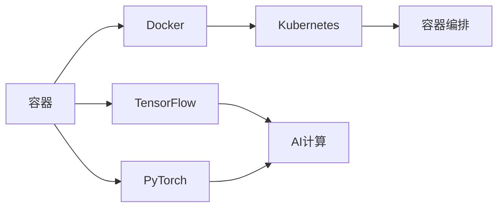

                 

# 【AI大数据计算原理与代码实例讲解】容器

## 1. 背景介绍

容器技术在近年来得到了飞速的发展，并逐渐成为了云计算和微服务架构的核心技术之一。容器化改变了软件开发和部署的范式，使得应用的可移植性、可扩展性和可管理性得到了极大的提升。与此同时，随着AI技术和大数据技术的不断进步，AI和容器技术的融合也成为了一个重要的研究方向。本文将全面介绍容器化在AI计算中的应用原理和实践实例，帮助读者深入理解容器与AI的结合，并掌握基于容器的AI计算方法和工具。

## 2. 核心概念与联系

### 2.1 核心概念概述

为了更深入地理解容器在AI计算中的应用，首先需要明确一些关键概念：

- **容器（Container）**：是一种轻量级的、运行时的封装，能够隔离应用运行环境，使得应用在不同环境下以一致的方式运行。
- **容器编排（Container Orchestration）**：指的是对容器的管理、调度和部署过程，通常通过编排工具如Kubernetes来实现。
- **Docker**：是当前最流行的容器化平台，提供了容器化应用的标准化运行环境，并且支持多种容器编排工具。
- **TensorFlow、PyTorch**：是目前最流行的AI计算框架，能够在大规模分布式环境中高效运行。
- **AI计算需求**：AI计算需要高吞吐量的数据处理、大规模的模型训练和推理，这些任务通常需要分布式计算和资源调度。

这些概念之间的联系通过以下Mermaid流程图进行展示：



### 2.2 概念间的关系

容器化技术通过提供隔离和封装的环境，使得AI计算框架能够在大规模分布式环境中高效运行，同时也提供了更好的资源利用率和弹性调度能力。TensorFlow和PyTorch等AI计算框架在容器化后，可以更好地进行模型的分布式训练和推理，并且能够方便地部署到不同的云平台和物理环境中。容器编排工具如Kubernetes提供了自动化运维和调度功能，进一步提升了AI应用的可靠性和可扩展性。

## 3. 核心算法原理 & 具体操作步骤
### 3.1 算法原理概述

容器化在AI计算中的应用主要涉及两个方面：一是模型训练和推理过程的容器化，二是模型服务化和自动化运维的容器编排。

**模型训练和推理的容器化**：通过将AI计算框架和模型封装在Docker容器中，能够在不同环境中保持一致的运行状态和性能。这种方式大大简化了模型的部署和迁移，提高了开发和维护的效率。

**模型服务化和自动化运维**：通过Kubernetes等容器编排工具，能够实现模型的自动化部署、调度和监控。模型服务化使得模型能够以RESTful API的形式提供服务，便于不同的应用系统集成和使用。

### 3.2 算法步骤详解

容器化在AI计算中的应用可以大致分为以下几步：

1. **模型开发**：在本地或分布式环境中开发和训练AI模型，确保模型的正确性和性能。
2. **模型封装**：将模型和相关依赖库封装到Docker容器中，并生成镜像文件。
3. **容器编排**：将容器部署到Kubernetes等容器编排平台上，通过编排工具管理容器的生命周期和资源调度。
4. **服务化部署**：将模型以API的形式服务化部署，并通过API网关提供统一的访问入口。
5. **监控与优化**：实时监控模型的运行状态和性能，通过自动化的调度和优化，确保模型的高效运行。

### 3.3 算法优缺点

容器化在AI计算中的应用带来了以下几个优点：

- **提高模型部署效率**：容器化使得模型的部署和迁移变得更加简单和高效。
- **增强模型性能和可靠性**：容器提供了隔离的环境，确保了模型的运行状态和性能一致。
- **提升资源利用率**：通过容器编排，可以更好地利用计算资源，避免资源浪费。
- **简化运维管理**：容器编排工具提供了自动化的运维和管理功能，降低了运维复杂度。

然而，容器化也存在一些缺点：

- **启动时间较长**：由于容器需要完整的启动和运行环境，因此启动时间相对较长。
- **容器大小和存储问题**：大型模型和复杂依赖库可能导致容器大小和存储问题，影响模型部署的灵活性。
- **网络通信开销**：容器之间的通信需要通过网络进行，可能导致网络通信开销增加。

### 3.4 算法应用领域

容器化在AI计算中的应用非常广泛，涵盖了模型训练、推理、服务化部署等多个环节。以下是一些典型的应用场景：

- **大规模模型训练**：通过容器编排，实现大规模分布式训练，提高模型的训练效率和性能。
- **在线模型推理**：将模型以RESTful API的形式服务化部署，支持高并发的在线推理服务。
- **模型版本管理**：通过容器和镜像管理，方便地进行模型版本管理和更新，确保应用的稳定性和一致性。
- **跨平台和云环境部署**：容器提供了跨平台和云环境的灵活部署能力，能够方便地将模型部署到不同的环境中。

## 4. 数学模型和公式 & 详细讲解
### 4.1 数学模型构建

在本节中，我们将通过一个简单的例子来说明容器在AI计算中的应用。假设我们有一个简单的神经网络模型，用于图像分类任务。

首先，我们需要在本地或分布式环境中训练这个模型。模型的训练过程可以描述为：

$$
\min_{\theta} \frac{1}{N} \sum_{i=1}^N \ell(f_{\theta}(x_i), y_i)
$$

其中，$f_{\theta}(x_i)$ 表示模型对输入 $x_i$ 的预测结果，$\ell$ 表示损失函数，$y_i$ 表示真实标签。

### 4.2 公式推导过程

在模型训练完成后，我们需要将模型封装到Docker容器中，并生成镜像文件。镜像是容器的静态表示，包含了模型的所有依赖库和配置信息。

镜像是通过Dockerfile文件构建的，其中可以包含如下指令：

```Dockerfile
# 基础镜像
FROM tensorflow/tensorflow:latest

# 复制训练脚本和数据
COPY train.py data/

# 安装依赖库
RUN pip install -r requirements.txt

# 设置工作目录
WORKDIR /home/deploy

# 设置环境变量
ENV MODEL_NAME=my_model
ENV MODEL_DIR=./my_model

# 训练模型
RUN python train.py --data=data --model=${MODEL_NAME} --output=${MODEL_DIR}
```

在上述Dockerfile中，我们使用了TensorFlow作为基础镜像，并在其中安装了训练脚本和数据，然后构建了包含模型依赖库的镜像文件。

### 4.3 案例分析与讲解

为了更好地理解容器化在AI计算中的应用，我们以一个具体的项目为例：使用TensorFlow训练一个图像分类模型，并服务化部署到Kubernetes中。

首先，我们需要编写训练脚本，并定义好数据集和模型结构：

```python
# train.py
import tensorflow as tf

# 定义模型结构
model = tf.keras.Sequential([
    tf.keras.layers.Conv2D(32, (3, 3), activation='relu', input_shape=(28, 28, 1)),
    tf.keras.layers.MaxPooling2D((2, 2)),
    tf.keras.layers.Flatten(),
    tf.keras.layers.Dense(10, activation='softmax')
])

# 定义损失函数和优化器
loss_fn = tf.keras.losses.SparseCategoricalCrossentropy(from_logits=True)
optimizer = tf.keras.optimizers.Adam()

# 定义模型训练过程
def train_fn(x, y):
    with tf.GradientTape() as tape:
        logits = model(x, training=True)
        loss_value = loss_fn(y, logits)
    gradients = tape.gradient(loss_value, model.trainable_variables)
    optimizer.apply_gradients(zip(gradients, model.trainable_variables))
```

在上述代码中，我们定义了一个简单的卷积神经网络模型，并使用了TensorFlow的高级API进行模型训练。

接下来，我们需要将训练脚本和数据集封装到Docker容器中，并构建镜像文件。假设我们已经有了一个名为my_model的训练脚本和一个名为data的训练数据集，我们可以使用以下命令构建镜像文件：

```bash
docker build -t my_model .
```

构建完成后，我们就可以将镜像文件推送到Docker Hub或本地仓库中，并在Kubernetes中编排容器了。

### 5. 项目实践：代码实例和详细解释说明

#### 5.1 开发环境搭建

要开始容器化的AI计算项目，我们需要搭建一个开发环境。以下是在Ubuntu 20.04系统中搭建Docker和Kubernetes环境的步骤：

1. 安装Docker
   ```bash
   sudo apt update
   sudo apt install -y apt-transport-https ca-certificates curl gnupg-lsb-release
   curl -fsSL https://download.docker.com/linux/ubuntu/gpg | sudo gpg --dearmor -o /usr/share/keyrings/docker-archive-keyring.gpg
   echo "deb [arch=amd64 signed-by=/usr/share/keyrings/docker-archive-keyring.gpg] https://download.docker.com/linux/ubuntu $(lsb_release -cs) stable" | sudo tee /etc/apt/sources.list.d/docker.list > /dev/null
   sudo apt update
   sudo apt install -y docker-ce docker-ce-cli containerd.io
   sudo systemctl enable --now docker
   ```

2. 安装Kubernetes
   ```bash
   sudo apt install -y apt-transport-https ca-certificates curl gnupg-lsb-release
   curl -fsSL https://packages.cloud.google.com/apt/doc/apt-key.gpg | sudo gpg --dearmor -o /usr/share/keyrings/cni-keyring.gpg
   echo "deb [arch=amd64 signed-by=/usr/share/keyrings/cni-keyring.gpg] https://apt.kubernetes.io/ kubernetes-xenial main" | sudo tee /etc/apt/sources.list.d/kubernetes.list > /dev/null
   sudo apt update
   sudo apt install -y kubelet kubeadm kubectl
   sudo systemctl enable --now kubelet kubeadm kubectl
   ```

3. 初始化Kubernetes集群
   ```bash
   sudo kubeadm init
   ```

完成环境搭建后，我们就可以开始使用Docker和Kubernetes进行AI计算项目的开发了。

#### 5.2 源代码详细实现

以下是一个简单的TensorFlow图像分类模型的Dockerfile和Kubernetes配置文件：

##### 5.2.1 Dockerfile

```Dockerfile
# 使用TensorFlow基础镜像
FROM tensorflow/tensorflow:latest

# 复制训练脚本和数据
COPY train.py data/

# 安装依赖库
RUN pip install -r requirements.txt

# 设置工作目录
WORKDIR /home/deploy

# 设置环境变量
ENV MODEL_NAME=my_model
ENV MODEL_DIR=./my_model

# 训练模型
RUN python train.py --data=data --model=${MODEL_NAME} --output=${MODEL_DIR}
```

##### 5.2.2 Kubernetes配置文件

```yaml
# 容器配置
apiVersion: v1
name: my_model
image: docker.io/myusername/my_model:latest
ports:
  - containerPort: 8080

# 服务配置
apiVersion: v1
name: my_model-service
type: LoadBalancer
selector:
  name: my_model
ports:
  - protocol: TCP
    port: 8080
    targetPort: 8080
```

完成配置文件编写后，我们可以使用以下命令将模型部署到Kubernetes中：

```bash
kubectl create deployment my_model --image=docker.io/myusername/my_model:latest
kubectl expose deployment my_model --port=8080 --type=LoadBalancer
```

### 5.3 代码解读与分析

在上述代码中，我们使用了Dockerfile来定义模型的训练和打包过程，并使用了Kubernetes配置文件来描述模型服务的配置。通过这些配置文件，我们可以在Kubernetes中轻松地部署和管理模型服务。

## 6. 实际应用场景

容器化在AI计算中的应用非常广泛，以下是一些典型的应用场景：

- **大规模分布式训练**：通过容器编排，可以实现大规模分布式训练，提高模型的训练效率和性能。例如，在训练大规模图像分类模型时，可以使用多个GPU进行并行训练，加速模型的训练过程。
- **在线模型推理**：将模型以RESTful API的形式服务化部署，支持高并发的在线推理服务。例如，在自然语言处理任务中，可以使用容器化服务提供自然语言处理API，方便不同应用系统集成和使用。
- **模型版本管理**：通过容器和镜像管理，方便地进行模型版本管理和更新，确保应用的稳定性和一致性。例如，在模型的版本迭代过程中，可以通过容器和镜像管理，方便地进行模型的部署和升级。
- **跨平台和云环境部署**：容器提供了跨平台和云环境的灵活部署能力，能够方便地将模型部署到不同的环境中。例如，在将模型部署到云平台时，可以使用Kubernetes进行容器编排，实现模型的自动化部署和运维。

## 7. 工具和资源推荐

### 7.1 学习资源推荐

- **Docker官方文档**：Docker官方提供的文档，详细介绍了Docker的基本概念和使用方法。
- **Kubernetes官方文档**：Kubernetes官方提供的文档，详细介绍了Kubernetes的基本概念和使用方法。
- **TensorFlow官方文档**：TensorFlow官方提供的文档，详细介绍了TensorFlow的基本概念和使用方法。
- **PyTorch官方文档**：PyTorch官方提供的文档，详细介绍了PyTorch的基本概念和使用方法。

### 7.2 开发工具推荐

- **Docker**：Docker是当前最流行的容器化平台，提供了容器化应用的标准化运行环境。
- **Kubernetes**：Kubernetes是当前最流行的容器编排工具，提供了自动化运维和调度功能。
- **TensorFlow**：TensorFlow是目前最流行的AI计算框架，支持在大规模分布式环境中高效运行。
- **PyTorch**：PyTorch是目前最流行的AI计算框架，支持在大规模分布式环境中高效运行。

### 7.3 相关论文推荐

- **"Containerization of Machine Learning Applications"**：这篇论文详细介绍了将机器学习应用容器化的过程和方法。
- **"TensorFlow Serving"**：这篇论文详细介绍了TensorFlow Serving的应用实例和性能优化方法。
- **"Kubernetes Machine Learning"**：这篇论文详细介绍了在Kubernetes中运行机器学习模型的实践和挑战。

## 8. 总结：未来发展趋势与挑战

### 8.1 研究成果总结

本文详细介绍了容器化在AI计算中的应用，通过Docker和Kubernetes等工具，可以将AI计算框架和模型进行容器化部署和管理。容器化技术不仅简化了模型的部署和迁移，还提高了模型的运行效率和可靠性。未来，随着容器技术的不断进步，容器化在AI计算中的应用将会更加广泛和深入。

### 8.2 未来发展趋势

容器化在AI计算中的应用将会呈现以下几个发展趋势：

- **自动化和智能化**：未来，容器编排和运维将进一步智能化和自动化，通过机器学习和自动调优技术，提升容器的资源利用率和性能。
- **微服务和DevOps**：容器化技术将进一步融入DevOps文化和微服务架构中，实现模型的快速迭代和持续部署。
- **跨平台和云环境**：容器化将支持更多的跨平台和云环境部署，方便模型的迁移和运维。

### 8.3 面临的挑战

尽管容器化在AI计算中的应用已经取得了显著进展，但在实际应用中仍面临以下挑战：

- **容器启动时间**：由于容器需要完整的启动和运行环境，因此启动时间相对较长。
- **容器大小和存储问题**：大型模型和复杂依赖库可能导致容器大小和存储问题，影响模型部署的灵活性。
- **网络通信开销**：容器之间的通信需要通过网络进行，可能导致网络通信开销增加。

### 8.4 研究展望

未来，在容器化在AI计算中的应用研究中，还需要在以下几个方面寻求新的突破：

- **容器启动时间优化**：通过优化容器启动和运行环境，减少容器启动时间。
- **容器大小和存储优化**：通过容器压缩和稀疏化存储等技术，减少容器大小和存储需求。
- **网络通信优化**：通过容器网络优化技术，减少容器之间的通信开销。

总之，容器化技术在AI计算中的应用前景广阔，未来还有很大的探索空间。通过不断优化和创新，相信容器化将进一步提升AI计算的效率和性能，推动AI技术在各行各业的应用和发展。

## 9. 附录：常见问题与解答

**Q1：容器化在AI计算中的应用场景有哪些？**

A: 容器化在AI计算中的应用场景非常广泛，主要包括以下几个方面：
- 大规模分布式训练：通过容器编排，可以实现大规模分布式训练，提高模型的训练效率和性能。
- 在线模型推理：将模型以RESTful API的形式服务化部署，支持高并发的在线推理服务。
- 模型版本管理：通过容器和镜像管理，方便地进行模型版本管理和更新，确保应用的稳定性和一致性。
- 跨平台和云环境部署：容器提供了跨平台和云环境的灵活部署能力，能够方便地将模型部署到不同的环境中。

**Q2：如何优化容器的启动时间？**

A: 容器启动时间相对较长，可以通过以下方法进行优化：
- 使用预启动容器：将经常使用的依赖库和配置文件提前打包到预启动容器中，可以减少容器的启动时间。
- 使用容器缓存：通过缓存容器的启动和运行状态，可以加速容器的启动和恢复。

**Q3：如何优化容器的大小和存储？**

A: 容器大小和存储问题是容器化应用中的重要挑战，可以通过以下方法进行优化：
- 容器压缩：通过压缩容器的镜像文件，减少容器大小和存储需求。
- 容器稀疏化存储：通过稀疏化存储技术，减少容器的存储空间需求。

**Q4：如何优化容器之间的通信开销？**

A: 容器之间的通信开销是容器化应用中的重要问题，可以通过以下方法进行优化：
- 容器网络优化：通过优化容器网络拓扑和路由，减少容器之间的通信开销。
- 本地容器通信：通过将相关容器部署在同一主机上，可以减少容器之间的通信开销。

通过不断优化和创新，容器化技术将进一步提升AI计算的效率和性能，推动AI技术在各行各业的应用和发展。

