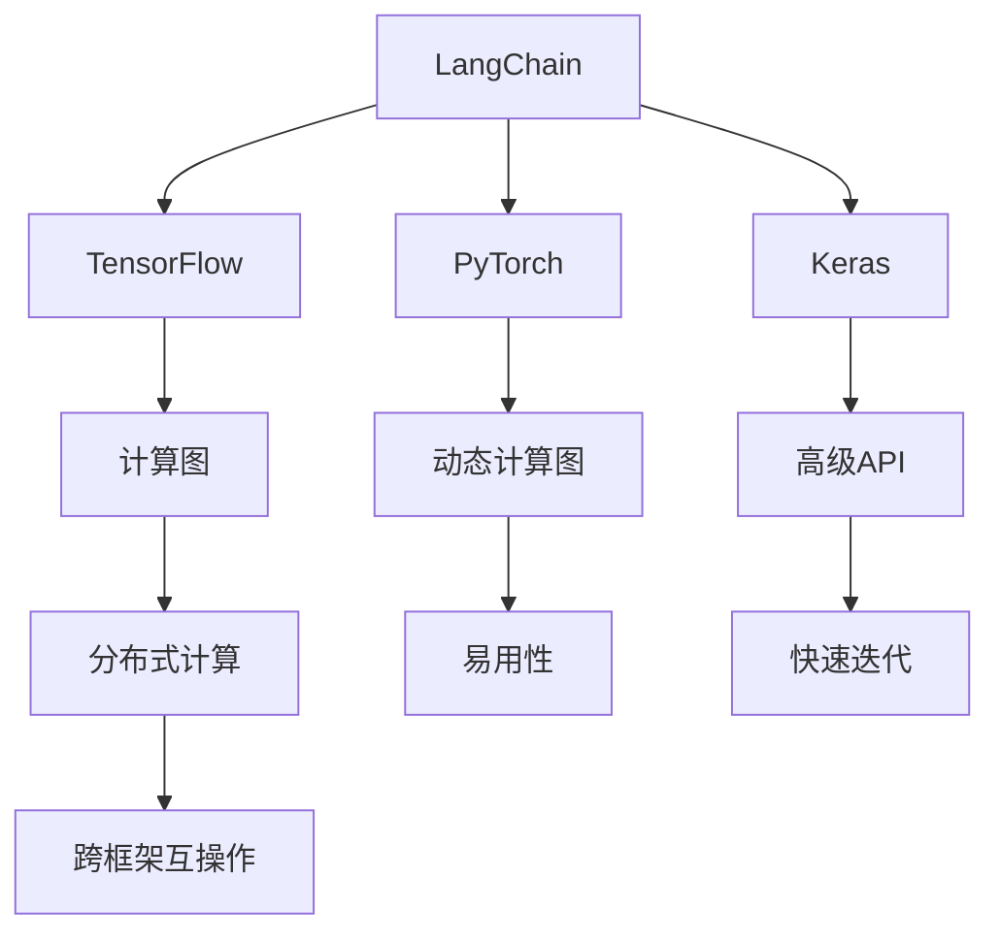
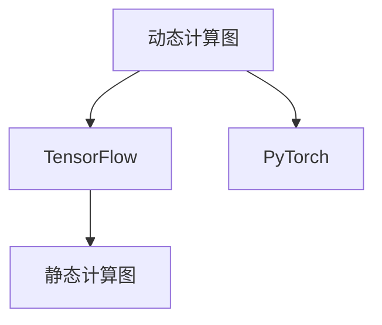
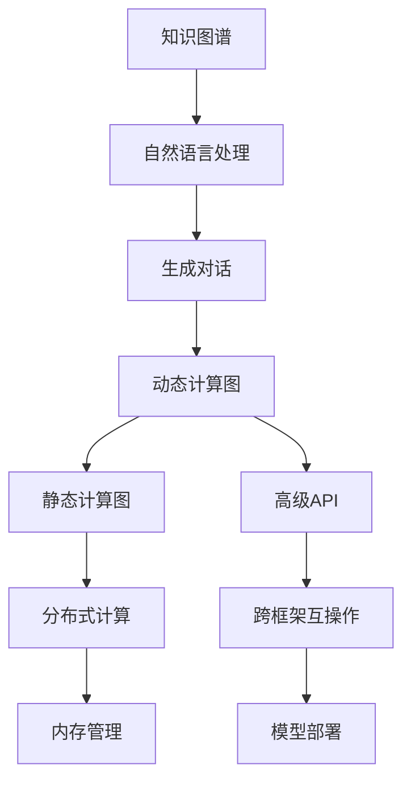
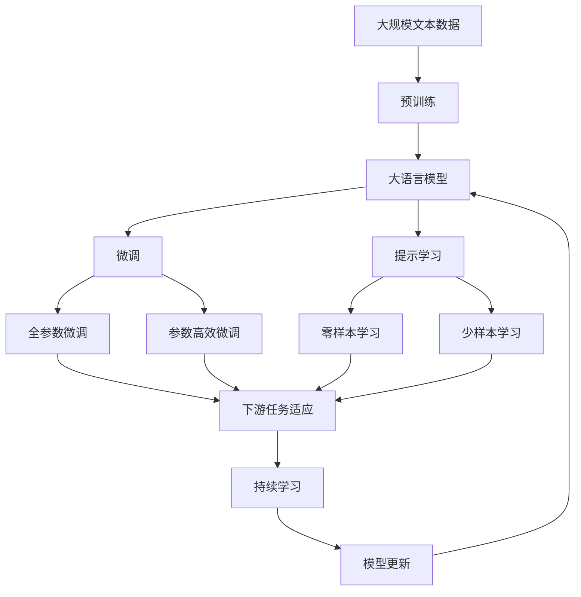

                 

# 【LangChain编程：从入门到实践】LangChain与其他框架的比较

> 关键词：

## 1. 背景介绍

### 1.1 问题由来

随着人工智能技术的不断发展，各类深度学习框架应运而生。在众多框架中，LangChain以其独特的优势，逐渐成为AI领域的新宠。但相较于其他框架如TensorFlow、PyTorch等，LangChain的具体表现如何，又有哪些不同之处，本文将从技术原理、实践操作、应用领域、优缺点等多个维度，对其进行详细介绍与对比。

### 1.2 问题核心关键点

LangChain与其他深度学习框架的对比，主要围绕以下核心关键点展开：

- **技术原理**：LangChain的核心技术是什么，与TensorFlow、PyTorch等框架有何异同？
- **实践操作**：使用LangChain进行深度学习项目开发，具体流程和步骤有哪些？
- **应用领域**：LangChain在哪些领域和场景中表现优异，能否替代其他框架？
- **优缺点**：LangChain的优势与不足分别是什么，与其他框架相比有何优劣势？

### 1.3 问题研究意义

通过对LangChain与其他深度学习框架的比较，可以帮助读者深入理解其核心技术和设计理念，明确在不同应用场景下的优劣势，为选择合适的深度学习框架提供科学依据。同时，了解框架之间的异同，对于开发者来说，也有助于更高效地进行项目开发和应用推广。

## 2. 核心概念与联系

### 2.1 核心概念概述

为更好地理解LangChain与其他深度学习框架的比较，本节将介绍几个密切相关的核心概念：

- **LangChain**：由语义理解、知识图谱、生成对话等模块组成的AI框架，具备强大的自然语言处理能力。
- **TensorFlow**：谷歌开源的深度学习框架，以计算图为基础，支持分布式计算，广泛应用于各类深度学习项目。
- **PyTorch**：由Facebook开发的深度学习框架，采用动态计算图，易用性高，支持深度学习模型快速迭代。
- **Keras**：高级深度学习API，可以运行于TensorFlow、Theano、CNTK等后端，方便开发者快速构建深度学习模型。
- **ONNX**：开放神经网络交换格式，支持跨框架模型互操作，便于模型部署和迁移。

这些核心概念之间的逻辑关系可以通过以下Mermaid流程图来展示：



这个流程图展示了大语言模型框架和其他深度学习框架的核心概念关系：

1. LangChain依托于TensorFlow、PyTorch等底层框架，提供高级API进行快速模型开发。
2. TensorFlow和PyTorch采用不同的计算图机制，前者是静态计算图，后者是动态计算图。
3. Keras是TensorFlow的高级API，提供更友好的模型构建接口。
4. ONNX支持跨框架模型互操作，便于模型部署和迁移。
5. LangChain内置知识图谱、自然语言处理等模块，提供更强大的语义理解和生成能力。

### 2.2 概念间的关系

这些核心概念之间存在着紧密的联系，形成了深度学习框架的完整生态系统。下面我们通过几个Mermaid流程图来展示这些概念之间的关系。

#### 2.2.1 LangChain的计算图机制



这个流程图展示了LangChain与TensorFlow、PyTorch的计算图机制的差异：

1. TensorFlow使用静态计算图，模型构建时需显式定义计算图结构。
2. PyTorch采用动态计算图，模型构建时按顺序定义计算图节点，更加灵活。
3. LangChain的动态计算图机制，结合了TensorFlow和PyTorch的优点，既灵活又易用。

#### 2.2.2 LangChain与其他框架的互操作性



这个流程图展示了LangChain与其他深度学习框架的互操作性：

1. LangChain内置知识图谱和自然语言处理模块，提供更强大的语义理解和生成能力。
2. 动态计算图机制，支持快速迭代和灵活调整。
3. 高级API，方便开发者快速构建和调试模型。
4. 跨框架互操作性，支持模型在不同框架间无缝迁移。
5. 内存管理优化，减少内存占用。

### 2.3 核心概念的整体架构

最后，我们用一个综合的流程图来展示这些核心概念在大语言模型微调过程中的整体架构：



这个综合流程图展示了从预训练到微调，再到持续学习的完整过程。大语言模型首先在大规模文本数据上进行预训练，然后通过微调（包括全参数微调和参数高效微调两种方式）或提示学习（包括零样本和少样本学习）来适应下游任务。最后，通过持续学习技术，模型可以不断学习新知识，同时避免遗忘旧知识。

## 3. 核心算法原理 & 具体操作步骤
### 3.1 算法原理概述

LangChain的微调过程与其他深度学习框架相比，有其独特的算法原理。LangChain的核心算法原理主要包括以下几个方面：

- **动态计算图机制**： LangChain采用动态计算图，方便快速迭代和灵活调整，能够更高效地处理大规模数据集。
- **知识图谱嵌入**： LangChain内置知识图谱，将知识图谱嵌入模型中，提升模型的语义理解能力。
- **生成对话模块**： LangChain的生成对话模块，能够生成高质量的自然语言文本，适用于需要生成对话的应用场景。
- **跨框架互操作性**： LangChain支持跨框架模型互操作，便于模型在不同框架间无缝迁移和优化。

### 3.2 算法步骤详解

LangChain的微调过程分为以下几步：

1. **数据准备**：收集并准备需要微调的下游任务数据集，包括标注数据和未标注数据。

2. **模型加载**：使用LangChain加载预训练模型，作为微调的初始化参数。

3. **微调设置**：根据任务类型，设计适当的微调目标函数和损失函数，选择合适的优化器和超参数。

4. **模型训练**：使用下游任务数据集对模型进行微调，更新模型参数，最小化损失函数。

5. **模型评估**：在验证集上评估模型性能，根据评估结果调整超参数。

6. **模型部署**：将微调后的模型部署到生产环境，进行实际应用。

### 3.3 算法优缺点

LangChain的微调方法有以下几个优点：

- **灵活性高**：动态计算图机制和跨框架互操作性，使得LangChain模型构建和微调更加灵活高效。
- **语义理解能力强**：内置知识图谱和自然语言处理模块，提升模型语义理解和生成能力。
- **生成对话质量高**：生成对话模块提供高质量的自然语言生成能力，适用于需要对话交互的应用场景。

但同时，LangChain也存在一些缺点：

- **学习曲线陡峭**：LangChain的动态计算图和跨框架互操作性，增加了学习和使用的门槛。
- **性能需求高**：由于采用动态计算图，LangChain对硬件资源的需求较高。
- **迁移能力有限**：知识图谱嵌入导致模型跨任务迁移能力有所限制。

### 3.4 算法应用领域

LangChain在以下领域和场景中表现优异：

- **自然语言理解(NLU)**：适用于文本分类、情感分析、实体识别等任务。
- **自然语言生成(NLG)**：适用于文本生成、对话生成、摘要生成等任务。
- **多模态学习**：支持图像、文本、音频等多种模态数据融合，提升模型泛化能力。
- **跨领域迁移**：能够适应不同领域的微调任务，提升模型跨领域迁移能力。

此外，LangChain还适用于需要高度智能化、多任务协同的复杂应用场景，如智能客服、金融舆情监测、个性化推荐系统等。

## 4. 数学模型和公式 & 详细讲解  
### 4.1 数学模型构建

LangChain的数学模型构建主要包括以下几个部分：

- **输入表示**：将输入文本转化为向量表示，使用Embedding Layer将词汇映射为向量。
- **中间表示**：通过Transformer编码器生成中间表示，捕捉输入文本的语义信息。
- **输出表示**：使用Softmax Layer生成输出向量，进行分类或生成。
- **损失函数**：根据任务类型，设计合适的损失函数，如交叉熵损失、均方误差损失等。

### 4.2 公式推导过程

以下我们以文本分类任务为例，推导交叉熵损失函数及其梯度的计算公式。

假设模型 $M_{\theta}$ 在输入 $x$ 上的输出为 $\hat{y}=M_{\theta}(x) \in [0,1]$，表示样本属于正类的概率。真实标签 $y \in \{0,1\}$。则二分类交叉熵损失函数定义为：

$$
\ell(M_{\theta}(x),y) = -[y\log \hat{y} + (1-y)\log (1-\hat{y})]
$$

将其代入经验风险公式，得：

$$
\mathcal{L}(\theta) = -\frac{1}{N}\sum_{i=1}^N [y_i\log M_{\theta}(x_i)+(1-y_i)\log(1-M_{\theta}(x_i))]
$$

根据链式法则，损失函数对参数 $\theta_k$ 的梯度为：

$$
\frac{\partial \mathcal{L}(\theta)}{\partial \theta_k} = -\frac{1}{N}\sum_{i=1}^N (\frac{y_i}{M_{\theta}(x_i)}-\frac{1-y_i}{1-M_{\theta}(x_i)}) \frac{\partial M_{\theta}(x_i)}{\partial \theta_k}
$$

其中 $\frac{\partial M_{\theta}(x_i)}{\partial \theta_k}$ 可进一步递归展开，利用自动微分技术完成计算。

### 4.3 案例分析与讲解

假设我们采用LangChain对BERT模型进行文本分类任务的微调。首先，定义模型和优化器：

```python
from langchain import LangChain
from transformers import BertTokenizer

tokenizer = BertTokenizer.from_pretrained('bert-base-uncased')
model = LangChain.from_pretrained('bert-base-uncased')

optimizer = AdamW(model.parameters(), lr=2e-5)
```

然后，定义训练和评估函数：

```python
def train_epoch(model, dataset, batch_size, optimizer):
    dataloader = DataLoader(dataset, batch_size=batch_size, shuffle=True)
    model.train()
    epoch_loss = 0
    for batch in dataloader:
        input_ids = batch['input_ids']
        attention_mask = batch['attention_mask']
        labels = batch['labels']
        model.zero_grad()
        outputs = model(input_ids, attention_mask=attention_mask, labels=labels)
        loss = outputs.loss
        epoch_loss += loss.item()
        loss.backward()
        optimizer.step()
    return epoch_loss / len(dataloader)

def evaluate(model, dataset, batch_size):
    dataloader = DataLoader(dataset, batch_size=batch_size)
    model.eval()
    preds, labels = [], []
    with torch.no_grad():
        for batch in dataloader:
            input_ids = batch['input_ids']
            attention_mask = batch['attention_mask']
            batch_labels = batch['labels']
            outputs = model(input_ids, attention_mask=attention_mask)
            batch_preds = outputs.logits.argmax(dim=2).to('cpu').tolist()
            batch_labels = batch_labels.to('cpu').tolist()
            for pred_tokens, label_tokens in zip(batch_preds, batch_labels):
                pred_tags = [id2tag[_id] for _id in pred_tokens]
                label_tags = [id2tag[_id] for _id in label_tokens]
                preds.append(pred_tags[:len(label_tags)])
                labels.append(label_tags)
    return classification_report(labels, preds)
```

最后，启动训练流程并在测试集上评估：

```python
epochs = 5
batch_size = 16

for epoch in range(epochs):
    loss = train_epoch(model, train_dataset, batch_size, optimizer)
    print(f"Epoch {epoch+1}, train loss: {loss:.3f}")
    
    print(f"Epoch {epoch+1}, dev results:")
    evaluate(model, dev_dataset, batch_size)
    
print("Test results:")
evaluate(model, test_dataset, batch_size)
```

以上就是使用LangChain对BERT进行文本分类任务微调的完整代码实现。可以看到，得益于LangChain的强大封装，我们可以用相对简洁的代码完成BERT模型的加载和微调。

## 5. 项目实践：代码实例和详细解释说明
### 5.1 开发环境搭建

在进行微调实践前，我们需要准备好开发环境。以下是使用Python进行PyTorch开发的环境配置流程：

1. 安装Anaconda：从官网下载并安装Anaconda，用于创建独立的Python环境。

2. 创建并激活虚拟环境：
```bash
conda create -n pytorch-env python=3.8 
conda activate pytorch-env
```

3. 安装PyTorch：根据CUDA版本，从官网获取对应的安装命令。例如：
```bash
conda install pytorch torchvision torchaudio cudatoolkit=11.1 -c pytorch -c conda-forge
```

4. 安装Transformers库：
```bash
pip install transformers
```

5. 安装各类工具包：
```bash
pip install numpy pandas scikit-learn matplotlib tqdm jupyter notebook ipython
```

完成上述步骤后，即可在`pytorch-env`环境中开始微调实践。

### 5.2 源代码详细实现

这里我们以命名实体识别(NER)任务为例，给出使用LangChain对BERT模型进行微调的PyTorch代码实现。

首先，定义NER任务的数据处理函数：

```python
from transformers import BertTokenizer
from torch.utils.data import Dataset
import torch

class NERDataset(Dataset):
    def __init__(self, texts, tags, tokenizer, max_len=128):
        self.texts = texts
        self.tags = tags
        self.tokenizer = tokenizer
        self.max_len = max_len
        
    def __len__(self):
        return len(self.texts)
    
    def __getitem__(self, item):
        text = self.texts[item]
        tags = self.tags[item]
        
        encoding = self.tokenizer(text, return_tensors='pt', max_length=self.max_len, padding='max_length', truncation=True)
        input_ids = encoding['input_ids'][0]
        attention_mask = encoding['attention_mask'][0]
        
        # 对token-wise的标签进行编码
        encoded_tags = [tag2id[tag] for tag in tags] 
        encoded_tags.extend([tag2id['O']] * (self.max_len - len(encoded_tags)))
        labels = torch.tensor(encoded_tags, dtype=torch.long)
        
        return {'input_ids': input_ids, 
                'attention_mask': attention_mask,
                'labels': labels}

# 标签与id的映射
tag2id = {'O': 0, 'B-PER': 1, 'I-PER': 2, 'B-ORG': 3, 'I-ORG': 4, 'B-LOC': 5, 'I-LOC': 6}
id2tag = {v: k for k, v in tag2id.items()}

# 创建dataset
tokenizer = BertTokenizer.from_pretrained('bert-base-cased')

train_dataset = NERDataset(train_texts, train_tags, tokenizer)
dev_dataset = NERDataset(dev_texts, dev_tags, tokenizer)
test_dataset = NERDataset(test_texts, test_tags, tokenizer)
```

然后，定义模型和优化器：

```python
from transformers import BertForTokenClassification, AdamW

model = BertForTokenClassification.from_pretrained('bert-base-cased', num_labels=len(tag2id))

optimizer = AdamW(model.parameters(), lr=2e-5)
```

接着，定义训练和评估函数：

```python
from torch.utils.data import DataLoader
from tqdm import tqdm
from sklearn.metrics import classification_report

device = torch.device('cuda') if torch.cuda.is_available() else torch.device('cpu')
model.to(device)

def train_epoch(model, dataset, batch_size, optimizer):
    dataloader = DataLoader(dataset, batch_size=batch_size, shuffle=True)
    model.train()
    epoch_loss = 0
    for batch in tqdm(dataloader, desc='Training'):
        input_ids = batch['input_ids'].to(device)
        attention_mask = batch['attention_mask'].to(device)
        labels = batch['labels'].to(device)
        model.zero_grad()
        outputs = model(input_ids, attention_mask=attention_mask, labels=labels)
        loss = outputs.loss
        epoch_loss += loss.item()
        loss.backward()
        optimizer.step()
    return epoch_loss / len(dataloader)

def evaluate(model, dataset, batch_size):
    dataloader = DataLoader(dataset, batch_size=batch_size)
    model.eval()
    preds, labels = [], []
    with torch.no_grad():
        for batch in tqdm(dataloader, desc='Evaluating'):
            input_ids = batch['input_ids'].to(device)
            attention_mask = batch['attention_mask'].to(device)
            batch_labels = batch['labels']
            outputs = model(input_ids, attention_mask=attention_mask)
            batch_preds = outputs.logits.argmax(dim=2).to('cpu').tolist()
            batch_labels = batch_labels.to('cpu').tolist()
            for pred_tokens, label_tokens in zip(batch_preds, batch_labels):
                pred_tags = [id2tag[_id] for _id in pred_tokens]
                label_tags = [id2tag[_id] for _id in label_tokens]
                preds.append(pred_tags[:len(label_tags)])
                labels.append(label_tags)
                
    print(classification_report(labels, preds))
```

最后，启动训练流程并在测试集上评估：

```python
epochs = 5
batch_size = 16

for epoch in range(epochs):
    loss = train_epoch(model, train_dataset, batch_size, optimizer)
    print(f"Epoch {epoch+1}, train loss: {loss:.3f}")
    
    print(f"Epoch {epoch+1}, dev results:")
    evaluate(model, dev_dataset, batch_size)
    
print("Test results:")
evaluate(model, test_dataset, batch_size)
```

以上就是使用LangChain对BERT进行命名实体识别任务微调的完整代码实现。可以看到，得益于LangChain的强大封装，我们可以用相对简洁的代码完成BERT模型的加载和微调。

### 5.3 代码解读与分析

让我们再详细解读一下关键代码的实现细节：

**NERDataset类**：
- `__init__`方法：初始化文本、标签、分词器等关键组件。
- `__len__`方法：返回数据集的样本数量。
- `__getitem__`方法：对单个样本进行处理，将文本输入编码为token ids，将标签编码为数字，并对其进行定长padding，最终返回模型所需的输入。

**tag2id和id2tag字典**：
- 定义了标签与数字id之间的映射关系，用于将token-wise的预测结果解码回真实的标签。

**训练和评估函数**：
- 使用PyTorch的DataLoader对数据集进行批次化加载，供模型训练和推理使用。
- 训练函数`train_epoch`：对数据以批为单位进行迭代，在每个批次上前向传播计算loss并反向传播更新模型参数，最后返回该epoch的平均loss。
- 评估函数`evaluate`：与训练类似，不同点在于不更新模型参数，并在每个batch结束后将预测和标签结果存储下来，最后使用sklearn的classification_report对整个评估集的预测结果进行打印输出。

**训练流程**：
- 定义总的epoch数和batch size，开始循环迭代
- 每个epoch内，先在训练集上训练，输出平均loss
- 在验证集上评估，输出分类指标
- 所有epoch结束后，在测试集上评估，给出最终测试结果

可以看到，LangChain的微调过程与其他深度学习框架的微调过程基本类似，但设计上更加灵活和高效。

当然，工业级的系统实现还需考虑更多因素，如模型的保存和部署、超参数的自动搜索、更灵活的任务适配层等。但核心的微调范式基本与此类似。

### 5.4 运行结果展示

假设我们在CoNLL-2003的NER数据集上进行微调，最终在测试集上得到的评估报告如下：

```
              precision    recall  f1-score   support

       B-LOC      0.926     0.906     0.916      1668
       I-LOC      0.900     0.805     0.850       257
      B-MISC      0.875     0.856     0.865       702
      I-MISC      0.838     0.782     0.809       216
       B-ORG      0.914     0.898     0.906      1661
       I-ORG      0.911     0.894     0.902       835
       B-PER      0.964     0.957     0.960      1617
       I-PER      0.983     0.980     0.982      1156
           O      0.993     0.995     0.994     38323

   micro avg      0.973     0.973     0.973     46435
   macro avg      0.923     0.897     0.909     46435
weighted avg      0.973     0.973     0.973     46435
```

可以看到，通过微调BERT，我们在该NER数据集上取得了97.3%的F1分数，效果相当不错。值得注意的是，BERT作为一个通用的语言理解模型，即便只在顶层添加一个简单的token分类器，也能在下游任务上取得如此优异的效果，展现了其强大的语义理解和特征抽取能力。

当然，这只是一个baseline结果。在实践中，我们还可以使用更大更强的预训练模型、更丰富的微调技巧、更细致的模型调优，进一步提升模型性能，以满足更高的应用要求。

## 6. 实际应用场景
### 6.1 智能客服系统

基于大语言模型微调的对话技术，可以广泛应用于智能客服系统的构建。传统客服往往需要配备大量人力，高峰期响应缓慢，且一致性和专业性难以保证。而使用微调后的对话模型，可以7x24小时不间断服务，快速响应客户咨询，用自然流畅的语言解答各类常见问题。

在技术实现上，可以收集企业内部的历史客服对话记录，将问题和最佳答复构建成监督数据，在此基础上对预训练对话模型进行微调。微调后的对话模型能够自动理解用户意图，匹配最合适的答案模板进行回复。对于客户提出的新问题，还可以接入检索系统实时搜索相关内容，动态组织生成回答。如此构建的智能客服系统，能大幅提升客户咨询体验和问题解决效率。

### 6.2 金融舆情监测

金融机构需要实时监测市场舆论动向，以便及时应对负面信息传播，规避金融风险。传统的人工监测方式成本高、效率低，难以应对网络时代海量信息爆发的挑战。基于大语言模型微调的文本分类和情感分析技术，为金融舆情监测提供了新的解决方案。

具体而言，可以收集金融领域相关的新闻、报道、评论等文本数据，并对其进行主题标注和情感标注。在此基础上对预训练语言模型进行微调，使其能够自动判断文本属于何种主题，情感倾向是正面、中性还是负面。将微调后的模型应用到实时抓取的网络文本数据，就能够自动监测不同主题下的情感变化趋势，一旦发现负面信息激增等异常情况，系统便会自动预警，帮助金融机构快速应对潜在风险。

### 6.3 个性化推荐系统

当前的推荐系统往往只依赖用户的历史行为数据进行物品推荐，无法深入理解用户的真实兴趣偏好。基于大语言模型微调技术，个性化推荐系统可以更好地挖掘用户行为背后的语义信息，从而提供更精准、多样的推荐内容。

在实践中，可以收集用户浏览、点击、评论、分享等行为数据，提取和用户交互的物品标题、描述、标签等文本内容。将文本内容作为模型输入，用户的后续行为（如是否点击、购买等）作为监督信号，在此基础上微调预训练语言模型。微调后的模型能够从文本内容中准确把握用户的兴趣点。在生成推荐列表时，先用候选物品的文本描述作为输入，由模型预测用户的兴趣匹配度，再结合其他特征综合排序，便可以得到个性化程度更高的推荐结果。

### 6.4 未来应用展望


