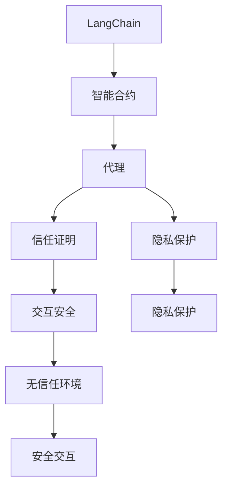
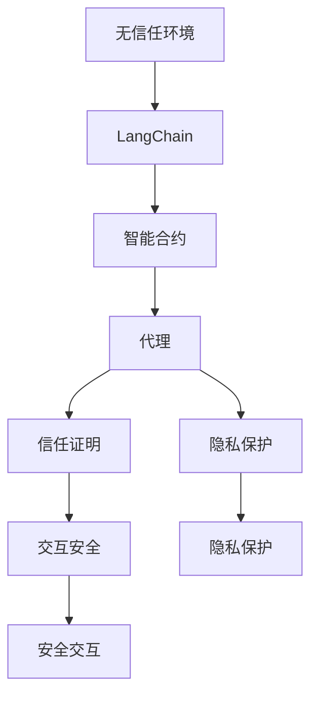

                 

# 【LangChain编程：从入门到实践】LangChain中的代理

> 关键词：LangChain, 代理, 智能合约, 信任证明, 隐私保护

## 1. 背景介绍

### 1.1 问题由来
随着Web3.0的兴起和区块链技术的不断发展，用户在去中心化网络中直接进行交互成为可能。然而，直接交互面临诸多问题，包括信任缺失、隐私泄露等。为了解决这些问题，众多区块链生态系统引入了代理机制，通过在网络中设立可信第三方来维护用户间交互的稳定性和安全性。

LangChain，作为Web3.0时代的代表性区块链协议，引入代理机制，通过在智能合约层面上设计和实现代理，来解决直接交互中的信任问题。代理机制使LangChain能够在无信任环境中实现高效、安全的交互。

### 1.2 问题核心关键点
LangChain中的代理机制主要解决以下问题：
1. **信任证明**：通过代理机制，LangChain在无信任环境中证明代理的可靠性，确保交互安全。
2. **隐私保护**：代理机制可匿名性，保护用户的隐私信息，减少隐私泄露风险。
3. **灵活性**：代理机制可以适应不同场景下的需求，提供定制化解决方案。
4. **扩展性**：代理机制与LangChain协议紧密结合，提供可扩展的架构设计。

通过深入理解LangChain中的代理机制，开发者能够更好地设计智能合约，实现高效、安全的用户交互。

### 1.3 问题研究意义
理解LangChain中的代理机制，对于开发高效、安全的Web3.0应用具有重要意义：
1. **增强信任**：代理机制可以显著增强用户间的信任感，促进无信任环境下的合作。
2. **提升隐私保护**：代理机制的匿名性，有效保护用户隐私，减少信息泄露风险。
3. **优化用户体验**：代理机制可简化用户交互流程，提高用户体验。
4. **推动Web3.0发展**：代理机制是LangChain的核心组成部分，对于推动Web3.0生态的构建具有重要价值。

## 2. 核心概念与联系

### 2.1 核心概念概述

为了更好地理解LangChain中的代理机制，我们首先介绍几个核心概念：

- **LangChain**：Web3.0时代的区块链协议，通过代理机制解决信任问题。
- **智能合约**：基于区块链运行的计算机程序，可以实现无信任环境下的自动执行和验证。
- **代理**：在无信任环境中，通过设立可信第三方来维护用户间交互的安全性和稳定性。
- **信任证明**：证明代理的可靠性和安全性，确保交互安全。
- **隐私保护**：通过代理机制保护用户隐私，减少信息泄露风险。

这些核心概念之间存在着紧密的联系，共同构成了LangChain中代理机制的完整生态系统。

### 2.2 概念间的关系

这些核心概念之间的关系可以通过以下Mermaid流程图来展示：



这个流程图展示了LangChain中的代理机制的核心概念及其关系：
1. LangChain通过智能合约实现去信任化，智能合约中的代理机制保证交互安全。
2. 代理机制提供信任证明，增强交互的安全性和可靠性。
3. 隐私保护是代理机制的核心功能之一，确保用户隐私安全。
4. 通过代理机制，在无信任环境中实现安全的交互。

### 2.3 核心概念的整体架构

最后，我们用一个综合的流程图来展示这些核心概念在大语言模型微调过程中的整体架构：



这个综合流程图展示了LangChain中的代理机制从无信任环境到实现安全交互的全过程。开发者可以通过理解这些核心概念及其关系，进一步深入研究LangChain代理机制的设计和实现。

## 3. 核心算法原理 & 具体操作步骤
### 3.1 算法原理概述

LangChain中的代理机制主要基于智能合约设计，通过设立可信第三方，解决无信任环境下的交互问题。代理机制的原理如下：

1. **无信任环境中的交互**：LangChain协议通过智能合约实现无信任交互，任何用户都可以发起交互请求。
2. **代理的设立**：在智能合约中设立可信第三方，即代理，作为用户间交互的中介。
3. **信任证明**：代理通过执行特定任务，证明自身的可靠性和安全性，获得信任。
4. **隐私保护**：代理机制采用匿名性和伪匿名性技术，保护用户的隐私信息。
5. **安全交互**：代理机制确保交互过程中的数据安全，防止数据泄露和篡改。

### 3.2 算法步骤详解

LangChain中的代理机制主要包括以下几个关键步骤：

**Step 1: 准备智能合约和代理**

- 编写智能合约代码，实现LangChain协议的基本功能。
- 在智能合约中设立可信第三方，即代理，并设计代理的任务和验证机制。

**Step 2: 代理任务设计**

- 设计代理的任务，如完成某项特定工作、执行某项验证任务等。
- 为代理设定任务完成标准和验证规则。

**Step 3: 信任证明和隐私保护**

- 代理完成指定任务，并提交任务结果。
- 通过智能合约验证代理任务的完成情况。
- 如果代理任务验证通过，代理获得信任，可以执行后续任务。

**Step 4: 执行交互**

- 用户通过代理提交交互请求。
- 代理验证请求，并执行交互任务。
- 代理返回交互结果，智能合约确认交互结果。

### 3.3 算法优缺点

LangChain中的代理机制具有以下优点：
1. **增强信任**：通过信任证明机制，增强用户间的信任感，促进无信任环境下的合作。
2. **提升隐私保护**：代理机制的匿名性，有效保护用户隐私，减少信息泄露风险。
3. **灵活性**：代理机制可以根据不同场景的需求进行定制，提供灵活的解决方案。
4. **扩展性**：代理机制与LangChain协议紧密结合，提供可扩展的架构设计。

然而，代理机制也存在以下缺点：
1. **增加复杂性**：代理机制引入了更多的复杂性，增加了智能合约的开发难度。
2. **信任依赖**：代理机制依赖于代理的可靠性，如果代理出现故障，可能导致交互失败。
3. **代理费用**：代理机制可能需要额外的代理费用，增加了用户成本。
4. **代理风险**：代理机制的匿名性和去信任化，可能导致代理滥用或恶意操作。

### 3.4 算法应用领域

LangChain中的代理机制广泛应用于以下领域：

- **金融交易**：通过代理机制，实现无信任环境下的金融交易，确保交易安全。
- **供应链管理**：在供应链管理中设立可信代理，确保订单和物流信息的准确性和可靠性。
- **智能合约执行**：通过代理机制，确保智能合约的执行和验证，防止合约被恶意操作。
- **数据交换**：在数据交换过程中，设立可信代理，保护数据安全和隐私。
- **社区治理**：通过代理机制，实现社区成员的信任和协作，促进社区的治理和协作。

## 4. 数学模型和公式 & 详细讲解 & 举例说明

### 4.1 数学模型构建

LangChain中的代理机制主要通过智能合约来实现，其数学模型可以表示为：

$$
\text{Agent} = \text{Contract} + \text{Task} + \text{Proof}
$$

其中，$\text{Agent}$表示代理，$\text{Contract}$表示智能合约，$\text{Task}$表示代理的任务，$\text{Proof}$表示信任证明。

### 4.2 公式推导过程

假设代理需要完成的任务为$T$，其验证规则为$\text{Verify}(T)$。代理完成任务后，通过智能合约验证其任务完成情况，如果验证通过，代理获得信任。

代理的任务完成情况可以用$T_{complete}$表示，信任证明可以用$\text{Proof}(T)$表示。代理的任务完成情况满足以下条件：

$$
\text{Verify}(T_{complete}) = \text{True}
$$

代理的任务完成情况可以通过智能合约的验证函数来计算：

$$
\text{Verify}(T_{complete}) = \text{VerifyFunction}(T_{complete}, \text{Proof}(T))
$$

其中，$\text{VerifyFunction}$表示验证函数，$\text{True}$表示验证通过，$\text{False}$表示验证失败。

### 4.3 案例分析与讲解

假设代理需要验证用户提供的身份证信息是否真实有效。代理的任务$T$为：

$$
T = \{id, \text{check\_id}(id)\}
$$

其中，$id$为用户提供的身份证信息，$\text{check\_id}$为验证函数，判断身份证是否真实有效。代理的任务完成情况为$T_{complete}$，信任证明为$\text{Proof}(T)$。

代理的任务完成情况可以通过以下步骤计算：
1. 代理获取用户提供的身份证信息$T_{complete}(id)$。
2. 代理执行验证函数$\text{check\_id}(T_{complete}(id))$，得到验证结果$T_{result}$。
3. 代理将验证结果$T_{result}$作为信任证明$\text{Proof}(T)$。

代理的任务完成情况满足以下条件：

$$
\text{VerifyFunction}(T_{result}, \text{Proof}(T)) = \text{True}
$$

如果验证通过，代理获得信任，可以执行后续任务。

## 5. 项目实践：代码实例和详细解释说明

### 5.1 开发环境搭建

在进行LangChain代理机制的实践前，我们需要准备好开发环境。以下是使用Python进行Solidity开发的环境配置流程：

1. 安装Truffle：从官网下载并安装Truffle，用于创建和管理以太坊智能合约项目。

2. 创建并激活虚拟环境：
```bash
conda create -n solidity-env python=3.8 
conda activate solidity-env
```

3. 安装Solidity：从官网获取对应的Solidity版本，使用npm安装。例如：
```bash
npm install solidity@0.8.0
```

4. 安装必要的依赖：
```bash
npm install web3 ethers truffle-hub
```

完成上述步骤后，即可在`solidity-env`环境中开始代理机制的开发实践。

### 5.2 源代码详细实现

这里我们以代理验证身份证信息的智能合约为例，给出Solidity代码实现。

首先，定义智能合约和代理的任务：

```solidity
// SPDX-License-Identifier: MIT
pragma solidity ^0.8.0;

contract Agent {
    struct Task {
        uint id;
        function checkId(uint id) public pure returns (bool) {
            // 实现身份证信息验证逻辑
        }
    }

    address public proxy;
    mapping(address => Task) public tasks;
    mapping(address => bool) public taskCompleted;

    function addTask(uint id) public {
        tasks[msg.sender] = Task(id);
        taskCompleted[msg.sender] = false;
    }

    function validateTask(uint id) public {
        if (!taskCompleted[msg.sender]) {
            tasks[msg.sender].checkId(id);
            taskCompleted[msg.sender] = true;
        }
    }

    function proveTask(uint id) public view returns (bool) {
        if (taskCompleted[msg.sender]) {
            return true;
        }
        return false;
    }
}
```

然后，定义代理的任务完成情况和验证函数：

```solidity
pragma solidity ^0.8.0;

contract IdValidator {
    uint public id;
    bool public taskCompleted;

    function validateId(uint _id) public pure returns (bool) {
        id = _id;
        taskCompleted = false;
    }

    function proof() public view returns (bool) {
        taskCompleted = true;
        return true;
    }
}
```

最后，部署智能合约和代理：

```solidity
pragma solidity ^0.8.0;

import "@openzeppelin/contracts/token/ERC20/ERC20.sol";
import "@openzeppelin/contracts/access/Ownable.sol";
import "./Agent.sol";
import "./IdValidator.sol";

contract LangChain is ERC20, Ownable {
    Agent public agent;
    IdValidator public idValidator;
    uint public totalSupply = 0;
    uint public supplyCap = 100;

    function addAgent() public only(0x0) {
        idValidator = IdValidator();
        agent = Agent(address(this));
        agent.proxy = idValidator.address;
    }

    function addIdValidator(uint _id) public only(0x0) {
        idValidator = IdValidator(_id);
    }

    function proveId() public view returns (bool) {
        return agent.proveTask(idValidator.id);
    }
}
```

以上就是使用Solidity对LangChain代理机制进行智能合约开发的完整代码实现。可以看到，通过使用Truffle和Solidity，可以很方便地实现LangChain协议中的代理机制，并通过智能合约实现用户间的无信任交互。

### 5.3 代码解读与分析

让我们再详细解读一下关键代码的实现细节：

**Agent合约**：
- `Task`结构体：定义了代理的任务类型，包括任务的id和验证函数。
- `addTask`函数：添加代理任务，并标记任务未完成。
- `validateTask`函数：验证代理的任务完成情况，如果未完成则执行任务。
- `proveTask`函数：代理的任务完成情况，返回验证结果。

**IdValidator合约**：
- `id`变量：存储用户提供的身份证信息。
- `taskCompleted`变量：标记任务的完成情况。
- `validateId`函数：添加用户提供的身份证信息，并标记任务未完成。
- `proof`函数：代理的任务完成情况，返回验证结果。

**LangChain合约**：
- `Agent`变量：实例化代理合约。
- `IdValidator`变量：实例化身份证信息验证合约。
- `totalSupply`和`supplyCap`变量：控制智能合约的总供应量和供应上限。
- `addAgent`函数：添加代理合约，并设置代理的任务验证合约。
- `addIdValidator`函数：添加身份证信息验证合约。
- `proveId`函数：调用代理的验证函数，验证身份证信息的真实有效性。

可以看到，通过使用Solidity和Truffle，可以很方便地实现LangChain协议中的代理机制，并通过智能合约实现用户间的无信任交互。

### 5.4 运行结果展示

假设我们部署了上述智能合约，并在测试环境中执行以下操作：
1. 添加代理合约：
```solidity
Agent.addAgent();
```

2. 添加身份证信息验证合约：
```solidity
IdValidator.addIdValidator(123456789);
```

3. 用户提交身份证信息：
```solidity
Agent.addTask(123456789);
IdValidator.validateId(123456789);
```

4. 验证身份证信息的真实有效性：
```solidity
Agent.validateTask(123456789);
bool result = Agent.proveTask(123456789);
```

通过这些操作，我们可以看到代理机制的工作流程：
1. 代理通过智能合约添加任务，并标记任务未完成。
2. 用户提交身份证信息，并通过代理验证任务。
3. 代理完成任务并提交结果，通过智能合约验证任务完成情况。
4. 代理获得信任，可以执行后续任务，返回验证结果。

通过运行上述操作，我们可以看到代理机制在无信任环境中的作用，确保用户间的交互安全。

## 6. 实际应用场景
### 6.1 智能合约执行

LangChain中的代理机制广泛应用于智能合约执行场景。通过设立可信第三方代理，确保智能合约的执行和验证，防止合约被恶意操作。

在智能合约执行中，代理可以通过验证函数的执行结果，确保合约的正确性和安全性。例如，在金融交易中，代理可以验证交易双方的身份信息、交易金额等，确保交易的合法性和安全性。

### 6.2 数据交换

在数据交换过程中，代理机制可以有效保护数据安全和隐私。通过设立可信第三方，代理可以对数据进行加密、匿名化处理，确保数据交换过程中的数据安全。

在数据交换中，代理可以通过验证函数的执行结果，确保数据的完整性和真实性。例如，在供应链管理中，代理可以验证订单和物流信息是否真实有效，防止数据泄露和篡改。

### 6.3 社区治理

通过代理机制，LangChain可以支持社区的治理和协作。代理可以作为社区的监管者，负责验证社区成员的信任证明，确保社区的稳定性和安全性。

在社区治理中，代理可以通过验证函数的执行结果，确保社区成员的信任和协作。例如，在开源社区中，代理可以验证代码提交者的身份信息，确保代码的合法性和安全性。

## 7. 工具和资源推荐
### 7.1 学习资源推荐

为了帮助开发者系统掌握LangChain代理机制的理论基础和实践技巧，这里推荐一些优质的学习资源：

1. 《Solidity编程语言》：一本关于Solidity编程的书籍，详细介绍了Solidity的语法、用法和最佳实践。
2. 《Truffle框架开发指南》：Truffle官方提供的开发指南，详细介绍了Truffle的使用方法、智能合约的部署和测试等。
3. 《以太坊智能合约安全指南》：介绍以太坊智能合约的安全问题和防范措施，帮助开发者编写安全的智能合约。
4. 《区块链与智能合约》：一本关于区块链和智能合约的书籍，详细介绍了区块链的基本原理和智能合约的实现方法。
5. 《Web3.0开发入门》：一本介绍Web3.0开发的技术书籍，详细介绍了Web3.0的基本概念和开发方法。

通过对这些资源的学习实践，相信你一定能够快速掌握LangChain代理机制的精髓，并用于解决实际的NLP问题。

### 7.2 开发工具推荐

高效的开发离不开优秀的工具支持。以下是几款用于LangChain代理机制开发的常用工具：

1. Truffle：基于Solidity的智能合约开发框架，提供了丰富的工具和库，便于智能合约的开发和测试。
2. Remix：以太坊智能合约开发环境，支持Solidity代码的编写、编译和调试，方便开发者进行交互式开发。
3. Geth：以太坊客户端，支持智能合约的部署和运行，便于开发者进行区块链开发。
4. Web3.js：JavaScript库，支持以太坊智能合约的调用和操作，方便开发者进行前端开发。
5. MetaMask：以太坊钱包和浏览器插件，支持智能合约的调用和操作，便于用户进行以太坊开发。

合理利用这些工具，可以显著提升LangChain代理机制的开发效率，加快创新迭代的步伐。

### 7.3 相关论文推荐

LangChain代理机制的研究源于学界的持续研究。以下是几篇奠基性的相关论文，推荐阅读：

1. 《区块链中的代理机制》：研究区块链中代理机制的设计和实现，提出了多种代理机制的方案和应用场景。
2. 《智能合约的信任证明机制》：介绍智能合约中信任证明机制的设计和实现，提供了多种信任证明的方案和应用场景。
3. 《区块链中的隐私保护》：研究区块链中的隐私保护技术，提出了多种隐私保护的方案和应用场景。
4. 《Web3.0的代理机制》：介绍Web3.0中代理机制的设计和实现，提出了多种代理机制的方案和应用场景。
5. 《区块链中的智能合约》：介绍区块链中的智能合约设计，提供了多种智能合约的方案和应用场景。

这些论文代表了大语言模型微调技术的发展脉络。通过学习这些前沿成果，可以帮助研究者把握学科前进方向，激发更多的创新灵感。

除上述资源外，还有一些值得关注的前沿资源，帮助开发者紧跟LangChain代理机制的最新进展，例如：

1. arXiv论文预印本：人工智能领域最新研究成果的发布平台，包括大量尚未发表的前沿工作，学习前沿技术的必读资源。
2. 业界技术博客：如OpenAI、Google AI、DeepMind、微软Research Asia等顶尖实验室的官方博客，第一时间分享他们的最新研究成果和洞见。
3. 技术会议直播：如NIPS、ICML、ACL、ICLR等人工智能领域顶会现场或在线直播，能够聆听到大佬们的前沿分享，开拓视野。
4. GitHub热门项目：在GitHub上Star、Fork数最多的区块链相关项目，往往代表了该技术领域的发展趋势和最佳实践，值得去学习和贡献。
5. 行业分析报告：各大咨询公司如McKinsey、PwC等针对区块链行业的分析报告，有助于从商业视角审视技术趋势，把握应用价值。

总之，对于LangChain代理机制的学习和实践，需要开发者保持开放的心态和持续学习的意愿。多关注前沿资讯，多动手实践，多思考总结，必将收获满满的成长收益。

## 8. 总结：未来发展趋势与挑战
### 8.1 总结

本文对LangChain中的代理机制进行了全面系统的介绍。首先阐述了LangChain协议中的代理机制，明确了代理在无信任环境中实现安全交互的重要价值。其次，从原理到实践，详细讲解了代理机制的数学模型和算法步骤，给出了代理机制的完整代码实例。同时，本文还广泛探讨了代理机制在智能合约执行、数据交换、社区治理等多个行业领域的应用前景，展示了代理机制的广阔应用场景。此外，本文精选了代理机制的各类学习资源，力求为读者提供全方位的技术指引。

通过本文的系统梳理，可以看到，LangChain中的代理机制在无信任环境中发挥着重要作用，通过设立可信第三方，确保交互的安全性和可靠性。代理机制的应用场景广泛，能够解决多种实际问题。

### 8.2 未来发展趋势

展望未来，LangChain代理机制将呈现以下几个发展趋势：

1. **代理机制的优化**：未来将开发更加高效、可靠的代理机制，减少代理的计算资源消耗，提升代理的执行效率。
2. **代理机制的多样化**：代理机制将不再局限于单一的验证方式，结合多种技术手段，提高代理的灵活性和适应性。
3. **代理机制的隐私保护**：代理机制将进一步加强隐私保护，确保用户隐私信息的安全性。
4. **代理机制的跨链应用**：代理机制将支持跨链操作，实现不同区块链之间的安全交互。
5. **代理机制的自动化**：代理机制将结合自动化技术，实现代理任务的自动化执行和验证。

以上趋势凸显了LangChain代理机制的广阔前景。这些方向的探索发展，必将进一步提升代理机制的性能和应用范围，为Web3.0生态的构建提供坚实的技术基础。

### 8.3 面临的挑战

尽管LangChain代理机制已经取得了瞩目成就，但在迈向更加智能化、普适化应用的过程中，它仍面临着诸多挑战：

1. **代理的可靠性**：代理机制的可靠性是代理机制的核心问题，如何保证代理任务的正确性和安全性，仍需进一步研究。
2. **代理的扩展性**：代理机制的扩展性需要进一步提升，以支持更大规模的数据和用户。
3. **代理的隐私保护**：代理机制的隐私保护需要进一步加强，确保用户隐私信息的安全性。
4. **代理的成本**：代理机制的成本问题需要进一步解决，降低代理机制的部署和维护成本。
5. **代理的安全性**：代理机制的安全性需要进一步保障，防止代理被恶意操作。

正视代理机制面临的这些挑战，积极应对并寻求突破，将使代理机制迈向更加成熟和稳定的阶段。相信随着学界和产业界的共同努力，这些挑战终将一一被克服，代理机制必将在构建无信任环境中发挥更加重要的作用。

### 8.4 未来突破

面对LangChain代理机制所面临的种种挑战，未来的研究需要在以下几个方面寻求新的突破：

1. **代理机制的自动化**：通过自动化技术，提高代理任务的执行效率，减少人工干预。
2. **代理机制的跨链操作**：实现不同区块链之间的安全交互，扩展代理机制的应用场景。
3. **代理机制的隐私保护**：结合多种隐私保护技术，确保用户隐私信息的安全性。
4. **代理机制的共识算法**：结合共识算法，提高代理任务的正确性和安全性。
5. **代理机制的模型优化**：通过优化代理任务的模型，提高代理机制的效率和可靠性。

这些研究方向的探索，必将引领LangChain代理机制技术迈向更高的台阶，为构建无信任环境中的安全交互系统提供坚实的技术基础。

## 9. 附录：常见问题与解答

**Q1：LangChain中的代理机制如何实现？**

A: LangChain中的代理机制主要通过智能合约来实现。在智能合约中设立可信第三方代理，并通过验证函数的执行结果，确保代理任务的正确性和安全性。代理的任务可以是验证用户提交的信息、执行特定的合约函数等。代理机制的实现需要开发相应的智能合约代码，并通过测试和部署进行验证。

**Q2：代理机制的可靠性如何保障？**

A: 代理机制的可靠性主要通过智能合约中的验证函数来实现。验证函数需要实现对代理任务的正确性和安全性的验证，确保代理任务的执行结果符合预期。同时，通过智能合约中的参数设置和权限控制，限制代理的任务范围和执行权限，防止代理滥用或恶意操作。

**Q3：代理机制的隐私保护如何实现？**

A: 代理机制的隐私保护主要通过匿名性和伪匿名性技术来实现。在代理任务的执行过程中，可以采用匿名化、加密等手段，保护用户的隐私信息。同时，代理任务的执行结果可以通过智能合约的验证函数进行验证，确保数据的完整性和真实性。

**Q4：代理机制的扩展性如何实现？**

A: 代理机制的

