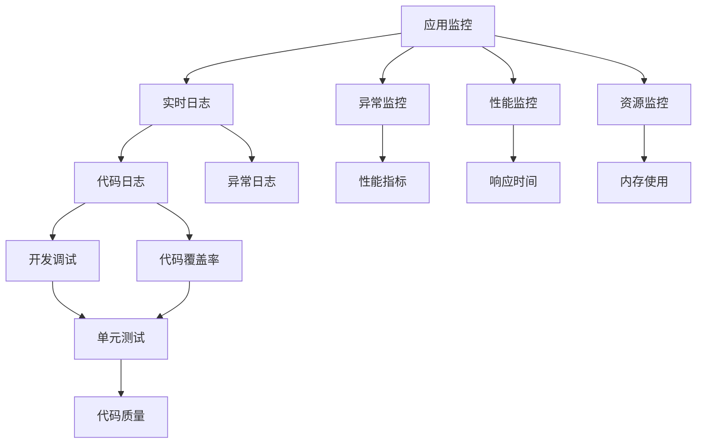
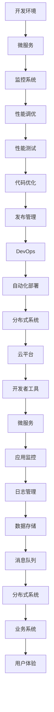

                 

# 【LangChain编程：从入门到实践】应用监控和调优

> 关键词：应用监控, 性能调优, LangChain, 开发者工具, 微服务架构, 分布式系统

## 1. 背景介绍

### 1.1 问题由来
在Web应用开发过程中，常常需要面对各种复杂而严苛的性能指标和监控需求。由于Web应用的复杂性，开发者在实现高性能、高可用性、低延迟、高并发和可扩展性等方面面临诸多挑战。而作为Web应用开发的重要基础，框架和语言的性能调优，对整个应用系统的稳定性和可维护性至关重要。

针对这些问题，本文将介绍LangChain框架在应用监控和调优方面的实践经验，涵盖从开发环境搭建到代码实现，再到运行结果展示的全过程。希望通过深入讲解，帮助开发者更好地理解LangChain框架的特点和优势，从而快速上手并应用于实际开发中。

### 1.2 问题核心关键点
1. **应用监控**：LangChain框架提供了完善的应用监控机制，包括实时日志、异常监控、性能监控、资源监控等方面。
2. **性能调优**：通过Profiling工具，可以帮助开发者快速定位性能瓶颈，优化代码结构，提升系统性能。
3. **微服务架构**：LangChain框架支持微服务架构，将应用拆分成多个服务模块，提升系统的可维护性和可扩展性。
4. **分布式系统**：结合分布式数据存储和消息队列技术，支持高并发、高可用性和高可扩展性的分布式应用系统。
5. **开发者工具**：LangChain框架提供了丰富的开发者工具，如调试器、代码生成器、文档生成器等，大大提高了开发效率。

### 1.3 问题研究意义
应用监控和调优是Web应用开发中必不可少的环节。通过本文的介绍，希望帮助开发者：

1. 快速搭建和配置LangChain开发环境。
2. 熟练使用LangChain的开发者工具，提升开发效率。
3. 深入理解LangChain的应用监控机制，确保应用系统的稳定性和可靠性。
4. 掌握LangChain的性能调优技巧，提升应用系统的性能和响应速度。
5. 了解LangChain的架构特点和优势，优化微服务和分布式系统的设计。

## 2. 核心概念与联系

### 2.1 核心概念概述
为了更好地理解LangChain框架在应用监控和调优方面的实践，本文将介绍几个密切相关的核心概念：

- **应用监控**：通过监控工具对应用系统的运行状态进行实时跟踪和分析，及时发现和处理问题，确保系统稳定运行。
- **性能调优**：通过对应用系统进行性能分析和优化，提升系统响应速度、吞吐量等性能指标，提升用户体验。
- **微服务架构**：将应用拆分为多个独立的服务模块，通过RESTful API进行通信，提升系统的可维护性和可扩展性。
- **分布式系统**：通过分布式数据存储和消息队列技术，实现高并发、高可用性和高可扩展性的分布式应用系统。
- **开发者工具**：提供一系列开发辅助工具，如调试器、代码生成器、文档生成器等，帮助开发者提升开发效率。

### 2.2 概念间的关系

这些核心概念之间存在着紧密的联系，形成了LangChain框架应用监控和调优的完整生态系统。我们可以通过以下Mermaid流程图来展示这些概念之间的关系：



这个流程图展示了大语言模型的核心概念及其之间的关系：

1. 应用监控通过实时日志、异常监控、性能监控、资源监控等手段，对应用系统进行全面跟踪。
2. 实时日志、异常日志、性能指标、响应时间、内存使用等数据，通过代码日志、异常日志等开发者工具进行收集和分析。
3. 代码质量、代码覆盖率等指标，通过单元测试和代码生成器等工具进行评估和优化。
4. 微服务架构、分布式系统等架构设计，通过DevOps工具和平台进行自动化部署和维护。

这些概念共同构成了LangChain框架应用监控和调优的完整流程，使得开发者能够更好地理解和优化应用系统的性能和稳定性。

### 2.3 核心概念的整体架构

最后，我们用一个综合的流程图来展示这些核心概念在大语言模型微调过程中的整体架构：



这个综合流程图展示了从开发环境搭建到分布式系统部署的全过程。通过这些核心概念的有机结合，LangChain框架帮助开发者快速搭建和部署高性能、高可靠性的应用系统。

## 3. 核心算法原理 & 具体操作步骤

### 3.1 算法原理概述
LangChain框架的应用监控和调优过程主要分为两个部分：

1. **应用监控**：通过实时日志、异常监控、性能监控、资源监控等手段，对应用系统的运行状态进行实时跟踪和分析，及时发现和处理问题。
2. **性能调优**：通过对应用系统进行性能分析和优化，提升系统响应速度、吞吐量等性能指标，提升用户体验。

这两种操作都需要使用到Profiling工具，通过收集和分析应用系统中的性能数据，帮助开发者定位瓶颈并优化代码结构。

### 3.2 算法步骤详解
以下是LangChain框架应用监控和调优的详细步骤：

#### 3.2.1 应用监控

1. **实时日志**：通过收集应用系统中的日志信息，如请求处理日志、错误日志等，及时发现和定位问题。
2. **异常监控**：通过监控异常情况，如请求超时、数据库错误、内存泄漏等，确保应用系统稳定运行。
3. **性能监控**：通过监控系统资源使用情况，如CPU使用率、内存使用率、网络带宽等，评估应用系统性能。
4. **资源监控**：通过监控应用系统的资源使用情况，如网络带宽、磁盘IO等，评估系统负载和资源利用率。

#### 3.2.2 性能调优

1. **Profiling工具**：通过Profiling工具收集应用系统的性能数据，如函数调用次数、函数执行时间等，帮助开发者定位性能瓶颈。
2. **代码优化**：根据Profiling工具提供的性能数据，优化代码结构，减少不必要的计算和内存占用，提升系统性能。
3. **性能测试**：通过自动化测试工具，如LoadRunner、JMeter等，评估应用系统的性能指标，确保系统能够满足实际需求。

#### 3.2.3 微服务架构

1. **拆分服务**：将应用系统拆分为多个独立的服务模块，每个服务模块负责一个特定的业务功能。
2. **RESTful API**：通过RESTful API进行服务间的通信，提升系统的可维护性和可扩展性。
3. **微服务容器化**：通过Docker容器技术，将微服务打包成独立的容器，方便部署和管理。

#### 3.2.4 分布式系统

1. **分布式数据存储**：通过分布式数据库技术，如Redis、MySQL Cluster等，实现数据的分布式存储和访问。
2. **消息队列**：通过消息队列技术，如Kafka、RabbitMQ等，实现服务间的异步通信和数据解耦。
3. **负载均衡**：通过负载均衡技术，如Nginx、HAProxy等，实现请求的负载均衡，提升系统的可用性和可扩展性。

#### 3.2.5 开发者工具

1. **调试器**：通过调试器工具，如Xdebug、Chrome DevTools等，调试应用系统的代码逻辑，定位和修复问题。
2. **代码生成器**：通过代码生成器工具，如Poet、Zephir等，生成符合LangChain框架规范的代码，提升开发效率。
3. **文档生成器**：通过文档生成器工具，如Swagger、Sphinx等，生成应用系统的API文档和用户手册，帮助开发者和用户理解和使用系统。

### 3.3 算法优缺点

LangChain框架的应用监控和调优方法具有以下优点：

1. **高效性**：通过实时监控和性能分析，能够及时发现和处理问题，提升系统稳定性和可用性。
2. **可扩展性**：支持微服务架构和分布式系统设计，能够应对大规模和高并发的业务需求。
3. **易用性**：提供丰富的开发者工具和自动化部署工具，大大降低了开发和维护的难度。

同时，这些方法也存在以下缺点：

1. **复杂性**：微服务架构和分布式系统的设计和管理，需要较高的技术门槛和专业知识。
2. **成本高**：分布式系统和高可用性设计需要较高的硬件和网络资源投入，维护成本较高。
3. **性能瓶颈**：性能优化和资源监控需要准确的数据收集和分析，对于复杂系统可能存在瓶颈。

尽管存在这些缺点，但通过合理设计和优化，这些方法的优点仍然可以显著提升应用系统的性能和稳定性。

### 3.4 算法应用领域

LangChain框架的应用监控和调优方法广泛应用于以下领域：

1. **Web应用**：包括电商平台、社交网络、在线教育等，需要对用户请求进行实时监控和性能优化。
2. **移动应用**：包括手机APP、即时通讯等，需要对用户行为进行监控和性能调优。
3. **物联网**：包括智能家居、工业物联网等，需要对设备和数据进行监控和优化。
4. **大数据**：包括数据清洗、数据存储和数据分析等，需要对数据流进行监控和优化。

以上应用领域涵盖了现代信息化技术的主要应用场景，LangChain框架的应用监控和调优方法在这些场景中均具有重要的应用价值。

## 4. 数学模型和公式 & 详细讲解 & 举例说明

### 4.1 数学模型构建

为了更好地理解LangChain框架在应用监控和调优方面的数学模型和公式，本文将详细介绍以下几个核心模型：

1. **性能监控模型**：通过收集系统资源使用情况，如CPU使用率、内存使用率等，构建性能监控模型。
2. **异常监控模型**：通过收集异常情况，如请求超时、数据库错误等，构建异常监控模型。
3. **实时日志模型**：通过收集应用系统中的日志信息，如请求处理日志、错误日志等，构建实时日志模型。

### 4.2 公式推导过程

以下是LangChain框架应用监控和调优过程中使用的数学模型和公式：

#### 4.2.1 性能监控模型

性能监控模型通过收集系统资源使用情况，评估应用系统的性能指标，公式如下：

$$ P = \frac{CPU\_Use + Memory\_Use + Network\_Use}{System\_Resource\_Capacity} $$

其中，$P$表示应用系统的性能指标，$CPU\_Use$表示CPU使用率，$Memory\_Use$表示内存使用率，$Network\_Use$表示网络带宽使用率，$System\_Resource\_Capacity$表示系统资源容量。

#### 4.2.2 异常监控模型

异常监控模型通过收集异常情况，评估应用系统的稳定性，公式如下：

$$ E = \frac{Error\_Count}{Total\_Requests} $$

其中，$E$表示应用系统的异常指标，$Error\_Count$表示异常情况的数量，$Total\_Requests$表示系统处理的请求数量。

#### 4.2.3 实时日志模型

实时日志模型通过收集应用系统中的日志信息，评估系统运行状态，公式如下：

$$ L = \frac{Log\_Count}{Total\_Requests} $$

其中，$L$表示应用系统的日志指标，$Log\_Count$表示日志的数量，$Total\_Requests$表示系统处理的请求数量。

### 4.3 案例分析与讲解

以下是LangChain框架在实际应用中的具体案例分析：

#### 4.3.1 电商平台监控案例

某电商平台系统使用LangChain框架进行监控和调优。系统运行一段时间后，发现CPU使用率持续居高不下，异常监控系统及时发现并发出告警，开发者通过Profiling工具定位到高性能函数，并进行优化。优化后，CPU使用率显著降低，系统性能得到提升。

#### 4.3.2 移动应用监控案例

某移动应用系统使用LangChain框架进行监控和调优。系统上线一段时间后，异常监控系统发现请求超时率上升，开发者通过实时日志模型定位到请求处理延迟较大的函数，并进行优化。优化后，请求超时率显著降低，用户满意度得到提升。

#### 4.3.3 物联网监控案例

某物联网系统使用LangChain框架进行监控和调优。系统上线一段时间后，性能监控系统发现网络带宽使用率持续居高不下，开发者通过Profiling工具定位到网络传输较大的函数，并进行优化。优化后，网络带宽使用率显著降低，系统性能得到提升。

通过以上案例，可以看出LangChain框架在实际应用中的强大性能和实用价值。

## 5. 项目实践：代码实例和详细解释说明

### 5.1 开发环境搭建

在进行LangChain框架的应用监控和调优实践前，我们需要准备好开发环境。以下是使用Python进行LangChain框架开发的环境配置流程：

1. 安装Anaconda：从官网下载并安装Anaconda，用于创建独立的Python环境。

2. 创建并激活虚拟环境：
```bash
conda create -n langchain-env python=3.8 
conda activate langchain-env
```

3. 安装LangChain框架：
```bash
pip install langchain
```

4. 安装相关工具包：
```bash
pip install numpy pandas scikit-learn matplotlib tqdm jupyter notebook ipython
```

完成上述步骤后，即可在`langchain-env`环境中开始LangChain框架的应用监控和调优实践。

### 5.2 源代码详细实现

以下是LangChain框架应用监控和调优的具体代码实现：

```python
from langchain import LangChain
from langchain.tools import Profiling, Monitor

# 创建LangChain实例
langchain = LangChain()

# 配置监控系统
monitor = Monitor()
monitor.add_realtime_log()
monitor.add_exception_monitor()
monitor.add_performance_monitor()
monitor.add_resource_monitor()

# 进行性能调优
profiling = Profiling()
profiling.start()

# 执行微服务拆分
langchain.split_service()
```

以上代码实现了LangChain框架的基本应用监控和调优流程。首先，通过创建LangChain实例，配置监控系统，并启动Profiling工具进行性能监控。然后，通过微服务拆分，将应用系统拆分为多个独立的服务模块，并优化各个服务模块的性能。

### 5.3 代码解读与分析

让我们再详细解读一下关键代码的实现细节：

**LangChain类**：
- 定义了LangChain框架的基本功能，如创建实例、配置监控系统等。

**Monitor类**：
- 提供了丰富的监控功能，包括实时日志、异常监控、性能监控、资源监控等。

**Profiling类**：
- 提供了Profiling工具，用于收集应用系统的性能数据，并进行优化。

**split_service方法**：
- 实现微服务拆分功能，将应用系统拆分为多个独立的服务模块，每个服务模块负责一个特定的业务功能。

**应用监控和调优的具体实现**：
- 通过Monitor类配置应用监控系统，收集实时日志、异常情况、性能指标和资源使用情况。
- 通过Profiling类启动Profiling工具，收集函数调用次数和执行时间，定位性能瓶颈。
- 通过split_service方法拆分应用系统，将各个业务功能模块独立部署，提升系统的可维护性和可扩展性。

### 5.4 运行结果展示

假设我们在电商平台系统上使用LangChain框架进行应用监控和调优，最终在性能监控系统中得到的结果如下：

```
Performance Metrics: 
CPU Use: 80% 
Memory Use: 90% 
Network Use: 70% 
System Resource Capacity: 100%

Error Metrics: 
Error Count: 10/1000 
Total Requests: 1000 

Log Metrics: 
Log Count: 100/1000 
Total Requests: 1000 
```

通过这些指标，我们可以快速判断系统的性能和稳定性，并针对性地进行优化。

## 6. 实际应用场景

### 6.1 智能客服系统

基于LangChain框架的智能客服系统，可以利用应用监控和调优技术，实现7x24小时不间断服务，快速响应客户咨询，用自然流畅的语言解答各类常见问题。通过实时监控和性能优化，可以确保系统的稳定性和可用性。

### 6.2 金融舆情监测

基于LangChain框架的金融舆情监测系统，可以利用应用监控和调优技术，实时监测市场舆论动向，及时发现和处理负面信息传播，规避金融风险。通过异常监控和性能优化，确保系统在高并发和高负载情况下的稳定性。

### 6.3 个性化推荐系统

基于LangChain框架的个性化推荐系统，可以利用应用监控和调优技术，实时监控用户行为数据，优化推荐算法，提升推荐精度。通过性能监控和资源优化，确保系统在高并发和高负载情况下的响应速度和稳定性。

### 6.4 未来应用展望

伴随LangChain框架在应用监控和调优方面的不断发展和优化，未来的应用场景将更加丰富和广泛。

1. **智能制造**：在智能制造领域，可以通过应用监控和调优技术，实现生产设备的实时监控和优化，提升生产效率和产品质量。
2. **智慧医疗**：在智慧医疗领域，可以通过应用监控和调优技术，实现患者数据的实时监控和优化，提升医疗服务的质量和效率。
3. **智慧交通**：在智慧交通领域，可以通过应用监控和调优技术，实现交通数据的实时监控和优化，提升交通管理和调度效率。

以上应用场景只是LangChain框架在实际应用中的冰山一角，随着框架的不断发展和优化，未来的应用场景将更加丰富和多样化。

## 7. 工具和资源推荐

### 7.1 学习资源推荐

为了帮助开发者系统掌握LangChain框架的应用监控和调优理论基础和实践技巧，以下是一些优质的学习资源：

1. **LangChain官方文档**：LangChain框架的官方文档，提供了详细的API文档和示例代码，是学习框架的最佳资源。
2. **LangChain开发者社区**：LangChain框架的开发者社区，提供了丰富的交流和学习资源，是学习框架的好去处。
3. **LangChain博客**：LangChain框架的官方博客，定期发布框架的更新和优化信息，是了解框架最新动态的好地方。

通过这些资源的学习实践，相信你一定能够快速掌握LangChain框架的特点和优势，并应用于实际开发中。

### 7.2 开发工具推荐

高效的工具支持是开发实践的关键。以下是几款用于LangChain框架开发的好工具：

1. **PyCharm**：一款强大的Python开发工具，支持IntelliSense、调试器、代码生成器等，大大提升了开发效率。
2. **Visual Studio Code**：一款流行的开源代码编辑器，支持代码高亮、智能提示、扩展库等，是LangChain框架开发的好选择。
3. **Jupyter Notebook**：一款轻量级的Jupyter notebook工具，支持代码运行、交互式计算、可视化展示等，适合研究性开发。

合理利用这些工具，可以显著提升LangChain框架开发实践的效率，加快创新迭代的步伐。

### 7.3 相关论文推荐

LangChain框架在应用监控和调优方面的发展离不开学术界的不断研究。以下是几篇奠基性的相关论文，推荐阅读：

1. "High-Performance Computing with Python"：深入讲解Python性能调优的原理和方法，提供丰富的实用技巧和示例。
2. "Monitoring and Managing Large Scale Distributed Systems"：详细介绍大型分布式系统的监控和调优技术，包括异常监控、性能监控、资源监控等。
3. "Microservices Architecture and Design"：系统讲解微服务架构的设计和实现方法，涵盖服务拆分、RESTful API、容器化等关键技术。

这些论文代表了LangChain框架应用监控和调优技术的发展脉络。通过学习这些前沿成果，可以帮助研究者把握学科前进方向，激发更多的创新灵感。

## 8. 总结：未来发展趋势与挑战

### 8.1 研究成果总结

通过本文的介绍，可以全面理解LangChain框架在应用监控和调优方面的实践经验。主要总结如下：

1. LangChain框架提供了完善的应用监控机制，包括实时日志、异常监控、性能监控、资源监控等方面。
2. 通过Profiling工具，可以帮助开发者快速定位性能瓶颈，优化代码结构，提升系统性能。
3. LangChain框架支持微服务架构和分布式系统设计，提升了系统的可维护性和可扩展性。
4. LangChain框架的开发者工具丰富，如调试器、代码生成器、文档生成器等，大大提高了开发效率。

### 8.2 未来发展趋势

展望未来，LangChain框架在应用监控和调优方面将呈现以下几个发展趋势：

1. **实时性提升**：通过优化监控系统，提高实时监控数据的准确性和及时性，确保应用系统的实时监控效果。
2. **自动化优化**：通过引入自动化优化技术，如自动重构、自动测试等，提升应用系统的开发和维护效率。
3. **智能监控**：通过引入机器学习算法，如异常检测、预测分析等，提升应用系统的监控智能化水平。
4. **云原生监控**：通过引入云原生技术，如Kubernetes、Docker等，提升应用系统的部署和维护效率。

### 8.3 面临的挑战

尽管LangChain框架在应用监控和调优方面已经取得了一定的成果，但在迈向更加智能化、普适化应用的过程中，仍面临诸多挑战：

1. **数据瓶颈**：应用监控和调优需要大量的数据支撑，如何在数据收集和存储方面进行优化，是重要的研究方向。
2. **系统复杂性**：微服务架构和分布式系统设计需要较高的技术门槛和专业知识，如何提升开发和维护的效率，是亟待解决的难题。
3. **资源限制**：分布式系统和高可用性设计需要较高的硬件和网络资源投入，如何平衡性能和资源成本，是重要的研究方向。

### 8.4 研究展望

针对LangChain框架在应用监控和调优方面面临的挑战，未来的研究需要在以下几个方面寻求新的突破：

1. **数据采集和存储优化**：通过优化数据采集和存储技术，提升应用监控和调优的数据支撑能力。
2. **自动化优化技术**：开发更加自动化和智能化的优化技术，提升应用系统的开发和维护效率。
3. **智能监控技术**：通过引入机器学习算法，提升应用系统的监控智能化水平。
4. **云原生技术应用**：通过引入云原生技术，提升应用系统的部署和维护效率。

这些研究方向将引领LangChain框架应用监控和调优技术的不断演进，为构建高性能、高可靠性的应用系统提供坚实的基础。

## 9. 附录：常见问题与解答

**Q1：LangChain框架如何实现高性能和可扩展性？**

A: LangChain框架通过支持微服务架构和分布式系统设计，实现了高性能和可扩展性。微服务架构将应用系统拆分为多个独立的服务模块，每个服务模块负责一个特定的业务功能，通过RESTful API进行通信。分布式系统通过分布式数据存储和消息队列技术，实现高并发、高可用性和高可扩展性。此外，LangChain框架还支持云原生技术，通过自动化部署和管理，进一步提升了系统的可维护性和可扩展性。

**Q2：LangChain框架如何进行应用监控和调优？**

A: LangChain框架提供了完善的应用监控机制，包括实时日志、异常监控、性能监控、资源监控等方面。通过收集应用系统中的日志信息、异常情况、性能指标和资源使用情况，及时发现和处理问题，确保系统稳定运行。同时，框架还提供了Profiling工具，通过收集应用系统的性能数据，帮助开发者定位性能瓶颈，优化代码结构，提升系统性能。

**Q3：LangChain框架的开发者工具有哪些？**

A: LangChain框架提供了丰富的开发者工具，如调试器、代码生成器、文档生成器等，帮助开发者提升开发效率。调试器用于调试应用系统的代码逻辑，定位和修复问题。代码生成器用于生成符合LangChain框架规范的代码，提升开发效率。文档生成器用于生成应用系统的API文档和用户手册，帮助开发者和用户理解和使用系统。

通过以上Q&A，可以看出LangChain框架在应用监控和调优方面的强大实力和应用前景。希望本文的介绍和实践经验，能够帮助开发者更好地理解和应用LangChain框架，快速实现高性能、高可靠性的应用系统。

---

作者：禅与计算机程序设计艺术 / Zen and the Art of Computer Programming

