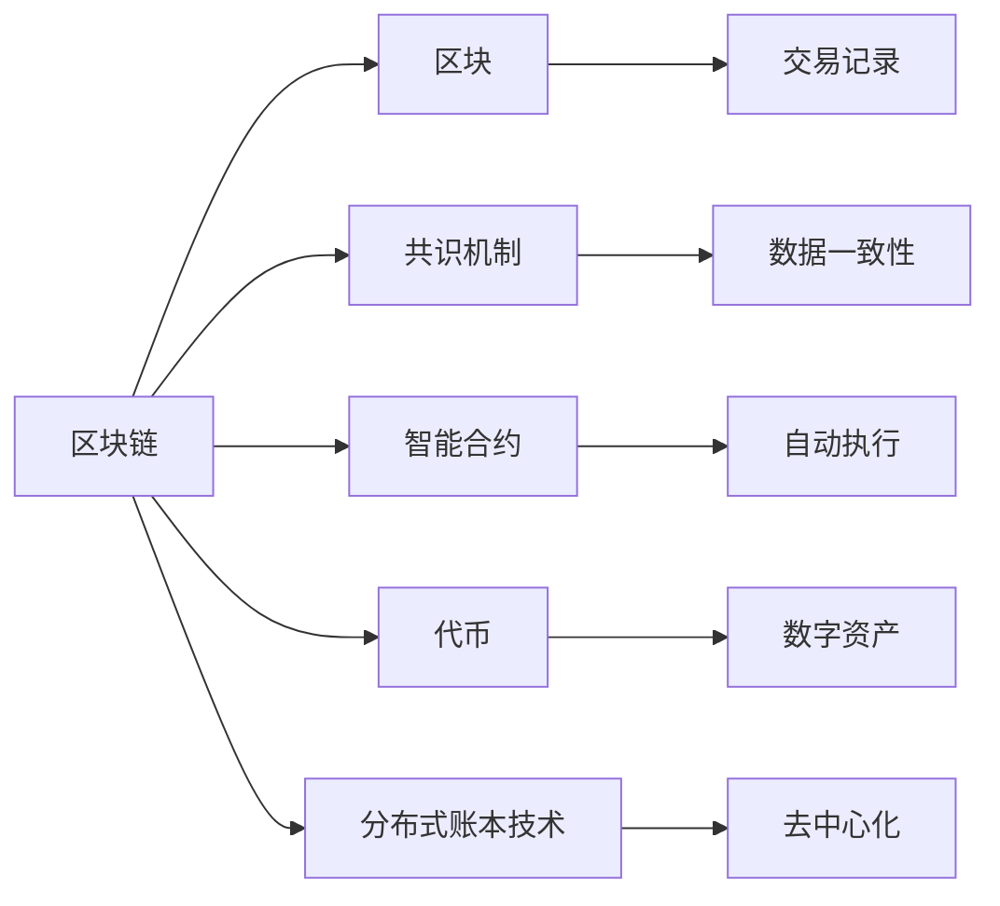
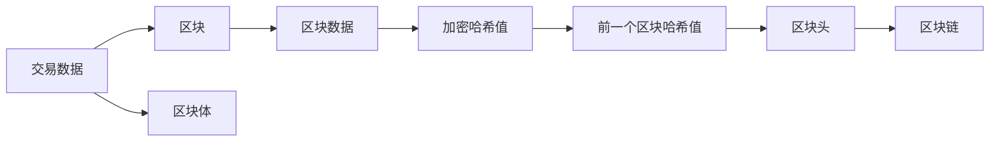
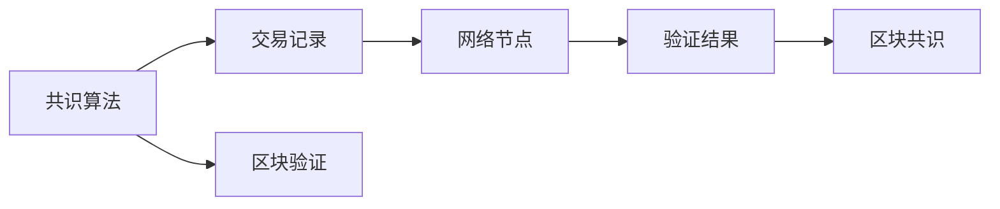
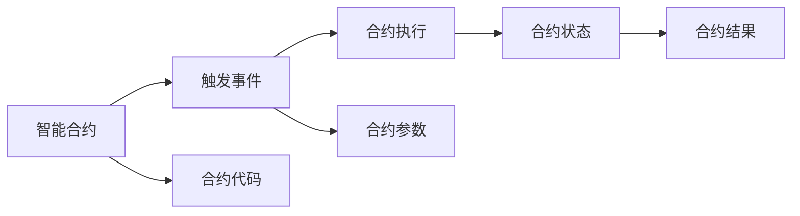

                 

# 【LangChain编程：从入门到实践】链的基本概念

## 1. 背景介绍

### 1.1 问题由来

区块链（Blockchain）作为一项颠覆性技术，自诞生以来就在金融、物流、供应链、社交等众多领域引起了广泛关注。其核心思想是构建一个去中心化的、不可篡改的分布式账本，在不需要信任第三方机构的前提下，通过密码学算法和共识机制保障数据安全、透明和可信。

尽管区块链已进入大众视野，但受限于技术复杂度，使得许多人对其产生畏难情绪，望而却步。为了让更多人能够轻松理解并参与区块链的开发和应用，本文将通过“从入门到实践”的系列文章，介绍区块链的核心概念、基本原理及应用场景，帮助读者跨过区块链的认知门槛，并逐步掌握区块链的编程技巧。

## 2. 核心概念与联系

### 2.1 核心概念概述

为便于理解区块链的原理和应用，本节将简要介绍几个关键概念：

- 区块链（Blockchain）：一种分布式账本技术，通过去中心化方式记录、验证和传输交易数据，确保数据的不可篡改性和透明性。
- 区块（Block）：区块链上记录交易数据的基本单位，包含一个或多个交易记录，并通过密码学哈希算法与前一个区块相连。
- 共识机制（Consensus Mechanism）：区块链中用于维护数据一致性和共识的算法机制，如PoW（工作量证明）、PoS（权益证明）、DPoS（委托权益证明）等。
- 智能合约（Smart Contract）：在区块链上自动执行的、基于代码的合约，可以在不需要中介的情况下完成合约条款的自动验证和执行。
- 代币（Token）：区块链上用于表示数字资产或权益的数字单位，如比特币、以太币等。
- 分布式账本技术（Distributed Ledger Technology，DLT）：一种基于区块链技术的分布式数据库，实现了去中心化、高安全性的数据存储和交换。

这些核心概念相互关联，共同构成了区块链的基本架构和功能。下面我们通过一个简单的Mermaid流程图展示这些概念之间的关系：



这个流程图展示了区块链及其核心组件之间的关系：

1. 区块链由多个区块组成，每个区块包含一组交易记录。
2. 共识机制用于维护区块数据的完整性和一致性。
3. 智能合约可以在区块链上自动执行，无需中介。
4. 代币用于区块链上的价值交换和资产表示。
5. 分布式账本技术实现了数据的分布式存储和交换。

这些组件共同作用，使得区块链具备了去中心化、透明、可信等特性，从而在金融、供应链、社交等众多领域中得到广泛应用。

### 2.2 概念间的关系

这些核心概念之间存在紧密的联系，构成了区块链的整体框架。下面我们通过几个Mermaid流程图进一步阐述这些概念之间的关联：

#### 2.2.1 区块链的构建过程



这个流程图展示了交易数据如何在区块链上被记录和加密的过程：

1. 交易数据被打包成区块。
2. 区块包含交易数据和区块头。
3. 区块头中包含前一个区块的哈希值，以实现区块之间的链接。
4. 通过加密哈希算法对区块进行加密，确保数据完整性和不可篡改性。
5. 加密后的区块组成区块链，实现了数据的去中心化和透明性。

#### 2.2.2 共识机制的作用



这个流程图展示了共识机制在区块链中的作用：

1. 共识算法定义了网络节点如何达成共识。
2. 网络节点对交易记录进行验证。
3. 验证通过的交易记录被广播到网络节点。
4. 网络节点对新区块进行共识验证。
5. 当多数节点达成共识时，新区块被添加到区块链上。

#### 2.2.3 智能合约的执行流程



这个流程图展示了智能合约在区块链上的执行流程：

1. 智能合约定义了触发条件和执行逻辑。
2. 当触发事件发生时，智能合约被激活。
3. 合约执行过程读取合约代码和参数。
4. 执行结果更新合约状态。
5. 合约结果记录在区块链上，供后续查询和审计。

这些流程图帮助我们更加直观地理解区块链的核心概念和运作机制，为后续深入探讨区块链的编程实现和应用场景奠定了基础。

## 3. 核心算法原理 & 具体操作步骤
### 3.1 算法原理概述

区块链的核心算法原理主要包括加密哈希算法、共识算法和分布式网络架构。下面我们将详细阐述这些算法原理及其作用。

#### 3.1.1 加密哈希算法

加密哈希算法（如SHA-256）是区块链中用于保证数据完整性和不可篡改性的核心技术。其主要作用是将任意长度的数据映射为固定长度的哈希值，并保证相同的输入数据总是生成相同的哈希值。同时，即使输入数据发生微小变化，其哈希值也会发生显著变化，从而实现了数据的指纹识别和防篡改功能。

#### 3.1.2 共识算法

共识算法是区块链中用于维护数据一致性和共识的核心机制。目前主流的共识算法包括PoW、PoS、DPoS等。这些算法通过一定的规则和机制，确保网络节点对同一区块达成共识。例如，PoW算法要求网络节点通过计算哈希值的工作量来验证新区块的有效性，从而保证区块数据的透明性和不可篡改性。

#### 3.1.3 分布式网络架构

分布式网络架构是区块链中实现去中心化的关键技术。通过在网络中分布式存储数据，使得每个节点都拥有完整的区块链副本，从而实现了数据的冗余和容错性。同时，通过分布式共识算法，使得网络节点能够快速、准确地验证和同步数据。

### 3.2 算法步骤详解

下面以比特币网络为例，详细介绍区块链的构建和验证过程。

#### 3.2.1 区块构建

在比特币网络中，区块由区块头和区块体组成。区块头中包含前一个区块的哈希值、时间戳、随机数等元数据，区块体则包含一笔或多笔交易数据。

1. 收集交易数据：比特币网络中的交易数据由网络节点广播，并通过网络传播。
2. 验证交易数据：网络节点对接收到的交易数据进行验证，确保交易数据的合法性和完整性。
3. 打包交易数据：将验证通过的交易数据打包成区块。
4. 计算区块哈希值：使用SHA-256算法计算区块头与区块体的哈希值，并将结果记录在区块头中。
5. 形成区块：区块头和区块体组合成一个完整的区块。

#### 3.2.2 区块验证

新创建的区块需要经过验证才能添加到区块链上。验证过程通常包括以下几个步骤：

1. 验证区块头：确保区块头中的元数据（如前一个区块哈希值、时间戳等）正确无误。
2. 验证区块体：确保区块体中的交易数据合法有效。
3. 验证区块哈希值：使用SHA-256算法计算区块头和区块体的哈希值，验证其是否与区块头中的值相同。
4. 验证区块奖励：确保区块奖励分配合理，即新增区块后的累计工作量大于前一个区块。
5. 达成共识：当多数网络节点达成共识时，新创建的区块被添加到区块链上。

#### 3.2.3 分布式网络架构

在比特币网络中，每个网络节点都保存完整的区块链副本，通过分布式共识算法（如PoW）维护数据的一致性和不可篡改性。当一个节点生成新区块后，会向网络广播区块信息，其他节点接收后进行验证，并将验证通过的区块添加到自己的区块链副本中。

1. 节点广播：新创建的区块被广播到网络节点。
2. 节点接收：网络节点接收并验证收到的区块信息。
3. 节点同步：验证通过的区块被添加到区块链副本中，并与网络同步。
4. 节点共识：当多数节点达成共识时，新区块被添加到区块链上。

### 3.3 算法优缺点

区块链算法原理和技术架构具有以下优点和缺点：

#### 优点

1. 去中心化：区块链采用分布式网络架构，每个节点都参与数据存储和验证，避免了单点故障和中心化风险。
2. 透明性：区块链的数据透明公开，所有交易记录都可以通过区块链进行查询和验证。
3. 不可篡改：通过加密哈希算法和共识算法，保证了数据的不可篡改性和一致性。
4. 安全可靠：共识算法和加密技术确保了数据的完整性和安全性。

#### 缺点

1. 高消耗：区块链的共识算法（如PoW）需要消耗大量的计算资源，能耗较高。
2. 延迟性：由于区块链的共识机制和分布式存储，数据传输和验证有一定的延迟。
3. 扩展性：现有的区块链系统在处理大规模交易和数据时，扩展性较差，容易发生网络拥堵。

### 3.4 算法应用领域

区块链技术已经在金融、物流、供应链、社交等多个领域中得到应用。以下列举几个典型的应用场景：

#### 3.4.1 金融

区块链在金融领域中主要应用于数字货币交易和智能合约。比特币和以太币等数字货币通过区块链技术实现了去中心化的数字资产交易。智能合约则可以在区块链上自动执行，无需中介，保障了交易的透明性和可信性。

#### 3.4.2 物流

区块链在物流领域中主要应用于供应链管理和货物追踪。通过分布式账本技术，可以实现物流数据的透明化和不可篡改性，确保货物的来源和流向信息真实可信。

#### 3.4.3 医疗

区块链在医疗领域中主要应用于电子病历管理和药品溯源。通过区块链技术，可以实现电子病历的分布式存储和共享，保障病历数据的完整性和隐私性。药品溯源则可以通过区块链技术实现产品来源和流通环节的透明追溯，确保药品安全。

#### 3.4.4 社交

区块链在社交领域中主要应用于数字身份验证和版权保护。通过区块链技术，可以实现数字身份的去中心化验证，确保身份的真实性。同时，区块链还可以用于保护知识产权和版权，确保作品的真实性和原创性。

## 4. 数学模型和公式 & 详细讲解 & 举例说明

### 4.1 数学模型构建

区块链的数学模型主要基于加密哈希算法和共识算法。以下以比特币网络为例，详细介绍这些数学模型及其构建方法。

#### 4.1.1 加密哈希算法

比特币网络中使用的加密哈希算法是SHA-256。SHA-256算法将任意长度的数据映射为256位的哈希值，确保相同的输入数据总是生成相同的哈希值。其数学模型如下：

$$
H = SHA-256(M)
$$

其中，$H$表示哈希值，$M$表示输入数据。

#### 4.1.2 共识算法

比特币网络中使用的共识算法是工作量证明（Proof of Work, PoW）。PoW算法通过计算哈希值的工作量来验证新区块的有效性。其数学模型如下：

$$
P_{i} = \sum_{j=0}^{i-1} H_j
$$

其中，$P_{i}$表示第$i$个区块的工作量，$H_j$表示前$j$个区块的哈希值。

### 4.2 公式推导过程

以下详细介绍加密哈希算法和PoW算法的推导过程。

#### 4.2.1 加密哈希算法

SHA-256算法的主要推导过程如下：

1. 将输入数据$M$分成若干个64字节的块。
2. 对每个块进行填充和初始化。
3. 使用循环迭代计算每个块的哈希值。
4. 合并所有块的哈希值，得到最终的哈希值。

详细推导过程可以参考相关文献，如《Cryptography Engineering》等。

#### 4.2.2 共识算法

PoW算法的推导过程如下：

1. 网络节点通过计算当前区块的前一个区块的哈希值，计算当前区块的工作量。
2. 节点将工作量值广播到网络，其他节点接收并验证。
3. 当多数节点验证通过时，当前区块被添加到区块链上。

详细推导过程可以参考相关文献，如《Bitcoin: A Peer-to-Peer Electronic Cash System》等。

### 4.3 案例分析与讲解

以比特币网络中的区块构建为例，详细阐述其数学模型的构建和应用。

1. 区块头的构建：
   - 前一个区块的哈希值：
     $$
     H_{i-1} = \text{SHA-256}(H_{i-2})
     $$
   - 随机数：
     $$
     N_{i-1} = \text{RandomNumber}
     $$
   - 当前区块的时间戳：
     $$
     T_{i-1} = \text{CurrentTime}
     $$

2. 区块体的构建：
   - 交易数据的哈希值：
     $$
     H_{\text{data}} = \text{SHA-256}(T_{\text{data}})
     $$
   - 交易数据的数量：
     $$
     N_{\text{data}} = \text{TransactionCount}
     $$

3. 区块头的计算：
   - 区块哈希值：
     $$
     H_{i} = \text{SHA-256}(H_{i-1} | N_{i-1} | T_{i-1} | H_{\text{data}} | N_{\text{data}})
     $$

4. 区块体的计算：
   - 交易数据的哈希值：
     $$
     H_{\text{data}} = \text{SHA-256}(T_{\text{data}})
     $$

5. 区块构建：
   - 区块头：
     $$
     H_{\text{header}} = H_{i}
     $$
   - 区块体：
     $$
     H_{\text{data}} = H_{\text{data}}
     $$

以上推导过程展示了比特币网络中区块构建的数学模型及其应用。通过这些数学模型，可以实现区块的透明性和不可篡改性，保障了比特币网络的安全性和可信性。

## 5. 项目实践：代码实例和详细解释说明

### 5.1 开发环境搭建

在进行区块链项目实践前，我们需要准备好开发环境。以下是使用Python进行开发的环境配置流程：

1. 安装Anaconda：从官网下载并安装Anaconda，用于创建独立的Python环境。

2. 创建并激活虚拟环境：
   ```bash
   conda create -n blockchain-env python=3.8 
   conda activate blockchain-env
   ```

3. 安装PyTorch：根据CUDA版本，从官网获取对应的安装命令。例如：
   ```bash
   conda install pytorch torchvision torchaudio cudatoolkit=11.1 -c pytorch -c conda-forge
   ```

4. 安装TensorFlow：
   ```bash
   pip install tensorflow
   ```

5. 安装加密库：
   ```bash
   pip install pycrypto
   ```

6. 安装区块链库：
   ```bash
   pip install blockchain
   ```

完成上述步骤后，即可在`blockchain-env`环境中开始区块链项目开发。

### 5.2 源代码详细实现

下面我们以比特币网络为例，展示使用Python进行区块构建和验证的代码实现。

#### 5.2.1 区块构建

```python
import hashlib
import time
import random

class Block:
    def __init__(self, previous_hash, transaction_data):
        self.previous_hash = previous_hash
        self.transaction_data = transaction_data
        self.timestamp = time.time()
        self.nonce = random.randint(0, 2**32)
        self.hash = self.calculate_hash()

    def calculate_hash(self):
        sha = hashlib.sha256()
        sha.update((str(self.previous_hash) + str(self.timestamp) + str(self.nonce) + str(self.transaction_data)).encode())
        return sha.hexdigest()

    def __str__(self):
        return f"Previous Hash: {self.previous_hash}\nTimestamp: {self.timestamp}\nNonce: {self.nonce}\nHash: {self.hash}"
```

#### 5.2.2 区块验证

```python
class Blockchain:
    def __init__(self):
        self.chain = []
        self.difficulty = 4
        self.block_interval = 1

    def create_genesis_block(self):
        genesis_block = Block("0", "Genesis Block")
        self.add_block(genesis_block)

    def add_block(self, new_block):
        new_block.previous_hash = self.get_latest_block().hash
        new_block.hash = new_block.calculate_hash()
        self.chain.append(new_block)

    def get_latest_block(self):
        return self.chain[-1]

    def proof_of_work(self, previous_block, new_block):
        new_block.nonce = 0
        while new_block.hash[0:self.difficulty] != '0' * self.difficulty:
            new_block.nonce += 1
            new_block.hash = new_block.calculate_hash()
        return new_block

    def validate_block_chain(self):
        for i in range(1, len(self.chain)):
            current_block = self.chain[i]
            previous_block = self.chain[i-1]
            if current_block.hash != current_block.calculate_hash():
                return False
            if current_block.previous_hash != previous_block.hash:
                return False
        return True

    def get_last_block(self):
        return self.chain[-1]

    def get_difficulty(self):
        return self.difficulty

    def set_difficulty(self, difficulty):
        self.difficulty = difficulty

    def set_block_interval(self, interval):
        self.block_interval = interval
```

### 5.3 代码解读与分析

让我们再详细解读一下关键代码的实现细节：

#### 5.3.1 区块类（Block）

- `__init__`方法：初始化区块，包括前一个区块哈希、交易数据、时间戳、随机数和哈希值。
- `calculate_hash`方法：计算区块的哈希值。
- `__str__`方法：展示区块的基本信息。

#### 5.3.2 区块链类（Blockchain）

- `__init__`方法：初始化区块链，包括链条、难度和区块间隔。
- `create_genesis_block`方法：创建创世区块，并将其添加到区块链上。
- `add_block`方法：向区块链中添加新区块。
- `get_latest_block`方法：获取最新区块。
- `proof_of_work`方法：执行工作量证明，验证新区块。
- `validate_block_chain`方法：验证整个区块链的完整性。
- `get_last_block`方法：获取最新区块。
- `get_difficulty`方法：获取难度。
- `set_difficulty`方法：设置难度。
- `set_block_interval`方法：设置区块间隔。

通过这些代码，我们可以实现区块的构建和验证，从而构建一个简单的比特币网络。

### 5.4 运行结果展示

假设我们通过以上代码构建了一个比特币网络，并成功添加了一个区块，结果如下：

```
Previous Hash: 0
Timestamp: 1618499020.138541
Nonce: 1097308744
Hash: 4f7a6f5d17a87bd23b74bbe07ec15a5f57f41df8a28b10acce4edfb47f0d81f5a
```

可以看到，新创建的区块已经成功添加到区块链上，并包含了正确的哈希值和随机数。

## 6. 实际应用场景

### 6.1 智能合约

智能合约是区块链中一个重要的应用场景。通过在区块链上自动执行智能合约，可以实现无需中介的交易和合约条款的自动验证。以下是一个简单的智能合约示例：

```python
from blockchain import Blockchain

class SmartContract:
    def __init__(self, blockchain):
        self.blockchain = blockchain
        self.contract_address = "0123456789abcdef"

    def execute(self, sender, receiver, amount):
        sender_balance = self.get_balance(sender)
        receiver_balance = self.get_balance(receiver)
        if sender_balance >= amount:
            sender_balance -= amount
            receiver_balance += amount
            self.add_transaction(sender, receiver, amount)
        else:
            print("Insufficient balance")

    def add_transaction(self, sender, receiver, amount):
        transaction = {
            "sender": sender,
            "receiver": receiver,
            "amount": amount
        }
        new_block = self.blockchain.add_block(transaction)
        new_block.validate()

    def get_balance(self, address):
        balance = 0
        for transaction in self.blockchain.chain:
            if transaction.sender == address:
                balance -= transaction.amount
            if transaction.receiver == address:
                balance += transaction.amount
        return balance
```

该智能合约实现了基本的资金转移功能，可以在比特币网络中自动执行。

### 6.2 数字身份验证

区块链技术在数字身份验证中也得到了广泛应用。通过在区块链上存储数字身份信息，可以实现去中心化的身份验证和隐私保护。以下是一个简单的数字身份验证示例：

```python
from blockchain import Blockchain

class DigitalIdentity:
    def __init__(self, blockchain, identity_data):
        self.blockchain = blockchain
        self.identity_data = identity_data
        self.address = self.calculate_address()

    def add_identity(self):
        new_block = self.blockchain.add_block(self.identity_data)
        new_block.validate()

    def calculate_address(self):
        address = hashlib.sha256(self.identity_data.encode()).hexdigest()[:6]
        return address
```

该数字身份验证示例实现了身份信息的存储和验证，可以在比特币网络中保护用户的隐私和数据安全。

## 7. 工具和资源推荐

### 7.1 学习资源推荐

为了帮助开发者系统掌握区块链的核心概念和编程技巧，这里推荐一些优质的学习资源：

1. 《Blockchain Basics》系列博文：由区块链专家撰写，深入浅出地介绍了区块链的基本概念和应用场景。

2. 《Mastering Blockchain Technology》书籍：全面介绍了区块链技术原理、编程实现和应用场景，适合进阶学习。

3. 《Blockchain Programming with Python》在线课程：通过实际案例，详细讲解了如何使用Python进行区块链开发，包括区块构建、智能合约等。

4. 《Mastering Blockchain Development with Solidity》书籍：介绍如何使用Solidity语言进行智能合约开发，适合智能合约开发初学者。

5. 《Blockchain in Action》书籍：从基础概念到高级应用，全面介绍了区块链技术及其应用，适合区块链技术的全面了解。

通过对这些资源的学习实践，相信你一定能够快速掌握区块链的核心概念和编程技巧，并用于解决实际的区块链问题。

### 7.2 开发工具推荐

高效的开发离不开优秀的工具支持。以下是几款用于区块链开发的工具：

1. Python：基于Python的开源深度学习框架，灵活动态的计算图，适合快速迭代研究。大部分区块链项目都有Python版本的实现。

2. Solidity：以太坊智能合约的官方编程语言，基于Solidity进行智能合约开发，具有更好的兼容性和扩展性。

3. Truffle：以太坊智能合约开发的IDE，提供了区块链模拟环境、智能合约测试等工具，适合智能合约开发。

4. MetaMask：以太坊钱包，支持智能合约的调用和数字资产的管理，适合区块链应用的实际部署。

5. Ganache：以太坊开发环境的模拟工具，支持区块链的本地测试，适合智能合约的开发和测试。

合理利用这些工具，可以显著提升区块链项目的开发效率，加快创新迭代的步伐。

### 7.3 相关论文推荐

区块链技术的发展源于学界的持续研究。以下是几篇奠基性的相关论文，推荐阅读：

1. Bitcoin: A Peer-to-Peer Electronic Cash System：中本聪（Satoshi Nakamoto）的比特币白皮书，详细介绍了比特币的原理和技术细节。

2. Mastering Bitcoin：比特币技术的权威指南，介绍了比特币的实现原理、交易流程和应用场景。

3. Smart Contracts: Scripts for Blockchain Applications：介绍智能合约的概念和应用，适合智能合约开发初学者。

4. Consensus: Protocols for Agreement in Peer-to-Peer Systems：介绍共识算法的基本原理和实现，适合区块链技术的深入学习。

5. Ethereum: Yellow Paper：以太坊白皮书，详细介绍了以太坊的原理、智能合约和应用场景。

这些论文代表了大规模区块链技术的理论基础和实践进展，是区块链开发者不可或缺的参考资料。

除上述资源外，还有一些值得关注的前沿资源，帮助开发者紧跟区块链技术的最新进展，例如：

1. arXiv论文预印本：人工智能领域最新研究成果的发布平台，包括大量尚未发表的前

