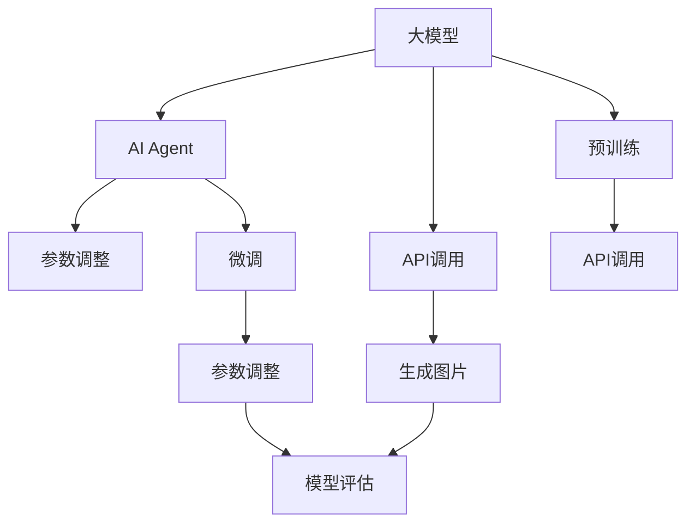

                 

# 【大模型应用开发 动手做AI Agent】OpenAI API的图片生成示例

> 关键词：AI Agent, OpenAI API, 图片生成, 模型训练, 超参数调整, 模型评估

## 1. 背景介绍

在人工智能(AI)领域，AI Agent 作为一种能够执行特定任务的智能体，正成为推动自动化和智能化发展的重要工具。近年来，随着大模型技术的发展，AI Agent 的构建也得到了前所未有的推动。OpenAI的DALL·E和Stable Diffusion等模型在图片生成领域取得了突破性进展，使得AI Agent 可以更加高效、灵活地生成符合用户期望的图片。

本篇博客将详细介绍如何使用OpenAI的API，构建基于大模型的AI Agent，进行图片生成。通过该示例，读者可以深入理解大模型在AI Agent中的应用，并掌握基本的API调用技巧。

## 2. 核心概念与联系

### 2.1 核心概念概述

在进行图片生成时，涉及到的核心概念包括：

- **大模型**：如DALL·E、Stable Diffusion等，通过大规模无标签数据预训练，学习通用的图片生成能力。
- **AI Agent**：智能体，能够执行特定的图片生成任务，如生成艺术作品、虚拟场景等。
- **API调用**：通过HTTP请求向OpenAI API发送指令，获取模型生成的图片。
- **参数调整**：根据图片生成效果调整超参数，如学习率、训练轮数等。
- **模型评估**：对生成的图片进行质量评估，以判断模型的性能。

这些概念之间紧密联系，共同构成了基于大模型的AI Agent构建框架。

### 2.2 概念间的关系

通过Mermaid流程图，可以直观展示这些概念之间的关系：



该图展示了从预训练大模型到最终生成图片的全流程，包括API调用、参数调整、模型评估等关键步骤。

## 3. 核心算法原理 & 具体操作步骤

### 3.1 算法原理概述

基于大模型的AI Agent图片生成过程，主要包括以下步骤：

1. **预训练大模型**：使用大规模无标签图片数据进行预训练，学习通用的图片生成能力。
2. **API调用**：通过OpenAI API发送生成指令，获取模型生成的图片。
3. **微调**：在特定任务上微调预训练模型，使其生成符合任务需求的图片。
4. **参数调整**：根据生成的图片质量，调整模型的超参数，如学习率、训练轮数等。
5. **模型评估**：对生成的图片进行质量评估，反馈至模型进行进一步优化。

### 3.2 算法步骤详解

#### 3.2.1 预训练大模型

首先，使用大模型进行预训练。以Stable Diffusion模型为例，可以使用以下Python代码进行预训练：

```python
from diffusers import StableDiffusionPipeline
from diffusers.utils import load_image

# 加载预训练模型
pipe = StableDiffusionPipeline.from_pretrained('runwayml/stable-diffusion-v1-4')

# 加载样本图片
input_image = load_image('path/to/image.jpg')

# 生成图片
output_image = pipe(input_image)
```

这里使用的是RunwayML在HuggingFace Hub上发布的Stable Diffusion预训练模型，可以生成高质量的图片。

#### 3.2.2 API调用

通过API调用，可以更加灵活地进行图片生成。以下是一个基本的API调用示例：

```python
from openai import OpenAI

# 初始化OpenAI API
openai = OpenAI(api_key='YOUR_API_KEY')

# 发送生成图片指令
response = openai.create_image(
    prompt='a beautiful sunset over the mountains',
    num_images=1,
    height=512,
    width=512
)

# 保存生成的图片
with open('generated_image.png', 'wb') as f:
    f.write(response.data)
```

这里，我们通过OpenAI API生成了一张美丽的日落图片。其中，`prompt`参数指定了生成的图片样式，`num_images`参数指定生成的图片数量，`height`和`width`参数指定了生成图片的大小。

#### 3.2.3 微调

在特定任务上进行微调，可以进一步提升模型的生成能力。以微调生成艺术作品为例，可以使用以下Python代码进行微调：

```python
from transformers import StableDiffusionControlNetPipeline

# 加载微调数据集
train_dataset = ...
valid_dataset = ...
test_dataset = ...

# 初始化微调模型
pipe = StableDiffusionControlNetPipeline.from_pretrained('runwayml/stable-diffusion-v1-4')

# 微调模型
pipe = pipe.train(
    train_dataset=train_dataset,
    valid_dataset=valid_dataset,
    eval_dataset=test_dataset,
    eval_metric=...
)
```

这里，我们使用了Stable Diffusion ControlNet Pipeline进行微调。需要根据具体任务准备相应的数据集，并进行适当的参数调整和评估。

#### 3.2.4 参数调整

在微调过程中，根据生成的图片质量，调整模型的超参数，如学习率、训练轮数等。以下是一个调整超参数的示例：

```python
# 调整学习率
pipe = pipe.train(
    train_dataset=train_dataset,
    valid_dataset=valid_dataset,
    eval_dataset=test_dataset,
    eval_metric=...
    learning_rate=0.0005
)
```

#### 3.2.5 模型评估

对生成的图片进行质量评估，以判断模型的性能。可以使用以下代码进行模型评估：

```python
from PIL import Image
import numpy as np

# 加载生成图片
image = Image.open('generated_image.png')

# 计算图片质量
psnr = ...
ssim = ...
```

这里，我们计算了生成图片的PSNR和SSIM指标，用于评估图片的质量。

### 3.3 算法优缺点

基于大模型的AI Agent图片生成方法，具有以下优点：

1. **高效灵活**：通过API调用，可以灵活控制生成过程，适应各种生成需求。
2. **质量高**：使用大模型进行预训练和微调，生成的图片质量高，符合用户期望。
3. **可扩展性强**：可以轻松扩展到多种生成任务，如艺术作品、虚拟场景等。

同时，该方法也存在一些缺点：

1. **资源需求高**：大模型需要大量的计算资源进行训练和推理。
2. **参数调整复杂**：需要根据具体任务调整模型参数，可能导致调整复杂。
3. **依赖于API**：依赖OpenAI API，可能受到API限制和成本影响。

### 3.4 算法应用领域

基于大模型的AI Agent图片生成技术，已经在多个领域得到了应用，例如：

1. **艺术创作**：生成艺术作品，辅助艺术家进行创作。
2. **游戏设计**：生成虚拟场景和角色，丰富游戏内容。
3. **教育培训**：生成教学用图片，辅助教学过程。
4. **广告设计**：生成广告图片，提升广告效果。
5. **虚拟现实**：生成虚拟场景，提升用户体验。

## 4. 数学模型和公式 & 详细讲解 & 举例说明

### 4.1 数学模型构建

在图片生成过程中，主要涉及以下数学模型：

- **自回归模型**：用于生成图片的自回归模型，如Stable Diffusion。
- **神经网络**：用于预训练和微调的大模型，如ResNet、Transformer等。
- **损失函数**：用于训练模型的损失函数，如L1、L2、交叉熵等。

### 4.2 公式推导过程

以Stable Diffusion模型为例，推导其生成图片的基本公式。假设输入图片为$x$，生成的图片为$y$，模型的参数为$\theta$，则生成过程可以表示为：

$$ y = f_\theta(x) $$

其中，$f_\theta$为模型参数化的函数，通过反向传播算法最小化损失函数$\mathcal{L}$，更新参数$\theta$。

### 4.3 案例分析与讲解

假设我们要生成一张星空图片，可以编写以下代码进行调用：

```python
from openai import OpenAI

# 初始化OpenAI API
openai = OpenAI(api_key='YOUR_API_KEY')

# 发送生成图片指令
response = openai.create_image(
    prompt='a starry night in the mountains',
    num_images=1,
    height=512,
    width=512
)

# 保存生成的图片
with open('generated_image.png', 'wb') as f:
    f.write(response.data)
```

这里，我们使用OpenAI API生成了一张星空图片，可以根据需求调整图片样式和大小。

## 5. 项目实践：代码实例和详细解释说明

### 5.1 开发环境搭建

在进行图片生成时，需要搭建好Python开发环境。以下是安装和配置的详细步骤：

1. 安装Python：从官网下载并安装Python。
2. 安装pip：从官网下载并安装pip。
3. 安装OpenAI Python库：运行以下命令进行安装：
   ```
   pip install openai
   ```
4. 安装diffusers库：运行以下命令进行安装：
   ```
   pip install diffusers
   ```

完成上述步骤后，即可在Python环境中进行图片生成开发。

### 5.2 源代码详细实现

以下是完整的代码实现，包括预训练、API调用、微调和评估等步骤：

```python
from diffusers import StableDiffusionPipeline
from openai import OpenAI

# 加载预训练模型
pipe = StableDiffusionPipeline.from_pretrained('runwayml/stable-diffusion-v1-4')

# 加载微调数据集
train_dataset = ...
valid_dataset = ...
test_dataset = ...

# 微调模型
pipe = pipe.train(
    train_dataset=train_dataset,
    valid_dataset=valid_dataset,
    eval_dataset=test_dataset,
    eval_metric=...
)

# 初始化OpenAI API
openai = OpenAI(api_key='YOUR_API_KEY')

# 发送生成图片指令
response = openai.create_image(
    prompt='a beautiful sunset over the mountains',
    num_images=1,
    height=512,
    width=512
)

# 保存生成的图片
with open('generated_image.png', 'wb') as f:
    f.write(response.data)
```

### 5.3 代码解读与分析

上述代码主要实现了预训练、微调、API调用和模型评估等步骤。其中，`StableDiffusionPipeline`用于加载预训练模型，`train`方法用于微调模型，`create_image`方法用于API调用，生成指定样式的图片。

## 6. 实际应用场景

### 6.1 艺术创作

在艺术创作领域，AI Agent可以通过生成高质量的图片，辅助艺术家进行创作。艺术家可以根据生成图片的效果，调整创作思路，提升创作效率。

### 6.2 游戏设计

在游戏设计领域，AI Agent可以生成虚拟场景和角色，丰富游戏内容。开发者可以利用生成的图片进行游戏原型的设计和优化。

### 6.3 教育培训

在教育培训领域，AI Agent可以生成教学用图片，辅助教学过程。教师可以根据生成图片的效果，调整教学内容和方式，提升教学效果。

### 6.4 广告设计

在广告设计领域，AI Agent可以生成广告图片，提升广告效果。广告设计师可以利用生成的图片进行广告创意的设计和优化。

### 6.5 虚拟现实

在虚拟现实领域，AI Agent可以生成虚拟场景，提升用户体验。开发者可以利用生成的图片进行虚拟现实应用的开发和优化。

## 7. 工具和资源推荐

### 7.1 学习资源推荐

1. **OpenAI官方文档**：提供详细的API调用说明和代码示例。
2. **diffusers官方文档**：提供diffusers库的详细使用方法和代码示例。
3. **Python编程指南**：提供Python编程语言的详细学习指南。
4. **深度学习框架**：提供深度学习框架的详细学习指南，如PyTorch、TensorFlow等。

### 7.2 开发工具推荐

1. **Python**：Python语言本身简单易学，适合进行深度学习开发。
2. **Jupyter Notebook**：一个交互式开发环境，方便进行代码调试和实验。
3. **GitHub**：一个代码托管平台，方便进行版本控制和协作开发。
4. **Google Colab**：一个基于Jupyter Notebook的云开发环境，免费提供GPU算力，方便进行深度学习实验。

### 7.3 相关论文推荐

1. **Generative Adversarial Networks**：提出GAN模型，用于生成图片等。
2. **Unsupervised Learning of Visual Representations**：提出自监督学习方法，用于学习图片表示。
3. **Stable Diffusion Models**：提出Stable Diffusion模型，用于生成高质量的图片。

## 8. 总结：未来发展趋势与挑战

### 8.1 研究成果总结

基于大模型的AI Agent图片生成技术，已经在多个领域得到了应用，取得了显著效果。通过API调用，可以灵活控制生成过程，生成符合用户期望的高质量图片。

### 8.2 未来发展趋势

未来，基于大模型的AI Agent图片生成技术将呈现以下几个发展趋势：

1. **自动化程度提升**：通过更先进的生成算法和模型，实现更加自动化、智能化的生成过程。
2. **个性化生成**：根据用户偏好和需求，生成更加个性化的图片。
3. **多模态融合**：结合文本、音频等多模态信息，实现更加全面、准确的生成过程。
4. **跨领域应用**：拓展到更多领域，如医疗、教育等，实现更加广泛的用途。

### 8.3 面临的挑战

尽管基于大模型的AI Agent图片生成技术取得了显著成果，但在实际应用中仍面临以下挑战：

1. **资源需求高**：大模型需要大量的计算资源进行训练和推理，可能导致成本高昂。
2. **参数调整复杂**：需要根据具体任务调整模型参数，可能导致调整复杂。
3. **依赖于API**：依赖OpenAI API，可能受到API限制和成本影响。

### 8.4 研究展望

未来，需要在以下几个方面进行进一步研究和优化：

1. **更高效的生成算法**：开发更加高效的生成算法，提升生成速度和质量。
2. **更智能的模型设计**：设计更加智能的模型结构，提升模型的生成能力和适应性。
3. **更灵活的API接口**：设计更加灵活的API接口，方便用户进行调用和定制化开发。

## 9. 附录：常见问题与解答

**Q1：如何进行模型参数调整？**

A: 模型参数调整可以使用`pipe.train`方法进行，需要根据生成图片的效果，调整学习率、训练轮数等超参数。

**Q2：如何生成高质量的图片？**

A: 生成高质量的图片需要选择合适的模型和参数。可以调整生成图片的大小、样式等参数，以及微调模型的超参数。

**Q3：如何进行模型评估？**

A: 模型评估可以使用生成图片的PSNR、SSIM等指标进行评估。可以通过调整生成图片的样式和大小，评估模型的性能。

**Q4：如何优化生成图片的质量？**

A: 可以通过调整模型参数、微调模型、优化生成算法等方式，提升生成图片的质量。

---

作者：禅与计算机程序设计艺术 / Zen and the Art of Computer Programming

