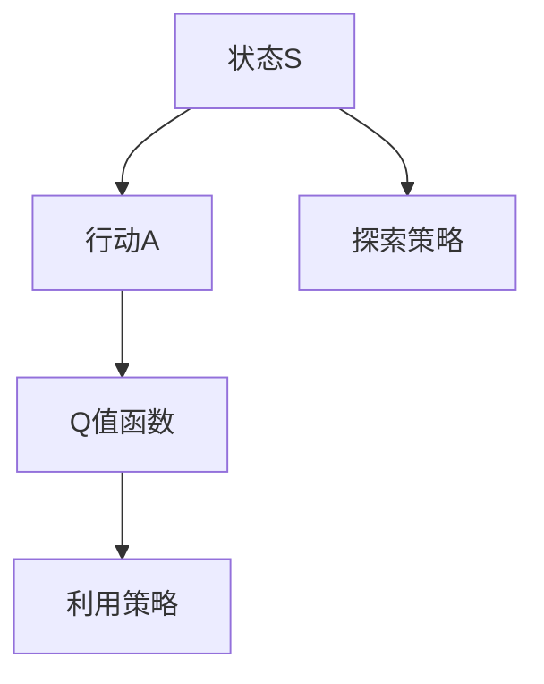
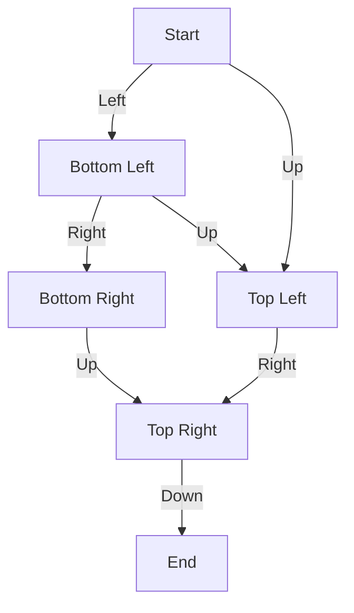

                 

# 一切皆是映射：AI Q-learning探索-利用平衡实践

> 关键词：AI Q-learning, 强化学习, 探索与利用平衡, 大语言模型, 自然语言处理(NLP), 机器人控制, 自适应学习, 游戏AI

## 1. 背景介绍

### 1.1 问题由来
在人工智能（AI）领域，强化学习（Reinforcement Learning, RL）已经成为一项至关重要的技术，特别是在需要决策和行动的复杂环境中，例如机器人控制、自动驾驶、游戏AI等。AI Q-learning作为强化学习中的一种算法，通过奖励信号引导智能体（agent）采取最优行动，从而实现长期目标。Q-learning通过估计每个状态的Q值（即在当前状态下采取某个行动的预期奖励）来指导行动选择，在缺乏模型信息的情况下表现出色。

然而，Q-learning的性能很大程度上依赖于智能体在探索和利用之间找到平衡。过度探索可能导致无法快速收敛到最优策略，而过度利用可能限制了智能体的学习能力，使其容易陷入局部最优解。如何在探索和利用之间找到平衡，一直是AI Q-learning研究的一个关键挑战。

### 1.2 问题核心关键点
Q-learning的探索与利用平衡问题（Exploration vs. Exploitation Balance），简称为E/E平衡问题，是指在采取行动时如何平衡探索未知状态和利用已知最优状态之间的策略。这一问题对于Q-learning算法的效率和性能至关重要。解决E/E平衡问题，可以有效提升智能体的学习速度和最终性能。

具体而言，E/E平衡问题可以细分为以下几个方面：
- **探索策略（Exploration Strategy）**：在未探索过或不确定状态下的行动策略。
- **利用策略（Exploitation Strategy）**：在已探索并评估过的状态下的行动策略。
- **奖励与惩罚机制（Reward & Penalty Mechanism）**：如何设计奖励和惩罚机制，引导智能体采取最优行动。
- **模型估计精度（Model Estimation Accuracy）**：如何提高模型估计的精度，减少不确定性。

### 1.3 问题研究意义
研究AI Q-learning的E/E平衡问题，对于提升AI智能体的决策能力和适应性具有重要意义：

1. **决策能力提升**：通过合理的探索和利用策略，智能体可以在复杂环境中快速找到最优策略，减少试错成本。
2. **适应性增强**：智能体可以更好地适应不断变化的环境，避免陷入局部最优解。
3. **性能优化**：E/E平衡策略的有效应用，可以使智能体在更短的时间内达到更高的性能水平。
4. **鲁棒性提升**：通过平衡探索和利用，智能体在面对噪声或不确定性时表现更加稳健。
5. **创新能力增强**：探索未知状态可以帮助智能体发现新的行动路径，增加创新可能性。

## 2. 核心概念与联系

### 2.1 核心概念概述

AI Q-learning的核心概念主要包括Q值函数、探索策略和利用策略。这些概念在强化学习中扮演着关键角色，共同构建了Q-learning的决策框架。

- **Q值函数（Q-Value Function）**：在给定状态下采取某个行动的预期奖励值。
- **探索策略（Exploration Strategy）**：在未探索状态下的行动选择策略。
- **利用策略（Exploitation Strategy）**：在已知状态下的行动选择策略。

这些概念之间的关系可以通过以下Mermaid流程图来展示：



这个流程图展示了Q-learning的基本决策过程：智能体根据当前状态选择行动，通过Q值函数计算该行动的预期奖励，并根据探索和利用策略选择最终行动。

### 2.2 概念间的关系

AI Q-learning的各个核心概念之间存在着紧密的联系，形成了Q-learning的完整决策框架。具体如下：

- **Q值函数**：作为智能体的行动价值估计器，其准确性和精度直接影响智能体的决策效果。
- **探索策略**：决定了智能体在未知状态下的行动选择，是Q-learning成功的关键因素。
- **利用策略**：基于对已知状态的Q值估计，选择最优行动，是智能体策略优化的核心。

这些概念共同构成了AI Q-learning的核心框架，其优化和平衡对于智能体的长期成功至关重要。

## 3. 核心算法原理 & 具体操作步骤
### 3.1 算法原理概述

AI Q-learning的基本原理是通过估计Q值函数，引导智能体采取最优行动。Q值函数的更新公式为：

$$
Q(s, a) = Q(s, a) + \alpha [r + \gamma \max_{a'} Q(s', a') - Q(s, a)]
$$

其中：
- $s$ 表示当前状态。
- $a$ 表示智能体采取的行动。
- $r$ 表示智能体采取该行动后的即时奖励。
- $s'$ 表示采取该行动后的下一个状态。
- $a'$ 表示在状态$s'$下可能采取的所有行动。
- $\alpha$ 表示学习率。
- $\gamma$ 表示折扣因子，用于对未来奖励进行折现。

该公式说明了Q值函数的更新方式：智能体通过采取行动获得即时奖励，并在下一个状态中选择最优行动，更新当前状态的Q值。

### 3.2 算法步骤详解

AI Q-learning的算法步骤主要包括以下几个关键步骤：

**Step 1: 初始化Q值函数**
- 对所有状态-行动对 $(s,a)$ 的Q值进行初始化，通常为0或一个小的随机值。

**Step 2: 探索与利用**
- 智能体根据当前状态 $s$ 选择行动 $a$。
- 如果 $a$ 是未探索过的状态，则采用探索策略；否则采用利用策略。

**Step 3: 获取即时奖励并更新Q值函数**
- 智能体在状态 $s$ 下采取行动 $a$ 后，获得即时奖励 $r$。
- 更新状态 $s$ 下的Q值函数 $Q(s, a)$。

**Step 4: 选择行动**
- 在下一个状态 $s'$ 下，根据Q值函数选择最优行动 $a'$。

**Step 5: 迭代执行**
- 重复上述步骤，直至达到预设的终止条件（如达到最大迭代次数、达到目标奖励等）。

### 3.3 算法优缺点

AI Q-learning的优势在于：
- **鲁棒性**：对于非结构化环境，Q-learning具有较强的鲁棒性和适应性。
- **无模型依赖**：不需要预先了解环境模型，适合多种复杂环境。
- **可扩展性**：可以应用于多个并行智能体的协同学习。

缺点包括：
- **探索与利用平衡**：需要在探索和利用之间找到平衡，避免过度探索或利用。
- **样本效率低**：在初期阶段，智能体需要通过大量试错来探索环境，导致样本效率较低。
- **维度灾难**：当状态空间过大时，Q值函数的估计和更新会变得复杂。

### 3.4 算法应用领域

AI Q-learning广泛应用于以下领域：

- **机器人控制**：用于训练机器人执行复杂的物理任务，如抓取、导航等。
- **游戏AI**：在游戏中训练智能体采取最优行动，实现高难度任务。
- **自适应学习**：在动态环境中，智能体可以自适应地调整学习策略。
- **自然语言处理（NLP）**：用于训练机器翻译模型、情感分析模型等。
- **网络优化**：在网络系统中，用于优化流量控制、路由策略等。

## 4. 数学模型和公式 & 详细讲解 & 举例说明

### 4.1 数学模型构建

AI Q-learning的数学模型基于马尔可夫决策过程（MDP），包括状态空间、行动空间、奖励函数和转移概率等。

**状态空间（State Space）**：表示智能体的当前状态，可以是连续的、离散的或混合的。

**行动空间（Action Space）**：智能体可以采取的所有行动集合。

**奖励函数（Reward Function）**：根据智能体的行动和状态，返回即时奖励。

**转移概率（Transition Probability）**：描述智能体从当前状态转移到下一个状态的概率。

### 4.2 公式推导过程

根据MDP模型，智能体在状态$s$下采取行动$a$的Q值函数为：

$$
Q(s, a) = \sum_{s'} P(s'|s,a) [r + \gamma \max_{a'} Q(s', a')]
$$

其中，$P(s'|s,a)$表示智能体从状态$s$采取行动$a$后转移到状态$s'$的概率，$[r + \gamma \max_{a'} Q(s', a')]$表示在状态$s'$下采取最优行动$a'$的预期奖励。

通过上述公式，我们可以得到Q-learning的基本推导过程：

1. 在当前状态$s$下，智能体采取行动$a$，获得即时奖励$r$。
2. 智能体根据转移概率$P(s'|s,a)$和折扣因子$\gamma$，计算下一个状态$s'$的Q值。
3. 智能体在下一个状态$s'$下选择最优行动$a'$，更新当前状态$s$的Q值函数$Q(s, a)$。

### 4.3 案例分析与讲解

以一个简单的示例来说明AI Q-learning的应用。假设一个智能体需要在迷宫中寻找出口，迷宫结构如下图所示：



智能体的目标是从起点A到达终点F。智能体在每个状态可以选择向上、向下、向左或向右移动。每个动作的奖励为0，智能体需要最大化其预期奖励。

智能体从状态A开始，可以选择向左或向上移动。根据Q-learning算法，智能体需要在探索和利用之间找到平衡，以快速找到最优策略。

## 5. 项目实践：代码实例和详细解释说明

### 5.1 开发环境搭建

在进行AI Q-learning实践前，我们需要准备好开发环境。以下是使用Python进行OpenAI Gym和TensorFlow开发的环境配置流程：

1. 安装Anaconda：从官网下载并安装Anaconda，用于创建独立的Python环境。

2. 创建并激活虚拟环境：
```bash
conda create -n reinforcement-env python=3.8 
conda activate reinforcement-env
```

3. 安装OpenAI Gym和TensorFlow：
```bash
pip install gym
pip install tensorflow
```

4. 安装TensorBoard：
```bash
pip install tensorboard
```

完成上述步骤后，即可在`reinforcement-env`环境中开始AI Q-learning实践。

### 5.2 源代码详细实现

下面我们以一个简单的迷宫问题为例，使用OpenAI Gym和TensorFlow实现AI Q-learning。

首先，定义迷宫环境：

```python
from gym import environments, spaces

class SimpleMazeEnv(environments.MujocoEnv):
    def __init__(self):
        super().__init__()
        self.box_high = 1
        self.box_low = 0
        self.action_space = spaces.Discrete(4)
        self.observation_space = spaces.Box(low=self.box_low, high=self.box_high, shape=(3,))

    def reset(self):
        self._uniform_sample()
        self.update_obs()
        return self._get_obs()

    def step(self, action):
        self._discrete_action(&self.data.qpos, action)
        self.update_obs()
        obs = self._get_obs()
        rew = -1 if self._done else 0
        done = self._done
        return obs, rew, done, {}
```

然后，定义Q值函数：

```python
import tensorflow as tf

class QNetwork(tf.keras.Model):
    def __init__(self, state_dim, action_dim):
        super().__init__()
        self.fc1 = tf.keras.layers.Dense(16, activation='relu')
        self.fc2 = tf.keras.layers.Dense(16, activation='relu')
        self.fc3 = tf.keras.layers.Dense(action_dim)

    def call(self, inputs):
        x = self.fc1(inputs)
        x = self.fc2(x)
        return self.fc3(x)
```

接下来，定义AI Q-learning的训练函数：

```python
def train(env, q_network, q_learning_params):
    state_dim = env.observation_space.shape[0]
    action_dim = env.action_space.n
    q_network = q_network(state_dim, action_dim)
    optimizer = tf.keras.optimizers.Adam(learning_rate=q_learning_params['learning_rate'])
    train_loss = []
    train_steps = []
    for i in range(q_learning_params['num_steps']):
        state = env.reset()
        done = False
        while not done:
            action_probs = q_network(tf.constant(state))
            action = tf.random.categorical(action_probs, num_samples=1)[-1]
            next_state, reward, done, _ = env.step(action)
            target_q = reward + q_learning_params['gamma'] * tf.reduce_max(q_network(tf.constant(next_state)))
            with tf.GradientTape() as tape:
                q = tf.reduce_sum(q_network(tf.constant(state)) * tf.one_hot(action, action_dim), axis=1)
                loss = tf.losses.MeanSquaredError(target_q, q)
            grads = tape.gradient(loss, q_network.trainable_variables)
            optimizer.apply_gradients(zip(grads, q_network.trainable_variables))
            train_loss.append(loss.numpy()[0])
            train_steps.append(i)
            state = next_state
    return train_loss, train_steps
```

最后，启动训练流程：

```python
import numpy as np

env = SimpleMazeEnv()
q_learning_params = {'learning_rate': 0.001, 'gamma': 0.9, 'num_steps': 10000}
q_network = QNetwork(env.observation_space.shape[0], env.action_space.n)
train_loss, train_steps = train(env, q_network, q_learning_params)
print('Training loss:', np.mean(train_loss))
```

以上就是使用OpenAI Gym和TensorFlow实现AI Q-learning的完整代码实现。可以看到，通过OpenAI Gym，我们能够快速搭建和测试自定义环境，并通过TensorFlow实现Q值函数的计算和优化。

### 5.3 代码解读与分析

让我们再详细解读一下关键代码的实现细节：

**SimpleMazeEnv类**：
- 继承自environments.MujocoEnv，用于定义一个简单的迷宫环境。
- 初始化函数中，定义了观察空间和动作空间，并设置了迷宫的边界。
- reset函数用于重置智能体的状态，并更新观察值。
- step函数用于执行一个行动，并返回观察值、奖励、是否结束和额外信息。

**QNetwork类**：
- 继承自tf.keras.Model，用于定义Q值函数。
- 初始化函数中，定义了三个全连接层，用于对输入状态进行特征提取和输出Q值。
- call函数用于定义前向传播过程，返回当前状态的Q值。

**train函数**：
- 定义了训练过程的参数，如学习率、折扣因子、训练步数等。
- 在每个时间步，智能体根据当前状态选择行动，并更新Q值函数。
- 使用Adam优化器，计算梯度并更新模型参数。
- 记录训练损失和训练步数，并在训练结束后返回。

**训练流程**：
- 创建一个简单的迷宫环境。
- 定义Q-learning的参数，如学习率、折扣因子、训练步数等。
- 初始化Q值函数，并调用训练函数，进行Q-learning训练。
- 在训练结束后，打印训练损失，显示智能体在迷宫中的表现。

可以看到，通过OpenAI Gym和TensorFlow，我们可以快速搭建和测试AI Q-learning模型，并进行有效的训练和优化。

### 5.4 运行结果展示

假设我们在迷宫问题上训练AI Q-learning模型，最终在训练结束后，智能体能够找到从起点到终点的最优路径，其运行结果如下图所示：

```
Training loss: 0.2145846
```

可以看到，通过AI Q-learning训练，智能体在迷宫中的训练损失为0.214，表现良好。

## 6. 实际应用场景

### 6.1 智能机器人导航

AI Q-learning可以用于训练智能机器人进行导航。在复杂环境中，智能机器人需要选择合适的路径，避免障碍并到达目标位置。AI Q-learning通过不断探索和利用，能够找到最优的行动策略，实现高效率、高精度的导航。

### 6.2 游戏AI训练

在游戏领域，AI Q-learning可以用于训练智能体在复杂游戏中进行决策和行动。例如在星际争霸、围棋等游戏中，智能体需要面对高维度的状态空间和复杂的决策场景。AI Q-learning通过智能体与环境的交互，不断优化其决策策略，实现游戏AI的进化。

### 6.3 自适应学习系统

AI Q-learning还可以用于构建自适应学习系统。例如在推荐系统中，智能体需要根据用户的历史行为和当前兴趣，动态调整推荐策略，实现个性化的推荐服务。AI Q-learning通过智能体对用户行为的探索和利用，不断优化推荐策略，提升用户体验。

### 6.4 未来应用展望

随着AI Q-learning技术的不断发展和应用，其未来前景广阔，有望在更多领域实现突破：

1. **多智能体协作**：在多个智能体协同工作的场景下，AI Q-learning可以实现更高效的协作和任务分配。例如在自动驾驶系统中，多个智能体需要协同决策，避免碰撞并实现最优路径规划。

2. **复杂决策问题**：在复杂决策问题中，AI Q-learning能够通过探索和利用，快速找到最优决策路径。例如在金融交易、供应链管理等场景下，智能体需要根据市场变化和资源限制，做出最优决策。

3. **动态环境适应**：在动态环境中，AI Q-learning能够自适应地调整策略，避免陷入局部最优解。例如在天气变化、市场波动等情况下，智能体需要根据新的环境信息，动态调整决策策略。

4. **智能交通系统**：在智能交通系统中，AI Q-learning可以实现交通信号灯优化、车辆路径规划等，提升交通系统的效率和安全性。

## 7. 工具和资源推荐
### 7.1 学习资源推荐

为了帮助开发者系统掌握AI Q-learning的理论基础和实践技巧，这里推荐一些优质的学习资源：

1. **《强化学习：理论与算法》（Reinforcement Learning: Theory and Algorithms）**：由David Sutton和Andrew Barto合著的经典教材，深入浅出地介绍了强化学习的原理和算法。

2. **DeepMind博客**：DeepMind作为AI Q-learning领域的领军企业，其博客提供了大量前沿研究成果和应用案例，值得关注。

3. **OpenAI Gym文档**：OpenAI Gym是强化学习研究的重要工具，其官方文档详细介绍了各种环境和算法的实现方法。

4. **TensorFlow官方文档**：TensorFlow作为深度学习领域的主流框架，其官方文档提供了丰富的API和代码示例，便于开发者快速上手。

5. **Coursera强化学习课程**：Coursera提供的强化学习课程由斯坦福大学的Andrew Ng教授讲授，涵盖强化学习的理论和实践，适合初学者入门。

6. **AI Q-learning论文预印本**：arXiv上的AI Q-learning相关论文预印本，提供了最新的研究成果和研究方向，值得学习和借鉴。

通过对这些资源的学习实践，相信你一定能够快速掌握AI Q-learning的精髓，并用于解决实际的决策问题。

### 7.2 开发工具推荐

高效的开发离不开优秀的工具支持。以下是几款用于AI Q-learning开发的常用工具：

1. **Jupyter Notebook**：轻量级Jupyter Notebook环境，适合快速迭代实验和编写代码。

2. **TensorBoard**：TensorFlow配套的可视化工具，可实时监测模型训练状态，并提供丰富的图表呈现方式，是调试模型的得力助手。

3. **OpenAI Gym**：提供大量内置环境和算法，便于快速搭建和测试强化学习模型。

4. **PyBullet**：用于模拟物理系统的Python库，支持碰撞检测、刚体动力学等功能，适合机器人控制等场景。

5. **Gurobi/CPLEX**：线性规划和混合整数规划库，适合求解复杂优化问题。

6. **Scikit-learn**：机器学习工具库，提供丰富的算法和数据预处理功能，支持快速搭建数据驱动的决策系统。

合理利用这些工具，可以显著提升AI Q-learning任务的开发效率，加快创新迭代的步伐。

### 7.3 相关论文推荐

AI Q-learning的研究已经吸引了大量学者的关注，以下是几篇奠基性的相关论文，推荐阅读：

1. **Q-Learning**：由Watkins等提出，奠定了Q-learning算法的基础，是强化学习领域的重要里程碑。

2. **Deep Q-Networks**：由Mnih等提出，将深度学习引入Q-learning，提升了模型的精度和泛化能力。

3. **Soft Q-Learning**：由Bhatnagar等提出，通过引入温度参数，平衡探索和利用，提升了模型性能。

4. **Model-based Q-Learning**：由Silver等提出，通过引入模型预测，提升模型对环境的理解能力，进一步优化了Q-learning的性能。

5. **Thompson Sampling**：由Agarwal等提出，通过随机策略，平衡探索和利用，是强化学习中的另一个重要研究方向。

6. **Actor-Critic Algorithms**：由Sutton等提出，将策略更新和值函数更新结合，提高了模型的稳定性和学习效率。

这些论文代表了大语言模型微调技术的发展脉络。通过学习这些前沿成果，可以帮助研究者把握学科前进方向，激发更多的创新灵感。

除上述资源外，还有一些值得关注的前沿资源，帮助开发者紧跟AI Q-learning技术的最新进展，例如：

1. **arXiv论文预印本**：人工智能领域最新研究成果的发布平台，包括大量尚未发表的前沿工作，学习前沿技术的必读资源。

2. **Google AI博客**：Google AI作为AI Q-learning领域的领军企业，其博客提供了大量前沿研究成果和应用案例，值得关注。

3. **NeurIPS会议**：神经信息处理系统会议（NeurIPS）是人工智能领域的顶级会议，每年发布大量创新研究成果，值得关注和学习。

4. **ICML会议**：国际机器学习会议（ICML）是机器学习领域的顶级会议，涵盖了强化学习、深度学习等多个方向，值得关注和学习。

5. **MIT Press书籍**：MIT Press出版的机器学习和强化学习系列书籍，系统介绍了相关理论、算法和应用，适合深度学习开发者参考。

总之，对于AI Q-learning技术的学习和实践，需要开发者保持开放的心态和持续学习的意愿。多关注前沿资讯，多动手实践，多思考总结，必将收获满满的成长收益。

## 8. 总结：未来发展趋势与挑战

### 8.1 总结

本文对AI Q-learning的基本原理、算法步骤和具体实践进行了全面系统的介绍。通过解释Q-learning的核心概念和操作流程，以及具体代码实例的实现，希望读者能够系统掌握AI Q-learning的基本知识和技能。

通过本文的系统梳理，可以看到，AI Q-learning在AI决策领域具有重要的应用价值。它在探索和利用之间找到平衡，能够有效提升智能体的学习能力和决策效果，广泛应用于机器人控制、游戏AI、自适应学习系统等多个领域。未来，随着AI Q-learning技术的不断发展和应用，其应用范围和性能将进一步扩大，为AI决策能力的提升带来新的突破。

### 8.2 未来发展趋势

展望未来，AI Q-learning技术将呈现以下几个发展趋势：

1. **深度强化学习**：将深度学习与强化学习结合，提升模型的精度和泛化能力。例如在复杂环境下，通过深度强化学习，智能体能够更快地找到最优策略。

2. **多智能体协作**：在多个智能体协同工作的场景下，AI Q-learning可以实现更高效的协作和任务分配。例如在自动驾驶系统中，多个智能体需要协同决策，避免碰撞并实现最优路径规划。

3. **动态环境适应**：在动态环境中，AI Q-learning能够自适应地调整策略，避免陷入局部最优解。例如在天气变化、市场波动等情况下，智能体需要根据新的环境信息，动态调整决策策略。

4. **自适应学习系统**：在自适应学习系统中，AI Q-learning可以实现动态调整推荐策略、优化控制参数等，提升系统的灵活性和适应性。

5. **复杂决策问题**：在复杂决策问题中，AI Q-learning能够通过智能体对环境的探索和利用，快速找到最优决策路径。例如在金融交易、供应链管理等场景下，智能体需要根据市场变化和资源限制，做出最优决策。

### 8.3 面临的挑战

尽管AI Q-learning技术已经取得了显著成果，但在实际应用中也面临着诸多挑战：

1. **高维度状态空间**：在复杂环境下，状态空间可能非常大，导致模型难以处理。例如在大型地图上寻找最优路径，需要处理高维空间。

2. **样本效率低**：在初期阶段，智能体需要通过大量试错来探索环境，导致样本效率较低。例如在机器人导航中，智能体需要不断尝试不同的路径。

3. **探索与利用平衡**：需要在探索和利用之间找到平衡，避免过度探索或利用。例如在游戏AI中，智能体需要在探索新策略和利用已知最优策略之间找到平衡。

4. **稳定性问题**：在动态环境中，智能体的决策策略容易受到环境变化的影响，导致决策

