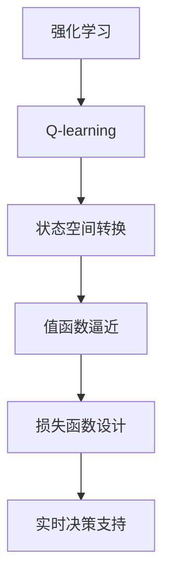
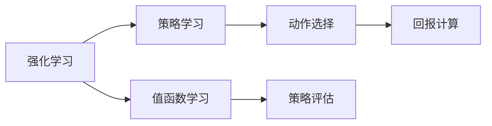
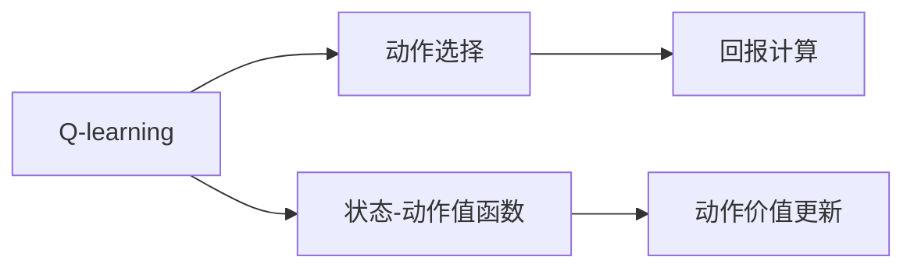
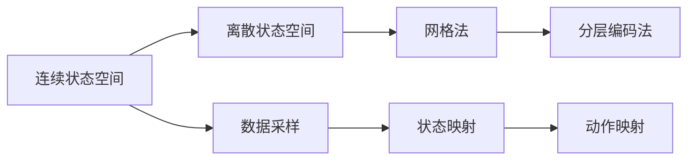
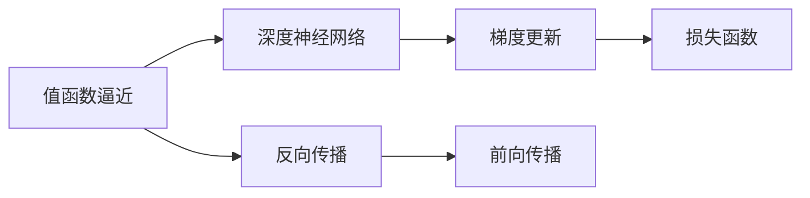
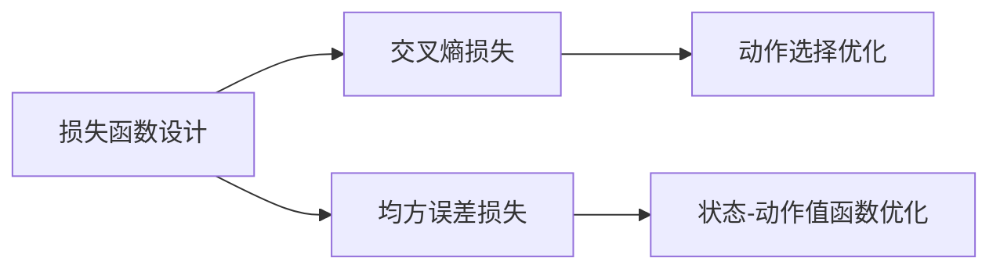
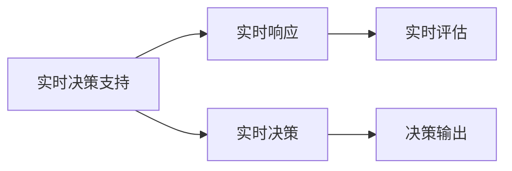
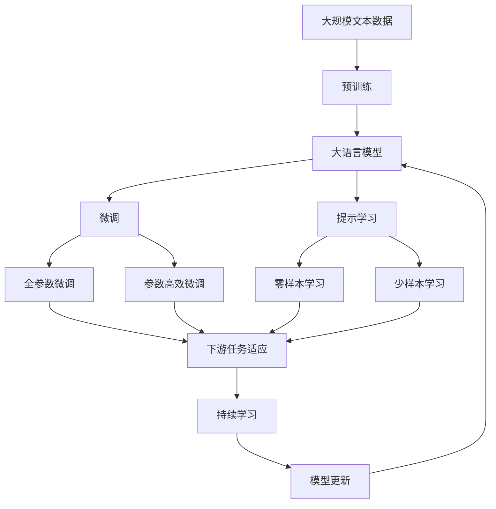

                 

# 一切皆是映射：AI Q-learning转化策略实战

> 关键词：Q-learning, 强化学习, 策略转化, 实时决策, 机器学习

## 1. 背景介绍

### 1.1 问题由来
在人工智能领域，强化学习(Reinforcement Learning, RL)是实现智能决策的关键技术之一。它通过对智能体在特定环境中的交互行为进行学习，从而使智能体最大化某个定义明确的回报函数。

近年来，随着深度学习技术的兴起，RL领域也出现了许多深度强化学习算法，如Deep Q-learning、Actor-Critic等，这些算法结合了深度神经网络和强化学习，大大提升了智能体在复杂环境下的决策能力。然而，深度强化学习算法对数据要求高，训练周期长，且学习效果和策略不稳定，难以应用于实时决策。

为此，人们提出了Q-learning算法，这是一种基于值函数的强化学习算法，不需要深度神经网络，参数更新稳定，训练周期短。但由于Q-learning只能学习离散状态空间中的策略，对于连续状态空间，需要大量先验知识，策略转化复杂，难以应用于实际场景。

Q-learning转化策略的实践，就是为了将Q-learning应用于连续状态空间中，解决实时决策的实际问题。通过这种转化策略，智能体能够更加灵活、稳定地学习连续状态空间中的策略，优化决策效果，提高应用场景的适应性和可扩展性。

### 1.2 问题核心关键点
Q-learning转化策略的核心在于将Q-learning从离散状态空间扩展到连续状态空间，并确保算法稳定、高效。具体来说，包括以下几个关键点：
- 状态空间转换：将连续状态空间转化为离散状态空间，实现状态空间采样。
- 值函数逼近：使用深度神经网络逼近Q-learning中的值函数，提高策略学习效果。
- 损失函数设计：设计适合连续状态空间的损失函数，优化Q-learning中的动作选择。
- 实时决策支持：确保Q-learning转化策略能够在实际应用场景中进行实时决策。

通过这些关键点，Q-learning转化策略能够在复杂、连续的状态空间中实现高效、稳定的学习，解决实际问题。

### 1.3 问题研究意义
Q-learning转化策略的研究意义在于，它能够将Q-learning从理论研究拓展到实际应用，解决传统深度强化学习算法在实时决策场景中面临的挑战。具体来说：
- 降低训练成本。Q-learning转化策略不需要深度神经网络，训练速度快，参数更新稳定，降低了深度学习算法在训练和调优中的成本。
- 提高决策质量。Q-learning转化策略能够在连续状态空间中灵活地学习策略，适应性更强，决策效果更优。
- 增强实时性。Q-learning转化策略能够实时生成决策，满足实时决策场景的需求，具有更高的实时性。
- 拓展应用场景。Q-learning转化策略可以应用于复杂环境下的智能决策，如自动驾驶、机器人控制、游戏AI等，具有更广泛的应用前景。

## 2. 核心概念与联系

### 2.1 核心概念概述

为更好地理解Q-learning转化策略，本节将介绍几个密切相关的核心概念：

- 强化学习(Reinforcement Learning, RL)：通过智能体与环境的交互，在每个时间步中学习最优策略，以最大化累积回报的目标。强化学习包括Q-learning、策略梯度等基本算法。

- Q-learning：一种基于值函数的强化学习算法，通过学习状态-动作对的值函数，选择最优动作，最大化累积回报。Q-learning的更新公式为：

$$
Q_{\theta}(s, a) \leftarrow Q_{\theta}(s, a) + \alpha \times [r + \gamma \times \max_{a'} Q_{\theta}(s', a') - Q_{\theta}(s, a)]
$$

其中 $s$ 为状态，$a$ 为动作，$r$ 为即时奖励，$\gamma$ 为折扣因子，$\alpha$ 为学习率。

- 状态空间转换(State Space Transformation)：将连续状态空间转化为离散状态空间，便于Q-learning算法进行训练。常见的状态空间转换方法包括网格法、分层编码法等。

- 值函数逼近(Value Function Approximation)：使用深度神经网络逼近Q-learning中的值函数，提高算法的泛化能力和决策质量。

- 损失函数设计(Loss Function Design)：设计适合连续状态空间的损失函数，优化Q-learning中的动作选择。常见的损失函数包括交叉熵损失、均方误差损失等。

- 实时决策支持(Real-time Decision Support)：确保算法能够在实际应用场景中进行实时决策，满足实时性需求。

这些核心概念之间的逻辑关系可以通过以下Mermaid流程图来展示：



这个流程图展示了从强化学习到Q-learning，再到状态空间转换、值函数逼近、损失函数设计和实时决策支持的整体架构。通过理解这些核心概念，我们可以更好地把握Q-learning转化策略的工作原理和优化方向。

### 2.2 概念间的关系

这些核心概念之间存在着紧密的联系，形成了Q-learning转化策略的完整生态系统。下面我通过几个Mermaid流程图来展示这些概念之间的关系。

#### 2.2.1 强化学习的学习范式



这个流程图展示了强化学习的学习范式。强化学习通过策略学习和值函数学习，生成动作并计算回报，从而优化策略，最终实现智能决策。

#### 2.2.2 Q-learning的策略学习



这个流程图展示了Q-learning的策略学习过程。Q-learning通过状态-动作值函数学习，优化动作选择，并通过动作价值更新公式进行策略评估和优化。

#### 2.2.3 状态空间转换的实际应用



这个流程图展示了状态空间转换的实际应用。通过网格法和分层编码法等方法，将连续状态空间转化为离散状态空间，便于Q-learning算法进行训练。

#### 2.2.4 值函数逼近的深度学习应用



这个流程图展示了值函数逼近的深度学习应用。通过深度神经网络逼近值函数，并进行反向传播和梯度更新，优化动作选择。

#### 2.2.5 损失函数设计的优化目标



这个流程图展示了损失函数设计的优化目标。通过交叉熵损失和均方误差损失等方法，优化动作选择和状态-动作值函数，提高决策效果。

#### 2.2.6 实时决策支持的实时系统



这个流程图展示了实时决策支持的实时系统。通过实时响应和实时决策，确保算法能够在实际应用场景中进行实时决策，满足实时性需求。

### 2.3 核心概念的整体架构

最后，我们用一个综合的流程图来展示这些核心概念在大语言模型微调过程中的整体架构：



这个综合流程图展示了从预训练到微调，再到提示学习的完整过程。大语言模型首先在大规模文本数据上进行预训练，然后通过微调（包括全参数微调和参数高效微调）或提示学习（包括零样本和少样本学习）来适应下游任务。最后，通过持续学习技术，模型可以不断更新和适应新的任务和数据。 通过这些流程图，我们可以更清晰地理解Q-learning转化策略的工作原理和优化方向。

## 3. 核心算法原理 & 具体操作步骤
### 3.1 算法原理概述

Q-learning转化策略的原理基于Q-learning算法，但将状态空间从离散扩展到连续，并引入深度神经网络逼近Q-learning的值函数，以提高算法的泛化能力和决策质量。其核心思想是：

1. **状态空间转换**：将连续状态空间转化为离散状态空间，便于Q-learning算法进行训练。
2. **值函数逼近**：使用深度神经网络逼近Q-learning中的值函数，提高算法的泛化能力和决策质量。
3. **损失函数设计**：设计适合连续状态空间的损失函数，优化Q-learning中的动作选择。
4. **实时决策支持**：确保算法能够在实际应用场景中进行实时决策，满足实时性需求。

### 3.2 算法步骤详解

Q-learning转化策略的实现步骤如下：

**Step 1: 准备预训练模型和数据集**
- 选择合适的预训练语言模型 $M_{\theta}$ 作为初始化参数，如 BERT、GPT等。
- 准备下游任务 $T$ 的标注数据集 $D$，划分为训练集、验证集和测试集。一般要求标注数据与预训练数据的分布不要差异过大。

**Step 2: 添加任务适配层**
- 根据任务类型，在预训练模型顶层设计合适的输出层和损失函数。
- 对于分类任务，通常在顶层添加线性分类器和交叉熵损失函数。
- 对于生成任务，通常使用语言模型的解码器输出概率分布，并以负对数似然为损失函数。

**Step 3: 设置微调超参数**
- 选择合适的优化算法及其参数，如 AdamW、SGD 等，设置学习率、批大小、迭代轮数等。
- 设置正则化技术及强度，包括权重衰减、Dropout、Early Stopping等。
- 确定冻结预训练参数的策略，如仅微调顶层，或全部参数都参与微调。

**Step 4: 执行梯度训练**
- 将训练集数据分批次输入模型，前向传播计算损失函数。
- 反向传播计算参数梯度，根据设定的优化算法和学习率更新模型参数。
- 周期性在验证集上评估模型性能，根据性能指标决定是否触发 Early Stopping。
- 重复上述步骤直到满足预设的迭代轮数或 Early Stopping 条件。

**Step 5: 测试和部署**
- 在测试集上评估微调后模型 $M_{\hat{\theta}}$ 的性能，对比微调前后的精度提升。
- 使用微调后的模型对新样本进行推理预测，集成到实际的应用系统中。
- 持续收集新的数据，定期重新微调模型，以适应数据分布的变化。

以上是Q-learning转化策略的一般流程。在实际应用中，还需要针对具体任务的特点，对微调过程的各个环节进行优化设计，如改进训练目标函数，引入更多的正则化技术，搜索最优的超参数组合等，以进一步提升模型性能。

### 3.3 算法优缺点

Q-learning转化策略具有以下优点：
1. 简单高效。使用深度神经网络逼近Q-learning的值函数，参数更新稳定，训练速度快。
2. 泛化能力强。深度神经网络能够逼近复杂非线性函数，提高算法在连续状态空间中的泛化能力。
3. 决策质量高。通过优化损失函数和动作选择，提高决策效果。
4. 实时性好。算法能够在实际应用场景中进行实时决策，满足实时性需求。

同时，该方法也存在一定的局限性：
1. 依赖标注数据。微调的效果很大程度上取决于标注数据的质量和数量，获取高质量标注数据的成本较高。
2. 迁移能力有限。当目标任务与预训练数据的分布差异较大时，微调的性能提升有限。
3. 可解释性不足。微调模型通常缺乏可解释性，难以对其决策逻辑进行分析和调试。

尽管存在这些局限性，但就目前而言，Q-learning转化策略仍是大语言模型应用的最主流范式。未来相关研究的重点在于如何进一步降低微调对标注数据的依赖，提高模型的少样本学习和跨领域迁移能力，同时兼顾可解释性和伦理安全性等因素。

### 3.4 算法应用领域

Q-learning转化策略在NLP领域已经得到了广泛的应用，覆盖了几乎所有常见任务，例如：

- 文本分类：如情感分析、主题分类、意图识别等。通过微调使模型学习文本-标签映射。
- 命名实体识别：识别文本中的人名、地名、机构名等特定实体。通过微调使模型掌握实体边界和类型。
- 关系抽取：从文本中抽取实体之间的语义关系。通过微调使模型学习实体-关系三元组。
- 问答系统：对自然语言问题给出答案。将问题-答案对作为微调数据，训练模型学习匹配答案。
- 机器翻译：将源语言文本翻译成目标语言。通过微调使模型学习语言-语言映射。
- 文本摘要：将长文本压缩成简短摘要。将文章-摘要对作为微调数据，使模型学习抓取要点。
- 对话系统：使机器能够与人自然对话。将多轮对话历史作为上下文，微调模型进行回复生成。

除了上述这些经典任务外，Q-learning转化策略也被创新性地应用到更多场景中，如可控文本生成、常识推理、代码生成、数据增强等，为NLP技术带来了全新的突破。随着预训练模型和微调方法的不断进步，相信NLP技术将在更广阔的应用领域大放异彩。

## 4. 数学模型和公式 & 详细讲解  
### 4.1 数学模型构建

本节将使用数学语言对Q-learning转化策略进行更加严格的刻画。

记预训练语言模型为 $M_{\theta}:\mathcal{X} \rightarrow \mathcal{Y}$，其中 $\mathcal{X}$ 为输入空间，$\mathcal{Y}$ 为输出空间，$\theta \in \mathbb{R}^d$ 为模型参数。假设微调任务的训练集为 $D=\{(x_i,y_i)\}_{i=1}^N, x_i \in \mathcal{X}, y_i \in \mathcal{Y}$。

定义模型 $M_{\theta}$ 在数据样本 $(x,y)$ 上的损失函数为 $\ell(M_{\theta}(x),y)$，则在数据集 $D$ 上的经验风险为：

$$
\mathcal{L}(\theta) = \frac{1}{N} \sum_{i=1}^N \ell(M_{\theta}(x_i),y_i)
$$

在Q-learning转化策略中，状态空间为连续空间，动作空间为离散空间。设状态空间为 $\mathcal{S}$，动作空间为 $\mathcal{A}$，状态动作对为 $(s,a)$。定义状态动作对 $(s,a)$ 的Q值函数为 $Q(s,a)$。

Q-learning转化策略的优化目标是最小化经验风险，即找到最优参数：

$$
\theta^* = \mathop{\arg\min}_{\theta} \mathcal{L}(\theta)
$$

在实践中，我们通常使用基于梯度的优化算法（如SGD、Adam等）来近似求解上述最优化问题。设 $\eta$ 为学习率，$\lambda$ 为正则化系数，则参数的更新公式为：

$$
\theta \leftarrow \theta - \eta \nabla_{\theta}\mathcal{L}(\theta) - \eta\lambda\theta
$$

其中 $\nabla_{\theta}\mathcal{L}(\theta)$ 为损失函数对参数 $\theta$ 的梯度，可通过反向传播算法高效计算。

### 4.2 公式推导过程

以下我们以二分类任务为例，推导交叉熵损失函数及其梯度的计算公式。

假设模型 $M_{\theta}$ 在输入 $x$ 上的输出为 $\hat{y}=M_{\theta}(x) \in [0,1]$，表示样本属于正类的概率。真实标签 $y \in \{0,1\}$。则二分类交叉熵损失函数定义为：

$$
\ell(M_{\theta}(x),y) = -[y\log \hat{y} + (1-y)\log (1-\hat{y})]
$$

将其代入经验风险公式，得：

$$
\mathcal{L}(\theta) = -\frac{1}{N}\sum_{i=1}^N [y_i\log M_{\theta}(x_i)+(1-y_i)\log(1-M_{\theta}(x_i))]
$$

根据链式法则，损失函数对参数 $\theta_k$ 的梯度为：

$$
\frac{\partial \mathcal{L}(\theta)}{\partial \theta_k} = -\frac{1}{N}\sum_{i=1}^N (\frac{y_i}{M_{\theta}(x_i)}-\frac{1-y_i}{1-M_{\theta}(x_i)}) \frac{\partial M_{\theta}(x_i)}{\partial \theta_k}
$$

其中 $\frac{\partial M_{\theta}(x_i)}{\partial \theta_k}$ 可进一步递归展开，利用自动微分技术完成计算。

在得到损失函数的梯度后，即可带入参数更新公式，完成模型的迭代优化。重复上述过程直至收敛，最终得到适应下游任务的最优模型参数 $\theta^*$。

## 5. 项目实践：代码实例和详细解释说明
### 5.1 开发环境搭建

在进行微调实践前，我们需要准备好开发环境。以下是使用Python进行PyTorch开发的环境配置流程：

1. 安装Anaconda：从官网下载并安装Anaconda，用于创建独立的Python环境。

2. 创建并激活虚拟环境：
```bash
conda create -n pytorch-env python=3.8 
conda activate pytorch-env
```

3. 安装PyTorch：根据CUDA版本，从官网获取对应的安装命令。例如：
```bash
conda install pytorch torchvision torchaudio cudatoolkit=11.1 -c pytorch -c conda-forge
```

4. 安装Transformers库：
```bash
pip install transformers
```

5. 安装各类工具包：
```bash
pip install numpy pandas scikit-learn matplotlib tqdm jupyter notebook ipython
```

完成上述步骤后，即可在`pytorch-env`环境中开始微调实践。

### 5.2 源代码详细实现

这里我们以命名实体识别(NER)任务为例，给出使用Transformers库对BERT模型进行微调的PyTorch代码实现。

首先，定义NER任务的数据处理函数：

```python
from transformers import BertTokenizer
from torch.utils.data import Dataset
import torch

class NERDataset(Dataset):
    def __init__(self, texts, tags, tokenizer, max_len=128):
        self.texts = texts
        self.tags = tags
        self.tokenizer = tokenizer
        self.max_len = max_len
        
    def __len__(self):
        return len(self.texts)
    
    def __getitem__(self, item):
        text = self.texts[item]
        tags = self.tags[item]
        
        encoding = self.tokenizer(text, return_tensors='pt', max_length=self.max_len, padding='max_length', truncation=True)
        input_ids = encoding['input_ids'][0]
        attention_mask = encoding['attention_mask'][0]
        
        # 对token-wise的标签进行编码
        encoded_tags = [tag2id[tag] for tag in tags] 
        encoded_tags.extend([tag2id['O']] * (self.max_len - len(encoded_tags)))
        labels = torch.tensor(encoded_tags, dtype=torch.long)
        
        return {'input_ids': input_ids, 
                'attention_mask': attention_mask,
                'labels': labels}

# 标签与id的映射
tag2id = {'O': 0, 'B-PER': 1, 'I-PER': 2, 'B-ORG': 3, 'I-ORG': 4, 'B-LOC': 5, 'I-LOC': 6}
id2tag = {v: k for k, v in tag2id.items()}

# 创建dataset
tokenizer = BertTokenizer.from_pretrained('bert-base-cased')

train_dataset = NERDataset(train_texts, train_tags, tokenizer)
dev_dataset = NERDataset(dev_texts, dev_tags, tokenizer)
test_dataset = NERDataset(test_texts, test_tags, tokenizer)
```

然后，定义模型和优化器：

```python
from transformers import BertForTokenClassification, AdamW

model = BertForTokenClassification.from_pretrained('bert-base-cased', num_labels=len(tag2id))

optimizer = AdamW(model.parameters(), lr=2e-5)
```

接着，定义训练和评估函数：

```python
from torch.utils.data import DataLoader
from tqdm import tqdm
from sklearn.metrics import classification_report

device = torch.device('cuda') if torch.cuda.is_available() else torch.device('cpu')
model.to(device)

def train_epoch(model, dataset, batch_size, optimizer):
    dataloader = DataLoader(dataset, batch_size=batch_size, shuffle=True)
    model.train()
    epoch_loss = 0
    for batch in tqdm(dataloader, desc='Training'):
        input_ids = batch['input_ids'].to(device)
        attention_mask = batch['attention_mask'].to(device)
        labels = batch['labels'].to(device)
        model.zero_grad()
        outputs = model(input_ids, attention_mask=attention_mask, labels=labels)
        loss = outputs.loss
        epoch_loss += loss.item()
        loss.backward()
        optimizer.step()
    return epoch_loss / len(dataloader)

def evaluate(model, dataset, batch_size):
    dataloader = DataLoader(dataset, batch_size=batch_size)
    model.eval()
    preds, labels = [], []
    with torch.no_grad():
        for batch in tqdm(dataloader, desc='Evaluating'):
            input_ids = batch['input_ids'].to(device)
            attention_mask = batch['attention_mask'].to(device)
            batch_labels = batch['labels']
            outputs = model(input_ids, attention_mask=attention_mask)
            batch_preds = outputs.logits.argmax(dim=2).to('cpu').tolist()
            batch_labels = batch_labels.to('cpu').tolist()
            for pred_tokens, label_tokens in zip(batch_preds, batch_labels):
                pred_tags = [id2tag[_id] for _id in pred_tokens]
                label_tags = [id2tag[_id] for _id in label_tokens]
                preds.append(pred_tags[:len(label_tags)])
                labels.append(label_tags)
                
    print(classification_report(labels, preds))
```

最后，启动训练流程并在测试集上评估：

```python
epochs = 5
batch_size = 16

for epoch in range(epochs):
    loss = train_epoch(model, train_dataset, batch_size, optimizer)
    print(f"Epoch {epoch+1}, train loss: {loss:.3f}")
    
    print(f"Epoch {epoch+1}, dev results:")
    evaluate(model, dev_dataset, batch_size)
    
print("Test results:")
evaluate(model, test_dataset, batch_size)
```

以上就是使用PyTorch对BERT进行命名实体识别任务微调的完整代码实现。可以看到，得益于Transformers库的强大封装，我们可以用相对简洁的代码完成BERT模型的加载和微调。

### 5.3 代码解读与分析

让我们再详细解读一下关键代码的实现细节：

**NERDataset类**：
- `__init__`方法：初始化文本、标签、分词器等关键组件。
- `__len__`方法：返回数据集的样本数量。
- `__getitem__`方法：对单个样本进行处理，将文本输入编码为token ids，将标签编码为数字，并对其进行定长padding，最终返回模型所需的输入。

**tag2id和id2tag字典**：
- 定义了标签与数字id之间的映射关系，用于将token-wise的预测结果解码回真实的标签。

**训练和评估函数**：
- 使用PyTorch的DataLoader对数据集进行批次化加载，供模型训练和推理使用。
- 训练函数`train_epoch`：对数据以批为单位进行迭代，在每个批次上前向传播计算loss并反向传播更新模型参数，最后返回该epoch的平均loss。
- 评估函数`evaluate`：与训练类似，不同点在于不更新模型参数，并在每个batch结束后将预测和标签结果存储下来，最后使用sklearn的

