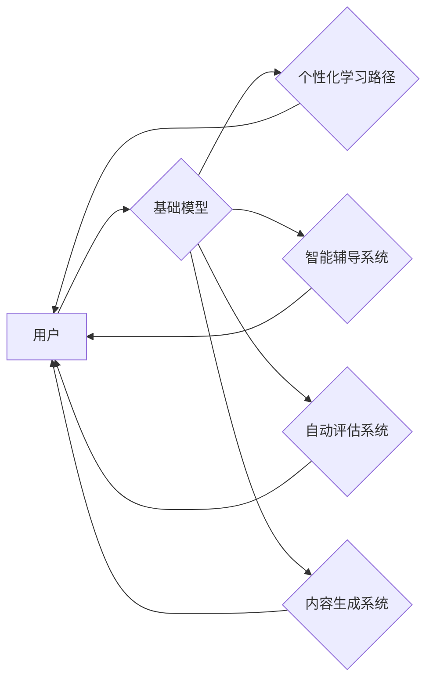

## 基础模型在教育中的应用前景

> 关键词：基础模型、教育科技、人工智能、个性化学习、智能辅导、自动评估、内容生成

### 1. 背景介绍

教育领域一直致力于提升学习效率和质量，探索更有效、更个性化的教学模式。近年来，人工智能（AI）技术突飞猛进，特别是基础模型的出现，为教育科技带来了前所未有的机遇。基础模型，也称为通用模型，是指在海量数据上预训练的强大AI模型，具备广泛的知识和理解能力，能够适应多种下游任务。

传统的教育模式往往采用“一刀切”的教学方法，难以满足不同学生个性化的学习需求。基础模型的应用可以打破这种局限性，实现个性化学习、智能辅导、自动评估等功能，从而提升学习体验和效果。

### 2. 核心概念与联系

**2.1 基础模型概述**

基础模型是近年来人工智能领域取得的重要突破。它通过在海量文本、代码、图像等数据上进行预训练，学习到丰富的知识和模式，并能够将这些知识应用于各种下游任务，例如文本生成、翻译、问答、代码生成等。

**2.2 基础模型与教育科技的联系**

基础模型的强大能力可以应用于教育科技的多个方面，例如：

* **个性化学习:** 根据学生的学习进度、知识掌握情况和学习风格，为每个学生定制个性化的学习路径和内容。
* **智能辅导:** 提供实时、个性化的学习辅导，解答学生疑问，帮助学生理解知识点。
* **自动评估:** 自动批改作业，提供学生学习情况的反馈，帮助教师及时发现学生学习上的困难。
* **内容生成:** 自动生成学习材料，例如习题、练习、案例分析等，丰富教学内容。

**2.3 基础模型在教育中的应用架构**



### 3. 核心算法原理 & 具体操作步骤

**3.1 算法原理概述**

基础模型的训练主要基于深度学习算法，特别是 Transformer 架构。Transformer 模型通过自注意力机制学习文本之间的关系，能够捕捉长距离依赖关系，从而实现更准确的理解和生成。

**3.2 算法步骤详解**

1. **数据预处理:** 将文本数据进行清洗、分词、标记等预处理操作，使其能够被模型理解。
2. **模型训练:** 使用深度学习框架（例如 TensorFlow、PyTorch）训练 Transformer 模型，通过反向传播算法不断优化模型参数。
3. **模型评估:** 在测试集上评估模型的性能，例如准确率、召回率、F1-score 等。
4. **模型部署:** 将训练好的模型部署到服务器或云平台，供用户使用。

**3.3 算法优缺点**

**优点:**

* 强大的泛化能力：预训练模型能够适应多种下游任务。
* 高效的学习能力：深度学习算法能够从海量数据中学习到复杂的知识和模式。
* 持续的改进：随着数据量的增加和算法的改进，基础模型的性能会不断提升。

**缺点:**

* 训练成本高：训练大型基础模型需要大量的计算资源和时间。
* 数据依赖性强：模型的性能取决于训练数据的质量和数量。
* 缺乏可解释性：深度学习模型的决策过程难以理解。

**3.4 算法应用领域**

基础模型在教育科技领域的应用前景广阔，例如：

* **智能问答系统:** 帮助学生解答学习疑问，提供个性化的学习指导。
* **自动生成学习内容:** 自动生成习题、练习、案例分析等学习材料，丰富教学内容。
* **个性化学习推荐:** 根据学生的学习进度和兴趣，推荐个性化的学习资源。
* **学习行为分析:** 分析学生的学习行为，识别学习上的困难，提供针对性的帮助。

### 4. 数学模型和公式 & 详细讲解 & 举例说明

**4.1 数学模型构建**

基础模型的训练通常基于最大似然估计（MLE）的目标函数，其目标是最大化模型在训练数据上的似然概率。

**4.2 公式推导过程**

假设训练数据为 $(x_1, y_1), (x_2, y_2),..., (x_N, y_N)$, 其中 $x_i$ 为输入文本，$y_i$ 为对应的输出文本。模型的输出为 $p(y_i|x_i)$, 则 MLE 目标函数为：

$$
\mathcal{L} = \prod_{i=1}^{N} p(y_i|x_i)
$$

**4.3 案例分析与讲解**

例如，在文本生成任务中，基础模型的输出为下一个词的概率分布。训练目标是最大化模型在训练数据上生成正确下一个词的概率。

### 5. 项目实践：代码实例和详细解释说明

**5.1 开发环境搭建**

* Python 3.7+
* TensorFlow 或 PyTorch
* CUDA 和 cuDNN (可选，用于 GPU 加速)

**5.2 源代码详细实现**

```python
# 使用 TensorFlow 训练一个简单的文本生成模型
import tensorflow as tf

# 定义模型结构
model = tf.keras.Sequential([
    tf.keras.layers.Embedding(input_dim=vocab_size, output_dim=embedding_dim),
    tf.keras.layers.LSTM(units=lstm_units),
    tf.keras.layers.Dense(units=vocab_size, activation='softmax')
])

# 编译模型
model.compile(optimizer='adam', loss='sparse_categorical_crossentropy', metrics=['accuracy'])

# 训练模型
model.fit(x_train, y_train, epochs=epochs)

# 保存模型
model.save('text_generator_model.h5')
```

**5.3 代码解读与分析**

* 代码使用 TensorFlow 库构建了一个简单的文本生成模型。
* 模型结构包括 Embedding 层、LSTM 层和 Dense 层。
* Embedding 层将单词映射到低维向量空间。
* LSTM 层学习文本序列的上下文信息。
* Dense 层输出每个单词的概率分布。
* 模型使用 Adam 优化器、稀疏类别交叉熵损失函数和准确率作为评估指标。

**5.4 运行结果展示**

训练完成后，可以使用模型生成新的文本。例如，可以输入一个句子作为开头，模型会根据上下文信息生成后续的句子。

### 6. 实际应用场景

**6.1 个性化学习路径**

基础模型可以根据学生的学习进度、知识掌握情况和学习风格，为每个学生定制个性化的学习路径和内容。例如，可以根据学生的错题分析，推荐相关的学习资源，帮助学生巩固薄弱环节。

**6.2 智能辅导系统**

基础模型可以构建智能辅导系统，为学生提供实时、个性化的学习辅导。例如，学生在学习过程中遇到问题，可以向智能辅导系统提问，系统会根据知识库和理解能力，提供准确的解答和指导。

**6.3 自动评估系统**

基础模型可以用于自动批改作业，提供学生学习情况的反馈。例如，可以训练一个基础模型识别学生的代码错误，并提供相应的修复建议。

**6.4 未来应用展望**

基础模型在教育科技领域的应用前景广阔，未来可能应用于：

* **虚拟教学助手:** 基于基础模型构建虚拟教学助手，为学生提供个性化的学习指导和陪伴。
* **智能考试系统:** 基于基础模型构建智能考试系统，自动生成考试题，并对学生的作答进行智能批改。
* **跨语言教育:** 基于基础模型实现跨语言教育，帮助学生学习不同语言的知识和文化。

### 7. 工具和资源推荐

**7.1 学习资源推荐**

* **课程:**
    * Stanford CS224N: Natural Language Processing with Deep Learning
    * MIT 6.S191: Introduction to Deep Learning
* **书籍:**
    * Deep Learning by Ian Goodfellow, Yoshua Bengio, and Aaron Courville
    * Speech and Language Processing by Dan Jurafsky and James H. Martin
* **在线文档:**
    * TensorFlow 官方文档: https://www.tensorflow.org/
    * PyTorch 官方文档: https://pytorch.org/

**7.2 开发工具推荐**

* **深度学习框架:** TensorFlow, PyTorch
* **文本处理工具:** NLTK, SpaCy
* **云平台:** Google Cloud Platform, Amazon Web Services, Microsoft Azure

**7.3 相关论文推荐**

* **BERT:** Devlin, J., Chang, M. W., Lee, K., & Toutanova, K. (2018). Bert: Pre-training of deep bidirectional transformers for language understanding. arXiv preprint arXiv:1810.04805.
* **GPT-3:** Brown, T. B., Mann, B., Ryder, N., Subbiah, M., Kaplan, J., Dhariwal, P.,... & Amodei, D. (2020). Language models are few-shot learners. arXiv preprint arXiv:2005.14165.
* **T5:** Raffel, C., Shazeer, N., Roberts, A., Lee, K., Narang, S., Matena, M.,... & Dean, J. (2019). Exploring the limits of transfer learning with a unified text-to-text transformer. arXiv preprint arXiv:1910.10683.

### 8. 总结：未来发展趋势与挑战

**8.1 研究成果总结**

基础模型在教育科技领域的应用取得了显著成果，例如个性化学习路径、智能辅导系统、自动评估系统等。这些应用能够提升学习效率和质量，为学生提供更个性化的学习体验。

**8.2 未来发展趋势**

未来基础模型在教育科技领域的应用将朝着以下方向发展：

* **更强大的模型:** 模型规模和能力将不断提升，能够处理更复杂的任务，提供更精准的学习指导。
* **更个性化的学习:** 模型将更加深入地理解学生的学习需求，提供更加个性化的学习路径和内容。
* **更智能的交互:** 模型将能够与学生进行更自然、更智能的交互，例如对话式学习、游戏化学习等。

**8.3 面临的挑战**

基础模型在教育科技领域的应用也面临一些挑战：

* **数据安全和隐私:** 教育数据涉及学生个人信息，需要确保数据安全和隐私。
* **模型解释性和可信度:** 深度学习模型的决策过程难以理解，需要提高模型的解释性和可信度。
* **公平性和包容性:** 模型需要公平地对待所有学生，避免出现歧视或偏见。

**8.4 研究展望**

未来研究将重点关注以下方面：

* **开发更安全、更隐私的模型训练方法。**
* **提高模型的解释性和可信度，使其决策过程更加透明。**
* **确保模型的公平性和包容性，为所有学生提供平等的学习机会。**


### 9. 附录：常见问题与解答

**9.1 基础模型的训练成本高吗？**

是的，训练大型基础模型需要大量的计算资源和时间。

**9.2 基础模型的性能取决于什么？**

基础模型的性能取决于训练数据的质量和数量，以及模型的架构和参数。

**9.3 基础模型是否可以应用于所有教育场景？**

基础模型在教育科技领域的应用前景广阔，但并非所有教育场景都适合使用基础模型。例如，一些需要高度专业知识的教育场景，可能需要更专门的模型。


作者：禅与计算机程序设计艺术 / Zen and the Art of Computer Programming 
