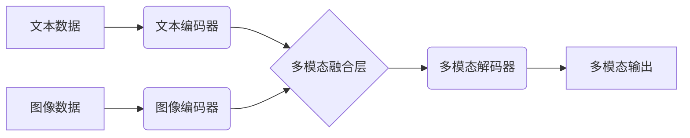

## 多模态大模型：技术原理与实战 多模态大模型的核心技术

> 关键词：多模态大模型、Transformer、视觉语言模型、文本图像生成、多模态融合、BERT、CLIP、DALL-E

### 1. 背景介绍

近年来，人工智能领域取得了令人瞩目的进展，其中大模型技术作为重要驱动力，在自然语言处理、计算机视觉等领域展现出强大的能力。然而，传统的单模态大模型仅处理单一类型数据（如文本或图像），难以捕捉现实世界中多模态信息的丰富性和复杂性。

多模态大模型 (Multimodal Large Models) 应运而生，旨在融合不同模态数据（如文本、图像、音频、视频等）进行学习和推理。它能够跨模态进行信息交互，理解和生成多模态内容，从而实现更智能、更自然的人机交互。

### 2. 核心概念与联系

多模态大模型的核心概念是将不同模态数据进行融合，构建一个统一的表示空间，以便模型能够理解和处理跨模态信息。

**多模态融合架构**



**核心概念解释:**

* **文本编码器:** 将文本数据转换为向量表示，捕捉文本语义信息。
* **图像编码器:** 将图像数据转换为向量表示，捕捉图像视觉特征。
* **多模态融合层:** 将不同模态的向量表示进行融合，构建统一的表示空间。
* **多模态解码器:** 根据融合后的表示空间生成多模态输出，如文本描述、图像生成等。

### 3. 核心算法原理 & 具体操作步骤

#### 3.1  算法原理概述

多模态大模型的训练主要基于深度学习算法，其中 Transformer 架构在多模态领域取得了显著成功。Transformer 利用自注意力机制，能够捕捉不同模态数据之间的长距离依赖关系，实现更有效的跨模态信息融合。

#### 3.2  算法步骤详解

1. **数据预处理:** 将文本和图像数据进行预处理，如文本分词、图像裁剪、数据增强等。
2. **特征提取:** 使用预训练的文本编码器和图像编码器分别提取文本和图像的特征表示。
3. **多模态融合:** 将文本和图像特征进行融合，可以使用多种方法，如拼接、注意力机制、图神经网络等。
4. **模型训练:** 使用交叉熵损失函数，训练多模态大模型，使其能够准确地预测目标输出。
5. **模型评估:** 使用标准数据集进行模型评估，如图像字幕生成、文本图像匹配等，并根据指标如BLEU、ROUGE等进行评价。

#### 3.3  算法优缺点

**优点:**

* 能够捕捉跨模态信息，实现更丰富的理解和生成能力。
* 自注意力机制能够捕捉长距离依赖关系，提升模型性能。
* 预训练模型可以快速迁移到新的任务，降低训练成本。

**缺点:**

* 数据集规模要求高，训练成本较高。
* 模型参数量大，部署和推理效率较低。
* 跨模态信息融合仍然是一个挑战，需要不断探索新的方法。

#### 3.4  算法应用领域

* **图像字幕生成:** 将图像转换为文本描述。
* **文本图像匹配:** 判断文本描述与图像是否匹配。
* **视觉问答:** 根据图像回答文本问题。
* **多模态检索:** 根据文本或图像查询相关内容。
* **机器人交互:** 帮助机器人理解和生成多模态信息。

### 4. 数学模型和公式 & 详细讲解 & 举例说明

#### 4.1  数学模型构建

多模态大模型通常使用 Transformer 架构，其核心是自注意力机制。

**自注意力机制公式:**

$$
Attention(Q, K, V) = \frac{exp(Q \cdot K^T / \sqrt{d_k})}{exp(Q \cdot K^T / \sqrt{d_k})} \cdot V
$$

其中:

* $Q$: 查询矩阵
* $K$: 键矩阵
* $V$: 值矩阵
* $d_k$: 键向量的维度

#### 4.2  公式推导过程

自注意力机制通过计算查询向量与键向量的点积，得到一个权重矩阵，然后将权重矩阵与值矩阵相乘，得到最终的输出向量。

#### 4.3  案例分析与讲解

例如，在图像字幕生成任务中，文本编码器将文本句子编码为向量表示，图像编码器将图像编码为向量表示。然后，自注意力机制将文本向量和图像向量进行融合，学习文本和图像之间的关系。最终，解码器根据融合后的表示空间生成字幕。

### 5. 项目实践：代码实例和详细解释说明

#### 5.1  开发环境搭建

* Python 3.7+
* PyTorch 1.7+
* CUDA 10.2+

#### 5.2  源代码详细实现

```python
import torch
import torch.nn as nn

class MultimodalFusionLayer(nn.Module):
    def __init__(self, text_dim, image_dim):
        super(MultimodalFusionLayer, self).__init__()
        self.text_proj = nn.Linear(text_dim, text_dim)
        self.image_proj = nn.Linear(image_dim, text_dim)
        self.attention = nn.MultiheadAttention(text_dim, num_heads=8)

    def forward(self, text_embedding, image_embedding):
        text_embedding = self.text_proj(text_embedding)
        image_embedding = self.image_proj(image_embedding)
        fused_embedding = self.attention(text_embedding, image_embedding, image_embedding)[0]
        return fused_embedding

#... 其他模型层
```

#### 5.3  代码解读与分析

* `MultimodalFusionLayer` 类定义了多模态融合层，包含文本投影层、图像投影层和多头注意力机制。
* `forward` 方法将文本和图像特征进行融合，使用多头注意力机制学习跨模态关系。

#### 5.4  运行结果展示

通过训练和测试，可以评估多模态大模型的性能，例如在图像字幕生成任务中，可以计算BLEU分数来衡量模型生成的字幕与真实字幕的相似度。

### 6. 实际应用场景

#### 6.1  图像字幕生成

多模态大模型可以将图像转换为文本描述，用于辅助视障人士理解图像内容、自动生成图像标签、制作视频字幕等。

#### 6.2  文本图像匹配

多模态大模型可以判断文本描述与图像是否匹配，用于图像检索、内容审核、版权保护等。

#### 6.3  视觉问答

多模态大模型可以根据图像回答文本问题，用于智能问答系统、教育机器人等。

#### 6.4  未来应用展望

* **更智能的人机交互:** 多模态大模型可以理解和生成更丰富的多模态信息，实现更自然、更智能的人机交互。
* **个性化内容推荐:** 多模态大模型可以根据用户的多模态偏好，提供更个性化的内容推荐。
* **增强现实和虚拟现实:** 多模态大模型可以为增强现实和虚拟现实应用提供更丰富的交互体验。

### 7. 工具和资源推荐

#### 7.1  学习资源推荐

* **论文:**
    * "BERT: Pre-training of Deep Bidirectional Transformers for Language Understanding"
    * "CLIP: Contrastive Language-Image Pretraining"
    * "DALL-E: Creating Images from Text"
* **博客:**
    * https://blog.openai.com/
    * https://ai.googleblog.com/
* **课程:**
    * Stanford CS224N: Natural Language Processing with Deep Learning

#### 7.2  开发工具推荐

* **PyTorch:** https://pytorch.org/
* **TensorFlow:** https://www.tensorflow.org/
* **Hugging Face Transformers:** https://huggingface.co/transformers/

#### 7.3  相关论文推荐

* **多模态学习:**
    * "Multimodal Learning with Deep Neural Networks"
    * "A Survey on Multimodal Learning"
* **Transformer 架构:**
    * "Attention Is All You Need"
    * "BERT: Pre-training of Deep Bidirectional Transformers for Language Understanding"

### 8. 总结：未来发展趋势与挑战

#### 8.1  研究成果总结

多模态大模型在图像字幕生成、文本图像匹配等领域取得了显著成果，展现出强大的能力。

#### 8.2  未来发展趋势

* **模型规模和能力提升:** 未来多模态大模型将继续朝着更大规模、更强能力的方向发展。
* **跨模态理解和生成能力增强:** 研究者将探索更有效的跨模态信息融合方法，提升模型的跨模态理解和生成能力。
* **应用场景拓展:** 多模态大模型将应用于更多领域，例如医疗、教育、娱乐等。

#### 8.3  面临的挑战

* **数据获取和标注:** 多模态数据获取和标注成本高，需要开发更有效的标注方法。
* **模型训练和推理效率:** 多模态大模型参数量大，训练和推理效率较低，需要探索更有效的训练和推理方法。
* **伦理和安全问题:** 多模态大模型可能存在伦理和安全问题，例如数据隐私、算法偏见等，需要加强相关研究和监管。

#### 8.4  研究展望

未来，多模态大模型将继续是一个重要的研究方向，需要多学科交叉融合，推动人工智能技术的发展。

### 9. 附录：常见问题与解答

* **Q: 多模态大模型的训练数据需要多大规模？**
* **A:** 训练多模态大模型需要大量的多模态数据，通常需要百万甚至数十亿级别的数据规模。

* **Q: 多模态大模型的训练成本很高吗？**
* **A:** 由于模型规模大、数据规模大，多模态大模型的训练成本较高，需要强大的计算资源。

* **Q: 多模态大模型的应用场景有哪些？**
* **A:** 多模态大模型的应用场景非常广泛，例如图像字幕生成、文本图像匹配、视觉问答、机器人交互等。


作者：禅与计算机程序设计艺术 / Zen and the Art of Computer Programming 
