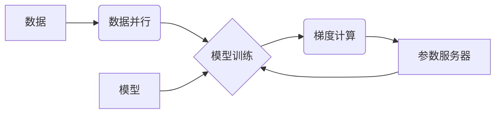

## 大规模语言模型从理论到实践 分布式训练

> 关键词：大规模语言模型、分布式训练、深度学习、参数服务器、模型并行、数据并行、梯度下降、优化算法、PyTorch、TensorFlow

### 1. 背景介绍

近年来，深度学习技术取得了飞速发展，尤其是大规模语言模型（Large Language Models，LLMs）的出现，为自然语言处理（NLP）领域带来了革命性的变革。LLMs，如GPT-3、BERT、LaMDA等，拥有数十亿甚至数千亿的参数，能够理解和生成人类语言，在文本生成、机器翻译、问答系统等领域展现出强大的能力。

然而，训练如此庞大的模型需要海量数据和强大的计算资源。传统的单机训练方法已经难以满足需求，分布式训练成为训练大规模语言模型的必要手段。分布式训练通过将模型参数和数据分散到多个机器上进行并行计算，有效提高了训练速度和效率。

### 2. 核心概念与联系

**2.1 核心概念**

* **大规模语言模型 (LLMs):** 拥有大量参数的深度学习模型，能够理解和生成人类语言。
* **分布式训练:** 将模型参数和数据分散到多个机器上进行并行计算，提高训练速度和效率。
* **模型并行:** 将模型参数分散到多个机器上，每个机器训练模型的一部分。
* **数据并行:** 将训练数据分散到多个机器上，每个机器训练模型的一部分数据。
* **参数服务器:** 用于存储和更新模型参数的中心服务器。

**2.2 架构图**



**2.3 联系**

分布式训练通过模型并行和数据并行两种方式，将模型参数和数据分散到多个机器上，并行训练模型。参数服务器负责存储和更新模型参数，各个机器根据参数服务器提供的参数进行训练，并计算梯度上传给参数服务器更新模型参数。

### 3. 核心算法原理 & 具体操作步骤

**3.1 算法原理概述**

分布式训练的核心算法是梯度下降算法。梯度下降算法通过不断更新模型参数，使模型的损失函数最小化。在分布式训练中，梯度下降算法被并行化，每个机器计算模型参数的梯度，并将其上传到参数服务器。参数服务器汇总所有机器的梯度，并更新模型参数。

**3.2 算法步骤详解**

1. **数据并行:** 将训练数据分散到多个机器上。
2. **模型并行:** 将模型参数分散到多个机器上。
3. **梯度计算:** 每个机器根据其分配的数据，计算模型参数的梯度。
4. **梯度聚合:** 参数服务器汇总所有机器的梯度。
5. **参数更新:** 参数服务器根据聚合的梯度，更新模型参数。
6. **模型评估:** 定期评估模型的性能，并根据评估结果调整训练参数。

**3.3 算法优缺点**

* **优点:**
    * 训练速度更快。
    * 可以训练更大的模型。
    * 能够利用多台机器的计算资源。
* **缺点:**
    * 增加了系统复杂度。
    * 需要考虑数据并行和模型并行的策略。
    * 需要解决通信延迟和数据同步问题。

**3.4 算法应用领域**

分布式训练广泛应用于大规模机器学习模型的训练，例如：

* 自然语言处理 (NLP): 训练大型语言模型，如GPT-3、BERT、LaMDA等。
* computer vision: 训练图像识别、目标检测等模型。
* 推荐系统: 训练个性化推荐模型。

### 4. 数学模型和公式 & 详细讲解 & 举例说明

**4.1 数学模型构建**

假设我们有一个包含 $N$ 个样本的数据集 $D = \{x_1, x_2,..., x_N\}$, 每个样本 $x_i$ 都是一个输入向量，对应的标签为 $y_i$. 我们使用一个深度神经网络 $f(x; \theta)$ 来预测标签，其中 $\theta$ 是模型参数。

我们的目标是找到最优的参数 $\theta$，使得模型在数据集上的损失函数最小化。损失函数通常是预测值与真实值的差的平方和，即：

$$L(\theta) = \frac{1}{N} \sum_{i=1}^{N} \mathcal{L}(f(x_i; \theta), y_i)$$

其中 $\mathcal{L}$ 是损失函数，例如均方误差 (MSE)。

**4.2 公式推导过程**

为了找到最优参数 $\theta$，我们使用梯度下降算法。梯度下降算法的基本思想是沿着损失函数的负梯度方向更新参数，直到损失函数最小化。

梯度下降算法的更新公式为：

$$\theta = \theta - \eta \nabla_{\theta} L(\theta)$$

其中 $\eta$ 是学习率， $\nabla_{\theta} L(\theta)$ 是损失函数关于参数 $\theta$ 的梯度。

**4.3 案例分析与讲解**

假设我们使用一个简单的线性回归模型，模型参数为 $\theta = (w, b)$，其中 $w$ 是权重， $b$ 是偏置。损失函数为均方误差 (MSE)。

在分布式训练中，我们将数据和模型参数分散到多个机器上。每个机器计算模型参数的梯度，并将其上传到参数服务器。参数服务器汇总所有机器的梯度，并更新模型参数。

例如，假设我们有 4 台机器，每个机器训练模型的一部分数据。每个机器计算模型参数的梯度，并将其上传到参数服务器。参数服务器汇总所有机器的梯度，并更新模型参数。

### 5. 项目实践：代码实例和详细解释说明

**5.1 开发环境搭建**

* 操作系统: Ubuntu 20.04
* Python 版本: 3.8
* 深度学习框架: PyTorch 1.10

**5.2 源代码详细实现**

```python
import torch
import torch.nn as nn
import torch.optim as optim

# 定义模型
class LinearRegression(nn.Module):
    def __init__(self):
        super(LinearRegression, self).__init__()
        self.linear = nn.Linear(1, 1)

    def forward(self, x):
        return self.linear(x)

# 初始化模型和优化器
model = LinearRegression()
optimizer = optim.SGD(model.parameters(), lr=0.01)

# 定义损失函数
criterion = nn.MSELoss()

# 数据
x_train = torch.randn(100, 1)
y_train = 2 * x_train + 1 + torch.randn(100, 1)

# 分布式训练
#...

# 模型评估
#...
```

**5.3 代码解读与分析**

* 我们定义了一个简单的线性回归模型，包含一个线性层。
* 我们使用随机梯度下降 (SGD) 优化器来更新模型参数。
* 我们使用均方误差 (MSE) 作为损失函数。
* 在分布式训练中，我们需要将数据和模型参数分散到多个机器上，并实现梯度计算和参数更新的并行化。

**5.4 运行结果展示**

在分布式训练完成后，我们可以评估模型的性能，例如计算模型在测试集上的均方误差。

### 6. 实际应用场景

分布式训练在许多实际应用场景中发挥着重要作用，例如：

* **搜索引擎:** 用于训练大型语言模型，提高搜索结果的准确性和相关性。
* **机器翻译:** 用于训练机器翻译模型，提高翻译质量和效率。
* **语音识别:** 用于训练语音识别模型，提高语音识别的准确性和实时性。
* **图像识别:** 用于训练图像识别模型，提高图像识别的准确性和速度。

**6.4 未来应用展望**

随着计算资源的不断发展，分布式训练技术将继续发展和完善，应用场景也将更加广泛。未来，分布式训练将应用于更多领域，例如：

* **药物研发:** 用于训练药物研发模型，加速药物发现和开发过程。
* **材料科学:** 用于训练材料科学模型，设计和开发新型材料。
* **金融科技:** 用于训练金融科技模型，提高金融风险管理和投资决策的效率。

### 7. 工具和资源推荐

**7.1 学习资源推荐**

* **书籍:**
    * Deep Learning by Ian Goodfellow, Yoshua Bengio, and Aaron Courville
    * Distributed Machine Learning by  Lihong Li, et al.
* **课程:**
    * Stanford CS231n: Convolutional Neural Networks for Visual Recognition
    * Coursera: Deep Learning Specialization

**7.2 开发工具推荐**

* **深度学习框架:** PyTorch, TensorFlow
* **分布式训练框架:** Horovod, Ray, Spark

**7.3 相关论文推荐**

* **AlexNet:** ImageNet Classification with Deep Convolutional Neural Networks
* **BERT:** Pre-training of Deep Bidirectional Transformers for Language Understanding
* **GPT-3:** Language Models are Few-Shot Learners

### 8. 总结：未来发展趋势与挑战

**8.1 研究成果总结**

分布式训练技术取得了显著进展，使得训练大规模语言模型成为可能。

**8.2 未来发展趋势**

* **模型并行:** 探索新的模型并行策略，例如混合精度训练、模型剪枝等。
* **数据并行:** 提高数据并行的效率，例如数据切片、数据均衡等。
* **通信优化:** 降低通信成本，例如模型压缩、参数服务器优化等。

**8.3 面临的挑战**

* **系统复杂性:** 分布式训练系统更加复杂，需要更强的系统管理能力。
* **数据同步:** 确保数据在各个机器上的同步，避免数据不一致问题。
* **模型训练稳定性:** 提高分布式训练的稳定性，避免模型训练不收敛等问题。

**8.4 研究展望**

未来，分布式训练技术将继续发展，并应用于更多领域。研究者将继续探索新的算法、架构和工具，以提高分布式训练的效率、稳定性和适用性。

### 9. 附录：常见问题与解答

* **Q: 为什么需要分布式训练？**

A: 因为单机训练无法满足训练大规模语言模型的需求，分布式训练可以利用多台机器的计算资源，提高训练速度和效率。

* **Q: 分布式训练有哪些不同的策略？**

A: 分布式训练主要有模型并行和数据并行两种策略。

* **Q: 分布式训练有哪些挑战？**

A: 分布式训练面临着系统复杂性、数据同步和模型训练稳定性等挑战。


作者：禅与计算机程序设计艺术 / Zen and the Art of Computer Programming 
