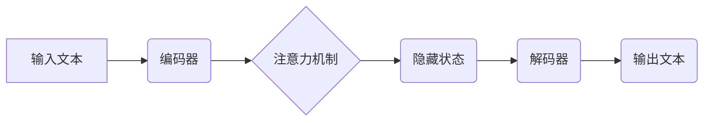

## 大语言模型原理基础与前沿 评估

> 关键词：大语言模型、Transformer、自然语言处理、深度学习、文本生成、机器翻译、问答系统

### 1. 背景介绍

近年来，深度学习技术取得了飞速发展，特别是Transformer模型的出现，为自然语言处理（NLP）领域带来了革命性的变革。大语言模型（LLM）作为Transformer模型的升级版，拥有海量参数和强大的文本理解和生成能力，在文本生成、机器翻译、问答系统等领域展现出令人瞩目的应用潜力。

LLM的出现，标志着人工智能进入了一个新的时代。它不仅能够理解和生成人类语言，还能进行复杂的逻辑推理、创意写作和代码生成等任务。然而，LLM也面临着一些挑战，例如训练成本高、数据偏差、可解释性差等。

### 2. 核心概念与联系

**2.1  自然语言处理（NLP）**

NLP是人工智能的一个分支，旨在使计算机能够理解、处理和生成人类语言。NLP的任务包括文本分类、情感分析、机器翻译、问答系统等。

**2.2  深度学习（Deep Learning）**

深度学习是一种机器学习的子领域，它利用多层神经网络来学习数据中的复杂模式。深度学习模型能够自动提取特征，无需人工特征工程，因此在图像识别、语音识别、自然语言处理等领域取得了突破性进展。

**2.3  Transformer模型**

Transformer模型是一种基于注意力机制的深度学习模型，它能够有效地处理序列数据，例如文本。Transformer模型的出现，彻底改变了NLP领域，使其在许多任务上取得了显著的性能提升。

**2.4  大语言模型（LLM）**

LLM是基于Transformer模型训练的大规模语言模型，它拥有海量参数和强大的文本理解和生成能力。LLM能够完成各种自然语言处理任务，例如文本生成、机器翻译、问答系统、代码生成等。

**2.5  LLM的架构**

LLM通常由以下几个部分组成：

* **编码器（Encoder）:** 用于将输入文本编码成一个固定长度的向量表示。
* **解码器（Decoder）:** 用于根据编码后的向量表示生成输出文本。
* **注意力机制（Attention Mechanism）:** 用于捕捉文本中不同词之间的关系，提高模型的理解能力。
* **参数量（Parameters）:** LLM拥有大量的参数，这些参数通过训练数据学习得到，决定了模型的性能。

**Mermaid 流程图**

### 3. 核心算法原理 & 具体操作步骤

**3.1  算法原理概述**

LLM的核心算法是基于Transformer模型的深度学习算法。Transformer模型利用注意力机制来捕捉文本中不同词之间的关系，并通过多层编码器和解码器来学习文本的语义表示。

**3.2  算法步骤详解**

1. **文本预处理:** 将输入文本进行清洗、分词、词嵌入等预处理操作。
2. **编码:** 将预处理后的文本输入编码器，编码器通过多层Transformer模块将文本编码成一个固定长度的向量表示。
3. **注意力机制:** 在编码器和解码器中，注意力机制用于捕捉文本中不同词之间的关系，并根据这些关系调整每个词的权重。
4. **解码:** 将编码后的向量表示输入解码器，解码器通过多层Transformer模块生成输出文本。
5. **输出:** 将解码器生成的输出文本进行后处理，例如去除非法字符、合并词等。

**3.3  算法优缺点**

**优点:**

* 能够有效地处理长文本序列。
* 具有强大的文本理解和生成能力。
* 在许多NLP任务上取得了显著的性能提升。

**缺点:**

* 训练成本高，需要大量的计算资源和训练数据。
* 数据偏差问题可能导致模型输出存在偏见。
* 可解释性差，难以理解模型的决策过程。

**3.4  算法应用领域**

LLM在以下领域具有广泛的应用前景：

* 文本生成：例如小说、诗歌、剧本等。
* 机器翻译：将一种语言翻译成另一种语言。
* 问答系统：回答用户提出的问题。
* 代码生成：自动生成代码。
* 聊天机器人：与用户进行自然语言对话。

### 4. 数学模型和公式 & 详细讲解 & 举例说明

**4.1  数学模型构建**

LLM的数学模型主要基于神经网络，其中包括编码器和解码器。编码器使用多层Transformer模块将输入文本编码成一个固定长度的向量表示，解码器则根据编码后的向量表示生成输出文本。

**4.2  公式推导过程**

Transformer模型的核心是注意力机制。注意力机制通过计算每个词与其他词之间的相关性，来确定每个词在文本中的重要性。

注意力机制的计算公式如下：

$$
Attention(Q, K, V) = softmax(\frac{QK^T}{\sqrt{d_k}})V
$$

其中：

* $Q$：查询矩阵
* $K$：键矩阵
* $V$：值矩阵
* $d_k$：键向量的维度
* $softmax$：softmax函数

**4.3  案例分析与讲解**

例如，在机器翻译任务中，输入文本是英文句子，输出文本是中文句子。编码器将英文句子编码成一个向量表示，解码器根据这个向量表示生成中文句子。

在注意力机制的作用下，解码器能够关注到输入英文句子中与当前生成词语相关的词语，从而提高翻译的准确性。

### 5. 项目实践：代码实例和详细解释说明

**5.1  开发环境搭建**

LLM的开发环境通常需要安装Python、PyTorch或TensorFlow等深度学习框架，以及一些NLP相关的库，例如HuggingFace Transformers。

**5.2  源代码详细实现**

LLM的源代码通常开源，例如GPT-3、BERT等模型。开发者可以根据自己的需求修改和训练这些模型。

**5.3  代码解读与分析**

LLM的代码主要包括以下几个部分：

* 数据加载和预处理
* 模型定义
* 模型训练
* 模型评估

**5.4  运行结果展示**

LLM的运行结果可以是文本生成、机器翻译、问答系统等方面的表现。

### 6. 实际应用场景

**6.1  文本生成**

LLM可以用于生成各种类型的文本，例如小说、诗歌、剧本、新闻报道等。

**6.2  机器翻译**

LLM可以用于将一种语言翻译成另一种语言，例如将英文翻译成中文、法语翻译成西班牙语等。

**6.3  问答系统**

LLM可以用于构建问答系统，例如回答用户提出的问题，提供相关信息等。

**6.4  未来应用展望**

LLM在未来将有更广泛的应用场景，例如：

* 个性化教育：根据学生的学习情况提供个性化的学习内容和辅导。
* 智能客服：提供24小时在线客服，解答用户的问题。
* 创意写作辅助：帮助作家进行创意写作，生成故事梗概、人物设定等。

### 7. 工具和资源推荐

**7.1  学习资源推荐**

* **书籍:**

    * 《深度学习》
    * 《自然语言处理》
    * 《Transformer模型详解》

* **在线课程:**

    * Coursera上的深度学习课程
    * edX上的自然语言处理课程

**7.2  开发工具推荐**

* **Python:** 

    * PyTorch
    * TensorFlow
    * HuggingFace Transformers

* **其他工具:**

    * Jupyter Notebook
    * Git

**7.3  相关论文推荐**

* 《Attention Is All You Need》
* 《BERT: Pre-training of Deep Bidirectional Transformers for Language Understanding》
* 《GPT-3: Language Models are Few-Shot Learners》

### 8. 总结：未来发展趋势与挑战

**8.1  研究成果总结**

近年来，LLM取得了显著的进展，在许多NLP任务上取得了突破性性能提升。

**8.2  未来发展趋势**

LLM的未来发展趋势包括：

* 模型规模的进一步扩大
* 训练数据的多样化和高质量化
* 算法的改进和创新
* 可解释性和安全性方面的研究

**8.3  面临的挑战**

LLM也面临着一些挑战，例如：

* 训练成本高
* 数据偏差问题
* 可解释性差
* 安全性和伦理问题

**8.4  研究展望**

未来，LLM的研究将继续朝着更强大、更安全、更可解释的方向发展。

### 9. 附录：常见问题与解答

**9.1  LLM的训练数据来源？**

LLM的训练数据通常来自公开的文本数据集，例如维基百科、书籍、新闻报道等。

**9.2  LLM的训练成本高吗？**

是的，LLM的训练成本很高，需要大量的计算资源和时间。

**9.3  LLM的可解释性如何？**

LLM的可解释性相对较差，难以理解模型的决策过程。

**9.4  LLM存在安全性和伦理问题吗？**

是的，LLM存在安全性和伦理问题，例如可能被用于生成虚假信息、进行网络攻击等。

作者：禅与计算机程序设计艺术 / Zen and the Art of Computer Programming 
