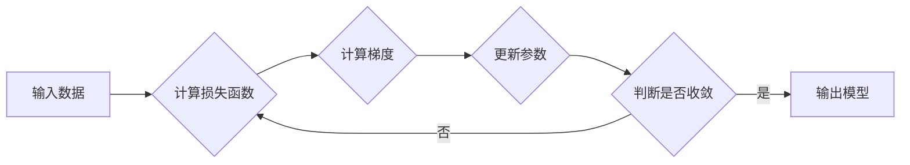

## 学习率Learning Rate原理与代码实例讲解

> 关键词：学习率、梯度下降、优化算法、深度学习、机器学习、代码实例、PyTorch

## 1. 背景介绍

在深度学习领域，模型的训练过程本质上是一个参数优化过程。目标是找到一组参数，使得模型在给定训练数据上表现最佳。而学习率作为深度学习训练中一个至关重要的超参数，直接影响着模型的收敛速度和最终性能。

学习率的本质是调整模型参数更新幅度的尺度。想象一下，我们正在爬一座山，目标是找到山顶（最优解）。梯度下降算法就像我们的指南针，指引我们沿着山坡向下走，而学习率则决定了我们每一步的步长。如果学习率过大，我们可能会越过山谷，无法找到最优解；如果学习率过小，我们可能会花费很长时间才能到达山顶。

因此，选择合适的学习率对于深度学习模型的训练至关重要。

## 2. 核心概念与联系

### 2.1 梯度下降

梯度下降算法是深度学习中常用的优化算法，其核心思想是通过不断迭代更新模型参数，使得模型的损失函数逐渐减小。

梯度下降算法的步骤如下：

1. 计算模型在当前参数下损失函数的梯度。
2. 根据梯度方向更新模型参数，参数更新量与学习率成正比。
3. 重复步骤1和步骤2，直到损失函数达到最小值。

### 2.2 学习率

学习率是梯度下降算法中的一个超参数，它控制着模型参数更新的幅度。学习率过大可能会导致模型震荡，无法收敛；学习率过小可能会导致训练过程过慢。

### 2.3 优化算法

除了梯度下降算法，还有许多其他的优化算法，例如：

* **动量法（Momentum）**：动量法通过引入动量项，使得参数更新更加平滑，可以加速训练过程。
* **自适应学习率算法（Adaptive Learning Rate Algorithms）**：例如Adam、RMSprop等算法，可以根据参数的梯度信息自适应地调整学习率，从而提高训练效率。

**Mermaid 流程图**



## 3. 核心算法原理 & 具体操作步骤

### 3.1 算法原理概述

梯度下降算法的核心原理是利用损失函数的梯度信息来更新模型参数，从而使得损失函数逐渐减小。

损失函数是用来衡量模型预测结果与真实结果之间的差距的函数。梯度下降算法的目标是找到一组参数，使得损失函数达到最小值。

梯度是指损失函数在当前参数处的变化率。梯度下降算法通过沿着梯度的负方向更新参数，从而使得损失函数逐渐减小。

### 3.2 算法步骤详解

1. **初始化模型参数**: 随机初始化模型参数。
2. **计算损失函数**: 使用训练数据计算模型在当前参数下损失函数的值。
3. **计算梯度**: 计算损失函数对每个参数的梯度。
4. **更新参数**: 根据梯度信息和学习率更新模型参数。
5. **重复步骤2-4**: 重复以上步骤，直到损失函数达到最小值或训练次数达到上限。

### 3.3 算法优缺点

**优点**:

* 算法简单易懂，易于实现。
* 能够找到全局最优解。

**缺点**:

* 训练速度较慢。
* 容易陷入局部最优解。

### 3.4 算法应用领域

梯度下降算法广泛应用于深度学习、机器学习等领域，例如：

* **图像分类**: 使用卷积神经网络对图像进行分类。
* **自然语言处理**: 使用循环神经网络对文本进行分析和生成。
* **推荐系统**: 使用协同过滤算法对用户进行推荐。

## 4. 数学模型和公式 & 详细讲解 & 举例说明

### 4.1 数学模型构建

假设模型参数为 $\theta$，损失函数为 $J(\theta)$，学习率为 $\alpha$。梯度下降算法的目标是找到一组参数 $\theta$，使得损失函数 $J(\theta)$ 达到最小值。

### 4.2 公式推导过程

梯度下降算法的更新公式为：

$$\theta = \theta - \alpha \nabla J(\theta)$$

其中，$\nabla J(\theta)$ 表示损失函数 $J(\theta)$ 对参数 $\theta$ 的梯度。

### 4.3 案例分析与讲解

假设我们有一个简单的线性回归模型，目标是预测房价。模型的损失函数为均方误差，即预测值与真实值之间的平方差的平均值。

损失函数的梯度为：

$$\nabla J(\theta) = \frac{2}{n} X^T (X\theta - y)$$

其中，$X$ 是特征矩阵，$y$ 是真实值向量，$n$ 是样本数量。

根据梯度下降算法的更新公式，我们可以更新模型参数 $\theta$：

$$\theta = \theta - \alpha \frac{2}{n} X^T (X\theta - y)$$

## 5. 项目实践：代码实例和详细解释说明

### 5.1 开发环境搭建

本项目使用 Python 语言和 PyTorch 深度学习框架进行开发。

**依赖库**:

```python
pip install torch torchvision
```

### 5.2 源代码详细实现

```python
import torch
import torch.nn as nn
import torch.optim as optim

# 定义一个简单的线性回归模型
class LinearRegression(nn.Module):
    def __init__(self, input_size, output_size):
        super(LinearRegression, self).__init__()
        self.linear = nn.Linear(input_size, output_size)

    def forward(self, x):
        return self.linear(x)

# 创建模型实例
model = LinearRegression(input_size=1, output_size=1)

# 定义损失函数和优化器
criterion = nn.MSELoss()
optimizer = optim.SGD(model.parameters(), lr=0.01)

# 训练数据
inputs = torch.tensor([[1.0], [2.0], [3.0], [4.0]])
targets = torch.tensor([[2.0], [4.0], [6.0], [8.0]])

# 训练模型
for epoch in range(100):
    # 前向传播
    outputs = model(inputs)
    loss = criterion(outputs, targets)

    # 反向传播
    optimizer.zero_grad()
    loss.backward()

    # 参数更新
    optimizer.step()

    if (epoch + 1) % 10 == 0:
        print(f'Epoch [{epoch+1}/{100}], Loss: {loss.item():.4f}')

# 测试模型
new_input = torch.tensor([[5.0]])
prediction = model(new_input)
print(f'Prediction for input 5.0: {prediction.item():.4f}')
```

### 5.3 代码解读与分析

1. **模型定义**: 我们定义了一个简单的线性回归模型，包含一个线性层。
2. **损失函数和优化器**: 我们使用均方误差作为损失函数，使用随机梯度下降算法作为优化器。
3. **训练数据**: 我们使用一些简单的训练数据进行模型训练。
4. **训练过程**: 我们使用一个循环迭代训练模型，每次迭代包括前向传播、反向传播和参数更新。
5. **测试模型**: 在训练完成后，我们使用新的输入数据进行模型测试。

### 5.4 运行结果展示

运行以上代码，将会输出训练过程中的损失值，以及对新输入数据的预测结果。

## 6. 实际应用场景

学习率在深度学习模型训练中有着广泛的应用场景，例如：

* **图像分类**: 在训练卷积神经网络进行图像分类时，学习率的选择会直接影响模型的准确率和训练速度。
* **自然语言处理**: 在训练循环神经网络进行文本生成或机器翻译时，学习率的选择也会影响模型的性能。
* **推荐系统**: 在训练协同过滤算法进行用户推荐时，学习率的选择也会影响推荐系统的准确性和效率。

### 6.4 未来应用展望

随着深度学习技术的不断发展，学习率的研究和应用将会更加深入。未来，我们可能会看到：

* **更加智能的学习率调整策略**: 例如，根据模型的训练进度和损失函数的变化自动调整学习率。
* **针对不同模型和任务的个性化学习率**: 例如，对于一些复杂的模型，可能需要使用更加复杂的学习率调整策略。
* **学习率作为模型调参的重要指标**: 学习率的选择将会成为模型调参的重要指标之一，需要更加重视和研究。

## 7. 工具和资源推荐

### 7.1 学习资源推荐

* **深度学习书籍**:
    * 《深度学习》 by Ian Goodfellow, Yoshua Bengio, and Aaron Courville
    * 《动手学深度学习》 by Aurélien Géron
* **在线课程**:
    * Coursera: Deep Learning Specialization
    * Udacity: Deep Learning Nanodegree
* **博客和论坛**:
    * https://blog.openai.com/
    * https://discuss.pytorch.org/

### 7.2 开发工具推荐

* **深度学习框架**:
    * PyTorch
    * TensorFlow
* **编程语言**:
    * Python
* **数据处理工具**:
    * Pandas
    * NumPy

### 7.3 相关论文推荐

* **《Stochastic Gradient Descent》 by Robbins and Monro (1951)**
* **《Momentum Methods》 by Polyak (1964)**
* **《Adam: A Method for Stochastic Optimization》 by Kingma and Ba (2014)**

## 8. 总结：未来发展趋势与挑战

### 8.1 研究成果总结

学习率作为深度学习训练中的一个关键超参数，其研究已经取得了显著成果。从传统的梯度下降算法到更加智能的自适应学习率算法，我们已经开发出许多有效的学习率调整策略。

### 8.2 未来发展趋势

未来，学习率的研究将会更加深入，主要发展趋势包括：

* **更加智能的学习率调整策略**: 例如，基于模型架构、训练数据和任务类型的个性化学习率调整策略。
* **学习率的自动化优化**: 例如，使用强化学习等方法自动搜索最佳的学习率。
* **学习率的理论分析**: 例如，深入研究学习率对模型训练性能的影响机制。

### 8.3 面临的挑战

学习率的研究也面临着一些挑战，例如：

* **学习率的复杂性**: 学习率是一个多维度的超参数，其选择需要考虑多种因素，因此很难找到一个通用的最佳学习率。
* **数据依赖性**: 学习率的最佳值可能依赖于训练数据的具体情况，因此需要针对不同的数据集进行调整。
* **理论解释的不足**: 目前对学习率影响机制的理论解释还比较不足，需要进一步的研究。

### 8.4 研究展望

尽管面临着挑战，但学习率的研究仍然是一个非常重要的方向。随着深度学习技术的不断发展，学习率的研究将会更加深入，为深度学习模型的训练提供更加有效的策略和方法。

## 9. 附录：常见问题与解答

**1. 如何选择合适的学习率？**

没有一个通用的最佳学习率，需要根据具体的模型、数据集和任务类型进行调整。通常可以使用一些经验法则，例如：

* **开始使用一个较小的学习率，例如 0.01 或 0.001。**
* **根据训练过程中的损失函数变化情况，逐渐调整学习率。**
* **可以使用学习率衰减策略，随着训练的进行，逐渐降低学习率。