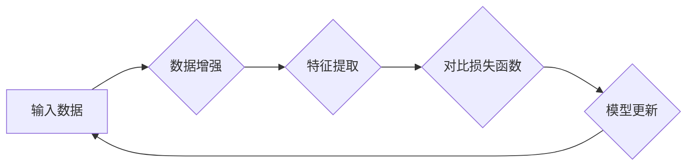

## 对比学习 原理与代码实例讲解

> 关键词：对比学习、自监督学习、无监督学习、特征学习、信息论、SimCLR、MoCo

## 1. 背景介绍

在深度学习领域，监督学习一直是主流方法，但其依赖于大规模标注数据，这在许多实际应用场景中难以实现。自监督学习作为一种无需人工标注数据的新兴方法，逐渐受到关注。其中，对比学习作为自监督学习的重要分支，通过学习数据之间的相似性和差异性来进行特征学习，取得了显著的成果。

对比学习的核心思想是：将数据样本映射到一个特征空间中，使得相似的样本在该空间中距离较近，而不同的样本距离较远。通过最小化相似样本之间的距离，最大化不同样本之间的距离，模型可以学习到更有效的特征表示。

## 2. 核心概念与联系

### 2.1  核心概念

* **对比学习 (Contrastive Learning):**  一种自监督学习方法，通过学习数据样本之间的相似性和差异性来进行特征学习。
* **特征空间 (Feature Space):**  将数据映射到一个低维空间，其中样本之间的关系可以被更好地表示。
* **相似样本 (Similar Samples):**  具有相同或相似的语义内容的样本。
* **不同样本 (Dissimilar Samples):**  具有不同语义内容的样本。

### 2.2  联系

对比学习的核心是利用数据本身的结构信息进行特征学习。通过构建一个特征空间，使得相似样本在该空间中距离较近，不同样本距离较远，模型可以学习到更有效的特征表示。

**Mermaid 流程图**



## 3. 核心算法原理 & 具体操作步骤

### 3.1  算法原理概述

对比学习算法的基本原理是通过对比相似样本和不同样本之间的距离来进行特征学习。

1. **数据增强:** 对输入数据进行随机增强，例如旋转、翻转、裁剪等，生成多个增强后的样本。
2. **特征提取:** 将增强后的样本输入到一个神经网络中，提取其特征表示。
3. **对比损失函数:** 计算特征表示之间的相似度或距离，并使用对比损失函数来最小化相似样本之间的距离，最大化不同样本之间的距离。
4. **模型更新:** 根据对比损失函数的梯度，更新神经网络的参数。

### 3.2  算法步骤详解

1. **数据准备:** 收集大量未标记的数据，并进行预处理，例如数据清洗、归一化等。
2. **数据增强:** 对数据进行随机增强，生成多个增强后的样本对。
3. **特征提取:** 将增强后的样本对输入到一个预训练的编码器网络中，提取其特征表示。
4. **对比损失函数:** 使用对比损失函数来衡量特征表示之间的相似度或距离。常见的对比损失函数包括：
    * **SimCLR损失函数:** 使用交叉熵损失函数来计算特征表示之间的相似度。
    * **MoCo损失函数:** 使用对比学习目标函数来最大化相似样本之间的相似度，最小化不同样本之间的相似度。
5. **模型训练:** 使用对比损失函数的梯度，更新编码器网络的参数。
6. **特征提取:** 将新的数据输入到训练好的编码器网络中，提取其特征表示。

### 3.3  算法优缺点

**优点:**

* 不需要人工标注数据，可以利用海量未标记数据进行训练。
* 可以学习到更有效的特征表示，提升下游任务的性能。
* 适用于各种类型的数据，例如图像、文本、音频等。

**缺点:**

* 需要大量的计算资源进行训练。
* 对数据增强策略的选择较为敏感。
* 训练过程较为复杂，需要一定的经验和技巧。

### 3.4  算法应用领域

对比学习算法在以下领域取得了成功应用：

* **图像识别:**  用于图像分类、目标检测、图像分割等任务。
* **自然语言处理:**  用于文本分类、情感分析、机器翻译等任务。
* **语音识别:**  用于语音识别、语音合成等任务。
* **推荐系统:**  用于用户行为预测、商品推荐等任务。

## 4. 数学模型和公式 & 详细讲解 & 举例说明

### 4.1  数学模型构建

对比学习的目标是学习一个映射函数 $f$，将数据样本 $x$ 映射到一个特征空间 $Z$ 中，使得相似样本的特征表示距离较近，不同样本的特征表示距离较远。

数学模型可以表示为：

$$
z = f(x)
$$

其中，$z$ 是样本 $x$ 在特征空间 $Z$ 中的表示。

### 4.2  公式推导过程

常用的对比损失函数包括 SimCLR 损失函数和 MoCo 损失函数。

**SimCLR 损失函数:**

$$
L_{SimCLR} = -\frac{1}{N} \sum_{i=1}^{N} \log \frac{\exp(sim(z_i, z_i^+))}{\sum_{j=1}^{N} \exp(sim(z_i, z_j))}
$$

其中，$z_i$ 是样本 $x_i$ 的特征表示，$z_i^+$ 是样本 $x_i$ 的增强后的样本的特征表示，$sim$ 是相似度函数，例如余弦相似度。

**MoCo 损失函数:**

$$
L_{MoCo} = -\frac{1}{N} \sum_{i=1}^{N} \log \frac{\exp(sim(z_i, z_i^+))}{\sum_{j=1}^{N} \exp(sim(z_i, z_j))}
$$

其中，$z_i$ 是样本 $x_i$ 的特征表示，$z_i^+$ 是一个动量更新后的特征表示，$sim$ 是相似度函数。

### 4.3  案例分析与讲解

**SimCLR 损失函数:**

假设我们有两个样本 $x_1$ 和 $x_2$，它们是相似的，并且经过数据增强后分别得到 $x_1^+$ 和 $x_2^+$。

SimCLR 损失函数的目标是使得 $z_1$ 和 $z_1^+$ 的相似度最大，同时使得 $z_1$ 和 $z_2$ 的相似度最小。

**MoCo 损失函数:**

MoCo 损失函数与 SimCLR 损失函数类似，但它使用了一个动量更新机制来更新特征表示 $z_i^+$。

动量更新机制可以帮助模型学习到更稳定的特征表示，并提高模型的泛化能力。

## 5. 项目实践：代码实例和详细解释说明

### 5.1  开发环境搭建

* Python 3.7+
* PyTorch 1.7+
* CUDA 10.2+

### 5.2  源代码详细实现

```python
import torch
import torch.nn as nn
import torchvision.transforms as transforms

# 定义编码器网络
class Encoder(nn.Module):
    def __init__(self):
        super(Encoder, self).__init__()
        #...

    def forward(self, x):
        #...

# 定义对比损失函数
class ContrastiveLoss(nn.Module):
    def __init__(self, temperature=0.1):
        super(ContrastiveLoss, self).__init__()
        self.temperature = temperature

    def forward(self, z1, z2):
        #...

# 定义训练模型
class ContrastiveModel(nn.Module):
    def __init__(self):
        super(ContrastiveModel, self).__init__()
        self.encoder = Encoder()
        self.loss_fn = ContrastiveLoss()

    def forward(self, x1, x2):
        #...

# 实例化模型
model = ContrastiveModel()

# 定义优化器
optimizer = torch.optim.Adam(model.parameters(), lr=0.001)

# 定义训练数据加载器
train_loader = torch.utils.data.DataLoader(
    dataset, batch_size=64, shuffle=True
)

# 训练模型
for epoch in range(num_epochs):
    for batch_idx, (data1, data2) in enumerate(train_loader):
        #...
```

### 5.3  代码解读与分析

* **编码器网络:** 负责提取数据特征。
* **对比损失函数:** 计算特征表示之间的相似度或距离。
* **训练模型:** 将编码器网络和对比损失函数组合在一起，进行模型训练。
* **优化器:** 用于更新模型参数。
* **训练数据加载器:** 用于加载和处理训练数据。

### 5.4  运行结果展示

训练完成后，可以将模型应用于下游任务，例如图像分类、目标检测等。

## 6. 实际应用场景

### 6.1  图像分类

对比学习可以用于训练图像分类模型，即使没有大量标注数据。

### 6.2  目标检测

对比学习可以用于训练目标检测模型，提高目标检测的准确率和效率。

### 6.3  图像分割

对比学习可以用于训练图像分割模型，分割图像中的不同区域。

### 6.4  未来应用展望

对比学习在未来将有更广泛的应用，例如：

* **视频分析:** 用于视频分类、动作识别、视频摘要等任务。
* **自然语言处理:** 用于文本分类、情感分析、机器翻译等任务。
* **推荐系统:** 用于用户行为预测、商品推荐等任务。

## 7. 工具和资源推荐

### 7.1  学习资源推荐

* **论文:**
    * SimCLR: A Simple Framework for Contrastive Learning of Visual Representations
    * MoCo: Momentum Contrast for Self-Supervised Learning of Visual Representations
* **博客:**
    * https://blog.openai.com/self-supervised-learning/
    * https://towardsdatascience.com/self-supervised-learning-with-contrastive-learning-a-comprehensive-guide-a3992199419c

### 7.2  开发工具推荐

* **PyTorch:** https://pytorch.org/
* **TensorFlow:** https://www.tensorflow.org/

### 7.3  相关论文推荐

* **SimCLR:** https://arxiv.org/abs/2002.05709
* **MoCo:** https://arxiv.org/abs/1911.05722
* **BYOL:** https://arxiv.org/abs/2006.07733

## 8. 总结：未来发展趋势与挑战

### 8.1  研究成果总结

对比学习在自监督学习领域取得了显著的成果，能够有效地学习到高质量的特征表示，并提升下游任务的性能。

### 8.2  未来发展趋势

* **更有效的对比损失函数:** 研究更有效的对比损失函数，例如基于信息论的损失函数、基于对抗学习的损失函数等。
* **多模态对比学习:** 将对比学习应用于多模态数据，例如图像、文本、音频等。
* **迁移学习:** 利用对比学习学习到的特征表示进行迁移学习，提升模型在不同任务上的泛化能力。

### 8.3  面临的挑战

* **数据增强策略:** 找到更有效的图像增强策略，避免过度增强导致特征信息丢失。
* **模型复杂度:** 降低模型复杂度，提高模型训练效率。
* **理论解释:** 深入研究对比学习的理论基础，更好地理解其工作机制。

### 8.4  研究展望

对比学习是一个充满潜力的研究方向，未来将会有更多新的研究成果和应用场景。


## 9. 附录：常见问题与解答

### 9.1  Q1: 对比学习和监督学习有什么区别？

**A1:** 对比学习是一种自监督学习方法，不需要人工标注数据，而监督学习需要人工