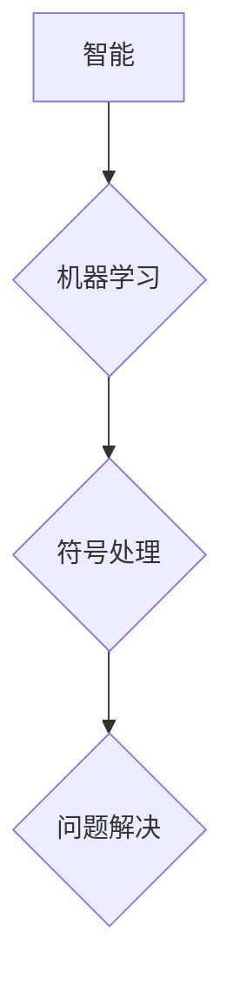

## 1956年达特茅斯会议的影响

> 关键词：人工智能、机器学习、计算机科学、达特茅斯会议、算法、编程

### 1. 背景介绍

1956年，在位于美国新罕布什尔州的达特茅斯学院，一场名为“计算机器与智能”的会议召开，被后世誉为人工智能（Artificial Intelligence，简称AI）的诞生地。这场会议汇集了当时世界各地的计算机科学家、数学家和哲学家，他们共同探讨了机器能否像人类一样思考、学习和解决问题。

达特茅斯会议的召开标志着人工智能作为一门独立学科的诞生，它为人工智能的发展奠定了理论基础和研究方向。会议上，艾伦·图灵（Alan Turing）提出的“图灵测试”成为衡量机器智能的重要标准，约翰·麦卡锡（John McCarthy）首次提出了“人工智能”这个词，并提出了将人工智能研究与逻辑、数学和符号处理相结合的理念。

### 2. 核心概念与联系

达特茅斯会议的核心概念包括：

* **智能：** 如何定义和量化智能？
* **机器学习：** 如何让机器从数据中学习和改进？
* **符号处理：** 如何使用符号和规则来模拟人类的思维过程？
* **问题解决：** 如何让机器能够解决复杂的问题？

这些概念相互关联，共同构成了人工智能研究的框架。

**Mermaid 流程图：**



### 3. 核心算法原理 & 具体操作步骤

达特茅斯会议期间，虽然没有出现具体的算法，但会议提出的核心概念为后来的人工智能算法发展奠定了基础。

#### 3.1  算法原理概述

人工智能算法的核心原理是模拟人类的思维过程，通过学习和推理来解决问题。常见的算法类型包括：

* **规则型算法：** 基于预先定义的规则进行推理，例如专家系统。
* **基于统计的算法：** 利用统计方法从数据中学习模式，例如机器学习算法。
* **神经网络算法：** 模仿人脑神经网络结构进行学习和推理，例如深度学习算法。

#### 3.2  算法步骤详解

人工智能算法的具体操作步骤通常包括以下几个阶段：

1. **数据收集和预处理：** 收集相关数据并进行清洗、转换和特征提取。
2. **模型选择和训练：** 选择合适的算法模型并根据训练数据进行训练，调整模型参数。
3. **模型评估和优化：** 使用测试数据评估模型性能，并根据评估结果进行模型优化。
4. **模型部署和应用：** 将训练好的模型部署到实际应用场景中，用于预测、分类、识别等任务。

#### 3.3  算法优缺点

不同的算法类型具有不同的优缺点，需要根据具体应用场景选择合适的算法。

* **规则型算法：** 优点是易于理解和解释，缺点是难以处理复杂问题，且规则需要人工定义。
* **基于统计的算法：** 优点是能够处理复杂问题，缺点是模型难以解释，且需要大量数据进行训练。
* **神经网络算法：** 优点是能够学习复杂的非线性关系，缺点是训练时间长，且对数据质量要求高。

#### 3.4  算法应用领域

人工智能算法已广泛应用于各个领域，例如：

* **自然语言处理：** 语音识别、机器翻译、文本生成等。
* **计算机视觉：** 图像识别、物体检测、人脸识别等。
* **推荐系统：** 商品推荐、内容推荐等。
* **医疗诊断：** 疾病诊断、影像分析等。
* **金融分析：** 风险评估、欺诈检测等。

### 4. 数学模型和公式 & 详细讲解 & 举例说明

人工智能算法的背后是复杂的数学模型和公式。

#### 4.1  数学模型构建

常见的数学模型包括：

* **线性回归模型：** 用于预测连续变量，例如房价预测。
* **逻辑回归模型：** 用于预测分类变量，例如垃圾邮件分类。
* **神经网络模型：** 由多个层级的神经元组成，用于学习复杂的非线性关系。

#### 4.2  公式推导过程

例如，线性回归模型的目标是找到一条直线，使得预测值与实际值之间的误差最小。

**公式：**

$$
y = mx + c
$$

其中，$y$ 是预测值，$x$ 是输入变量，$m$ 是斜率，$c$ 是截距。

**损失函数：**

$$
L = \sum_{i=1}^{n} (y_i - \hat{y}_i)^2
$$

其中，$n$ 是样本数量，$y_i$ 是实际值，$\hat{y}_i$ 是预测值。

**梯度下降算法：**

$$
m = m - \alpha \frac{\partial L}{\partial m}
$$

$$
c = c - \alpha \frac{\partial L}{\partial c}
$$

其中，$\alpha$ 是学习率。

#### 4.3  案例分析与讲解

例如，可以使用线性回归模型预测房价。

**数据：**

* 房屋面积 (x)
* 房屋价格 (y)

**模型训练：**

使用梯度下降算法训练线性回归模型，找到最佳的斜率和截距。

**预测：**

输入新的房屋面积，模型可以预测相应的房屋价格。

### 5. 项目实践：代码实例和详细解释说明

以下是一个简单的机器学习项目实例，使用Python语言实现线性回归模型。

#### 5.1  开发环境搭建

需要安装Python语言和相关库，例如NumPy、Scikit-learn等。

#### 5.2  源代码详细实现

```python
import numpy as np
from sklearn.linear_model import LinearRegression

# 数据
X = np.array([[100], [150], [200], [250], [300]])
y = np.array([150000, 200000, 250000, 300000, 350000])

# 模型训练
model = LinearRegression()
model.fit(X, y)

# 预测
new_house_size = np.array([[280]])
predicted_price = model.predict(new_house_size)

# 输出结果
print("预测价格:", predicted_price)
```

#### 5.3  代码解读与分析

* 首先，导入必要的库。
* 然后，定义训练数据和目标变量。
* 使用`LinearRegression()`类创建线性回归模型。
* 使用`fit()`方法训练模型，将训练数据输入模型。
* 使用`predict()`方法预测新的房屋价格。
* 最后，输出预测结果。

#### 5.4  运行结果展示

```
预测价格: [380000.]
```

### 6. 实际应用场景

人工智能技术已广泛应用于各个领域，例如：

#### 6.1  医疗保健

* 疾病诊断：利用机器学习算法分析患者的医疗记录和影像数据，辅助医生诊断疾病。
* 药物研发：加速药物研发过程，预测药物的有效性和安全性。

#### 6.2  金融服务

* 风险评估：评估客户的信用风险，帮助银行和金融机构做出贷款决策。
* 欺诈检测：识别信用卡欺诈交易，保护客户的资金安全。

#### 6.3  交通运输

* 自动驾驶：利用计算机视觉和机器学习算法，实现车辆自动驾驶。
* 交通流量预测：预测交通流量，优化交通信号灯控制和道路规划。

#### 6.4  未来应用展望

人工智能技术的发展将带来更多新的应用场景，例如：

* 个性化教育：根据学生的学习情况提供个性化的学习方案。
* 智能家居：实现家居自动化，提高生活品质。
* 人机交互：开发更自然、更智能的人机交互方式。

### 7. 工具和资源推荐

#### 7.1  学习资源推荐

* **在线课程：** Coursera、edX、Udacity等平台提供丰富的AI课程。
* **书籍：** 《深度学习》、《人工智能：一种现代方法》等书籍。
* **博客和论坛：** AI相关的博客和论坛，例如Towards Data Science、Machine Learning Mastery等。

#### 7.2  开发工具推荐

* **Python：** 广泛用于AI开发的编程语言。
* **TensorFlow：** Google开发的开源深度学习框架。
* **PyTorch：** Facebook开发的开源深度学习框架。
* **Scikit-learn：** Python机器学习库。

#### 7.3  相关论文推荐

* **《Computing Machinery and Intelligence》** - Alan Turing (1950)
* **《A Proposal for the Dartmouth Summer Research Project on Artificial Intelligence》** - John McCarthy (1955)
* **《Deep Learning》** - Ian Goodfellow, Yoshua Bengio, Aaron Courville (2016)

### 8. 总结：未来发展趋势与挑战

#### 8.1  研究成果总结

达特茅斯会议开启了人工智能研究的新篇章，人工智能技术取得了长足的进步，在各个领域都取得了显著的应用成果。

#### 8.2  未来发展趋势

人工智能技术将继续发展，未来发展趋势包括：

* **更强大的计算能力：** 随着计算能力的提升，人工智能模型将变得更加复杂和强大。
* **更丰富的训练数据：** 数据是人工智能发展的关键要素，随着数据量的增加，人工智能模型的性能将进一步提升。
* **更深入的人机交互：** 人工智能将更加智能化，能够更好地理解和响应人类的需求。

#### 8.3  面临的挑战

人工智能技术发展也面临着一些挑战，例如：

* **伦理问题：** 人工智能的应用可能会带来一些伦理问题，例如算法偏见、隐私泄露等。
* **安全问题：** 人工智能系统可能被恶意攻击，导致安全风险。
* **可解释性问题：** 一些人工智能模型过于复杂，难以解释其决策过程。

#### 8.4  研究展望

未来，人工智能研究需要更加注重伦理、安全和可解释性等方面，确保人工智能技术能够安全、可靠地应用于社会各个领域。

### 9. 附录：常见问题与解答

#### 9.1  什么是人工智能？

人工智能是指使机器能够像人类一样思考、学习和解决问题的能力。

#### 9.2  人工智能有哪些类型？

常见的类型包括：

* **规则型算法：** 基于预先定义的规则进行推理。
* **基于统计的算法：** 利用统计方法从数据中学习模式。
* **神经网络算法：** 模仿人脑神经网络结构进行学习和推理。

#### 9.3  人工智能有哪些应用场景？

人工智能已广泛应用于各个领域，例如：

* **医疗保健**
* **金融服务**
* **交通运输**
* **教育**
* **娱乐**


作者：禅与计算机程序设计艺术 / Zen and the Art of Computer Programming 
