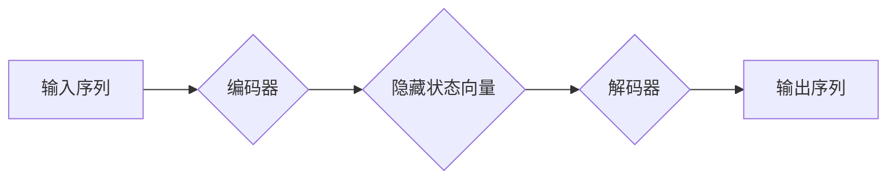

## 关键词：序列到序列模型，Seq2Seq，编码器-解码器，自然语言处理，机器翻译，文本摘要

## 1. 背景介绍

在深度学习领域，序列到序列模型（Seq2Seq）是一种强大的框架，用于处理输入序列与输出序列之间的映射关系。它广泛应用于自然语言处理 (NLP) 领域，例如机器翻译、文本摘要、对话系统等。

传统的机器学习方法难以处理序列数据，因为它们无法捕获序列中的长依赖关系。Seq2Seq 模型通过引入编码器-解码器结构，有效地解决了这个问题。编码器负责将输入序列编码成一个固定长度的向量表示，解码器则根据编码后的向量生成输出序列。

## 2. 核心概念与联系

Seq2Seq 模型的核心概念是编码器和解码器。

**编码器**：负责将输入序列映射到一个固定长度的隐藏状态向量。它通常由多层循环神经网络 (RNN) 或卷积神经网络 (CNN) 组成。

**解码器**：负责根据编码后的隐藏状态向量生成输出序列。它也通常由多层 RNN 或 CNN 组成，并使用注意力机制来关注输入序列中的相关部分。

**Mermaid 流程图**



## 3. 核心算法原理 & 具体操作步骤

### 3.1  算法原理概述

Seq2Seq 模型的基本原理是将输入序列编码成一个固定长度的向量表示，然后使用这个向量表示生成输出序列。

编码器通过循环神经网络或卷积神经网络逐个处理输入序列中的元素，并将其映射到一个隐藏状态向量。解码器则根据这个隐藏状态向量，逐个生成输出序列的元素。

### 3.2  算法步骤详解

1. **输入序列预处理**: 将输入序列转换为数字表示，例如使用词嵌入技术将单词映射到向量空间。

2. **编码**: 使用编码器对输入序列进行编码，生成一个隐藏状态向量。

3. **解码**: 使用解码器根据隐藏状态向量生成输出序列。

4. **输出序列后处理**: 将生成的输出序列转换为人类可读的形式，例如将数字表示转换为单词。

### 3.3  算法优缺点

**优点**:

* 可以处理任意长度的输入和输出序列。
* 可以捕获序列中的长依赖关系。
* 在机器翻译、文本摘要等任务中取得了优异的性能。

**缺点**:

* 训练时间较长。
* 容易出现“消失梯度”问题。
* 对于长序列数据，性能可能下降。

### 3.4  算法应用领域

Seq2Seq 模型广泛应用于以下领域:

* **机器翻译**: 将一种语言的文本翻译成另一种语言。
* **文本摘要**: 将长文本压缩成短文本摘要。
* **对话系统**: 创建能够与人类进行自然对话的系统。
* **问答系统**: 回答用户提出的问题。
* **语音识别**: 将语音信号转换为文本。

## 4. 数学模型和公式 & 详细讲解 & 举例说明

### 4.1  数学模型构建

Seq2Seq 模型的数学模型可以概括为以下公式:

* **编码器**:  $h_t = f(x_t, h_{t-1})$
* **解码器**: $y_t = g(h_t, y_{t-1})$

其中:

* $x_t$ 是输入序列的第 $t$ 个元素。
* $h_t$ 是编码器在第 $t$ 个时间步生成的隐藏状态向量。
* $y_t$ 是解码器在第 $t$ 个时间步生成的输出序列的第 $t$ 个元素。
* $f$ 和 $g$ 分别是编码器和解码器的激活函数。

### 4.2  公式推导过程

编码器和解码器的具体实现方式有很多种，例如使用循环神经网络 (RNN) 或卷积神经网络 (CNN)。

**循环神经网络 (RNN)**

RNN 的核心思想是利用隐藏状态来存储序列信息。在每个时间步，RNN 会根据当前输入元素和上一个时间步的隐藏状态生成新的隐藏状态。

**卷积神经网络 (CNN)**

CNN 可以捕获输入序列中的局部特征。在 Seq2Seq 模型中，CNN 可以用于编码器和解码器，以提取输入序列和隐藏状态向量中的特征。

### 4.3  案例分析与讲解

**机器翻译**

Seq2Seq 模型可以用于机器翻译任务。

* 输入序列: 英文句子
* 输出序列: 法文句子

编码器将英文句子编码成一个隐藏状态向量，解码器根据这个向量生成法文句子。

**文本摘要**

Seq2Seq 模型可以用于文本摘要任务。

* 输入序列: 长文本
* 输出序列: 短文本摘要

编码器将长文本编码成一个隐藏状态向量，解码器根据这个向量生成短文本摘要。

## 5. 项目实践：代码实例和详细解释说明

### 5.1  开发环境搭建

* Python 3.6+
* TensorFlow 或 PyTorch

### 5.2  源代码详细实现

```python
import tensorflow as tf

# 定义编码器模型
class Encoder(tf.keras.Model):
    def __init__(self, vocab_size, embedding_dim, hidden_dim):
        super(Encoder, self).__init__()
        self.embedding = tf.keras.layers.Embedding(vocab_size, embedding_dim)
        self.rnn = tf.keras.layers.LSTM(hidden_dim)

    def call(self, inputs):
        embedded = self.embedding(inputs)
        output, state = self.rnn(embedded)
        return output, state

# 定义解码器模型
class Decoder(tf.keras.Model):
    def __init__(self, vocab_size, embedding_dim, hidden_dim):
        super(Decoder, self).__init__()
        self.embedding = tf.keras.layers.Embedding(vocab_size, embedding_dim)
        self.rnn = tf.keras.layers.LSTM(hidden_dim)
        self.dense = tf.keras.layers.Dense(vocab_size)

    def call(self, inputs, state):
        embedded = self.embedding(inputs)
        output, state = self.rnn(embedded, initial_state=state)
        output = self.dense(output)
        return output, state

# 创建编码器和解码器模型
encoder = Encoder(vocab_size=10000, embedding_dim=128, hidden_dim=256)
decoder = Decoder(vocab_size=10000, embedding_dim=128, hidden_dim=256)

# 训练模型
#...

```

### 5.3  代码解读与分析

* **编码器**: 
    * 使用 Embedding 层将单词映射到向量空间。
    * 使用 LSTM 层对输入序列进行编码，生成隐藏状态向量。
* **解码器**: 
    * 使用 Embedding 层将单词映射到向量空间。
    * 使用 LSTM 层根据隐藏状态向量和上一个时间步的输出生成下一个输出单词。
    * 使用 Dense 层将 LSTM 输出映射到词汇表大小的向量，用于预测下一个单词。

### 5.4  运行结果展示

训练完成后，可以将模型应用于机器翻译、文本摘要等任务。

## 6. 实际应用场景

Seq2Seq 模型在许多实际应用场景中取得了成功。

* **机器翻译**: Google Translate、DeepL 等机器翻译系统都使用了 Seq2Seq 模型。
* **文本摘要**: BART、T5 等文本摘要模型都使用了 Seq2Seq 架构。
* **对话系统**: Seq2Seq 模型可以用于构建能够进行自然对话的聊天机器人。

### 6.4  未来应用展望

Seq2Seq 模型在未来将继续在以下领域得到应用:

* **代码生成**: 使用 Seq2Seq 模型生成代码。
* **药物发现**: 使用 Seq2Seq 模型预测药物的活性。
* **个性化教育**: 使用 Seq2Seq 模型为学生提供个性化的学习内容。

## 7. 工具和资源推荐

### 7.1  学习资源推荐

* **书籍**:
    * "Deep Learning" by Ian Goodfellow, Yoshua Bengio, and Aaron Courville
    * "Speech and Language Processing" by Daniel Jurafsky and James H. Martin
* **在线课程**:
    * Coursera: "Natural Language Processing Specialization"
    * Udacity: "Deep Learning Nanodegree"

### 7.2  开发工具推荐

* **TensorFlow**: https://www.tensorflow.org/
* **PyTorch**: https://pytorch.org/

### 7.3  相关论文推荐

* "Sequence to Sequence Learning with Neural Networks" by Sutskever et al. (2014)
* "Attention Is All You Need" by Vaswani et al. (2017)

## 8. 总结：未来发展趋势与挑战

### 8.1  研究成果总结

Seq2Seq 模型在自然语言处理领域取得了显著的成果，例如机器翻译、文本摘要、对话系统等任务取得了人类水平的性能。

### 8.2  未来发展趋势

* **更强大的模型**: 研究更强大的 Seq2Seq 模型，例如 Transformer 和其变体，以提高模型的性能和效率。
* **更好的训练方法**: 研究更有效的训练方法，例如自监督学习和迁移学习，以降低模型的训练成本和提高模型的泛化能力。
* **新的应用场景**: 将 Seq2Seq 模型应用于更多新的领域，例如代码生成、药物发现、个性化教育等。

### 8.3  面临的挑战

* **长序列数据处理**: Seq2Seq 模型在处理长序列数据时性能下降的问题。
* **训练数据不足**: 许多任务缺乏足够的训练数据，这限制了模型的性能。
* **可解释性**: Seq2Seq 模型的决策过程难以解释，这限制了模型的应用。

### 8.4  研究展望

未来研究将集中在解决上述挑战，例如开发新的模型架构、训练方法和评估指标，以提高 Seq2Seq 模型的性能、效率和可解释性。

## 9. 附录：常见问题与解答

* **Seq2Seq 模型与 RNN 模型有什么区别？**

Seq2Seq 模型是一种更高级的 RNN 模型，它使用编码器-解码器结构来处理序列到序列的任务。

* **Seq2Seq 模型如何处理长序列数据？**

使用注意力机制可以帮助 Seq2Seq 模型处理长序列数据。注意力机制允许模型关注输入序列中的相关部分，从而减少长依赖关系的影响。

* **Seq2Seq 模型的训练过程如何？**

Seq2Seq 模型的训练过程类似于其他神经网络模型，使用反向传播算法优化模型参数。

* **Seq2Seq 模型有哪些应用场景？**

Seq2Seq 模型广泛应用于机器翻译、文本摘要、对话系统等任务。


作者：禅与计算机程序设计艺术 / Zen and the Art of Computer Programming 
