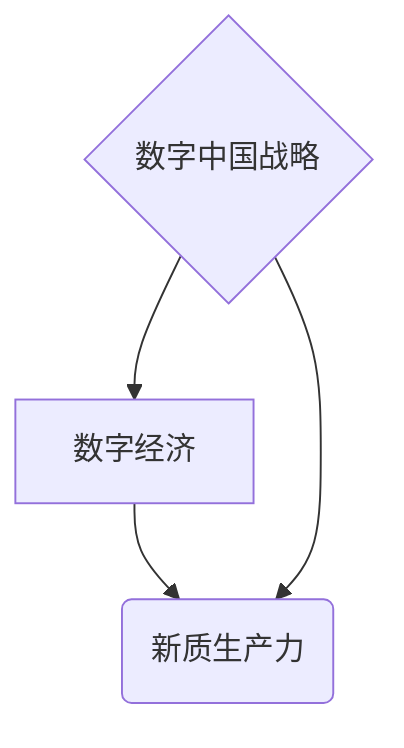

## 数字中国战略与新质生产力

> 关键词：数字经济、新质生产力、数据驱动、人工智能、云计算、区块链、数字孪生

### 1. 背景介绍

21世纪初，以互联网、移动互联网、大数据、人工智能等为代表的新一代信息技术蓬勃发展，深刻地改变着人类社会生产方式和生活方式。中国政府于2021年发布了《数字中国建设整体方案》，明确提出要以数字技术为驱动，构建数字经济新格局，推动经济社会高质量发展。

数字中国战略的提出，标志着中国迈入数字经济时代的新阶段。数字经济以数据为核心要素，以信息技术为基础，以网络为平台，以智能化和数字化为特征，其发展将深刻地影响中国经济的结构、动力和效率。

### 2. 核心概念与联系

**2.1 数字经济**

数字经济是指以数字技术为基础，以数据为核心要素，以网络为平台，以智能化和数字化为特征的经济活动。其涵盖范围广泛，包括电子商务、数字内容、互联网金融、人工智能、云计算等领域。

**2.2 新质生产力**

新质生产力是指以数字技术为基础，以数据驱动、智能化、网络化、平台化等为特征的生产力。它打破了传统生产方式的局限性，提高了生产效率、降低了生产成本，推动了经济社会高质量发展。

**2.3 数字中国战略与新质生产力**

数字中国战略旨在通过构建数字基础设施、发展数字产业、提升数字应用水平，推动数字经济发展，从而释放新质生产力的潜力。

**2.4 核心概念关系图**



### 3. 核心算法原理 & 具体操作步骤

**3.1 算法原理概述**

数字中国战略的实施离不开一系列先进算法的支持。其中，机器学习、深度学习、自然语言处理等算法在数据分析、智能决策、个性化服务等方面发挥着关键作用。

**3.2 算法步骤详解**

以机器学习为例，其核心步骤包括：

1. 数据收集和预处理：收集相关数据，并进行清洗、转换、特征提取等预处理工作。
2. 模型选择：根据具体任务选择合适的机器学习模型，例如线性回归、逻辑回归、决策树、支持向量机等。
3. 模型训练：利用训练数据训练模型参数，使模型能够学习数据中的规律。
4. 模型评估：利用测试数据评估模型的性能，例如准确率、召回率、F1-score等。
5. 模型部署：将训练好的模型部署到实际应用场景中，用于预测、分类、聚类等任务。

**3.3 算法优缺点**

**优点：**

* 自动化学习：无需人工编程，能够自动从数据中学习规律。
* 高精度：在某些任务上，机器学习算法能够达到甚至超过人类的精度。
* 可扩展性强：能够处理海量数据，并随着数据量的增加而提高精度。

**缺点：**

* 数据依赖性强：算法性能受数据质量和数量的影响较大。
* 黑盒效应：模型内部决策机制难以解释，缺乏透明度。
* 容易过拟合：模型过分拟合训练数据，导致在测试数据上性能下降。

**3.4 算法应用领域**

机器学习算法广泛应用于各个领域，例如：

* **金融领域：**信用风险评估、欺诈检测、投资预测
* **医疗领域：**疾病诊断、药物研发、个性化医疗
* **电商领域：**商品推荐、用户画像、精准营销
* **交通领域：**智能驾驶、交通流量预测、物流优化

### 4. 数学模型和公式 & 详细讲解 & 举例说明

**4.1 数学模型构建**

机器学习算法通常基于数学模型，例如线性回归模型、逻辑回归模型、神经网络模型等。这些模型通过数学公式来描述数据之间的关系，并利用算法进行参数优化，从而实现预测、分类、聚类等任务。

**4.2 公式推导过程**

以线性回归模型为例，其目标是找到一条直线，使得这条直线与数据点之间的误差最小。

假设我们有n个数据点，每个数据点包含一个输入特征x和一个输出特征y。线性回归模型的数学表达式为：

$$y = wx + b$$

其中，w和b分别是模型的参数，需要通过算法进行优化。

为了找到最佳的w和b值，我们使用最小二乘法，其目标是最小化误差平方和：

$$Loss = \sum_{i=1}^{n}(y_i - wx_i - b)^2$$

通过求解Loss函数的梯度，我们可以得到w和b的更新公式：

$$w = w - \alpha \frac{\partial Loss}{\partial w}$$

$$b = b - \alpha \frac{\partial Loss}{\partial b}$$

其中，α是学习率，控制着参数更新的步长。

**4.3 案例分析与讲解**

假设我们有一组数据，包含房屋面积和房屋价格的信息。我们可以使用线性回归模型来预测房屋价格。

通过训练模型，我们可以得到最佳的w和b值，例如：

$$w = 5000$$

$$b = 100000$$

这意味着，房屋面积每增加1平方米，房屋价格就会增加5000元。

### 5. 项目实践：代码实例和详细解释说明

**5.1 开发环境搭建**

为了实现数字中国战略，需要搭建完善的开发环境，包括硬件设施、软件工具、数据平台等。

**5.2 源代码详细实现**

以下是一个简单的机器学习代码实例，使用Python语言实现线性回归模型：

```python
import numpy as np
from sklearn.linear_model import LinearRegression

# 生成示例数据
X = np.array([[1], [2], [3], [4], [5]])
y = np.array([2, 4, 5, 4, 5])

# 创建线性回归模型
model = LinearRegression()

# 训练模型
model.fit(X, y)

# 预测新数据
new_data = np.array([[6]])
prediction = model.predict(new_data)

# 打印预测结果
print(prediction)
```

**5.3 代码解读与分析**

这段代码首先生成了一些示例数据，然后创建了一个线性回归模型，并使用训练数据训练模型。最后，使用训练好的模型预测新数据，并打印预测结果。

**5.4 运行结果展示**

运行这段代码，可以得到以下预测结果：

```
[5.5]
```

这意味着，根据模型的预测，房屋面积为6平方米的房屋价格大约为5.5万元。

### 6. 实际应用场景

数字中国战略的实施，将推动数字经济发展，并释放新质生产力的潜力。

**6.1 智能制造**

数字孪生技术可以实现物理设备的数字化复制，并通过数据分析和模拟，优化生产流程、提高生产效率。

**6.2 智能交通**

人工智能技术可以用于交通流量预测、智能驾驶、自动驾驶等领域，提高交通效率、降低交通事故率。

**6.3 智能医疗**

人工智能技术可以用于疾病诊断、药物研发、个性化医疗等领域，提高医疗效率、降低医疗成本。

**6.4 未来应用展望**

数字中国战略的实施，将带来更多新的应用场景，例如：

* 数字乡村建设：利用数字技术，提升农业生产效率、改善农村生活水平。
* 数字文化发展：利用数字技术，丰富文化内容、提升文化服务水平。
* 数字教育改革：利用数字技术，提高教育质量、促进教育公平。

### 7. 工具和资源推荐

**7.1 学习资源推荐**

* **在线课程:** Coursera、edX、Udacity等平台提供丰富的机器学习、深度学习等课程。
* **书籍:** 《深度学习》、《机器学习实战》等书籍是学习相关知识的经典教材。
* **开源社区:** GitHub、Stack Overflow等社区提供丰富的代码示例和技术讨论。

**7.2 开发工具推荐**

* **Python:** Python是一种流行的编程语言，广泛应用于机器学习、数据分析等领域。
* **TensorFlow:** TensorFlow是一个开源的机器学习框架，支持深度学习、自然语言处理等任务。
* **PyTorch:** PyTorch是一个开源的机器学习框架，以其灵活性和易用性而闻名。

**7.3 相关论文推荐**

* **《ImageNet Classification with Deep Convolutional Neural Networks》**
* **《Attention Is All You Need》**
* **《BERT: Pre-training of Deep Bidirectional Transformers for Language Understanding》**

### 8. 总结：未来发展趋势与挑战

**8.1 研究成果总结**

数字中国战略的实施，将推动人工智能、云计算、大数据等技术的快速发展，并释放新质生产力的潜力。

**8.2 未来发展趋势**

* **更智能的算法:** 未来，人工智能算法将更加智能化、自动化，能够更好地理解和处理复杂数据。
* **更广泛的应用场景:** 数字技术将应用于更多领域，例如教育、医疗、文化等，带来更多创新应用。
* **更安全的数字环境:** 数字安全将更加重要，需要加强数据保护、网络安全等方面的研究和建设。

**8.3 面临的挑战**

* **数据孤岛问题:** 数据分散、难以共享，制约了数字经济的发展。
* **人才短缺问题:** 数字技术人才需求量大，而供给不足，需要加强人才培养和引进。
* **伦理道德问题:** 人工智能技术发展需要关注伦理道德问题，避免技术滥用。

**8.4 研究展望**

未来，我们需要继续加强对数字技术的研发和应用，推动数字经济发展，并解决数字经济发展过程中遇到的挑战，实现数字中国战略的目标。

### 9. 附录：常见问题与解答

**9.1 如何解决数据孤岛问题？**

可以通过建立数据共享平台、制定数据开放政策、加强数据标准化等措施来解决数据孤岛问题。

**9.2 如何培养数字技术人才？**

可以通过加强基础教育、设立专业学院、开展职业培训等措施来培养数字技术人才。

**9.3 如何应对人工智能伦理道德问题？**

可以通过制定相关法律法规、加强伦理规范建设、开展公众教育等措施来应对人工智能伦理道德问题。


作者：禅与计算机程序设计艺术 / Zen and the Art of Computer Programming 
