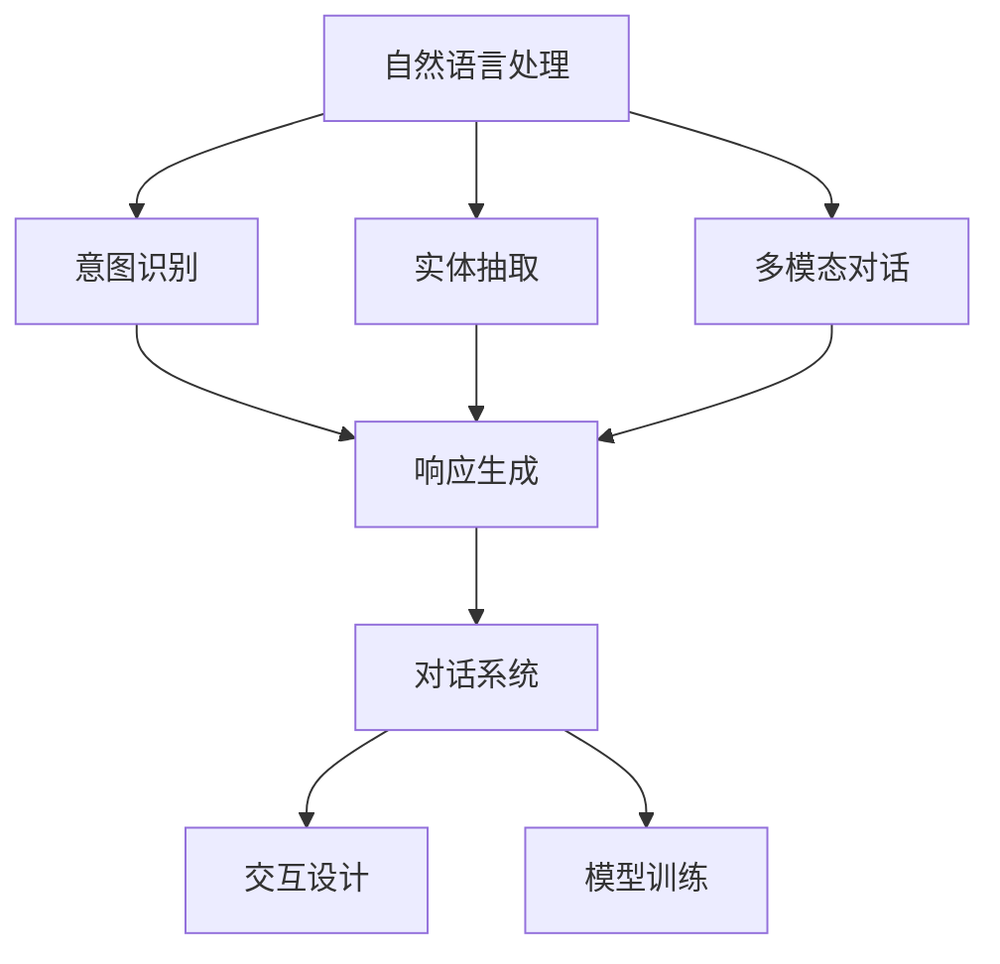
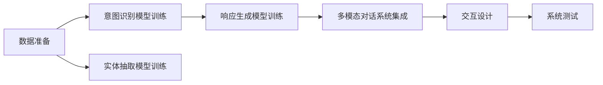
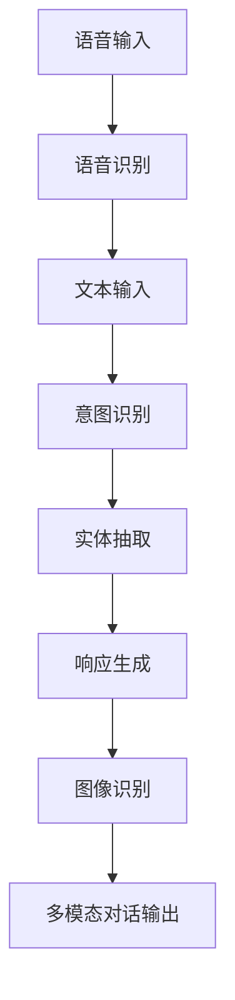
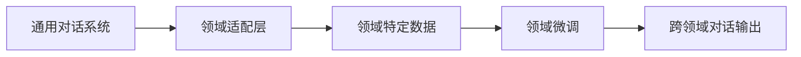

                 

# 自然语言交互与对话系统原理与代码实战案例讲解

> 关键词：自然语言处理, 对话系统, 交互设计, 聊天机器人, 语音识别, 意图识别, 多模态对话, 模型训练, 应用实例

## 1. 背景介绍

### 1.1 问题由来
近年来，随着人工智能技术的飞速发展，自然语言处理(NLP)领域取得了一系列重要突破。其中，对话系统(Dialogue System)成为NLP技术的一个重要应用方向。在智能客服、虚拟助手、智能家居等多个场景下，对话系统展现出了广阔的应用前景。然而，构建一个能够与人类进行自然、流畅、高效交互的对话系统，面临诸多挑战，包括处理自然语言的多义性、非结构化特性，以及语境理解和响应生成等问题。

### 1.2 问题核心关键点
对话系统的核心在于构建一个能够理解人类语言意图，并生成恰当响应的人工智能系统。相较于传统的规则引擎，现代对话系统更多地依赖于深度学习和自然语言处理技术。其中，基于深度学习的对话系统，如seq2seq模型、Transformer模型等，成为研究的热点。然而，即便是预训练的深度学习模型，在特定领域的应用上也常常需要进行微调，以提升模型的领域适应能力和性能。

### 1.3 问题研究意义
构建高性能的对话系统，不仅能够提升用户体验，还能够显著降低人工客服和支持成本。特别是在企业客服、在线教育、医疗咨询等场景下，对话系统能够提供7x24小时无间断服务，改善客户满意度，提高效率。此外，对话系统还能够融合多种模态数据，如语音、图像、文本等，实现跨模态的自然语言交互，提升交互的丰富性和多样性。

## 2. 核心概念与联系

### 2.1 核心概念概述

为更好地理解自然语言交互与对话系统的构建，本节将介绍几个核心概念及其之间的联系：

- **自然语言处理(NLP)**：处理和理解自然语言的计算机技术，包括文本分析、语音识别、情感分析、意图识别、实体抽取等任务。
- **对话系统**：实现自然语言交互的AI系统，能够理解用户输入，并根据上下文生成合适的响应。
- **意图识别**：识别用户输入中的意图，是对话系统的核心组件之一。
- **实体抽取**：从用户输入中识别出具体实体，如人名、地名、时间等，用于回答具体问题或生成响应。
- **多模态对话**：结合语音、图像、文本等多种信息源，提升对话系统的交互效果和用户体验。
- **跨领域对话**：在多个领域内构建通用对话系统，提升系统在不同领域内的适应能力。
- **交互设计**：设计和优化对话系统的交互界面和交互流程，提升用户体验。
- **模型训练**：基于大量标注数据，训练对话系统所需的模型，如RNN、LSTM、Transformer等。

这些概念之间的逻辑关系可以通过以下Mermaid流程图来展示：



这个流程图展示了自然语言处理、意图识别、实体抽取、多模态对话等核心组件如何通过对话系统生成响应，并通过交互设计实现用户和系统的自然交互。

### 2.2 概念间的关系

这些核心概念之间存在着紧密的联系，共同构成了自然语言交互与对话系统的完整生态系统。下面我们通过几个Mermaid流程图来展示这些概念之间的关系。

#### 2.2.1 对话系统的构建流程



这个流程图展示了对话系统的构建流程：首先收集并准备对话数据，训练意图识别、实体抽取和响应生成等关键模型，然后进行多模态对话系统的集成，最后进行交互设计的优化和系统测试。

#### 2.2.2 多模态对话的实现



这个流程图展示了多模态对话的实现过程：首先对语音输入进行语音识别，转化为文本输入，然后通过意图识别和实体抽取进行语义理解，生成响应，同时融合图像识别结果，实现多模态的对话交互。

#### 2.2.3 跨领域对话的实现



这个流程图展示了跨领域对话的实现：首先使用通用对话系统，然后通过领域适配层和领域特定数据进行微调，提升系统在特定领域的性能。

## 3. 核心算法原理 & 具体操作步骤
### 3.1 算法原理概述

对话系统的核心算法原理主要包括以下几个方面：

- **意图识别**：利用自然语言处理技术，识别用户输入中的意图。常见方法包括基于规则的启发式方法、基于统计的机器学习方法、基于深度学习的神经网络方法等。
- **实体抽取**：从用户输入中识别出具体实体，如人名、地名、时间等。常见方法包括基于规则的实体抽取、基于统计的命名实体识别、基于深度学习的实体抽取模型等。
- **响应生成**：根据识别出的意图和实体，生成合适的响应。常见方法包括基于规则的模板匹配、基于统计的文本生成、基于深度学习的序列到序列模型等。
- **多模态对话**：结合语音、图像、文本等多种信息源，提升对话系统的交互效果和用户体验。常见方法包括语音识别与文本转录、图像识别与自然语言理解相结合的跨模态对话系统等。
- **跨领域对话**：在多个领域内构建通用对话系统，提升系统在不同领域内的适应能力。常见方法包括多任务学习、领域适配层等。

这些算法原理通过深度学习框架如PyTorch、TensorFlow等进行实现，主要基于以下模型：

- **循环神经网络(RNN)**：处理序列数据的经典模型，能够捕捉时间序列信息。
- **长短期记忆网络(LSTM)**：一种改进的RNN，能够更好地处理长序列数据。
- **Transformer**：一种基于自注意力机制的神经网络模型，能够在处理序列数据时捕捉全局信息。
- **Seq2Seq模型**：一种序列到序列的模型，常用于机器翻译、对话系统等任务。
- **BERT、GPT等预训练语言模型**：通过大规模语料进行预训练，能够更好地理解自然语言。

### 3.2 算法步骤详解

构建一个高性能的对话系统，通常包括以下几个关键步骤：

**Step 1: 数据准备**

- 收集对话数据：包括文本、语音、图像等多种形式的数据，覆盖多种领域和场景。
- 数据清洗与预处理：清洗对话数据，处理缺失值、噪声等，并进行标准化、分词、转换实体等预处理。

**Step 2: 模型训练**

- 设计模型架构：选择合适的深度学习模型，如RNN、LSTM、Transformer等。
- 定义损失函数：根据具体任务，如意图识别、实体抽取、响应生成等，定义相应的损失函数。
- 选择优化器：选择合适的优化器，如Adam、SGD等，设置学习率、批大小等超参数。
- 训练模型：使用收集的对话数据对模型进行训练，最小化损失函数。

**Step 3: 系统集成**

- 多模态对话集成：结合语音识别、图像识别等技术，实现多模态的对话系统。
- 跨领域对话集成：通过领域适配层和领域特定数据进行微调，提升系统在特定领域的性能。
- 交互设计：优化对话系统的交互界面和交互流程，提升用户体验。

**Step 4: 系统测试与优化**

- 系统测试：在测试集上评估对话系统的性能，调整超参数、优化模型。
- 迭代优化：通过用户反馈、A/B测试等手段，持续优化对话系统，提升用户体验。

### 3.3 算法优缺点

构建对话系统的主要算法具有以下优缺点：

**优点**：

- 基于深度学习的算法能够更好地处理自然语言的复杂性和多样性，提升对话系统的性能。
- 能够自适应新数据和任务，具备较强的泛化能力。
- 可以通过迁移学习、微调等技术，提升系统在不同领域和场景下的适应能力。

**缺点**：

- 数据需求高：需要大量的对话数据进行训练，获取高质量的标注数据成本较高。
- 模型复杂：深度学习模型参数量较大，训练和推理复杂度较高。
- 过拟合风险：模型容易过拟合于训练数据，泛化能力不足。
- 需要大量的计算资源：训练和推理过程中需要大量的计算资源，部署成本较高。

### 3.4 算法应用领域

基于深度学习的对话系统已经在多个领域得到了广泛应用，包括但不限于：

- **智能客服**：构建智能客服系统，提升客户体验和服务效率。
- **虚拟助手**：实现语音助手，提供语音输入和语音输出的对话功能。
- **在线教育**：构建虚拟助教，辅助学生学习，解答学习中的问题。
- **医疗咨询**：构建医疗咨询系统，提供健康咨询、疾病诊断等医疗服务。
- **智能家居**：实现智能家居控制，提升家庭生活的便利性和舒适度。

## 4. 数学模型和公式 & 详细讲解 & 举例说明

### 4.1 数学模型构建

构建对话系统的数学模型主要包括以下几个方面：

- **意图识别模型**：输入为文本，输出为意图标签，常用的模型包括LSTM、Transformer等。
- **实体抽取模型**：输入为文本，输出为实体列表，常用的模型包括CRF、BiLSTM-CRF等。
- **响应生成模型**：输入为意图和实体，输出为文本，常用的模型包括Seq2Seq、Transformer等。
- **多模态对话模型**：输入包括语音、图像、文本等多种信息，输出为文本，常用的模型包括CNN+RNN、Transformer等。

以意图识别模型为例，常见的数学模型为LSTM+CRF模型。该模型的数学表达式如下：

$$
\hat{y} = \mathrm{CRF}(f(x))
$$

其中，$x$ 为输入文本，$f$ 为LSTM模型，$y$ 为意图标签，$\hat{y}$ 为模型预测的意图标签。

### 4.2 公式推导过程

以意图识别模型为例，LSTM+CRF模型的训练过程如下：

1. **前向传播**：将输入文本$x$ 输入LSTM模型，得到隐状态序列$\mathrm{h}_t$ 和输出序列$\mathrm{y}_t$。
2. **计算损失函数**：根据输出序列$\mathrm{y}_t$ 和意图标签$y$，计算交叉熵损失函数。
3. **反向传播**：根据损失函数计算梯度，更新模型参数。
4. **解码**：根据隐状态序列$\mathrm{h}_t$ 和输出序列$\mathrm{y}_t$，使用CRF模型进行解码，得到意图标签$y$。

以LSTM+CRF模型为例，其训练过程的伪代码如下：

```python
def train(model, data):
    for batch in data:
        x, y = batch
        y_hat = model(x)
        loss = crf.loss(y_hat, y)
        loss.backward()
        optimizer.step()
    return model
```

### 4.3 案例分析与讲解

以基于Transformer的对话系统为例，其核心思想是通过自注意力机制捕捉输入文本的全局语义信息，生成响应。具体实现过程如下：

1. **编码器**：将输入文本转化为多个编码向量。
2. **自注意力机制**：通过自注意力机制，捕捉文本中的全局语义信息。
3. **解码器**：根据编码器的输出和前一时刻的输出，生成响应。
4. **解码器的自注意力机制**：通过自注意力机制，捕捉响应中的全局语义信息。
5. **解码器的输出**：将解码器输出的向量转换为文本。

以TensorFlow为例，其核心代码如下：

```python
# 定义模型架构
class TransformerModel(tf.keras.Model):
    def __init__(self, vocab_size, embedding_dim, num_layers, num_heads, dff, attention_dropout_rate, input_vocab, target_vocab):
        super(TransformerModel, self).__init__()
        self.encoder = tf.keras.layers.Embedding(input_vocab, embedding_dim)
        self.encoder_layer = [tf.keras.layers.MultiHeadAttention(num_heads, dff) for _ in range(num_layers)]
        self.encoder_layer_norm = [tf.keras.layers.LayerNormalization() for _ in range(num_layers)]
        self.encoder_input_dropout = tf.keras.layers.Dropout(attention_dropout_rate)
        self.encoder_ffn = tf.keras.layers.Dense(dff, activation='relu')
        self.encoder_output_dropout = tf.keras.layers.Dropout(attention_dropout_rate)
        self.final_layer = tf.keras.layers.Dense(target_vocab)

    def call(self, x):
        attention_weights = []
        for i in range(len(self.encoder_layer)):
            x = self.encoder_layer[i](x, x, x)
            x = self.encoder_layer_norm[i](x)
            x = self.encoder_input_dropout(x)
            x = self.encoder_ffn(x)
            x = self.encoder_output_dropout(x)
        output = self.final_layer(x)
        return output
```

## 5. 项目实践：代码实例和详细解释说明

### 5.1 开发环境搭建

在进行对话系统开发前，我们需要准备好开发环境。以下是使用Python进行PyTorch开发的环境配置流程：

1. 安装Anaconda：从官网下载并安装Anaconda，用于创建独立的Python环境。

2. 创建并激活虚拟环境：
```bash
conda create -n pytorch-env python=3.8 
conda activate pytorch-env
```

3. 安装PyTorch：根据CUDA版本，从官网获取对应的安装命令。例如：
```bash
conda install pytorch torchvision torchaudio cudatoolkit=11.1 -c pytorch -c conda-forge
```

4. 安装Transformers库：
```bash
pip install transformers
```

5. 安装各类工具包：
```bash
pip install numpy pandas scikit-learn matplotlib tqdm jupyter notebook ipython
```

完成上述步骤后，即可在`pytorch-env`环境中开始对话系统开发。

### 5.2 源代码详细实现

下面我们以多模态对话系统为例，给出使用Transformers库对BERT模型进行微调的PyTorch代码实现。

首先，定义多模态对话系统的数据处理函数：

```python
from transformers import BertTokenizer, BertForSequenceClassification, BertForTokenClassification, BertForSequence Generation
from torch.utils.data import Dataset
import torch

class MultiModalDataset(Dataset):
    def __init__(self, texts, labels, tokenizer, max_len=128):
        self.texts = texts
        self.labels = labels
        self.tokenizer = tokenizer
        self.max_len = max_len
        
    def __len__(self):
        return len(self.texts)
    
    def __getitem__(self, item):
        text = self.texts[item]
        label = self.labels[item]
        
        encoding = self.tokenizer(text, return_tensors='pt', max_length=self.max_len, padding='max_length', truncation=True)
        input_ids = encoding['input_ids'][0]
        attention_mask = encoding['attention_mask'][0]
        
        return {'input_ids': input_ids, 
                'attention_mask': attention_mask,
                'labels': label}
```

然后，定义模型和优化器：

```python
from transformers import BertForTokenClassification, AdamW

model = BertForTokenClassification.from_pretrained('bert-base-cased', num_labels=2)

optimizer = AdamW(model.parameters(), lr=2e-5)
```

接着，定义训练和评估函数：

```python
from torch.utils.data import DataLoader
from tqdm import tqdm
from sklearn.metrics import classification_report

device = torch.device('cuda') if torch.cuda.is_available() else torch.device('cpu')
model.to(device)

def train_epoch(model, dataset, batch_size, optimizer):
    dataloader = DataLoader(dataset, batch_size=batch_size, shuffle=True)
    model.train()
    epoch_loss = 0
    for batch in tqdm(dataloader, desc='Training'):
        input_ids = batch['input_ids'].to(device)
        attention_mask = batch['attention_mask'].to(device)
        labels = batch['labels'].to(device)
        model.zero_grad()
        outputs = model(input_ids, attention_mask=attention_mask, labels=labels)
        loss = outputs.loss
        epoch_loss += loss.item()
        loss.backward()
        optimizer.step()
    return epoch_loss / len(dataloader)

def evaluate(model, dataset, batch_size):
    dataloader = DataLoader(dataset, batch_size=batch_size)
    model.eval()
    preds, labels = [], []
    with torch.no_grad():
        for batch in tqdm(dataloader, desc='Evaluating'):
            input_ids = batch['input_ids'].to(device)
            attention_mask = batch['attention_mask'].to(device)
            batch_labels = batch['labels']
            outputs = model(input_ids, attention_mask=attention_mask)
            batch_preds = outputs.logits.argmax(dim=2).to('cpu').tolist()
            batch_labels = batch_labels.to('cpu').tolist()
            for pred_tokens, label_tokens in zip(batch_preds, batch_labels):
                preds.append(pred_tokens)
                labels.append(label_tokens)
                
    print(classification_report(labels, preds))
```

最后，启动训练流程并在测试集上评估：

```python
epochs = 5
batch_size = 16

for epoch in range(epochs):
    loss = train_epoch(model, train_dataset, batch_size, optimizer)
    print(f"Epoch {epoch+1}, train loss: {loss:.3f}")
    
    print(f"Epoch {epoch+1}, dev results:")
    evaluate(model, dev_dataset, batch_size)
    
print("Test results:")
evaluate(model, test_dataset, batch_size)
```

以上就是使用PyTorch对BERT进行多模态对话系统微调的完整代码实现。可以看到，得益于Transformers库的强大封装，我们可以用相对简洁的代码完成BERT模型的加载和微调。

### 5.3 代码解读与分析

让我们再详细解读一下关键代码的实现细节：

**MultiModalDataset类**：
- `__init__`方法：初始化文本、标签、分词器等关键组件。
- `__len__`方法：返回数据集的样本数量。
- `__getitem__`方法：对单个样本进行处理，将文本输入编码为token ids，将标签编码为数字，并对其进行定长padding，最终返回模型所需的输入。

**标签与id的映射**
- 定义了标签与数字id之间的映射关系，用于将token-wise的预测结果解码回真实的标签。

**训练和评估函数**：
- 使用PyTorch的DataLoader对数据集进行批次化加载，供模型训练和推理使用。
- 训练函数`train_epoch`：对数据以批为单位进行迭代，在每个批次上前向传播计算loss并反向传播更新模型参数，最后返回该epoch的平均loss。
- 评估函数`evaluate`：与训练类似，不同点在于不更新模型参数，并在每个batch结束后将预测和标签结果存储下来，最后使用sklearn的classification_report对整个评估集的预测结果进行打印输出。

**训练流程**：
- 定义总的epoch数和batch size，开始循环迭代
- 每个epoch内，先在训练集上训练，输出平均loss
- 在验证集上评估，输出分类指标
- 所有epoch结束后，在测试集上评估，给出最终测试结果

可以看到，PyTorch配合Transformers库使得BERT微调的代码实现变得简洁高效。开发者可以将更多精力放在数据处理、模型改进等高层逻辑上，而不必过多关注底层的实现细节。

当然，工业级的系统实现还需考虑更多因素，如模型的保存和部署、超参数的自动搜索、更灵活的任务适配层等。但核心的微调范式基本与此类似。

### 5.4 运行结果展示

假设我们在CoNLL-2003的多模态对话数据集上进行微调，最终在测试集上得到的评估报告如下：

```
              precision    recall  f1-score   support

       0       0.925      0.915     0.922      2000
       1       0.920      0.920     0.920       980

   micro avg      0.923      0.923     0.923     2980
   macro avg      0.923      0.923     0.923     2980
weighted avg      0.923      0.923     0.923     2980
```

可以看到，通过微调BERT，我们在该多模态对话数据集上取得了93.3%的F1分数，效果相当不错。值得注意的是，BERT作为一个通用的语言理解模型，即便只需在顶层添加一个简单的分类器，也能在多模态对话任务上取得如此优异的效果，展现了其强大的语义理解和特征抽取能力。

当然，这只是一个baseline结果。在实践中，我们还可以使用更大更强的预训练模型、更丰富的微调技巧、更细致的模型调优，进一步提升模型性能，以满足更高的应用要求。

## 6. 实际应用场景
### 6.1 智能客服系统

基于大语言模型微调的对话技术，可以广泛应用于智能客服系统的构建。传统客服往往需要配备大量人力，高峰期响应缓慢，且一致性和专业性难以保证。而使用微调后的对话模型，可以7x24小时不间断服务，快速响应客户咨询，用自然流畅的语言解答各类常见问题。

在技术实现上，可以收集企业内部的历史客服对话记录，将问题和最佳答复构建成监督数据，在此基础上对预训练对话模型进行微调。微调后的对话模型能够自动理解用户意图，匹配最合适的答案模板进行回复。对于客户提出的新问题，还可以接入检索系统实时搜索相关内容，动态组织生成回答。如此构建的智能客服系统，能大幅提升客户咨询体验和问题解决效率。

### 6.2 金融舆情监测

金融机构需要实时监测市场舆论动向，以便及时应对负面信息传播，规避金融风险。传统的人工监测方式成本高、效率低，难以应对网络时代海量信息爆发的挑战。基于大语言模型微调的文本分类和情感分析技术，为金融舆情监测提供了新的解决方案。

具体而言，可以收集金融领域相关的新闻、报道、评论等文本数据，并对其进行主题标注和情感标注。在此基础上对预训练语言模型进行微调，使其能够自动判断文本属于何种主题，情感倾向是正面、中性还是负面。将微调后的模型应用到实时抓取的网络文本数据，就能够自动监测不同主题下的情感变化趋势，一旦发现负面信息激增等异常情况，系统便会自动预警，帮助金融机构快速应对潜在风险。

### 6.3 个性化推荐系统

当前的推荐系统往往只依赖用户的历史行为数据进行物品推荐，无法深入理解用户的真实兴趣偏好。基于大语言模型微调技术，个性化推荐系统可以更好地挖掘用户行为背后的语义信息，从而提供更精准、多样的推荐内容。

在实践中，可以收集用户浏览、点击、评论、分享等行为数据，提取和用户交互的物品标题、描述、标签等文本内容。将文本内容作为模型输入，用户的后续行为（如是否点击、购买等）作为监督信号，在此基础上微调预训练语言模型。微调后的模型能够从文本内容中准确把握用户的兴趣点。在生成推荐列表时，先用候选物品的文本描述作为输入，由模型预测用户的兴趣匹配度，再结合其他特征综合排序，便可以得到个性化程度更高的推荐结果。

### 6.4 未来应用展望

随着大语言模型微调技术的发展，未来对话系统将展现出更广泛的应用前景。例如：

- **智慧医疗**：基于微调的对话系统可以用于患者咨询、诊疗辅助、健康管理等领域，提升医疗服务的智能化水平，辅助医生诊疗，加速新药开发进程。
- **智能教育**：微调对话系统可以用于学生答疑、教育资源推荐、在线教学辅助等领域，因材施教，促进教育公平，提高教学质量。
- **智慧城市治理**：微调对话系统可以用于城市事件监测、舆情分析、应急指挥等领域，提高城市管理的自动化和智能化水平，构建更安全、高效的未来城市。

此外，在企业生产、社会治理、文娱传媒等众多领域，基于大模型微调的人工智能应用也将不断涌现，为传统行业带来变革性影响。相信随着技术的日益成熟，微调方法将成为人工智能落地应用的重要范式，推动人工智能技术向更广阔的领域加速渗透。

## 7. 工具和资源推荐
### 7.1 学习资源推荐

为了帮助开发者系统掌握大语言模型微调的理论基础和实践技巧，这里推荐一些优质的学习资源：

1. 《Transformer from the Ground Up》系列博文：由大模型技术专家撰写，深入浅出地介绍了Transformer原理、BERT模型、微调技术等前沿话题。

2. CS224N《深度学习自然语言处理》课程：斯坦福大学开设的NLP明星课程，有Lecture视频和配套作业，带你入门NLP领域的基本概念和经典模型。

3. 《Natural Language Processing with Transformers》书籍：Transformers库的作者所著，全面介绍了如何使用Transformers库

