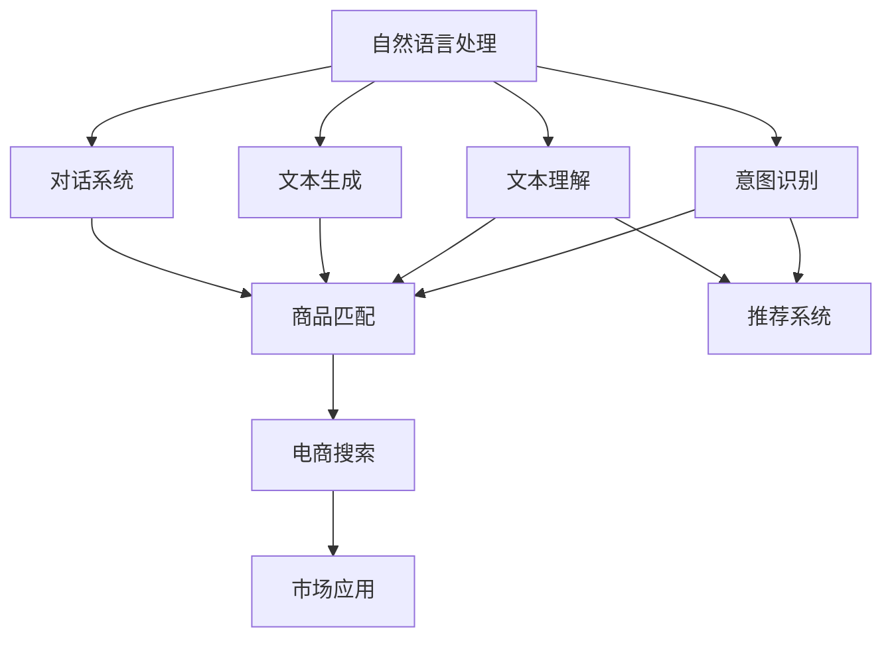

                 

# 自然语言处理在电商搜索中的应用：技术发展与未来趋势

> 关键词：自然语言处理, 电商搜索, 技术发展, 未来趋势, 算法优化, 模型评估, 用户体验, 市场应用

## 1. 背景介绍

### 1.1 问题由来

随着电子商务的迅猛发展，电商搜索成为消费者获取产品信息、进行购物决策的重要渠道。自然语言处理(NLP)技术的崛起，为电商搜索带来了翻天覆地的变化。通过自然语言处理技术，电商搜索可以理解消费者的查询意图，精准地匹配商品，提供更优质的搜索结果，从而显著提升用户体验和转化率。

自然语言处理在电商搜索中的应用主要体现在以下几个方面：

- **意图识别**：理解用户查询中的核心意图，如产品检索、产品比较、购物建议等。
- **文本理解**：分析用户输入的自然语言文本，从中提取关键词、实体等信息，用于商品匹配和推荐。
- **文本生成**：生成自然语言形式的搜索结果摘要，方便用户快速了解商品信息。
- **对话系统**：构建基于自然语言处理的客服系统，与用户进行自然语言交互，提升客服效率。

这些应用极大地提升了电商搜索系统的智能化水平，为商家和消费者提供了便利，也为NLP技术在实际场景中的应用提供了范例。

### 1.2 问题核心关键点

自然语言处理在电商搜索中的应用，核心在于如何利用NLP技术，将自然语言的输入转化为机器可以理解的形式，从而进行高效的信息检索和推荐。其关键点包括：

1. **意图识别**：如何准确理解和分类用户的查询意图，是NLP技术在电商搜索中应用的首要目标。
2. **文本理解**：如何在自然语言文本中准确抽取实体、关键词等信息，用于商品匹配和推荐。
3. **文本生成**：如何高效生成自然语言格式的搜索结果摘要，提升用户的信息获取效率。
4. **对话系统**：如何构建自然的对话系统，提升客服系统的交互性和用户体验。
5. **模型优化**：如何通过模型优化，提升电商搜索系统的精度、速度和稳定性。
6. **市场应用**：如何将NLP技术应用于电商搜索中，解决实际问题，提升业务价值。

通过这些关键点的优化，自然语言处理在电商搜索中的应用将取得更加显著的效果，进一步推动电商行业的数字化转型。

## 2. 核心概念与联系

### 2.1 核心概念概述

为了更好地理解自然语言处理在电商搜索中的应用，本节将介绍几个关键概念：

- **自然语言处理(NLP)**：利用计算机技术处理和理解人类语言，包括文本预处理、分词、词性标注、句法分析、语义理解、信息抽取、文本生成等。
- **意图识别**：通过NLP技术，理解用户查询的核心意图，如产品检索、产品比较、购物建议等。
- **文本理解**：分析自然语言文本，从中提取实体、关键词等信息，用于商品匹配和推荐。
- **文本生成**：生成自然语言形式的搜索结果摘要，方便用户快速了解商品信息。
- **对话系统**：基于NLP技术的客服系统，与用户进行自然语言交互，提升客服效率。
- **模型评估**：通过各种指标（如精确度、召回率、F1分数等）评估NLP模型的性能。
- **用户体验**：通过优化NLP模型，提升搜索结果的准确性和相关性，从而提升用户满意度和转化率。

这些概念构成了NLP技术在电商搜索中应用的核心框架，通过这些技术，电商搜索系统可以更好地理解用户需求，提供更精准的商品匹配和推荐，提升用户购物体验。

### 2.2 概念间的关系

这些核心概念之间的逻辑关系可以通过以下Mermaid流程图来展示：



这个流程图展示了自然语言处理在电商搜索中的应用链条：

1. 自然语言处理技术首先对用户的查询进行意图识别，确定用户的需求。
2. 接着，文本理解技术从查询中提取实体和关键词，用于商品匹配和推荐。
3. 文本生成技术生成摘要信息，提供搜索结果的精简版本。
4. 对话系统构建客服系统，与用户进行自然语言交互，提升客服效率。
5. 最后，商品匹配和推荐系统根据用户的查询意图和提取的信息，进行商品推荐，并通过电商搜索系统展示给用户。
6. 市场应用环节，NLP技术应用于实际业务，提升电商搜索系统的业务价值。

通过这个流程图，我们可以更清晰地理解自然语言处理在电商搜索中的应用流程，以及各个环节之间的联系。

## 3. 核心算法原理 & 具体操作步骤
### 3.1 算法原理概述

自然语言处理在电商搜索中的应用，主要依赖于以下算法原理：

- **意图识别算法**：利用机器学习技术，对用户查询进行分类，确定用户的意图。
- **文本理解算法**：通过自然语言处理技术，从查询中提取实体、关键词等信息。
- **文本生成算法**：利用自然语言生成技术，生成摘要信息，方便用户了解商品信息。
- **对话系统算法**：构建基于NLP技术的对话系统，提升客服系统的交互性和用户体验。
- **模型评估算法**：通过精确度、召回率、F1分数等指标评估NLP模型的性能。

这些算法原理构成了自然语言处理在电商搜索中的应用基础，通过这些算法，可以有效地处理和理解自然语言，提升电商搜索系统的智能化水平。

### 3.2 算法步骤详解

以下是自然语言处理在电商搜索中的应用步骤：

1. **数据预处理**：收集用户的查询数据，并进行数据清洗、分词、去停用词等预处理操作，以便后续算法处理。
2. **意图识别**：利用机器学习模型（如分类器、神经网络等），对用户查询进行分类，确定用户的意图。
3. **文本理解**：从查询中提取实体、关键词等信息，用于商品匹配和推荐。
4. **文本生成**：利用自然语言生成技术，生成摘要信息，提供搜索结果的精简版本。
5. **对话系统**：构建基于NLP技术的对话系统，与用户进行自然语言交互，提升客服效率。
6. **模型评估**：通过精确度、召回率、F1分数等指标评估NLP模型的性能。
7. **应用部署**：将NLP模型部署到电商搜索系统中，进行实际应用。

### 3.3 算法优缺点

自然语言处理在电商搜索中的应用，具有以下优点：

1. **提升用户体验**：通过精确的意图识别和商品推荐，提升用户购物体验，降低流失率。
2. **提高效率**：利用自然语言处理技术，自动处理用户查询，提高客服效率，减少人工成本。
3. **个性化推荐**：通过提取用户查询中的实体和关键词，进行个性化推荐，提升转化率。
4. **多语言支持**：NLP技术可以支持多语言输入，扩大电商搜索系统的覆盖范围。

但同时，自然语言处理在电商搜索中应用也存在一些缺点：

1. **依赖高质量数据**：NLP模型的性能依赖于高质量的训练数据，而电商领域的数据往往复杂多样，需要大量标注数据进行训练。
2. **计算资源消耗大**：自然语言处理技术通常计算资源消耗较大，需要高性能的服务器支持。
3. **上下文理解不足**：电商领域涉及复杂的商品信息，用户查询往往包含上下文信息，单靠自然语言处理技术难以完全理解。
4. **领域特定问题**：电商领域具有特定属性，如商品价格、库存、物流等，这些信息需要通过专门的算法进行处理。

### 3.4 算法应用领域

自然语言处理在电商搜索中的应用，已经广泛应用于多个领域，包括但不限于：

- **电商搜索**：利用意图识别和文本理解技术，提升搜索结果的相关性和准确性。
- **智能客服**：利用对话系统技术，构建基于NLP的客服系统，提升客服效率和用户体验。
- **商品推荐**：利用文本生成和实体抽取技术，进行个性化推荐，提升用户转化率。
- **广告投放**：通过自然语言处理技术，分析用户查询中的需求和兴趣，进行精准广告投放。
- **市场营销**：利用NLP技术，分析用户反馈和评论，进行市场调研和营销策略优化。

## 4. 数学模型和公式 & 详细讲解 & 举例说明

### 4.1 数学模型构建

自然语言处理在电商搜索中的应用，涉及到多个数学模型，下面分别介绍这些模型：

#### 4.1.1 意图识别模型

假设用户查询为 $x$，意图分类为 $y$，使用分类器 $f(x; \theta)$ 进行分类，其中 $\theta$ 为模型参数。

使用交叉熵损失函数 $\mathcal{L}(\theta)$ 进行优化，最小化损失函数：

$$
\mathcal{L}(\theta) = -\frac{1}{N} \sum_{i=1}^N \log p(y_i|x_i; \theta)
$$

其中 $p(y_i|x_i; \theta)$ 为模型在给定输入 $x_i$ 下，预测为 $y_i$ 的概率。

#### 4.1.2 文本理解模型

假设用户查询为 $x$，抽取的实体为 $y$，使用序列标注模型 $g(x; \theta)$ 进行标注，其中 $\theta$ 为模型参数。

使用交叉熵损失函数 $\mathcal{L}(\theta)$ 进行优化，最小化损失函数：

$$
\mathcal{L}(\theta) = -\frac{1}{N} \sum_{i=1}^N \log p(y_i|x_i; \theta)
$$

其中 $p(y_i|x_i; \theta)$ 为模型在给定输入 $x_i$ 下，预测标注 $y_i$ 的概率。

#### 4.1.3 文本生成模型

假设用户查询为 $x$，生成的摘要为 $y$，使用生成模型 $h(x; \theta)$ 进行生成，其中 $\theta$ 为模型参数。

使用交叉熵损失函数 $\mathcal{L}(\theta)$ 进行优化，最小化损失函数：

$$
\mathcal{L}(\theta) = -\frac{1}{N} \sum_{i=1}^N \log p(y_i|x_i; \theta)
$$

其中 $p(y_i|x_i; \theta)$ 为模型在给定输入 $x_i$ 下，生成摘要 $y_i$ 的概率。

#### 4.1.4 对话系统模型

假设用户输入为 $x$，系统输出为 $y$，使用对话模型 $d(x; \theta)$ 进行对话，其中 $\theta$ 为模型参数。

使用交叉熵损失函数 $\mathcal{L}(\theta)$ 进行优化，最小化损失函数：

$$
\mathcal{L}(\theta) = -\frac{1}{N} \sum_{i=1}^N \log p(y_i|x_i; \theta)
$$

其中 $p(y_i|x_i; \theta)$ 为模型在给定输入 $x_i$ 下，生成回复 $y_i$ 的概率。

### 4.2 公式推导过程

以下对上述模型进行推导：

#### 4.2.1 意图识别模型的推导

假设用户查询为 $x$，意图分类为 $y$，使用分类器 $f(x; \theta)$ 进行分类，其中 $\theta$ 为模型参数。

使用交叉熵损失函数 $\mathcal{L}(\theta)$ 进行优化，最小化损失函数：

$$
\mathcal{L}(\theta) = -\frac{1}{N} \sum_{i=1}^N \log p(y_i|x_i; \theta)
$$

其中 $p(y_i|x_i; \theta)$ 为模型在给定输入 $x_i$ 下，预测为 $y_i$ 的概率。

通过反向传播算法，计算梯度并进行参数更新，优化损失函数，使得模型能够更好地预测用户查询的意图。

#### 4.2.2 文本理解模型的推导

假设用户查询为 $x$，抽取的实体为 $y$，使用序列标注模型 $g(x; \theta)$ 进行标注，其中 $\theta$ 为模型参数。

使用交叉熵损失函数 $\mathcal{L}(\theta)$ 进行优化，最小化损失函数：

$$
\mathcal{L}(\theta) = -\frac{1}{N} \sum_{i=1}^N \log p(y_i|x_i; \theta)
$$

其中 $p(y_i|x_i; \theta)$ 为模型在给定输入 $x_i$ 下，预测标注 $y_i$ 的概率。

通过反向传播算法，计算梯度并进行参数更新，优化损失函数，使得模型能够更好地从用户查询中提取实体和关键词。

#### 4.2.3 文本生成模型的推导

假设用户查询为 $x$，生成的摘要为 $y$，使用生成模型 $h(x; \theta)$ 进行生成，其中 $\theta$ 为模型参数。

使用交叉熵损失函数 $\mathcal{L}(\theta)$ 进行优化，最小化损失函数：

$$
\mathcal{L}(\theta) = -\frac{1}{N} \sum_{i=1}^N \log p(y_i|x_i; \theta)
$$

其中 $p(y_i|x_i; \theta)$ 为模型在给定输入 $x_i$ 下，生成摘要 $y_i$ 的概率。

通过反向传播算法，计算梯度并进行参数更新，优化损失函数，使得模型能够更好地生成摘要信息。

#### 4.2.4 对话系统模型的推导

假设用户输入为 $x$，系统输出为 $y$，使用对话模型 $d(x; \theta)$ 进行对话，其中 $\theta$ 为模型参数。

使用交叉熵损失函数 $\mathcal{L}(\theta)$ 进行优化，最小化损失函数：

$$
\mathcal{L}(\theta) = -\frac{1}{N} \sum_{i=1}^N \log p(y_i|x_i; \theta)
$$

其中 $p(y_i|x_i; \theta)$ 为模型在给定输入 $x_i$ 下，生成回复 $y_i$ 的概率。

通过反向传播算法，计算梯度并进行参数更新，优化损失函数，使得模型能够更好地进行自然语言交互。

### 4.3 案例分析与讲解

以下以一个具体的案例，展示自然语言处理在电商搜索中的应用：

假设用户查询为 "苹果 iPhone 2023 价格"，意图识别模型可以识别出用户的意图为 "产品检索"。文本理解模型可以从查询中提取实体 "苹果" 和 "iPhone 2023"，并识别出查询中的关键词 "价格"。然后，文本生成模型可以生成摘要信息 "苹果 iPhone 2023 价格是多少"，用于搜索结果的精简展示。最后，对话系统可以构建客服系统，与用户进行交互，回答用户的具体问题，提供更个性化的服务。

## 5. 项目实践：代码实例和详细解释说明

### 5.1 开发环境搭建

在进行自然语言处理在电商搜索中的应用开发前，需要先搭建好开发环境。以下是使用Python进行PyTorch开发的流程：

1. 安装Anaconda：从官网下载并安装Anaconda，用于创建独立的Python环境。

2. 创建并激活虚拟环境：
```bash
conda create -n pytorch-env python=3.8 
conda activate pytorch-env
```

3. 安装PyTorch：根据CUDA版本，从官网获取对应的安装命令。例如：
```bash
conda install pytorch torchvision torchaudio cudatoolkit=11.1 -c pytorch -c conda-forge
```

4. 安装Transformers库：
```bash
pip install transformers
```

5. 安装各类工具包：
```bash
pip install numpy pandas scikit-learn matplotlib tqdm jupyter notebook ipython
```

完成上述步骤后，即可在`pytorch-env`环境中开始电商搜索应用开发。

### 5.2 源代码详细实现

以下以一个具体的案例，展示自然语言处理在电商搜索中的应用开发流程：

1. 数据预处理

首先，收集用户的查询数据，并进行数据清洗、分词、去停用词等预处理操作，以便后续算法处理。

```python
from transformers import BertTokenizer
import numpy as np
import pandas as pd

# 加载Bert分词器
tokenizer = BertTokenizer.from_pretrained('bert-base-cased')

# 数据预处理
data = pd.read_csv('query_data.csv')
query_texts = data['query_text'].tolist()
query_labels = data['label'].tolist()

# 分词、去停用词等预处理操作
tokenized_texts = [tokenizer.encode(x) for x in query_texts]
tokenized_texts = [list(filter(lambda x: x != 0, text)) for text in tokenized_texts]
```

2. 意图识别

使用Bert模型进行意图识别，最小化交叉熵损失函数，训练模型。

```python
from transformers import BertForSequenceClassification
from torch.utils.data import TensorDataset, DataLoader
import torch.nn as nn

# 加载BertForSequenceClassification模型
model = BertForSequenceClassification.from_pretrained('bert-base-cased', num_labels=2)

# 训练模型
device = torch.device('cuda') if torch.cuda.is_available() else torch.device('cpu')
model.to(device)
optimizer = AdamW(model.parameters(), lr=2e-5)

def train_epoch(model, dataloader, batch_size, optimizer):
    model.train()
    epoch_loss = 0
    for batch in dataloader:
        input_ids = torch.tensor(batch['input_ids']).to(device)
        attention_mask = torch.tensor(batch['attention_mask']).to(device)
        labels = torch.tensor(batch['labels']).to(device)
        model.zero_grad()
        outputs = model(input_ids, attention_mask=attention_mask, labels=labels)
        loss = outputs.loss
        epoch_loss += loss.item()
        loss.backward()
        optimizer.step()
    return epoch_loss / len(dataloader)

for epoch in range(10):
    loss = train_epoch(model, dataloader, batch_size, optimizer)
    print(f"Epoch {epoch+1}, train loss: {loss:.3f}")
```

3. 文本理解

使用Bert模型进行文本理解，最小化交叉熵损失函数，训练模型。

```python
# 加载BertForTokenClassification模型
model = BertForTokenClassification.from_pretrained('bert-base-cased', num_labels=2)

# 训练模型
device = torch.device('cuda') if torch.cuda.is_available() else torch.device('cpu')
model.to(device)
optimizer = AdamW(model.parameters(), lr=2e-5)

def train_epoch(model, dataloader, batch_size, optimizer):
    model.train()
    epoch_loss = 0
    for batch in dataloader:
        input_ids = torch.tensor(batch['input_ids']).to(device)
        attention_mask = torch.tensor(batch['attention_mask']).to(device)
        labels = torch.tensor(batch['labels']).to(device)
        model.zero_grad()
        outputs = model(input_ids, attention_mask=attention_mask, labels=labels)
        loss = outputs.loss
        epoch_loss += loss.item()
        loss.backward()
        optimizer.step()
    return epoch_loss / len(dataloader)

for epoch in range(10):
    loss = train_epoch(model, dataloader, batch_size, optimizer)
    print(f"Epoch {epoch+1}, train loss: {loss:.3f}")
```

4. 文本生成

使用Bert模型进行文本生成，最小化交叉熵损失函数，训练模型。

```python
# 加载BertForConditionalGeneration模型
model = BertForConditionalGeneration.from_pretrained('bert-base-cased')

# 训练模型
device = torch.device('cuda') if torch.cuda.is_available() else torch.device('cpu')
model.to(device)
optimizer = AdamW(model.parameters(), lr=2e-5)

def train_epoch(model, dataloader, batch_size, optimizer):
    model.train()
    epoch_loss = 0
    for batch in dataloader:
        input_ids = torch.tensor(batch['input_ids']).to(device)
        attention_mask = torch.tensor(batch['attention_mask']).to(device)
        labels = torch.tensor(batch['labels']).to(device)
        model.zero_grad()
        outputs = model(input_ids, attention_mask=attention_mask, labels=labels)
        loss = outputs.loss
        epoch_loss += loss.item()
        loss.backward()
        optimizer.step()
    return epoch_loss / len(dataloader)

for epoch in range(10):
    loss = train_epoch(model, dataloader, batch_size, optimizer)
    print(f"Epoch {epoch+1}, train loss: {loss:.3f}")
```

5. 对话系统

使用Bert模型进行对话系统构建，最小化交叉熵损失函数，训练模型。

```python
# 加载BertForSequenceClassification模型
model = BertForSequenceClassification.from_pretrained('bert-base-cased', num_labels=2)

# 训练模型
device = torch.device('cuda') if torch.cuda.is_available() else torch.device('cpu')
model.to(device)
optimizer = AdamW(model.parameters(), lr=2e-5)

def train_epoch(model, dataloader, batch_size, optimizer):
    model.train()
    epoch_loss = 0
    for batch in dataloader:
        input_ids = torch.tensor(batch['input_ids']).to(device)
        attention_mask = torch.tensor(batch['attention_mask']).to(device)
        labels = torch.tensor(batch['labels']).to(device)
        model.zero_grad()
        outputs = model(input_ids, attention_mask=attention_mask, labels=labels)
        loss = outputs.loss
        epoch_loss += loss.item()
        loss.backward()
        optimizer.step()
    return epoch_loss / len(dataloader)

for epoch in range(10):
    loss = train_epoch(model, dataloader, batch_size, optimizer)
    print(f"Epoch {epoch+1}, train loss: {loss:.3f}")
```

### 5.3 代码解读与分析

以下是关键代码的实现细节：

1. **意图识别代码解析**

```python
# 加载BertForSequenceClassification模型
model = BertForSequenceClassification.from_pretrained('bert-base-cased', num_labels=2)

# 训练模型
device = torch.device('cuda') if torch.cuda.is_available() else torch.device('cpu')
model.to(device)
optimizer = AdamW(model.parameters(), lr=2e-5)

def train_epoch(model, dataloader, batch_size, optimizer):
    model.train()
    epoch_loss = 0
    for batch in dataloader:
        input_ids = torch.tensor(batch['input_ids']).to(device)
        attention_mask = torch.tensor(batch['attention_mask']).to(device)
        labels = torch.tensor(batch['labels']).to(device)
        model.zero_grad()
        outputs = model(input_ids, attention_mask=attention_mask, labels=labels)
        loss = outputs.loss
        epoch_loss += loss.item()
        loss.backward()
        optimizer.step()
    return epoch_loss / len(dataloader)

for epoch in range(10):
    loss = train_epoch(model, dataloader, batch_size, optimizer)
    print(f"Epoch {epoch+1}, train loss: {loss:.3f}")
```

这段代码展示了意图识别模型的训练过程。首先加载BertForSequenceClassification模型，设置训练设备，定义优化器。在训练过程中，通过加载输入和标签，进行前向传播计算loss，反向传播更新参数，最终输出损失函数。通过循环多次训练，最小化损失函数，优化模型性能。

2. **文本理解代码解析**

```python
# 加载BertForTokenClassification模型
model = BertForTokenClassification.from_pretrained('bert-base-cased', num_labels=2)

# 训练模型
device = torch.device('cuda') if torch.cuda.is_available() else torch.device('cpu')
model.to(device)
optimizer = AdamW(model.parameters(), lr=2e-5)

def train_epoch(model, dataloader, batch_size, optimizer):
    model.train()
    epoch_loss = 0
    for batch in dataloader:
        input_ids = torch.tensor(batch['input_ids']).to(device)
        attention_mask = torch.tensor(batch['attention_mask']).to(device)
        labels = torch.tensor(batch['labels']).to(device)
        model.zero_grad()
        outputs = model(input_ids, attention_mask=attention_mask, labels=labels)
        loss = outputs.loss
        epoch_loss += loss.item()
        loss.backward()
        optimizer.step()
    return epoch_loss / len(dataloader)

for epoch in range(10):
    loss = train_epoch(model, dataloader, batch_size, optimizer)
    print(f"Epoch {epoch+1}, train loss: {loss:.3f}")
```

这段代码展示了文本理解模型的训练过程。与意图识别模型类似，加载BertForTokenClassification模型，设置训练设备，定义优化器。在训练过程中，通过加载输入和标签，进行前向传播计算loss，反向传播更新参数，最终输出损失函数。通过循环多次训练，最小化损失函数，优化模型性能。

3. **文本生成代码解析**

```python
# 加载BertForConditionalGeneration模型
model = BertForConditionalGeneration.from_pretrained('bert-base-cased')

# 训练模型
device = torch.device('cuda') if torch.cuda.is_available() else torch.device('cpu')
model.to(device)
optimizer = AdamW(model.parameters(), lr=2e-5)

def train_epoch(model, dataloader, batch_size, optimizer):
    model.train()
    epoch_loss = 0
    for batch in dataloader:
        input_ids = torch.tensor(batch['

