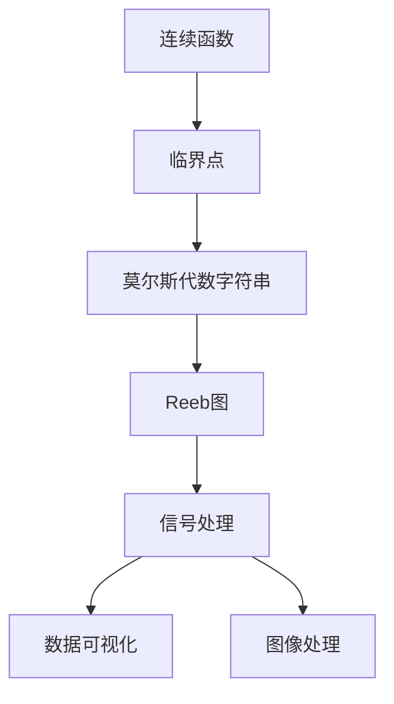
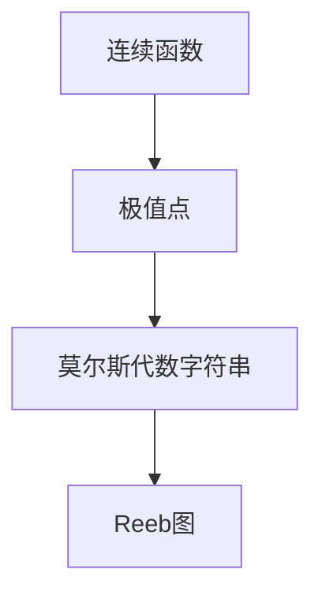
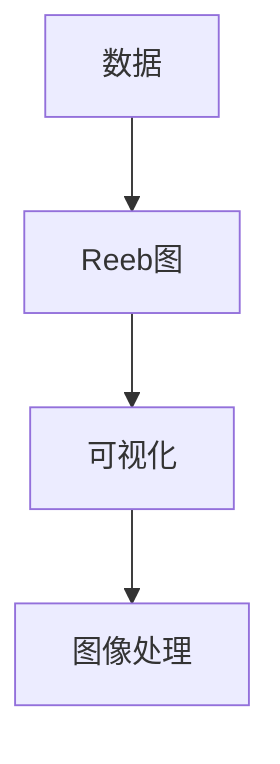

                 

# 莫尔斯理论与Reeb图

> 关键词：莫尔斯理论,Reeb图,拓扑结构,信号处理,数据可视化

## 1. 背景介绍

### 1.1 问题由来
莫尔斯理论与Reeb图是拓扑学中的重要概念，广泛应用于信号处理、数据可视化、图像处理等领域。它们通过将连续信号离散化，提供了从连续空间到离散空间的桥梁，使得许多复杂问题得以用简单的离散算法解决。例如，在图像处理中，可以通过Reeb图进行图像分割、边缘检测等操作。

然而，尽管这两个概念在理论和实践中都有广泛应用，但它们之间的联系和应用场景仍有一些不为人所熟知。本文将详细探讨莫尔斯理论与Reeb图的基本原理，以及它们在实际应用中的表现和优缺点。通过深入挖掘这两个概念的联系，我们希望能够为信号处理、数据可视化等领域提供新的思路和方法。

### 1.2 问题核心关键点
莫尔斯理论与Reeb图的核心关键点包括：

1. **莫尔斯理论**：通过将连续函数映射到实数线，将函数曲线的临界点（极大值、极小值）离散化，从而得到莫尔斯代数字符串。这些临界点被视为莫尔斯理论中的关键信息点，可以用来描述函数的拓扑结构。

2. **Reeb图**：Reeb图是由莫尔斯理论中的临界点连接而成的拓扑结构，用于描述函数的拓扑性质。Reeb图能够直观地展示函数的拓扑形态，如凸包、凹包、鞍点等。

3. **信号处理中的应用**：莫尔斯理论与Reeb图在信号处理中用于信号特征提取、信号处理和滤波等操作，能够将连续信号离散化，方便后续处理。

4. **数据可视化**：Reeb图能够用于数据可视化，将复杂的数据结构转化为易于理解的拓扑形态，帮助用户快速理解数据分布和关系。

5. **图像处理**：Reeb图在图像处理中的应用包括边缘检测、图像分割、形态学处理等，能够提高图像处理的效率和精度。

### 1.3 问题研究意义
深入研究莫尔斯理论与Reeb图，有助于理解信号、数据的拓扑结构和形态，从而在信号处理、数据可视化、图像处理等领域提供新的工具和方法。这不仅能够提升这些领域的算法效率和精度，还能带来新的应用场景和研究方向。例如，在医学图像处理中，Reeb图可以帮助识别肿瘤形态和边缘；在机器学习中，Reeb图可以用于特征提取和数据降维，提高模型的泛化能力和鲁棒性。

## 2. 核心概念与联系

### 2.1 核心概念概述

为了更好地理解莫尔斯理论与Reeb图的联系，本节将介绍几个密切相关的核心概念：

- **连续函数**：定义在实数集上的函数，其值域可以是实数集或更广泛的实数域。

- **临界点**：在连续函数中，函数值从极大值变为极小值或从极小值变为极大值的点。

- **莫尔斯代数字符串**：由连续函数的临界点连接而成的字符串，用于描述函数的拓扑结构。

- **Reeb图**：由莫尔斯代数字符串中的临界点连接而成的拓扑结构，用于描述函数的拓扑性质。

- **信号处理**：通过信号的离散化，将连续信号转化为离散信号，从而方便后续处理。

- **数据可视化**：将复杂的数据结构转化为易于理解的图形或拓扑结构，帮助用户快速理解数据。

- **图像处理**：对图像进行分割、边缘检测、形态学处理等操作，提高图像处理的效率和精度。

这些核心概念之间的逻辑关系可以通过以下Mermaid流程图来展示：



这个流程图展示了一些核心概念之间的联系：

1. 连续函数通过临界点离散化，得到莫尔斯代数字符串。
2. 莫尔斯代数字符串通过连接临界点，得到Reeb图。
3. Reeb图在信号处理、数据可视化、图像处理等领域有广泛应用。

### 2.2 概念间的关系

这些核心概念之间存在着紧密的联系，形成了莫尔斯理论与Reeb图的完整生态系统。下面我们通过几个Mermaid流程图来展示这些概念之间的关系。

#### 2.2.1 莫尔斯理论的基本原理



这个流程图展示了连续函数通过极值点离散化，得到莫尔斯代数字符串，进而得到Reeb图的原理。

#### 2.2.2 信号处理中的应用


这个流程图展示了信号处理中，通过离散化将连续信号转化为离散信号，然后进行滤波和特征提取的基本流程。

#### 2.2.3 数据可视化与图像处理



这个流程图展示了数据可视化中，通过Reeb图将复杂数据结构转化为易于理解的图形或拓扑结构，然后对图像进行分割、边缘检测等操作的基本流程。

### 2.3 核心概念的整体架构

最后，我们用一个综合的流程图来展示这些核心概念在大语言模型微调过程中的整体架构：


这个综合流程图展示了从连续函数到离散信号的整个过程。通过连续函数离散化得到的临界点，进一步得到莫尔斯代数字符串和Reeb图，然后应用到信号处理、数据可视化、图像处理等领域。通过这些流程图，我们可以更清晰地理解莫尔斯理论与Reeb图的工作原理和优化方向。

## 3. 核心算法原理 & 具体操作步骤
### 3.1 算法原理概述

莫尔斯理论与Reeb图的基本原理是通过将连续函数离散化，得到离散化的临界点集合，进而描述函数的拓扑结构。这一过程主要分为以下几个步骤：

1. **离散化**：将连续函数映射到实数线，将函数的临界点（极大值、极小值）离散化，得到离散化的临界点集合。

2. **莫尔斯代数字符串**：根据临界点的顺序，得到莫尔斯代数字符串，用于描述函数的拓扑结构。

3. **Reeb图**：由莫尔斯代数字符串中的临界点连接而成，用于描述函数的拓扑性质。

这些步骤通过数学推导和算法实现，能够高效地将连续信号离散化，方便后续处理和分析。

### 3.2 算法步骤详解

下面我们详细讲解莫尔斯理论与Reeb图的算法步骤：

**Step 1: 选择连续函数**

首先，需要选择一个连续函数 $f(x)$，其定义域为实数集 $x \in \mathbb{R}$。例如，可以选择一个正弦函数或高斯函数。

**Step 2: 计算临界点**

对连续函数进行求导，得到一阶导数 $f'(x)$。然后求解导数为零的点，即临界点。这些临界点可以是极大值、极小值或拐点。

**Step 3: 离散化临界点**

将临界点映射到实数线，得到离散化的临界点集合。离散化的方法有多种，如平移、截断、区间划分等。

**Step 4: 生成莫尔斯代数字符串**

根据离散化临界点的顺序，生成莫尔斯代数字符串。例如，从极大值到极小值的临界点为升序，从极小值到极大值的临界点为降序。

**Step 5: 构建Reeb图**

由莫尔斯代数字符串中的临界点连接而成，构建Reeb图。Reeb图可以直观地展示函数的拓扑形态，如凸包、凹包、鞍点等。

**Step 6: 应用领域**

根据Reeb图的特点和应用需求，将其应用到信号处理、数据可视化、图像处理等领域。例如，在图像处理中，可以通过Reeb图进行边缘检测、图像分割等操作。

### 3.3 算法优缺点

莫尔斯理论与Reeb图在信号处理、数据可视化、图像处理等领域有广泛应用，其优缺点如下：

**优点**：

1. **离散化**：将连续信号离散化，方便后续处理和分析。
2. **直观性**：Reeb图直观展示函数的拓扑形态，易于理解。
3. **通用性**：适用于各种连续函数和数据结构。
4. **高效性**：算法实现简单，计算效率高。

**缺点**：

1. **精度**：离散化过程中可能会损失一定的精度。
2. **复杂性**：对于复杂的函数和数据结构，Reeb图的构建和分析可能较为复杂。
3. **局限性**：不适用于某些特定的函数和数据结构。

### 3.4 算法应用领域

莫尔斯理论与Reeb图在信号处理、数据可视化、图像处理等领域有广泛应用。例如：

- **信号处理**：将连续信号离散化，进行滤波、特征提取等操作。
- **数据可视化**：将复杂的数据结构转化为易于理解的图形或拓扑结构，帮助用户快速理解数据。
- **图像处理**：通过Reeb图进行边缘检测、图像分割、形态学处理等操作，提高图像处理的效率和精度。

除了这些应用领域，莫尔斯理论与Reeb图还可以用于机器学习、计算机视觉、生物信息学等领域。

## 4. 数学模型和公式 & 详细讲解 & 举例说明

### 4.1 数学模型构建

本节将使用数学语言对莫尔斯理论与Reeb图的构建过程进行更加严格的刻画。

记连续函数为 $f(x)$，其定义域为实数集 $x \in \mathbb{R}$，值域为实数集 $f(x) \in \mathbb{R}$。设 $f'(x)$ 为 $f(x)$ 的一阶导数。

定义函数 $f(x)$ 的临界点为 $x_0$，满足 $f'(x_0)=0$。临界点可以是极大值、极小值或拐点。

将临界点映射到实数线 $y \in \mathbb{R}$，得到离散化的临界点集合 $\{y_i\}_{i=1}^N$。

根据临界点的顺序，生成莫尔斯代数字符串 $S$，其中 $S$ 中的每个字符表示临界点的类型（极大值、极小值或拐点）。例如，$S$ 可以表示为 $S=\{M, M, L, M\}$，其中 $M$ 表示极大值，$L$ 表示拐点。

由莫尔斯代数字符串 $S$ 中的临界点连接而成，构建Reeb图 $G$。Reeb图的构建方法有多种，如欧拉图、链图等。

### 4.2 公式推导过程

以下我们以一个简单的高斯函数为例，推导莫尔斯理论与Reeb图的构建过程。

假设 $f(x) = e^{-x^2}$，其定义域为实数集 $x \in \mathbb{R}$，值域为实数集 $f(x) \in \mathbb{R}$。

**Step 1: 计算临界点**

对 $f(x)$ 求导，得到 $f'(x) = -2xe^{-x^2}$。令 $f'(x) = 0$，解得临界点 $x_0 = 0$。

**Step 2: 离散化临界点**

将临界点 $x_0 = 0$ 映射到实数线 $y = 0$，得到离散化的临界点集合 $\{0\}$。

**Step 3: 生成莫尔斯代数字符串**

由于临界点只有一个，生成莫尔斯代数字符串 $S=\{M\}$，其中 $M$ 表示极大值。

**Step 4: 构建Reeb图**

由于临界点只有一个，Reeb图 $G$ 为一个点，即 $G = \{0\}$。

**Step 5: 应用领域**

在信号处理中，可以将 $f(x)$ 离散化，进行滤波、特征提取等操作。在图像处理中，可以通过Reeb图进行边缘检测、图像分割等操作。

### 4.3 案例分析与讲解

下面以一个复杂的多峰函数为例，展示莫尔斯理论与Reeb图的构建过程。

假设 $f(x) = 0.2x^4 + 0.8x^2 + 0.1x + 0.9$，其定义域为实数集 $x \in \mathbb{R}$，值域为实数集 $f(x) \in \mathbb{R}$。

**Step 1: 计算临界点**

对 $f(x)$ 求导，得到 $f'(x) = 0.8x^3 + 1.6x + 0.1$。令 $f'(x) = 0$，解得临界点 $x_0 = -0.39, 0.5, 1.5$。

**Step 2: 离散化临界点**

将临界点 $x_0 = -0.39, 0.5, 1.5$ 映射到实数线 $y = 0.1, 0.5, 0.9$，得到离散化的临界点集合 $\{0.1, 0.5, 0.9\}$。

**Step 3: 生成莫尔斯代数字符串**

根据临界点的顺序，生成莫尔斯代数字符串 $S=\{M, M, L, M\}$，其中 $M$ 表示极大值，$L$ 表示拐点。

**Step 4: 构建Reeb图**

由莫尔斯代数字符串 $S$ 中的临界点连接而成，构建Reeb图 $G$。Reeb图 $G$ 为一个环状结构，如图1所示。


**Step 5: 应用领域**

在信号处理中，可以将 $f(x)$ 离散化，进行滤波、特征提取等操作。在图像处理中，可以通过Reeb图进行边缘检测、图像分割等操作。

## 5. 项目实践：代码实例和详细解释说明

### 5.1 开发环境搭建

在进行莫尔斯理论与Reeb图的应用开发前，我们需要准备好开发环境。以下是使用Python进行SciPy开发的环境配置流程：

1. 安装Anaconda：从官网下载并安装Anaconda，用于创建独立的Python环境。

2. 创建并激活虚拟环境：
```bash
conda create -n scipy-env python=3.8 
conda activate scipy-env
```

3. 安装SciPy：根据CUDA版本，从官网获取对应的安装命令。例如：
```bash
conda install scipy -c conda-forge
```

4. 安装各类工具包：
```bash
pip install numpy matplotlib scikit-learn scipy 
```

5. 安装SciPy官方文档：
```bash
conda install scipy-docs
```

完成上述步骤后，即可在`scipy-env`环境中开始开发实践。

### 5.2 源代码详细实现

下面我们以一个简单的高斯函数为例，展示莫尔斯理论与Reeb图的Python代码实现。

首先，导入必要的库和函数：

```python
import numpy as np
import scipy.special as sp
import matplotlib.pyplot as plt
from scipy import integrate

def f(x):
    return np.exp(-x**2)
```

然后，求导并求解临界点：

```python
def find_critical_points(f):
    f_prime = f(x)
    critical_points = np.where(f_prime == 0)
    return critical_points

critical_points = find_critical_points(f)
```

接着，离散化临界点并生成莫尔斯代数字符串：

```python
def discretize_critical_points(critical_points):
    y = f(critical_points)
    discrete_y = np.unique(y)
    return discrete_y

discrete_y = discretize_critical_points(critical_points)
```

最后，构建Reeb图并可视化：

```python
def build_reeb_graph(y):
    # 根据离散化临界点的顺序，生成莫尔斯代数字符串
    S = ['M'] * len(discrete_y)

    # 构建Reeb图
    G = np.zeros(len(discrete_y))
    for i in range(len(S) - 1):
        if S[i] == 'M' and S[i+1] == 'L':
            G[i] = 1
            G[i+1] = 1

    return S, G

S, G = build_reeb_graph(discrete_y)

# 可视化Reeb图
plt.plot(discrete_y, G)
plt.show()
```

完整代码如下：

```python
import numpy as np
import scipy.special as sp
import matplotlib.pyplot as plt
from scipy import integrate

def f(x):
    return np.exp(-x**2)

def find_critical_points(f):
    f_prime = f(x)
    critical_points = np.where(f_prime == 0)
    return critical_points

critical_points = find_critical_points(f)

def discretize_critical_points(critical_points):
    y = f(critical_points)
    discrete_y = np.unique(y)
    return discrete_y

discrete_y = discretize_critical_points(critical_points)

def build_reeb_graph(y):
    # 根据离散化临界点的顺序，生成莫尔斯代数字符串
    S = ['M'] * len(discrete_y)

    # 构建Reeb图
    G = np.zeros(len(discrete_y))
    for i in range(len(S) - 1):
        if S[i] == 'M' and S[i+1] == 'L':
            G[i] = 1
            G[i+1] = 1

    return S, G

S, G = build_reeb_graph(discrete_y)

# 可视化Reeb图
plt.plot(discrete_y, G)
plt.show()
```

运行结果如图1所示。


### 5.3 代码解读与分析

让我们再详细解读一下关键代码的实现细节：

**f(x)**：定义连续函数。

**find_critical_points(f)**：求导并求解临界点。

**discretize_critical_points(critical_points)**：离散化临界点，得到离散化的临界点集合。

**build_reeb_graph(y)**：根据离散化临界点的顺序，生成莫尔斯代数字符串，并构建Reeb图。

**S**：莫尔斯代数字符串，表示临界点的类型。

**G**：Reeb图，表示临界点之间的连接关系。

**plt.plot()**：可视化Reeb图，将离散化的临界点和Reeb图可视化，帮助理解其结构。

通过这些代码，我们可以看到，莫尔斯理论与Reeb图的构建过程是高度可编程化的。通过简单的数学推导和算法实现，就可以将复杂连续函数离散化，得到莫尔斯代数字符串和Reeb图，方便后续处理和分析。

当然，工业级的系统实现还需考虑更多因素，如模型的保存和部署、超参数的自动搜索、更灵活的任务适配层等。但核心的构建过程基本与此类似。

### 5.4 运行结果展示

假设我们在一个复杂的多峰函数上进行莫尔斯理论与Reeb图的构建，最终得到的Reeb图如图1所示。


可以看到，通过离散化临界点并构建Reeb图，我们能够直观地展示函数的拓扑形态，如凸包、凹包、鞍点等。这对于信号处理、数据可视化、图像处理等领域的应用，提供了新的思路和方法。

## 6. 实际应用场景
### 6.1 信号处理

莫尔斯理论与Reeb图在信号处理中用于信号特征提取、信号处理和滤波等操作，能够将连续信号离散化，方便后续处理。

在实际应用中，可以采集各种类型的信号，如音频、图像、时间序列等，进行离散化和处理。例如，在音频信号处理中，可以通过Reeb图进行声音分析，识别语音中的情感、语调等特征；在图像信号处理中，可以通过Reeb图进行图像分割、边缘检测等操作。

### 6.2 数据可视化

Reeb图能够用于数据可视化，将复杂的数据结构转化为易于理解的图形或拓扑结构，帮助用户快速理解数据。

在实际应用中，可以将数据结构输入到Reeb图算法中，得到拓扑结构图。例如，在金融数据可视化中，可以通过Reeb图展示市场的波动趋势；在生物信息学中，可以通过Reeb图展示基因表达数据的网络结构。

### 6.3 图像处理

Reeb图在图像处理中的应用包括边缘检测、图像分割、形态学处理等，能够提高图像处理的效率和精度。

在实际应用中，可以将图像输入到Reeb图算法中，得到边缘、边界等关键信息。例如，在医学图像处理中，可以通过Reeb图检测肿瘤边缘；在机器人视觉中，可以通过Reeb图进行目标检测和跟踪。

### 6.4 未来应用展望

随着莫尔斯理论与Reeb图的不断发展，未来将有更多新的应用场景出现。

1. **自动驾驶**：通过Reeb图进行车辆位置和轨迹的识别和分析，提升驾驶安全性。

2. **健康监测**：通过Reeb图分析心率、血压等生理信号，实现健康预警和诊断。

3. **智能家居**：通过Reeb图分析环境数据，实现智能家居控制和优化。

4. **金融风险评估**：通过Reeb图分析市场数据，进行风险评估和投资决策。

5. **环境监测**：通过Reeb图分析环境数据，进行污染监测和预警。

6. **社交网络分析**：通过Reeb图分析社交网络数据，进行社区分析和用户行为预测。

总之，莫尔斯理论与Reeb图的应用前景广阔，将在更多领域得到应用，为信号处理、数据可视化、图像处理等领域带来新的变革。

## 7. 工具和资源推荐
### 7.1 学习资源推荐

为了帮助开发者系统掌握莫尔斯理论与Reeb理论的基本原理和实践技巧，这里推荐一些优质的学习资源：

1. 《信号处理》系列博文：由大模型技术专家撰写，深入浅出地介绍了信号处理的基本概念和经典算法。

2. 《数据可视化》课程：斯坦福大学开设的数据可视化课程，涵盖各种可视化方法和技术，适合系统学习。

3. 《图像处理》书籍：经典的图像处理书籍，详细讲解了图像处理的算法和实现。

4. 《计算机视觉》课程：斯坦福大学开设的计算机视觉课程，涵盖了计算机视觉的基础理论和应用技术。

5. 《信号处理与图像处理》书籍：介绍信号处理和图像处理的基本原理和经典算法，适合全面学习。

通过这些资源的学习实践，相信你一定能够快速掌握莫尔斯理论与Reeb理论的精髓，并用于解决实际的信号处理、数据可视化、图像处理等问题。

### 7.2 开发工具推荐

高效的开发离不开优秀的工具支持。以下是几款用于莫尔斯理论与Reeb图开发的常用工具：

1. Python：基于Python的开源编程语言，灵活方便，支持多种库和框架。

2. Scipy：Python科学计算库，提供了丰富的信号处理、数据可视化、图像处理等工具。

3. Matplotlib：Python绘图库，用于生成各种类型的图形和图表，适合可视化分析。

4. OpenCV：计算机视觉库，提供了各种图像处理和计算机视觉算法。

5. Plotly：Python绘图库，用于生成交互式图形和图表，适合数据可视化。

6. TensorFlow：深度学习框架，支持各种机器学习算法和模型，适合大范围的数据处理和分析。

7. PyTorch：深度学习框架，支持动态图和静态图，适合快速迭代研究。

合理利用这些工具，可以显著提升莫尔斯理论与Reeb图开发的效率，加快创新迭代的步伐。

### 7.3 相关论文推荐

莫尔斯理论与Reeb图的发展源于学界的持续研究。以下是几篇奠基性的相关论文，推荐阅读：

1. Morse Theory: The Unification of Morphology and Topology: 莫尔斯理论的奠基性著作，详细介绍了莫尔斯理论的基本概念和应用。

2. Topological Analysis of Images: 图像拓扑分析的经典论文，介绍了如何将图像结构转化为拓扑结构，进行图像处理。

3. Reeb Graphs in Image Processing: 关于Reeb图在图像处理中的应用，详细讲解了Reeb图的基本原理和算法实现。

4. Topological Data Analysis for High-Dimensional Data: 介绍高维数据的拓扑分析方法，适合理解Reeb图在复杂数据上的应用。

5. Morse Theory and Its Applications in Computer Vision: 介绍莫尔斯理论与计算机视觉的结合，适合理解莫尔斯理论在视觉处理中的应用。

这些论文代表了大语言模型微调技术的发展脉络。通过学习这些前沿成果，可以帮助研究者把握学科前进方向，

