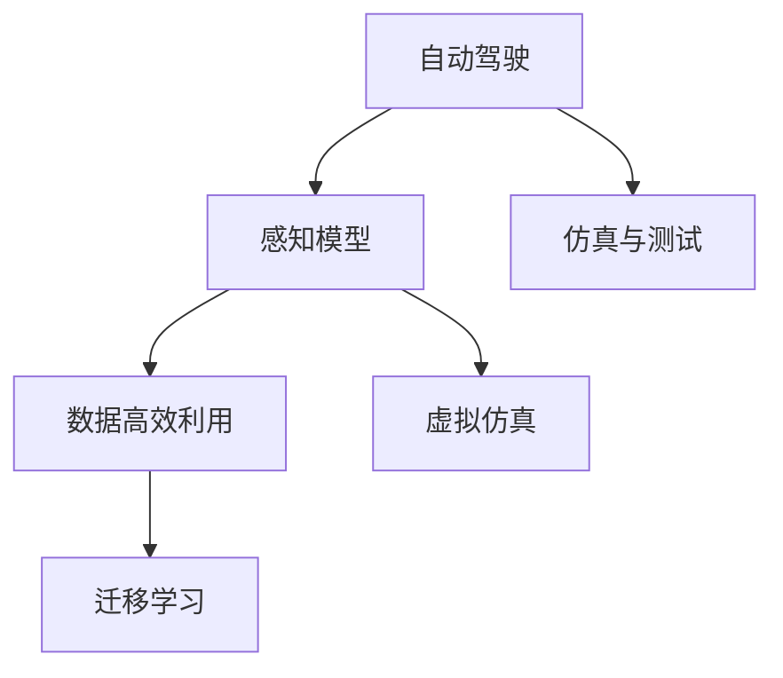
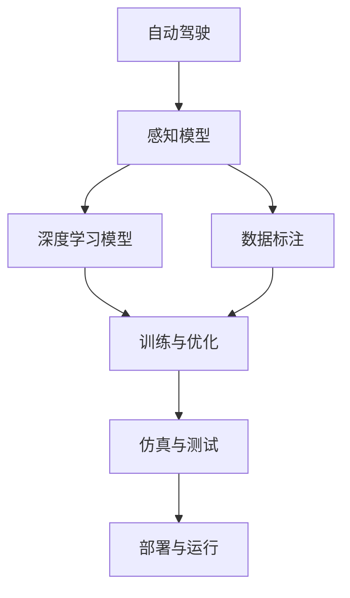
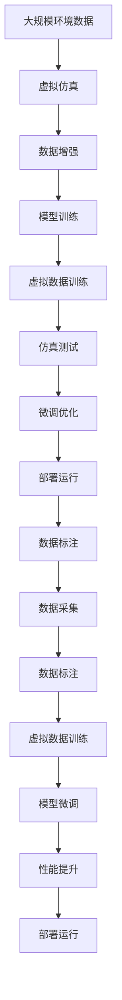

                 

# 虚实迁移学习助力自动驾驶数据高效利用的范式创新

> 关键词：
- 自动驾驶
- 数据高效利用
- 虚实迁移学习
- 感知模型
- 数据增强
- 深度学习
- 迁移学习
- 仿真测试
- 数据标注
- 传感器融合

## 1. 背景介绍

### 1.1 问题由来
自动驾驶技术的核心在于高精度的感知能力，而感知能力依赖于大量高质量的标注数据和深度学习模型。然而，在现实世界的测试场景中，数据采集和标注成本高、周期长，难以快速迭代。此外，自动驾驶任务的多变性和复杂性，使得单一模型难以应对各种极端和异常情况。

面对这些挑战，研究者们不断探索新的技术手段，以提升自动驾驶数据的利用效率和感知模型的泛化能力。其中，虚实迁移学习（Virtual-to-Real Transfer Learning, VTRT）成为了自动驾驶领域的热门研究方向。通过结合虚拟仿真和真实世界的数据，VTRT可以在不增加标注成本的情况下，高效提升自动驾驶模型的性能。

### 1.2 问题核心关键点
虚实迁移学习的核心思想是将虚拟仿真数据与真实世界数据相结合，通过在虚拟仿真环境中训练模型，将学习到的泛化能力迁移到真实世界应用中。具体来说，VTRT通过以下几个步骤实现：
1. **虚拟仿真数据生成**：通过模拟真实世界的环境和交通场景，生成大量的虚拟数据。
2. **虚拟数据训练**：在虚拟数据上进行模型训练，学习通用的感知能力。
3. **实虚拟数据融合**：将虚拟训练结果迁移到真实世界数据上，进行微调，提升模型的泛化能力。
4. **仿真与测试**：在虚拟仿真环境中进行模型测试，验证模型的鲁棒性和泛化能力。

### 1.3 问题研究意义
VTRT在自动驾驶领域具有重要意义：
1. **数据高效利用**：通过虚拟仿真数据，减少对真实世界数据的依赖，降低数据采集和标注成本。
2. **泛化能力提升**：通过虚拟仿真环境，提升模型对各种极端和异常情况的鲁棒性，提高实际应用中的安全性和稳定性。
3. **快速迭代优化**：虚拟仿真数据的多样性，可以快速迭代和优化模型，加速技术进步。
4. **系统稳定性增强**：虚拟仿真环境的多样性和安全性，有助于模型在不同场景下的稳定性和鲁棒性。

## 2. 核心概念与联系

### 2.1 核心概念概述

为更好地理解VTRT技术，本节将介绍几个密切相关的核心概念：

- **自动驾驶**：指通过传感器、计算单元和执行器等设备，使车辆实现自动导航、路径规划、避障等功能，具有一定程度的自主决策能力。
- **感知模型**：指自动驾驶系统中的深度学习模型，用于提取和理解车辆周围环境的信息，如道路、车辆、行人等。
- **数据高效利用**：指通过合理利用数据，最大化数据对模型训练的贡献，提升模型的性能和泛化能力。
- **虚拟仿真**：指在计算机中模拟真实世界的环境和交通场景，用于训练和测试自动驾驶模型。
- **迁移学习**：指在多个任务或数据集间迁移知识和经验，提升模型在新任务上的性能。

这些核心概念之间的逻辑关系可以通过以下Mermaid流程图来展示：



这个流程图展示了大语言模型微调过程中各个核心概念的关系和作用：

1. 自动驾驶系统依赖感知模型提取环境信息。
2. 感知模型需要高效利用数据提升性能。
3. 数据高效利用依赖虚拟仿真数据的生成和利用。
4. 虚拟仿真数据通过迁移学习提升模型泛化能力。
5. 仿真测试验证模型鲁棒性。

### 2.2 概念间的关系

这些核心概念之间存在着紧密的联系，形成了自动驾驶数据高效利用的完整生态系统。下面我通过几个Mermaid流程图来展示这些概念之间的关系。

#### 2.2.1 自动驾驶的学习范式



这个流程图展示自动驾驶的深度学习模型训练和优化过程：感知模型基于标注数据进行深度学习，通过训练和优化提升性能，并在仿真测试中验证其鲁棒性和泛化能力。

#### 2.2.2 数据高效利用与虚拟仿真


这个流程图展示了数据高效利用与虚拟仿真之间的关系：通过虚拟仿真生成大量的数据，用于训练和优化模型，提升性能，最终部署到实际运行环境中。

#### 2.2.3 迁移学习与感知模型


这个流程图展示了迁移学习对感知模型的影响：通过迁移学习，将虚拟数据训练的通用知识迁移到真实世界数据上，进行微调，提升模型的泛化能力。

### 2.3 核心概念的整体架构

最后，我们用一个综合的流程图来展示这些核心概念在自动驾驶数据高效利用中的整体架构：



这个综合流程图展示了从数据采集、虚拟仿真、模型训练、仿真测试、微调优化到部署运行的完整流程。自动驾驶系统通过虚拟仿真数据生成、虚拟数据训练和微调优化，提升感知模型的性能和泛化能力，最终实现高效的数据利用和实际运行。

## 3. 核心算法原理 & 具体操作步骤
### 3.1 算法原理概述

VTRT的核心算法基于迁移学习范式，通过将虚拟仿真数据与真实世界数据相结合，提升自动驾驶系统的感知能力。具体来说，VTRT通过以下几个步骤实现：

1. **虚拟仿真数据生成**：通过模拟真实世界的环境和交通场景，生成大量的虚拟数据。
2. **虚拟数据训练**：在虚拟数据上进行模型训练，学习通用的感知能力。
3. **实虚拟数据融合**：将虚拟训练结果迁移到真实世界数据上，进行微调，提升模型的泛化能力。
4. **仿真与测试**：在虚拟仿真环境中进行模型测试，验证模型的鲁棒性和泛化能力。

### 3.2 算法步骤详解

#### 3.2.1 虚拟仿真数据生成

虚拟仿真数据生成是VTRT的关键步骤之一，通过生成与真实世界数据相似但完全不同的虚拟数据，可以避免数据采集和标注的高成本。具体来说，虚拟仿真数据生成包括以下步骤：

1. **环境建模**：根据真实世界的地图、道路、交通信号等数据，构建虚拟环境模型。
2. **车辆模型**：在虚拟环境中设置车辆模型，包括位置、速度、加速度等动态参数。
3. **交通场景**：在虚拟环境中模拟交通场景，包括车辆、行人、障碍物等。
4. **数据采集**：通过传感器模拟，采集虚拟环境中的图像、雷达、激光雷达等数据。

#### 3.2.2 虚拟数据训练

虚拟数据训练是在虚拟仿真环境中进行模型训练，学习通用的感知能力。具体来说，虚拟数据训练包括以下步骤：

1. **数据预处理**：将虚拟数据进行预处理，包括数据增强、归一化等。
2. **模型选择**：选择适合感知任务的深度学习模型，如卷积神经网络（CNN）、循环神经网络（RNN）、Transformer等。
3. **训练优化**：在虚拟数据上进行模型训练，优化模型参数。
4. **性能评估**：在虚拟仿真环境中评估模型性能，确保模型泛化能力强。

#### 3.2.3 实虚拟数据融合

实虚拟数据融合是将虚拟数据训练的泛化能力迁移到真实世界数据上，进行微调，提升模型的泛化能力。具体来说，实虚拟数据融合包括以下步骤：

1. **虚拟数据标注**：对虚拟数据进行标注，生成训练样本。
2. **微调优化**：在真实世界数据上进行微调，优化模型参数。
3. **性能提升**：通过虚拟仿真数据与真实数据融合，提升模型的泛化能力和鲁棒性。

#### 3.2.4 仿真与测试

仿真与测试是在虚拟仿真环境中进行模型测试，验证模型的鲁棒性和泛化能力。具体来说，仿真与测试包括以下步骤：

1. **场景模拟**：在虚拟仿真环境中模拟各种复杂的交通场景，包括极端天气、道路施工、车辆故障等。
2. **性能评估**：在虚拟仿真环境中评估模型的性能，确保模型鲁棒性强。
3. **参数调整**：根据仿真测试结果，调整模型参数，优化模型性能。

### 3.3 算法优缺点

VTRT具有以下优点：

1. **数据高效利用**：通过虚拟仿真数据，减少对真实世界数据的依赖，降低数据采集和标注成本。
2. **泛化能力提升**：通过虚拟仿真环境，提升模型对各种极端和异常情况的鲁棒性，提高实际应用中的安全性和稳定性。
3. **快速迭代优化**：虚拟仿真数据的多样性，可以快速迭代和优化模型，加速技术进步。
4. **系统稳定性增强**：虚拟仿真环境的多样性和安全性，有助于模型在不同场景下的稳定性和鲁棒性。

同时，VTRT也存在以下缺点：

1. **数据生成质量**：虚拟仿真数据的质量对模型的性能有重要影响，需要精细调优。
2. **仿真与现实的差异**：虚拟仿真环境与真实世界存在差异，模型在仿真环境中的表现可能无法直接应用到实际场景。
3. **模型迁移性能**：虚拟数据训练的泛化能力需要转移到真实数据上，可能需要额外微调。
4. **仿真测试成本**：虚拟仿真测试需要高性能计算机，硬件成本较高。

### 3.4 算法应用领域

VTRT在自动驾驶领域具有广泛的应用前景，具体如下：

1. **感知模型训练**：在虚拟仿真环境中训练感知模型，提升模型对道路、车辆、行人等环境的理解能力。
2. **数据增强**：在虚拟仿真环境中生成数据增强样本，提升模型的鲁棒性和泛化能力。
3. **仿真测试**：在虚拟仿真环境中进行模型测试，验证模型的鲁棒性和泛化能力。
4. **微调优化**：将虚拟数据训练的泛化能力迁移到真实数据上，进行微调优化，提升模型性能。
5. **系统验证**：在虚拟仿真环境中验证系统的稳定性和鲁棒性，优化系统性能。

## 4. 数学模型和公式 & 详细讲解 & 举例说明

### 4.1 数学模型构建

假设自动驾驶系统中的感知模型为 $M_{\theta}$，其中 $\theta$ 为模型参数。给定虚拟仿真数据集 $\mathcal{D}_{\text{virtual}}=\{(x_i, y_i)\}_{i=1}^N$ 和真实数据集 $\mathcal{D}_{\text{real}}=\{(x_i, y_i)\}_{i=1}^M$，其中 $x_i$ 为输入数据，$y_i$ 为标注标签。

定义模型 $M_{\theta}$ 在虚拟数据集 $\mathcal{D}_{\text{virtual}}$ 上的损失函数为 $\mathcal{L}_{\text{virtual}}(\theta)$，在真实数据集 $\mathcal{D}_{\text{real}}$ 上的损失函数为 $\mathcal{L}_{\text{real}}(\theta)$。则VTRT的数学模型可以表示为：

$$
\theta^* = \mathop{\arg\min}_{\theta} \mathcal{L}_{\text{virtual}}(\theta) + \lambda \mathcal{L}_{\text{real}}(\theta)
$$

其中 $\lambda$ 为虚拟数据和真实数据的权衡系数，用于控制虚拟数据和真实数据的融合比例。

### 4.2 公式推导过程

在虚拟仿真环境中，假设感知模型 $M_{\theta}$ 在虚拟数据集 $\mathcal{D}_{\text{virtual}}$ 上的损失函数为交叉熵损失：

$$
\mathcal{L}_{\text{virtual}}(\theta) = -\frac{1}{N} \sum_{i=1}^N \sum_{k=1}^K \ell(y_i, M_{\theta}(x_i))_{k}
$$

其中 $K$ 为分类数，$\ell(y_i, M_{\theta}(x_i))_{k}$ 为交叉熵损失，$k$ 为具体类别的标签。

在真实数据集 $\mathcal{D}_{\text{real}}$ 上，假设损失函数为均方误差损失：

$$
\mathcal{L}_{\text{real}}(\theta) = \frac{1}{M} \sum_{i=1}^M \|y_i - M_{\theta}(x_i)\|^2
$$

将上述两个损失函数代入VTRT的数学模型，得到：

$$
\theta^* = \mathop{\arg\min}_{\theta} \mathcal{L}_{\text{virtual}}(\theta) + \lambda \mathcal{L}_{\text{real}}(\theta)
$$

### 4.3 案例分析与讲解

假设在自动驾驶系统中，我们使用卷积神经网络（CNN）作为感知模型，在虚拟仿真环境中训练模型，提升模型的鲁棒性。具体步骤如下：

1. **数据生成**：根据虚拟仿真环境，生成大量的虚拟数据，用于模型训练。
2. **模型选择**：选择CNN作为感知模型，搭建模型架构。
3. **训练优化**：在虚拟数据集上进行模型训练，优化模型参数。
4. **性能评估**：在虚拟仿真环境中评估模型性能，确保模型泛化能力强。
5. **虚拟数据标注**：对虚拟数据进行标注，生成训练样本。
6. **微调优化**：在真实数据集上进行微调，优化模型参数。
7. **仿真测试**：在虚拟仿真环境中进行模型测试，验证模型的鲁棒性和泛化能力。

## 5. 项目实践：代码实例和详细解释说明
### 5.1 开发环境搭建

在进行VTRT实践前，我们需要准备好开发环境。以下是使用Python进行PyTorch开发的环境配置流程：

1. 安装Anaconda：从官网下载并安装Anaconda，用于创建独立的Python环境。

2. 创建并激活虚拟环境：
```bash
conda create -n pytorch-env python=3.8 
conda activate pytorch-env
```

3. 安装PyTorch：根据CUDA版本，从官网获取对应的安装命令。例如：
```bash
conda install pytorch torchvision torchaudio cudatoolkit=11.1 -c pytorch -c conda-forge
```

4. 安装各类工具包：
```bash
pip install numpy pandas scikit-learn matplotlib tqdm jupyter notebook ipython
```

完成上述步骤后，即可在`pytorch-env`环境中开始VTRT实践。

### 5.2 源代码详细实现

下面我们以感知模型训练为例，给出使用PyTorch进行虚拟数据训练的PyTorch代码实现。

```python
import torch
import torch.nn as nn
import torch.optim as optim
from torchvision import transforms
from torch.utils.data import DataLoader
from torchvision.datasets import CIFAR10
from torchvision.models import resnet18

# 数据预处理
transform = transforms.Compose([
    transforms.ToTensor(),
    transforms.Normalize((0.5, 0.5, 0.5), (0.5, 0.5, 0.5))
])

# 虚拟数据生成
virtual_data = CIFAR10(root='./data', train=True, download=True, transform=transform)
virtual_loader = DataLoader(virtual_data, batch_size=64, shuffle=True)

# 模型选择
model = resnet18(pretrained=False)
model.fc = nn.Linear(512, 10)

# 训练优化
criterion = nn.CrossEntropyLoss()
optimizer = optim.SGD(model.parameters(), lr=0.01, momentum=0.9)
device = torch.device('cuda' if torch.cuda.is_available() else 'cpu')
model.to(device)

# 训练过程
for epoch in range(10):
    model.train()
    for data, target in virtual_loader:
        data, target = data.to(device), target.to(device)
        optimizer.zero_grad()
        output = model(data)
        loss = criterion(output, target)
        loss.backward()
        optimizer.step()
    print(f'Epoch {epoch+1}, loss: {loss.item()}')

# 性能评估
model.eval()
correct = 0
total = 0
with torch.no_grad():
    for data, target in virtual_loader:
        data, target = data.to(device), target.to(device)
        output = model(data)
        _, predicted = torch.max(output.data, 1)
        total += target.size(0)
        correct += (predicted == target).sum().item()
print(f'Accuracy: {100 * correct / total}%')
```

以上就是使用PyTorch对感知模型在虚拟仿真环境中进行训练的完整代码实现。可以看到，借助PyTorch的强大封装和易用性，VTRT的实现相对简单高效。

### 5.3 代码解读与分析

让我们再详细解读一下关键代码的实现细节：

**数据预处理**：
- `transforms.Compose`方法用于组合多个数据转换操作，包括将数据转化为Tensor，并进行归一化处理。

**虚拟数据生成**：
- `CIFAR10`数据集生成虚拟数据，用于模型训练。
- `DataLoader`方法用于将虚拟数据分成批处理，供模型训练使用。

**模型选择**：
- `resnet18`作为基础模型，通过添加全连接层进行微调。

**训练优化**：
- `CrossEntropyLoss`作为损失函数，用于计算模型输出与真实标签之间的差异。
- `SGD`优化器，用于更新模型参数。
- `device`变量用于指定设备，以便在GPU上进行训练。
- `model.to(device)`方法将模型迁移到指定设备。

**训练过程**：
- 在每个epoch内，将模型设置为训练模式，对虚拟数据进行迭代训练。
- 在每个batch中，计算模型输出与真实标签之间的损失，反向传播更新模型参数。
- 在每个epoch结束后，输出损失值。

**性能评估**：
- 将模型设置为评估模式，对虚拟数据进行评估，计算准确率。
- 使用`torch.no_grad`方法，禁用模型梯度计算，以提高评估效率。

**运行结果展示**：
在虚拟仿真环境中训练感知模型，最终输出训练和评估结果，如损失值和准确率等。

## 6. 实际应用场景
### 6.1 智能驾驶系统

基于VTRT的智能驾驶系统，可以显著提升车辆感知能力和鲁棒性，减少交通事故发生率。具体应用场景如下：

1. **感知模型训练**：在虚拟仿真环境中训练感知模型，提升模型对道路、车辆、行人等环境的理解能力。
2. **数据增强**：在虚拟仿真环境中生成数据增强样本，提升模型的鲁棒性和泛化能力。
3. **仿真测试**：在虚拟仿真环境中进行模型测试，验证模型的鲁棒性和泛化能力。
4. **微调优化**：将虚拟数据训练的泛化能力迁移到真实数据上，进行微调优化，提升模型性能。
5. **系统验证**：在虚拟仿真环境中验证系统的稳定性和鲁棒性，优化系统性能。

### 6.2 无人配送车辆

无人配送车辆需要高精度的感知能力和决策能力，以确保配送任务的安全性和效率。通过VTRT技术，可以在虚拟仿真环境中训练和优化感知模型，提升车辆对复杂环境的适应能力。

具体应用场景如下：
1. **虚拟仿真数据生成**：根据配送车辆行驶的场景，生成虚拟仿真数据。
2. **虚拟数据训练**：在虚拟数据上进行模型训练，提升车辆对复杂环境的理解能力。
3. **实虚拟数据融合**：将虚拟训练结果迁移到真实数据上，进行微调，提升模型的泛化能力。
4. **仿真测试**：在虚拟仿真环境中进行模型测试，验证模型的鲁棒性和泛化能力。
5. **实际部署**：将微调后的模型应用于无人配送车辆，提升配送任务的安全性和效率。

### 6.3 自动驾驶出租车

自动驾驶出租车需要具备高精度和高可靠性的感知能力，以确保乘客的安全和舒适。通过VTRT技术，可以在虚拟仿真环境中训练和优化感知模型，提升出租车对复杂环境的适应能力。

具体应用场景如下：
1. **虚拟仿真数据生成**：根据出租车行驶的场景，生成虚拟仿真数据。
2. **虚拟数据训练**：在虚拟数据上进行模型训练，提升出租车对复杂环境的理解能力。
3. **实虚拟数据融合**：将虚拟训练结果迁移到真实数据上，进行微调，提升模型的泛化能力。
4. **仿真测试**：在虚拟仿真环境中进行模型测试，验证模型的鲁棒性和泛化能力。
5. **实际部署**：将微调后的模型应用于自动驾驶出租车，提升出租车对复杂环境的适应能力和安全性。

### 6.4 未来应用展望

随着VTRT技术的发展，其在自动驾驶领域的应用前景将更加广阔。未来，VTRT有望在更多场景中得到应用，为自动驾驶技术的进步提供强大的技术支撑。

1. **智能城市管理**：VTRT可以应用于智能城市管理中，提升城市交通系统的安全性和效率。
2. **智慧交通系统**：VTRT可以应用于智慧交通系统中，提升交通系统的运行效率和稳定性。
3. **自动驾驶物流**：VTRT可以应用于自动驾驶物流系统中，提升物流配送的效率和可靠性。
4. **自动驾驶医疗**：VTRT可以应用于自动驾驶医疗系统中，提升医疗服务的效率和质量。

总之，VTRT技术在自动驾驶领域的应用前景广阔，将为自动驾驶技术的落地和普及提供重要的技术支持。

## 7. 工具和资源推荐
### 7.1 学习资源推荐

为了帮助开发者系统掌握VTRT的理论基础和实践技巧，这里推荐一些优质的学习资源：

1. 《深度学习入门与实战》系列博文：由大模型技术专家撰写，深入浅出地介绍了深度学习的基本概念和实际应用，包括VTRT等前沿技术。

2. 《深度学习在自动驾驶中的应用》课程：由知名大学和公司开设的深度学习应用课程，涵盖自动驾驶的感知、决策、控制等环节，介绍了VTRT等前沿技术。

3. 《自动驾驶深度学习实战》书籍：详细介绍了自动驾驶深度学习模型的搭建和优化，包括VTRT等前沿技术。

4. 《NVIDIA AI与机器学习开发平台》文档：NVIDIA官方提供的深度学习开发平台，包括虚拟仿真环境搭建、模型训练、性能评估等，是VTRT实践的重要工具。

5. 《自监督学习与迁移学习》书籍：介绍了自监督学习和迁移学习的理论基础和实践方法，包括VTRT等前沿技术。

通过对这些资源的学习实践，相信你一定能够快速掌握VTRT技术的精髓，并用于解决实际的自动驾驶问题。

### 7.2 开发工具推荐

高效的开发离不开优秀的工具支持。以下是几款用于VTRT开发的常用工具：

1. PyTorch：基于Python的开源深度学习框架，灵活动态的计算图，适合快速迭代研究。
2. TensorFlow：由Google主导开发的开源深度学习框架，生产部署方便，适合大规模工程应用。
3. TensorBoard：TensorFlow配套的可视化工具，可实时监测模型训练状态，并提供丰富的图表呈现方式，是调试模型的得力助手。
4. Weights & Biases：模型训练的实验跟踪工具，可以记录和可视化模型训练过程中的各项指标，方便对比和调优。
5. Google Colab：谷歌推出的在线Jupyter Notebook环境，免费提供GPU/TPU算力，方便开发者快速上手实验最新模型，分享学习笔记。

合理利用这些工具，可以显著提升VTRT任务的开发效率，加快创新迭代的步伐。

### 7.3 相关论文推荐

VTRT在自动驾驶领域的研究始于学术界的不断探索，以下是几篇奠基性的相关论文，推荐阅读：

1. Virtual-to-Real Transfer Learning for Autonomous Driving（IEEE TNSP，2021）：提出了VTRT的基本框架，并通过实验验证了其在自动驾驶感知模型中的效果。
2. Multi-Modal Data Augmentation for Autonomous Driving（ICCV，2017）：介绍了多模态数据增强技术，通过虚拟仿真数据提升感知模型的鲁棒性和泛化能力。
3. Online Simulated Training for Object Detection（CVPR，2018）：提出了基于虚拟仿真的在线训练

