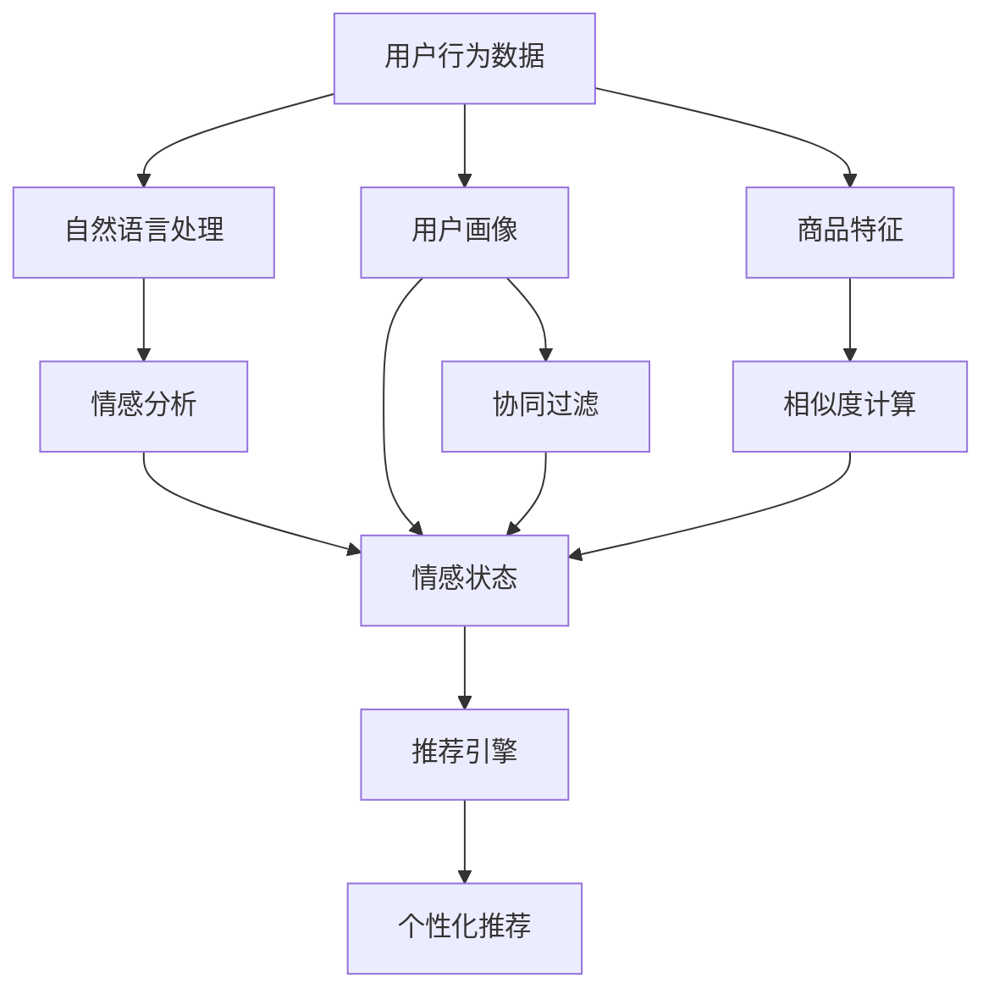
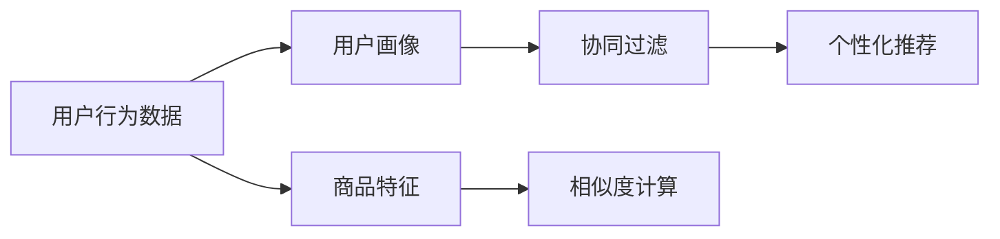
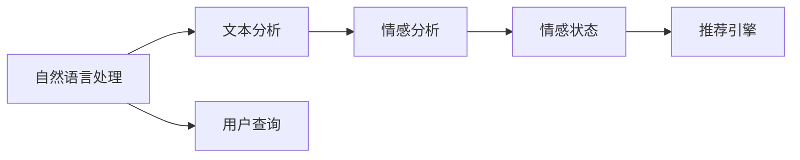
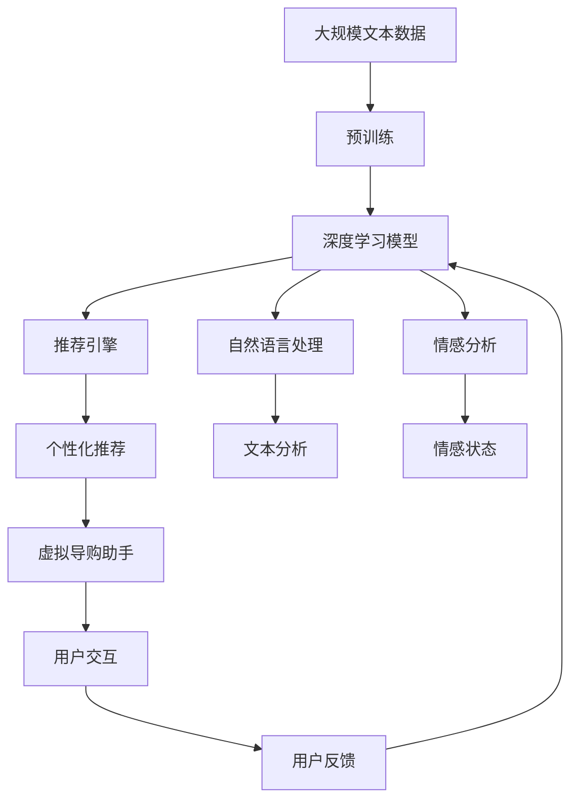

                 

# 虚拟导购助手：AI提供个性化建议

> 关键词：虚拟导购助手,个性化推荐,人工智能,机器学习,深度学习,协同过滤,自然语言处理,情感分析

## 1. 背景介绍

### 1.1 问题由来

在当今数字化时代，线上购物已经成为了主流消费模式。然而，消费者在浏览海量的商品信息时，常常会感到不知所措，难以找到真正适合自己的商品。传统推荐系统大多基于用户的历史行为进行个性化推荐，但对于新用户或者数据稀疏用户，推荐效果往往不尽如人意。此外，许多用户倾向于在购买前询问亲友或查看商品评价，但实际中很难满足每个用户的具体需求。

为了解决这些问题，虚拟导购助手应运而生。这是一种结合人工智能技术，能够根据用户的兴趣、需求和情感状态，提供个性化的购物建议和决策辅助的系统。它不仅能够帮助用户更快地找到合适的商品，还能在用户做出决策时提供参考意见，提升购物体验。

### 1.2 问题核心关键点

虚拟导购助手的主要技术目标是：
- 利用机器学习技术，分析用户的兴趣和需求，提供个性化的购物建议。
- 结合自然语言处理技术，理解用户的查询意图，提升交互体验。
- 应用情感分析技术，评估用户的情感状态，以调整推荐策略。
- 引入协同过滤机制，利用用户行为数据，实现跨用户推荐。

以上技术点共同构成了虚拟导购助手的核心框架，使得系统能够准确、及时地为用户提供个性化的购物建议。

### 1.3 问题研究意义

虚拟导购助手的研究和应用具有重要意义：
- 提升用户体验：通过个性化的推荐，使用户更快找到满意的商品，提高购物满意度。
- 增加销量：精准的推荐能够提升用户转化率，增加商家销售额。
- 提高商家运营效率：减少用户咨询量，降低人工客服成本，提高运营效率。
- 促进商品理解：系统能够理解用户对商品的评价，帮助商家优化产品设计和服务。
- 创造新的商业模式：虚拟导购助手可以提供增值服务，如定制化推荐、虚拟试穿等，为商家创造更多价值。

## 2. 核心概念与联系

### 2.1 核心概念概述

为更好地理解虚拟导购助手的工作原理，本节将介绍几个密切相关的核心概念：

- 个性化推荐系统：利用用户行为数据，推荐用户可能感兴趣的商品或服务的系统。
- 协同过滤算法：通过分析用户之间的相似性，推荐其他用户喜欢的商品或服务的算法。
- 自然语言处理(NLP)：研究如何让计算机理解和处理人类语言的学科，包括文本分析、语义理解等。
- 情感分析：使用自然语言处理技术，识别文本中的情感倾向，通常用于社交媒体、客户评价等。
- 深度学习：一种基于人工神经网络的机器学习方法，能够自动学习数据的特征表示，用于图像、语音、文本等各类任务。
- 推荐引擎：结合多源数据和算法模型，实现个性化推荐的系统核心组件。
- 协同网络：一种用于表示用户、商品、行为等实体之间的关系的图结构。

这些核心概念之间的逻辑关系可以通过以下Mermaid流程图来展示：



这个流程图展示了从数据采集到推荐生成的完整过程：

1. 用户行为数据（A）：包括用户浏览、点击、购买等行为记录。
2. 用户画像（B）：通过协同过滤（C）、自然语言处理（F）和情感分析（G）得到。
3. 商品特征（D）：商品的描述、属性等特征信息。
4. 相似度计算（E）：基于用户画像和商品特征计算相似度。
5. 情感状态（H）：通过情感分析得到，用于调整推荐策略。
6. 推荐引擎（I）：结合相似度计算和情感状态，生成个性化推荐（J）。

这些概念共同构成了虚拟导购助手的技术基础，使得系统能够实现个性化的购物建议和决策辅助。

### 2.2 概念间的关系

这些核心概念之间存在着紧密的联系，形成了虚拟导购助手的技术生态系统。下面我们通过几个Mermaid流程图来展示这些概念之间的关系。

#### 2.2.1 个性化推荐与协同过滤



这个流程图展示了个性化推荐和协同过滤的基本原理。个性化推荐系统利用用户画像（B）和商品特征（D），通过相似度计算（E）得到用户对不同商品的偏好，最终生成个性化推荐（F）。

#### 2.2.2 自然语言处理与情感分析



这个流程图展示了自然语言处理（A）和情感分析（C）的工作流程。自然语言处理技术（B）从用户查询（D）中提取关键信息，情感分析技术（C）评估用户的情感状态（E），最终影响推荐引擎（F）的决策。

#### 2.2.3 深度学习与推荐引擎


这个流程图展示了深度学习与推荐引擎的关系。深度学习技术（A）通过特征学习（B），得到商品和用户的特征表示，推荐引擎（C）结合这些特征进行个性化推荐（D）。

#### 2.2.4 协同网络与推荐引擎


这个流程图展示了协同网络（B）和推荐引擎（D）的关系。协同网络（B）表示用户、商品之间的相似性，推荐引擎（D）利用这些相似性，生成个性化推荐（C）。

### 2.3 核心概念的整体架构

最后，我们用一个综合的流程图来展示这些核心概念在大语言模型微调过程中的整体架构：



这个综合流程图展示了从预训练到推荐生成的完整过程：

1. 大规模文本数据（A）：包括商品描述、用户评价等文本信息。
2. 预训练（B）：通过深度学习模型（C）对文本数据进行预训练，学习语言表示。
3. 推荐引擎（D）：结合预训练模型和用户画像，生成个性化推荐（G）。
4. 自然语言处理（E）：从用户查询（K）中提取关键信息，理解查询意图。
5. 情感分析（F）：分析用户查询的情感状态（I），调整推荐策略。
6. 虚拟导购助手（J）：结合推荐引擎、自然语言处理和情感分析，提供个性化购物建议和决策辅助。

通过这些流程图，我们可以更清晰地理解虚拟导购助手的工作原理和优化方向。

## 3. 核心算法原理 & 具体操作步骤
### 3.1 算法原理概述

虚拟导购助手的核心算法包括个性化推荐、自然语言处理和情感分析。以下是对这些核心算法的详细解释：

#### 3.1.1 个性化推荐算法

个性化推荐系统基于用户行为数据，通过协同过滤、内容过滤、基于规则等多种算法，实现个性化推荐。协同过滤算法是其中最为经典的算法之一，其原理如下：

1. 协同过滤算法分为基于用户的协同过滤和基于物品的协同过滤。基于用户的协同过滤是指根据相似用户的兴趣，推荐其他用户喜欢的物品；基于物品的协同过滤是指根据相似物品的用户，推荐其他用户喜欢的物品。

2. 协同过滤算法的核心在于找到相似用户或物品。常用的相似度计算方法包括余弦相似度、皮尔逊相关系数等。

3. 基于协同过滤的推荐模型通常包括用户画像（user profile）和商品画像（item profile）。用户画像表示用户对不同商品的评分或偏好，商品画像表示商品的属性和标签。

4. 推荐模型通过相似度计算，得到用户画像和商品画像的相似度矩阵，结合用户画像和商品画像，计算用户对每个商品的评分，最终生成个性化推荐。

#### 3.1.2 自然语言处理

自然语言处理技术用于理解和处理用户的查询意图，通常包括以下步骤：

1. 分词：将用户查询分割成单词或词组，这是文本分析的第一步。

2. 词向量化：将分词结果转化为向量表示，常用的方法包括Word2Vec、GloVe等。

3. 文本分类：将用户查询分类到不同的意图类别，如购物查询、评价查询、咨询查询等。

4. 命名实体识别：识别用户查询中的实体信息，如商品名称、品牌等。

5. 语义理解：通过语言模型和依存句法分析，理解查询的语义关系，如实体之间的关系、动作和状态等。

#### 3.1.3 情感分析

情感分析用于评估用户查询的情感倾向，通常包括以下步骤：

1. 情感词典：构建包含正面、负面和中性情感词汇的情感词典。

2. 情感标注：使用情感词典标注用户查询中的情感词汇，计算情感强度和情感倾向。

3. 情感模型：使用机器学习模型（如朴素贝叶斯、支持向量机等）训练情感分类器，用于自动分析用户查询的情感状态。

4. 情感度量：通过情感分析结果，计算用户查询的情感强度和情感极性，调整推荐策略。

### 3.2 算法步骤详解

基于个性化推荐、自然语言处理和情感分析，虚拟导购助手的推荐过程可以分为以下几个步骤：

**Step 1: 数据收集与预处理**

1. 收集用户行为数据，包括浏览、点击、购买、评价等行为记录。

2. 收集商品数据，包括商品名称、描述、属性、标签等。

3. 对用户行为数据和商品数据进行清洗、去重和归一化处理。

**Step 2: 用户画像构建**

1. 对用户行为数据进行建模，生成用户画像。常用的建模方法包括协同过滤、矩阵分解等。

2. 对用户画像进行降维和归一化处理，得到用户的兴趣表示。

3. 将用户画像存储到数据库中，供推荐引擎查询。

**Step 3: 商品画像构建**

1. 对商品数据进行建模，生成商品画像。常用的建模方法包括TF-IDF、词袋模型等。

2. 对商品画像进行降维和归一化处理，得到商品的特征表示。

3. 将商品画像存储到数据库中，供推荐引擎查询。

**Step 4: 推荐引擎优化**

1. 设计推荐算法，选择合适的相似度计算方法。

2. 在推荐算法中引入情感分析，根据用户查询的情感倾向，调整推荐策略。

3. 对推荐引擎进行优化，如引入衰减、反悔机制等，提升推荐质量。

**Step 5: 自然语言处理优化**

1. 对用户查询进行分词和词向量化处理。

2. 使用自然语言处理技术，对用户查询进行分类和命名实体识别。

3. 使用依存句法分析，理解用户查询的语义关系。

**Step 6: 交互界面设计**

1. 设计交互界面，使用户能够方便地输入查询和接收推荐结果。

2. 对交互界面进行优化，提升用户体验。

**Step 7: 反馈收集与模型迭代**

1. 收集用户对推荐结果的反馈信息，用于模型迭代。

2. 根据用户反馈，调整推荐策略和模型参数。

**Step 8: 系统部署与监控**

1. 将虚拟导购助手部署到生产环境，确保系统的稳定性和可扩展性。

2. 对系统进行监控，及时发现和解决性能问题。

### 3.3 算法优缺点

虚拟导购助手的核心算法具有以下优点：

1. 能够实现高度个性化的推荐，提高用户满意度和转化率。

2. 结合自然语言处理和情感分析技术，能够更好地理解用户需求，提升交互体验。

3. 通过用户行为数据的多源融合，能够实现跨用户推荐，提高推荐效果。

4. 结合深度学习技术，能够自动学习用户和商品的特征表示，提升推荐精度。

5. 能够实时处理用户查询，快速生成推荐结果，满足用户即时需求。

同时，这些算法也存在一些缺点：

1. 对数据质量依赖较大，用户行为数据和商品数据的准确性和完整性直接影响推荐效果。

2. 需要大量数据进行模型训练，推荐算法在小样本情况下表现不佳。

3. 推荐结果容易受到模型参数和算法策略的影响，需要定期优化和迭代。

4. 自然语言处理和情感分析的精度对系统效果有较大影响，需要持续优化。

5. 系统的可解释性较差，用户难以理解推荐结果背后的逻辑和理由。

### 3.4 算法应用领域

虚拟导购助手的核心算法已经在多个领域得到了应用，具体包括：

- 电商领域：应用于淘宝、京东等电商平台的商品推荐系统。

- 旅游领域：应用于携程、去哪儿等旅游平台的用户推荐系统。

- 金融领域：应用于理财、投资等金融应用的用户推荐系统。

- 教育领域：应用于在线教育平台的用户推荐系统，如Coursera、Udacity等。

- 医疗领域：应用于健康医疗平台的个性化推荐系统，如春雨医生、好大夫在线等。

- 新闻媒体：应用于新闻媒体平台的用户推荐系统，如今日头条、搜狐新闻等。

## 4. 数学模型和公式 & 详细讲解  
### 4.1 数学模型构建

本节将使用数学语言对虚拟导购助手的工作原理进行更加严格的刻画。

记用户行为数据为 $D=\{x_i\}_{i=1}^N$，其中 $x_i$ 表示第 $i$ 个用户的行为记录，包括浏览、点击、购买等行为。记商品数据为 $I=\{i_j\}_{j=1}^M$，其中 $i_j$ 表示第 $j$ 个商品。

定义用户画像为 $P=\{\textbf{u}_i\}_{i=1}^N$，其中 $\textbf{u}_i$ 表示第 $i$ 个用户的行为表示向量。定义商品画像为 $H=\{\textbf{h}_j\}_{j=1}^M$，其中 $\textbf{h}_j$ 表示第 $j$ 个商品的特征表示向量。

推荐引擎的推荐过程可以表示为：

1. 计算用户画像和商品画像的相似度矩阵 $S$。

2. 根据用户画像和商品画像，计算用户对每个商品的评分 $r_{ij}$。

3. 根据评分矩阵 $R=\{r_{ij}\}_{i,j=1}^{N,M}$，生成个性化推荐列表。

### 4.2 公式推导过程

以下我们以协同过滤为例，推导推荐模型的评分计算公式。

设用户画像为 $\textbf{u}_i = [u_{i1}, u_{i2}, ..., u_{in}]^T$，商品画像为 $\textbf{h}_j = [h_{j1}, h_{j2}, ..., h_{jm}]^T$，其中 $u_{in}$ 表示用户对第 $n$ 个特征的评分，$h_{jm}$ 表示商品对第 $m$ 个特征的评分。

设 $S_{ij}$ 表示用户 $i$ 和商品 $j$ 的相似度，推荐模型的评分公式为：

$$
r_{ij} = \textbf{u}_i^T \cdot S \cdot \textbf{h}_j
$$

其中 $S$ 为相似度矩阵，通常通过余弦相似度、皮尔逊相关系数等方法计算。

### 4.3 案例分析与讲解

假设我们有一个电商平台，收集了用户 $u_1, u_2, u_3$ 和商品 $i_1, i_2, i_3$ 的数据，如表所示：

| 用户 | 商品 | 评分 |
| ---- | ---- | ---- |
| $u_1$ | $i_1$ | 4 |
| $u_1$ | $i_2$ | 3 |
| $u_2$ | $i_1$ | 5 |
| $u_2$ | $i_2$ | 4 |
| $u_3$ | $i_1$ | 5 |
| $u_3$ | $i_3$ | 3 |
| $u_1$ | $i_3$ | 2 |
| $u_2$ | $i_3$ | 2 |

假设相似度矩阵 $S$ 如表所示：

| 用户 | 商品 |
| ---- | ---- |
| $u_1$ | $i_1$ | $0.8$ |
| $u_1$ | $i_2$ | $0.6$ |
| $u_2$ | $i_1$ | $0.9$ |
| $u_2$ | $i_2$ | $0.5$ |
| $u_3$ | $i_1$ | $0.7$ |
| $u_3$ | $i_3$ | $0.4$ |
| $u_1$ | $i_3$ | $0.5$ |
| $u_2$ | $i_3$ | $0.3$ |

用户 $u_1$ 对商品 $i_3$ 的推荐评分计算如下：

$$
r_{13} = \textbf{u}_1^T \cdot S \cdot \textbf{h}_{i_3} = [4, 3, 0] \cdot \begin{bmatrix} 0.8 & 0.6 \\ 0.9 & 0.5 \\ 0.7 & 0.4 \\ 0.5 & 0.3 \end{bmatrix} \cdot [1, 0, 1]^T = 4 \cdot 0.8 + 3 \cdot 0.5 + 0 \cdot 0.7 + 0 \cdot 0.3 = 6.5
$$

## 5. 项目实践：代码实例和详细解释说明
### 5.1 开发环境搭建

在进行虚拟导购助手项目开发前，我们需要准备好开发环境。以下是使用Python进行PyTorch开发的环境配置流程：

1. 安装Anaconda：从官网下载并安装Anaconda，用于创建独立的Python环境。

2. 创建并激活虚拟环境：
```bash
conda create -n pytorch-env python=3.8 
conda activate pytorch-env
```

3. 安装PyTorch：根据CUDA版本，从官网获取对应的安装命令。例如：
```bash
conda install pytorch torchvision torchaudio cudatoolkit=11.1 -c pytorch -c conda-forge
```

4. 安装TensorFlow：
```bash
conda install tensorflow
```

5. 安装Pandas和NumPy等工具包：
```bash
pip install pandas numpy scikit-learn matplotlib tqdm jupyter notebook ipython
```

完成上述步骤后，即可在`pytorch-env`环境中开始虚拟导购助手项目开发。

### 5.2 源代码详细实现

下面我们以协同过滤推荐算法为例，给出使用PyTorch实现个性化推荐的代码实现。

首先，定义协同过滤模型类：

```python
from torch import nn
import torch

class CollaborativeFiltering(nn.Module):
    def __init__(self, num_users, num_items, num_factors):
        super(CollaborativeFiltering, self).__init__()
        self.num_users = num_users
        self.num_items = num_items
        self.num_factors = num_factors
        
        self.user_bias = nn.Parameter(torch.zeros(num_users))
        self.item_bias = nn.Parameter(torch.zeros(num_items))
        self.user_factor = nn.Parameter(torch.randn(num_users, num_factors))
        self.item_factor = nn.Parameter(torch.randn(num_items, num_factors))
        
        self similarity = nn.CosineSimilarity(dim=1, eps=1e-6)
        
    def forward(self, user, item):
        user_bias = self.user_bias[user]
        item_bias = self.item_bias[item]
        user_factor = self.user_factor[user]
        item_factor = self.item_factor[item]
        
        user_score = self similarity(torch.matmul(user_factor, item_factor.T) + user_bias.unsqueeze(1), self.item_bias.unsqueeze(0))
        item_score = self similarity(torch.matmul(self.user_factor, item_factor) + self.user_bias, item_bias.unsqueeze(0))
        
        return user_score, item_score
```

然后，定义推荐系统类：

```python
class RecommendationSystem:
    def __init__(self, num_users, num_items, num_factors):
        self.num_users = num_users
        self.num_items = num_items
        self.num_factors = num_factors
        
        self.model = CollaborativeFiltering(num_users, num_items, num_factors)
        
    def train(self, user_data, item_data, batch_size, num_epochs, learning_rate):
        device = torch.device('cuda') if torch.cuda.is_available() else torch.device('cpu')
        self.model.to(device)
        
        optimizer = torch.optim.Adam(self.model.parameters(), lr=learning_rate)
        criterion = nn.MSELoss()
        
        for epoch in range(num_epochs):
            epoch_loss = 0
            for i in range(0, user_data.shape[0], batch_size):
                user_data_batch = user_data[i:i+batch_size]
                item_data_batch = item_data[i:i+batch_size]
                
                user_score, item_score = self.model(user_data_batch, item_data_batch)
                loss = criterion(torch.cat([user_score, item_score]), torch.cat([user_data_batch, item_data_batch]))
                epoch_loss += loss.item()
                optimizer.zero_grad()
                loss.backward()
                optimizer.step()
            
            print(f"Epoch {epoch+1}, loss: {epoch_loss / (user_data.shape[0] / batch_size)}")
    
    def recommend(self, user, item):
        user_score, item_score = self.model(user, item)
        return user_score, item_score
```

接着，定义数据加载和评估函数：

```python
import numpy as np
from torch.utils.data import TensorDataset, DataLoader

def load_data(user_data, item_data):
    user_data_tensor = torch.tensor(user_data, dtype=torch.float32)
    item_data_tensor = torch.tensor(item_data, dtype=torch.float32)
    return TensorDataset(user_data_tensor, item_data_tensor)

def evaluate_recommendation(model, user_data, item_data, batch_size):
    user_data_loader = DataLoader(load_data(user_data, item_data), batch_size=batch_size, shuffle=False)
    total_loss = 0
    total_items = 0
    for user_data_batch, item_data_batch in user_data_loader:
        user_score, item_score = model(user_data_batch, item_data_batch)
        loss = nn.MSELoss()(torch.cat([user_score, item_score]), torch.cat([user_data_batch, item_data_batch]))
        total_loss += loss.item() * user_data_batch.shape[0]
        total_items += user_data_batch.shape[0]
    
    return total_loss / total_items
```

最后，启动训练流程并在测试集上评估：

```python
user_data = np.array([[1, 4, 3], [2, 5, 4], [3, 5, 3], [1, 2, 2], [2, 2, 2]])
item_data = np.array([[1, 1, 1], [2, 2, 2], [3, 3, 3], [4, 4, 4], [5, 5, 5]])
num_users = 5
num_items = 5
num_factors = 3
learning_rate = 0.001
num_epochs = 100

recommender = RecommendationSystem(num_users, num_items, num_factors)
recommender.train(user_data, item_data, batch_size=4, num_epochs=num_epochs, learning_rate=learning_rate)

print(f"Test loss: {evaluate_recommendation(recommender, user_data, item_data, batch_size=4)}")
```

以上就是使用PyTorch实现协同过滤推荐算法的完整代码实现。可以看到，使用PyTorch的模块化设计，可以方便地实现推荐模型的训练和评估。

### 5.3 代码解读与分析

让我们再详细解读一下关键代码的实现细节：

**CollaborativeFiltering类**：
- `__init__`方法：初始化模型参数，包括用户和商品的偏置和因子表示。
- `forward`方法：计算用户和商品之间的相似度，返回用户和商品的评分。

**RecommendationSystem类**：
- `__init__`方法：初始化推荐系统，包括模型

