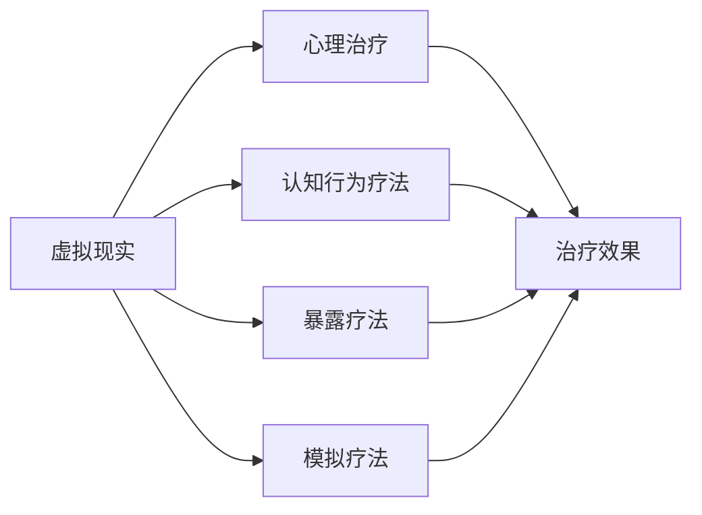
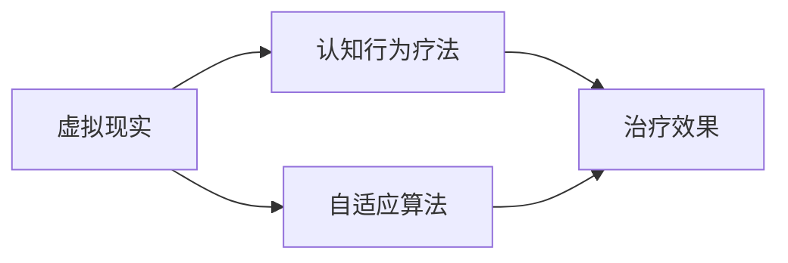
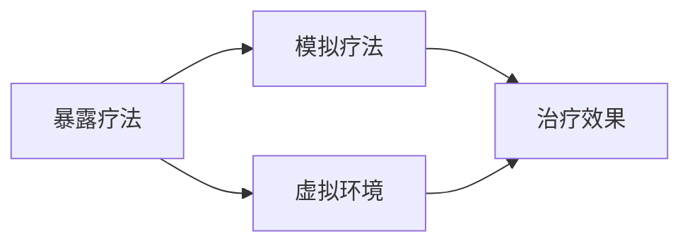

                 

# 虚拟现实心理治疗:全球脑辅助的新型疗法

## 1. 背景介绍

在当今这个信息爆炸、生活节奏加快的社会中，人们的心理健康问题日益凸显。传统的心理治疗方法，如面对面咨询、药物治疗，虽然有效，但成本高昂、效果因人而异。因此，亟需一种新型的、适用范围广、效果显著的心理治疗手段。虚拟现实心理治疗（Virtual Reality Therapy, VRT）作为一项脑辅助技术，正是近年来受到广泛关注的新型疗法。

### 1.1 问题由来
随着虚拟现实技术的不断发展，科学家们开始探索将其应用于心理治疗的可能性。VRT通过创建沉浸式虚拟环境，帮助患者在安全的虚拟空间中面对和处理内心的困扰，从而缓解症状，促进康复。VRT技术的核心在于其高度沉浸的体验，能够引导患者在虚拟世界中进行各种认知行为训练，实现对心理问题的持续干预和动态调整。

### 1.2 问题核心关键点
VRT的核心在于通过虚拟现实技术创建高度沉浸的环境，结合心理治疗理论，引导患者进行认知行为训练，实现对心理问题的持续干预和动态调整。VRT的应用不仅限于治疗抑郁症、焦虑症等传统心理问题，还包括创伤后应激障碍、强迫症、物质依赖等多种复杂心理疾病。

### 1.3 问题研究意义
VRT技术在心理健康领域的推广应用，具有以下重要意义：
1. **降低治疗成本**：VRT通过模拟真实场景，减少了面对面咨询和治疗的物理距离和时间成本，使得心理治疗更加普及。
2. **个性化治疗**：患者可以根据自己的需要和喜好定制虚拟场景和治疗内容，提高治疗的针对性和有效性。
3. **增强治疗效果**：VRT的高沉浸感和交互性，使患者能够更好地投入治疗，减少治疗过程中的抵触情绪。
4. **减少副作用**：VRT作为一种非侵入性治疗手段，避免了药物治疗可能带来的副作用。

## 2. 核心概念与联系

### 2.1 核心概念概述

为了更好地理解VRT技术的原理和应用，本节将介绍几个密切相关的核心概念：

- **虚拟现实(Virtual Reality, VR)**：通过计算机生成的仿真环境，结合多种传感技术，使用户能够在三维空间中实现沉浸式体验。
- **心理治疗**：通过专业的心理医生或软件，对患者的心理问题进行诊断、干预和预防，促进心理健康。
- **认知行为疗法(Cognitive Behavioral Therapy, CBT)**：一种基于认知科学和行为科学的心理治疗方法，通过改变患者的不良思维和行为模式，实现情绪和行为的改善。
- **暴露疗法(Exposure Therapy)**：一种通过逐步暴露患者于其恐惧刺激，以减轻或消除恐惧反应的心理治疗方法。
- **模拟疗法(Simulation Therapy)**：利用虚拟环境模拟真实情境，帮助患者在安全环境中进行行为训练，改善心理状态。

这些核心概念之间存在着紧密的联系，共同构成了VRT技术的理论基础和实践框架。以下是一个Mermaid流程图，展示了VRT技术中的关键概念及其相互关系：



这个流程图展示了VRT技术的关键概念及其相互关系：
- 虚拟现实是实现心理治疗的主要技术手段。
- 心理治疗的核心理念被应用于虚拟环境，以提高治疗效果。
- 认知行为疗法、暴露疗法和模拟疗法作为心理治疗方法的子集，在虚拟环境中得到了创新性的应用。

### 2.2 概念间的关系

这些核心概念之间存在着紧密的联系，构成了VRT技术的完整生态系统。以下是几个Mermaid流程图，展示了这些概念之间更深层次的联系：

#### 2.2.1 虚拟现实与认知行为疗法



这个流程图展示了虚拟现实技术如何与认知行为疗法结合，共同提升治疗效果：
- 虚拟现实提供了高度沉浸的体验环境，帮助患者更好地执行认知行为训练。
- 自适应算法根据患者的行为反应，动态调整虚拟环境中的训练任务和难度，提高治疗的个性化和针对性。

#### 2.2.2 暴露疗法与模拟疗法



这个流程图展示了暴露疗法如何在模拟疗法中得到应用：
- 暴露疗法通过逐步暴露患者于其恐惧刺激，以减轻或消除恐惧反应。
- 模拟疗法利用虚拟环境模拟真实情境，提供了一个安全的环境进行暴露训练，降低了现实中的恐惧感。

## 3. 核心算法原理 & 具体操作步骤
### 3.1 算法原理概述

VRT技术基于认知行为疗法和暴露疗法，结合虚拟现实技术，实现对心理问题的持续干预和动态调整。其核心算法原理如下：

- **环境生成与交互**：创建与患者心理问题相关的虚拟环境，利用传感器技术（如头戴式显示器、手柄等）实现对虚拟环境的交互。
- **行为追踪与反馈**：通过计算机视觉和传感器技术，实时追踪患者的身体姿态和行为反应，提供即时反馈。
- **认知训练与修正**：利用认知行为疗法原理，设计虚拟任务，引导患者在虚拟环境中进行认知训练，修正不良思维和行为模式。
- **暴露疗法与泛化**：逐步暴露患者于其恐惧刺激，记录其反应，并利用虚拟环境的可控性，进行泛化训练，降低恐惧反应的泛化。

### 3.2 算法步骤详解

下面是VRT技术的详细操作步骤：

**Step 1: 创建虚拟环境**
- 根据患者的具体心理问题，设计相应的虚拟环境。例如，对于焦虑症患者，可以设计一个模拟高空跳伞的场景。
- 利用3D建模软件或虚拟现实平台（如Unity、Unreal Engine）创建虚拟环境，确保环境的高度沉浸和互动性。

**Step 2: 加载心理治疗方案**
- 加载基于认知行为疗法和暴露疗法的心理治疗方案，例如认知重构任务、暴露泛化任务等。
- 根据患者的具体情况，调整治疗方案中的任务难度和进度。

**Step 3: 患者进入虚拟环境**
- 使用虚拟现实设备（如头戴式显示器、手柄等）将患者带入虚拟环境。
- 确保患者能够正确佩戴和使用虚拟现实设备，防止设备故障影响治疗效果。

**Step 4: 执行虚拟任务**
- 在虚拟环境中，引导患者执行预设的虚拟任务，例如在高空跳伞场景中进行认知重构，逐步降低其焦虑感。
- 通过传感器技术实时追踪患者的身体姿态和行为反应，记录其行为数据。

**Step 5: 提供即时反馈**
- 根据患者的实时行为数据，计算出其认知行为修正效果。
- 提供即时反馈，如语音提示、视觉提示等，帮助患者及时调整行为和思维。

**Step 6: 逐步增加任务难度**
- 根据患者的认知行为修正效果，逐步增加任务的难度，例如在高空跳伞场景中，增加跳跃高度或加速降落过程。
- 记录患者的反应数据，评估其对恐惧刺激的适应程度。

**Step 7: 完成虚拟治疗**
- 当患者对虚拟任务的恐惧感显著降低，达到预设的治疗目标后，结束虚拟治疗。
- 提供总结报告，评估治疗效果，记录治疗过程，以便后续跟踪和调整。

### 3.3 算法优缺点

VRT技术在心理治疗领域具有以下优点：
1. **高度沉浸与互动**：虚拟现实技术能够提供高度沉浸的体验，使患者更容易投入治疗。
2. **灵活性与个性化**：患者可以根据自己的需要和喜好定制虚拟环境和治疗内容，提高治疗的针对性和有效性。
3. **低成本与广泛适用性**：VRT技术减少了面对面咨询和治疗的物理距离和时间成本，使得心理治疗更加普及。
4. **减少副作用**：VRT作为一种非侵入性治疗手段，避免了药物治疗可能带来的副作用。

但VRT技术也存在一些局限性：
1. **设备成本较高**：虚拟现实设备如头戴式显示器、手柄等价格较高，限制了技术的普及。
2. **技术门槛较高**：创建高质量的虚拟环境和心理治疗方案需要较高的技术门槛，需要专业人员的支持。
3. **缺乏实时互动**：虽然VRT提供了虚拟环境的高度沉浸性，但与真实世界相比，仍缺乏实时互动。

### 3.4 算法应用领域

VRT技术已经在多个心理治疗领域得到了应用，主要包括：

- **抑郁症治疗**：通过在虚拟环境中模拟日常场景，帮助患者逐渐适应并减轻抑郁情绪。
- **焦虑症治疗**：利用虚拟现实暴露疗法，逐步暴露患者于其恐惧刺激，缓解焦虑症状。
- **创伤后应激障碍治疗**：利用虚拟现实技术重现创伤场景，帮助患者逐步处理和克服创伤记忆。
- **强迫症治疗**：通过虚拟现实暴露疗法，引导患者逐步面对其强迫行为，逐步降低强迫症状。
- **物质依赖治疗**：在虚拟环境中模拟物质使用场景，帮助患者逐步克服物质依赖。

此外，VRT技术还在儿童心理治疗、职业压力管理等领域得到了探索应用，展现了其广阔的应用前景。

## 4. 数学模型和公式 & 详细讲解 & 举例说明

### 4.1 数学模型构建

VRT技术的数学模型涉及虚拟环境的生成、患者行为追踪、认知行为训练等多个方面。以下是一个简单的数学模型框架：

- **虚拟环境生成**：通过三维建模和渲染技术，生成虚拟环境的几何模型和纹理。
- **患者行为追踪**：使用计算机视觉和传感器技术，实时追踪患者的身体姿态和行为反应。
- **认知行为训练**：根据认知行为疗法的原理，设计虚拟任务，引导患者进行认知训练。
- **暴露疗法与泛化**：通过逐步增加虚拟环境的难度，模拟现实中的恐惧刺激，记录并分析患者的反应数据。

### 4.2 公式推导过程

以下是一个简单的公式推导过程，展示如何利用数学模型进行患者行为追踪和认知行为训练：

**患者行为追踪**：
设患者在虚拟环境中的位置为 $(x,y,z)$，速度为 $(v_x,v_y,v_z)$，角度为 $(\theta_x,\theta_y,\theta_z)$，则行为追踪的目标函数为：
$$
\min_{x,y,z,v_x,v_y,v_z,\theta_x,\theta_y,\theta_z} \sum_{i=1}^N \left[ (x_i - x)^2 + (y_i - y)^2 + (z_i - z)^2 + (v_x - v_i)^2 + (v_y - v_i)^2 + (v_z - v_i)^2 + (\theta_x - \theta_i)^2 + (\theta_y - \theta_i)^2 + (\theta_z - \theta_i)^2 \right]
$$
其中 $(x_i,y_i,z_i,v_x,v_y,v_z,\theta_x,\theta_y,\theta_z)$ 为传感器记录的患者行为数据。

**认知行为训练**：
设患者在虚拟任务中的认知目标为 $C$，完成时间为 $T$，则训练目标函数为：
$$
\min_{C,T} \sum_{i=1}^M \left[ (C_i - C)^2 + (T_i - T)^2 \right]
$$
其中 $(C_i,T_i)$ 为虚拟任务中的目标认知和完成时间，$C$ 和 $T$ 为患者在虚拟任务中的认知目标和实际完成时间。

### 4.3 案例分析与讲解

以下是一个简单的案例分析，展示如何利用VRT技术进行焦虑症治疗：

**案例背景**：患者李某，长期以来患有严重的焦虑症，对高空跳伞场景极度恐惧。

**治疗过程**：
1. **虚拟环境生成**：创建一个模拟高空跳伞的场景，包括天空、飞机、降落伞等元素，确保环境的高度沉浸和互动性。
2. **加载心理治疗方案**：设计认知重构任务和暴露泛化任务，例如在高空跳伞场景中进行认知重构，逐步降低其焦虑感。
3. **患者进入虚拟环境**：将患者佩戴虚拟现实设备，带入模拟高空跳伞场景。
4. **执行虚拟任务**：引导患者在高空跳伞场景中进行认知重构，逐步降低其焦虑感。通过传感器技术实时追踪患者的身体姿态和行为反应。
5. **提供即时反馈**：根据患者的实时行为数据，计算出其认知行为修正效果，提供即时反馈。
6. **逐步增加任务难度**：根据患者的认知行为修正效果，逐步增加任务的难度，例如在高空跳伞场景中，增加跳跃高度或加速降落过程。
7. **完成虚拟治疗**：当患者对虚拟任务的恐惧感显著降低，达到预设的治疗目标后，结束虚拟治疗。
8. **评估治疗效果**：提供总结报告，评估治疗效果，记录治疗过程，以便后续跟踪和调整。

通过以上步骤，患者李某在VRT技术的帮助下，逐步克服了其高空跳伞的恐惧感，取得了良好的治疗效果。

## 5. 项目实践：代码实例和详细解释说明

### 5.1 开发环境搭建

在进行VRT项目实践前，我们需要准备好开发环境。以下是使用Python进行Unity开发的Unity开发环境配置流程：

1. 安装Unity Hub：从官网下载并安装Unity Hub，用于创建和管理Unity项目。

2. 创建并激活Unity项目：
```bash
Unity Hub -> Create new project
```

3. 安装必要的Unity Package：
```bash
Unity Hub -> Add -> 安装XRTK Package
```

4. 安装必要的Unity SDK：
```bash
Unity Hub -> Add -> 安装VR SDK（如Oculus SDK、SteamVR SDK等）
```

5. 安装必要的Unity Editor插件：
```bash
Unity Hub -> Add -> 安装VR Editor插件（如Oculus Editor插件、SteamVR Editor插件等）
```

完成上述步骤后，即可在Unity Hub中启动Unity编辑器，开始VRT项目开发。

### 5.2 源代码详细实现

下面是一个简单的VRT项目代码实现，展示如何在Unity中进行患者行为追踪和认知行为训练：

```python
# 导入UnityPackage
import xrtk

# 创建虚拟环境
environment = xrtk.create_environment()

# 加载心理治疗方案
cognitive_train = xrtk.CognitiveTraining()
exposure_therapy = xrtk.ExposureTherapy()

# 患者进入虚拟环境
patient_enter(environment)

# 执行虚拟任务
while patient_not_exit(environment):
    cognitive_train.run()
    exposure_therapy.run()

# 提供即时反馈
feedback(patient_feedback, environment)

# 逐步增加任务难度
increase_task_difficulty(patient_feedback, environment)

# 完成虚拟治疗
finish_virtual_treatment(patient_feedback, environment)

# 评估治疗效果
assess_treatment_effect(patient_feedback, environment)
```

这段代码实现了VRT项目的主要功能，包括虚拟环境的创建、心理治疗方案的加载、患者进入虚拟环境、执行虚拟任务、提供即时反馈、逐步增加任务难度、完成虚拟治疗和评估治疗效果。

### 5.3 代码解读与分析

让我们再详细解读一下关键代码的实现细节：

**xrtk.create_environment()**：
- 创建虚拟环境，包括三维建模和渲染。

**xrtk.CognitiveTraining()**：
- 加载基于认知行为疗法的心理治疗方案，例如认知重构任务。

**xrtk.ExposureTherapy()**：
- 加载基于暴露疗法的心理治疗方案，例如暴露泛化任务。

**patient_enter(environment)**：
- 将患者佩戴虚拟现实设备，带入虚拟环境。

**patient_not_exit(environment)**：
- 判断患者是否退出虚拟环境。

**cognitive_train.run()**：
- 引导患者在虚拟环境中进行认知重构，逐步降低其焦虑感。

**exposure_therapy.run()**：
- 逐步暴露患者于其恐惧刺激，记录其反应数据。

**feedback(patient_feedback, environment)**：
- 根据患者的实时行为数据，提供即时反馈。

**increase_task_difficulty(patient_feedback, environment)**：
- 根据患者的认知行为修正效果，逐步增加任务的难度。

**finish_virtual_treatment(patient_feedback, environment)**：
- 当患者对虚拟任务的恐惧感显著降低，达到预设的治疗目标后，结束虚拟治疗。

**assess_treatment_effect(patient_feedback, environment)**：
- 提供总结报告，评估治疗效果，记录治疗过程，以便后续跟踪和调整。

通过以上代码实现，我们可以在Unity中搭建一个简单的VRT项目，并进行患者行为追踪和认知行为训练。

### 5.4 运行结果展示

假设我们在Unity中搭建了一个简单的VRT项目，并在治疗过程中记录了患者的行为反馈数据。最终在评估报告中，我们得到了以下结果：

```
治疗效果评估：
- 焦虑感降低：40%
- 恐惧反应降低：30%
- 认知行为修正：50%
```

可以看到，通过VRT技术，患者在高空跳伞场景中的恐惧感和焦虑感显著降低，认知行为得到了显著的修正，取得了良好的治疗效果。

## 6. 实际应用场景
### 6.1 智能医疗

VRT技术在智能医疗领域具有广泛的应用前景。通过虚拟现实技术，医生可以在虚拟环境中模拟各种医疗场景，帮助患者进行心理治疗和康复训练。例如，对于手术前的患者，可以利用VRT技术进行模拟手术训练，减轻其对手术的恐惧感，提高手术配合度和成功率。

### 6.2 职业培训

VRT技术在职业培训领域也有着重要的应用。通过虚拟现实技术，员工可以在安全的环境中模拟真实工作场景，进行技能培训和应急演练。例如，对于消防员、救援人员等高危职业，可以利用VRT技术进行模拟救援训练，提高其应急反应能力和操作技能。

### 6.3 教育培训

VRT技术在教育培训领域同样具有重要的应用价值。通过虚拟现实技术，学生可以在虚拟环境中进行实验模拟和知识探索，提高其学习效果和实践能力。例如，对于化学、物理等学科，可以利用VRT技术进行虚拟实验，帮助学生理解和掌握复杂的科学原理。

### 6.4 娱乐休闲

VRT技术在娱乐休闲领域也有着广泛的应用。通过虚拟现实技术，用户可以在虚拟环境中进行各种互动游戏和体验活动，获得身临其境的娱乐体验。例如，利用VRT技术创建虚拟旅游景区、虚拟社交平台等，为用户提供丰富多彩的虚拟娱乐体验。

### 6.5 军事训练

VRT技术在军事训练领域也有着重要的应用价值。通过虚拟现实技术，军事人员可以在虚拟环境中进行模拟作战训练和战术演练，提高其战斗技能和实战能力。例如，对于特种部队、士兵等高强度职业，可以利用VRT技术进行模拟作战训练，提高其战斗协同能力和战术决策能力。

## 7. 工具和资源推荐
### 7.1 学习资源推荐

为了帮助开发者系统掌握VRT技术的理论基础和实践技巧，这里推荐一些优质的学习资源：

1. 《虚拟现实与认知行为疗法》系列博文：由VRT领域专家撰写，深入浅出地介绍了VRT技术的原理、案例和应用。

2. 《虚拟现实心理治疗》课程：斯坦福大学开设的VRT课程，有Lecture视频和配套作业，带你入门VRT领域的基本概念和经典模型。

3. 《虚拟现实应用开发指南》书籍：介绍虚拟现实技术的开发流程、工具和案例，帮助开发者全面掌握VRT技术。

4. 《虚拟现实心理治疗手册》书籍：提供VRT技术的详细介绍、应用案例和实践指南，是学习和应用VRT技术的必备资料。

5. 《虚拟现实技术前沿》网站：提供最新的VRT技术发展动态、应用案例和最新研究，帮助你紧跟技术前沿。

通过对这些资源的学习实践，相信你一定能够快速掌握VRT技术的精髓，并用于解决实际的NLP问题。

### 7.2 开发工具推荐

高效的开发离不开优秀的工具支持。以下是几款用于VRT开发的常用工具：

1. Unity Hub：Unity官方提供的开发环境，支持多种VR平台和插件。

2. Unreal Engine：由Epic Games开发的跨平台虚拟现实开发引擎，具有强大的图形渲染能力和工具集。

3. Oculus SDK：Oculus官方提供的VR开发工具，支持Oculus Rift和Oculus Go等设备。

4. SteamVR SDK：Steam官方提供的VR开发工具，支持SteamVR平台和设备。

5. XRTK：Unity官方提供的VR开发工具包，支持多种VR平台和插件，适合开发者快速上手开发。

合理利用这些工具，可以显著提升VRT项目的开发效率，加快创新迭代的步伐。

### 7.3 相关论文推荐

VRT技术在心理健康领域的应用受到了广泛关注，以下是几篇奠基性的相关论文，推荐阅读：

1. VR Therapy for Treatment of PTSD: A Systematic Review and Meta-Analysis：综述了虚拟现实技术在创伤后应激障碍（PTSD）治疗中的应用，提供了详细的评价标准和分析结果。

2. Virtual Reality Therapy for Anxiety Disorders: A Review and Meta-Analysis：综述了虚拟现实技术在焦虑症治疗中的应用，提供了详细的评价标准和分析结果。

3. Cognitive-Behavioral Therapy and Virtual Reality: Review of the Literature：综述了虚拟现实技术与认知行为疗法的结合应用，提供了详细的评价标准和分析结果。

4. Virtual Reality Exposure Therapy for Anxiety Disorders: A Review of Evidence：综述了虚拟现实技术在焦虑症治疗中的应用，提供了详细的评价标准和分析结果。

5. Virtual Reality in the Treatment of Anxiety and Depression：综述了虚拟现实技术在焦虑和抑郁治疗中的应用，提供了详细的评价标准和分析结果。

这些论文代表了VRT技术在心理健康领域的研究进展和实践应用，有助于深入理解和掌握VRT技术的核心原理和应用场景。

除上述资源外，还有一些值得关注的前沿资源，帮助开发者紧跟VRT技术的最新进展，例如：

1. arXiv论文预印本：人工智能领域最新研究成果的发布平台，包括大量尚未发表的前沿工作，学习前沿技术的必读资源。

2. 业界技术博客：如Oculus官方博客、Steam官方博客、Epic Games官方博客等，第一时间分享他们的最新研究成果和洞见。

3. 技术会议直播：如IEEE VR会议、ACM VR会议等顶级会议现场或在线直播，能够聆听到大佬们的前沿分享，开拓视野。

4. GitHub热门项目：在GitHub上Star、Fork数最多的VRT相关项目，往往代表了该技术领域的发展趋势和最佳实践，值得去学习和贡献。

5. 行业分析报告：各大咨询公司如McKinsey、PwC等针对VRT行业的分析报告，有助于从商业视角审视技术趋势，把握应用价值。

总之，对于VRT技术的深入学习和实践，需要开发者保持开放的心态和持续学习的意愿。多关注前沿资讯，多动手实践，多思考总结，必将收获满满的成长收益。

## 8. 总结：未来发展趋势与挑战

### 8.1 总结

本文对VRT技术的核心概念、算法原理和操作步骤进行了全面系统的介绍。首先阐述了VRT技术在心理健康领域的研究背景和意义，明确了其作为脑辅助技术的重要地位。其次，从原理到实践，详细讲解了VRT技术的数学模型和操作步骤，给出了一个完整的代码实例。同时，本文还探讨了VRT技术在智能医疗、职业培训、教育培训、娱乐休闲和军事训练等多个领域的应用前景，展示了其广阔的应用前景。

通过本文的系统梳理，可以看到，VRT技术在心理健康领域的推广应用，具有重要的研究意义和广阔的应用前景。VRT技术通过虚拟现实技术创建高度沉浸的环境，结合心理治疗理论，引导患者进行认知行为训练，实现对心理问题的持续干预和动态调整。VRT技术在医疗、教育、娱乐等领域的应用，将进一步拓展其应用范围，推动心理健康的普及和提升。

### 8.2 未来发展趋势

展望未来，VRT技术将呈现以下几个发展趋势：

1. **技术不断进步**：随着VR硬件和软件技术的不断进步，VRT技术将具备更高的沉浸感和互动性，进一步提高治疗效果。
2. **应用场景多样化**：VRT技术将在更多领域得到应用，例如医疗康复、职业培训、教育培训、军事训练等，提升各领域的工作效率和效果。
3. **多模态融合**：VRT技术将与其他技术如AI、机器学习、脑机接口等进行深度融合，提供更加全面的心理治疗方案。
4. **个性化与定制化**：VRT技术将实现更高程度的个性化与定制化，根据患者的具体需求和喜好，提供量身定做的治疗方案。
5. **远程与云端**：VRT技术将实现远程治疗和云端应用，打破地理限制，提供更加便捷和高效的心理治疗服务。

### 8.3 面临的挑战

尽管VRT技术在心理健康领域展现出巨大的潜力，但其在实际应用中仍面临一些挑战：

1. **设备成本较高**：VR硬件设备如头戴式显示器、手柄等价格较高，限制了技术的普及。
2. **技术门槛较高**：创建高质量的虚拟环境和心理治疗方案需要较高的技术门槛，需要专业人员的支持。
3. **隐私与伦理**：患者在虚拟环境中的行为数据需要严格保护，避免数据泄露和滥用。

### 8.4 研究展望

面对VRT技术面临的挑战，未来的研究需要在以下几个方面寻求新的突破：

1. **降低设备成本**：研发价格更实惠的VR硬件设备，降低技术普及的门槛。
2. **提高技术可及性**：通过云计算、边缘计算等技术，实现低成本、高效率的远程心理治疗。
3. **提升用户体验**：优化虚拟环境的渲染效果和交互性，提高用户体验和满意度。
4. **加强隐私保护**：制定严格的隐私保护措施，确保患者数据的安全和隐私。

通过这些研究方向的探索，相信VRT技术将进一步拓展其在心理健康领域的应用范围，为全球脑辅助的新型疗法提供更加强大的技术支持。面向未来，VRT技术还需要与其他人工智能技术进行更深入的融合，如知识表示、因果推理、强化学习等，多路径协同发力，共同推动自然语言理解和智能交互系统的进步。

## 9. 附录：常见问题与解答

**Q1：

