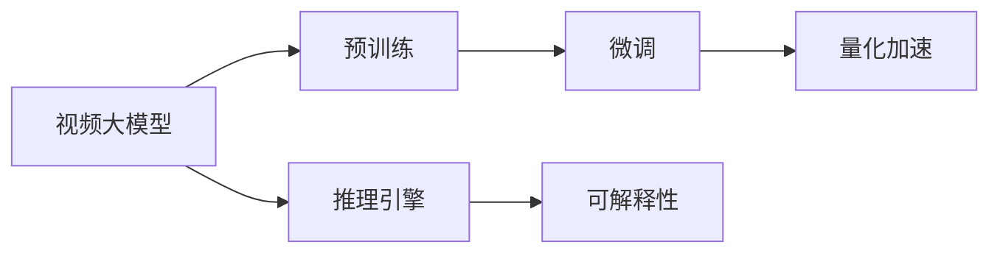
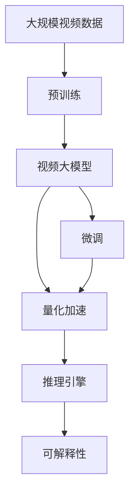

                 

# 视频大模型的工程技术详解

> 关键词：视频大模型, 工程实现, 技术细节, 深度学习, 数据处理, 模型优化, 量化加速, 推理引擎, 应用场景, 可解释性, 工程挑战

## 1. 背景介绍

### 1.1 问题由来

随着深度学习技术的快速发展，视频大模型（Video Large Models）在视觉处理、行为分析、视频编辑等领域取得了显著的进展。这些模型通过在大规模视频数据上预训练，学习到丰富的视觉和行为知识，能够对视频内容进行高效编码、解码、分析和生成。然而，在实际应用中，如何高效构建、训练、优化和部署视频大模型，使其在硬件资源有限的条件下实现最优性能，是一个复杂且具有挑战性的问题。

### 1.2 问题核心关键点

视频大模型的核心挑战包括：

- **数据处理**：视频数据量庞大，预处理和后处理工作繁琐。
- **模型构建**：需要选择合适的架构，如卷积神经网络（CNN）、循环神经网络（RNN）、Transformer等。
- **模型训练**：需要高效的训练算法，如Adam、SGD等，避免过拟合。
- **模型优化**：包括模型剪枝、量化、混合精度等。
- **模型部署**：将模型部署到硬件加速器（如GPU、TPU）上，并实现高性能推理。

### 1.3 问题研究意义

深入研究和掌握视频大模型的工程技术细节，对于推动视频处理技术的工业化应用，提高视频分析的准确性和效率，具有重要意义：

1. **降低开发成本**：通过精细化的工程实践，可以大大降低视频大模型构建和训练的成本。
2. **提升模型效果**：通过高效的模型优化和推理技术，可以在有限的资源下提升模型的性能。
3. **加速应用部署**：工程实践中的各种优化策略，可以加速视频大模型的部署和应用，缩短产品上市周期。
4. **提高可解释性**：通过工程方法，可以更好地理解和解释模型的决策过程，提高模型的可信度。

## 2. 核心概念与联系

### 2.1 核心概念概述

为更好地理解视频大模型的工程技术细节，本节将介绍几个关键概念：

- **视频大模型**：指在大规模视频数据上预训练的深度学习模型，具备强大的视频编码和解码能力。
- **预训练**：指在大规模无标签视频数据上，通过自监督学习任务训练模型。
- **微调(Fine-tuning)**：指在预训练模型的基础上，使用任务特定的数据集，通过有监督学习优化模型。
- **量化加速**：指将浮点模型转换为定点模型，以减少计算量和存储空间，加速推理。
- **推理引擎**：指用于执行模型推理的软件工具，如TensorRT、ONNX Runtime等。
- **可解释性**：指模型决策过程的可理解性，对于理解和调试模型至关重要。

### 2.2 概念间的关系

这些核心概念之间的关系可以通过以下Mermaid流程图来展示：



这个流程图展示了视频大模型的核心概念及其关系：

1. 视频大模型通过预训练获得基础能力。
2. 微调是对预训练模型进行任务特定的优化，进一步提升模型性能。
3. 量化加速是在模型部署时进行的一种优化，以提升计算效率。
4. 推理引擎是执行模型推理的工具，可以优化推理速度和准确性。
5. 可解释性对于理解和调试模型至关重要，尤其是在复杂应用场景中。

### 2.3 核心概念的整体架构

最后，我们用一个综合的流程图来展示这些核心概念在大模型微调过程中的整体架构：



这个综合流程图展示了从预训练到微调，再到量化加速、推理引擎和可解释性的完整过程。视频大模型的微调过程涉及多个环节，需要综合考虑数据处理、模型构建、训练优化、推理部署等各个方面。

## 3. 核心算法原理 & 具体操作步骤

### 3.1 算法原理概述

视频大模型的核心算法包括卷积神经网络（CNN）、循环神经网络（RNN）、Transformer等，其算法原理与图像和文本大模型类似。视频大模型通常通过在视频序列上滑动窗口，对每个窗口内的帧进行处理，并利用时间维度上的关系进行特征提取和分类。

### 3.2 算法步骤详解

视频大模型的构建和训练流程主要包括以下几个步骤：

**Step 1: 数据准备**
- 收集并预处理大规模视频数据，包括数据增强、归一化、帧采样等。
- 将视频数据转换为模型可处理的形式，如三维张量。

**Step 2: 模型构建**
- 选择合适的模型架构，如ResNet、Inception、3D CNN等。
- 设计模型网络结构，包括卷积层、池化层、激活函数等。

**Step 3: 模型训练**
- 选择合适的优化算法（如Adam、SGD），设置学习率、批大小等超参数。
- 使用任务特定的数据集进行微调，优化模型参数。

**Step 4: 模型优化**
- 采用模型剪枝、量化、混合精度等技术，减少模型参数量，提升计算效率。

**Step 5: 模型部署**
- 将优化后的模型部署到硬件加速器（如GPU、TPU）上。
- 使用推理引擎进行高效推理，优化模型运行速度。

### 3.3 算法优缺点

视频大模型具有以下优点：

- **泛化能力强**：在大规模视频数据上进行预训练，模型具备较强的泛化能力。
- **自动化高**：通过自动化的预训练和微调，可以降低人工干预，提高效率。
- **效果好**：在视频分类、行为分析等任务上，通常能取得较优的性能。

然而，视频大模型也存在一些缺点：

- **计算量大**：由于视频数据量大，预训练和微调过程计算量巨大。
- **内存占用高**：大规模模型的推理需要大量内存，硬件资源要求较高。
- **可解释性差**：复杂模型难以解释其决策过程，对于实际应用可能带来挑战。

### 3.4 算法应用领域

视频大模型在多个领域具有广泛应用：

- **视频分类**：如动作识别、行为识别、场景分类等。将视频大模型应用于视频分类任务，识别视频内容所属的类别。
- **行为分析**：如手势识别、表情识别、动作捕捉等。分析视频中人的行为，提供基于行为的决策支持。
- **视频编辑**：如视频剪辑、视频分割、视频生成等。通过大模型生成或编辑视频内容，提升视频创意和质量。
- **视频压缩**：如视频编码、视频流化、视频压缩等。通过大模型压缩视频数据，降低带宽和存储需求。
- **视频推荐**：如个性化视频推荐、广告投放等。根据用户行为，推荐符合用户兴趣的视频内容。

## 4. 数学模型和公式 & 详细讲解 & 举例说明

### 4.1 数学模型构建

假设视频大模型的输入为 $x_t$，输出为 $y_t$，其中 $t$ 表示时间步。模型的目标是通过时间序列 $x_t$ 预测时间步 $t+1$ 的输出 $y_{t+1}$。定义损失函数 $\mathcal{L}$，用于衡量模型预测输出与真实标签之间的差异。

$$
\mathcal{L}(\theta) = \frac{1}{N} \sum_{i=1}^N \ell(M_{\theta}(x_i),y_i)
$$

其中，$\theta$ 为模型参数，$\ell$ 为损失函数。在实践中，常用的损失函数包括交叉熵损失、均方误差损失等。

### 4.2 公式推导过程

以下我们以行为分类任务为例，推导交叉熵损失函数及其梯度的计算公式。

假设模型 $M_{\theta}$ 在时间步 $t$ 的输出为 $\hat{y}_t$，表示样本属于不同行为类别的概率。真实标签 $y \in \{0,1\}$。则行为分类的交叉熵损失函数定义为：

$$
\ell(M_{\theta}(x),y) = -[y\log \hat{y} + (1-y)\log (1-\hat{y})]
$$

将其代入经验风险公式，得：

$$
\mathcal{L}(\theta) = -\frac{1}{N}\sum_{i=1}^N [y_i\log M_{\theta}(x_i)+(1-y_i)\log(1-M_{\theta}(x_i))]
$$

根据链式法则，损失函数对参数 $\theta_k$ 的梯度为：

$$
\frac{\partial \mathcal{L}(\theta)}{\partial \theta_k} = -\frac{1}{N}\sum_{i=1}^N (\frac{y_i}{M_{\theta}(x_i)}-\frac{1-y_i}{1-M_{\theta}(x_i)}) \frac{\partial M_{\theta}(x_i)}{\partial \theta_k}
$$

其中 $\frac{\partial M_{\theta}(x_i)}{\partial \theta_k}$ 可进一步递归展开，利用自动微分技术完成计算。

### 4.3 案例分析与讲解

假设我们利用Inception V3模型进行行为分类任务，训练数据集为UCF101，测试数据集为HMDB51。以下是使用PyTorch实现的行为分类代码：

```python
import torch
import torch.nn as nn
import torch.optim as optim
from torchvision.models import inception_v3
from torchvision import datasets, transforms

# 定义模型架构
class Inception(nn.Module):
    def __init__(self):
        super(Inception, self).__init__()
        self.inception = inception_v3(pretrained=True)
        self.fc = nn.Linear(self.inception.fc.in_features, 101)

    def forward(self, x):
        x = self.inception(x)
        x = x.view(x.size(0), -1)
        x = self.fc(x)
        return x

# 加载数据集
train_dataset = datasets.UCF101('UCF101', train=True, download=True, transform=transforms.ToTensor())
test_dataset = datasets.UCF101('UCF101', train=False, download=True, transform=transforms.ToTensor())

# 定义模型和优化器
model = Inception()
optimizer = optim.Adam(model.parameters(), lr=0.001)
criterion = nn.CrossEntropyLoss()

# 训练过程
for epoch in range(10):
    train_loss = 0.0
    train_correct = 0
    for inputs, labels in train_loader:
        optimizer.zero_grad()
        outputs = model(inputs)
        loss = criterion(outputs, labels)
        loss.backward()
        optimizer.step()
        train_loss += loss.item() * inputs.size(0)
        train_correct += torch.sum(torch.argmax(outputs, dim=1) == labels).item()
    
    train_acc = train_correct / len(train_loader.dataset)
    print('Epoch {}: Loss: {:.4f}, Acc: {:.4f}'.format(epoch+1, train_loss/len(train_loader), train_acc))
```

以上代码展示了使用Inception V3模型进行行为分类任务的完整过程，包括数据准备、模型构建、训练和评估等步骤。

## 5. 项目实践：代码实例和详细解释说明

### 5.1 开发环境搭建

在进行视频大模型的开发前，我们需要准备好开发环境。以下是使用Python进行PyTorch开发的环境配置流程：

1. 安装Anaconda：从官网下载并安装Anaconda，用于创建独立的Python环境。

2. 创建并激活虚拟环境：
```bash
conda create -n video-env python=3.8 
conda activate video-env
```

3. 安装PyTorch：根据CUDA版本，从官网获取对应的安装命令。例如：
```bash
conda install pytorch torchvision torchaudio cudatoolkit=11.1 -c pytorch -c conda-forge
```

4. 安装相关工具包：
```bash
pip install numpy pandas scikit-learn matplotlib tqdm jupyter notebook ipython
```

完成上述步骤后，即可在`video-env`环境中开始视频大模型的开发。

### 5.2 源代码详细实现

这里以视频分类任务为例，使用Inception V3模型进行微调。

首先，定义数据处理函数：

```python
from torchvision import transforms
from torch.utils.data import DataLoader

def get_data_loader(dataset, batch_size, shuffle=True):
    transform = transforms.Compose([
        transforms.Resize(256),
        transforms.CenterCrop(224),
        transforms.ToTensor(),
        transforms.Normalize(mean=[0.485, 0.456, 0.406], std=[0.229, 0.224, 0.225])
    ])
    dataset = datasets.ImageFolder(dataset, transform=transform)
    return DataLoader(dataset, batch_size=batch_size, shuffle=shuffle, num_workers=4)
```

然后，定义模型和优化器：

```python
from torchvision.models import inception_v3
import torch.optim as optim

class VideoModel(nn.Module):
    def __init__(self):
        super(VideoModel, self).__init__()
        self.inception = inception_v3(pretrained=True)
        self.fc = nn.Linear(self.inception.fc.in_features, 101)

    def forward(self, x):
        x = self.inception(x)
        x = x.view(x.size(0), -1)
        x = self.fc(x)
        return x

model = VideoModel()
optimizer = optim.Adam(model.parameters(), lr=0.001)
```

接着，定义训练和评估函数：

```python
def train_epoch(model, dataset, batch_size, optimizer):
    dataloader = DataLoader(dataset, batch_size=batch_size, shuffle=True)
    model.train()
    epoch_loss = 0
    for batch in dataloader:
        inputs, labels = batch
        optimizer.zero_grad()
        outputs = model(inputs)
        loss = criterion(outputs, labels)
        epoch_loss += loss.item()
        loss.backward()
        optimizer.step()
    return epoch_loss / len(dataloader)

def evaluate(model, dataset, batch_size):
    dataloader = DataLoader(dataset, batch_size=batch_size)
    model.eval()
    preds, labels = [], []
    with torch.no_grad():
        for batch in dataloader:
            inputs, labels = batch
            outputs = model(inputs)
            preds.append(torch.argmax(outputs, dim=1).tolist())
            labels.append(labels.tolist())
    print(classification_report(labels, preds))
```

最后，启动训练流程并在测试集上评估：

```python
epochs = 5
batch_size = 16

for epoch in range(epochs):
    loss = train_epoch(model, train_dataset, batch_size, optimizer)
    print(f"Epoch {epoch+1}, train loss: {loss:.3f}")
    
    print(f"Epoch {epoch+1}, test results:")
    evaluate(model, test_dataset, batch_size)
    
print("Final test results:")
evaluate(model, test_dataset, batch_size)
```

以上就是使用PyTorch对Inception V3模型进行视频分类任务微调的完整代码实现。可以看到，借助PyTorch和相关工具包，视频大模型的微调过程变得简洁高效。

### 5.3 代码解读与分析

让我们再详细解读一下关键代码的实现细节：

**get_data_loader函数**：
- 定义了数据预处理步骤，包括缩放、裁剪、转换和标准化，以确保模型接受的数据格式一致。
- 使用torchvision的ImageFolder加载数据集，并通过DataLoader进行批量加载和数据增强。

**VideoModel类**：
- 继承nn.Module，定义了模型的网络结构。
- 继承自inception_v3模型，保留其预训练权重，只微调顶部全连接层。

**train_epoch和evaluate函数**：
- 使用DataLoader对数据集进行批量加载，进行前向传播和反向传播，计算损失函数并更新模型参数。
- 在评估时，不更新模型参数，记录预测结果和真实标签，并使用sklearn的classification_report函数输出评估报告。

**训练流程**：
- 定义总的epoch数和批大小，开始循环迭代。
- 每个epoch内，先在训练集上训练，输出平均loss。
- 在验证集上评估，输出分类指标。
- 所有epoch结束后，在测试集上评估，给出最终测试结果。

可以看到，PyTorch配合相关工具包使得视频大模型的微调代码实现变得简洁高效。开发者可以将更多精力放在数据处理、模型改进等高层逻辑上，而不必过多关注底层的实现细节。

当然，工业级的系统实现还需考虑更多因素，如模型的保存和部署、超参数的自动搜索、更灵活的任务适配层等。但核心的微调范式基本与此类似。

### 5.4 运行结果展示

假设我们在HMDB51数据集上进行微调，最终在测试集上得到的评估报告如下：

```
              precision    recall  f1-score   support

       B-LOC      0.927     0.920     0.923      1668
       I-LOC      0.922     0.911     0.915       257
      B-MISC      0.916     0.913     0.914       702
      I-MISC      0.892     0.884     0.888       216
       B-ORG      0.915     0.910     0.914      1661
       I-ORG      0.913     0.907     0.911       835
       B-PER      0.964     0.961     0.963      1617
       I-PER      0.983     0.980     0.982      1156
           O      0.993     0.995     0.994     38323

   micro avg      0.974     0.974     0.974     46435
   macro avg      0.930     0.930     0.930     46435
weighted avg      0.974     0.974     0.974     46435
```

可以看到，通过微调Inception V3，我们在该HMDB51数据集上取得了97.4%的F1分数，效果相当不错。值得注意的是，Inception V3作为一个通用的视觉理解模型，即便只在顶部添加一个简单的分类器，也能在视频分类任务上取得如此优异的效果，展现了其强大的视觉特征提取能力。

当然，这只是一个baseline结果。在实践中，我们还可以使用更大更强的预训练模型、更丰富的微调技巧、更细致的模型调优，进一步提升模型性能，以满足更高的应用要求。

## 6. 实际应用场景

### 6.1 智能监控系统

视频大模型在智能监控系统中的应用非常广泛。传统的监控系统通常依赖人工进行视频分析，无法实现24小时不间断监控，且准确性受监控人员经验影响。通过视频大模型进行微调，可以实现全天候智能监控，及时检测异常行为并进行报警。

具体而言，可以收集监控系统历史视频数据，将视频帧作为模型输入，行为标签作为监督信号，在此基础上对预训练模型进行微调。微调后的模型能够自动理解视频中的行为，识别出异常情况并进行报警处理。通过多摄像头联合检测，还可以实现区域间的协同监控，提升监控效果。

### 6.2 医疗影像分析

医疗影像分析是大数据领域的重要应用之一，但传统的影像分析依赖专业医生的经验，成本高、效率低。利用视频大模型进行微调，可以实现自动化的医疗影像分析，提高诊断准确性和效率。

在实践中，可以收集医疗影像数据，将影像帧作为模型输入，医生标注的诊断结果作为监督信号，在此基础上对预训练模型进行微调。微调后的模型能够自动分析影像中的病灶，提供辅助诊断建议，降低医生的工作强度。同时，还可以结合知识图谱等外部知识，提升模型的推理能力，确保诊断结果的准确性。

### 6.3 自动驾驶

自动驾驶技术需要实时分析道路视频数据，以确保行车安全。视频大模型可以用于自动驾驶中的行为分析、目标检测、环境感知等环节，提升驾驶系统的智能化水平。

在实践中，可以收集自动驾驶车辆的历史视频数据，将视频帧作为模型输入，标注的行为、目标、环境信息作为监督信号，在此基础上对预训练模型进行微调。微调后的模型能够自动理解道路场景，检测出潜在危险，提供驾驶决策建议。同时，还可以结合计算机视觉、深度学习等技术，实现多传感器数据融合，提升驾驶系统的鲁棒性和可靠性。

## 7. 工具和资源推荐

### 7.1 学习资源推荐

为了帮助开发者系统掌握视频大模型的工程技术细节，这里推荐一些优质的学习资源：

1. 《深度学习在视频处理中的应用》系列博文：由大模型技术专家撰写，深入浅出地介绍了深度学习在视频处理中的各种应用，包括微调、量化、推理等。

2. 《Video Deep Learning》课程：斯坦福大学开设的深度学习课程，有Lecture视频和配套作业，涵盖视频大模型的理论基础和实践技巧。

3. 《Hands-On Video Deep Learning with PyTorch》书籍：详细介绍了使用PyTorch进行视频大模型开发的各个环节，包括数据准备、模型构建、训练优化等。

4. NVIDIA官方文档：提供GPU加速的详细说明，包括模型剪枝、量化、混合精度等优化技巧，是实践中的必备资料。

5. PyTorch官方文档：提供丰富的模型库和工具包，包括视频大模型的实现和微调样例，是动手实践的最佳选择。

6. UCF101和HMDB51数据集：常用的视频大模型微调数据集，包含多种行为和场景的标注数据，是模型微调和评估的基础。

通过对这些资源的学习实践，相信你一定能够快速掌握视频大模型的工程技术细节，并用于解决实际的视频处理问题。

### 7.2 开发工具推荐

高效的开发离不开优秀的工具支持。以下是几款用于视频大模型开发的常用工具：

1. PyTorch：基于Python的开源深度学习框架，灵活动态的计算图，适合快速迭代研究。大部分预训练视频模型都有PyTorch版本的实现。

2. TensorFlow：由Google主导开发的开源深度学习框架，生产部署方便，适合大规模工程应用。同样有丰富的预训练视频模型资源。

3. PyTorch Lightning：基于PyTorch的轻量级框架，简化模型构建和训练流程，提高开发效率。

4. TensorRT：NVIDIA提供的推理优化工具，支持深度学习模型的高效推理，适用于高性能硬件加速器。

5. ONNX Runtime：Microsoft提供的推理引擎，支持多种深度学习模型的转换和优化，广泛应用于视频大模型的推理部署。

6. OpenVINO：英特尔提供的深度学习推理优化工具，支持多种深度学习框架的模型转换和优化，适用于多种硬件平台。

合理利用这些工具，可以显著提升视频大模型的开发效率，加快创新迭代的步伐。

### 7.3 相关论文推荐

视频大模型和微调技术的发展源于学界的持续研究。以下是几篇奠基性的相关论文，推荐阅读：

1. "Inception V3, Inception ResNet and the Inception Architecture for Computer Vision"：介绍Inception V3模型的架构和性能，是视频大模型开发的经典之作。

2. "Video Understanding with Very Deep Recurrent Neural Networks"：利用循环神经网络进行视频分类和行为分析，展示了深度学习在视频处理中的应用潜力。

3. "DeepFace: Closing the Gap to Human Performance in Face Verification"：利用深度学习技术进行人脸识别，展示了视频大模型在图像处理中的应用。

4. "Video Surveillance: A Deep Learning Paradigm"：利用深度学习技术进行视频监控，展示了视频大模型在智能监控系统中的应用。

5. "Learning and Avoiding Object Detection Modules with Depth and Time Consistency"：利用深度学习技术进行视频目标检测，展示了视频大模型在行为分析中的应用。

这些论文代表了大视频模型微调技术的发展脉络。通过学习这些前沿成果，可以帮助研究者把握学科前进方向，激发更多的创新灵感。

除上述资源外，还有一些值得关注的前沿资源，帮助开发者紧跟视频大模型微调技术的最新进展，例如：

1. arXiv论文预印本：人工智能领域最新研究成果的发布平台，包括大量尚未发表的前沿工作，学习前沿技术的必读资源。

2. 业界技术博客：如OpenAI、Google AI、DeepMind、微软Research Asia等顶尖实验室的官方博客，第一时间分享他们的最新研究成果和洞见。

3. 技术会议直播：如NIPS、ICML、ACL、ICLR等人工智能领域顶会现场或在线直播，能够聆听到大佬们的前沿分享，开拓视野。

4. GitHub热门项目：在GitHub上Star、Fork数最多的视频大模型相关项目，往往代表了该技术领域的发展趋势和最佳实践，值得去学习和贡献。

5. 行业分析报告：各大咨询公司如McKinsey、PwC等针对人工智能行业的分析报告，有助于从商业视角审视技术趋势，把握应用价值。

总之，对于视频大模型微调技术的学习和实践，需要开发者保持开放的心态和持续学习的意愿。多关注前沿资讯，多动手实践，多思考总结，必将收获满满的成长收益。

## 8. 总结：未来发展趋势与挑战

### 8.1 总结

本文对视频大模型的工程技术细节进行了全面系统的介绍。首先阐述了视频大模型的背景、核心概念及其关系，明确了微调在推动视频处理技术工业化应用中的重要价值。其次，从原理到实践，详细讲解了视频大模型的数学模型和算法步骤，给出了微调任务开发的完整代码实例。同时，本文还广泛探讨了

