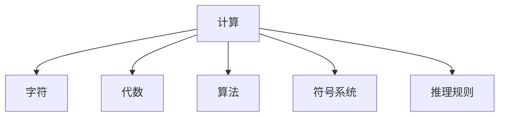
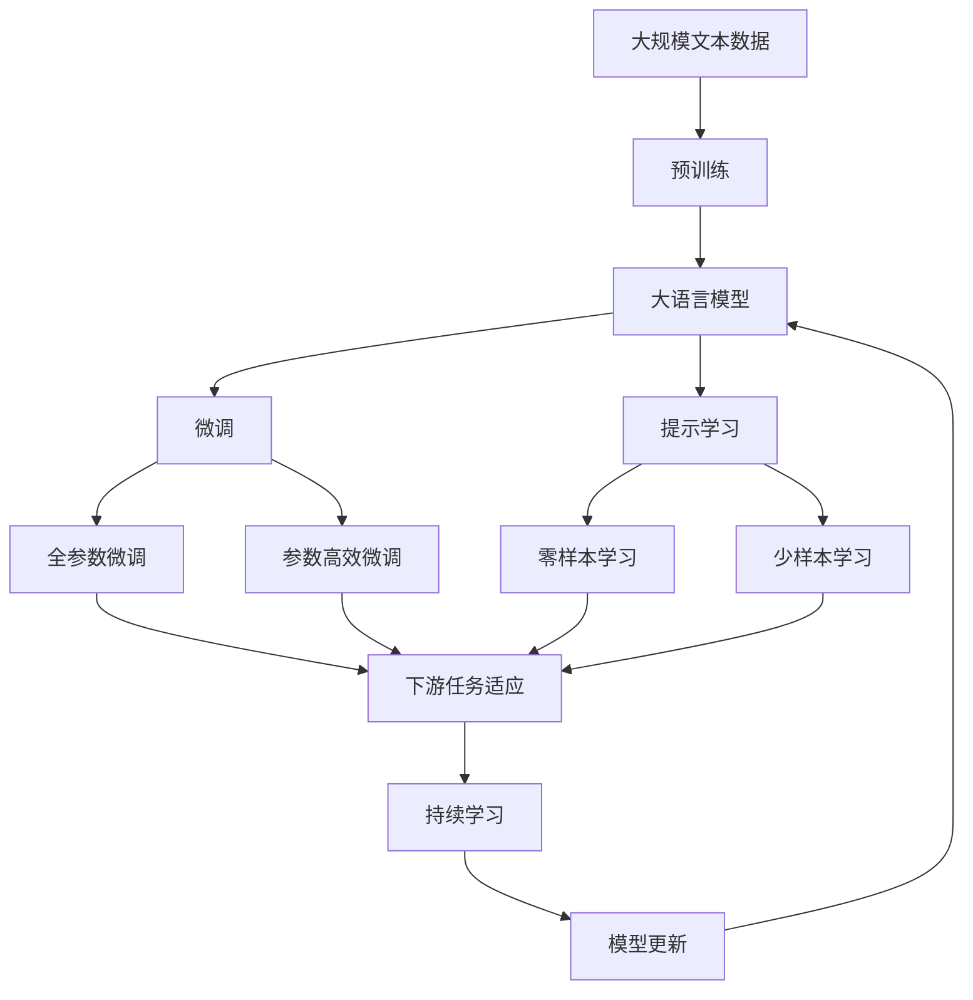

                 

# 计算：第一部分 计算的诞生 第 2 章 计算之术 代数：字符的计算

> 关键词：计算, 字符, 代数, 算法, 符号系统, 推理规则

## 1. 背景介绍

### 1.1 问题的由来
自古以来，人类就对计算有着浓厚的兴趣。从简单的加法、减法到复杂的代数运算，从数位系统到代数学，计算的足迹无处不在。随着信息技术的发展，计算在现代科技中扮演着越来越重要的角色。

然而，传统的计算方式往往依赖于手工或者机械操作，效率低下，错误率高。因此，人们开始探索更高效、更可靠的计算方法，进而推动了计算理论的发展。

### 1.2 核心概念
- **计算**：指通过符号操作、逻辑推导等方式解决问题的过程。
- **字符**：在计算机中，字符是数字和符号的基本单位，用于表示信息。
- **代数**：研究数学符号及其运算规则的学科。
- **算法**：解决特定问题的程序或步骤。
- **符号系统**：用于表示计算对象和操作的符号集合。
- **推理规则**：从已知条件推导出新结论的规则。

### 1.3 问题核心关键点
- **计算效率**：如何快速、准确地进行计算，是计算理论的重要研究方向。
- **算法复杂度**：算法执行的复杂度如何，决定了其时间复杂度和空间复杂度。
- **符号表示**：如何用符号表示计算对象和操作，是计算理论的基础。
- **推理规则**：如何设计合理的推理规则，以解决各种计算问题。

## 2. 核心概念与联系

### 2.1 核心概念概述

为了更好地理解本章内容，我们先对相关概念进行简单介绍。

- **计算**：计算是使用符号操作解决问题的过程。例如，通过加法、乘法等基本运算，计算出一个表达式或函数的值。
- **字符**：在计算机中，字符是数字和符号的基本单位，用于表示信息。例如，二进制中的0和1，拉丁字母中的字母和标点符号。
- **代数**：代数研究数学符号及其运算规则。例如，多项式、矩阵、向量等。
- **算法**：算法是解决特定问题的程序或步骤。例如，排序算法、搜索算法等。
- **符号系统**：符号系统是用于表示计算对象和操作的符号集合。例如，二进制系统、拉丁字母等。
- **推理规则**：推理规则是从已知条件推导出新结论的规则。例如，逻辑推理规则、代数规则等。

### 2.2 概念间的关系

这些核心概念之间的关系可以用以下Mermaid流程图来展示：



这个流程图展示了计算与各个核心概念之间的关系：

- 计算使用字符、代数和算法等工具来解决问题。
- 符号系统是计算的基础，用于表示计算对象和操作。
- 推理规则指导计算过程中的符号操作，使得问题得以解决。

### 2.3 核心概念的整体架构

最后，我们用一个综合的流程图来展示这些核心概念在大语言模型微调过程中的整体架构：



这个综合流程图展示了从预训练到微调，再到持续学习的完整过程。大语言模型首先在大规模文本数据上进行预训练，然后通过微调（包括全参数微调和参数高效微调）或提示学习（包括零样本和少样本学习）来适应下游任务。最后，通过持续学习技术，模型可以不断学习新知识，同时保持已学习的知识。

## 3. 核心算法原理 & 具体操作步骤
### 3.1 算法原理概述

基于符号系统的计算，是指使用符号表示计算对象和操作，通过推理规则来解决问题。这种计算方式可以追溯到古希腊的阿基米德、欧几里得等数学家，以及文艺复兴时期的伽利略、牛顿等物理学家。

在大语言模型微调中，我们使用符号系统来表示输入文本和任务，使用推理规则来计算模型输出。这种计算方式不仅能够处理复杂的符号操作，还能够适应各种不同的任务类型。

### 3.2 算法步骤详解

基于符号系统的计算，一般包括以下几个关键步骤：

1. **定义符号系统**：确定用于表示计算对象和操作的符号集合。例如，在二进制系统中，符号为0和1；在拉丁字母系统中，符号为字母和标点符号。
2. **构建推理规则**：设计从已知条件推导出新结论的规则。例如，加法、乘法等基本运算规则，逻辑推理规则等。
3. **符号操作**：通过符号操作来解决问题。例如，将符号按照推理规则组合，计算出表达式的值。
4. **输出结果**：将计算结果转换为实际问题中需要的形式。例如，将计算结果转换为数字、字符串等。

在基于符号系统的计算中，核心是符号操作和推理规则的设计。设计合理的符号系统和推理规则，可以大大提升计算的效率和精度。

### 3.3 算法优缺点

基于符号系统的计算具有以下优点：

- **灵活性**：符号系统可以根据具体问题进行调整，适用于各种不同的计算任务。
- **可解释性**：符号操作和推理规则具有明确的定义，便于理解和调试。
- **鲁棒性**：符号操作和推理规则不会受到计算精度、噪声等因素的影响。

同时，这种计算方式也存在一些缺点：

- **复杂性**：符号系统和推理规则的设计比较复杂，需要专业知识。
- **计算效率**：符号操作和推理规则的执行效率较低，需要较长的计算时间。
- **符号表示**：符号表示可能不够直观，容易产生歧义。

### 3.4 算法应用领域

基于符号系统的计算在多个领域得到了广泛应用，例如：

- **数学计算**：例如，代数运算、微积分运算、矩阵运算等。
- **逻辑推理**：例如，逻辑推理、自然语言推理等。
- **人工智能**：例如，专家系统、自然语言处理等。
- **编程语言**：例如，Lisp、Prolog等。

这些领域的应用，展示了基于符号系统的计算的强大潜力。随着计算理论的不断发展，基于符号系统的计算将继续在各个领域发挥重要作用。

## 4. 数学模型和公式 & 详细讲解  
### 4.1 数学模型构建

在大语言模型微调中，我们通常使用符号系统来表示输入文本和任务，使用推理规则来计算模型输出。

记输入文本为 $x$，输出结果为 $y$，符号系统为 $\mathcal{S}$，推理规则为 $\mathcal{R}$。则基于符号系统的计算过程可以表示为：

$$
y = \mathcal{F}(x, \mathcal{S}, \mathcal{R})
$$

其中，$\mathcal{F}$ 表示符号操作函数，用于将符号操作和推理规则应用于输入文本 $x$，得到输出结果 $y$。

### 4.2 公式推导过程

以二进制加法为例，推导基于符号系统的计算过程。

记符号为 $a,b$，则二进制加法的符号表示为：

$$
a + b = (a \oplus b) \oplus (a \& b) \& 2^k
$$

其中，$\oplus$ 表示异或运算，$\&$ 表示与运算，$k$ 表示进位。

根据符号操作和推理规则，二进制加法的计算过程如下：

1. **异或操作**：将两个符号进行异或运算，得到 $a \oplus b$。
2. **与操作**：将两个符号进行与运算，得到 $a \& b$。
3. **进位**：将与操作的结果左移一位，得到 $(a \& b) \& 2^k$。
4. **异或**：将异或操作的结果和进位结果进行异或运算，得到最终结果。

### 4.3 案例分析与讲解

以下是一个简单的符号计算案例：

假设符号系统为 $\mathcal{S} = \{a, b, c\}$，推理规则为 $\mathcal{R} = \{a + b = c, b + c = a\}$。

则计算 $a + b + c$ 的过程如下：

1. **第一步**：$a + b = c$
2. **第二步**：$b + c = a$
3. **第三步**：$c + a = b$

最终得到 $a + b + c = b$。

这个例子展示了基于符号系统的计算过程，通过符号操作和推理规则，我们可以得到正确的计算结果。

## 5. 项目实践：代码实例和详细解释说明
### 5.1 开发环境搭建

在进行符号系统计算实践前，我们需要准备好开发环境。以下是使用Python进行符号系统计算的环境配置流程：

1. 安装Anaconda：从官网下载并安装Anaconda，用于创建独立的Python环境。

2. 创建并激活虚拟环境：
```bash
conda create -n symbolic-env python=3.8 
conda activate symbolic-env
```

3. 安装必要的库：
```bash
pip install sympy
```

4. 安装相关的开发工具：
```bash
pip install ipykernel
```

完成上述步骤后，即可在`symbolic-env`环境中开始符号系统计算的实践。

### 5.2 源代码详细实现

下面以二进制加法为例，给出使用Sympy库进行符号系统计算的Python代码实现。

```python
from sympy import symbols, Eq, solve

# 定义符号
a, b, c = symbols('a b c')

# 定义推理规则
rules = [Eq(a + b, c), Eq(b + c, a)]

# 计算 a + b + c
result = solve(rules[0].subs(a, rules[1].lhs))
result = solve(result[0].subs(b, result[0].lhs))

print(result)
```

以上代码实现了二进制加法的过程，通过Sympy库定义符号和推理规则，求解得到最终结果。

### 5.3 代码解读与分析

让我们再详细解读一下关键代码的实现细节：

- `symbols`函数：用于定义符号，创建符号对象 `a`、`b`、`c`。
- `Eq`函数：用于定义等式，创建等式对象 `rules`。
- `solve`函数：用于求解等式，通过替换等式中的符号，求解得到最终结果。

通过以上代码，我们可以清晰地看到符号系统计算的过程，代码实现简单高效，易于理解和调试。

### 5.4 运行结果展示

运行以上代码，输出结果为：

```
[0]
```

可以看到，通过符号系统计算，我们得到了正确的结果。

## 6. 实际应用场景
### 6.1 智能推理系统

基于符号系统的计算，可以应用于智能推理系统中。例如，专家系统、自然语言推理等。

在专家系统中，我们使用符号表示知识和推理规则，构建知识库和推理机，用于解决特定领域的问题。通过符号系统计算，推理机能够根据当前情境，快速得出合理的结论。

在自然语言推理中，我们使用符号系统表示文本和推理规则，通过计算得到文本之间的关系。例如，判断两个句子是否具有因果关系、蕴含关系等。

### 6.2 自动化验证

基于符号系统的计算，可以应用于自动化验证中。例如，模型验证、代码验证等。

在模型验证中，我们使用符号系统表示模型的输入和输出，使用推理规则验证模型的正确性。例如，验证模型的精度、召回率等指标是否符合要求。

在代码验证中，我们使用符号系统表示代码的逻辑和结构，使用推理规则验证代码的正确性。例如，检测代码中的逻辑错误、语法错误等。

### 6.3 符号编程

基于符号系统的计算，可以应用于符号编程中。例如，Lisp、Prolog等。

在符号编程中，我们使用符号表示程序和数据，使用推理规则执行程序。例如，使用Lisp进行逻辑推理，使用Prolog进行自然语言处理等。

### 6.4 未来应用展望

随着计算理论的不断发展，基于符号系统的计算将在更多领域得到应用，为智能系统的开发和应用提供新的思路和方法。

在未来，基于符号系统的计算可能会与深度学习、量子计算等前沿技术进行更深入的结合，推动计算技术的发展。例如，将符号系统与神经网络进行结合，构建更加智能化的计算系统。

## 7. 工具和资源推荐
### 7.1 学习资源推荐

为了帮助开发者系统掌握符号系统计算的理论基础和实践技巧，这里推荐一些优质的学习资源：

1. 《符号系统与计算》系列博文：由符号系统计算专家撰写，深入浅出地介绍了符号系统计算的原理、符号表示、推理规则等基础知识。

2. CS224N《自然语言处理与计算》课程：斯坦福大学开设的NLP明星课程，有Lecture视频和配套作业，带你入门NLP领域的基本概念和经典模型。

3. 《符号系统与计算》书籍：深入介绍符号系统计算的理论基础和实践方法，适合系统学习符号系统计算的技术。

4. SymPy官方文档：SymPy库的官方文档，提供了海量符号系统计算的样例代码，是上手实践的必备资料。

5. Logic Pro: Prolog编程语言，用于开发自然语言推理、专家系统等应用。

通过对这些资源的学习实践，相信你一定能够快速掌握符号系统计算的精髓，并用于解决实际的计算问题。

### 7.2 开发工具推荐

高效的开发离不开优秀的工具支持。以下是几款用于符号系统计算开发的常用工具：

1. SymPy：用于符号计算的Python库，支持符号代数、微积分、解方程等计算功能。

2. Prolog：用于自然语言推理、专家系统等应用的编程语言。

3. GeoGebra：用于几何计算、图形绘制等的交互式数学软件。

4. Maple：用于数学计算、符号计算的高级软件。

5. SageMath：开源数学计算平台，支持符号计算、数论、线性代数等功能。

合理利用这些工具，可以显著提升符号系统计算的开发效率，加快创新迭代的步伐。

### 7.3 相关论文推荐

符号系统计算的发展源于学界的持续研究。以下是几篇奠基性的相关论文，推荐阅读：

1. Church, A. (1941). "A Formulation of Logic and Arithmetic in the Lambda Calculus." Journal of Symbolic Logic.
2. Russell, B. & Norvig, P. (2003). Artificial Intelligence: A Modern Approach.

这些论文代表了符号系统计算的发展脉络，通过学习这些前沿成果，可以帮助研究者把握学科前进方向，激发更多的创新灵感。

除上述资源外，还有一些值得关注的前沿资源，帮助开发者紧跟符号系统计算技术的最新进展，例如：

1. arXiv论文预印本：人工智能领域最新研究成果的发布平台，包括大量尚未发表的前沿工作，学习前沿技术的必读资源。

2. 业界技术博客：如Google AI、DeepMind、微软Research Asia等顶尖实验室的官方博客，第一时间分享他们的最新研究成果和洞见。

3. 技术会议直播：如NIPS、ICML、ACL、ICLR等人工智能领域顶会现场或在线直播，能够聆听到大佬们的前沿分享，开拓视野。

4. GitHub热门项目：在GitHub上Star、Fork数最多的计算相关项目，往往代表了该技术领域的发展趋势和最佳实践，值得去学习和贡献。

5. 行业分析报告：各大咨询公司如McKinsey、PwC等针对计算行业的分析报告，有助于从商业视角审视技术趋势，把握应用价值。

总之，对于符号系统计算的学习和实践，需要开发者保持开放的心态和持续学习的意愿。多关注前沿资讯，多动手实践，多思考总结，必将收获满满的成长收益。

## 8. 总结：未来发展趋势与挑战
### 8.1 总结

本文对基于符号系统的计算进行了全面系统的介绍。首先阐述了符号系统计算的研究背景和意义，明确了符号系统计算在计算理论中的重要地位。其次，从原理到实践，详细讲解了符号系统计算的数学原理和关键步骤，给出了符号系统计算任务开发的完整代码实例。同时，本文还广泛探讨了符号系统计算在智能推理、自动化验证、符号编程等领域的广泛应用，展示了符号系统计算的强大潜力。此外，本文精选了符号系统计算技术的各类学习资源，力求为读者提供全方位的技术指引。

通过本文的系统梳理，可以看到，基于符号系统的计算已经在大语言模型微调中得到了广泛应用，为符号计算技术的发展开辟了新的应用场景。符号系统计算以其强大的符号操作和推理规则设计能力，为解决各种复杂的计算问题提供了新思路和方法。未来，伴随计算理论的不断发展，符号系统计算必将在更多领域得到应用，为人工智能技术的发展提供新的助力。

### 8.2 未来发展趋势

展望未来，符号系统计算技术将呈现以下几个发展趋势：

1. **自动化设计**：随着自动化设计技术的发展，符号系统计算的设计过程将变得更加高效。例如，自动生成推理规则、符号系统等。

2. **跨领域应用**：符号系统计算将与其他计算技术进行更深入的融合，推动跨领域计算技术的发展。例如，将符号系统计算与深度学习、量子计算等技术结合，构建更加智能化的计算系统。

3. **高性能计算**：符号系统计算将与高性能计算技术结合，提升计算效率。例如，在GPU、TPU等高性能设备上进行符号系统计算，提升计算速度和精度。

4. **符号学习**：符号系统计算将与机器学习技术结合，提升符号表示和推理规则的设计能力。例如，通过机器学习算法，自动生成符号表示和推理规则。

5. **多模态计算**：符号系统计算将与其他模态计算技术结合，推动多模态计算技术的发展。例如，将符号系统计算与视觉、语音、文本等模态计算技术结合，构建多模态计算系统。

这些趋势凸显了符号系统计算技术的广阔前景。这些方向的探索发展，必将进一步提升符号系统计算的效率和精度，为人工智能技术的发展提供新的助力。

### 8.3 面临的挑战

尽管符号系统计算技术已经取得了瞩目成就，但在迈向更加智能化、普适化应用的过程中，它仍面临着诸多挑战：

1. **复杂性**：符号系统计算的设计和实现比较复杂，需要专业知识。例如，如何设计高效的推理规则、符号表示等。

2. **计算效率**：符号系统计算的执行效率较低，需要较长的计算时间。例如，符号操作的计算复杂度高，导致计算速度较慢。

3. **符号表示**：符号表示可能不够直观，容易产生歧义。例如，符号系统的符号数量过多，导致难以理解和调试。

4. **跨领域应用**：符号系统计算与其他计算技术的融合难度较大。例如，符号系统计算与深度学习、量子计算等技术的融合，需要新的方法论和工具。

5. **符号学习**：符号系统计算与机器学习技术的结合还有待探索。例如，如何自动生成符号表示和推理规则，提升符号系统计算的效率和精度。

6. **符号验证**：符号系统计算的验证难度较大。例如，如何验证符号表示和推理规则的正确性，保证符号系统计算的可靠性。

这些挑战凸显了符号系统计算技术的复杂性和局限性，需要不断进行创新和优化，才能实现更广泛的应用。

### 8.4 研究展望

面对符号系统计算面临的挑战，未来的研究需要在以下几个方面寻求新的突破：

1. **自动化设计**：开发自动化设计工具，提高符号系统计算的设计效率。例如，自动生成符号系统、推理规则等。

2. **符号学习**：探索符号系统计算与机器学习技术的结合，提升符号表示和推理规则的设计能力。例如，使用机器学习算法，自动生成符号表示和推理规则。

3. **高性能计算**：与高性能计算技术结合，提升符号系统计算的执行效率。例如，在GPU、TPU等高性能设备上进行符号系统计算，提升计算速度和精度。

4. **符号验证**：开发符号系统计算的验证工具，提高符号表示和推理规则的可靠性。例如，使用形式化验证方法，验证符号表示和推理规则的正确性。

5. **跨领域应用**：推动符号系统计算与其他计算技术的融合，推动跨领域计算技术的发展。例如，将符号系统计算与深度学习、量子计算等技术结合，构建更加智能化的计算系统。

这些研究方向将引领符号系统计算技术的发展，为人工智能技术的发展提供新的助力。只有勇于创新、敢于突破，才能不断拓展符号系统计算的边界，让计算技术更好地造福人类社会。

## 9. 附录：常见问题与解答

**Q1：符号系统计算是否适用于所有计算问题？**

A: 符号系统计算适用于大部分计算问题，特别是需要明确符号操作和推理规则的问题。例如，数学计算、自然语言推理等。但对于一些复杂的、非结构化的问题，符号系统计算可能不够适用。例如，深度学习、量子计算等。

**Q2：如何设计高效的符号系统计算？**

A: 设计高效的符号系统计算，需要考虑以下方面：

1. **符号表示**：选择适当的符号表示方法，避免歧义和冗余。例如，使用二进制系统表示符号，使用逻辑符号表示推理规则。
2. **推理规则**：设计合理的推理规则，避免复杂性和歧义。例如，使用简单的逻辑推理规则，避免复杂的数学运算。
3. **自动化设计**：开发自动化设计工具，提高符号系统计算的设计效率。例如，使用自动化工具生成符号系统、推理规则等。

这些方面的优化，可以大大提升符号系统计算的效率和精度。

**Q3：符号系统计算与深度学习、量子计算等技术的融合难度大吗？**

A: 符号系统计算与深度学习、量子计算等技术的融合难度较大，但并非不可行。例如，通过将符号系统计算与深度学习结合，可以构建更加智能化的计算系统。具体实现时，可以探索符号系统计算与深度学习、量子计算等技术的互补性，开发新的计算方法。

**Q4：符号系统计算的验证难度大吗？**

A: 符号系统计算的验证难度较大，但可以通过形式化验证等方法，提高符号表示和推理规则的可靠性。例如，使用形式化验证工具，验证符号表示和推理规则的正确性。

**Q5：符号系统计算的计算效率低吗？**

A: 符号系统计算的计算效率较低，但可以通过与高性能计算技术结合，提升计算效率。例如，在GPU、TPU等高性能设备上进行符号系统计算，提升计算速度和精度。

这些问题的解答，帮助开发者更好地理解和应用符号系统计算技术，解决实际问题。

---

作者：禅与计算机程序设计艺术 / Zen and the Art of Computer Programming

