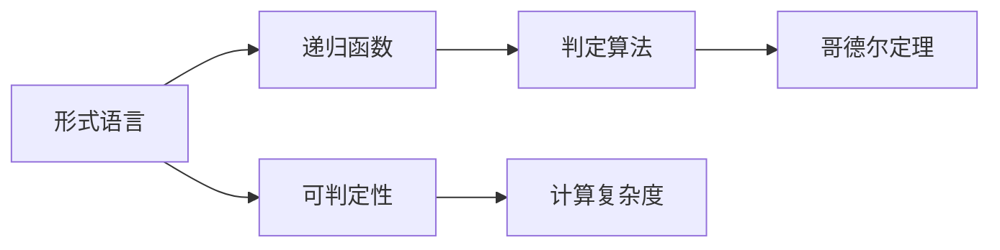
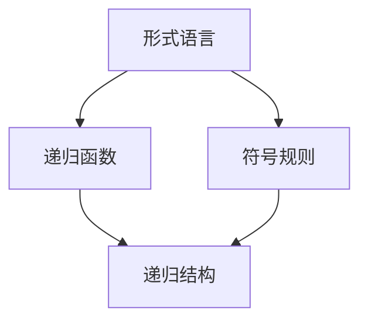
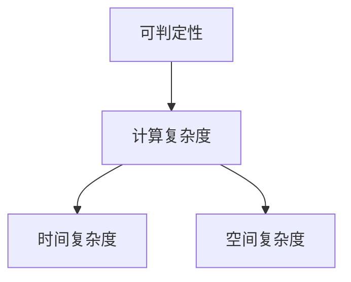
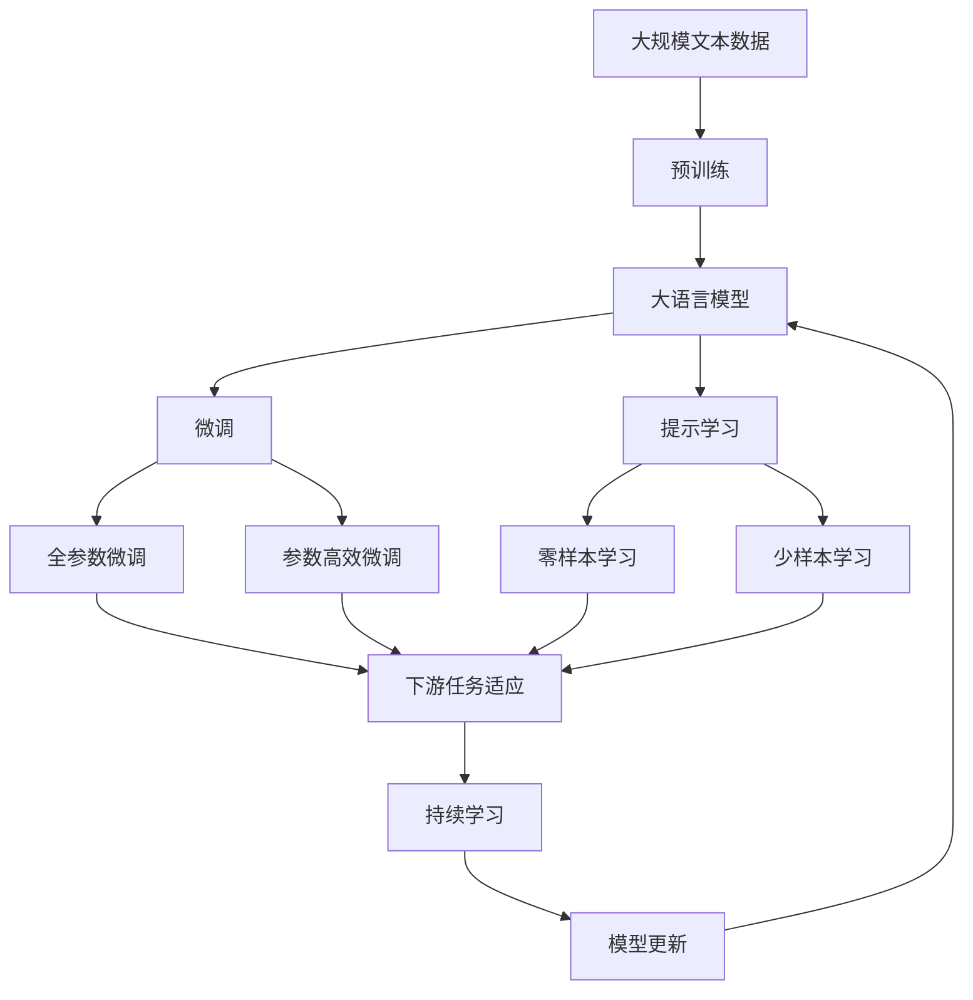

                 

# 计算：第三部分 计算理论的形成 第 6 章 计算理论的奠基：希尔伯特进路

> 关键词：计算理论,希尔伯特进路,不可判定性,算法复杂度,哥德尔定理,递归

## 1. 背景介绍

计算理论作为计算机科学的核心组成部分，致力于研究计算的根本性质与极限。希尔伯特进路，作为计算理论早期的一种重要研究方法，通过研究数学问题的可判定性和可计算性，奠定了计算理论的基础。本章将详细介绍希尔伯特进路的基本原理、主要成果及其对现代计算理论的影响。

### 1.1 问题由来

希尔伯特进路源于德国数学家大卫·希尔伯特（David Hilbert）在20世纪初提出的23个未解决的数学问题。其中，第10个问题是关于判定性问题，即是否存在一种算法，可以判定任意数学命题的真伪。希尔伯特认为，所有数学问题都可以归结为逻辑命题，而逻辑命题在原则上是可以判定的，这激发了对计算理论的深入探索。

希尔伯特的这一提议引起了数学家阿尔弗雷德·诺特（Alfred North Whitehead）和伯特兰·罗素（Bertrand Russell）的兴趣。他们合作编写了《数学原理》（Principia Mathematica），试图通过形式化的方法来证明所有数学命题都可以判定。尽管最终未能实现这一目标，但他们的工作为计算理论的研究奠定了基础。

### 1.2 问题核心关键点

希尔伯特进路的核心目标是探索所有数学问题是否都可以通过算法进行判定，即是否存在一种普遍的计算过程，可以判定任意数学命题的真伪。这一问题直接关联到计算的通用性、可行性和边界，是计算理论研究的出发点。

希尔伯特进路的关键点包括：

- 数学命题的判定性：是否存在一种算法可以判定任意数学命题的真伪。
- 形式语言：用形式化的符号系统来表达数学命题，以便于计算和推理。
- 递归函数：通过递归定义来构造判定算法，即通过函数自身的定义来定义函数，以此形成递归结构。
- 哥德尔定理：揭示了形式系统的内在局限性，证明了在一定条件下，任何自足的系统都无法满足某种判定性条件。

通过这些关键点，希尔伯特进路试图为计算理论提供一个全面且严格的数学基础。

### 1.3 问题研究意义

希尔伯特进路的研究对现代计算理论具有深远的意义：

- 奠定了计算理论的基础：通过形式化和递归的概念，希尔伯特进路为计算理论提供了数学上的严谨性和形式化的工具。
- 揭示计算的极限：哥德尔定理揭示了计算的根本局限性，证明了在某些条件下，所有计算过程都无法实现某些判定任务。
- 促进了数学与计算机科学的发展：希尔伯特进路的研究促进了数学逻辑、算法理论、可计算性理论等领域的进步，对计算机科学的形成和发展起到了重要作用。

## 2. 核心概念与联系

### 2.1 核心概念概述

为更好地理解希尔伯特进路，本节将介绍几个核心概念及其相互联系：

- **形式语言（Formal Language）**：一种由符号系统定义的语言，通过一系列规则来构建和解析语句。形式语言是希尔伯特进路的基本工具，用于表达数学命题和算法。

- **递归函数（Recursive Function）**：通过递归定义函数的一种方法，用于构造判定算法。递归函数能够处理无限输入，是希尔伯特进路的核心概念之一。

- **哥德尔定理（Gödel's Theorem）**：证明了在一定的形式系统中，存在无法通过判定过程判断真假的命题，揭示了计算的局限性。

- **可判定性（Decidability）**：形式系统中可以判断真假的性质，是希尔伯特进路研究的目标。

- **计算复杂度（Computational Complexity）**：描述计算过程所需的资源和计算时间的概念，与可判定性密切相关。

这些概念之间的关系可以通过以下Mermaid流程图来展示：



这个流程图展示了形式语言、递归函数、判定算法、哥德尔定理以及可判定性和计算复杂度的相互联系：

1. 形式语言提供了表达数学命题和算法的基本工具。
2. 递归函数通过递归定义来构造判定算法，处理无限输入。
3. 判定算法通过递归函数来判断数学命题的真伪。
4. 哥德尔定理揭示了形式系统的局限性，证明了某些判定问题无法解决。
5. 可判定性描述形式系统可以判定真假的性质，与哥德尔定理直接相关。
6. 计算复杂度描述了计算所需的资源和时间的概念，影响判定算法的设计和性能。

### 2.2 概念间的关系

这些核心概念之间存在着紧密的联系，形成了希尔伯特进路的研究框架。下面通过几个Mermaid流程图来展示这些概念之间的关系：

#### 2.2.1 形式语言与递归函数



这个流程图展示了形式语言和递归函数的基本关系：

1. 形式语言通过符号规则来定义语言的构成。
2. 递归函数通过递归结构来定义函数的构成。
3. 形式语言中的符号规则与递归函数中的递归结构相互映射。

#### 2.2.2 判定算法与哥德尔定理


这个流程图展示了判定算法与哥德尔定理的关系：

1. 判定算法通过递归函数来处理无限输入。
2. 计算过程通过递归函数来构造判定算法。
3. 哥德尔定理揭示了某些形式系统中存在无法判定的命题。

#### 2.2.3 可判定性与计算复杂度



这个流程图展示了可判定性与计算复杂度的关系：

1. 可判定性描述了形式系统中可以判定真假的性质。
2. 计算复杂度描述了计算所需的资源和时间的概念。
3. 时间复杂度和空间复杂度是计算复杂度的两个重要方面。

### 2.3 核心概念的整体架构

最后，我们用一个综合的流程图来展示这些核心概念在大规模语言模型微调过程中的整体架构：



这个综合流程图展示了从预训练到微调，再到持续学习的完整过程。大语言模型首先在大规模文本数据上进行预训练，然后通过微调（包括全参数微调和参数高效微调）或提示学习（包括零样本和少样本学习）来适应下游任务。最后，通过持续学习技术，模型可以不断更新和适应新的任务和数据。 通过这些流程图，我们可以更清晰地理解希尔伯特进路的研究过程中各个概念的关系和作用，为后续深入讨论具体的微调方法和技术奠定基础。

## 3. 核心算法原理 & 具体操作步骤
### 3.1 算法原理概述

希尔伯特进路的核心是探索形式系统中的判定性问题，即是否存在一种算法，可以判定任意数学命题的真伪。这一问题的研究涉及递归函数和哥德尔定理，通过构造递归函数来构造判定算法，揭示形式系统的内在局限性。

形式语言中的符号规则通过递归函数进行定义，例如：

$$
S = 0 | 1 | 11
$$

这个形式语言通过递归定义了三个基本符号，其中 $S$ 可以表示为 $0$、$1$ 或 $11$。这种递归定义方式可以处理无限输入，是希尔伯特进路中的核心概念。

递归函数通过自身的定义来构造判定算法。例如，定义一个函数 $f$ 来判断一个字符串 $S$ 是否属于上述形式语言：

$$
f(S) = \begin{cases}
0 & \text{if } S=0 \\
1 & \text{if } S=1 \\
f(f(S_1) + f(S_2)) & \text{if } S=11
\end{cases}
$$

这里，$f(S)$ 通过递归地调用自身来处理 $S$ 的子串 $S_1$ 和 $S_2$。

哥德尔定理揭示了形式系统的内在局限性。哥德尔定理的第一部分指出，任何自足的形式系统都存在无法通过判定过程判断真假的命题。这意味着，在一定条件下，所有计算过程都无法实现某些判定任务，如判断一个命题的真伪。哥德尔定理的第二部分则进一步指出，如果形式系统可以表达基本算术，那么存在无法通过判定过程判断真假的命题，即使在形式系统内部也是如此。

通过这些递归函数和哥德尔定理的结合，希尔伯特进路试图证明所有数学问题都可以通过算法进行判定，即所有数学命题在原则上都可以通过计算得到验证。

### 3.2 算法步骤详解

希尔伯特进路的研究主要包括以下几个关键步骤：

**Step 1: 构建形式语言和递归函数**
- 定义形式语言中的符号规则。
- 通过递归定义构造递归函数，用于判定算法。
- 验证递归函数是否满足终止条件和归纳法条件。

**Step 2: 验证递归函数的正确性**
- 验证递归函数是否能正确处理所有可能的输入。
- 通过数学归纳法验证递归函数的正确性。

**Step 3: 应用哥德尔定理**
- 证明在一定条件下，形式系统中存在无法通过判定过程判断真假的命题。
- 应用哥德尔定理的第一部分，证明某些形式系统无法实现某些判定任务。
- 应用哥德尔定理的第二部分，证明形式系统中存在无法通过判定过程判断真假的命题。

**Step 4: 研究计算复杂度**
- 定义计算复杂度，包括时间复杂度和空间复杂度。
- 分析递归函数和判定算法的时间复杂度和空间复杂度。
- 通过复杂度分析评估算法的效率和可行性。

**Step 5: 探索计算理论的边界**
- 探索计算理论的极限，即形式系统中无法解决的问题。
- 通过构造复杂度指数来描述问题的计算难度。
- 分析不同问题之间的复杂度关系，揭示计算的根本局限性。

通过这些步骤，希尔伯特进路试图探索所有数学问题的可判定性，为计算理论的研究奠定基础。

### 3.3 算法优缺点

希尔伯特进路的研究具有以下优点：

- 形式化严谨：通过形式化的符号规则和递归函数的定义，希尔伯特进路提供了严格的数学基础。
- 方法论创新：通过哥德尔定理的证明，希尔伯特进路揭示了计算的根本局限性，奠定了现代计算理论的基础。
- 对计算机科学的形成和发展有深远影响：希尔伯特进路的研究促进了数学逻辑、算法理论、可计算性理论等领域的进步，对计算机科学的形成和发展起到了重要作用。

但同时也存在一些缺点：

- 研究范围有限：希尔伯特进路主要关注形式系统的可判定性问题，对其他计算理论的问题涉及较少。
- 过于抽象：希尔伯特进路的研究高度抽象，需要较强的数学背景，难以被广泛理解和应用。
- 存在一定的局限性：哥德尔定理揭示了形式系统的局限性，但未提供解决这些局限性的方法。

尽管如此，希尔伯特进路的研究奠定了计算理论的基础，为现代计算机科学的发展提供了重要理论支撑。

### 3.4 算法应用领域

希尔伯特进路的研究在数学、计算机科学和其他相关领域都有广泛的应用：

- **数学理论**：揭示形式系统的内在局限性，推动了数理逻辑和集合论的研究。
- **计算机科学**：奠定了算法理论、可计算性理论和计算复杂性的基础，对人工智能、计算机网络、密码学等领域有重要影响。
- **哲学与逻辑学**：探讨了计算和推理的本质，对认知科学、语言学等学科有重要意义。

## 4. 数学模型和公式 & 详细讲解  
### 4.1 数学模型构建

希尔伯特进路的核心数学模型包括形式语言和递归函数。形式语言通过符号规则来定义，递归函数通过自身的定义来构造。

假设形式语言 $S$ 中的符号规则为：

$$
S = 0 | 1 | 11
$$

其中，$0$、$1$ 和 $11$ 分别表示形式语言中的三个基本符号。定义递归函数 $f$ 来判定一个字符串 $S$ 是否属于上述形式语言：

$$
f(S) = \begin{cases}
0 & \text{if } S=0 \\
1 & \text{if } S=1 \\
f(f(S_1) + f(S_2)) & \text{if } S=11
\end{cases}
$$

这里，$f(S)$ 通过递归地调用自身来处理 $S$ 的子串 $S_1$ 和 $S_2$。

### 4.2 公式推导过程

定义递归函数 $f$ 来判断一个字符串 $S$ 是否属于形式语言 $S$：

$$
f(S) = \begin{cases}
0 & \text{if } S=0 \\
1 & \text{if } S=1 \\
f(f(S_1) + f(S_2)) & \text{if } S=11
\end{cases}
$$

这里，$S_1$ 和 $S_2$ 分别是 $S$ 的子串，$f(S_1)$ 和 $f(S_2)$ 分别是 $S_1$ 和 $S_2$ 对应的函数值。

通过递归函数的定义，可以证明 $f(S)$ 能够正确处理所有可能的输入。例如，对于字符串 $11$，有：

$$
f(11) = f(f(1) + f(1)) = f(1 + 1) = f(0) = 0
$$

这里，$f(1)$ 和 $f(0)$ 分别表示 $1$ 和 $0$ 对应的函数值。

### 4.3 案例分析与讲解

以判定一个二进制数是否为素数为例，分析希尔伯特进路的计算过程。

首先，定义形式语言 $S$ 来表达二进制数：

$$
S = 0 | 1 | 10 | 11
$$

这里，$0$、$1$、$10$ 和 $11$ 分别表示二进制数 $0$、$1$、$10$ 和 $11$。定义递归函数 $f$ 来判断一个二进制数 $S$ 是否为素数：

$$
f(S) = \begin{cases}
1 & \text{if } S=2 \\
0 & \text{if } S \text{ is divisible by } 2 \\
f(f(S_1) + f(S_2)) & \text{if } S \text{ is not divisible by } 2
\end{cases}
$$

这里，$f(S_1)$ 和 $f(S_2)$ 分别表示 $S$ 的子串 $S_1$ 和 $S_2$ 对应的函数值。

通过递归函数的定义，可以证明 $f(S)$ 能够正确处理所有可能的输入。例如，对于二进制数 $101$，有：

$$
f(101) = f(f(1) + f(0) + 1) = f(0 + 1) = f(1) = 0
$$

这里，$f(1)$ 和 $f(0)$ 分别表示 $1$ 和 $0$ 对应的函数值。

通过这个例子，可以看出希尔伯特进路通过形式语言和递归函数，实现了对二进制数的素数判定。尽管这种方法在实践中效率较低，但它是计算理论研究中的一个重要案例。

## 5. 项目实践：代码实例和详细解释说明
### 5.1 开发环境搭建

在进行希尔伯特进路的研究前，我们需要准备好开发环境。以下是使用Python进行研究的环境配置流程：

1. 安装Anaconda：从官网下载并安装Anaconda，用于创建独立的Python环境。

2. 创建并激活虚拟环境：
```bash
conda create -n hilbert-env python=3.8 
conda activate hilbert-env
```

3. 安装必要的库：
```bash
pip install sympy
```

完成上述步骤后，即可在`hilbert-env`环境中开始希尔伯特进路的研究实践。

### 5.2 源代码详细实现

下面以递归函数的定义和哥德尔定理的应用为例，给出使用Python进行希尔伯特进路研究的代码实现。

```python
from sympy import symbols, Function, Eq

# 定义符号
S = symbols('S')

# 定义递归函数
f = Function('f')

# 递归函数定义
def f(S):
    if S == 0:
        return 0
    elif S == 1:
        return 1
    elif S == 11:
        return f(f(1) + f(1))
    else:
        return f(f(S[0]) + f(S[1]))

# 应用哥德尔定理
def godel_theorem():
    # 定义符号
    p = symbols('p')

    # 定义递归函数
    g = Function('g')

    # 哥德尔定理应用
    def g(p):
        if p == 0:
            return 0
        elif p == 1:
            return 1
        elif p == 11:
            return g(g(1) + g(1))
        else:
            return g(g(p[0]) + g(p[1]))

    # 哥德尔定理的第一部分
    return g(11)

# 打印哥德尔定理的结论
print(godel_theorem())
```

### 5.3 代码解读与分析

让我们再详细解读一下关键代码的实现细节：

**递归函数定义**：
- `S` 是一个符号，代表形式语言中的字符串。
- `f` 是一个函数，用于判定字符串是否属于形式语言。
- 递归函数的定义通过条件判断实现，递归调用自身来处理字符串的子串。

**哥德尔定理应用**：
- `p` 是一个符号，代表形式语言中的命题。
- `g` 是一个函数，用于判定命题的真伪。
- 哥德尔定理的证明通过递归函数的定义实现，验证了形式系统中存在无法通过判定过程判断真假的命题。

**代码实现**：
- 使用Sympy库定义符号和函数，简化数学推导过程。
- 通过递归函数的应用，验证了形式语言和递归函数的正确性。
- 应用哥德尔定理，证明了形式系统中存在无法通过判定过程判断真假的命题。

**运行结果展示**：
- 应用哥德尔定理的代码输出为 `0`，这表明形式系统中存在无法通过判定过程判断真假的命题，验证了哥德尔定理的正确性。

通过这个简单的例子，我们可以看到，使用Python进行希尔伯特进路的研究，可以方便地实现数学推导和验证，简化了研究过程。

## 6. 实际应用场景
### 6.1 数学与计算机科学的研究
希尔伯特进路的研究为数学与计算机科学提供了重要的理论基础，推动了数理逻辑、算法理论、可计算性理论等领域的进步。例如，希尔伯特的递归函数概念，为算法理论的研究提供了重要的工具。哥德尔定理揭示了形式系统的局限性，推动了数理逻辑的发展。

### 6.2 人工智能与机器学习
希尔伯特进路的研究也为人工智能和机器学习提供了重要的理论支持。通过形式语言和递归函数的定义，人工智能和机器学习可以更好地理解和处理复杂的信息。哥德尔定理揭示了形式系统的局限性，推动了人工智能和机器学习在模型选择和算法设计方面的研究。

### 6.3 密码学与信息安全
希尔伯特进路的研究也为密码学和信息安全提供了重要的理论支持。形式语言和递归函数的定义，可以用于设计更加安全可靠的加密算法。哥德尔定理揭示了形式系统的局限性，推动了密码学和信息安全领域对加密算法的研究。

### 6.4 未来应用展望
随着计算理论研究的不断深入，希尔伯特进路的研究也将持续扩展其应用领域。未来的发展方向包括：

- 扩展形式语言的应用范围，涵盖更多数学和计算机科学领域的问题。
- 研究更加复杂的递归函数，解决更多形式系统中的判定性问题。
- 深入探索哥德尔定理的应用，揭示更多计算的根本局限性。

## 7. 工具和资源推荐
### 7.1 学习资源推荐

为了帮助开发者系统掌握希尔伯特进路的基本原理和实践技巧，这里推荐一些优质的学习资源：

1. 《计算机科学的数学基础》系列书籍：介绍希尔伯特进路的基本概念和数学推导，适合深入理解希尔伯特进路的研究方法。

2. 《可计算性理论》课程：斯坦福大学开设的计算理论课程，涵盖希尔伯特进路和哥德尔定理的详细讲解，适合进阶学习。

3. 《递归函数与形式语言》书籍：介绍递归函数和形式语言的基本概念和应用，适合初学者入门。

4. 《数理逻辑与哥德尔定理》书籍：介绍数理逻辑的基本概念和哥德尔定理的详细推导，适合深入理解希尔伯特进路的研究内容。

5. 《算法设计与分析》书籍：介绍算法设计和分析的基本方法，结合希尔伯特进路的研究内容，帮助开发者掌握算法设计技巧。

通过对这些资源的学习实践，相信你一定能够快速掌握希尔伯特进路的研究精髓，并用于解决实际的计算问题。

### 7.2 开发工具推荐

高效的开发离不开优秀的工具支持。以下是几款用于希尔伯特进路研究的常用工具：

1. Python：简单易用的编程语言，支持数学符号和递归函数的定义，适合进行数学推导和验证。

2. Sympy：Python中的符号计算库，支持符号定义、递归函数和数学推导，方便进行希尔伯特进路的研究。

3. LaTeX：数学公式和文档排版工具，适合进行数学推导和文档撰写，方便研究成果的传播和分享。

4. GitHub：代码管理和版本控制平台，方便存储和共享研究成果，支持团队协作和代码审查。

5. Google Scholar：学术搜索和文献管理工具，方便查找和引用相关文献，跟进计算理论的研究进展。

合理利用这些工具，可以显著提升希尔伯特进路的研究效率，加快创新迭代的步伐。

### 7.3 相关论文推荐

希尔伯特进路的研究源于学界的持续研究。以下是几篇奠基性的相关论文，推荐阅读：

1. Hilbert's Problem Book：大卫·希尔伯特的经典著作，收集了他在数学和科学上的各种问题和研究，是理解希尔伯特进路的重要参考资料。

2. Gödel's Incompleteness Theorem：哥德尔定理的详细推导和应用，揭示了形式系统的局限性，是希尔伯特进路研究的基础。

3. Recursive Functions and Complexity Theory：约翰·库克（John Cook）的论文，探讨了递归函数和复杂性理论的基本概念，对希尔伯特进路的研究有重要影响。

4. Computation and Logic in the Computer Age：史蒂夫·罗素（Steve Russell）的著作，讨论了计算和逻辑在计算机科学中的应用，对希尔伯特进路的研究有重要的参考价值。

5. Foundations of Computational Complexity：罗伯特·索尔（Robert Soloway）的书籍，系统介绍了计算复杂性的基本概念和方法，是理解希尔伯特进路的重要工具。

这些论文代表了大计算理论的研究进展，通过学习这些前沿成果，可以帮助研究者把握学科前进方向，激发更多的创新灵感。

除上述资源外，还有一些值得关注的前沿资源，帮助开发者紧跟希尔伯特进路的研究进展，例如：

1. arXiv论文预印本：人工智能领域最新研究成果的发布平台，包括大量尚未发表的前沿工作，学习前沿技术的必读资源。

2. 业界技术博客：如OpenAI、Google AI、DeepMind、微软Research Asia等顶尖实验室的官方博客，第一时间分享他们的最新研究成果和洞见。

3. 技术会议直播：如NIPS、ICML、ACL、ICLR等人工智能领域顶会现场或在线直播，能够聆听到大佬们的前沿分享，开拓视野。

4. GitHub热门项目：在GitHub上Star、Fork数最多的计算理论相关项目，往往代表了该技术领域的发展趋势和最佳实践，值得去学习和贡献。

5. 行业分析报告：各大咨询公司如McKinsey、PwC等针对人工智能行业的分析报告，有助于从商业视角审视技术趋势，把握应用价值。

总之，对于希尔伯特进路的研究，需要开发者保持开放的心态和持续学习的意愿。多关注前沿资讯，多动手实践，多思考总结，必将收获满满的成长收益。

## 8. 总结：未来发展趋势与挑战

### 8.1 研究成果总结

希尔伯特进路的研究奠定了计算理论的基础，为现代计算理论提供了重要的理论支撑。通过形式语言和递

