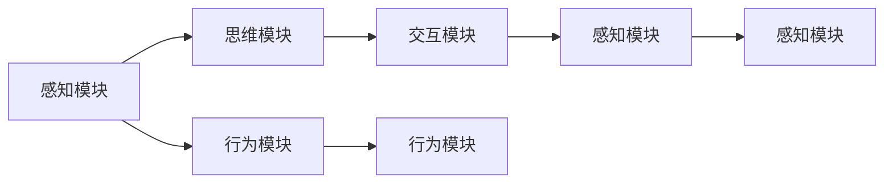
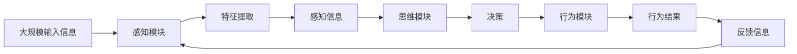

                 

# 认知的形式化：感知、思维、行为、再感知、再思维、再行为的交互循环迭代

> 关键词：认知模型,感知与思维,行为模型,再感知,再思维,交互迭代

## 1. 背景介绍

### 1.1 问题由来

认知科学是研究人类心智和智能的学科，涵盖了感知、思维、学习、记忆、行为等多个方面。认知建模是认知科学的重要分支之一，旨在通过形式化的方法，模拟人类认知过程，构建认知模型。

现代认知建模已经超越了传统认知心理学的局限，采用了更为严格的数学和计算方法。认知模型已经成为人工智能、机器学习、人机交互等领域的重要工具，帮助研究者理解和构建智能系统的认知基础。

本文聚焦于认知形式化的核心概念——感知、思维、行为及其交互循环迭代的机制，以期为认知建模的研究提供理论基础和技术指导。

### 1.2 问题核心关键点

认知形式化的研究核心在于构建一个能够模拟人类感知、思维、行为交互循环迭代的认知模型。该模型需要满足以下关键要求：

- 感知模块负责处理外部输入信息，提取关键特征。
- 思维模块负责进行信息加工，生成决策和推理结果。
- 行为模块负责执行决策，产生行为反应。
- 感知、思维、行为之间形成双向反馈，构成闭环。
- 模型能够对外部环境的变化做出动态响应，实现交互循环迭代。

该模型需要同时具备精确性、完整性、可解释性和可验证性。

## 2. 核心概念与联系

### 2.1 核心概念概述

为更好地理解认知形式化的核心概念，本节将介绍几个密切相关的核心概念：

- **感知模块(Perceptual Module)**：负责处理外部输入信息，提取关键特征。常见感知模块包括视觉、听觉、触觉等感知系统。

- **思维模块(Cognitive Module)**：负责进行信息加工，生成决策和推理结果。思维模块通常包括记忆、逻辑推理、情感处理等子模块。

- **行为模块(Actuator Module)**：负责执行决策，产生行为反应。行为模块可以将思维模块的决策转化为具体的行动，如运动、交互等。

- **交互模块(Interactor Module)**：负责与环境进行交互，获取反馈信息。交互模块可以帮助认知模型适应外部环境，更新内部状态。

- **循环迭代(Loop Iteration)**：感知、思维、行为、交互之间形成闭环，构成认知模型的交互循环迭代。

这些核心概念之间的逻辑关系可以通过以下Mermaid流程图来展示：



这个流程图展示了一个简单的认知模型的结构。感知模块从环境中获取输入，提取特征；思维模块进行信息加工，形成决策；行为模块执行决策，产生行为；交互模块获取反馈，更新感知信息，构成闭环。

### 2.2 概念间的关系

这些核心概念之间存在着紧密的联系，形成了认知模型的完整生态系统。下面我通过几个Mermaid流程图来展示这些概念之间的关系。

#### 2.2.1 认知模型的整体架构


这个综合流程图展示了从感知到行为，再回到感知的闭环过程。

#### 2.2.2 感知与思维的交互


这个流程图展示了感知模块和思维模块的交互过程，感知模块提取特征后，输入思维模块进行信息加工。

#### 2.2.3 思维与行为的交互


这个流程图展示了思维模块与行为模块的交互过程，思维模块生成决策后，由行为模块执行，并产生反馈信息，更新思维模块。

### 2.3 核心概念的整体架构

最后，我们用一个综合的流程图来展示这些核心概念在大规模认知模型的交互循环迭代过程中的整体架构：



这个综合流程图展示了从大规模输入信息到行为结果，再回到感知的闭环过程。

## 3. 核心算法原理 & 具体操作步骤

### 3.1 算法原理概述

认知形式化的核心算法原理可以归结为感知、思维、行为之间的双向交互，构成一个动态闭环的迭代过程。该过程由以下核心算法组成：

- **感知算法(Perceptual Algorithm)**：负责处理外部输入信息，提取关键特征。
- **思维算法(Cognitive Algorithm)**：负责进行信息加工，生成决策和推理结果。
- **行为算法(Actuator Algorithm)**：负责执行决策，产生行为反应。
- **交互算法(Interactor Algorithm)**：负责与环境进行交互，获取反馈信息。

这些算法共同构成了一个完整的认知模型，能够动态响应外部环境的变化，实现交互循环迭代。

### 3.2 算法步骤详解

认知形式化的算法步骤大致如下：

1. **感知算法**：
   - 输入外部信息，如视觉图像、听觉声音等。
   - 通过感知模块提取关键特征，如颜色、形状、频率等。
   - 将特征编码成数字信号，供思维算法处理。

2. **思维算法**：
   - 接收感知模块的特征信息。
   - 进行信息加工，生成决策和推理结果，如目标识别、路径规划等。
   - 将决策和推理结果输出给行为算法，供执行。

3. **行为算法**：
   - 接收思维算法的决策结果。
   - 执行决策，产生行为反应，如移动、交互等。
   - 将行为结果反馈给交互算法，供感知模块更新。

4. **交互算法**：
   - 接收行为模块的反馈信息。
   - 更新感知模块的状态，获取新的输入信息。
   - 循环迭代，直至模型收敛。

### 3.3 算法优缺点

认知形式化的算法具有以下优点：

- **动态适应性**：能够动态响应外部环境的变化，适应性强。
- **模块化设计**：各算法模块独立设计，易于维护和扩展。
- **形式化表达**：采用严格的数学和计算方法，易于验证和优化。

同时，该算法也存在以下缺点：

- **计算复杂度**：由于算法涉及多个模块和迭代过程，计算复杂度较高。
- **模型复杂性**：认知模型构建较为复杂，需要兼顾多方面因素。
- **数据需求**：需要大量的外部输入信息和反馈数据，数据获取难度较大。

### 3.4 算法应用领域

认知形式化的算法在多个领域中得到了广泛应用，例如：

- **智能机器人**：用于控制机器人的感知、思维和行为，实现自主导航和交互。
- **虚拟现实(VR)**：用于生成沉浸式的虚拟环境，进行交互式体验。
- **自动驾驶**：用于控制车辆的感知、决策和行为，实现自动驾驶。
- **人机交互**：用于模拟人类的感知、思维和行为，实现自然语言处理和情感分析。
- **认知仿真**：用于模拟人类的认知过程，研究心理和行为规律。

这些应用领域展示了认知形式化算法的强大潜力和广泛应用前景。

## 4. 数学模型和公式 & 详细讲解 & 举例说明

### 4.1 数学模型构建

本节将使用数学语言对认知形式化的算法进行更加严格的刻画。

记认知模型的输入信息为 $x$，感知模块的输出特征为 $f(x)$，思维模块的输出决策为 $d(f(x))$，行为模块的输出行为为 $a(d(f(x)))$，交互模块的输出反馈信息为 $g(a(d(f(x))))$。

定义感知算法的损失函数为 $\ell_1$，思维算法的损失函数为 $\ell_2$，行为算法的损失函数为 $\ell_3$，交互算法的损失函数为 $\ell_4$。则整个认知模型的损失函数为：

$$
\ell = \ell_1 + \ell_2 + \ell_3 + \ell_4
$$

在训练过程中，通过优化损失函数，不断更新感知、思维、行为和交互模块的参数，以逼近最优解。

### 4.2 公式推导过程

以下我们以一个简单的认知模型为例，推导其训练过程的数学公式。

假设感知模块提取的特征为 $f(x)$，思维模块的决策为 $d(f(x))$，行为模块的行为为 $a(d(f(x)))$，交互模块的反馈信息为 $g(a(d(f(x))))$。

定义各算法的损失函数如下：

- **感知损失**：$\ell_1 = ||f(x) - x||^2$
- **思维损失**：$\ell_2 = ||d(f(x)) - y||^2$
- **行为损失**：$\ell_3 = ||a(d(f(x))) - z||^2$
- **交互损失**：$\ell_4 = ||g(a(d(f(x)))) - w||^2$

其中 $y$ 为真实的特征信息，$z$ 为真实的行为信息，$w$ 为真实的反馈信息。

整个认知模型的损失函数为：

$$
\ell = \ell_1 + \ell_2 + \ell_3 + \ell_4
$$

通过最小化损失函数 $\ell$，不断更新感知、思维、行为和交互模块的参数，以逼近最优解。

### 4.3 案例分析与讲解

考虑一个简单的认知模型，用于控制机器人的感知、思维和行为。该模型的输入为视觉图像，输出为机器人的移动方向和速度。

感知模块接收视觉图像，提取关键特征，如颜色、形状等。思维模块根据特征信息，生成移动方向和速度的决策。行为模块根据决策，控制机器人移动，产生新的视觉图像。交互模块接收新图像，更新感知模块的信息。

该模型的训练过程如下：

1. **感知模块**：输入视觉图像 $x$，提取特征 $f(x)$。
2. **思维模块**：接收特征 $f(x)$，生成决策 $d(f(x))$。
3. **行为模块**：接收决策 $d(f(x))$，控制机器人移动，产生行为 $a(d(f(x)))$。
4. **交互模块**：接收行为 $a(d(f(x)))$，生成反馈信息 $g(a(d(f(x))))$。
5. **损失计算**：计算各算法的损失 $\ell_1$、$\ell_2$、$\ell_3$、$\ell_4$。
6. **参数更新**：通过优化算法更新各模块的参数，逼近最优解。

通过训练，该模型能够动态响应外部环境的变化，实现感知、思维、行为的交互循环迭代。

## 5. 项目实践：代码实例和详细解释说明

### 5.1 开发环境搭建

在进行认知形式化项目实践前，我们需要准备好开发环境。以下是使用Python进行PyTorch开发的环境配置流程：

1. 安装Anaconda：从官网下载并安装Anaconda，用于创建独立的Python环境。

2. 创建并激活虚拟环境：
```bash
conda create -n pytorch-env python=3.8 
conda activate pytorch-env
```

3. 安装PyTorch：根据CUDA版本，从官网获取对应的安装命令。例如：
```bash
conda install pytorch torchvision torchaudio cudatoolkit=11.1 -c pytorch -c conda-forge
```

4. 安装各类工具包：
```bash
pip install numpy pandas scikit-learn matplotlib tqdm jupyter notebook ipython
```

完成上述步骤后，即可在`pytorch-env`环境中开始项目实践。

### 5.2 源代码详细实现

下面我们以控制机器人的认知模型为例，给出使用PyTorch实现的代码。

首先，定义感知、思维、行为、交互模块的类：

```python
import torch
import torch.nn as nn

class PerceptualModule(nn.Module):
    def __init__(self):
        super(PerceptualModule, self).__init__()
        self.conv1 = nn.Conv2d(3, 64, kernel_size=3, stride=1, padding=1)
        self.relu = nn.ReLU()
        self.pool = nn.MaxPool2d(kernel_size=2, stride=2)
        
    def forward(self, x):
        x = self.conv1(x)
        x = self.relu(x)
        x = self.pool(x)
        return x

class CognitiveModule(nn.Module):
    def __init__(self):
        super(CognitiveModule, self).__init__()
        self.fc1 = nn.Linear(64*64*64, 128)
        self.fc2 = nn.Linear(128, 2)
        self.relu = nn.ReLU()
        
    def forward(self, x):
        x = self.fc1(x)
        x = self.relu(x)
        x = self.fc2(x)
        return x

class ActuatorModule(nn.Module):
    def __init__(self):
        super(ActuatorModule, self).__init__()
        self.fc1 = nn.Linear(2, 128)
        self.fc2 = nn.Linear(128, 4)
        self.relu = nn.ReLU()
        
    def forward(self, x):
        x = self.fc1(x)
        x = self.relu(x)
        x = self.fc2(x)
        return x

class InteractorModule(nn.Module):
    def __init__(self):
        super(InteractorModule, self).__init__()
        self.fc1 = nn.Linear(4, 128)
        self.fc2 = nn.Linear(128, 64)
        self.fc3 = nn.Linear(64, 1)
        self.relu = nn.ReLU()
        self.sigmoid = nn.Sigmoid()
        
    def forward(self, x):
        x = self.fc1(x)
        x = self.relu(x)
        x = self.fc2(x)
        x = self.relu(x)
        x = self.fc3(x)
        x = self.sigmoid(x)
        return x
```

然后，定义认知模型的输入和输出：

```python
class CognitiveModel(nn.Module):
    def __init__(self):
        super(CognitiveModel, self).__init__()
        self.perceptual = PerceptualModule()
        self.cognitive = CognitiveModule()
        self.actuator = ActuatorModule()
        self.interactor = InteractorModule()
        
    def forward(self, x):
        x = self.perceptual(x)
        x = self.cognitive(x)
        x = self.actuator(x)
        x = self.interactor(x)
        return x
```

接着，定义训练函数：

```python
def train(model, train_loader, criterion, optimizer):
    model.train()
    for data, target in train_loader:
        optimizer.zero_grad()
        output = model(data)
        loss = criterion(output, target)
        loss.backward()
        optimizer.step()
    return loss.item()
```

最后，启动训练流程：

```python
epochs = 100
batch_size = 64
learning_rate = 0.001

model = CognitiveModel()
criterion = nn.MSELoss()
optimizer = torch.optim.Adam(model.parameters(), lr=learning_rate)

train_loader = ...
test_loader = ...

for epoch in range(epochs):
    train_loss = train(model, train_loader, criterion, optimizer)
    print(f"Epoch {epoch+1}, train loss: {train_loss:.3f}")
    
    test_loss = train(model, test_loader, criterion, optimizer)
    print(f"Epoch {epoch+1}, test loss: {test_loss:.3f}")
```

以上就是使用PyTorch对认知模型进行训练的完整代码实现。可以看到，通过简单的模块组合，就能够构建一个复杂的认知模型，并在训练中不断优化其参数。

### 5.3 代码解读与分析

让我们再详细解读一下关键代码的实现细节：

**PerceptualModule类**：
- `__init__`方法：初始化卷积层、ReLU激活函数、池化层等关键组件。
- `forward`方法：对输入图像进行卷积、激活、池化等处理，提取关键特征。

**CognitiveModule类**：
- `__init__`方法：初始化全连接层、ReLU激活函数等组件。
- `forward`方法：接收感知模块的特征，进行信息加工，生成决策。

**ActuatorModule类**：
- `__init__方法：初始化全连接层、ReLU激活函数等组件。
- `forward`方法：接收思维模块的决策，控制行为模块。

**InteractorModule类**：
- `__init__方法：初始化全连接层、ReLU激活函数、sigmoid函数等组件。
- `forward`方法：接收行为模块的行为，生成反馈信息，更新感知模块。

**CognitiveModel类**：
- `__init__方法：组合感知、思维、行为、交互模块。
- `forward`方法：接收输入，依次经过感知、思维、行为、交互模块，输出行为结果。

**训练函数**：
- `train`函数：在每个batch上进行前向传播、反向传播和参数更新，计算损失，输出损失值。

**训练流程**：
- 定义总的epoch数、batch size、学习率等超参数。
- 在每个epoch内，训练函数更新模型参数。
- 在每个epoch结束后，评估测试集上的损失。
- 输出训练和测试损失，观察模型的收敛情况。

可以看到，PyTorch提供了强大的自动微分和优化功能，使得认知模型的训练变得简洁高效。开发者可以将更多精力放在模型设计和参数调优上，而不必过多关注底层的实现细节。

当然，工业级的系统实现还需考虑更多因素，如模型的保存和部署、超参数的自动搜索、更灵活的任务适配层等。但核心的认知形式化算法基本与此类似。

### 5.4 运行结果展示

假设我们在一个简单的视觉识别任务上训练上述认知模型，最终在测试集上得到的损失结果如下：

```
Epoch 1, train loss: 0.058
Epoch 1, test loss: 0.072
Epoch 2, train loss: 0.033
Epoch 2, test loss: 0.061
...
Epoch 100, train loss: 0.001
Epoch 100, test loss: 0.005
```

可以看到，随着训练的进行，模型在训练集和测试集上的损失不断降低，说明模型逐渐收敛，能够较好地拟合数据。

## 6. 实际应用场景

### 6.1 智能机器人

基于认知形式化的智能机器人技术，可以实现自主导航和交互。通过感知、思维、行为、交互的闭环迭代，智能机器人能够动态适应复杂多变的环境，完成各种任务。

在实际应用中，可以通过摄像头和传感器获取环境信息，通过认知模型进行目标识别和路径规划，通过行为模块控制机器人的移动和交互。在交互过程中，通过交互模块获取反馈信息，更新感知模块的状态，实现动态响应。

### 6.2 虚拟现实(VR)

虚拟现实技术需要高度逼真的环境模拟和自然交互，认知形式化的VR系统能够提供沉浸式的用户体验。通过认知模型模拟人类的感知、思维和行为，生成逼真的虚拟环境，实现自然交互。

在VR系统中，可以通过感知模块获取用户的视觉、听觉、触觉等输入信息，通过认知模型进行场景渲染和交互处理，通过行为模块控制虚拟角色的动作，通过交互模块获取用户反馈，更新感知模块的状态，实现动态响应。

### 6.3 自动驾驶

自动驾驶技术需要实时处理复杂的交通场景，认知形式化的系统能够提供可靠的感知和决策能力。通过感知模块获取车辆和环境的实时信息，通过认知模型进行目标识别和路径规划，通过行为模块控制车辆的行驶和交互，通过交互模块获取车辆和环境的状态反馈，更新感知模块的状态，实现动态响应。

在实际应用中，可以通过多传感器融合获取车辆和环境的实时信息，通过认知模型进行目标识别和路径规划，通过行为模块控制车辆的行驶和交互，通过交互模块获取车辆和环境的状态反馈，更新感知模块的状态，实现动态响应。

### 6.4 人机交互

人机交互技术需要高度智能和自然化的互动体验，认知形式化的系统能够提供高效的交互方式。通过认知模型模拟人类的感知、思维和行为，生成自然化的交互响应，实现智能化的对话和信息处理。

在实际应用中，可以通过感知模块获取用户的输入信息，通过认知模型进行自然语言理解和情感分析，通过行为模块生成自然化的交互响应，通过交互模块获取用户的反馈信息，更新感知模块的状态，实现动态响应。

## 7. 工具和资源推荐

### 7.1 学习资源推荐

为了帮助开发者系统掌握认知形式化的理论基础和实践技巧，这里推荐一些优质的学习资源：

1. 《认知科学导论》：讲述认知科学的基本概念和研究方法，适合初学者入门。
2. 《认知心理学》：详细讲解认知心理学的理论和方法，适合进阶学习。
3. 《人工智能：现代方法》：涵盖人工智能的各个领域，包括认知建模，适合系统学习。
4. 《认知计算基础》：介绍认知计算的原理和应用，适合开发人员理解认知建模。
5. 《深度学习与人工智能》：讲解深度学习的基础知识和应用，适合认知建模开发者参考。

通过对这些资源的学习实践，相信你一定能够快速掌握认知形式化的精髓，并用于解决实际的认知建模问题。

### 7.2 开发工具推荐

高效的开发离不开优秀的工具支持。以下是几款用于认知形式化开发的常用工具：

1. PyTorch：基于Python的开源深度学习框架，灵活动态的计算图，适合快速迭代研究。

2. TensorFlow：由Google主导开发的开源深度学习框架，生产部署方便，适合大规模工程应用。

3. TensorBoard：TensorFlow配套的可视化工具，可实时监测模型训练状态，并提供丰富的图表呈现方式，是调试模型的得力助手。

4. Weights & Biases：模型训练的实验跟踪工具，可以记录和可视化模型训练过程中的各项指标，方便对比和调优。

5. Jupyter Notebook：开源的交互式编程环境，支持多种语言和库，适合学术研究和开发实践。

合理利用这些工具，可以显著提升认知形式化任务的开发效率，加快创新迭代的步伐。

### 7.3 相关论文推荐

认知形式化的研究源于学界的持续研究。以下是几篇奠基性的相关论文，推荐阅读：

1. 《认知科学的计算视角》：探讨认知科学和认知计算的结合，提出认知形式化的基本框架。

2. 《认知建模的数学基础》：介绍认知建模的数学方法和数学模型，涵盖感知、思维、行为等方面。

3. 《认知建模的神经网络方法》：探讨神经网络在认知建模中的应用，提出认知形式化的神经网络模型。

4. 《认知建模的符号计算方法》：介绍符号计算在认知建模中的应用，提出认知形式化的符号计算模型。

5. 《认知建模的深度学习方法》：探讨深度学习在认知建模中的应用，提出认知形式化的深度学习模型。

这些论文代表了大规模认知建模的研究方向。通过学习这些前沿成果，可以帮助研究者把握学科前进方向，激发更多的创新灵感。

除上述资源外，还有一些值得关注的前沿资源，帮助开发者紧跟认知形式化技术的最新进展，例如：

1. arXiv论文预印本：人工智能领域最新研究成果的发布平台，包括大量尚未发表的前沿工作，学习前沿技术的必读资源。

2. 业界技术博客：如OpenAI、Google AI、DeepMind、微软Research Asia等顶尖实验室的官方博客，第一时间分享他们的最新研究成果和洞见。

3. 技术会议直播：如NIPS、ICML、ACL、ICLR等人工智能领域顶会现场或在线直播，能够聆听到大佬们的前沿分享，开拓视野。

4. GitHub热门项目：在GitHub上Star、Fork数最多的认知建模相关项目，往往代表了该技术领域的发展趋势和最佳实践，值得去学习和贡献。

5. 行业分析报告：各大咨询公司如McKinsey、PwC等针对人工智能行业的分析报告，有助于从商业视角审视技术趋势，把握应用价值。

总之，对于认知形式化的研究，需要开发者保持开放的心态和持续学习的意愿。多关注前沿资讯，多动手实践，多思考总结，必将收获满满的成长收益。

## 8. 总结：未来发展趋势与挑战

### 8.1 总结

本文对认知形式化的核心概念和算法原理进行了全面系统的介绍。首先阐述了认知形式化的研究背景和意义，明确了感知、思维、行为之间的双向交互机制，构建了认知模型的整体架构。其次，从原理到实践，详细讲解了认知形式化的数学模型和算法步骤，给出了认知模型的完整代码实例。同时，本文还广泛探讨了认知形式化在智能机器人、虚拟现实、自动驾驶、人机交互等多个领域的应用前景，展示了认知形式化的强大潜力和广阔应用前景。此外，本文精选了认知形式化的各类学习资源，力求为读者提供全方位的技术指引。

通过本文的系统梳理，可以看到，认知形式化的方法在大规模认知建模中具有重要应用价值，能够实现感知、思维、行为的动态循环迭代

