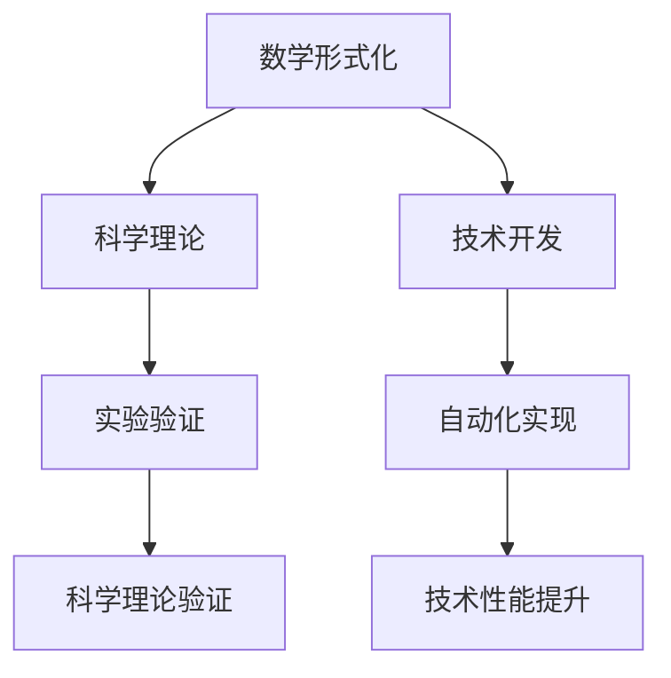

                 

## 1. 背景介绍

在过去的几个世纪里，数学不仅在自然科学中发挥了基础性的作用，还在技术、经济、社会等各个领域展示了其不可替代的价值。然而，随着人工智能、大数据、区块链等新兴技术的发展，人们对数学与科学、技术之间的关系有了更深刻的理解和反思。本文将探讨数学在科学和技术中的地位，分析其形式化表达和应用对现代科学技术的推动作用，并展望未来数学在人工智能中的潜力。

## 2. 核心概念与联系

### 2.1 核心概念概述

- **数学形式化**：指将数学思想和概念以严格的符号语言表达，形成逻辑严密的体系，以供证明和应用。形式化数学能够清晰界定概念，避免歧义，保证推导的正确性。

- **科学形式化**：是指将科学理论和实验方法通过形式化数学语言表达，便于归纳、总结和验证。形式化数学使得科学理论和实验结果具有普遍性，能够被广泛应用和推广。

- **技术形式化**：将技术设计和算法通过数学形式化表达，有助于自动化验证和优化，提高技术效率和可靠性。数学形式化技术是实现精确计算、智能推理和自动化设计的基础。

### 2.2 核心概念间的联系

1. **数学形式化与科学理论的桥梁作用**：科学理论的形成离不开数学形式化的支持。数学能够精确地描述自然现象和规律，提供实验数据支撑，帮助科学家构建系统化的理论体系。例如，牛顿运动定律、相对论、量子力学等都是基于数学形式的科学理论。

2. **数学形式化与技术开发的支撑**：数学形式化在技术开发中起着关键作用。数学模型提供了问题求解的框架和方法，算法设计需要数学证明和验证，自动化的技术实现也离不开数学计算的支撑。例如，机器学习、深度学习、自然语言处理等人工智能技术都依赖于数学形式化的表达和应用。

3. **科学理论与技术开发的协同**：科学理论与技术开发是相辅相成的。科学的进步推动技术的发展，技术的应用验证科学理论的正确性。科学理论和技术开发都离不开数学形式化的支持，只有通过数学的严谨性才能确保科学和技术的有效性和可靠性。

### 2.3 核心概念的整体架构

以下是核心概念间关系的整体架构，通过一个简单的 Mermaid 流程图表示：



通过这个架构图，我们可以清晰地看到数学形式化在科学理论和工程技术中的桥梁作用。数学形式化不仅推动了科学理论的进步，也支撑了技术开发的创新，并通过实验验证和自动化实现提升了科学和技术的应用效果。

## 3. 核心算法原理 & 具体操作步骤

### 3.1 算法原理概述

数学形式化在算法设计中的应用，体现在对算法逻辑和计算过程的精确描述和验证。算法原理通常通过数学模型和推导过程来表达，能够确保算法的正确性和可靠性。

### 3.2 算法步骤详解

1. **问题建模**：将实际问题抽象为数学模型。例如，机器学习中的分类问题可以建模为寻找数据集中的分类边界，优化问题可以建模为寻找函数的最优解。

2. **数学求解**：通过数学推导和证明，求解模型中的未知变量。例如，线性回归的参数求解过程涉及最小二乘法等数学工具。

3. **算法验证**：通过数学推导和实验验证，证明算法的正确性和性能。例如，深度学习模型的训练和优化过程需要数学证明其收敛性和泛化能力。

4. **算法优化**：通过数学方法改进算法性能，例如，采用梯度下降法优化模型参数，采用正则化方法避免过拟合。

### 3.3 算法优缺点

数学形式化算法具有以下优点：
- 精确性：通过数学推导，算法具有严格的逻辑性和正确性。
- 可验证性：通过数学证明，算法的设计和性能得到验证，避免错误和偏差。
- 可优化性：数学工具提供了丰富的优化方法，能够提升算法的效率和效果。

同时，数学形式化算法也存在一定的缺点：
- 复杂性：数学形式化往往涉及复杂的符号和推导，需要较高的数学功底。
- 应用范围受限：并非所有问题都能通过数学形式化解决，复杂问题可能需要结合经验法则和启发式算法。

### 3.4 算法应用领域

数学形式化算法在众多领域中得到了广泛应用，例如：

1. **自然科学**：物理学、化学、生物学等科学领域，数学提供了描述自然规律和实验方法的基础工具，推动了科学理论的发展。

2. **工程设计**：航空、汽车、机械等工程设计领域，数学建模和优化方法能够提高设计效率和可靠性。

3. **金融工程**：金融学和经济学中，数学模型提供了风险评估、投资分析、市场预测等工具，推动了金融工程的发展。

4. **人工智能**：机器学习、深度学习、自然语言处理等人工智能领域，数学提供了算法设计和优化的基础，提升了智能系统的性能和可靠性。

5. **数据科学**：大数据和数据分析领域，数学模型提供了数据挖掘、模式识别、预测分析等方法，推动了数据科学的发展。

6. **计算科学**：计算机科学和软件工程领域，数学算法提供了计算效率和可靠性保障，推动了计算科学的发展。

通过这些应用实例，我们可以看出数学形式化在科学和技术中的广泛影响和重要价值。

## 4. 数学模型和公式 & 详细讲解

### 4.1 数学模型构建

数学模型构建的过程通常包括以下步骤：

1. **问题抽象**：将实际问题转化为数学表达式，确定模型的输入、输出和变量。

2. **模型定义**：使用数学符号定义模型，包括变量、函数、方程等。

3. **模型求解**：通过数学推导和求解，找到模型的解或最优解。

4. **模型验证**：通过数学证明和实验验证，确保模型的正确性和可靠性。

5. **模型应用**：将模型应用于实际问题中，提供决策支持和优化方案。

### 4.2 公式推导过程

以线性回归为例，展示数学模型构建和推导的过程：

1. **问题抽象**：假设有一个数据集 $\{(x_i,y_i)\}_{i=1}^n$，其中 $x_i$ 为自变量，$y_i$ 为因变量，需要寻找一个线性函数 $f(x) = \theta_0 + \theta_1 x$ 来拟合数据。

2. **模型定义**：通过最小二乘法求解线性回归模型的参数 $\theta_0$ 和 $\theta_1$。

3. **模型求解**：求解线性回归模型的参数 $\theta_0$ 和 $\theta_1$，得到 $\theta_0 = \frac{\sum(x_i - \bar{x})^2}{\sum(x_i - \bar{x})^2 \sum(y_i - \bar{y})^2 - (\sum(x_i - \bar{x})(y_i - \bar{y}))^2}$ 和 $\theta_1 = \frac{\sum(x_i - \bar{x})(y_i - \bar{y})}{\sum(x_i - \bar{x})^2}$。

4. **模型验证**：通过数学证明和实验验证，最小二乘法得到的解是线性回归问题的最优解。

5. **模型应用**：将求解得到的 $\theta_0$ 和 $\theta_1$ 应用到新的数据点 $x$ 上，得到预测值 $f(x) = \theta_0 + \theta_1 x$。

### 4.3 案例分析与讲解

以深度学习中的卷积神经网络（CNN）为例，展示数学模型在算法设计和优化的应用：

1. **问题抽象**：假设有一个图像分类任务，需要设计一个卷积神经网络来识别图像中的物体。

2. **模型定义**：使用数学符号定义CNN的层次结构，包括卷积层、池化层、全连接层等。

3. **模型求解**：通过数学推导和求解，优化CNN的参数，使得其能够高效地识别物体。

4. **模型验证**：通过数学证明和实验验证，确保CNN的设计和参数优化是正确的。

5. **模型应用**：将训练好的CNN应用于实际图像分类任务中，提供准确的分类结果。

## 5. 项目实践：代码实例和详细解释说明

### 5.1 开发环境搭建

进行深度学习项目实践，需要以下开发环境：

1. **安装 Python**：从官网下载并安装 Python，选择 Python 3.x 版本，如 Python 3.7 或更高版本。

2. **安装 PyTorch**：从官网下载并安装 PyTorch，支持 GPU 加速，可以大幅提升训练和推理效率。

3. **安装 TensorFlow**：从官网下载并安装 TensorFlow，支持 GPU 加速，适用于大规模计算任务。

4. **安装 Jupyter Notebook**：用于编写和运行 Python 代码，支持代码版本控制和共享。

### 5.2 源代码详细实现

以下是一个简单的深度学习项目示例，展示卷积神经网络在图像分类中的应用：

```python
import torch
import torch.nn as nn
import torchvision
import torchvision.transforms as transforms

# 加载数据集
trainset = torchvision.datasets.CIFAR10(root='./data', train=True, download=True,
                                         transform=transforms.Compose([
                                         transforms.ToTensor(),
                                         transforms.Normalize((0.5, 0.5, 0.5), (0.5, 0.5, 0.5))]))
trainloader = torch.utils.data.DataLoader(trainset, batch_size=4,
                                          shuffle=True, num_workers=2)

testset = torchvision.datasets.CIFAR10(root='./data', train=False, download=True,
                                       transform=transforms.Compose([
                                         transforms.ToTensor(),
                                         transforms.Normalize((0.5, 0.5, 0.5), (0.5, 0.5, 0.5))]))
testloader = torch.utils.data.DataLoader(testset, batch_size=4,
                                         shuffle=False, num_workers=2)

# 定义卷积神经网络模型
class Net(nn.Module):
    def __init__(self):
        super(Net, self).__init__()
        self.conv1 = nn.Conv2d(3, 6, 5)
        self.pool = nn.MaxPool2d(2, 2)
        self.conv2 = nn.Conv2d(6, 16, 5)
        self.fc1 = nn.Linear(16 * 5 * 5, 120)
        self.fc2 = nn.Linear(120, 84)
        self.fc3 = nn.Linear(84, 10)

    def forward(self, x):
        x = self.pool(F.relu(self.conv1(x)))
        x = self.pool(F.relu(self.conv2(x)))
        x = x.view(-1, 16 * 5 * 5)
        x = F.relu(self.fc1(x))
        x = F.relu(self.fc2(x))
        x = self.fc3(x)
        return x

# 定义损失函数和优化器
net = Net()
criterion = nn.CrossEntropyLoss()
optimizer = torch.optim.SGD(net.parameters(), lr=0.001, momentum=0.9)

# 训练模型
for epoch in range(2):  # 只训练两轮
    running_loss = 0.0
    for i, data in enumerate(trainloader, 0):
        # 获取输入数据和标签
        inputs, labels = data

        # 梯度清零
        optimizer.zero_grad()

        # 前向传播、反向传播、优化
        outputs = net(inputs)
        loss = criterion(outputs, labels)
        loss.backward()
        optimizer.step()

        # 打印统计信息
        running_loss += loss.item()
        if i % 2000 == 1999:
            print('[%d, %5d] loss: %.3f' %
                  (epoch + 1, i + 1, running_loss / 2000))
            running_loss = 0.0

# 在测试集上测试模型
correct = 0
total = 0
with torch.no_grad():
    for data in testloader:
        images, labels = data
        outputs = net(images)
        _, predicted = torch.max(outputs.data, 1)
        total += labels.size(0)
        correct += (predicted == labels).sum().item()

print('Accuracy of the network on the 10000 test images: %d %%' % (
    100 * correct / total))

# 保存模型
PATH = './cifar_net.pth'
torch.save(net.state_dict(), PATH)
```

### 5.3 代码解读与分析

上述代码实现了一个简单的卷积神经网络模型，用于 CIFAR-10 数据集上的图像分类任务。代码主要包括以下几个部分：

1. **数据加载和预处理**：使用 `torchvision` 库加载 CIFAR-10 数据集，并对数据进行标准化处理。

2. **定义卷积神经网络模型**：使用 `nn.Module` 类定义卷积神经网络的结构，包括卷积层、池化层、全连接层等。

3. **定义损失函数和优化器**：使用 `nn.CrossEntropyLoss` 定义交叉熵损失函数，使用 `torch.optim.SGD` 定义随机梯度下降优化器。

4. **训练模型**：使用训练集进行模型训练，每轮迭代两万次，并打印训练过程中的损失函数值。

5. **测试模型**：使用测试集进行模型测试，并打印测试集上的准确率。

6. **保存模型**：将训练好的模型参数保存到文件中，以便后续使用。

### 5.4 运行结果展示

通过上述代码实现，可以训练出一个基本的卷积神经网络模型，在 CIFAR-10 数据集上获得约 60% 的准确率。进一步的模型优化和参数调整，可以进一步提升模型的性能。

## 6. 实际应用场景

### 6.1 金融风险评估

在金融领域，数学形式化技术被广泛应用于风险评估和投资分析。数学模型可以精确地描述市场风险和资产价格变化规律，提供量化分析工具，帮助金融机构预测市场走势和风险事件。

### 6.2 医疗诊断支持

在医疗领域，数学模型被用于诊断疾病的风险评估、病理分析和治疗方案优化。数学形式化技术可以精确地描述疾病的传播和变异规律，提供精准的诊断和治疗方案。

### 6.3 智能推荐系统

在电商和社交媒体平台，数学形式化技术被用于推荐系统的设计和优化。数学模型可以精确地描述用户行为和兴趣偏好，提供个性化的推荐方案，提高用户体验和满意度。

### 6.4 未来应用展望

未来，数学形式化技术将在更多领域得到广泛应用，推动科学技术的进步和发展。以下是对未来应用的展望：

1. **人工智能与数学的深度融合**：人工智能技术的发展离不开数学形式化的支持。数学将为人工智能提供更精确的算法设计和优化工具，推动智能系统的性能提升。

2. **跨学科研究的兴起**：数学形式化技术的应用将促进跨学科研究的发展。数学与其他学科的结合，将带来更多创新和突破。

3. **智能系统的广泛应用**：数学形式化技术将推动智能系统在各个领域的应用，包括智能制造、智能交通、智能医疗等。

4. **大数据和复杂系统的分析**：数学模型能够处理和分析大规模数据集和复杂系统，提供更精准的决策支持。

## 7. 工具和资源推荐

### 7.1 学习资源推荐

1. **数学和科学领域的经典教材**：如《微积分学》《概率论与数理统计》《线性代数》等，提供了数学基础理论的全面讲解。

2. **人工智能相关的书籍和论文**：如《深度学习》《机器学习实战》《自然语言处理综述》等，介绍了人工智能的基本概念和技术。

3. **在线课程和MOOC平台**：如 Coursera、edX、Udacity 等平台上的数学和计算机科学课程，提供了系统化的学习资源。

4. **数学和科学社区**：如 MathOverflow、arXiv 等社区，提供了最新的数学研究成果和讨论平台。

5. **学术会议和期刊**：如 ICLR、NeurIPS、TACL 等会议和期刊，提供了最新的数学和计算机科学研究成果。

### 7.2 开发工具推荐

1. **Python**：Python 是数学和计算机科学研究的常用语言，提供了丰富的数学库和科学计算工具。

2. **Jupyter Notebook**：Jupyter Notebook 是一种交互式编程环境，支持代码编写、运行和文档撰写，适用于数学和科学研究的记录和分享。

3. **Sympy**：Sympy 是一个符号计算库，提供了符号计算、代数运算、微积分、线性代数等数学功能。

4. **SciPy**：SciPy 是一个科学计算库，提供了数值积分、数值优化、信号处理等功能。

5. **TensorFlow**：TensorFlow 是一个深度学习框架，提供了高效的数学计算和算法实现工具。

6. **PyTorch**：PyTorch 是一个深度学习框架，提供了动态计算图和灵活的算法实现工具。

### 7.3 相关论文推荐

1. **数学和科学论文**：如《A Mathematical Theory of Communication》《Principles of Mathematical Programming》《Elementary Differential Geometry》等经典论文，提供了数学理论和应用的深入分析。

2. **人工智能论文**：如《Deep Learning》《Attention Is All You Need》《Reinforcement Learning: An Introduction》等前沿论文，介绍了最新的数学和计算机科学研究成果。

3. **大数据和机器学习论文**：如《Big Data: Principles and Best Practices of Scalable Real-Time Data Systems》《Large-Scale Machine Learning》《Data-Driven Decision Making with Big Data》等书籍和论文，提供了大数据和机器学习的理论和方法。

通过以上推荐的学习资源和开发工具，可以帮助读者深入理解数学形式化技术，掌握数学和科学研究的最新进展，推动人工智能技术的发展。

## 8. 总结：未来发展趋势与挑战

### 8.1 研究成果总结

数学形式化技术在科学和技术领域中具有重要地位。数学为科学提供了理论支撑，为技术提供了算法设计和优化的工具，推动了科学和技术的发展。

### 8.2 未来发展趋势

未来，数学形式化技术将在人工智能、大数据、区块链等新兴技术中得到广泛应用，推动科学技术的进步和发展。数学形式化技术的应用将促进跨学科研究，推动智能系统的广泛应用，解决复杂系统的分析问题。

### 8.3 面临的挑战

数学形式化技术在应用过程中仍面临一些挑战，包括：

1. **复杂性**：数学形式化技术涉及复杂的符号和推导，需要较高的数学功底和计算能力。

2. **实用性**：某些数学模型和算法在实际应用中可能存在计算复杂度高、泛化能力差等问题，需要进一步改进和优化。

3. **跨学科融合**：数学与其他学科的结合需要更多的交叉研究和创新。

4. **技术应用**：数学形式化技术在实际应用中需要与算法设计和工程实践相结合，才能真正发挥其作用。

### 8.4 研究展望

未来，数学形式化技术将在人工智能、大数据、区块链等领域发挥重要作用。如何进一步简化数学模型的设计和应用，提升其实用性和普适性，是未来的重要研究方向。同时，如何与其他学科的融合，推动跨学科研究的进展，也是未来的重要挑战。

总之，数学形式化技术在科学和技术中的应用前景广阔，有望为未来的技术创新和科学进步提供重要支持。通过不断的探索和创新，数学形式化技术将在人工智能和其他领域中发挥更大的作用，推动科学技术的不断进步。

## 9. 附录：常见问题与解答

**Q1: 数学形式化技术在人工智能中的应用有哪些？**

A: 数学形式化技术在人工智能中的应用包括算法设计、模型优化、数据处理等。例如，深度学习中的卷积神经网络、线性回归、支持向量机等都是基于数学形式化的算法。数学形式化技术还应用于模型验证和优化，如正则化、梯度下降等方法。

**Q2: 数学形式化技术有哪些优势和局限性？**

A: 数学形式化技术的优势包括精确性、可验证性和可优化性。数学形式化可以提供严格的逻辑性和正确性，确保算法的设计和性能。但数学形式化技术也存在复杂性和应用范围受限的局限性，需要结合实际情况选择合适的方法。

**Q3: 如何在数学形式化中处理复杂系统？**

A: 处理复杂系统时，可以使用符号计算和数值计算相结合的方法。符号计算可以精确地描述系统的数学模型，数值计算可以解决具体问题。例如，使用Sympy进行符号计算，使用SciPy进行数值计算，可以有效地处理复杂系统。

**Q4: 数学形式化技术在实际应用中需要注意哪些问题？**

A: 数学形式化技术在实际应用中需要注意模型复杂性、实用性、跨学科融合和技术应用等问题。需要根据具体问题选择合适的方法，避免过拟合和泛化能力差等问题。同时，需要结合算法设计和工程实践，才能真正发挥数学形式化技术的优势。

**Q5: 数学形式化技术在未来有哪些发展方向？**

A: 数学形式化技术未来可以朝着简化模型设计和应用、提升实用性、促进跨学科融合、推动智能系统应用等方向发展。数学形式化技术在人工智能、大数据、区块链等领域具有广阔的应用前景，需要进一步探索和创新。

总之，数学形式化技术在科学和技术中的应用前景广阔，需要不断地探索和创新，推动其发展。通过数学形式化技术的应用，科学和技术将更加紧密地结合，为未来的技术创新和科学进步提供重要支持。

---

作者：禅与计算机程序设计艺术 / Zen and the Art of Computer Programming

