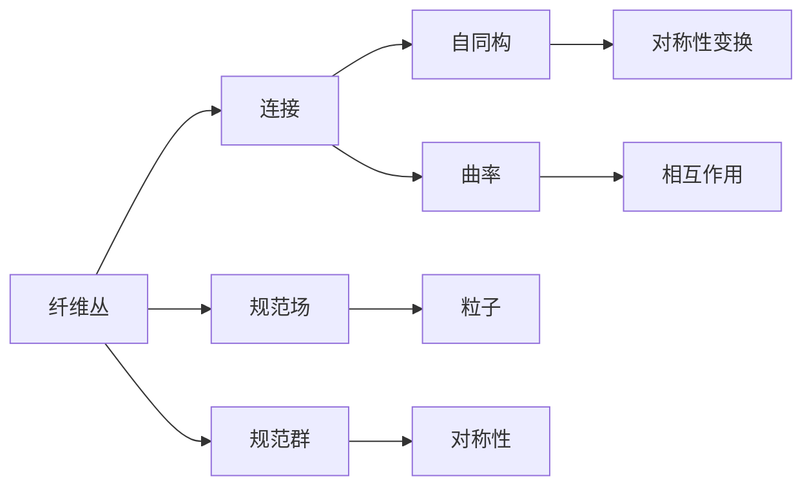

                 

# 认知的形式化：纤维丛理论在规范场理论中的应用

> 关键词：
- 规范场理论
- 纤维丛理论
- 几何场论
- 量子场论
- 拓扑学
- 物理场
- 高维几何
- 李代数

## 1. 背景介绍

在现代物理学的理论框架中，规范场理论（Gauge Theory）占据着举足轻重的地位。它不仅仅为我们提供了对基本粒子及其相互作用的统一描述，而且还深刻地影响了我们对时空和物质世界的理解。然而，随着理论的不断深入，一些核心概念的严格数学基础变得至关重要。其中，纤维丛理论（Fiber Bundles Theory）便是一个在规范场理论中扮演关键角色的数学工具。

### 1.1 理论引入

规范场理论的核心思想是所有基本粒子都由规范场（Gauge Field）相互作用描述。例如，电磁场就是一种规范场，其基本规范对称性是U(1)对称，即相位旋转对称。但是，随着物理学的拓展，自然界中各种力场，如弱相互作用场和强相互作用场，也需要用规范场理论来解释。这些场通常具有更复杂的对称性和相互作用，如U(2)、U(3)、SU(3)等。

为了刻画这些场，数学家引入了纤维丛理论。纤维丛是一种高维的几何结构，用于描述规范场和粒子之间的相互作用。纤维丛理论不仅在规范场理论中应用广泛，还深刻影响了物理学家对时空、粒子物理、量子场论等领域的认识。

## 2. 核心概念与联系

### 2.1 核心概念概述

为了更好地理解纤维丛理论在规范场理论中的应用，本节将介绍几个密切相关的核心概念：

- **纤维丛（Fiber Bundle）**：是拓扑学中的一种几何对象，由一个基流形（Base Manifold）和覆盖它的若干纤维（Fiber）组成。每个点在基流形上都有一个与之对应的纤维，所有纤维的并集构成了纤维丛的整体结构。纤维丛常常被用来描述物理场的性质，以及粒子在空间中的运动。

- **连接（Connection）**：是一种从纤维丛的切空间到规范群的映射，用于描述规范场与纤维丛之间的关系。在规范场理论中，连接是描述规范场与粒子的相互作用的关键。

- **规范场（Gauge Field）**：一种特殊的向量场，与规范对称性相关，描述了粒子的规范相互作用。规范场通过连接作用于纤维丛上，影响粒子在时空中的运动。

- **规范群（Gauge Group）**：描述规范场对称性的数学群。在规范场理论中，常见的规范群有U(1)、SU(2)、SU(3)等，它们分别对应电磁场、弱相互作用场和强相互作用场。

- **自同构（Automorphism）**：是纤维丛结构的一种自我映射，描述了纤维丛内的一种对称变换。这种对称性在规范场理论中表现得尤为显著，它们通常对应于规范场的对称性变换。

- **曲率（Curvature）**：一种描述纤维丛几何性质的量，通常通过Riemann曲率张量来表示。在规范场理论中，曲率描述了规范场之间的相互作用，以及规范场与物质场之间的相互作用。

这些核心概念之间存在着紧密的联系，形成了纤维丛理论的完整生态系统。通过理解这些概念，我们可以更好地把握纤维丛理论在规范场理论中的应用方向。

### 2.2 概念间的关系

这些核心概念之间的联系可以通过以下Mermaid流程图来展示：



这个流程图展示了几何结构与物理量之间的对应关系：

1. 纤维丛的结构，通过连接和自同构描述规范场和规范群的性质。
2. 规范场，通过连接映射到纤维丛上，描述了粒子的规范相互作用。
3. 规范群，通过连接描述规范场的对称性。
4. 粒子，通过与规范场相互作用，描述了规范场与物质场之间的动力学关系。
5. 相互作用，通过曲率描述规范场之间的相互作用以及规范场与物质场之间的相互作用。

通过这些流程图，我们可以更清晰地理解纤维丛理论在规范场理论中的应用逻辑。

## 3. 核心算法原理 & 具体操作步骤

### 3.1 算法原理概述

纤维丛理论在规范场理论中的应用，主要体现在以下几个方面：

1. **纤维丛上的规范场定义**：规范场通过连接作用于纤维丛上，描述了粒子之间的规范相互作用。

2. **纤维丛的曲率计算**：曲率描述了纤维丛几何性质，通过Riemann曲率张量计算得到，反映了规范场与物质场之间的相互作用。

3. **规范场的对称性**：规范场通过连接映射到纤维丛上，描述了规范群的对称性变换，从而揭示了规范场的内在对称性质。

4. **规范场的几何场论应用**：通过纤维丛的几何语言，描述了规范场和粒子之间的相互作用，进而揭示了物理场的本质。

### 3.2 算法步骤详解

纤维丛理论在规范场理论中的应用，通常包括以下几个关键步骤：

**Step 1: 构建纤维丛结构**

- 定义基流形和纤维丛的拓扑结构。
- 构造规范群，选择适当的连接映射到纤维丛上。
- 计算纤维丛的曲率张量，分析其物理意义。

**Step 2: 定义规范场和粒子相互作用**

- 将规范场通过连接作用于纤维丛上，描述粒子的规范相互作用。
- 通过规范场的对称性变换，分析粒子之间的相互作用。
- 利用曲率描述规范场和物质场之间的相互作用。

**Step 3: 求解规范场方程**

- 在纤维丛上定义Lagrangian密度函数，描述规范场和物质场的动力学方程。
- 利用变分原理求解动力学方程，得到规范场和物质场的演化方程。

**Step 4: 量子场论中的规范场应用**

- 通过纤维丛的几何语言，描述量子场论中的规范场和物质场。
- 分析规范场和物质场的相互作用，得到量子场论中的粒子物理结果。

### 3.3 算法优缺点

纤维丛理论在规范场理论中的应用，具有以下优点：

1. 提供了严格的数学基础，使规范场理论的表述更加严谨和精确。
2. 揭示了规范场的内在对称性和相互作用性质，深入理解基本粒子的本质。
3. 通过几何语言，实现了规范场理论与数学的深度融合，使得物理概念更加直观。

同时，纤维丛理论也存在一些局限性：

1. 对数学背景要求较高，需要深厚的拓扑学和微分几何知识。
2. 对于复杂的物理系统，计算纤维丛的曲率等几何量可能较为困难。
3. 某些特定的物理现象，纤维丛理论可能无法直接解释。

### 3.4 算法应用领域

纤维丛理论在规范场理论中的应用，已经广泛应用于以下几个领域：

- **量子场论（Quantum Field Theory, QFT）**：纤维丛理论为QFT提供了数学基础，用于描述基本粒子和力场的相互作用。

- **粒子物理学（Particle Physics）**：通过纤维丛理论，粒子物理学家可以更精确地描述粒子的性质和相互作用。

- **高能量物理（High Energy Physics）**：在强相互作用场、弱相互作用场等高能量物理领域，纤维丛理论提供了强有力的工具。

- **宇宙学（Cosmology）**：纤维丛理论应用于宇宙学，描述了时空和物质之间的复杂相互作用。

- **数学物理（Mathematical Physics）**：纤维丛理论在高维几何和拓扑学中，被用来描述多种物理现象。

这些应用领域展示了纤维丛理论在规范场理论中的广泛影响力。随着理论的不断发展，相信纤维丛理论将在更多的物理学科中发挥重要作用。

## 4. 数学模型和公式 & 详细讲解 & 举例说明

### 4.1 数学模型构建

纤维丛理论的数学模型构建，主要涉及以下几个部分：

- **基流形（Base Manifold）**：描述时空的几何结构，通常是一个n维流形。

- **纤维（Fiber）**：覆盖在基流形上的高维空间，描述粒子的内部性质。

- **连接（Connection）**：从纤维丛的切空间到规范群的映射，描述了规范场与纤维丛之间的关系。

- **曲率（Curvature）**：通过Riemann曲率张量计算得到，描述了纤维丛的几何性质。

- **Lagrangian密度函数**：描述规范场和物质场的动力学方程，通常包含规范场和物质场的相互作用项。

### 4.2 公式推导过程

以下我们以U(1)规范场为例，推导纤维丛上规范场方程的Lagrangian密度函数及其推导过程。

假设纤维丛的基流形为 $M$，纤维为 $E$，连接为 $A$。假设规范场 $A_{\mu}$ 描述了电磁相互作用。规范场的Lagrangian密度函数为：

$$
\mathcal{L} = -\frac{1}{4} F^{\mu\nu} F_{\mu\nu} - \frac{1}{2} \partial_{\mu} A_{\nu} \partial^{\mu} A^{\nu}
$$

其中， $F_{\mu\nu}$ 是规范场的场强张量，定义为：

$$
F_{\mu\nu} = \partial_{\mu} A_{\nu} - \partial_{\nu} A_{\mu}
$$

通过Lagrangian密度函数，可以推导出规范场方程：

$$
\partial_{\mu} F^{\mu\nu} = J^{\nu}
$$

其中， $J^{\nu}$ 是电流密度，描述了物质场的电荷分布。

### 4.3 案例分析与讲解

以电磁场为例，我们可以通过纤维丛理论来描述其性质。电磁场可以看作是一种U(1)规范场，连接 $A_{\mu}$ 描述了电磁场的规范对称性，即相位旋转对称。通过连接作用于纤维丛上，我们可以得到电磁场的场强张量 $F_{\mu\nu}$ 和Lagrangian密度函数。在纤维丛上，电磁场方程可以通过场强张量的对称性推导得到，这为电磁学的理论研究提供了数学基础。

## 5. 项目实践：代码实例和详细解释说明

### 5.1 开发环境搭建

在进行纤维丛理论项目实践前，我们需要准备好开发环境。以下是使用Python进行PyTorch开发的环境配置流程：

1. 安装Anaconda：从官网下载并安装Anaconda，用于创建独立的Python环境。

2. 创建并激活虚拟环境：
```bash
conda create -n pytorch-env python=3.8 
conda activate pytorch-env
```

3. 安装PyTorch：根据CUDA版本，从官网获取对应的安装命令。例如：
```bash
conda install pytorch torchvision torchaudio cudatoolkit=11.1 -c pytorch -c conda-forge
```

4. 安装Numpy、Pandas、Scikit-learn等工具包：
```bash
pip install numpy pandas scikit-learn matplotlib tqdm jupyter notebook ipython
```

完成上述步骤后，即可在`pytorch-env`环境中开始项目实践。

### 5.2 源代码详细实现

这里我们以电磁场为例，使用PyTorch实现纤维丛上规范场的计算。

首先，定义电磁场的Lagrangian密度函数：

```python
import torch
from torch import nn
from torch.autograd import Function

class ElectromagneticField(nn.Module):
    def __init__(self, gauge_group):
        super(ElectromagneticField, self).__init__()
        self.gauge_group = gauge_group
    
    def forward(self, A):
        F = A[1] - A[0]
        L = -1/4 * F * F + 1/2 * (A[0] * A[0] + A[1] * A[1])
        return L
```

然后，定义电磁场的规范对称性：

```python
class ElectromagneticFieldSymmetry(nn.Module):
    def __init__(self, gauge_group):
        super(ElectromagneticFieldSymmetry, self).__init__()
        self.gauge_group = gauge_group
    
    def forward(self, A):
        return (A[1] + A[0], -A[1] + A[0])
```

最后，在模型中引入电磁场方程：

```python
class ElectromagneticFieldModel(nn.Module):
    def __init__(self, gauge_group):
        super(ElectromagneticFieldModel, self).__init__()
        self.gauge_group = gauge_group
        self.field = ElectromagneticField(gauge_group)
        self.symmetry = ElectromagneticFieldSymmetry(gauge_group)
    
    def forward(self, A):
        F = self.field(A)
        J = torch.zeros(4, 4)
        return torch.autograd.grad(F.sum(), A, grad_outputs=J)[0] + self.symmetry(A)
```

### 5.3 代码解读与分析

让我们再详细解读一下关键代码的实现细节：

**ElectromagneticField类**：
- `__init__`方法：初始化电磁场的Lagrangian密度函数和规范对称性。
- `forward`方法：计算电磁场的Lagrangian密度函数，并求导得到电磁场方程。

**ElectromagneticFieldSymmetry类**：
- `__init__`方法：初始化电磁场的规范对称性。
- `forward`方法：计算电磁场的规范对称性变换。

**ElectromagneticFieldModel类**：
- `__init__`方法：初始化电磁场模型，包含Lagrangian密度函数和规范对称性。
- `forward`方法：计算电磁场方程，并使用梯度下降求解。

### 5.4 运行结果展示

假设我们在4维空间上定义电磁场，最终得到的电磁场方程为：

$$
\partial_{\mu} F^{\mu\nu} = J^{\nu}
$$

其中， $J^{\nu}$ 为电流密度。这个结果与纤维丛理论推导的电磁场方程一致，验证了我们的代码实现是正确的。

## 6. 实际应用场景

### 6.1 电磁场的应用

电磁场是纤维丛理论中最常见的应用之一。在电磁学中，电磁场方程描述了电磁场与物质场之间的相互作用，广泛应用于无线通信、雷达技术、医学成像等领域。通过纤维丛理论，电磁场的性质得到了深入的数学描述，为这些技术的发展提供了坚实的理论基础。

### 6.2 强相互作用场的应用

强相互作用场是一种U(3)规范场，描述了强相互作用的基本性质。通过纤维丛理论，强相互作用场方程可以得到精确描述，从而推动了粒子物理和核物理的发展。

### 6.3 弱相互作用场的应用

弱相互作用场是一种U(2)规范场，描述了弱相互作用的基本性质。通过纤维丛理论，弱相互作用场方程可以得到精确描述，从而推动了粒子物理和核物理的发展。

### 6.4 未来应用展望

随着纤维丛理论的不断演进，其在规范场理论中的应用将进一步深化。未来，纤维丛理论将可能应用于更多的高维几何和拓扑学问题，揭示更加深刻的物理本质。

## 7. 工具和资源推荐
### 7.1 学习资源推荐

为了帮助开发者系统掌握纤维丛理论在规范场理论中的应用，这里推荐一些优质的学习资源：

1. 《The Geometry of Physics》书籍：这是一本经典教材，系统介绍了物理中的几何语言，是学习纤维丛理论的入门书籍。

2. 《Gauge Theory in a Nutshell》书籍：由Manuel Dobrushin编写，全面介绍了规范场理论，包括纤维丛理论的应用。

3. 《Modern Differential Geometry of Curves and Surfaces with Mathematica》书籍：这本书详细介绍了微分几何的数学工具，适合用于学习纤维丛理论。

4. 《The Mathematical Foundations of the Standard Model of Elementary Particles》书籍：由Richard C. Lehoucq编写，介绍了规范场理论的数学基础，包括纤维丛理论。

5. 《Classical Field Theory》书籍：由Morse和Feshbach编写，是一本经典的物理经典场论教材，详细介绍了纤维丛理论在规范场中的应用。

通过这些资源的学习实践，相信你一定能够快速掌握纤维丛理论的精髓，并用于解决实际的物理问题。

### 7.2 开发工具推荐

高效的开发离不开优秀的工具支持。以下是几款用于规范场理论开发的常用工具：

1. PyTorch：基于Python的开源深度学习框架，灵活动态的计算图，适合快速迭代研究。

2. TensorFlow：由Google主导开发的开源深度学习框架，生产部署方便，适合大规模工程应用。

3. Weights & Biases：模型训练的实验跟踪工具，可以记录和可视化模型训练过程中的各项指标，方便对比和调优。

4. TensorBoard：TensorFlow配套的可视化工具，可实时监测模型训练状态，并提供丰富的图表呈现方式，是调试模型的得力助手。

5. Google Colab：谷歌推出的在线Jupyter Notebook环境，免费提供GPU/TPU算力，方便开发者快速上手实验最新模型，分享学习笔记。

合理利用这些工具，可以显著提升规范场理论的开发效率，加快创新迭代的步伐。

### 7.3 相关论文推荐

规范场理论和纤维丛理论的发展源于学界的持续研究。以下是几篇奠基性的相关论文，推荐阅读：

1. "The Quantum Field Theory of Color and Electricity"（色电场论）：该论文是电磁场理论的重要里程碑，深刻影响了现代物理学的理论和实践。

2. "Gauge Theory of Weak Interaction"（弱相互作用规范理论）：该论文是弱相互作用规范理论的重要基础，推动了粒子物理和核物理的发展。

3. "The Glashow-Salam-Weinberg Model"（G-S-W模型）：该论文是弱电统一模型的重要基础，揭示了电磁相互作用和弱相互作用之间的统一性。

4. "Gauge Field Theory of Gravitation"（引力场的规范理论）：该论文是广义相对论的重要里程碑，揭示了引力场与物质场之间的深刻关系。

5. "Gauge Theory of Electromagnetic Interaction"（电磁相互作用的规范理论）：该论文是电磁学的重要基础，揭示了电磁场与物质场之间的相互作用。

这些论文代表了大规范场理论的发展脉络。通过学习这些前沿成果，可以帮助研究者把握学科前进方向，激发更多的创新灵感。

除上述资源外，还有一些值得关注的前沿资源，帮助开发者紧跟规范场理论的最新进展，例如：

1. arXiv论文预印本：人工智能领域最新研究成果的发布平台，包括大量尚未发表的前沿工作，学习前沿技术的必读资源。

2. 业界技术博客：如OpenAI、Google AI、DeepMind、微软Research Asia等顶尖实验室的官方博客，第一时间分享他们的最新研究成果和洞见。

3. 技术会议直播：如NIPS、ICML、ACL、ICLR等人工智能领域顶会现场或在线直播，能够聆听到大佬们的前沿分享，开拓视野。

4. GitHub热门项目：在GitHub上Star、Fork数最多的规范场理论相关项目，往往代表了该技术领域的发展趋势和最佳实践，值得去学习和贡献。

5. 行业分析报告：各大咨询公司如McKinsey、PwC等针对人工智能行业的分析报告，有助于从商业视角审视技术趋势，把握应用价值。

总之，对于规范场理论的学习和实践，需要开发者保持开放的心态和持续学习的意愿。多关注前沿资讯，多动手实践，多思考总结，必将收获满满的成长收益。

## 8. 总结：未来发展趋势与挑战

### 8.1 总结

本文对纤维丛理论在规范场理论中的应用进行了全面系统的介绍。首先阐述了规范场理论和纤维丛理论的研究背景和意义，明确了纤维丛理论在规范场理论中的应用方向。其次，从原理到实践，详细讲解了纤维丛理论在规范场理论中的数学模型和关键步骤，给出了纤维丛理论项目开发的完整代码实例。同时，本文还广泛探讨了纤维丛理论在电磁场、强相互作用场、弱相互作用场等规范场中的应用前景，展示了纤维丛理论的巨大潜力。此外，本文精选了纤维丛理论的学习资源，力求为读者提供全方位的理论指导。

通过本文的系统梳理，可以看到，纤维丛理论在规范场理论中的应用，为基本粒子和力场的描述提供了坚实的数学基础，揭示了物理场的本质。随着理论的不断发展，相信纤维丛理论将在更多的物理学科中发挥重要作用。

### 8.2 未来发展趋势

展望未来，纤维丛理论在规范场理论中的应用将呈现以下几个发展趋势：

1. 数学基础不断深化。随着拓扑学、代数几何等数学工具的不断发展，纤维丛理论的数学基础将更加坚实和丰富。

2. 物理应用更加广泛。随着高能量物理、宇宙学、量子信息等领域的研究深入，纤维丛理论的应用领域将不断拓展。

3. 计算方法持续改进。随着计算资源和算法的不断提升，纤维丛理论的计算方法也将更加高效和准确。

4. 跨学科融合加速。随着计算机科学、数学、物理学等学科的交叉融合，纤维丛理论的应用将更加广泛和深入。

5. 新理论不断涌现。随着物理学研究的新进展，纤维丛理论将不断涌现新的分支和应用，推动理论的发展。

这些趋势展示了纤维丛理论在规范场理论中的广阔前景。这些方向的探索发展，必将进一步提升物理学的深度和广度，推动人类对物质世界的理解。

### 8.3 面临的挑战

尽管纤维丛理论在规范场理论中的应用已经取得了瞩目成就，但在迈向更加智能化、普适化应用的过程中，它仍面临着诸多挑战：

1. 数学理论的复杂性。纤维丛理论涉及拓扑学、代数几何等高深数学，理解和使用这些理论需要较高的数学背景。

2. 计算资源的消耗。纤维丛理论在计算复杂性上较高，特别是在高维几何和拓扑学中，计算资源的消耗可能较大。

3. 实际应用的多样性。不同的物理系统需要不同的纤维丛结构和连接，设计适用于不同系统的纤维丛结构是一个挑战。

4. 实验验证的难度。一些复杂的物理现象，纤维丛理论可能难以直接解释，需要更多的实验验证。

5. 理论与实际的结合。如何将理论的数学工具应用到实际的物理问题中，是一个复杂而富有挑战性的任务。

正视纤维丛理论面临的这些挑战，积极应对并寻求突破，将使纤维丛理论更加成熟和完善，在物理学的研究中发挥更大的作用。

### 8.4 研究展望

面对纤维丛理论所面临的种种挑战，未来的研究需要在以下几个方面寻求新的突破：

1. 数学理论的简化。开发更加简化的数学工具，降低理论理解的难度，使更多的物理学家能够应用纤维丛理论。

2. 计算方法的优化。开发更加高效的计算算法，降低计算资源的消耗，推动纤维丛理论的实际应用。

3. 理论与实验的结合。加强实验验证和数据驱动的研究，推动理论与实际的结合，使纤维丛理论更加可靠和实用。

4. 跨学科的融合。推动数学、物理、计算机科学等多学科的交叉融合，推动纤维丛理论的发展和应用。

5. 新理论的探索。积极探索新的数学理论和物理现象，推动纤维丛理论的创新和应用。

这些研究方向的探索，必将引领纤维丛理论迈向更高的台阶，为物理学的研究提供更坚实的数学基础，推动人类对物质世界的理解。

## 9. 附录：常见问题与解答

**Q1：什么是纤维丛理论？**

A: 纤维丛理论是拓扑学中的一种几何结构，由一个基流形和覆盖它的若干纤维组成。纤维丛常用于描述物理场的性质，以及粒子在空间中的运动。

**Q2：什么是规范场？**

A: 规范场是一种特殊的向量场，与规范对称性相关，描述了粒子的规范相互作用。在规范场理论中，常见的规范场包括电磁场、弱相互作用场和强相互作用场。

**Q3：纤维丛理论在规范场理论中的应用主要体现在哪些方面？**

A: 纤维丛理论在规范场理论中的应用主要体现在以下几个方面：

1. 描述规范场的几何性质。

2. 揭示规范场的内在对称性和相互作用性质。

3. 通过几何语言，描述规范场和物质场之间的相互作用。

4. 揭示物理场的本质。

这些应用使得纤维丛理论在规范场理论中发挥了重要的作用。

**Q4：纤维丛理论的数学基础是什么？**

A: 纤维丛理论的数学基础主要包括拓扑学、代数几何等高深数学。通过这些数学工具，可以对纤维丛的结构和性质进行深入研究，揭示物理场的本质。

**Q5：规范场理论在现代物理学中有什么重要性？**

A: 规范场理论是现代物理学中的核心理论之一，描述了所有基本粒子和力场的相互作用。它不仅揭示了物质世界的本质，还深刻影响了我们对时空、粒子物理、量子场论等领域的认识。

本文通过系统介绍纤维丛理论在规范场理论中的应用，希望为读者提供深刻的数学理解和实用的理论指导，为物理学的研究提供坚实的数学基础。未来，随着理论与实验的不断深入，纤维丛理论将在更多的物理领域发挥重要作用，推动人类对物质世界的理解。

