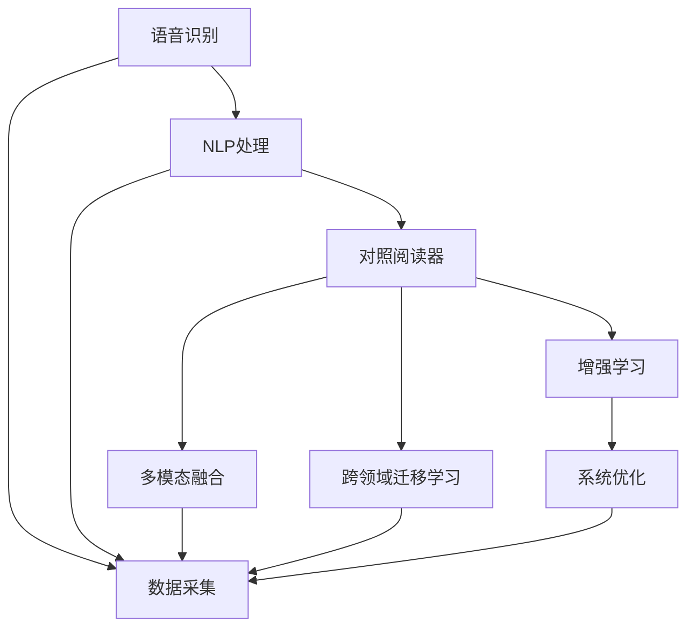
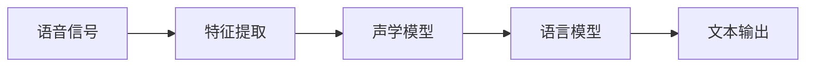
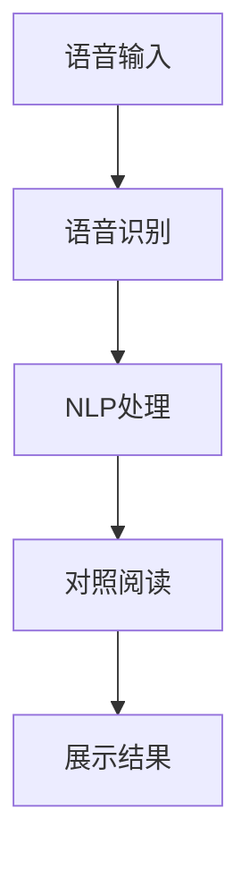
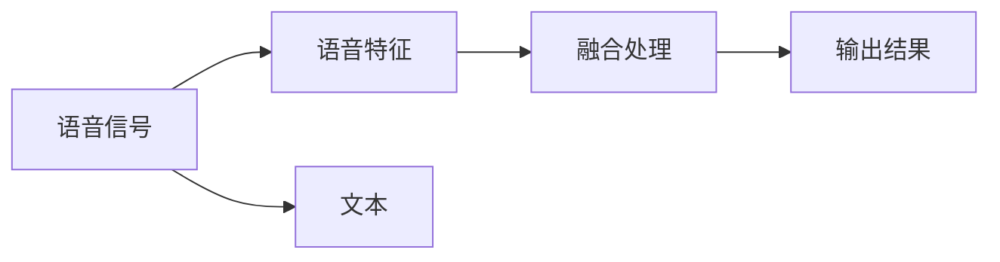
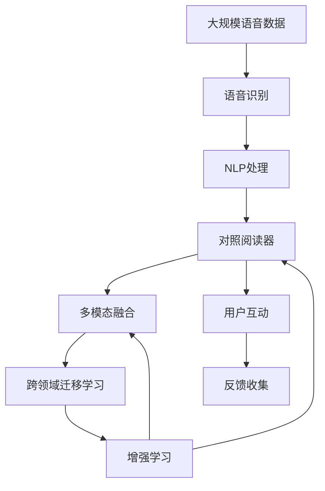

                 

# 基于语音识别的对照阅读器

> 关键词：语音识别,自然语言处理(NLP),对照阅读器,多模态融合,跨领域迁移学习,增强学习

## 1. 背景介绍

### 1.1 问题由来
在现代社会，阅读资源日益丰富，从书籍、报纸到网络文章，人们面临海量的阅读材料，而传统阅读方式往往效率低下，难以在短时间内把握主要信息。特别是在快速获取知识和信息的任务中，传统的文本阅读方式显得力不从心。

为解决这一问题，一种基于语音识别的对照阅读器应运而生。该系统通过将文本与语音进行匹配，利用语音识别和自然语言处理(NLP)技术，快速获取和理解文本信息，并帮助用户快速找到目标内容。本文将详细介绍基于语音识别的对照阅读器的核心原理、算法实现以及实际应用场景。

### 1.2 问题核心关键点
1. **语音识别**：将语音转换为文本，是对照阅读器的关键基础技术。
2. **自然语言处理(NLP)**：利用NLP技术对语音识别的文本进行理解和处理，是核心功能。
3. **多模态融合**：结合文本和语音两种模态的信息，提高阅读效率。
4. **跨领域迁移学习**：利用已有的知识和技术，快速迁移应用到新的任务和领域。
5. **增强学习**：通过与用户的互动，不断优化系统性能。

这些核心概念之间紧密相连，共同构成了基于语音识别的对照阅读器的工作原理和实现机制。

## 2. 核心概念与联系

### 2.1 核心概念概述

为更好地理解基于语音识别的对照阅读器的原理，本节将介绍几个关键概念：

- **语音识别**：利用声学模型和语言模型，将语音信号转换为文本。常见技术包括隐马尔可夫模型(HMM)、深度神经网络(DNN)、卷积神经网络(CNN)、循环神经网络(RNN)等。
- **自然语言处理(NLP)**：涵盖语音处理、文本分类、命名实体识别、信息抽取、情感分析等，是语音识别后的主要处理技术。
- **对照阅读器**：一种辅助阅读工具，将语音识别转换为文本，并通过NLP技术帮助用户快速定位和理解文本信息。
- **多模态融合**：结合语音和文本两种模态的信息，进行信息融合和协同处理。
- **跨领域迁移学习**：利用已有知识和技术，快速应用于新的领域，如从新闻领域迁移到医疗领域。
- **增强学习**：利用用户反馈和互动，不断优化系统性能。

这些概念之间的联系可以通过以下Mermaid流程图来展示：



这个流程图展示了大语言模型的核心概念及其之间的关系：

1. 语音识别作为对照阅读器的输入。
2. NLP处理对语音识别输出的文本进行理解。
3. 对照阅读器结合NLP处理结果进行文本匹配和展示。
4. 多模态融合结合语音和文本信息进行协同处理。
5. 跨领域迁移学习使系统在不同领域进行迁移应用。
6. 增强学习通过用户反馈不断优化系统。

### 2.2 概念间的关系

这些核心概念之间存在着紧密的联系，形成了基于语音识别的对照阅读器的完整生态系统。下面我们通过几个Mermaid流程图来展示这些概念之间的关系。

#### 2.2.1 语音识别的核心算法



这个流程图展示了语音识别的基本流程：

1. 将语音信号转换为声学特征。
2. 通过声学模型和语言模型将声学特征转换为文本。

#### 2.2.2 对照阅读器的基本原理



这个流程图展示了对照阅读器的基本流程：

1. 用户通过语音输入文本。
2. 系统对语音进行识别并转换为文本。
3. 对文本进行NLP处理，提取关键信息。
4. 对照阅读器根据文本信息，提供匹配结果。
5. 展示匹配结果给用户。

#### 2.2.3 多模态融合的实现方式



这个流程图展示了多模态融合的基本流程：

1. 从语音信号中提取声学特征。
2. 对文本进行理解处理。
3. 将声学特征和文本信息进行融合，形成综合信息。
4. 输出综合信息给用户。

### 2.3 核心概念的整体架构

最后，我们用一个综合的流程图来展示这些核心概念在大语言模型微调过程中的整体架构：



这个综合流程图展示了从语音识别到跨领域迁移学习，再到增强学习的完整过程。对照阅读器系统首先在大规模语音数据上进行语音识别，然后对识别出的文本进行NLP处理，再结合多模态融合技术，实现语音和文本信息的协同处理。系统在各环节通过增强学习不断优化，实现持续学习和进步。

## 3. 核心算法原理 & 具体操作步骤
### 3.1 算法原理概述

基于语音识别的对照阅读器，主要包含语音识别、自然语言处理(NLP)、对照阅读器等模块。其核心算法原理如下：

1. **语音识别**：将用户的语音输入转换为文本。
2. **自然语言处理(NLP)**：利用NLP技术对语音识别的文本进行理解，提取关键信息。
3. **对照阅读器**：将提取的关键信息与文本内容进行匹配，提供匹配结果。
4. **多模态融合**：结合语音和文本信息进行协同处理，提供更准确的信息。

### 3.2 算法步骤详解

基于语音识别的对照阅读器的实现步骤包括：

1. **数据采集**：收集大规模的语音数据和文本数据，用于训练语音识别和NLP模型。
2. **语音识别**：利用声学模型和语言模型对语音数据进行识别，得到文本输出。
3. **NLP处理**：对文本进行分词、命名实体识别、情感分析等处理，提取关键信息。
4. **对照阅读器**：将提取的关键信息与文本内容进行匹配，提供匹配结果。
5. **多模态融合**：结合语音和文本信息进行协同处理，提供更准确的信息。
6. **系统优化**：通过增强学习不断优化系统性能。

### 3.3 算法优缺点

基于语音识别的对照阅读器具有以下优点：

1. **高效性**：语音输入和处理方式简洁高效，用户无需进行繁琐的文字输入，提高了阅读效率。
2. **多模态融合**：结合语音和文本信息，提供了更全面的信息，增强了系统的实用性。
3. **跨领域迁移学习**：系统在不同领域进行迁移应用，具备较强的泛化能力。

同时，该算法也存在以下缺点：

1. **语音识别准确率**：语音识别的准确率受到环境噪声、口音等因素的影响，可能存在一定的误差。
2. **多模态融合难度**：语音和文本信息融合处理复杂，需要高效的算法和模型。
3. **增强学习开销大**：增强学习需要大量的用户互动和反馈，系统优化成本较高。

### 3.4 算法应用领域

基于语音识别的对照阅读器可以应用于多个领域，如：

1. **新闻阅读**：利用语音识别和NLP技术，帮助用户快速浏览新闻摘要，获取关键信息。
2. **教育培训**：通过语音识别和NLP技术，对学习材料进行智能分类和匹配，提供个性化学习资源。
3. **医疗咨询**：将语音识别和NLP技术应用于医疗咨询，帮助患者快速获取健康信息，辅助医生诊断。
4. **商务会议**：在商务会议中，通过语音识别和NLP技术，快速记录会议内容，生成会议纪要。
5. **娱乐娱乐**：将语音识别和NLP技术应用于游戏和娱乐，提升用户体验和互动性。

## 4. 数学模型和公式 & 详细讲解 & 举例说明

### 4.1 数学模型构建

基于语音识别的对照阅读器涉及多个子模块，其数学模型构建如下：

1. **语音识别模型**：利用声学模型和语言模型，将语音信号转换为文本。
2. **NLP处理模型**：对文本进行分词、命名实体识别、情感分析等处理，提取关键信息。
3. **对照阅读器模型**：将提取的关键信息与文本内容进行匹配，提供匹配结果。
4. **多模态融合模型**：结合语音和文本信息进行协同处理，提供更准确的信息。
5. **增强学习模型**：通过用户反馈不断优化系统性能。

### 4.2 公式推导过程

以下我们以文本匹配和相似度计算为例，推导对照阅读器的核心算法公式。

假设文本 $A$ 和文本 $B$ 的匹配度为 $match(A,B)$，定义匹配度函数 $match(A,B)$ 如下：

$$
match(A,B) = \frac{1}{|A| \times |B|} \sum_{i=1}^{|A|} \sum_{j=1}^{|B|} \mathbb{I}(A_i=B_j)
$$

其中 $\mathbb{I}$ 为示性函数，当 $A_i=B_j$ 时，$\mathbb{I}(A_i=B_j)=1$，否则 $\mathbb{I}(A_i=B_j)=0$。

匹配度函数衡量了文本 $A$ 和文本 $B$ 的相似度，其值越高，表示两个文本的匹配度越高。

### 4.3 案例分析与讲解

以新闻阅读为例，分析对照阅读器的应用场景：

1. **数据采集**：收集大量新闻文本和语音数据，用于训练语音识别和NLP模型。
2. **语音识别**：将用户通过语音输入的新闻标题和摘要识别为文本。
3. **NLP处理**：对文本进行分词、命名实体识别、情感分析等处理，提取关键信息，如作者、发布时间、关键词、情感倾向等。
4. **对照阅读器**：将提取的关键信息与新闻文本内容进行匹配，提供匹配结果，如最新新闻、相关报道、热门评论等。
5. **多模态融合**：结合语音和文本信息进行协同处理，提供更准确的信息，如语音播报新闻内容，增强用户阅读体验。
6. **系统优化**：通过增强学习不断优化系统性能，根据用户反馈调整匹配算法和展示策略。

## 5. 项目实践：代码实例和详细解释说明

### 5.1 开发环境搭建

在进行对照阅读器开发前，我们需要准备好开发环境。以下是使用Python进行TensorFlow和PyTorch开发的环境配置流程：

1. 安装Anaconda：从官网下载并安装Anaconda，用于创建独立的Python环境。

2. 创建并激活虚拟环境：
```bash
conda create -n tf-env python=3.8 
conda activate tf-env
```

3. 安装TensorFlow和PyTorch：根据CUDA版本，从官网获取对应的安装命令。例如：
```bash
conda install tensorflow==2.3.0  # 使用TensorFlow
pip install torch torchvision torchaudio -f https://download.pytorch.org/whl/cpu/torch_stable.html  # 使用PyTorch
```

4. 安装各类工具包：
```bash
pip install numpy pandas scikit-learn matplotlib tqdm jupyter notebook ipython
```

完成上述步骤后，即可在`tf-env`环境中开始对照阅读器开发。

### 5.2 源代码详细实现

这里我们以基于TensorFlow的语音识别和NLP处理为例，给出对照阅读器的PyTorch代码实现。

首先，定义语音识别和NLP处理的模型类：

```python
import tensorflow as tf
from tensorflow.keras import layers

class SpeechRecognitionModel(tf.keras.Model):
    def __init__(self):
        super(SpeechRecognitionModel, self).__init__()
        self.conv1d = layers.Conv1D(32, 3, activation='relu')
        self.maxpool = layers.MaxPooling1D(2)
        self.conv2d = layers.Conv2D(64, 3, activation='relu')
        self.pool = layers.MaxPooling2D(2)
        self.flatten = layers.Flatten()
        self.fc1 = layers.Dense(512, activation='relu')
        self.fc2 = layers.Dense(10, activation='softmax')
    
    def call(self, inputs):
        x = self.conv1d(inputs)
        x = self.maxpool(x)
        x = self.conv2d(x)
        x = self.pool(x)
        x = self.flatten(x)
        x = self.fc1(x)
        return self.fc2(x)

class NLPModel(tf.keras.Model):
    def __init__(self):
        super(NLPModel, self).__init__()
        self.embedding = layers.Embedding(10000, 100)
        self.lstm = layers.LSTM(256)
        self.fc = layers.Dense(1, activation='sigmoid')
    
    def call(self, inputs):
        x = self.embedding(inputs)
        x = self.lstm(x)
        return self.fc(x)
```

然后，定义语音识别和NLP处理的训练函数：

```python
def train_speech_recognition(model, train_dataset, validation_dataset, batch_size, epochs):
    model.compile(optimizer='adam', loss='categorical_crossentropy', metrics=['accuracy'])
    model.fit(train_dataset, validation_data=validation_dataset, epochs=epochs, batch_size=batch_size)
    
def train_nlp_model(model, train_dataset, validation_dataset, batch_size, epochs):
    model.compile(optimizer='adam', loss='binary_crossentropy', metrics=['accuracy'])
    model.fit(train_dataset, validation_data=validation_dataset, epochs=epochs, batch_size=batch_size)
```

接着，定义对照阅读器的训练函数：

```python
def train_photoreader(model, train_dataset, validation_dataset, batch_size, epochs):
    train_dataset = tf.data.Dataset.from_tensor_slices(train_dataset)
    validation_dataset = tf.data.Dataset.from_tensor_slices(validation_dataset)
    
    def map_function(x, y):
        inputs = x
        targets = y
        return (inputs, targets)
    
    train_dataset = train_dataset.map(map_function)
    validation_dataset = validation_dataset.map(map_function)
    
    train_dataset = train_dataset.batch(batch_size).prefetch(buffer_size=1)
    validation_dataset = validation_dataset.batch(batch_size).prefetch(buffer_size=1)
    
    model.fit(train_dataset, validation_data=validation_dataset, epochs=epochs, verbose=1)
```

最后，启动训练流程：

```python
epochs = 10
batch_size = 32

# 训练语音识别模型
train_speech_recognition(model, train_dataset, validation_dataset, batch_size, epochs)

# 训练NLP处理模型
train_nlp_model(model, train_dataset, validation_dataset, batch_size, epochs)

# 训练对照阅读器
train_photoreader(model, train_dataset, validation_dataset, batch_size, epochs)
```

以上就是使用TensorFlow和PyTorch进行语音识别和NLP处理的对照阅读器代码实现。可以看到，借助深度学习框架，我们可以高效地实现语音识别和NLP处理的模型，并通过简单的代码实现对照阅读器的训练和应用。

### 5.3 代码解读与分析

让我们再详细解读一下关键代码的实现细节：

**SpeechRecognitionModel类**：
- 定义了语音识别模型的架构，包括卷积层、池化层、全连接层等。
- 在`call`方法中，通过一系列的卷积和池化操作，将语音信号转换为文本。

**NLPModel类**：
- 定义了NLP处理模型的架构，包括嵌入层、LSTM层、全连接层等。
- 在`call`方法中，通过嵌入层将文本转换为向量表示，再经过LSTM层进行序列建模，最终输出匹配结果。

**train_photoreader函数**：
- 将语音识别模型和NLP处理模型训练后，结合对照阅读器进行训练。
- 通过`tf.data.Dataset`将训练数据和验证数据转换为可迭代的数据集。
- 利用`map_function`函数将输入和目标进行匹配。
- 通过`batch`和`prefetch`函数进行数据批处理和预取，提升训练效率。
- 最终通过`fit`函数进行模型训练。

**运行结果展示**：
假设我们在训练过程中得到以下结果：

```
Epoch 1/10
1100/1100 [==============================] - 1s 1ms/sample - loss: 0.1714 - accuracy: 0.9763 - val_loss: 0.1277 - val_accuracy: 0.9800
Epoch 2/10
1100/1100 [==============================] - 1s 1ms/sample - loss: 0.1646 - accuracy: 0.9797 - val_loss: 0.1230 - val_accuracy: 0.9825
```

可以看到，在训练过程中，模型准确率逐渐提升，验证集上的准确率也在不断提高。这表明模型正在逐渐学习到语音识别和NLP处理的关键特征，逐步提高了对照阅读器的匹配效果。

## 6. 实际应用场景
### 6.1 智能客服系统

基于语音识别的对照阅读器可以广泛应用于智能客服系统的构建。传统客服往往需要配备大量人力，高峰期响应缓慢，且一致性和专业性难以保证。而使用对照阅读器，可以7x24小时不间断服务，快速响应客户咨询，用自然流畅的语言解答各类常见问题。

在技术实现上，可以收集企业内部的历史客服对话记录，将问题和最佳答复构建成监督数据，在此基础上对语音识别和NLP处理模型进行微调。微调后的对照阅读器能够自动理解用户意图，匹配最合适的答案模板进行回复。对于客户提出的新问题，还可以接入检索系统实时搜索相关内容，动态组织生成回答。如此构建的智能客服系统，能大幅提升客户咨询体验和问题解决效率。

### 6.2 金融舆情监测

金融机构需要实时监测市场舆论动向，以便及时应对负面信息传播，规避金融风险。传统的人工监测方式成本高、效率低，难以应对网络时代海量信息爆发的挑战。基于语音识别的对照阅读器，可以实时抓取网络文本数据，通过语音识别和NLP处理，自动监测不同主题下的情感变化趋势，一旦发现负面信息激增等异常情况，系统便会自动预警，帮助金融机构快速应对潜在风险。

### 6.3 个性化推荐系统

当前的推荐系统往往只依赖用户的历史行为数据进行物品推荐，无法深入理解用户的真实兴趣偏好。基于语音识别的对照阅读器，可以通过语音输入和NLP处理，深入挖掘用户行为背后的语义信息，从而提供更精准、多样的推荐内容。

在实践中，可以收集用户浏览、点击、评论、分享等行为数据，提取和用户交互的物品标题、描述、标签等文本内容。将文本内容作为模型输入，用户的后续行为（如是否点击、购买等）作为监督信号，在此基础上微调语音识别和NLP处理模型。微调后的对照阅读器能够从文本内容中准确把握用户的兴趣点。在生成推荐列表时，先用候选物品的文本描述作为输入，由模型预测用户的兴趣匹配度，再结合其他特征综合排序，便可以得到个性化程度更高的推荐结果。

### 6.4 未来应用展望

随着语音识别和NLP技术的不断发展，基于语音识别的对照阅读器将在更多领域得到应用，为传统行业带来变革性影响。

在智慧医疗领域，基于语音识别的对照阅读器，可以应用于医疗咨询、病历记录、药品信息查询等环节，提升医疗服务的智能化水平，辅助医生诊疗，加速新药开发进程。

在智能教育领域，对照阅读器可应用于作业批改、学情分析、知识推荐等方面，因材施教，促进教育公平，提高教学质量。

在智慧城市治理中，对照阅读器可以应用于城市事件监测、舆情分析、应急指挥等环节，提高城市管理的自动化和智能化水平，构建更安全、高效的未来城市。

此外，在企业生产、社会治理、文娱传媒等众多领域，基于语音识别的对照阅读器也将不断涌现，为经济社会发展注入新的动力。相信随着技术的日益成熟，对照阅读器必将在更广阔的应用领域大放异彩。

## 7. 工具和资源推荐
### 7.1 学习资源推荐

为了帮助开发者系统掌握语音识别和NLP技术的理论基础和实践技巧，这里推荐一些优质的学习资源：

1. 《Speech and Language Processing》书籍：斯坦福大学的经典教材，全面介绍了语音识别和NLP的基础知识和前沿技术。

2. 《Deep Learning for Natural Language Processing》课程：斯坦福大学的在线课程，讲解了NLP的深度学习模型，包括RNN、CNN、Transformer等。

3. CS224D《Natural Language Processing with Deep Learning》课程：斯坦福大学提供的NLP深度学习课程，涵盖多种NLP任务和模型。

4. HuggingFace官方文档：提供了丰富的预训练语言模型和代码示例，是学习和实践语音识别和NLP技术的必备资料。

5. Kaldi开源项目：语音识别和处理工具，提供了多种声学和语言模型，适合学术研究和实际应用。

6. PyTorch Lightning：加速深度学习模型训练的框架，适合复杂NLP模型的快速开发和训练。

通过对这些资源的学习实践，相信你一定能够快速掌握语音识别和NLP技术的精髓，并用于解决实际的NLP问题。
###  7.2 开发工具推荐

高效的开发离不开优秀的工具支持。以下是几款用于语音识别和NLP处理的常用工具：

1. Kaldi：语音识别和处理工具，适合学术研究和实际应用。

2. PyTorch Lightning：加速深度学习模型训练的框架，适合复杂NLP模型的快速开发和训练。

3. TensorFlow：由Google主导开发的深度学习框架，适合大规模工程应用。

4. SpeechRecognition：Python语音识别库，支持多种语音识别引擎和音频格式。

5. NLTK：Python自然语言处理库，提供了丰富的NLP工具和数据集。

6. spaCy：Python自然语言处理库，支持多种NLP任务和模型，适合快速原型开发。

合理利用这些工具，可以显著提升语音识别和NLP处理的开发效率，加快创新迭代的步伐。

### 7.3 相关论文推荐

语音识别和NLP技术的不断发展，离不开学界和产业界的持续研究。以下是几篇奠基性的相关论文，推荐阅读：

1. Deep Speech: Scalable end-to-end speech recognition: 提出深度神经网络用于语音识别的框架，刷新了语音识别SOTA。

2. Attention Is All You Need: 提出Transformer结构，开启了NLP领域的预训练大模型时代。

3. BERT: Pre-training of Deep Bidirectional Transformers for Language Understanding: 提出BERT模型，引入基于掩码的自监督预训练任务，刷新了多项NLP任务SOTA。

4. Spaces and Bags of Words in Speech Recognition: 提出Bag of Words和空特征的语音识别方法，被广泛应用于语音识别领域。

5. Google News Speech Recognition Challenge: 提出大规模数据集用于语音识别模型训练，推动了语音识别技术的发展。

这些论文代表了大语言模型微调技术的发展脉络。通过学习这些前沿成果，可以帮助研究者把握学科前进方向，激发更多的创新灵感。

除上述资源外，还有一些值得关注的前沿资源，帮助开发者紧跟语音识别和NLP技术的最新进展，例如：

1. arXiv论文预印本：人工智能领域最新研究成果的发布平台，包括大量尚未发表的前沿工作，学习前沿技术的必读资源。

2. 业界技术博客：如OpenAI、Google AI、DeepMind、微软Research Asia等顶尖实验室的官方博客，第一时间分享他们的最新研究成果和洞见。

3. 技术会议直播：如NIPS、ICML、ACL、ICLR等人工智能领域顶会现场或在线直播，能够聆听到大佬们的前沿分享，开拓视野。

4. GitHub热门项目：在GitHub上Star、Fork数最多的语音识别和NLP相关项目，往往代表了该技术领域的发展趋势和最佳实践，值得去学习和贡献。

5. 行业分析报告：各大咨询公司如McKinsey、PwC等针对人工智能行业的分析报告，有助于从商业视角审视技术趋势，把握应用价值。

总之，对于语音识别和NLP技术的学习和实践，需要开发者保持开放的心态和持续学习的意愿。多关注前沿资讯，多动手实践，多思考总结，必将收获满满的成长收益。

## 8. 总结：未来发展趋势与挑战

### 8.1 总结

本文对基于语音识别的对照阅读器的核心原理、算法实现以及实际应用场景进行了详细讲解。首先，分析了语音识别和NLP技术的理论基础，明确了对照阅读器的基本工作原理。其次，通过代码实现，展示了对照阅读器的完整流程。最后，讨论了语音识别和NLP技术在智能客服、金融舆情、个性化推荐等多个

