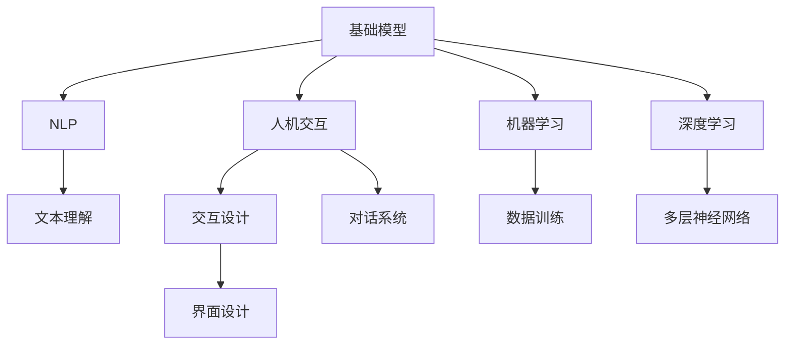

                 

# 基础模型的人机交互能力

> 关键词：基础模型, 人机交互, 自然语言处理(NLP), 交互设计, 机器学习, 深度学习

## 1. 背景介绍

随着人工智能技术的发展，基础模型（Foundational Models）在自然语言处理（Natural Language Processing, NLP）领域，尤其是在人机交互（Human-Computer Interaction, HCI）中的应用，展示了巨大的潜力。基础模型通过在大量无标签文本数据上进行预训练，学习到丰富的语言知识，能够以自然语言形式理解和生成文本，从而在对话系统、智能客服、虚拟助手等场景中展现出色的人机交互能力。本文将系统地探讨基础模型的原理、应用以及面临的挑战，为未来的研究与实践提供参考。

## 2. 核心概念与联系

### 2.1 核心概念概述

1. **基础模型（Foundational Model）**：指通过大规模无标签文本数据预训练，学习通用语言表示的大规模神经网络模型。例如GPT、BERT、T5等。
2. **人机交互（Human-Computer Interaction, HCI）**：指计算机系统与人类用户之间的交流和协作。包括对话系统、智能客服、虚拟助手等多种形式。
3. **自然语言处理（Natural Language Processing, NLP）**：指使用计算机技术处理、理解和生成自然语言的技术。基础模型在NLP中尤为突出。
4. **交互设计（Interaction Design）**：指设计用户与计算机系统互动的界面和流程，以提高用户满意度。基础模型在该领域提供重要支持。
5. **机器学习（Machine Learning, ML）**：指通过数据训练模型，使其能够从数据中学习规律，并应用于新数据。基础模型是ML的重要工具。
6. **深度学习（Deep Learning, DL）**：指通过多层次神经网络模型学习数据特征，深度学习模型常用于基础模型。

### 2.2 核心概念间的联系

以上核心概念之间的关系可以直观地通过以下Mermaid流程图展示：



该图展示了基础模型在NLP、人机交互、交互设计、机器学习和深度学习中的应用和联系。基础模型通过深度学习技术在NLP领域学习到丰富的语言知识，并将其应用于人机交互中，提升系统的自然语言理解和生成能力，同时通过交互设计优化用户界面和流程，最终在机器学习框架下进行数据训练，实现模型优化和应用。

## 3. 核心算法原理 & 具体操作步骤
### 3.1 算法原理概述

基础模型的人机交互能力主要依赖于其在预训练阶段学到的语言知识，以及通过微调（Fine-tuning）在下游任务上学习到的特定领域知识。其核心算法原理包括以下几个步骤：

1. **预训练**：在大规模无标签文本数据上，通过自监督学习任务（如语言建模、掩码语言模型等）训练基础模型，使其学习到通用的语言表示。
2. **微调**：选择与特定任务相关的少量标注数据，对基础模型进行有监督学习，调整模型参数以适应该任务。
3. **交互设计**：设计适合人机交互的界面和交互流程，使得用户能够方便地与系统进行自然语言交流。
4. **推理与回应**：在用户输入文本后，基础模型通过推理得到对应的回应，并返回给用户。

### 3.2 算法步骤详解

以下详细描述基础模型人机交互能力的实现步骤：

**Step 1: 准备数据集**
- 收集并准备目标任务的数据集，确保数据集的质量和多样性。
- 将数据集划分为训练集、验证集和测试集。

**Step 2: 基础模型选择与微调**
- 选择适合任务的预训练基础模型，如GPT、BERT等。
- 在目标任务数据集上，使用微调技术调整模型参数，以适应特定任务需求。
- 常用的微调技术包括但不限于：全参数微调、参数高效微调（如Adapter）、Dropout、L2正则化等。

**Step 3: 交互设计**
- 设计适合人机交互的界面，如对话框、语音识别系统等。
- 设计交互流程，确保用户与系统的自然语言交流顺畅。
- 考虑多模态交互方式，如文本、语音、图像等。

**Step 4: 推理与回应**
- 在用户输入文本后，基础模型通过前向传播计算输出。
- 使用Softmax函数将模型输出转化为概率分布，选择概率最大的词汇作为回应。
- 对回应进行后处理，如语法修正、情感分析等，增强回答的合理性。

**Step 5: 反馈与迭代**
- 收集用户对回应的反馈，用于进一步优化模型和交互设计。
- 根据反馈结果，迭代优化模型和交互流程，提升系统性能。

### 3.3 算法优缺点

基础模型在人机交互中具有以下优点：

1. **强大的语言理解能力**：通过大规模预训练学习到丰富的语言知识，能够在自然语言处理任务中表现优异。
2. **灵活的适应性**：通过微调技术，基础模型能够快速适应不同任务需求，提高应用效率。
3. **可解释性**：基础模型基于神经网络，具有较好的可解释性，方便对模型的行为进行调试和优化。

同时，基础模型也存在一些局限性：

1. **依赖高质量数据**：基础模型在微调阶段依赖于高质量的标注数据，数据获取成本较高。
2. **资源消耗大**：预训练和微调需要大量计算资源，部署成本较高。
3. **泛化能力有限**：当数据分布与预训练数据差异较大时，基础模型可能无法很好地适应。

### 3.4 算法应用领域

基础模型的人机交互能力在以下几个领域得到了广泛应用：

1. **对话系统**：如Siri、Alexa等，通过对话系统实现用户与计算机的自然语言交流。
2. **智能客服**：如阿里巴巴的阿里小蜜、腾讯的智能客服等，提供24小时在线客服服务。
3. **虚拟助手**：如苹果的Siri、微软的Cortana等，帮助用户完成日常任务。
4. **虚拟讲师**：如Khan Academy的虚拟讲师，提供个性化学习指导。
5. **虚拟翻译**：如谷歌翻译等，提供实时多语言翻译服务。

## 4. 数学模型和公式 & 详细讲解  
### 4.1 数学模型构建

以下以BERT模型为例，介绍基础模型在对话系统中的应用。假设对话系统的对话框架为[(Q, A), (Q', A')]，其中Q和Q'为问题，A和A'为回答。

**目标**：在给定问题Q和Q'的情况下，使用BERT模型计算回答A和A'的概率分布，选择最可能的答案。

**模型**：使用BERT模型作为基础模型，其输入为问题文本，输出为问题相关的上下文表示。

**损失函数**：交叉熵损失函数，用于衡量模型预测回答与真实回答之间的差异。

**优化目标**：最小化交叉熵损失，即

$$
L = -\frac{1}{N} \sum_{i=1}^N \sum_{j=1}^M [y_{ij} \log p_{ij} + (1-y_{ij}) \log (1-p_{ij})]
$$

其中，$y_{ij}$为回答A'的真实标签，$p_{ij}$为模型预测回答A'的概率。

### 4.2 公式推导过程

**预训练阶段**：
- 在大规模无标签文本数据上进行自监督学习，训练BERT模型。
- 通过掩码语言模型（Masked Language Modeling, MLM）任务，预测被掩码的词。
- 通过下一句预测（Next Sentence Prediction, NSP）任务，判断两个句子是否是连续的。

**微调阶段**：
- 在对话数据集上进行微调，调整BERT模型的参数。
- 使用交叉熵损失函数计算模型预测回答与真实回答之间的差异。
- 通过优化算法（如Adam、SGD等）最小化损失函数，更新模型参数。

### 4.3 案例分析与讲解

假设我们希望构建一个智能客服系统，用于处理客户咨询问题。可以按以下步骤进行：

**Step 1: 数据准备**
- 收集历史客户咨询记录，将其标注为问题Q和回答A。
- 划分为训练集、验证集和测试集。

**Step 2: 基础模型选择**
- 选择BERT作为基础模型，加载预训练模型。
- 在客户咨询数据集上微调BERT模型。

**Step 3: 交互设计**
- 设计智能客服的交互界面，包括问题提示、回答展示等。
- 设计交互流程，确保系统能理解用户意图并给出合理回答。

**Step 4: 推理与回应**
- 在用户输入问题Q后，将问题作为BERT模型的输入。
- 模型输出上下文表示，用于生成回答A。
- 使用Softmax函数将模型输出转化为概率分布，选择概率最大的回答作为回应A。

**Step 5: 反馈与迭代**
- 收集用户对回应的反馈，用于进一步优化模型和交互设计。
- 根据反馈结果，迭代优化模型和交互流程，提升系统性能。

## 5. 项目实践：代码实例和详细解释说明
### 5.1 开发环境搭建

要实现基础模型的人机交互功能，需要以下开发环境：

1. **Python**：推荐使用Python 3.7及以上版本，支持TensorFlow、PyTorch等深度学习框架。
2. **深度学习框架**：如TensorFlow、PyTorch等，用于构建和训练模型。
3. **对话系统框架**：如Rasa、Dialogflow等，用于实现对话系统。

### 5.2 源代码详细实现

以下是一个使用TensorFlow和Rasa构建智能客服系统的示例代码：

**安装依赖**：

```bash
pip install tensorflow-rasaserver
```

**构建Rasa模型**：

```python
from rasa.nlu.model import Interpreter
from rasa.nlu.model_selection import parse_nlu_yaml

nlu = parse_nlu_yaml('nlu.yml')

interpreter = Interpreter(nlu=nlu)
```

**训练BERT模型**：

```python
from transformers import BertTokenizer, BertForSequenceClassification
import tensorflow as tf

tokenizer = BertTokenizer.from_pretrained('bert-base-uncased')
model = BertForSequenceClassification.from_pretrained('bert-base-uncased', num_labels=2)
```

**构建对话系统**：

```python
from rasa.core.agent import Agent
from rasa.nlu.model import RasaNLU
from rasa.scheduler import Scheduler
from rasa.executor import EventExecutor
from rasa.nlu.model import RasaNLU
from rasa.scheduler import Scheduler
from rasa.executor import EventExecutor

agent = Agent.load('domain.yml')
```

**交互逻辑**：

```python
class DialogueModel:
    def __init__(self, interpreter, model):
        self.interpreter = interpreter
        self.model = model

    def process_input(self, user_input):
        response = self.interpreter.parse(user_input)
        predictions = self.model.predict(response['input'])
        if predictions[0] > 0.5:
            return '好的，我会帮你解决这个问题。请稍等。'
        else:
            return '对不起，我不明白你在说什么。'

dialogue_model = DialogueModel(interpreter, model)
```

**启动对话系统**：

```python
from rasa.server import RasaServer
from rasa.api.event import CreateTrainingDataEvent

server = RasaServer()
server.add_strategies([CreateTrainingDataEvent])
server.start()
```

### 5.3 代码解读与分析

上述代码示例展示了如何使用TensorFlow和Rasa构建智能客服系统。具体步骤如下：

1. **数据准备**：使用Rasa的nlu.yml文件定义问题-回答对的模式。
2. **模型构建**：使用BERT模型进行微调，并保存模型。
3. **交互设计**：设计简单的交互逻辑，根据用户输入生成回答。
4. **系统部署**：启动Rasa服务器，使系统能够接收到用户请求并进行处理。

## 6. 实际应用场景
### 6.1 对话系统

基础模型在对话系统中的应用最为广泛。通过对话系统，用户能够与计算机进行自然语言交流，解决问题或获取信息。对话系统广泛应用于客户服务、智能客服、虚拟助手等场景。

### 6.2 智能客服

智能客服系统通过基础模型处理客户咨询，提供24小时不间断服务，快速响应客户需求。智能客服系统已经成为企业提高服务质量和客户满意度的重要工具。

### 6.3 虚拟助手

虚拟助手如Siri、Alexa等，能够帮助用户完成日常任务，如提醒日程、设置闹钟、播放音乐等。虚拟助手通过基础模型理解和生成自然语言，增强人机交互体验。

### 6.4 虚拟讲师

虚拟讲师如Khan Academy，提供个性化学习指导和教育资源。基础模型在虚拟讲师系统中，能够根据学生的学习情况和进度，生成合适的学习内容和建议。

### 6.5 虚拟翻译

虚拟翻译系统如谷歌翻译，能够提供实时多语言翻译服务，帮助用户跨越语言障碍，方便全球交流。

## 7. 工具和资源推荐
### 7.1 学习资源推荐

为了帮助开发者深入理解基础模型在对话系统中的应用，以下是一些推荐的资源：

1. **Rasa官方文档**：Rasa的官方文档提供了丰富的教程和示例，帮助开发者快速上手。
2. **TensorFlow官方文档**：TensorFlow的官方文档介绍了深度学习模型的构建和训练方法，适合深入学习。
3. **Dialogflow官方文档**：Dialogflow的官方文档提供了完整的对话系统开发流程和工具。
4. **Natural Language Processing with Transformers**：这本书由Transformers库的作者所著，详细介绍了如何使用Transformer模型进行NLP任务开发。
5. **Deep Learning Specialization**：Coursera提供的深度学习专项课程，涵盖深度学习的基础和高级技术。

### 7.2 开发工具推荐

以下是一些推荐的基础模型在对话系统开发中使用的工具：

1. **TensorFlow**：适用于构建深度学习模型，支持动态计算图。
2. **PyTorch**：支持动态计算图，易于调试和优化。
3. **Rasa**：适用于构建对话系统，提供了丰富的nlu和 dialogue模型。
4. **Dialogflow**：谷歌提供的对话系统平台，易于部署和使用。
5. **TensorBoard**：TensorFlow的可视化工具，实时监测模型训练状态。

### 7.3 相关论文推荐

以下是几篇推荐的相关论文，涉及基础模型在对话系统中的应用：

1. **TensorFlow's Dialogflow**：介绍Dialogflow的原理和应用。
2. **Rasa：Open Source Conversational AI**：介绍Rasa的原理和应用。
3. **Deep Learning for Conversational AI**：介绍深度学习在对话系统中的应用。
4. **Transformers in Natural Language Processing**：介绍Transformer模型在NLP中的应用。

## 8. 总结：未来发展趋势与挑战
### 8.1 总结

本文系统地介绍了基础模型在对话系统中的应用，涵盖了模型构建、微调、交互设计等多个方面。通过详细讲解基础模型在对话系统中的实现过程，帮助读者理解基础模型在实际应用中的潜力。

### 8.2 未来发展趋势

1. **多模态交互**：未来对话系统将支持更多模态的交互方式，如语音、图像、手势等，提升人机交互的丰富性和多样性。
2. **上下文感知**：基础模型将更加注重上下文信息，理解用户的历史行为和上下文环境，提升对话系统的智能水平。
3. **个性化推荐**：通过基础模型结合推荐系统，实现个性化对话推荐，提升用户体验。
4. **跨领域应用**：基础模型在更多领域得到应用，如医疗、教育、金融等，提供更加全面的人机交互服务。

### 8.3 面临的挑战

1. **数据获取成本高**：高质量标注数据的获取成本较高，制约了基础模型的应用。
2. **计算资源需求大**：预训练和微调需要大量计算资源，部署成本较高。
3. **模型鲁棒性不足**：基础模型对数据分布的微小变化可能敏感，导致泛化能力不足。
4. **可解释性不足**：基础模型通常缺乏可解释性，难以理解和调试。
5. **安全性问题**：基础模型可能学习到有害信息，存在安全风险。

### 8.4 研究展望

未来基础模型的研究重点将集中在以下几个方面：

1. **少样本学习**：探索如何在少样本情况下训练基础模型，降低数据获取成本。
2. **高效微调**：研究参数高效微调方法，提高微调效率。
3. **多模态融合**：结合视觉、语音、文本等多种模态信息，增强人机交互能力。
4. **上下文理解**：研究上下文信息对基础模型的影响，提升对话系统的智能水平。
5. **可解释性增强**：研究可解释性技术，提升基础模型的透明性和可信度。

总之，基础模型在对话系统中的应用前景广阔，但同时也面临诸多挑战。通过不断优化和创新，基础模型必将在未来人机交互领域发挥更大作用，提升人类的生活质量和工作效率。

## 9. 附录：常见问题与解答

**Q1: 如何选择合适的基础模型？**

A: 选择基础模型时，应考虑任务类型和数据特点。例如，BERT适合处理文本理解任务，而GPT适合处理文本生成任务。同时，应根据计算资源和数据规模选择合适的模型大小和复杂度。

**Q2: 如何提高基础模型的泛化能力？**

A: 可以通过数据增强、正则化、对抗训练等方法提高基础模型的泛化能力。同时，应使用多领域数据进行预训练，增强模型的通用性。

**Q3: 基础模型在实际应用中应注意哪些问题？**

A: 应关注数据质量、计算资源、模型鲁棒性、可解释性、安全性等问题。数据质量决定了模型性能，计算资源决定了模型部署成本，模型鲁棒性决定了模型在实际应用中的稳定性，可解释性决定了模型的可信度，安全性决定了模型的使用风险。

**Q4: 如何优化基础模型的交互设计？**

A: 应关注用户界面友好性、交互流程合理性、多模态支持等方面。界面友好性和交互流程合理性决定了用户的使用体验，多模态支持决定了系统的灵活性和多样性。

总之，基础模型在对话系统中的应用前景广阔，但同时也面临诸多挑战。通过不断优化和创新，基础模型必将在未来人机交互领域发挥更大作用，提升人类的生活质量和工作效率。

---

作者：禅与计算机程序设计艺术 / Zen and the Art of Computer Programming

