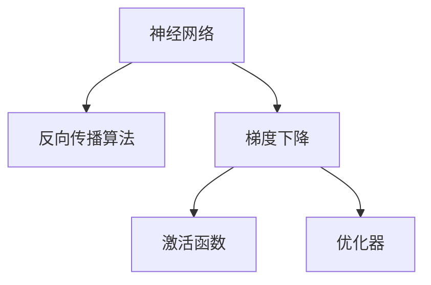
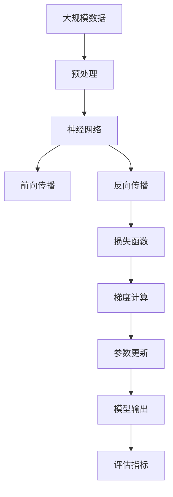

                 

# 复杂思想的形成：概念的基础

## 1. 背景介绍

在信息爆炸和智能算法逐渐渗透各行各业的今天，深度学习已经成为了AI技术的核心。然而，对于深度学习背后的思想理念及其基础概念，许多人仍感到深奥和困惑。本文将从深度学习的核心思想、概念及其架构入手，深入探讨如何理解和运用复杂思想，以此为基底，构建起深度学习的认知体系，让更多人能够理清思路，把握要领。

### 1.1 问题由来
深度学习之所以能够实现革命性的突破，一个重要原因在于其独有的思想理念和概念架构。相较于传统的机器学习算法，深度学习能够处理更为复杂的非线性关系，具有更强的泛化能力和表现力。然而，这些核心思想和概念并非一蹴而就，而是基于多年的积累和研究逐渐形成的。本节将通过简明扼要地介绍深度学习的背景和核心思想，让读者对这一领域的整体框架有初步认识。

### 1.2 问题核心关键点
深度学习领域的核心思想包括但不限于反向传播算法、梯度下降、神经网络结构、激活函数、优化器等。理解这些核心概念，有助于我们在深度学习领域深入研究，并能够灵活运用其基本原理。

## 2. 核心概念与联系

### 2.1 核心概念概述

深度学习中的核心概念众多，为了便于理解，本节将选取其中最具代表性的几个概念进行阐述。

- **神经网络**：深度学习中的核心结构，由一系列相互连接的神经元（神经元之间通过权重参数相连）组成。每个神经元接收输入、进行计算，并将结果传递给下一层。
- **反向传播算法**：用于训练神经网络的核心算法，通过链式法则计算误差对参数的梯度，用于参数更新，最小化损失函数。
- **梯度下降**：一种基于目标函数梯度的优化算法，通过迭代更新模型参数，逐步逼近最优解。
- **激活函数**：用于引入非线性特性，增强神经网络的表达能力。
- **优化器**：用于调整梯度下降的学习率，使得模型在训练过程中能够稳定收敛，避免过拟合或欠拟合。

这些核心概念相互之间紧密联系，构成了深度学习的基石。理解这些概念及其交互机制，是掌握深度学习技术的必要前提。

### 2.2 概念间的关系

深度学习的核心概念之间的联系可以通过以下Mermaid流程图来展示：



这个流程图展示了深度学习中的核心概念及其关系：

1. 神经网络作为深度学习的核心结构，通过反向传播算法和梯度下降优化算法进行训练。
2. 激活函数被引入神经网络，增强其非线性表达能力。
3. 优化器用于调整梯度下降的学习率，使得模型能够稳定收敛。

### 2.3 核心概念的整体架构

最后，我们用一个综合的流程图来展示这些核心概念在深度学习中的整体架构：



这个综合流程图展示了深度学习中的数据处理、模型训练和评估的完整流程：

1. 数据经过预处理后，进入神经网络进行前向传播计算。
2. 反向传播算法计算误差，并更新模型参数。
3. 利用损失函数计算当前模型的误差，作为梯度计算的依据。
4. 参数更新算法根据梯度计算结果，对模型参数进行优化。
5. 模型输出结果与评估指标进行对比，评估模型性能。

通过这些核心概念的相互配合，深度学习模型能够从数据中学习和提取特征，并通过不断迭代优化，实现对复杂问题的有效解决。

## 3. 核心算法原理 & 具体操作步骤

### 3.1 算法原理概述

深度学习的核心算法包括反向传播算法和梯度下降算法。理解这些算法的工作原理，是掌握深度学习技术的根本。

- **反向传播算法**：核心在于链式法则的应用，通过将误差逐层反向传播回网络，计算每个参数对误差的贡献，并根据贡献大小调整参数。这一过程可以理解为"从结果推导原因"。
- **梯度下降算法**：通过迭代更新模型参数，使得模型逐步逼近最小化损失函数的目标解。这一过程可以理解为"从原因修正结果"。

### 3.2 算法步骤详解

#### 3.2.1 反向传播算法

反向传播算法主要包括以下步骤：

1. 前向传播：将输入数据通过神经网络，计算每个神经元的输出，并最终输出预测结果。
2. 误差计算：计算预测结果与实际标签之间的误差。
3. 反向传播：通过链式法则，将误差逐层反向传播回每个神经元，计算每个参数对误差的贡献。
4. 参数更新：根据梯度计算结果，调整模型参数。

这一过程可以简单表示为：

$$
error = loss(target, prediction) \\
\frac{\partial error}{\partial prediction} \\
\frac{\partial error}{\partial parameters} \\
parameters = parameters - learning_rate \times \frac{\partial error}{\partial parameters}
$$

#### 3.2.2 梯度下降算法

梯度下降算法主要用于参数的优化，其核心在于通过迭代更新模型参数，最小化损失函数。梯度下降算法主要包括批量梯度下降(Batch Gradient Descent)和随机梯度下降(Stochastic Gradient Descent)两种方法。

批量梯度下降方法在每次迭代中计算整个训练集上的梯度，更新模型参数，能够更好地收敛到全局最优解，但计算复杂度较高。而随机梯度下降方法每次迭代只计算一个样本的梯度，更新模型参数，计算复杂度较低，但容易陷入局部最优解。

### 3.3 算法优缺点

- **反向传播算法的优点**：
  - 能够处理复杂的非线性关系。
  - 易于实现，计算复杂度较低。
  - 在深度神经网络中具有很好的效果。

- **反向传播算法的缺点**：
  - 需要大量的标注数据。
  - 容易陷入局部最优解。
  - 对超参数的依赖较大，需要进行调参。

- **梯度下降算法的优点**：
  - 计算复杂度较低。
  - 能够动态调整学习率，适应不同的问题。

- **梯度下降算法的缺点**：
  - 容易陷入局部最优解。
  - 需要大量迭代次数才能收敛。
  - 对初始值较为敏感，需要合理的初始化。

### 3.4 算法应用领域

深度学习中的核心算法及其思想在多个领域得到了广泛应用，包括但不限于：

- **计算机视觉**：用于图像识别、物体检测、图像生成等任务。
- **自然语言处理**：用于文本分类、机器翻译、情感分析等任务。
- **语音识别**：用于语音转文本、语音生成等任务。
- **推荐系统**：用于个性化推荐、广告推荐等任务。
- **强化学习**：用于游戏AI、自动驾驶等任务。

## 4. 数学模型和公式 & 详细讲解

### 4.1 数学模型构建

深度学习中的数学模型主要由损失函数、激活函数、优化器等组成。以下我们将详细讲解这些数学模型的构建方法。

#### 4.1.1 损失函数

损失函数用于衡量模型输出与实际标签之间的差异，常见的损失函数包括均方误差、交叉熵等。以交叉熵为例，其定义为：

$$
loss = -\frac{1}{N}\sum_{i=1}^N [y_i\log(\hat{y}_i) + (1-y_i)\log(1-\hat{y}_i)]
$$

其中，$y_i$为实际标签，$\hat{y}_i$为模型预测结果。

#### 4.1.2 激活函数

激活函数用于引入非线性特性，增强神经网络的表达能力。常见的激活函数包括Sigmoid、ReLU、Tanh等。以ReLU为例，其定义为：

$$
f(x) = \max(0, x)
$$

### 4.2 公式推导过程

接下来，我们将以ReLU激活函数为例，推导其在神经网络中的应用。

假设输入层为$x_i$，经过线性变换后得到输出$z_i = Wx_i + b$。激活函数$ReLU$将其映射为$f(z_i) = \max(0, z_i)$。前向传播计算的输出结果$y_i$为：

$$
y_i = f(z_i) = \max(0, Wx_i + b)
$$

反向传播计算误差$\Delta y_i$，并将其反向传播回权重参数$W$和偏置$b$，更新模型参数。这一过程可以表示为：

$$
\Delta y_i = \frac{\partial loss}{\partial y_i} \\
\Delta z_i = \frac{\partial loss}{\partial z_i} = \frac{\partial loss}{\partial y_i} \times \frac{\partial y_i}{\partial z_i} \\
\Delta W = \frac{\partial loss}{\partial W} = \Delta z_i \times x_i^T \\
\Delta b = \frac{\partial loss}{\partial b} = \Delta z_i \\
W = W - learning_rate \times \Delta W \\
b = b - learning_rate \times \Delta b
$$

通过这些公式的推导，我们可以更清晰地理解激活函数在神经网络中的作用，以及其反向传播的计算过程。

### 4.3 案例分析与讲解

以ImageNet数据集上的卷积神经网络为例，展示深度学习模型的应用。

ImageNet数据集包含大量标注好的图像数据，用于训练卷积神经网络(CNN)模型，实现图像分类任务。CNN模型的核心结构包括卷积层、池化层、全连接层等，其中卷积层用于提取图像特征，池化层用于降维，全连接层用于分类。

CNN模型的前向传播计算可以表示为：

$$
convolution = \sigma(Wx_i + b) \\
max_pooling = \max(convolution) \\
fc = \sigma(W'x + b') \\
y = fc
$$

其中，$\sigma$为激活函数，$W$和$b$为卷积层和池化层的权重参数，$W'$和$b'$为全连接层的权重参数。

通过反向传播算法和梯度下降算法，CNN模型能够从大量图像数据中学习到丰富的特征表示，并逐渐提高分类精度。

## 5. 项目实践：代码实例和详细解释说明

### 5.1 开发环境搭建

在进行深度学习项目开发前，需要准备好开发环境。以下是使用Python进行TensorFlow开发的环境配置流程：

1. 安装Anaconda：从官网下载并安装Anaconda，用于创建独立的Python环境。

2. 创建并激活虚拟环境：
```bash
conda create -n tf-env python=3.8 
conda activate tf-env
```

3. 安装TensorFlow：根据CUDA版本，从官网获取对应的安装命令。例如：
```bash
conda install tensorflow -c tf -c conda-forge
```

4. 安装各类工具包：
```bash
pip install numpy pandas scikit-learn matplotlib tqdm jupyter notebook ipython
```

完成上述步骤后，即可在`tf-env`环境中开始项目实践。

### 5.2 源代码详细实现

这里我们以CIFAR-10数据集上的卷积神经网络项目为例，展示TensorFlow的代码实现。

首先，定义CNN模型：

```python
import tensorflow as tf
from tensorflow.keras import layers

model = tf.keras.Sequential([
    layers.Conv2D(32, (3, 3), activation='relu', input_shape=(32, 32, 3)),
    layers.MaxPooling2D((2, 2)),
    layers.Conv2D(64, (3, 3), activation='relu'),
    layers.MaxPooling2D((2, 2)),
    layers.Flatten(),
    layers.Dense(64, activation='relu'),
    layers.Dense(10, activation='softmax')
])
```

然后，定义损失函数和优化器：

```python
loss_fn = tf.keras.losses.SparseCategoricalCrossentropy(from_logits=True)
optimizer = tf.keras.optimizers.Adam()
```

接着，定义训练和评估函数：

```python
@tf.function
def train_step(x, y):
    with tf.GradientTape() as tape:
        logits = model(x, training=True)
        loss_value = loss_fn(y, logits)
    gradients = tape.gradient(loss_value, model.trainable_variables)
    optimizer.apply_gradients(zip(gradients, model.trainable_variables))
    return loss_value

@tf.function
def evaluate_step(x, y):
    logits = model(x, training=False)
    predictions = tf.argmax(logits, axis=1)
    return loss_fn(y, logits), predictions
```

最后，启动训练流程并在测试集上评估：

```python
epochs = 10
batch_size = 64

for epoch in range(epochs):
    for x, y in train_dataset:
        loss = train_step(x, y)
    dev_loss, predictions = evaluate_step(dev_dataset[0], dev_dataset[1])
    print(f'Epoch {epoch+1}, dev loss: {dev_loss}')
```

以上就是使用TensorFlow对卷积神经网络进行CIFAR-10数据集上图像分类的完整代码实现。可以看到，TensorFlow的高级API使得模型定义和训练过程变得简洁高效。

### 5.3 代码解读与分析

让我们再详细解读一下关键代码的实现细节：

**Sequential模型定义**：
- 使用`Sequential`模型顺序堆叠各层，简洁明了。

**激活函数和优化器**：
- 使用ReLU激活函数和Adam优化器，提升模型表达能力和优化效果。

**train_step和evaluate_step函数定义**：
- `train_step`函数定义前向传播、计算损失、反向传播和参数更新的过程。
- `evaluate_step`函数定义前向传播和预测过程，计算损失和评估指标。

**训练流程**：
- 循环迭代训练过程，每轮训练计算一次损失。
- 在测试集上评估模型的性能，输出测试损失。

可以看到，TensorFlow的高级API使得模型定义和训练过程变得简洁高效，大大降低了编程复杂度。通过这些代码实现，相信读者能够快速上手TensorFlow的深度学习开发。

## 6. 实际应用场景

### 6.1 智能推荐系统

智能推荐系统是深度学习的重要应用领域之一，通过学习用户行为数据，推荐个性化的商品、内容、新闻等。在实际应用中，智能推荐系统能够极大地提升用户体验和运营效率，广泛应用于电商、新闻、社交平台等领域。

在推荐系统中，深度学习模型可以基于用户的历史行为数据，学习用户偏好和兴趣，然后根据新数据进行实时推荐。例如，通过用户点击、浏览、购买等行为数据，训练深度学习模型，学习用户兴趣向量，并将新商品或内容的特征向量输入模型进行预测，得到用户对新商品或内容的兴趣评分，从而进行推荐。

### 6.2 自然语言处理

自然语言处理是深度学习的重要应用领域之一，包括文本分类、情感分析、机器翻译、问答系统等任务。深度学习模型可以学习文本中的语义和语法信息，通过反向传播算法和梯度下降算法，逐渐优化模型参数，提升模型在自然语言处理任务上的表现。

例如，在情感分析任务中，深度学习模型可以基于大量的文本数据进行预训练，学习文本中的情感信息，然后通过反向传播算法和梯度下降算法，对特定情感分类任务进行微调，提升模型的情感分类精度。

### 6.3 计算机视觉

计算机视觉是深度学习的重要应用领域之一，包括图像识别、物体检测、图像生成等任务。深度学习模型可以通过卷积神经网络(CNN)学习图像特征，然后通过反向传播算法和梯度下降算法，不断优化模型参数，提升模型在计算机视觉任务上的表现。

例如，在图像分类任务中，深度学习模型可以基于大量的图像数据进行预训练，学习图像中的特征信息，然后通过反向传播算法和梯度下降算法，对特定图像分类任务进行微调，提升模型的图像分类精度。

## 7. 工具和资源推荐

### 7.1 学习资源推荐

为了帮助开发者系统掌握深度学习的核心思想和概念，以下是几本经典书籍：

1. 《深度学习》（Ian Goodfellow, Yoshua Bengio, Aaron Courville著）：深度学习的经典教材，全面介绍了深度学习的理论基础和实践技术。

2. 《神经网络与深度学习》（Michael Nielsen著）：深入浅出地介绍了神经网络和深度学习的核心思想和算法。

3. 《动手学深度学习》（李沐等著）：动手实践的深度学习教材，结合Jupyter Notebook进行交互式编程，适合初学者和进阶开发者。

4. 《TensorFlow实战》（Arley Goulart等著）：TensorFlow实战指南，结合实例介绍TensorFlow的深度学习开发。

5. 《PyTorch深度学习实战》（Kaiming He等著）：PyTorch实战指南，结合实例介绍PyTorch的深度学习开发。

通过这些学习资源，相信读者能够系统掌握深度学习的核心思想和概念，并能够灵活应用到实际项目中。

### 7.2 开发工具推荐

高效的开发离不开优秀的工具支持。以下是几款用于深度学习开发的常用工具：

1. TensorFlow：由Google主导开发的深度学习框架，生产部署方便，适合大规模工程应用。

2. PyTorch：由Facebook主导开发的深度学习框架，灵活性高，适合研究和原型开发。

3. Keras：高层API框架，简洁高效，适合快速开发深度学习模型。

4. Jupyter Notebook：交互式编程工具，支持多种语言，便于实验和交流。

5. Weights & Biases：模型训练的实验跟踪工具，可以记录和可视化模型训练过程中的各项指标。

6. TensorBoard：TensorFlow配套的可视化工具，可实时监测模型训练状态，并提供丰富的图表呈现方式。

合理利用这些工具，可以显著提升深度学习项目的开发效率，加快创新迭代的步伐。

### 7.3 相关论文推荐

深度学习领域的论文众多，以下是几篇经典论文，推荐阅读：

1. 《ImageNet Classification with Deep Convolutional Neural Networks》（Alex Krizhevsky等著）：提出卷积神经网络(CNN)，并基于ImageNet数据集实现了图像分类的新记录。

2. 《Visual Geometry Algebra for Deep Learning》（Guillaume Horel等著）：提出VGA作为卷积神经网络的代数表示，为深度学习的数学建模提供了新思路。

3. 《The Unreasonable Effectiveness of Transfer Learning》（Pan, Wei等著）：讨论了迁移学习的有效性和应用前景，并提出了一系列基于迁移学习的深度学习技术。

4. 《A Tutorial on Deep Learning for NLP》（Goodfellow等著）：介绍了深度学习在自然语言处理中的应用，并提供了详细示例。

5. 《Distributed Deep Learning: A Critical Review and Survey》（Sutskever, Martin等著）：讨论了分布式深度学习的有效性和应用前景，并提出了多种分布式深度学习技术。

这些论文代表了大深度学习的发展脉络，通过学习这些前沿成果，可以帮助研究者把握学科前进方向，激发更多的创新灵感。

除上述资源外，还有一些值得关注的前沿资源，帮助开发者紧跟深度学习技术的最新进展，例如：

1. arXiv论文预印本：人工智能领域最新研究成果的发布平台，包括大量尚未发表的前沿工作，学习前沿技术的必读资源。

2. 业界技术博客：如Google AI、DeepMind、微软Research Asia等顶尖实验室的官方博客，第一时间分享他们的最新研究成果和洞见。

3. 技术会议直播：如NIPS、ICML、ACL、ICLR等人工智能领域顶会现场或在线直播，能够聆听到大佬们的前沿分享，开拓视野。

4. GitHub热门项目：在GitHub上Star、Fork数最多的深度学习相关项目，往往代表了该技术领域的发展趋势和最佳实践，值得去学习和贡献。

5. 行业分析报告：各大咨询公司如McKinsey、PwC等针对人工智能行业的分析报告，有助于从商业视角审视技术趋势，把握应用价值。

总之，对于深度学习技术的学习和实践，需要开发者保持开放的心态和持续学习的意愿。多关注前沿资讯，多动手实践，多思考总结，必将收获满满的成长收益。

## 8. 总结：未来发展趋势与挑战

### 8.1 总结

本文对深度学习的核心思想、概念及其架构进行了全面系统的介绍。首先阐述了深度学习的背景和核心思想，明确了深度学习技术的整体框架和核心要点。其次，从原理到实践，详细讲解了深度学习的数学模型和算法流程，提供了丰富的代码实现和案例分析。最后，探讨了深度学习在实际应用中的广泛应用和未来发展趋势，为读者提供了系统化的知识体系和实践指导。

通过本文的系统梳理，可以看到，深度学习作为人工智能的重要分支，已经在计算机视觉、自然语言处理、推荐系统等多个领域取得了卓越的成绩，深刻改变了人类的生产生活方式。未来，随着深度学习技术的不断演进，其在更多领域的应用将更加广泛，对社会的贡献将更加深远。

### 8.2 未来发展趋势

展望未来，深度学习将呈现以下几个发展趋势：

1. 模型规模持续增大。随着算力成本的下降和数据规模的扩张，深度学习模型的参数量还将持续增长。超大规模模型蕴含的丰富特征信息，有望支撑更加复杂多变的任务。

2. 深度学习范式的多样化。除了传统的前向传播和反向传播算法，未来将涌现更多高效的优化算法和训练策略，如自适应学习率、联邦学习、混合精度训练等。

3. 深度学习与多模态融合。深度学习模型将更多地与多模态信息融合，增强其在视觉、语音、文本等多个模态数据的理解和建模能力。

4. 深度学习与强化学习的结合。深度学习与强化学习的结合，将为自动驾驶、游戏AI等高难度任务带来新的突破。

5. 深度学习与分布式计算的结合。深度学习模型将在更大规模、更高效的分布式计算环境中运行，进一步提升模型训练和推理的速度和效率。

以上趋势凸显了深度学习技术的广泛应用前景和持续发展的潜力，预示着深度学习在更多领域将发挥更大的作用，深刻影响人类社会的各个方面。

### 8.3 面临的挑战

尽管深度学习技术取得了巨大的突破，但在其发展过程中，仍面临诸多挑战：

1. 数据质量瓶颈。深度学习模型需要大量的高质量标注数据进行训练，获取数据的过程耗时耗力。如何高效获取和处理数据，成为亟待解决的难题。

2. 模型鲁棒性不足。深度学习模型面对未知数据和复杂环境时，泛化性能往往较差，容易产生误判。如何提升模型鲁棒性，避免灾难性遗忘，还需要更多理论和实践的积累。

3. 计算资源瓶颈。深度学习模型的训练和推理过程需要大量的计算资源，对硬件设施要求较高。如何在资源受限的情况下，提升模型训练和推理效率，仍需不断优化。

4. 模型可解释性不足。深度学习模型被视为"黑盒"系统，难以解释其内部工作机制和决策逻辑。如何提高模型的可解释性，增强其透明度，将是重要的研究方向。

5. 安全性问题。深度学习模型可能学习到有害信息和偏见，产生误导性输出。如何增强模型的安全性，确保其输出的可靠性和伦理性，仍需进一步探讨。

这些挑战凸显了深度学习技术在实际应用中的复杂性和不确定性，需要研究者和开发者不断探索和创新，才能更好地应对未来的发展需求。

### 8.4 研究展望

面对深度学习所面临的挑战，未来的研究需要在以下几个方面寻求新的突破：

1. 探索无监督学习和半监督学习的有效方法。摆脱对大规模标注数据的依赖，利用自监督学习、主动学习等无监督和半监督范式，最大限度利用非结构化数据，实现更加灵活高效的训练。

2. 研究更高效的优化算法和训练策略。开发更加高效的优化算法和训练策略，如自适应学习率、联邦学习、混合精度训练等，提升模型训练和推理效率。

3. 引入更多先验知识，提升模型的泛化能力。将符号化的先验知识，如知识图谱、逻辑规则等，与深度学习模型进行巧妙融合，引导模型学习更加全面、准确的知识。

4. 探索深度学习与多模态融合的新方法。将视觉、语音、文本等多种模态数据进行融合，增强模型的综合理解能力，提升其在复杂场景下的表现。

5. 研究分布式深度学习的新技术。在更大规模、更高效的分布式计算环境中，实现深度学习模型的训练和推理，提升模型的训练效率和推理速度。

6. 引入伦理和可解释性约束，提升模型安全性。在模型训练目标中引入伦理导向的评估指标，过滤和惩罚有害的输出倾向，增强模型的可解释性和伦理性。

这些研究方向将为深度学习技术带来新的突破，提升其在实际应用中的表现，使其更好地服务于人类社会的各个方面。

## 9. 附录：常见问题与解答

**Q1：深度学习中的反向传播算法和梯度下降算法有什么区别？**

A: 反向传播算法是梯度下降算法的一种具体实现方式，用于计算模型参数对损失函数的梯度，并更新模型参数。梯度下降算法则是一种通用的优化算法，通过迭代更新模型参数，使得模型逐渐逼近最优解。反向传播算法通过链式法则，将误差逐层反向传播回神经网络，计算每个参数对误差的贡献，而梯度下降算法则通过迭代

