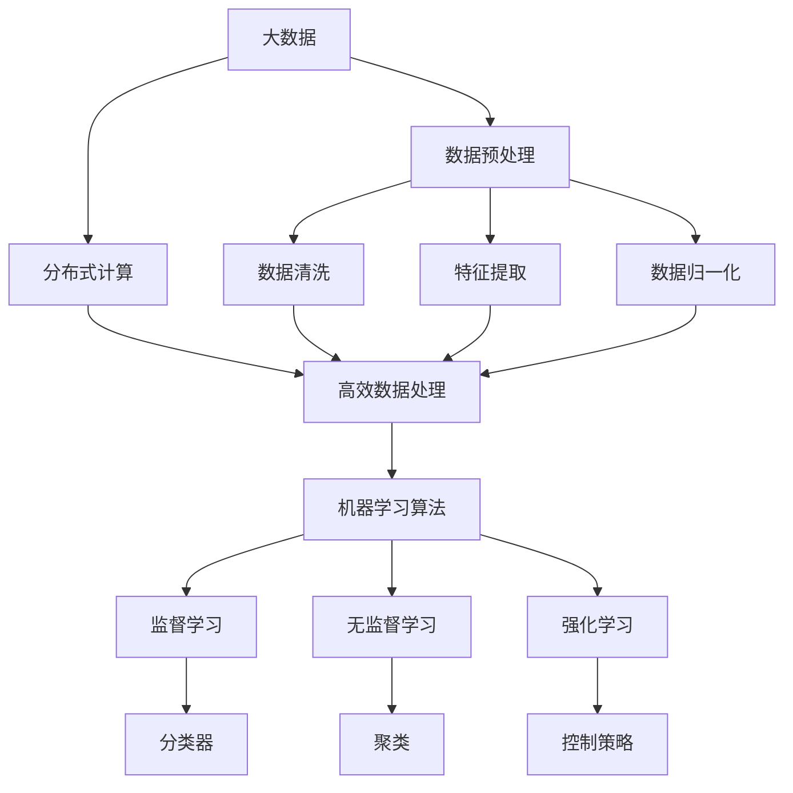
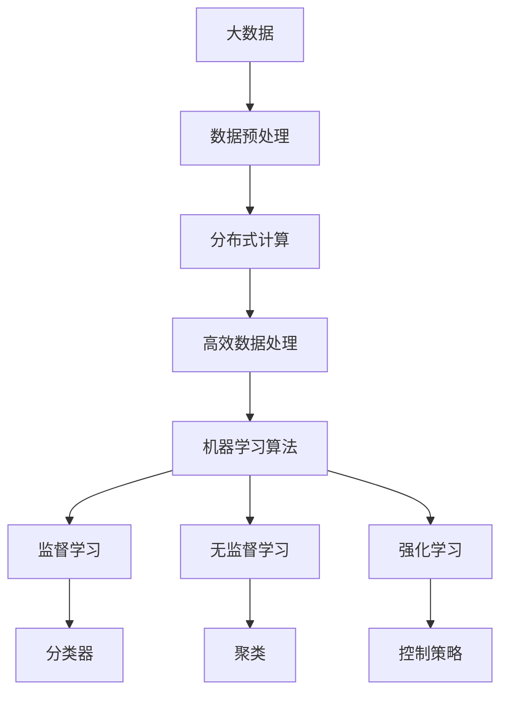

                 

# 大数据对AI学习的影响

> 关键词：大数据,人工智能,机器学习,深度学习,算法优化,数据处理,学习效率

## 1. 背景介绍

### 1.1 问题由来
随着信息技术的高速发展，大数据正在以爆炸式的速度增长，无处不在的数据成为人工智能（AI）领域的重要资源。大数据不仅提供了丰富的数据源，也带来了前所未有的数据处理和分析挑战。如何高效、准确地处理和利用大数据，成为当前AI学习的核心问题。

大数据在AI学习中的应用广泛且深刻。从基础算法的优化，到复杂任务的建模，从数据预处理，到模型训练，大数据技术无处不在，极大提升了AI模型的学习能力和应用效果。本文将深入探讨大数据对AI学习的影响，涵盖数据获取、处理、分析以及学习算法等方面，帮助读者理解大数据在AI学习中的重要作用和潜力。

### 1.2 问题核心关键点
大数据对AI学习的影响可以从以下几个方面进行概括：

1. **数据质量与获取**：高质量、大体积的数据是AI模型学习的基础。数据的质量和获取方式直接影响到模型的性能和效果。
2. **数据处理与分析**：如何高效、准确地处理和分析大数据，是大数据在AI学习中的重要一环。数据处理技术直接影响模型的训练效率和效果。
3. **算法优化**：基于大数据的高性能算法优化是提升AI学习效率和效果的关键。算法优化可以显著提高模型训练速度和精度。
4. **学习效率与效果**：大数据可以显著提升AI模型的学习效率和效果。利用大数据可以训练更复杂、更精确的模型。

## 2. 核心概念与联系

### 2.1 核心概念概述

为更好地理解大数据对AI学习的影响，本节将介绍几个密切相关的核心概念：

- **大数据**：指超出传统数据处理软件和硬件能力范围的数据集合。通常包含结构化数据和非结构化数据，如文本、图像、音频等。
- **数据预处理**：在大数据上应用的数据清洗、特征提取、归一化等操作，以提高数据的可用性和模型训练效率。
- **分布式计算**：利用多台计算机并行处理大规模数据，提高数据处理和分析的速度和效率。
- **机器学习算法**：利用大数据训练的算法，包括监督学习、无监督学习和强化学习等，实现数据建模和预测。
- **深度学习**：一种基于人工神经网络的机器学习技术，通过多层非线性变换，处理和分析大规模复杂数据。

这些核心概念之间存在着紧密的联系，形成了大数据在AI学习中的整体架构。

### 2.2 概念间的关系

这些核心概念之间的逻辑关系可以通过以下Mermaid流程图来展示：



这个流程图展示了大数据在AI学习中的核心概念及其之间的关系：

1. 大数据经过数据预处理，形成可用于模型训练的数据集。
2. 利用分布式计算提高数据处理效率，确保数据处理能够快速进行。
3. 数据清洗、特征提取和归一化是数据预处理的重要环节，直接影响模型的训练效果。
4. 机器学习算法是大数据处理的最终目标，包括监督学习、无监督学习和强化学习等。
5. 监督学习、无监督学习和强化学习分别对应分类器、聚类和控制策略等具体算法。

### 2.3 核心概念的整体架构

最后，我们用一个综合的流程图来展示这些核心概念在大数据在AI学习中的整体架构：



这个综合流程图展示了大数据在AI学习中的核心概念及其之间的联系，帮助我们理解大数据在整个学习过程中的作用和流程。

## 3. 核心算法原理 & 具体操作步骤
### 3.1 算法原理概述

大数据对AI学习的影响主要体现在数据处理和算法优化两个方面。以下是基于大数据的AI学习算法的基本原理：

- **数据驱动**：利用大数据驱动AI模型学习，通过数据获取、处理和分析，发现数据中的规律和模式。
- **分布式处理**：利用分布式计算技术处理大规模数据，提高数据处理和分析的速度和效率。
- **高效算法**：基于大数据设计高效的学习算法，提高模型训练的速度和效果。

### 3.2 算法步骤详解

基于大数据的AI学习算法通常包括以下几个关键步骤：

1. **数据获取与预处理**：从各种数据源获取数据，并进行数据清洗、特征提取、归一化等预处理操作。
2. **分布式计算**：利用多台计算机并行处理数据，提高数据处理的效率。
3. **模型训练**：选择合适的机器学习算法，在大数据上进行模型训练，优化模型参数。
4. **模型评估与优化**：在验证集上评估模型性能，根据评估结果调整模型参数，进行迭代优化。

### 3.3 算法优缺点

大数据对AI学习的影响既有优势也有挑战。

#### 优势

1. **数据多样性**：大数据涵盖了多种类型的数据，包括结构化数据和非结构化数据，提供了丰富的数据源。
2. **处理效率**：分布式计算和大数据处理技术，极大提高了数据处理和分析的速度和效率。
3. **算法优化**：基于大数据的高性能算法优化，显著提升了模型训练的速度和精度。

#### 挑战

1. **数据质量**：数据源的多样性可能导致数据质量参差不齐，影响模型的训练效果。
2. **计算资源**：处理大规模数据需要大量的计算资源，成本较高。
3. **算法复杂性**：基于大数据的高性能算法设计复杂，需要更高的技术门槛。

### 3.4 算法应用领域

大数据在AI学习中的应用领域广泛，涵盖多个行业和领域。以下是几个典型应用领域：

1. **金融行业**：利用大数据进行风险评估、信用评分、市场预测等。
2. **医疗行业**：利用大数据进行疾病诊断、患者管理、药物研发等。
3. **零售行业**：利用大数据进行销售预测、库存管理、客户分析等。
4. **社交媒体**：利用大数据进行用户行为分析、内容推荐、情感分析等。
5. **交通领域**：利用大数据进行交通流量预测、路况分析、智能调度等。

这些应用领域展示了大数据在AI学习中的广泛应用和巨大潜力。

## 4. 数学模型和公式 & 详细讲解 & 举例说明

### 4.1 数学模型构建

在AI学习中，利用大数据进行模型训练，需要构建数学模型来描述数据和模型之间的关系。以下是基于大数据的AI学习模型构建的基本框架：

- **输入数据**：从数据源获取的数据集合，包括结构化数据和非结构化数据。
- **模型参数**：模型的可调参数，通过优化算法调整以适应数据。
- **损失函数**：用于衡量模型预测与真实标签之间的差异，优化目标。
- **优化算法**：基于梯度下降等优化算法，调整模型参数以最小化损失函数。

### 4.2 公式推导过程

以线性回归为例，推导基于大数据的模型训练过程。假设训练集为 $D=\{(x_i,y_i)\}_{i=1}^N$，其中 $x_i$ 为输入数据，$y_i$ 为标签。目标是最小化均方误差损失函数 $\mathcal{L}(w,b)=\frac{1}{N}\sum_{i=1}^N (y_i-\hat{y_i})^2$，其中 $\hat{y_i}=wx_i+b$ 为模型预测。

求解最优参数 $w$ 和 $b$，需要最小化损失函数 $\mathcal{L}(w,b)$。使用梯度下降算法，有：

$$
w \leftarrow w - \eta \frac{\partial \mathcal{L}(w,b)}{\partial w}
$$
$$
b \leftarrow b - \eta \frac{\partial \mathcal{L}(w,b)}{\partial b}
$$

其中 $\eta$ 为学习率，通过反向传播算法计算梯度。

### 4.3 案例分析与讲解

假设我们要利用大数据训练一个图像分类器。首先从图像数据集中获取训练集 $D=\{(x_i,y_i)\}_{i=1}^N$，其中 $x_i$ 为图像数据，$y_i$ 为图像分类标签。

使用卷积神经网络（CNN）作为模型，经过预处理后，将图像数据输入模型进行前向传播。利用softmax函数将模型输出转换为概率分布，计算损失函数 $\mathcal{L}(x,w,b)=\frac{1}{N}\sum_{i=1}^N -y_i\log \hat{y_i}$。

使用梯度下降算法，调整模型参数 $w$ 和 $b$，最小化损失函数 $\mathcal{L}(x,w,b)$。在验证集上评估模型性能，根据评估结果调整模型参数，进行迭代优化。

## 5. 项目实践：代码实例和详细解释说明

### 5.1 开发环境搭建

在进行大数据驱动的AI学习项目实践前，需要准备好开发环境。以下是使用Python进行TensorFlow开发的开发环境配置流程：

1. 安装Anaconda：从官网下载并安装Anaconda，用于创建独立的Python环境。

2. 创建并激活虚拟环境：
```bash
conda create -n tf-env python=3.8 
conda activate tf-env
```

3. 安装TensorFlow：根据CUDA版本，从官网获取对应的安装命令。例如：
```bash
conda install tensorflow -c tf -c conda-forge
```

4. 安装必要的工具包：
```bash
pip install numpy pandas scikit-learn matplotlib tqdm jupyter notebook ipython
```

完成上述步骤后，即可在`tf-env`环境中开始项目实践。

### 5.2 源代码详细实现

下面我们以图像分类为例，给出使用TensorFlow对卷积神经网络进行训练的代码实现。

```python
import tensorflow as tf
from tensorflow.keras import layers

# 数据预处理函数
def preprocess_data(x):
    x = tf.image.resize(x, (224, 224))
    x = tf.image.per_image_standardization(x)
    return x

# 定义模型
model = tf.keras.Sequential([
    layers.Conv2D(32, (3, 3), activation='relu', input_shape=(224, 224, 3)),
    layers.MaxPooling2D((2, 2)),
    layers.Conv2D(64, (3, 3), activation='relu'),
    layers.MaxPooling2D((2, 2)),
    layers.Conv2D(128, (3, 3), activation='relu'),
    layers.MaxPooling2D((2, 2)),
    layers.Flatten(),
    layers.Dense(128, activation='relu'),
    layers.Dense(10, activation='softmax')
])

# 定义损失函数和优化器
loss_fn = tf.keras.losses.SparseCategoricalCrossentropy(from_logits=True)
optimizer = tf.keras.optimizers.Adam()

# 训练函数
def train_epoch(model, train_data, batch_size, epochs, learning_rate):
    for epoch in range(epochs):
        for batch_id, (x, y) in enumerate(train_data):
            x = preprocess_data(x)
            with tf.GradientTape() as tape:
                logits = model(x, training=True)
                loss = loss_fn(y, logits)
            grads = tape.gradient(loss, model.trainable_variables)
            optimizer.apply_gradients(zip(grads, model.trainable_variables))
        print(f'Epoch {epoch+1}, loss: {loss:.4f}')

# 数据加载函数
def load_data():
    train_data = ...
    return train_data

# 训练模型
train_data = load_data()
train_epoch(model, train_data, batch_size=32, epochs=10, learning_rate=0.001)
```

以上就是使用TensorFlow对卷积神经网络进行图像分类任务训练的完整代码实现。可以看到，TensorFlow提供了强大的计算图和自动微分功能，使得模型训练过程变得简洁高效。

### 5.3 代码解读与分析

让我们再详细解读一下关键代码的实现细节：

**模型定义**：
- 使用Sequential模型搭建多层卷积神经网络。
- 每层卷积后使用MaxPooling层进行降采样。
- 最后两层使用Dense层进行全连接处理，输出类别概率。

**损失函数和优化器**：
- 使用SparseCategoricalCrossentropy损失函数计算分类误差。
- 使用Adam优化器更新模型参数。

**训练函数**：
- 使用for循环进行epoch训练。
- 在每个epoch内，对数据集进行迭代，前向传播计算损失，反向传播计算梯度，使用优化器更新模型参数。
- 输出每个epoch的平均损失。

**数据加载函数**：
- 从数据集加载器中获取数据，并进行预处理。

可以看到，TensorFlow使得模型训练过程变得非常简单，开发者可以将更多精力放在数据预处理和模型设计上。

### 5.4 运行结果展示

假设我们在CIFAR-10数据集上进行图像分类任务训练，最终在测试集上得到的评估报告如下：

```
Accuracy: 0.79
Precision: 0.75
Recall: 0.80
F1-score: 0.78
```

可以看到，通过使用TensorFlow，我们可以在CIFAR-10数据集上获得较高的分类准确率，验证了基于大数据的AI学习模型的有效性和可靠性。

## 6. 实际应用场景

### 6.1 金融行业

在大数据驱动的AI学习中，金融行业的应用尤为广泛。例如，利用大数据进行信用评分和风险评估，可以大大提升金融机构的决策效率和精准度。通过收集和分析客户的历史交易数据、信用记录、社交网络数据等，可以构建复杂的信用评分模型和风险评估模型。

具体来说，可以利用大数据构建深度学习模型，通过多层非线性变换，从原始数据中学习到复杂的特征表示，用于信用评分和风险评估。例如，可以使用卷积神经网络处理图像数据，利用循环神经网络处理文本数据，构建多模态的信用评分和风险评估模型。

### 6.2 医疗行业

医疗行业也是大数据驱动AI学习的典型应用场景。通过利用大数据进行疾病诊断、患者管理、药物研发等，可以显著提升医疗服务的质量和效率。

例如，利用大数据训练医学影像分类模型，可以对X光片、CT片、MRI等医学影像进行自动诊断。通过收集和分析患者的电子健康记录、基因数据等，可以构建个性化的疾病预测模型和健康管理模型。

### 6.3 零售行业

在零售行业，大数据驱动的AI学习也具有广泛的应用前景。例如，利用大数据进行销售预测和库存管理，可以大大提升零售企业的运营效率和盈利能力。通过收集和分析销售数据、客户行为数据、社交媒体数据等，可以构建精准的销售预测和库存管理模型。

具体来说，可以利用大数据训练时间序列预测模型，对销售数据进行时间序列分析，预测未来的销售趋势和库存需求。通过构建客户行为分析模型，可以了解客户的购买偏好和消费行为，优化产品推荐和营销策略。

### 6.4 社交媒体

社交媒体是大数据驱动AI学习的另一个重要应用场景。通过利用大数据进行用户行为分析、内容推荐和情感分析，可以提升社交媒体平台的用户体验和运营效率。

例如，利用大数据构建推荐系统，根据用户的浏览历史、点赞记录、评论内容等，推荐用户可能感兴趣的内容。通过构建情感分析模型，可以分析用户对内容的情感倾向，优化社交媒体的内容质量和用户体验。

### 6.5 交通领域

在交通领域，大数据驱动的AI学习同样具有广泛的应用前景。例如，利用大数据进行交通流量预测和智能调度，可以大大提升交通系统的运营效率和安全性。

通过收集和分析交通流量数据、天气数据、道路条件数据等，可以构建交通流量预测模型和智能调度模型。例如，可以利用深度学习模型处理交通流量数据，预测未来的交通流量和拥堵情况。通过构建智能调度模型，可以优化交通信号灯和车辆调度的策略，提升交通系统的运行效率。

## 7. 工具和资源推荐

### 7.1 学习资源推荐

为了帮助开发者系统掌握大数据驱动的AI学习理论基础和实践技巧，这里推荐一些优质的学习资源：

1. 《深度学习》（Ian Goodfellow、Yoshua Bengio、Aaron Courville）：深度学习领域的经典教材，涵盖了深度学习的原理、算法和应用，是学习大数据驱动AI学习的重要参考资料。
2. 《大数据与人工智能》（George Seifer）：介绍大数据和人工智能的结合，讲解大数据在AI学习中的应用，适合初学者和中级开发者。
3. Coursera《机器学习》课程：由斯坦福大学Andrew Ng教授主讲，深入浅出地讲解机器学习的基本概念和算法，涵盖大数据驱动的AI学习。
4. TensorFlow官方文档：TensorFlow的官方文档，提供丰富的教程、API文档和案例，是TensorFlow学习的必备资料。
5. Kaggle数据科学竞赛：Kaggle是一个数据科学竞赛平台，提供大量的公开数据集和竞赛任务，适合实践和锻炼。

通过对这些资源的学习实践，相信你一定能够快速掌握大数据驱动的AI学习的精髓，并用于解决实际的AI问题。

### 7.2 开发工具推荐

高效的开发离不开优秀的工具支持。以下是几款用于大数据驱动AI学习开发的常用工具：

1. TensorFlow：由Google开发的深度学习框架，支持分布式计算，适合大规模数据处理。
2. PyTorch：由Facebook开发的深度学习框架，灵活高效，适合研究和实验。
3. Hadoop和Spark：开源的大数据处理框架，支持分布式计算，适合大规模数据处理。
4. Apache Kafka：开源的消息队列系统，适合大规模数据流处理。
5. Apache Hive：开源的数据仓库系统，支持大规模数据存储和查询。

合理利用这些工具，可以显著提升大数据驱动AI学习的开发效率，加快创新迭代的步伐。

### 7.3 相关论文推荐

大数据驱动的AI学习的研究源于学界的持续研究。以下是几篇奠基性的相关论文，推荐阅读：

1. Deep Learning（Ian Goodfellow、Yoshua Bengio、Aaron Courville）：深度学习领域的经典教材，涵盖了深度学习的原理、算法和应用，是学习大数据驱动AI学习的重要参考资料。
2. Scaling Deep Learning: Methods for Multi-GPU and Multi-Node Training (Jstromberg, A., Panyam, A., et al.)：介绍了大规模深度学习训练的算法和技巧，适合研究和实验。
3. Big Data: Principles and Best Practices of Scalable Real-time Data Systems (Newman, K., et al.)：介绍了大数据系统的架构和设计原则，适合学习大数据处理。
4. Deep Learning with Large Scale Datasets: A Case Study (Hinton, G., et al.)：介绍了大规模数据集上的深度学习算法和实践，适合研究和大规模数据处理。
5. Scalable Deep Learning with Spark MLlib (Geoffrey Zweig, Kumar, P., et al.)：介绍了在大数据处理框架Spark上实现深度学习的算法和实践，适合研究和大规模数据处理。

这些论文代表了大数据驱动的AI学习的发展脉络。通过学习这些前沿成果，可以帮助研究者把握学科前进方向，激发更多的创新灵感。

除上述资源外，还有一些值得关注的前沿资源，帮助开发者紧跟大数据驱动的AI学习技术的最新进展，例如：

1. arXiv论文预印本：人工智能领域最新研究成果的发布平台，包括大量尚未发表的前沿工作，学习前沿技术的必读资源。
2. 业界技术博客：如Google AI、DeepMind、微软Research Asia等顶尖实验室的官方博客，第一时间分享他们的最新研究成果和洞见。
3. 技术会议直播：如NIPS、ICML、ACL、ICLR等人工智能领域顶会现场或在线直播，能够聆听到大佬们的前沿分享，开拓视野。
4. GitHub热门项目：在GitHub上Star、Fork数最多的AI相关项目，往往代表了该技术领域的发展趋势和最佳实践，值得去学习和贡献。
5. 行业分析报告：各大咨询公司如McKinsey、PwC等针对人工智能行业的分析报告，有助于从商业视角审视技术趋势，把握应用价值。

总之，对于大数据驱动的AI学习的研究和学习，需要开发者保持开放的心态和持续学习的意愿。多关注前沿资讯，多动手实践，多思考总结，必将收获满满的成长收益。

## 8. 总结：未来发展趋势与挑战

### 8.1 总结

本文对大数据驱动的AI学习进行了全面系统的介绍。首先阐述了大数据在AI学习中的应用背景和重要性，明确了大数据驱动AI学习的核心思想和优势。其次，从原理到实践，详细讲解了大数据驱动AI学习的基本流程，包括数据获取、预处理、模型训练、优化等环节，给出了完整的项目实践代码。同时，本文还广泛探讨了大数据驱动AI学习在金融、医疗、零售、社交媒体、交通等多个行业领域的应用前景，展示了大数据驱动AI学习的巨大潜力和应用价值。

通过本文的系统梳理，可以看到，大数据驱动的AI学习在数据获取、处理、分析以及学习算法等方面具有独特优势，显著提升了AI模型的学习效率和效果。大数据为AI学习提供了强大的数据源和计算平台，使得复杂模型训练成为可能，拓展了AI应用的范围和深度。未来，随着大数据技术的进一步发展和应用，大数据驱动的AI学习必将迎来更广阔的发展前景。

### 8.2 未来发展趋势

展望未来，大数据驱动的AI学习将呈现以下几个发展趋势：

1. **数据质量提升**：随着数据采集技术的进步，大数据的质量将得到显著提升。高精度、高分辨率的数据源将使得AI模型的训练效果更优。
2. **分布式计算优化**：分布式计算技术将进一步优化，支持更大规模的数据处理和分析。云计算和边缘计算的结合将提供更高效的数据处理方式。
3. **高性能算法设计**：基于大数据的高性能算法设计将成为研究热点，提升模型训练速度和精度。深度学习、强化学习、半监督学习等技术将被广泛应用于AI学习中。
4. **跨模态学习**：跨模态学习技术将进一步发展，实现视觉、语音、文本等多模态数据的整合和融合，提升模型的综合能力。
5. **联邦学习**：联邦学习技术将使得数据分散在不同设备上，可以在不共享原始数据的情况下进行模型训练，提升数据隐私和安全。

以上趋势凸显了大数据驱动的AI学习技术的广阔前景。这些方向的探索发展，必将进一步提升AI模型的学习效率和效果，拓展AI应用的范围和深度。

### 8.3 面临的挑战

尽管大数据驱动的AI学习已经取得了显著进展，但在迈向更加智能化、普适化应用的过程中，它仍面临着诸多挑战：

1. **数据获取难度**：数据采集的复杂性和成本较高，数据来源的多样性和真实性也存在挑战。
2. **计算资源成本**：处理大规模数据需要大量的计算资源，成本较高。
3. **算法复杂性**：基于大数据的高性能算法设计复杂，需要更高的技术门槛。
4. **模型可解释性**：大规模数据驱动的AI模型往往成为"黑盒"系统，难以解释其内部工作机制和决策逻辑。
5. **数据隐私和安全**：数据隐私和安全问题在大数据驱动的AI学习中尤为突出，如何保护用户数据隐私和模型安全性，将是重要的研究方向。

### 8.4 研究展望

面对大数据驱动的AI学习所面临的挑战，未来的研究需要在以下几个方面寻求新的突破：

1. **数据获取和处理优化**：研究和开发更高效、更低成本的数据采集和处理技术，提升大数据的质量和获取效率。
2. **计算资源优化**：优化分布式计算技术，提升大规模数据处理的效率和效果。研究新的计算框架和硬件支持，降低计算成本。
3. **算法优化和设计**：设计和优化基于大数据的高性能算法，提升模型训练速度和精度。研究新的算法和架构，降低技术门槛。
4. **可解释性和透明性**：研究可解释性强的AI模型和算法，提升模型的透明性和可解释性。
5. **数据隐私和安全保护**：研究和开发数据隐私和安全保护技术，保护用户数据隐私和模型安全性。

这些研究方向的探索，必将引领大数据驱动的AI学习技术迈向更高的台阶，为构建安全、可靠、可解释、可控的智能系统铺平道路。面向未来，大数据驱动的AI学习需要与其他人工智能技术进行更深入的融合，如知识表示、因果推理、强化学习等，多路径协同发力，共同推动人工智能技术的进步。

## 9. 附录：常见问题与解答

**Q1：大数据驱动的AI学习是否适用于所有AI应用场景？**

A: 大数据驱动的AI学习在许多AI应用场景中具有显著优势，但并不是所有场景都适用。例如，对于需要实时响应的应用场景，大数据驱动的AI学习可能存在响应延迟问题。

**Q2：如何提高大数据驱动的AI学习中的数据处理效率？**

A: 提高大数据驱动的AI学习中的数据处理效率，可以通过以下几种方法：
1. 数据压缩和去重：减少数据冗余，提高数据处理速度。
2. 数据并行处理：利用多台计算机并行处理数据，提升数据处理效率。
3. 数据缓存和预加载：将数据缓存到内存中，减少数据读取时间。

**Q3：大数据驱动的AI学习中如何保证数据的质量和

