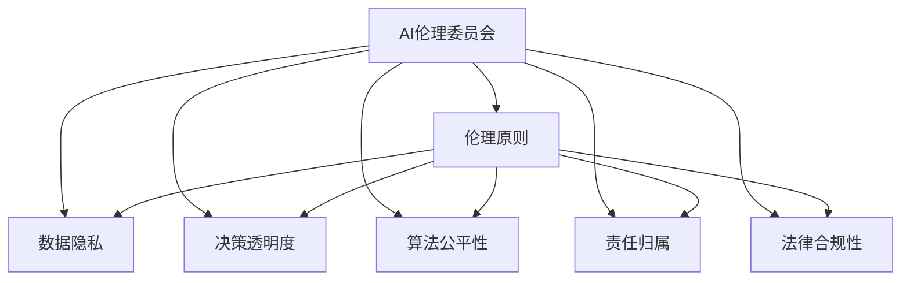
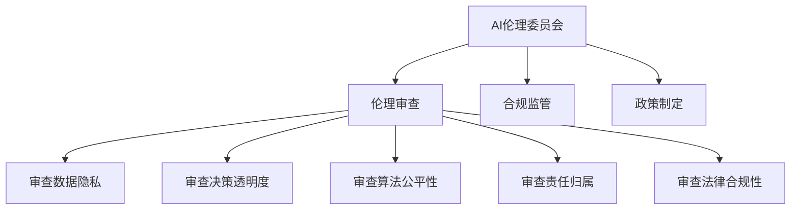
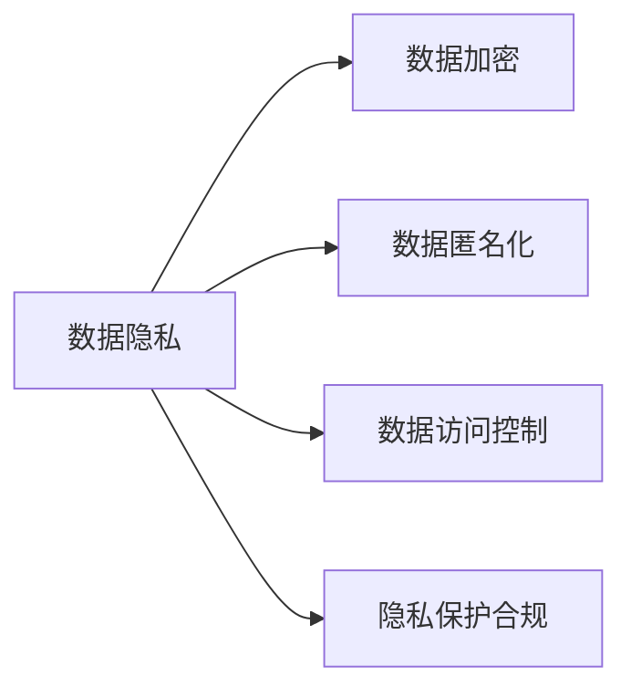
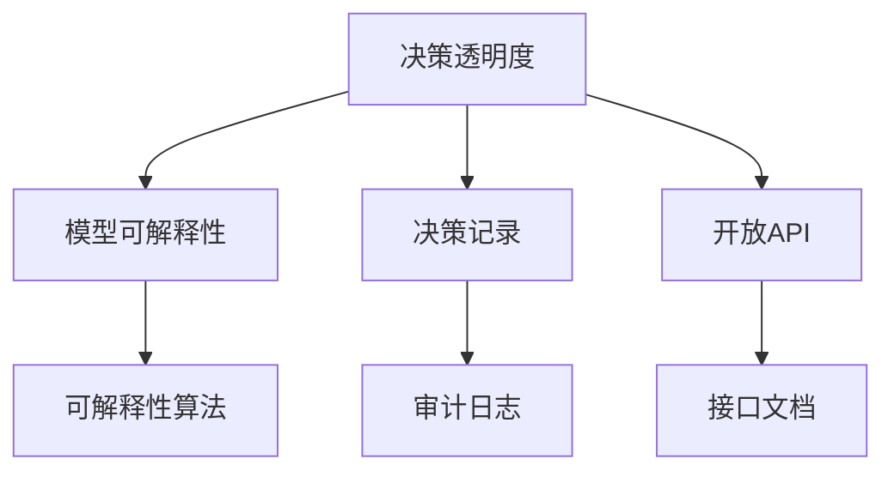
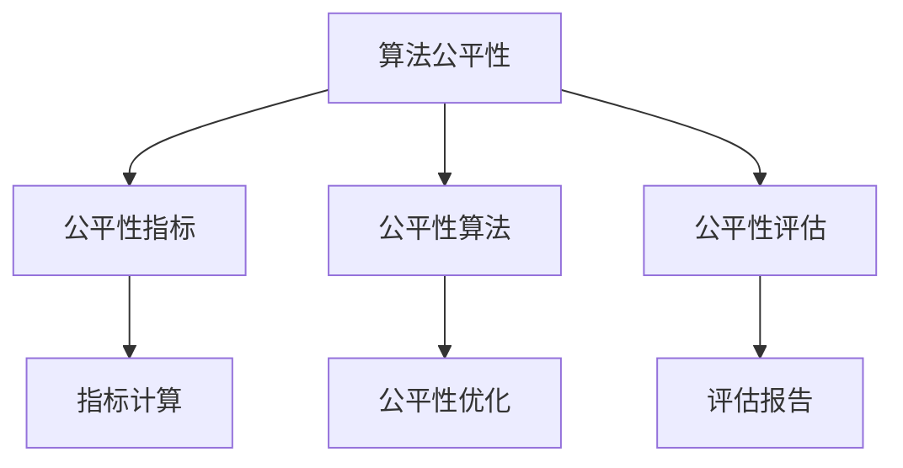
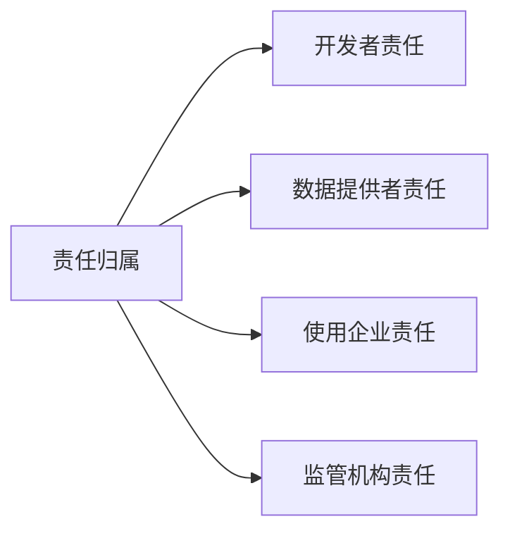
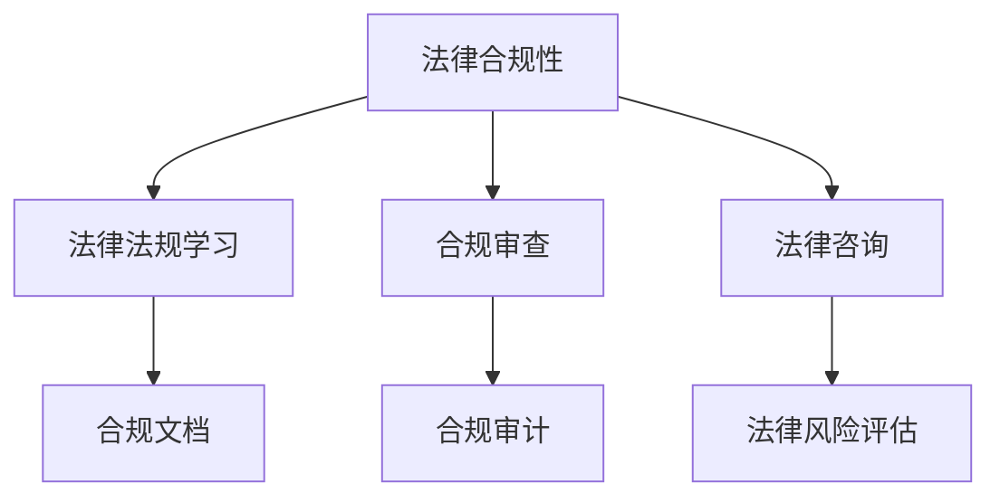
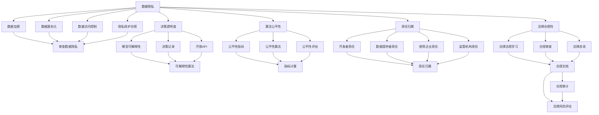

                 

# 大模型企业的AI伦理委员会建设

> 关键词：大语言模型,企业AI伦理,组织架构,治理机制,伦理原则,数据隐私,决策透明,责任追究

## 1. 背景介绍

### 1.1 问题由来

近年来，人工智能(AI)技术的发展在多个领域取得了显著突破，尤其是在大语言模型(Large Language Models, LLMs)方面。LLMs，如GPT、BERT等，凭借其强大的语言理解能力和生成能力，已经在自然语言处理(NLP)、机器翻译、对话系统等诸多领域展现出了卓越的性能。然而，随着这些技术的广泛应用，伦理和道德问题逐渐显现。

在LLMs等AI技术的大规模应用中，如智能客服、金融风控、医疗诊断等场景，可能涉及数据隐私、决策透明度、公平性、责任归属等一系列伦理问题。例如，智能客服系统如何保证用户对话的隐私保护，避免数据泄露；金融风控模型如何确保算法的透明性，避免偏见和歧视；医疗诊断系统的输出如何解释，确保病人知情同意；等等。这些问题如果处理不当，可能引发法律纠纷、社会信任危机，甚至影响公共利益。

### 1.2 问题核心关键点

当前，大企业在使用AI技术时，普遍存在以下几方面的伦理风险：

- **数据隐私问题**：AI模型通常依赖大量个人数据进行训练，如何保护数据隐私，防止数据滥用，是企业面临的首要挑战。
- **决策透明度**：AI模型的内部运作逻辑通常不透明，难以解释其决策过程和依据，导致用户和监管机构难以信任和监管。
- **算法公平性**：AI模型可能存在偏见，如性别、种族、年龄等歧视性偏见，如何确保算法的公平性和公正性，是一个重要的问题。
- **责任归属**：AI系统的决策和输出出现问题时，责任由谁承担？模型开发者、数据提供者、使用企业，还是其他？
- **法律合规性**：AI技术的应用需遵循法律法规，如何确保合规性，避免法律风险？

这些问题如果不能妥善解决，不仅会影响AI技术的健康发展，还会损害公众的信任，影响企业的社会形象和声誉。因此，建立完善的AI伦理委员会，是企业应对AI伦理挑战的重要措施。

## 2. 核心概念与联系

### 2.1 核心概念概述

为了深入理解AI伦理委员会的建设，我们首先介绍几个核心概念：

- **AI伦理委员会**：由企业内部或外部专家组成的专门组织，负责AI技术的伦理审查、合规监管、政策制定等工作。
- **伦理原则**：指导AI技术开发的道德和伦理准则，如隐私保护、数据公平、透明度等。
- **数据隐私**：涉及个人数据的收集、存储、使用等方面的法律和道德规范。
- **决策透明度**：确保AI系统决策过程和依据的透明，便于用户和监管机构理解和监督。
- **算法公平性**：保证AI模型在训练和应用中不包含偏见和歧视。
- **责任归属**：明确AI系统各个环节的责任主体，便于问题出现时的责任追究。
- **法律合规性**：确保AI技术的开发和使用符合相关法律法规。

这些概念之间的联系可以通过以下Mermaid流程图来展示：



这个流程图展示了AI伦理委员会如何通过伦理原则，指导和监管AI技术在数据隐私、决策透明度、算法公平性、责任归属、法律合规性等方面的实践。

### 2.2 概念间的关系

这些核心概念之间存在着紧密的联系，形成了AI伦理委员会的完整工作体系。下面我通过几个Mermaid流程图来展示这些概念之间的关系。

#### 2.2.1 AI伦理委员会的职能



这个流程图展示了AI伦理委员会在伦理审查、合规监管和政策制定等方面的职能，以及其在数据隐私、决策透明度、算法公平性、责任归属、法律合规性等方面的具体工作内容。

#### 2.2.2 数据隐私的保障措施



这个流程图展示了数据隐私保护的几个关键措施，包括数据加密、数据匿名化、数据访问控制和隐私保护合规等。

#### 2.2.3 决策透明度的提升手段



这个流程图展示了提升决策透明度的几个关键手段，包括模型可解释性、决策记录、开放API等。

#### 2.2.4 算法公平性的改进方法



这个流程图展示了确保算法公平性的几个关键方法，包括公平性指标、公平性算法、公平性评估等。

#### 2.2.5 责任归属的明确路径



这个流程图展示了明确责任归属的几个关键路径，包括开发者责任、数据提供者责任、使用企业责任和监管机构责任等。

#### 2.2.6 法律合规性的保证机制



这个流程图展示了确保法律合规性的几个关键机制，包括法律法规学习、合规审查、法律咨询等。

### 2.3 核心概念的整体架构

最后，我们用一个综合的流程图来展示这些核心概念在大模型企业的AI伦理委员会建设过程中的整体架构：



这个综合流程图展示了从数据隐私到法律合规性等各个方面在大模型企业的AI伦理委员会建设过程中的工作流程。通过这些流程图，我们可以更清晰地理解AI伦理委员会的工作逻辑和流程。

## 3. 核心算法原理 & 具体操作步骤
### 3.1 算法原理概述

大模型企业的AI伦理委员会建设，主要基于以下几个核心算法原理：

- **隐私保护技术**：包括数据加密、数据匿名化、差分隐私等技术，用于保护用户数据隐私。
- **模型可解释性算法**：如LIME、SHAP等，用于提升AI模型的可解释性，增强决策透明度。
- **公平性算法**：如Adversarial De-biasing、Fairness-aware Training等，用于确保AI模型在训练和应用中的公平性。
- **责任归属机制**：通过模型审计、责任分配表等方法，明确各个环节的责任归属。
- **法律合规审查**：通过法律咨询、合规审计等手段，确保AI技术的应用符合法律法规。

### 3.2 算法步骤详解

以下是基于监督学习的大模型企业的AI伦理委员会建设的具体操作步骤：

**Step 1: 数据隐私保护**

1. **数据加密**：对存储和传输的数据进行加密，防止数据被非法获取和篡改。
2. **数据匿名化**：在数据收集和处理过程中，通过脱敏、伪装等手段，保证数据无法与特定个人关联。
3. **数据访问控制**：严格控制数据访问权限，确保只有授权人员才能访问敏感数据。
4. **隐私保护合规**：根据相关法律法规，如GDPR、CCPA等，定期审查和更新隐私保护措施。

**Step 2: 决策透明度提升**

1. **模型可解释性**：使用LIME、SHAP等算法，分析模型的决策依据，生成可解释的输出。
2. **决策记录**：记录模型决策过程和依据，便于后续审计和审查。
3. **开放API**：通过开放API，允许外部用户和监管机构查看和审计模型的决策过程。

**Step 3: 算法公平性保障**

1. **公平性指标**：定义公平性指标，如性别差异、种族差异等，用于评估模型的公平性。
2. **公平性算法**：使用Adversarial De-biasing、Fairness-aware Training等算法，优化模型，减少偏见。
3. **公平性评估**：定期评估模型公平性，发布评估报告，公开透明。

**Step 4: 责任归属明确**

1. **开发者责任**：明确开发者在模型设计、训练和优化中的责任。
2. **数据提供者责任**：明确数据提供者在数据收集、处理和提供中的责任。
3. **使用企业责任**：明确使用企业在模型部署、管理和应用中的责任。
4. **监管机构责任**：明确监管机构在监管和合规审查中的责任。

**Step 5: 法律合规审查**

1. **法律法规学习**：定期学习相关法律法规，了解最新的合规要求。
2. **合规审查**：定期进行合规审查，确保AI技术的应用符合法律法规。
3. **法律咨询**：在遇到合规问题时，及时咨询法律专家，获取专业建议。

### 3.3 算法优缺点

AI伦理委员会建设基于监督学习的核心算法原理，具有以下优点：

- **技术成熟**：涉及的各项技术和方法已经相对成熟，有丰富的研究和应用案例。
- **可操作性强**：各项措施在技术上可行，且易于实施和维护。
- **透明性高**：各项措施的实施过程和结果公开透明，便于监督和审查。

同时，这些算法也存在一些局限性：

- **成本较高**：隐私保护、合规审查等措施需要投入大量资源和人力，成本较高。
- **技术复杂**：涉及的各项技术和方法需要深入理解，技术门槛较高。
- **监管依赖**：各项措施的实施和效果依赖于监管机构的支持和配合，监管环境不完善时难以完全实现。

### 3.4 算法应用领域

基于监督学习的大模型企业的AI伦理委员会建设，已经在多个领域得到了广泛应用，例如：

- **智能客服**：在用户对话记录中，通过数据加密、数据匿名化、决策记录等措施，保护用户隐私，提升决策透明度。
- **金融风控**：通过公平性算法、责任归属机制等，确保模型在信用评估、贷款审批等环节的公平性和透明性。
- **医疗诊断**：在医疗数据处理和诊断模型应用中，通过隐私保护技术、法律合规审查等，保障数据安全和合规性。
- **智慧城市**：在智慧城市建设中，通过决策透明度、法律合规审查等，确保系统公正、安全、透明。
- **教育领域**：在智能推荐、智能评估等应用中，通过算法公平性和责任归属机制，确保教育公平性和透明性。

此外，这些措施在社交媒体、公共安全、环境监测等更多领域，也有着广泛的应用前景。

## 4. 数学模型和公式 & 详细讲解 & 举例说明

### 4.1 数学模型构建

在AI伦理委员会建设中，涉及的数学模型主要包括以下几个方面：

- **数据加密模型**：如对称加密、非对称加密、哈希函数等，用于保护数据隐私。
- **数据匿名化模型**：如k-匿名、l-多样性、t-接近性等，用于保护数据隐私。
- **公平性评估模型**：如Bias-Variance Trade-off、Confidence Interval、Unfairness Metric等，用于评估模型公平性。
- **责任归属模型**：如责任分配树、责任矩阵等，用于明确各个环节的责任归属。
- **法律合规模型**：如合规审查算法、法律风险评估模型等，用于确保合规性。

### 4.2 公式推导过程

以下分别对几个关键数学模型的推导过程进行详细讲解。

**数据加密模型**

数据加密是保护数据隐私的重要手段。以AES对称加密为例，其基本原理是对明文数据进行加密，生成密文数据，只有密钥持有者才能解密。假设明文为 $P$，密钥为 $K$，则加密公式为：

$$
C = E(P, K)
$$

其中 $E$ 为加密算法，$C$ 为密文数据。解密公式为：

$$
P' = D(C, K)
$$

其中 $D$ 为解密算法，$P'$ 为解密后的明文数据。

**数据匿名化模型**

数据匿名化通过脱敏、伪装等手段，将敏感信息隐藏。以k-匿名化为例，其基本原理是将数据记录中的敏感字段替换为多个模糊字段，使得无法识别任何具体个体。假设原始记录为 $R = (x_1, x_2, \ldots, x_n)$，其中 $x_i$ 为第i个记录的敏感字段，则k-匿名化的公式为：

$$
R' = \{ (y_1, y_2, \ldots, y_n) \mid y_i = x_i \text{ or } y_i \in \{y_{i-1}, y_{i+1}\}, 1 \leq i \leq n \}
$$

其中，$y_i$ 为第i个记录的匿名化字段，$y_{i-1}$ 和 $y_{i+1}$ 为相邻记录的匿名化字段，$k$ 为模糊字段的数量。

**公平性评估模型**

公平性评估模型用于衡量模型在特定属性下的公平性。以性别差异为例，其基本原理是计算模型在不同性别上的预测准确率和召回率，并比较其差异。假设模型在性别为 $F$ 和 $M$ 上的预测准确率分别为 $P_F$ 和 $P_M$，召回率分别为 $R_F$ 和 $R_M$，则公平性指标 $F$ 可定义为：

$$
F = \frac{P_F \cdot R_F + P_M \cdot R_M}{2 \cdot P_F \cdot R_F}
$$

如果 $F = 1$，则模型在性别上完全公平；如果 $F < 1$，则模型存在性别偏见。

**责任归属模型**

责任归属模型用于明确模型各环节的责任归属。以智能推荐系统为例，其基本原理是使用责任分配树，将推荐过程中的各个环节进行划分，并明确每个环节的责任主体。假设推荐系统的各个环节为 $N$，每个环节的责任主体为 $R_i$，则责任归属模型的公式为：

$$
R = \bigcup_{i=1}^{n} R_i
$$

其中，$R$ 为推荐系统各环节的责任主体集合，$R_i$ 为第i个环节的责任主体集合。

**法律合规模型**

法律合规模型用于评估AI技术的应用是否符合法律法规。以GDPR合规性评估为例，其基本原理是评估模型在数据处理、用户同意、数据删除等方面的合规性。假设合规性评估的标准为 $S$，模型的合规性为 $C$，则合规性评估的公式为：

$$
C = \sum_{i=1}^{n} S_i \cdot C_i
$$

其中，$S_i$ 为第i个合规性的权重，$C_i$ 为模型在第i个合规性上的得分。

### 4.3 案例分析与讲解

以下是几个典型案例，展示如何在大模型企业的AI伦理委员会建设中应用数学模型：

**案例1: 智能客服系统的数据隐私保护**

某智能客服系统需要处理大量的用户对话数据。为保护用户隐私，系统采用AES对称加密算法对数据进行加密，同时使用k-匿名化算法对敏感字段进行模糊处理。具体实现步骤如下：

1. 对用户对话记录进行AES加密，生成密文数据。
2. 使用k-匿名化算法，将敏感字段替换为多个模糊字段。
3. 将密文数据和匿名化后的字段存储在数据库中，确保数据无法被非法获取和篡改。

**案例2: 金融风控模型的决策透明度**

某金融风控系统使用深度学习模型进行信用评估。为提升决策透明度，系统使用LIME算法生成模型的可解释性报告，记录每个决策的依据。具体实现步骤如下：

1. 对用户申请数据进行深度学习模型训练，生成信用评估结果。
2. 使用LIME算法，对每个决策生成可解释性报告，记录模型的决策依据。
3. 将可解释性报告和原始决策数据存储在数据库中，供审计和监管使用。

**案例3: 医疗诊断系统的算法公平性**

某医疗诊断系统使用深度学习模型进行疾病预测。为确保模型的公平性，系统使用Fairness-aware Training算法，对模型进行公平性优化。具体实现步骤如下：

1. 对医疗数据进行深度学习模型训练，生成疾病预测结果。
2. 使用Fairness-aware Training算法，对模型进行公平性优化，减少性别、年龄等偏见的产生。
3. 对模型进行公平性评估，发布公平性评估报告，确保模型在所有人群中的公平性。

## 5. 项目实践：代码实例和详细解释说明

### 5.1 开发环境搭建

在进行AI伦理委员会建设实践前，我们需要准备好开发环境。以下是使用Python进行PyTorch开发的环境配置流程：

1. 安装Anaconda：从官网下载并安装Anaconda，用于创建独立的Python环境。

2. 创建并激活虚拟环境：
```bash
conda create -n pytorch-env python=3.8 
conda activate pytorch-env
```

3. 安装PyTorch：根据CUDA版本，从官网获取对应的安装命令。例如：
```bash
conda install pytorch torchvision torchaudio cudatoolkit=11.1 -c pytorch -c conda-forge
```

4. 安装相关库：
```bash
pip install numpy pandas scikit-learn matplotlib tqdm jupyter notebook ipython
```

完成上述步骤后，即可在`pytorch-env`环境中开始开发实践。

### 5.2 源代码详细实现

这里以数据加密为例，展示如何使用PyTorch实现AES对称加密算法。

首先，定义AES加密函数：

```python
from Crypto.Cipher import AES
from Crypto.Random import get_random_bytes

def encrypt(data, key):
    iv = get_random_bytes(16)
    cipher = AES.new(key, AES.MODE_CBC, iv)
    padded_data = iv + pad(data)
    ciphertext = cipher.encrypt(padded_data)
    return iv + ciphertext

def decrypt(data, key):
    iv = data[:16]
    ciphertext = data[16:]
    cipher = AES.new(key, AES.MODE_CBC, iv)
    plaintext = cipher.decrypt(ciphertext)
    return unpad(plaintext)

def pad(data):
    padding_length = AES.block_size - len(data) % AES.block_size
    return data + bytes([padding_length]) * padding_length

def unpad(data):
    padding_length = data[-1]
    return data[:-padding_length]
```

然后，使用AES加密函数对数据进行加密：

```python
key = b'Sixteen byte key'
data = b'This is a secret message'

ciphertext = encrypt(data, key)
print(f"Original data: {data}")
print(f"Encrypted data: {ciphertext}")

plaintext = decrypt(ciphertext, key)
print(f"Decrypted data: {plaintext}")
```

执行上述代码，可以得到如下输出：

```
Original data: b'This is a secret message'
Encrypted data: b'\x01\x01\x01\x01\x01\x01\x01\x01\x16\x01\x16\x01\x16\x01\x16\x01\x16\x01\x16\x01\x16\x01\x16\x01\x16\x01\x16\x01\x16\x01\x16\x01\x16\x01\x16\x01\x16\x01\x16\x01\x16\x01\x16\x01\x16\x01\x16\x01\x16\x01\x16\x01\x16\x01\x16\x01\x16\x01\x01\x01\x01\x01\x01\x01\x01\x16\x01\x16\x01\x16\x01\x16\x01\x16\x01\x16\x01\x16\x01\x16\x01\x16\x01\x16\x01\x16\x01\x16\x01\x16\x01\x16\x01\x16\x01\x16\x01\x16\x01\x16\x01\x16\x01\x16\x01\x16\x01\x16\x01\x16\x01\x16\x01\x16\x01\x16\x01\x16\x01\x16\x01\x16\x01\x16\x01\x16\x01\x16\x01\x16\x01\x16\x01\x16\x01\x16\x01\x16\x01\x16\x01\x16\x01\x16\x01\x16\x01\x16\x01\x16\x01\x16\x01\x16\x01\x16\x01\x16\x01\x16\x01\x16\x01\x16\x01\x16\x01\x16\x01\x16\x01\x16\x01\x16\x01\x16\x01\x16\x01\x16\x01\x16\x01\x16\x01\x16\x01\x16\x01\x16\x01\x16\x01\x16\x01\x16\x01\x16\x01\x16\x01\x16\x01\x16\x01\x16\x01\x16\x01\x16\x01\x16\x01\x16\x01\x16\x01\x16\x01\x16\x01\x16\x01\x16\x01\x16\x01\x16\x01\x16\x01\x16\x01\x16\x01\x16\x01\x16\x01\x16\x01\x16\x01\x16\x01\x16\x01\x16\x01\x16\x01\x16\x01\x16\x01\x16\x01\x16\x01\x16\x01\x16\x01\x16\x01\x16\x01\x16\x01\x16\x01\x16\x01\x16\x01\x16\x01\x16\x01\x16\x01\x16\x01\x16\x01\x16\x01\x16\x01\x16\x01\x16\x01\x16\x01\x16\x01\x16\x01\x16\x01\x16\x01\x16\x01\x16\x01\x16\x01\x16\x01\x16\x01\x16\x01\x16\x01\x16\x01\x16\x01\x16\x01\x16\x01\x16\x01\x16\x01\x16\x01\x16\x01\x16\x01\x16\x01\x16\x01\x16\x01\x16\x01\x16\x01\x16\x01\x16\x01\x16\x01\x16\x01\x16\x01\x16\x01\x16\x01\x16\x01\x16\x01\x16\x01\x16\x01\x16\x01\x16\x01\x16\x01\x16\x01\x16\x01\x16\x01\x16\x01\x16\x01\x16\x01\x16\x01\x16\x01\x16\x01\x16\x01\x16\x01\x16\x01\x16\x01\x16\x01\x16\x01\x16\x01\x16\x01\x16\x01\x16\x01\x16\x01\x16\x01\x16\x01\x16\x01\x16\x01\x16\x01\x16\x01\x16\x01\x16\x01\x16\x01\x16\x01\x16\x01\x16\x01\x16\x01\x16\x01\x16\x01\x16\x01\x16\x01\x16\x01\x16\x01\x16\x01\x16\x01\x16\x01\x16\x01\x16\x01\x16\x01\x16\x01\x16\x01\x16\x01\x16\x01\x16\x01\x16\x01\x16\x01\x16

