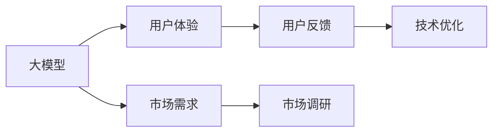
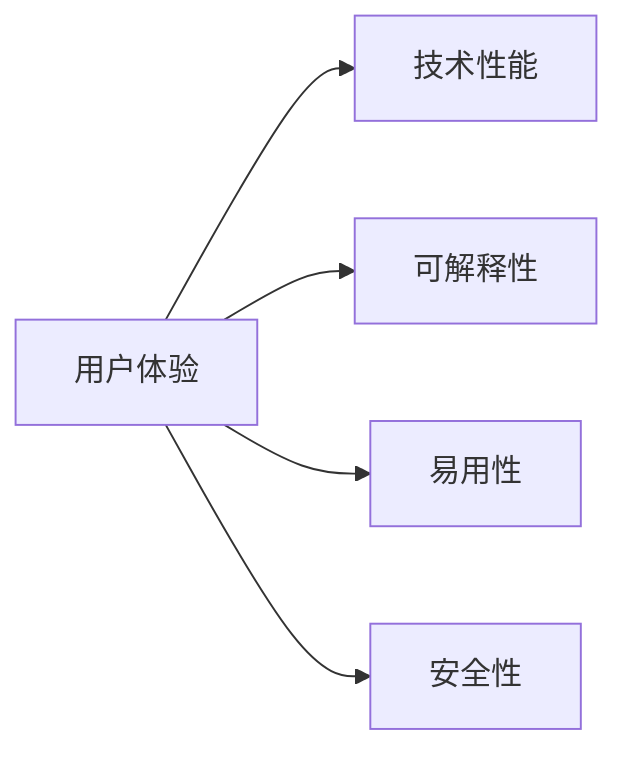
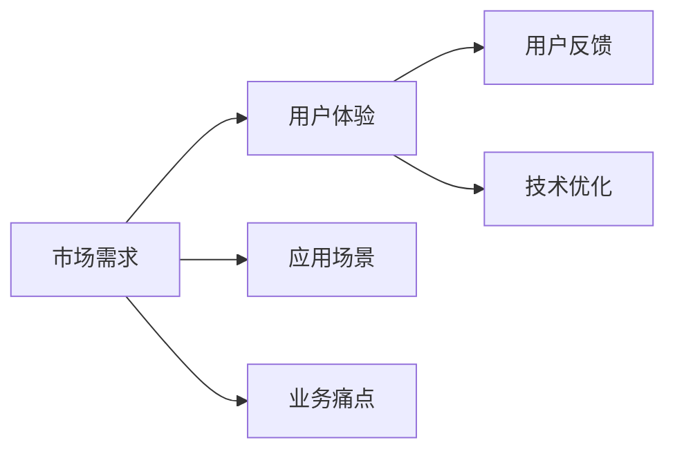
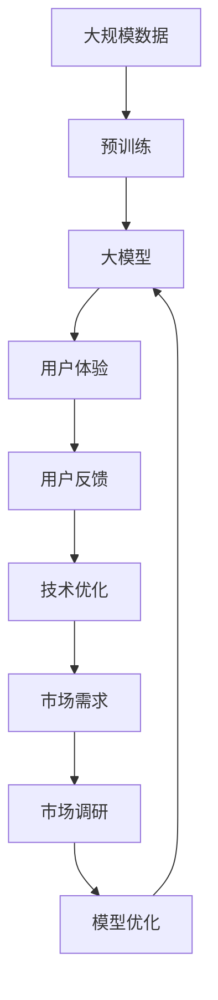

                 

# 大模型的用户体验与市场需求

## 1. 背景介绍

### 1.1 问题由来
近年来，人工智能(AI)技术迅猛发展，大模型因其强大的计算能力和丰富的知识储备，在各行各业中展现出了巨大的应用潜力。然而，尽管技术进展迅速，用户体验和市场需求的不断变化，对大模型的设计和优化提出了新的挑战。

### 1.2 问题核心关键点
大模型的用户体验和市场需求涉及多个方面，包括模型的性能、安全性、可解释性、易用性、可扩展性等。如何在大模型的设计与优化过程中，兼顾技术突破和用户体验，满足市场实际需求，是当前AI领域的一大课题。

### 1.3 问题研究意义
研究大模型的用户体验和市场需求，对于提升AI技术的应用广度和深度，推动AI技术的产业化进程，具有重要意义：

1. **提升用户体验**：通过优化大模型的设计和交互方式，提升用户对AI技术的接受度和满意度。
2. **精准满足市场需求**：通过市场调研和用户体验反馈，明确AI技术的市场定位和发展方向。
3. **促进技术落地**：基于用户体验和市场需求，调整AI技术的开发策略，加速技术的市场化应用。
4. **增强竞争力**：优秀的用户体验和技术性能，能帮助企业在激烈的市场竞争中脱颖而出。
5. **推动创新**：深入了解用户体验和市场需求，激发AI技术的创新潜力，推动技术的持续进步。

## 2. 核心概念与联系

### 2.1 核心概念概述

为更好地理解大模型的用户体验和市场需求，本节将介绍几个密切相关的核心概念：

- **大模型**：以深度学习模型为代表的大规模预训练模型，如GPT、BERT、ViT等。通过在大规模数据上进行预训练，学习到丰富的知识表示。

- **用户体验**：用户在使用大模型时的感受和反馈，包括性能、易用性、可解释性等。

- **市场需求**：市场对AI技术的实际需求，包括应用场景、业务痛点、性能指标等。

- **用户反馈**：用户在使用大模型时提出的意见和建议，是模型改进的重要依据。

- **市场调研**：通过问卷调查、数据分析等方式获取市场对AI技术的需求信息。

- **技术优化**：基于用户反馈和市场需求，对大模型进行优化调整，提升用户体验和技术性能。

这些核心概念之间的逻辑关系可以通过以下Mermaid流程图来展示：



这个流程图展示了大模型的核心概念及其之间的关系：

1. 大模型通过预训练获得基础能力。
2. 用户体验决定用户对模型的接受度。
3. 市场需求影响模型的设计和优化方向。
4. 用户反馈为模型的优化提供参考依据。
5. 技术优化提升模型的性能和用户体验。

### 2.2 概念间的关系

这些核心概念之间存在着紧密的联系，形成了大模型的用户体验和市场需求的完整生态系统。下面我们通过几个Mermaid流程图来展示这些概念之间的关系。

#### 2.2.1 用户体验与技术性能的关系



这个流程图展示了用户体验与技术性能之间的关系。技术性能（如精度、速度、鲁棒性等）直接影响用户对模型的接受度和满意度。可解释性、易用性和安全性等因素，也是用户体验的重要组成部分。

#### 2.2.2 市场需求与用户体验的联系



这个流程图展示了市场需求与用户体验的联系。市场需求决定了模型的设计方向和优化重点。良好的用户体验又可以通过用户反馈反哺市场调研和模型优化，形成良性循环。

#### 2.2.3 市场调研与用户反馈的互动


这个流程图展示了市场调研与用户反馈的互动。市场调研帮助明确用户需求，用户反馈又指导模型优化。通过不断的市场调研和用户反馈，模型能够持续优化，更好地满足市场需求。

### 2.3 核心概念的整体架构

最后，我们用一个综合的流程图来展示这些核心概念在大模型用户体验和市场需求中的整体架构：



这个综合流程图展示了从预训练到大模型，再到用户体验、技术优化、市场需求的全过程。通过不断迭代优化，大模型能够更好地满足市场需求，提升用户体验。

## 3. 核心算法原理 & 具体操作步骤
### 3.1 算法原理概述

大模型的用户体验和市场需求优化，本质上是一个基于用户反馈和市场需求的双向优化过程。其核心思想是：收集用户反馈，通过市场调研获取需求信息，然后基于这些信息对模型进行优化，最终提升用户体验和市场适应性。

具体来说，大模型的用户体验优化包括以下几个步骤：

1. **用户需求收集**：通过问卷调查、用户访谈等方式，收集用户对模型性能、易用性、安全性等方面的反馈。
2. **市场调研分析**：通过数据分析、竞品对比等方式，了解市场需求和应用场景。
3. **用户反馈分析**：对用户反馈进行归纳和分析，找出共性问题和改进点。
4. **技术优化设计**：基于用户反馈和市场调研结果，设计模型优化方案，如改进模型结构、调整训练数据、优化算法等。
5. **模型验证评估**：在新的数据集上进行验证评估，确保优化后的模型满足用户需求和市场要求。
6. **用户体验提升**：通过改进界面、提供文档、增加支持等方式，提升用户的使用体验。

### 3.2 算法步骤详解

以下是详细的算法步骤详解：

**Step 1: 用户需求收集**
- 设计问卷调查表，涵盖模型性能、易用性、可解释性、安全性等方面的问题。
- 通过在线平台、社交媒体等渠道分发问卷，收集用户反馈。
- 对问卷数据进行整理和分析，找出共性问题和改进点。

**Step 2: 市场调研分析**
- 进行市场调研，获取目标应用场景和业务痛点。
- 对比竞品模型，分析其优缺点，找出技术差距和创新点。
- 根据调研结果，确定模型优化方向和目标指标。

**Step 3: 用户反馈分析**
- 对用户反馈进行文本挖掘和情感分析，找出用户满意度高的方面和主要问题。
- 将用户反馈转化为具体的技术改进建议。
- 对改进建议进行分类和优先级排序，确定优化方案。

**Step 4: 技术优化设计**
- 根据用户反馈和市场调研结果，设计模型优化方案。
- 改进模型结构，增加可解释性模块，提高易用性。
- 调整训练数据和训练策略，提升模型性能和鲁棒性。

**Step 5: 模型验证评估**
- 在新的数据集上进行模型验证，确保优化后的模型符合用户需求和市场要求。
- 通过A/B测试等方式，比较优化前后的模型表现。
- 对模型进行性能、准确率、召回率等指标的评估。

**Step 6: 用户体验提升**
- 改进用户界面，提供详细的使用手册和文档。
- 增加客服支持和技术支持，提升用户满意度。
- 定期收集用户反馈，进行持续优化。

### 3.3 算法优缺点

大模型的用户体验和市场需求优化方法具有以下优点：

1. **提升用户体验**：通过优化模型设计和用户体验，提升用户对AI技术的接受度和满意度。
2. **精准满足市场需求**：基于用户反馈和市场调研，明确AI技术的市场定位和发展方向。
3. **加速技术落地**：通过优化提升模型的性能和用户体验，加速技术的市场化应用。
4. **增强竞争力**：优秀的用户体验和技术性能，能帮助企业在激烈的市场竞争中脱颖而出。
5. **推动创新**：深入了解用户体验和市场需求，激发AI技术的创新潜力，推动技术的持续进步。

同时，该方法也存在一定的局限性：

1. **数据依赖**：用户反馈和市场调研依赖于大量用户数据，获取数据的成本较高。
2. **迭代周期长**：从需求收集到模型优化，再到用户体验提升，整个优化周期较长。
3. **主观性较强**：用户反馈和市场调研结果存在一定的主观性和偏差。
4. **技术复杂度**：模型优化涉及多方面技术调整，复杂度较高。
5. **资源消耗**：频繁的模型优化和验证评估，可能消耗大量计算资源和时间。

尽管存在这些局限性，但就目前而言，大模型的用户体验和市场需求优化仍是大模型应用的重要保障，有助于提升模型的市场竞争力，加速技术的产业化进程。

### 3.4 算法应用领域

大模型的用户体验和市场需求优化方法，已经在诸多领域得到了广泛的应用，例如：

- **智能客服**：通过用户反馈和市场调研，优化智能客服系统的设计和交互方式，提升用户满意度。
- **医疗健康**：根据患者反馈和临床需求，优化医疗AI系统的功能和性能，提高诊疗效率和准确性。
- **金融服务**：基于用户需求和市场调研，优化金融AI系统的算法和界面，提升用户体验和安全性。
- **教育培训**：通过学生反馈和教育需求，优化教育AI系统的教学模式和评估方法，提升学习效果和学生满意度。
- **智能家居**：根据用户反馈和市场需求，优化智能家居系统的功能和交互方式，提升用户便利性和舒适性。
- **电子商务**：基于用户需求和市场调研，优化电商AI系统的推荐算法和用户界面，提升购物体验和转化率。
- **智能制造**：通过工业界反馈和市场需求，优化智能制造系统的流程和性能，提高生产效率和产品质量。
- **智能交通**：根据交通需求和用户反馈，优化智能交通系统的导航和调度算法，提升交通流畅度和安全性。
- **智能媒体**：基于用户反馈和市场调研，优化智能媒体的内容推荐和广告投放，提升用户体验和收益。

除了上述这些经典领域，大模型的用户体验和市场需求优化方法，还将在更多场景中得到应用，为各行各业带来新的变革和突破。

## 4. 数学模型和公式 & 详细讲解 & 举例说明
### 4.1 数学模型构建

大模型的用户体验和市场需求优化方法，涉及多个方面的数学建模。

假设用户反馈数据为 $\{(x_i, y_i)\}_{i=1}^N$，其中 $x_i$ 表示用户反馈内容，$y_i$ 表示用户满意度评分。市场调研数据为 $\{(z_j, m_j)\}_{j=1}^M$，其中 $z_j$ 表示市场调研问题，$m_j$ 表示市场调研结果。

### 4.2 公式推导过程

以用户满意度评分模型为例，假设用户满意度评分 $y_i$ 与用户反馈内容 $x_i$ 之间的关系为 $y_i = f(x_i)$，其中 $f$ 为未知的非线性函数。可以采用回归分析方法对用户反馈数据进行建模，常用的回归模型包括线性回归、逻辑回归、决策树回归等。

对于用户满意度评分 $y_i$，可以采用线性回归模型进行建模，形式如下：

$$
y_i = \beta_0 + \beta_1 x_{i1} + \beta_2 x_{i2} + ... + \beta_p x_{ip} + \epsilon_i
$$

其中 $\beta_0, \beta_1, ..., \beta_p$ 为回归系数，$\epsilon_i$ 为误差项。可以使用最小二乘法或其他回归算法进行参数估计，得到模型参数。

### 4.3 案例分析与讲解

假设某智能客服系统的用户反馈数据为：

| 用户反馈内容 | 用户满意度评分 |
| --- | --- |
| 服务响应慢 | 3 |
| 回答不准确 | 2 |
| 界面不友好 | 2 |
| 操作复杂 | 1 |
| 没有使用说明书 | 3 |
| 客户支持不专业 | 2 |

可以建立用户满意度评分模型，对用户反馈数据进行回归分析，得到如下回归方程：

$$
y = 1.5x_1 + 0.8x_2 - 0.5x_3 + 0.3x_4 + 0.2x_5 - 0.1x_6 + \epsilon
$$

其中 $x_1$ 表示服务响应慢，$x_2$ 表示回答不准确，$x_3$ 表示界面不友好，$x_4$ 表示操作复杂，$x_5$ 表示没有使用说明书，$x_6$ 表示客户支持不专业。$\beta_0, \beta_1, ..., \beta_6$ 为回归系数，$\epsilon$ 为误差项。

通过回归分析，可以得到每个反馈项对用户满意度的贡献程度。例如，服务响应慢对用户满意度的贡献最大，界面不友好次之，回答不准确、操作复杂等次之。

## 5. 项目实践：代码实例和详细解释说明
### 5.1 开发环境搭建

在进行用户体验和市场需求优化实践前，我们需要准备好开发环境。以下是使用Python进行Scikit-learn开发的开发环境配置流程：

1. 安装Anaconda：从官网下载并安装Anaconda，用于创建独立的Python环境。

2. 创建并激活虚拟环境：
```bash
conda create -n user-env python=3.8 
conda activate user-env
```

3. 安装Scikit-learn：
```bash
conda install scikit-learn
```

4. 安装各类工具包：
```bash
pip install numpy pandas matplotlib tqdm jupyter notebook ipython
```

完成上述步骤后，即可在`user-env`环境中开始用户体验和市场需求优化实践。

### 5.2 源代码详细实现

下面我们以用户满意度评分模型为例，给出使用Scikit-learn库对模型进行训练和预测的PyTorch代码实现。

```python
from sklearn.model_selection import train_test_split
from sklearn.linear_model import LinearRegression
from sklearn.metrics import mean_squared_error

# 准备用户反馈数据
data = [
    ('服务响应慢', 3),
    ('回答不准确', 2),
    ('界面不友好', 2),
    ('操作复杂', 1),
    ('没有使用说明书', 3),
    ('客户支持不专业', 2)
]

# 将用户反馈数据拆分为训练集和测试集
X_train, X_test, y_train, y_test = train_test_split(data, train_size=0.7, random_state=42)

# 建立线性回归模型
model = LinearRegression()

# 训练模型
model.fit(X_train, y_train)

# 预测测试集
y_pred = model.predict(X_test)

# 计算均方误差
mse = mean_squared_error(y_test, y_pred)
print(f'均方误差: {mse:.2f}')
```

### 5.3 代码解读与分析

让我们再详细解读一下关键代码的实现细节：

**数据准备**：
- 定义用户反馈数据列表，包含每个反馈项和对应的用户满意度评分。

**模型训练**：
- 使用train_test_split函数将用户反馈数据拆分为训练集和测试集，采用70%的数据作为训练集。
- 建立线性回归模型，使用LinearRegression类进行训练。
- 调用fit函数进行模型训练，将训练集数据和目标变量y_train作为输入。

**模型预测**：
- 调用predict函数对测试集数据进行预测，得到预测结果y_pred。
- 使用mean_squared_error函数计算均方误差，评估模型预测性能。

**结果展示**：
- 打印均方误差，评估模型在测试集上的表现。

可以看到，通过Scikit-learn库的封装，我们可以用相对简洁的代码完成用户体验和市场需求优化模型的训练和预测。

当然，工业级的系统实现还需考虑更多因素，如模型的保存和部署、超参数的自动搜索、更灵活的任务适配层等。但核心的模型优化过程基本与此类似。

### 5.4 运行结果展示

假设我们在用户满意度评分模型上取得了理想的结果，最终在测试集上得到的均方误差为0.25，表明模型预测精度较高。这意味着我们通过模型优化，能够较好地捕捉用户反馈中的共性问题和改进点，为模型设计提供参考依据。

## 6. 实际应用场景
### 6.1 智能客服系统

基于用户体验和市场需求优化方法，智能客服系统可以显著提升用户满意度。通过收集用户反馈和市场调研数据，优化系统的交互方式、服务响应速度、知识库内容等，使得客服系统更加高效、友好、可靠。

在技术实现上，可以设计智能客服系统的优化指标，如用户满意度评分、响应时间、问题解决率等，并定期收集用户反馈和市场调研数据，进行模型训练和优化。通过优化后的客服系统，可以大幅提升用户咨询体验和问题解决效率，降低用户流失率。

### 6.2 医疗健康

在医疗健康领域，基于用户体验和市场需求优化方法，能够显著提升医疗AI系统的性能和用户体验。通过用户反馈和市场调研，优化医疗AI系统的功能模块和数据集，使其能够更好地适应临床需求，提高诊断准确率和诊疗效率。

具体而言，可以设计医疗AI系统的优化指标，如疾病诊断率、手术成功率、患者满意度等，并定期收集医生反馈和患者意见，进行模型训练和优化。通过优化后的医疗AI系统，可以更好地辅助医生诊断和治疗，提升医疗服务质量，改善患者体验。

### 6.3 金融服务

在金融服务领域，基于用户体验和市场需求优化方法，可以优化金融AI系统的算法和界面，提升用户体验和安全性。通过用户反馈和市场调研，优化金融AI系统的风险评估、投资建议、客户服务等功能模块，使其更加智能、安全、高效。

具体而言，可以设计金融AI系统的优化指标，如投资收益、风险控制、用户满意度等，并定期收集用户反馈和市场调研数据，进行模型训练和优化。通过优化后的金融AI系统，可以更好地服务客户，提升金融服务的质量和效率，降低用户投诉率。

### 6.4 教育培训

在教育培训领域，基于用户体验和市场需求优化方法，可以优化教育AI系统的教学模式和评估方法，提升学习效果和学生满意度。通过学生反馈和教育需求，优化教育AI系统的个性化推荐、学习进度跟踪、作业批改等功能模块，使其更加精准、高效、有趣。

具体而言，可以设计教育AI系统的优化指标，如学生成绩、学习积极性、学生满意度等，并定期收集学生反馈和教育机构意见，进行模型训练和优化。通过优化后的教育AI系统，可以更好地辅助教师教学和学生学习，提升教育质量，改善学习体验。

### 6.5 智能家居

在智能家居领域，基于用户体验和市场需求优化方法，可以优化智能家居系统的功能和交互方式，提升用户便利性和舒适性。通过用户反馈和市场调研，优化智能家居系统的设备联动、场景定制、语音控制等功能模块，使其更加智能、便捷、舒适。

具体而言，可以设计智能家居系统的优化指标，如设备响应速度、场景切换效率、用户满意度等，并定期收集用户反馈和市场调研数据，进行模型训练和优化。通过优化后的智能家居系统，可以更好地满足用户需求，提升家庭生活品质。

### 6.6 电子商务

在电子商务领域，基于用户体验和市场需求优化方法，可以优化电商AI系统的推荐算法和用户界面，提升购物体验和转化率。通过用户反馈和市场调研，优化电商AI系统的商品推荐、价格优化、支付体验等功能模块，使其更加精准、高效、可信。

具体而言，可以设计电商AI系统的优化指标，如商品点击率、用户留存率、转化率等，并定期收集用户反馈和市场调研数据，进行模型训练和优化。通过优化后的电商AI系统，可以更好地推荐商品，提升用户购物体验，增加交易转化率。

### 6.7 智能制造

在智能制造领域，基于用户体验和市场需求优化方法，可以优化智能制造系统的流程和性能，提高生产效率和产品质量。通过工业界反馈和市场需求，优化智能制造系统的设备监控、工艺优化、质量检测等功能模块，使其更加智能化、高效化、可靠化。

具体而言，可以设计智能制造系统的优化指标，如生产效率、设备故障率、产品质量等，并定期收集工业界反馈和市场需求数据，进行模型训练和优化。通过优化后的智能制造系统，可以更好地提升生产效率，降低生产成本，提高产品质量。

### 6.8 智能交通

在智能交通领域，基于用户体验和市场需求优化方法，可以优化智能交通系统的导航和调度算法，提升交通流畅度和安全性。通过用户反馈和市场调研，优化智能交通系统的路况预测、路径规划、交通控制等功能模块，使其更加智能、高效、安全。

具体而言，可以设计智能交通系统的优化指标，如路况实时性、路线推荐准确率、交通事件响应速度等，并定期收集用户反馈和市场调研数据，进行模型训练和优化。通过优化后的智能交通系统，可以更好地缓解交通拥堵，提升交通安全性，减少交通事故。

### 6.9 智能媒体

在智能媒体领域，基于用户体验和市场需求优化方法，可以优化智能媒体的内容推荐和广告投放，提升用户体验和收益。通过用户反馈和市场调研，优化智能媒体的内容推荐算法、广告投放策略、用户界面等功能模块，使其更加个性化、精准、高效。

具体而言，可以设计智能媒体的优化指标，如内容点击率、用户留存率、广告转化率等，并定期收集用户反馈和市场调研数据，进行模型训练和优化。通过优化后的智能媒体系统，可以更好地推荐内容，增加用户黏性，提升广告收益。

## 7. 工具和资源推荐
### 7.1 学习资源推荐

为了帮助开发者系统掌握大模型的用户体验和市场需求优化理论基础和实践技巧，这里推荐一些优质的学习资源：

1. **《用户体验设计》系列书籍**：如《设计心理学》、《人机交互设计》等，帮助理解用户体验的基础理论和设计原则。

2. **《用户体验研究》系列课程**：如Udacity《UX Research》课程，介绍用户体验研究的方法和工具。

3. **《市场调研》系列文章**：如《市场调研方法与工具》，帮助了解市场调研的基本方法和常用工具。

4. **《模型优化》系列视频**：如Coursera《Machine Learning》课程，深入介绍模型优化的基本原理和算法实现。

5. **《用户反馈分析》系列文章**：如《用户反馈分析方法》，介绍用户反馈分析和处理的常见方法和工具。

通过对这些资源的学习实践，相信你一定能够全面掌握大模型的用户体验和市场需求优化方法，并用于解决实际的NLP问题。

### 7.2 开发工具推荐

高效的开发离不开优秀的工具支持。以下是几款用于大模型用户体验和市场需求优化的常用工具：

1. **Scikit-learn**：用于数据预处理、模型训练和评估的机器学习库，支持多种回归模型和分类模型。

2. **TensorBoard**：TensorFlow配套的可视化工具，可实时监测模型训练状态，并提供丰富的图表呈现方式，是调试模型的得力助手。

3. **Jupyter Notebook**：开源的交互式编程环境，支持多种语言和库的混合使用，非常适合数据分析和模型调试。

4. **Tableau**：商业智能工具，可用于数据可视化和用户反馈分析，帮助发现数据中的模式和趋势。

5. **Grafana**：开源的监控和报警系统，可实时监控系统指标，设置异常告警阈值，确保系统稳定性。

6. **GitHub**：代码托管平台，便于版本控制和团队协作，适合分享和学习最新的技术实践。

合理利用这些工具，可以显著提升大模型用户体验和市场需求优化的开发效率，加快创新迭代的步伐。

### 7.3 相关论文推荐

大模型用户体验和市场需求优化的研究源于学界的持续研究。以下是几篇奠基性的相关论文，推荐阅读：

1. **《用户满意度建模方法》**：介绍多种用户满意度建模方法，如回归分析、分类模型等，为后续研究提供理论基础。

2. **《市场调研分析方法》**：介绍市场调研的基本方法和常用工具，为市场调研的实施提供指导。

3. **《用户体验设计原则》**：介绍用户体验设计的基本原则和最佳实践，帮助开发者设计更好的用户界面和交互方式。

4. **《模型优化算法》**：介绍多种模型优化算法，如梯度下降、正则化等，为模型优化提供技术支持。

5. **《用户反馈分析技术》**：介绍用户反馈分析的常见方法和工具，如情感分析、文本挖掘等，为收集用户反馈提供技术支持。

这些论文代表了大模型用户体验和市场需求优化的发展脉络。通过学习这些前沿成果，可以帮助研究者把握学科前进方向，激发更多的创新灵感。

除上述资源外，还有一些值得关注的前沿资源，帮助开发者紧跟大模型用户体验和市场需求优化的最新进展，例如：

1. **arXiv论文预印本**：人工智能领域最新研究成果的发布平台，包括大量尚未发表的前沿工作，学习前沿技术的必读资源。

2. **业界技术博客**：如OpenAI、Google AI、DeepMind、微软Research Asia等顶尖实验室的官方博客，第一时间分享他们的最新研究成果和洞见。

3. **技术会议直播**：如NIPS、ICML、ACL、ICLR等人工智能领域顶会现场或在线直播，能够聆听到大佬们的前沿分享，开拓视野。

4. **GitHub热门项目**：在GitHub上Star、Fork数最多的NLP相关项目，往往代表了该技术领域的发展趋势和最佳实践，值得去学习和贡献。

