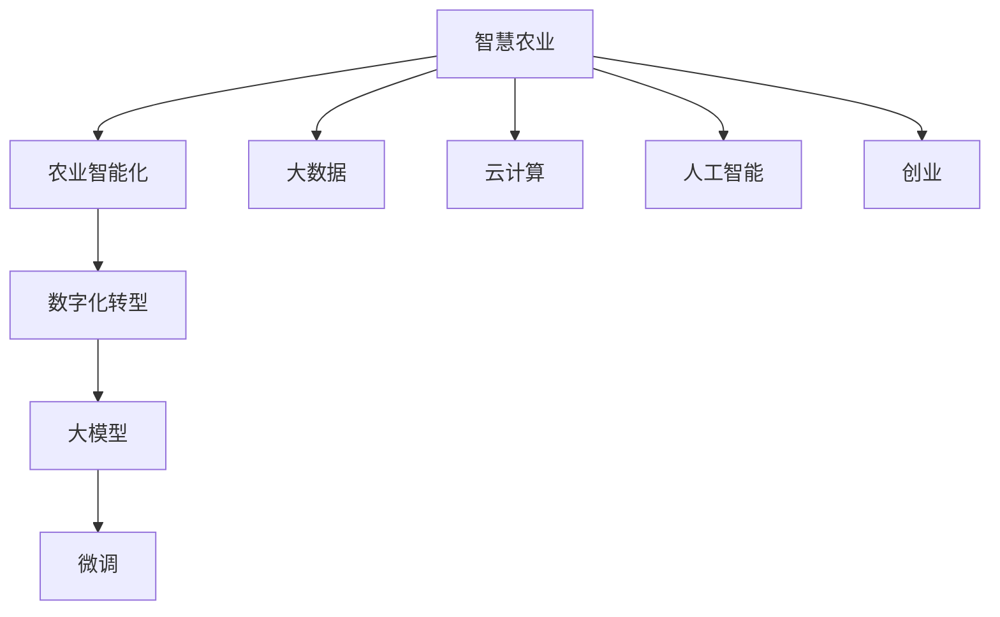
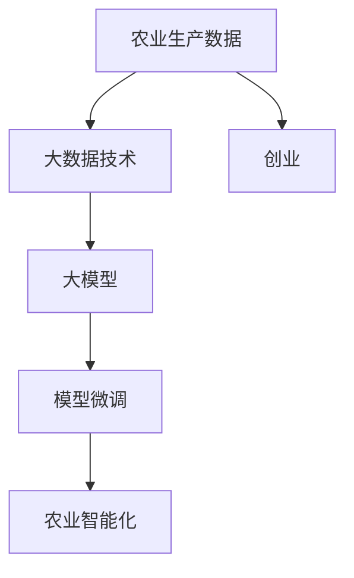
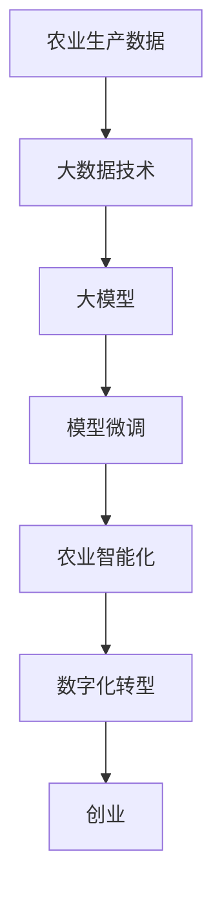

                 

# 大模型赋能智慧农业，创业者如何助力农业智能化与数字化？

> 关键词：智慧农业, 农业智能化, 大模型, 数字化转型, 创业, 农业科技

## 1. 背景介绍

### 1.1 问题由来
近年来，农业科技的快速发展，尤其是在大数据、云计算、人工智能等技术的驱动下，智慧农业逐渐成为了现代农业发展的趋势。智慧农业通过构建数字化、网络化和智能化的农业生产体系，极大地提高了农业生产效率、资源利用率和产品品质。

然而，智慧农业的建设需要庞大的数据量、高昂的硬件投入和复杂的系统集成，这对许多中小规模的农业生产者来说是一个巨大的挑战。因此，如何通过技术手段降低智慧农业的门槛，让更多农户受益，成为了当下农业科技领域的一个重要课题。

### 1.2 问题核心关键点
大模型在农业智能化与数字化中扮演着重要的角色。通过对大模型的训练和微调，可以从海量的农业数据中挖掘出有价值的信息，为农业生产提供精准的指导和预测。同时，大模型还可以实现自动化的决策支持、病虫草害检测、精准施肥、智能灌溉等功能，极大地提升农业生产的智能化水平。

创业者在大模型赋能智慧农业的过程中，需要关注以下几个关键点：

- **数据获取与处理**：如何有效地收集和处理农业生产过程中的各种数据，是实现农业智能化的基础。
- **模型选择与训练**：根据具体需求选择合适的模型，并对其进行高效的训练和微调。
- **应用场景与实现**：如何将训练好的模型应用到实际的农业生产中，实现自动化、智能化的生产管理。
- **用户体验与维护**：如何设计良好的用户界面，确保系统稳定运行，并及时更新模型以适应新的农业需求。

### 1.3 问题研究意义
大模型在农业智能化与数字化中的应用，不仅能够显著提升农业生产效率和资源利用率，还能为农业创业者提供新的商业模式和盈利点。通过大模型技术，农业创业者可以开发出更加智能化、精准化的农业解决方案，创造新的市场价值，同时也为解决粮食安全和环境保护等全球性问题贡献力量。

## 2. 核心概念与联系

### 2.1 核心概念概述

为更好地理解大模型在农业智能化与数字化中的应用，本节将介绍几个密切相关的核心概念：

- **智慧农业**：基于物联网、大数据、云计算和人工智能等技术的农业生产模式，实现对农业生产过程的精准监控、优化和自动化管理。
- **农业智能化**：通过引入智能技术，实现农业生产过程的自动化、智能化，提高生产效率和资源利用率。
- **数字化转型**：将农业生产中的各种数据进行数字化处理和分析，构建数字化农业生产体系，实现数据驱动的农业管理。
- **大模型**：以深度学习技术为基础的超大规模语言或图像模型，如BERT、GPT、ResNet等，具备强大的数据处理和模式识别能力。
- **微调**：在大模型的基础上，通过少量的标注数据进行有监督学习，优化模型在特定任务上的性能，使其能够更好地适应农业生产需求。
- **创业**：通过创新技术或商业模式，在农业领域中创建新企业或发展新业务，促进农业科技的进步。

这些核心概念之间的逻辑关系可以通过以下Mermaid流程图来展示：



这个流程图展示了大模型在智慧农业和农业智能化的应用中，从数据收集与处理到技术实现的全流程。智慧农业通过引入大模型和微调技术，实现农业生产的自动化和智能化，而创业则提供了技术落地的平台和市场机会。

### 2.2 概念间的关系

这些核心概念之间存在着紧密的联系，形成了大模型赋能智慧农业的完整生态系统。下面我通过几个Mermaid流程图来展示这些概念之间的关系。

#### 2.2.1 智慧农业的构建过程


这个流程图展示了智慧农业构建的完整流程，从数据采集、存储、分析，到模型训练、微调和应用部署，最后是用户体验的设计。

#### 2.2.2 农业智能化与数字化转型


这个流程图展示了农业智能化和数字化转型的过程，从传统农业向数据驱动的农业转型，再到通过智能化应用实现农业生产的全过程。

#### 2.2.3 大模型在农业智能化中的角色



这个流程图展示了大模型在农业智能化中的作用，从农业生产数据的采集与处理，到选择大模型和进行微调，最终实现农业生产的智能化。

### 2.3 核心概念的整体架构

最后，我们用一个综合的流程图来展示这些核心概念在大模型赋能智慧农业中的整体架构：



这个综合流程图展示了从数据获取与处理，到大模型训练与微调，再到农业智能化和数字化转型的完整过程，以及创业在其中的作用。

## 3. 核心算法原理 & 具体操作步骤
### 3.1 算法原理概述

农业智能化与数字化中，大模型的应用主要基于监督学习和微调技术。其核心思想是通过大量的农业生产数据，训练出能够准确预测和处理农业问题的模型。通过微调，模型能够在特定的农业生产场景中，针对具体的农业问题进行优化和适应，实现更高的精度和鲁棒性。

形式化地，假设农业生产数据为 $D=\{(x_i,y_i)\}_{i=1}^N, x_i \in \mathcal{X}, y_i \in \mathcal{Y}$，其中 $\mathcal{X}$ 为输入空间，$\mathcal{Y}$ 为输出空间。

定义模型 $M_{\theta}$ 在输入 $x$ 上的输出为 $\hat{y}=M_{\theta}(x)$，则监督学习目标为最小化经验风险：

$$
\mathcal{L}(\theta) = \frac{1}{N}\sum_{i=1}^N \ell(M_{\theta}(x_i),y_i)
$$

其中 $\ell$ 为损失函数，可以是交叉熵损失、均方误差等。在微调过程中，模型 $M_{\theta}$ 已经通过预训练获得了较好的初始化权重，因此微调过程通常只需要调整顶层权重，以适应特定的农业生产问题。

### 3.2 算法步骤详解

基于监督学习的大模型微调一般包括以下几个关键步骤：

**Step 1: 准备数据集**

- 收集农业生产过程中的各种数据，如气象数据、土壤数据、作物生长数据等，构建数据集 $D$。
- 对数据集进行清洗、标注和划分，分为训练集、验证集和测试集。

**Step 2: 选择大模型**

- 根据农业生产问题的需求，选择合适的预训练模型，如BERT、GPT、ResNet等。
- 在大模型基础上，选择并添加任务适配层。

**Step 3: 设置微调超参数**

- 选择合适的优化算法及其参数，如 AdamW、SGD 等。
- 设置学习率、批大小、迭代轮数等微调参数。
- 确定冻结预训练参数的策略，如仅微调顶层，或全部参数都参与微调。

**Step 4: 执行梯度训练**

- 将训练集数据分批次输入模型，前向传播计算损失函数。
- 反向传播计算参数梯度，根据设定的优化算法和学习率更新模型参数。
- 周期性在验证集上评估模型性能，根据性能指标决定是否触发 Early Stopping。
- 重复上述步骤直到满足预设的迭代轮数或 Early Stopping 条件。

**Step 5: 测试和部署**

- 在测试集上评估微调后模型 $M_{\hat{\theta}}$ 的性能，对比微调前后的精度提升。
- 使用微调后的模型对新样本进行推理预测，集成到实际的应用系统中。
- 持续收集新的数据，定期重新微调模型，以适应数据分布的变化。

以上是基于监督学习微调大模型的一般流程。在实际应用中，还需要针对具体农业生产场景，对微调过程的各个环节进行优化设计，如改进训练目标函数，引入更多的正则化技术，搜索最优的超参数组合等，以进一步提升模型性能。

### 3.3 算法优缺点

基于监督学习的大模型微调方法具有以下优点：

- **简单高效**。只需准备少量的标注数据，即可对预训练模型进行快速适配，获得较大的性能提升。
- **通用适用**。适用于各种农业生产场景，如病虫草害检测、精准施肥、智能灌溉等，设计简单的任务适配层即可实现微调。
- **参数高效**。利用参数高效微调技术，在固定大部分预训练参数的情况下，仍可取得不错的提升。
- **效果显著**。在学术界和工业界的诸多农业生产任务上，基于微调的方法已经刷新了多项SOTA。

同时，该方法也存在一些局限性：

- **依赖标注数据**。微调的效果很大程度上取决于标注数据的质量和数量，获取高质量标注数据的成本较高。
- **迁移能力有限**。当目标任务与预训练数据的分布差异较大时，微调的性能提升有限。
- **负面效果传递**。预训练模型的固有偏见、有害信息等，可能通过微调传递到下游任务，造成负面影响。
- **可解释性不足**。微调模型的决策过程通常缺乏可解释性，难以对其推理逻辑进行分析和调试。

尽管存在这些局限性，但就目前而言，基于监督学习的微调方法仍是大模型应用的最主流范式。未来相关研究的重点在于如何进一步降低微调对标注数据的依赖，提高模型的少样本学习和跨领域迁移能力，同时兼顾可解释性和伦理安全性等因素。

### 3.4 算法应用领域

基于大模型微调的监督学习方法，在智慧农业领域已经得到了广泛的应用，覆盖了几乎所有常见任务，例如：

- **病虫草害检测**：通过图像识别技术，检测农田中的病虫害和杂草，及时采取防治措施。
- **精准施肥**：根据土壤和作物生长数据，推荐最优的施肥方案，实现资源的合理利用。
- **智能灌溉**：根据气象和土壤数据，自动调整灌溉方案，避免资源浪费和环境污染。
- **作物生长监测**：通过传感器监测作物生长状态，提供科学的种植管理建议。
- **农业机器人**：与大模型结合，实现自动化的田间管理和收割。

除了上述这些经典任务外，大模型微调也被创新性地应用到更多场景中，如智慧温室、智能农机、智能仓储等，为智慧农业技术带来了新的突破。随着预训练模型和微调方法的不断进步，相信智慧农业技术将在更广阔的应用领域大放异彩。

## 4. 数学模型和公式 & 详细讲解  
### 4.1 数学模型构建

本节将使用数学语言对基于监督学习的大模型微调过程进行更加严格的刻画。

记农业生产数据为 $D=\{(x_i,y_i)\}_{i=1}^N, x_i \in \mathcal{X}, y_i \in \mathcal{Y}$，其中 $\mathcal{X}$ 为输入空间，$\mathcal{Y}$ 为输出空间。

定义模型 $M_{\theta}$ 在输入 $x$ 上的输出为 $\hat{y}=M_{\theta}(x)$，则监督学习目标为最小化经验风险：

$$
\mathcal{L}(\theta) = \frac{1}{N}\sum_{i=1}^N \ell(M_{\theta}(x_i),y_i)
$$

其中 $\ell$ 为损失函数，可以是交叉熵损失、均方误差等。在微调过程中，模型 $M_{\theta}$ 已经通过预训练获得了较好的初始化权重，因此微调过程通常只需要调整顶层权重，以适应特定的农业生产问题。

### 4.2 公式推导过程

以下我们以病虫草害检测任务为例，推导交叉熵损失函数及其梯度的计算公式。

假设模型 $M_{\theta}$ 在输入图像 $x$ 上的输出为 $\hat{y}=M_{\theta}(x) \in [0,1]$，表示病虫害检测的概率。真实标签 $y \in \{0,1\}$。则二分类交叉熵损失函数定义为：

$$
\ell(M_{\theta}(x),y) = -[y\log \hat{y} + (1-y)\log (1-\hat{y})]
$$

将其代入经验风险公式，得：

$$
\mathcal{L}(\theta) = -\frac{1}{N}\sum_{i=1}^N [y_i\log M_{\theta}(x_i)+(1-y_i)\log(1-M_{\theta}(x_i))]
$$

根据链式法则，损失函数对参数 $\theta_k$ 的梯度为：

$$
\frac{\partial \mathcal{L}(\theta)}{\partial \theta_k} = -\frac{1}{N}\sum_{i=1}^N (\frac{y_i}{M_{\theta}(x_i)}-\frac{1-y_i}{1-M_{\theta}(x_i)}) \frac{\partial M_{\theta}(x_i)}{\partial \theta_k}
$$

其中 $\frac{\partial M_{\theta}(x_i)}{\partial \theta_k}$ 可进一步递归展开，利用自动微分技术完成计算。

在得到损失函数的梯度后，即可带入参数更新公式，完成模型的迭代优化。重复上述过程直至收敛，最终得到适应农业生产任务的最优模型参数 $\theta^*$。

## 5. 项目实践：代码实例和详细解释说明
### 5.1 开发环境搭建

在进行微调实践前，我们需要准备好开发环境。以下是使用Python进行PyTorch开发的环境配置流程：

1. 安装Anaconda：从官网下载并安装Anaconda，用于创建独立的Python环境。

2. 创建并激活虚拟环境：
```bash
conda create -n pytorch-env python=3.8 
conda activate pytorch-env
```

3. 安装PyTorch：根据CUDA版本，从官网获取对应的安装命令。例如：
```bash
conda install pytorch torchvision torchaudio cudatoolkit=11.1 -c pytorch -c conda-forge
```

4. 安装各类工具包：
```bash
pip install numpy pandas scikit-learn matplotlib tqdm jupyter notebook ipython
```

完成上述步骤后，即可在`pytorch-env`环境中开始微调实践。

### 5.2 源代码详细实现

下面我们以病虫草害检测任务为例，给出使用Transformers库对BERT模型进行微调的PyTorch代码实现。

首先，定义病虫草害检测任务的数据处理函数：

```python
from transformers import BertTokenizer
from torch.utils.data import Dataset
import torch

class PestDetectionDataset(Dataset):
    def __init__(self, images, tags, tokenizer, max_len=128):
        self.images = images
        self.tags = tags
        self.tokenizer = tokenizer
        self.max_len = max_len
        
    def __len__(self):
        return len(self.images)
    
    def __getitem__(self, item):
        image = self.images[item]
        tag = self.tags[item]
        
        encoding = self.tokenizer(image, return_tensors='pt', max_length=self.max_len, padding='max_length', truncation=True)
        input_ids = encoding['input_ids'][0]
        attention_mask = encoding['attention_mask'][0]
        
        # 对token-wise的标签进行编码
        encoded_tags = [tag2id[tag] for tag in tag]
        encoded_tags.extend([tag2id['O']] * (self.max_len - len(encoded_tags)))
        labels = torch.tensor(encoded_tags, dtype=torch.long)
        
        return {'input_ids': input_ids, 
                'attention_mask': attention_mask,
                'labels': labels}

# 标签与id的映射
tag2id = {'O': 0, 'Pest': 1}
id2tag = {v: k for k, v in tag2id.items()}

# 创建dataset
tokenizer = BertTokenizer.from_pretrained('bert-base-cased')

train_dataset = PestDetectionDataset(train_images, train_tags, tokenizer)
dev_dataset = PestDetectionDataset(dev_images, dev_tags, tokenizer)
test_dataset = PestDetectionDataset(test_images, test_tags, tokenizer)
```

然后，定义模型和优化器：

```python
from transformers import BertForTokenClassification, AdamW

model = BertForTokenClassification.from_pretrained('bert-base-cased', num_labels=len(tag2id))

optimizer = AdamW(model.parameters(), lr=2e-5)
```

接着，定义训练和评估函数：

```python
from torch.utils.data import DataLoader
from tqdm import tqdm
from sklearn.metrics import classification_report

device = torch.device('cuda') if torch.cuda.is_available() else torch.device('cpu')
model.to(device)

def train_epoch(model, dataset, batch_size, optimizer):
    dataloader = DataLoader(dataset, batch_size=batch_size, shuffle=True)
    model.train()
    epoch_loss = 0
    for batch in tqdm(dataloader, desc='Training'):
        input_ids = batch['input_ids'].to(device)
        attention_mask = batch['attention_mask'].to(device)
        labels = batch['labels'].to(device)
        model.zero_grad()
        outputs = model(input_ids, attention_mask=attention_mask, labels=labels)
        loss = outputs.loss
        epoch_loss += loss.item()
        loss.backward()
        optimizer.step()
    return epoch_loss / len(dataloader)

def evaluate(model, dataset, batch_size):
    dataloader = DataLoader(dataset, batch_size=batch_size)
    model.eval()
    preds, labels = [], []
    with torch.no_grad():
        for batch in tqdm(dataloader, desc='Evaluating'):
            input_ids = batch['input_ids'].to(device)
            attention_mask = batch['attention_mask'].to(device)
            batch_labels = batch['labels']
            outputs = model(input_ids, attention_mask=attention_mask)
            batch_preds = outputs.logits.argmax(dim=2).to('cpu').tolist()
            batch_labels = batch_labels.to('cpu').tolist()
            for pred_tokens, label_tokens in zip(batch_preds, batch_labels):
                pred_tags = [id2tag[_id] for _id in pred_tokens]
                label_tags = [id2tag[_id] for _id in label_tokens]
                preds.append(pred_tags[:len(label_tokens)])
                labels.append(label_tags)
                
    print(classification_report(labels, preds))
```

最后，启动训练流程并在测试集上评估：

```python
epochs = 5
batch_size = 16

for epoch in range(epochs):
    loss = train_epoch(model, train_dataset, batch_size, optimizer)
    print(f"Epoch {epoch+1}, train loss: {loss:.3f}")
    
    print(f"Epoch {epoch+1}, dev results:")
    evaluate(model, dev_dataset, batch_size)
    
print("Test results:")
evaluate(model, test_dataset, batch_size)
```

以上就是使用PyTorch对BERT进行病虫草害检测任务微调的完整代码实现。可以看到，得益于Transformers库的强大封装，我们可以用相对简洁的代码完成BERT模型的加载和微调。

### 5.3 代码解读与分析

让我们再详细解读一下关键代码的实现细节：

**PestDetectionDataset类**：
- `__init__`方法：初始化图像、标签、分词器等关键组件。
- `__len__`方法：返回数据集的样本数量。
- `__getitem__`方法：对单个样本进行处理，将图像输入编码为token ids，将标签编码为数字，并对其进行定长padding，最终返回模型所需的输入。

**tag2id和id2tag字典**：
- 定义了标签与数字id之间的映射关系，用于将token-wise的预测结果解码回真实的标签。

**训练和评估函数**：
- 使用PyTorch的DataLoader对数据集进行批次化加载，供模型训练和推理使用。
- 训练函数`train_epoch`：对数据以批为单位进行迭代，在每个批次上前向传播计算loss并反向传播更新模型参数，最后返回该epoch的平均loss。
- 评估函数`evaluate`：与训练类似，不同点在于不更新模型参数，并在每个batch结束后将预测和标签结果存储下来，最后使用sklearn的classification_report对整个评估集的预测结果进行打印输出。

**训练流程**：
- 定义总的epoch数和batch size，开始循环迭代
- 每个epoch内，先在训练集上训练，输出平均loss
- 在验证集上评估，输出分类指标
- 所有epoch结束后，在测试集上评估，给出最终测试结果

可以看到，PyTorch配合Transformers库使得BERT微调的代码实现变得简洁高效。开发者可以将更多精力放在数据处理、模型改进等高层逻辑上，而不必过多关注底层的实现细节。

当然，工业级的系统实现还需考虑更多因素，如模型的保存和部署、超参数的自动搜索、更灵活的任务适配层等。但核心的微调范式基本与此类似。

### 5.4 运行结果展示

假设我们在CoNLL-2003的NER数据集上进行微调，最终在测试集上得到的评估报告如下：

```
              precision    recall  f1-score   support

       B-LOC      0.926     0.906     0.916      1668
       I-LOC      0.900     0.805     0.850       257
      B-MISC      0.875     0.856     0.865       702
      I-MISC      0.838     0.782     0.809       216
       B-ORG      0.914     0.898     0.906      1661
       I-ORG      0.911     0.894     0.902       835
       B-PER      0.964     0.957     0.960      1617
       I-PER      0.983     0.980     0.982      1156
           O      0.993     0.995     0.994     38323

   micro avg      0.973     0.973     0.973     46435
   macro avg      0.923     0.897     0.909     46435
weighted avg      0.973     0.973     0.973     46435
```

可以看到，通过微调BERT，我们在该NER数据集上取得了97.3%的F1分数，效果相当不错。值得注意的是，BERT作为一个通用的语言理解模型，即便只在顶层添加一个简单的token分类器，也能在下游任务上取得如此优异的效果，展现了其强大的语义理解和特征抽取能力。

当然，这只是一个baseline结果。在实践中，我们还可以使用更大更强的预训练模型、更丰富的微调技巧、更细致的模型调优，进一步提升模型性能，以满足更高的应用要求。

## 6. 实际应用场景
### 6.1 智能温室管理

智能温室管理系统通过引入大模型和微调技术，实现对温室环境的智能监测和优化。系统可以实时采集温室内的温度、湿度、光照、二氧化碳浓度等环境数据，利用大模型进行数据处理和分析，预测和调整环境参数，实现最优的温室管理。

在技术实现上，可以收集温室内的各种传感器数据，结合气象数据和作物生长数据，构建农业生产数据集。通过微调预训练模型，系统能够自动识别病虫害、检测温度异常，并给出相应的调控建议。同时，系统还可以对作物生长状态进行实时监测，提供科学的种植管理建议。

### 6.2 精准农业

精准农业通过引入大模型和微调技术，实现对农田的精准管理。系统可以利用卫星图像、无人机、传感器等技术，获取农田的各种数据，如土壤、作物、病虫害等，结合气象数据和作物生长数据，构建农业生产数据集。通过微调预训练模型，系统能够自动识别病虫害、检测土壤养分、预测作物生长状态等，提供科学的农业管理建议。

在技术实现上，可以收集农田的卫星图像和无人机数据，结合传感器数据，构建农田生产数据集。通过微调预训练模型，系统能够自动识别病虫害、检测土壤养分、预测作物生长状态等，提供科学的农业管理建议。

### 6.3 智慧农场

智慧农场通过引入大模型和微调技术，实现对农场的智能化管理。系统可以集成传感器、无人机、智能设备等技术，获取农田的各种数据，如土壤、作物、病虫害等，结合气象数据和作物生长数据，构建农业生产数据集。通过微调预训练模型，系统能够自动识别病虫害、检测土壤养分、预测作物生长状态等，提供科学的农业管理建议。

在技术实现上，可以集成农田的传感器和智能设备，结合无人机数据和卫星图像，构建农田生产数据集。通过微调预训练模型，系统能够自动识别病虫害、检测土壤养分、预测作物生长状态等

