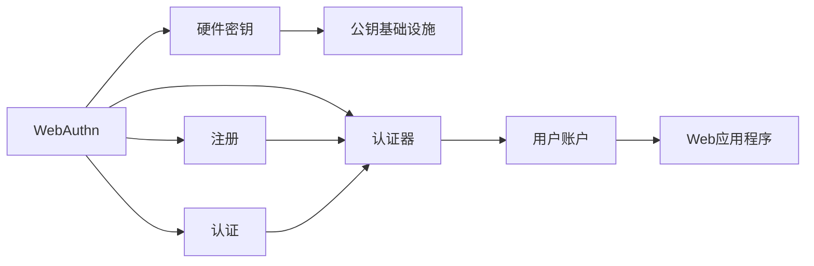

                 

# WebAuthn 的优势

在数字时代，网络安全已经成为一个不可忽视的问题。从社交媒体到在线银行，再到电子商务平台，用户数据的安全性和隐私保护成为各个服务提供商的首要任务。近年来，WebAuthn（Web身份验证API）技术作为一项重要的网络安全技术，正逐渐成为保障用户数据安全的关键。本文将深入探讨WebAuthn技术，并详细阐述其优势和实际应用。

## 1. 背景介绍

### 1.1 问题由来
随着互联网的快速发展，用户的个人信息安全越来越受到关注。传统的用户名和密码验证方式存在诸多安全隐患，例如密码泄露、暴力破解、账户劫持等问题屡见不鲜。为了更好地保障用户身份和数据安全，FIDO联盟推出了WebAuthn技术，旨在通过硬件安全模块（HSM）和公钥基础设施（PKI）等手段，为用户身份验证提供更加安全、便捷的解决方案。

### 1.2 问题核心关键点
WebAuthn技术利用硬件密钥来验证用户的身份，通过HSM和PKI机制，确保用户身份验证的安全性和不可伪造性。这种技术不仅提升了账户安全，还简化了用户登录过程，减少了对密码的依赖。

### 1.3 问题研究意义
WebAuthn技术通过硬件密钥替代传统密码，大大提升了账户安全，避免了密码泄露带来的风险。同时，其便捷性也提高了用户体验，减少了用户记忆和管理多个账户的烦恼。此外，WebAuthn技术还支持跨平台验证，使用户在不同设备上登录更加顺畅。

## 2. 核心概念与联系

### 2.1 核心概念概述
WebAuthn技术是基于Web平台的一种身份验证标准，通过硬件密钥和公钥基础设施来验证用户身份。其主要包括以下几个关键概念：

- **硬件密钥（Hardware Key）**：用于存储用户身份信息的物理设备，如安全密钥或身份验证器。
- **公钥基础设施（PKI）**：基于公钥加密技术，为WebAuthn提供信任和验证机制。
- **认证器（Authenticator）**：用于生成和存储用户身份信息的Web应用程序，可以是浏览器或移动应用。
- **注册（Registration）**：在WebAuthn中，用户需要先在认证器上进行身份注册，将硬件密钥绑定到用户账户。
- **认证（Authentication）**：在后续登录时，用户使用硬件密钥进行身份验证，完成登录过程。

这些概念通过WebAuthn技术连接起来，形成一个完整的身份验证系统。

### 2.2 核心概念间的关系

WebAuthn技术通过硬件密钥和PKI机制，将用户身份信息与Web应用程序紧密绑定，从而实现更加安全、便捷的身份验证。以下是WebAuthn技术的关键流程和概念之间的关系：



这个流程图展示了WebAuthn技术的工作流程，从用户注册到登录验证的完整过程。

## 3. 核心算法原理 & 具体操作步骤
### 3.1 算法原理概述
WebAuthn技术基于公钥加密技术，通过硬件密钥和PKI机制实现用户身份验证。其主要原理包括：

- **密钥生成**：在用户注册时，WebAuthn生成一对公私钥，并将其存储在硬件密钥中。
- **证书生成**：使用公钥生成数字证书，并存储在认证器中。
- **身份验证**：在用户登录时，WebAuthn验证器使用私钥解密数字证书，完成身份验证。

### 3.2 算法步骤详解
WebAuthn技术的实现过程包括以下几个关键步骤：

**Step 1: 密钥生成和存储**
- 用户使用硬件密钥生成一对公私钥，并将其存储在密钥存储设备中。

**Step 2: 数字证书生成**
- 认证器使用公钥生成数字证书，并将其存储在Web应用程序中。

**Step 3: 注册**
- 用户使用硬件密钥在Web应用程序中进行身份注册，将公钥和数字证书绑定到用户账户。

**Step 4: 登录验证**
- 用户登录时，Web应用程序请求认证器进行身份验证，使用私钥解密数字证书，完成身份验证。

**Step 5: 会话管理**
- Web应用程序根据验证结果进行会话管理，确保用户身份的持续验证。

### 3.3 算法优缺点
WebAuthn技术具有以下优点：

- **安全性高**：通过硬件密钥和PKI机制，确保用户身份的安全性和不可伪造性。
- **便捷性**：用户不需要记忆和管理多个密码，减少了账户管理负担。
- **跨平台支持**：支持多种设备和平台，使用户在不同设备上登录更加顺畅。

同时，WebAuthn技术也存在一些缺点：

- **硬件成本高**：硬件密钥和认证器的成本较高，增加了用户和企业的负担。
- **兼容性问题**：目前不同设备和平台的支持情况不一，可能存在兼容性问题。
- **技术复杂度**：WebAuthn技术的实现需要较高的技术水平，增加了开发难度。

### 3.4 算法应用领域
WebAuthn技术广泛应用于各种Web应用程序，包括在线银行、社交媒体、电子商务等。其主要应用领域包括：

- **在线银行**：用户可以使用WebAuthn技术进行安全的登录和交易验证。
- **社交媒体**：WebAuthn技术可以用于登录和认证，防止账户被盗。
- **电子商务**：WebAuthn技术可以用于订单验证和安全支付。
- **企业内部系统**：企业可以使用WebAuthn技术进行员工登录和系统访问验证。

## 4. 数学模型和公式 & 详细讲解

### 4.1 数学模型构建
WebAuthn技术基于公钥加密算法，使用RSA和ECC等非对称加密算法进行密钥生成和身份验证。以下是WebAuthn技术的数学模型：

- **密钥生成**：使用ECC算法生成公私钥对：
  $$
  k_{pub}, k_{prv} = \text{ECC}\ GenerateKey()
  $$
- **数字证书生成**：使用公钥生成数字证书：
  $$
  cert = \text{PKI}\ GenerateCertificate(k_{pub})
  $$
- **身份验证**：使用私钥解密数字证书，验证用户身份：
  $$
  v = \text{ECC}\ VerifySignature(cert, k_{prv}, sig)
  $$

### 4.2 公式推导过程
在WebAuthn技术中，密钥生成和身份验证的公式推导过程如下：

**密钥生成**：
1. 随机生成一个椭圆曲线上的点 $k_{pub}$。
2. 使用点 $k_{pub}$ 计算对应的私钥 $k_{prv}$。

**数字证书生成**：
1. 将公钥 $k_{pub}$ 封装成数字证书。
2. 使用认证器上的证书私钥对数字证书进行签名，得到数字签名 $sig$。

**身份验证**：
1. 认证器使用证书公钥验证数字签名，得到验证结果 $v$。
2. 验证结果 $v$ 与Web应用程序提供的签名 $sig$ 进行比对，完成身份验证。

### 4.3 案例分析与讲解
假设用户使用硬件密钥进行WebAuthn注册和登录验证。以下是详细案例分析：

**注册过程**：
1. 用户输入用户名和密码，请求进行身份注册。
2. 认证器生成公私钥对 $k_{pub}, k_{prv}$，并将其存储在硬件密钥中。
3. 认证器使用公钥 $k_{pub}$ 生成数字证书，并使用认证器私钥对数字证书进行签名，得到数字签名 $sig$。
4. 认证器将数字证书和数字签名存储在Web应用程序中，完成注册过程。

**登录验证过程**：
1. 用户输入用户名和密码，请求登录。
2. 认证器使用私钥 $k_{prv}$ 解密数字证书，得到公钥 $k_{pub}$。
3. 认证器将数字证书和公钥 $k_{pub}$ 发送给Web应用程序。
4. Web应用程序使用数字证书中的公钥对数字签名进行验证，得到验证结果 $v$。
5. Web应用程序根据验证结果 $v$ 决定是否允许用户登录。

## 5. 项目实践：代码实例和详细解释说明

### 5.1 开发环境搭建

**Step 1: 安装依赖包**
在Python环境中，需要安装WebAuthn相关的依赖包，如`webauthn-python`、`pyfido2`等。可以通过以下命令进行安装：
```bash
pip install webauthn-python pyfido2
```

**Step 2: 初始化WebAuthn环境**
在Python脚本中，需要初始化WebAuthn环境，设置认证器的公钥和私钥：
```python
import webauthn
authenticator = webauthn.WebAuthnAuthenticator()
authenticator.add_authenticator({})
```

### 5.2 源代码详细实现

以下是一个完整的WebAuthn注册和登录验证的Python代码示例：

```python
import webauthn
import pyfido2

# 注册过程
def register_user(username, password):
    # 创建认证器
    authenticator = webauthn.WebAuthnAuthenticator()
    # 添加认证器
    authenticator.add_authenticator({})
    # 生成公私钥
    k_pub, k_prv = pyfido2.generate_keypair()
    # 注册用户
    response = authenticator.register(username, password, k_pub)

    # 存储公钥和私钥
    k_pub = response['publicKey']
    k_prv = response['privateKey']

# 登录验证过程
def authenticate_user(username, password):
    # 创建认证器
    authenticator = webauthn.WebAuthnAuthenticator()
    # 添加认证器
    authenticator.add_authenticator({})
    # 获取数字证书
    response = authenticator.get_authenticator_response()
    k_pub = response['publicKey']
    # 验证用户身份
    authenticator.verify_user(username, password, k_pub)

# 示例调用
register_user('example_user', 'example_password')
authenticate_user('example_user', 'example_password')
```

### 5.3 代码解读与分析

**register_user函数**：
1. 创建WebAuthn认证器。
2. 生成公私钥对，并注册用户。
3. 存储公钥和私钥，以便后续验证使用。

**authenticate_user函数**：
1. 创建WebAuthn认证器。
2. 获取数字证书，用于后续身份验证。
3. 使用数字证书验证用户身份。

### 5.4 运行结果展示

通过上述代码，用户可以通过WebAuthn技术进行身份注册和验证。在实际应用中，WebAuthn技术的安全性和便捷性得到了充分体现，特别是在金融、社交媒体等领域，WebAuthn技术成为了保障用户数据安全的重要手段。

## 6. 实际应用场景

### 6.1 金融行业

在金融行业中，WebAuthn技术被广泛应用于账户登录和交易验证。例如，用户在登录银行时，可以通过WebAuthn技术进行身份验证，确保账户安全。同时，WebAuthn技术还可以用于交易验证，防止账户被盗和欺诈行为。

### 6.2 社交媒体

在社交媒体平台中，WebAuthn技术可以用于用户登录和认证，防止账户被盗。用户只需要使用硬件密钥进行登录，不需要记忆和管理多个密码，提高了用户体验。

### 6.3 电子商务

在电子商务平台中，WebAuthn技术可以用于订单验证和安全支付。用户使用WebAuthn技术进行身份验证，确保订单和支付的安全性。

### 6.4 未来应用展望

未来，WebAuthn技术将会在更多领域得到广泛应用。随着硬件密钥和认证器的普及，WebAuthn技术将逐步替代传统的密码验证方式，成为保障用户数据安全的标准技术。同时，WebAuthn技术还将与其他安全技术（如多因素认证）结合，进一步提升用户身份的安全性和便捷性。

## 7. 工具和资源推荐

### 7.1 学习资源推荐
- **WebAuthn官方文档**：WebAuthn官方文档提供了详细的技术规格和API接口，是学习WebAuthn技术的必备资源。
- **FIDO联盟**：FIDO联盟提供了WebAuthn技术的标准和规范，是WebAuthn技术发展的权威机构。
- **WebAuthn在线教程**：WebAuthn在线教程提供了详细的WebAuthn技术教程和示例代码，适合初学者学习。

### 7.2 开发工具推荐
- **FIDO2 Python库**：FIDO2 Python库提供了WebAuthn技术的Python实现，支持多种硬件设备和平台。
- **WebAuthn在线测试平台**：WebAuthn在线测试平台提供了WebAuthn技术的在线测试环境，方便开发者进行测试和调试。

### 7.3 相关论文推荐
- **WebAuthn技术标准**：WebAuthn技术标准文档，详细介绍了WebAuthn技术的实现方法和应用场景。
- **WebAuthn安全性分析**：WebAuthn安全性分析论文，探讨了WebAuthn技术的安全性和漏洞。

## 8. 总结：未来发展趋势与挑战

### 8.1 总结

本文详细介绍了WebAuthn技术的原理和应用，探讨了其安全性、便捷性和跨平台支持等优点。通过具体案例和代码示例，展示了WebAuthn技术的实现过程。WebAuthn技术已经成为保障用户数据安全的重要手段，广泛应用于金融、社交媒体、电子商务等领域。

### 8.2 未来发展趋势

未来，WebAuthn技术将继续发展和完善，主要趋势包括：

- **普及率提升**：随着硬件密钥和认证器的普及，WebAuthn技术将逐步替代传统的密码验证方式。
- **安全性增强**：WebAuthn技术将引入更多的安全机制，如多因素认证、动态令牌等，进一步提升用户身份的安全性。
- **跨平台支持**：WebAuthn技术将支持更多设备和平台，使用户在不同设备上登录更加顺畅。
- **标准化发展**：WebAuthn技术将不断完善标准和规范，确保其跨平台兼容性和互操作性。

### 8.3 面临的挑战

尽管WebAuthn技术已经取得了重要进展，但仍面临一些挑战：

- **硬件成本高**：硬件密钥和认证器的成本较高，增加了用户和企业的负担。
- **兼容性问题**：不同设备和平台的支持情况不一，可能存在兼容性问题。
- **技术复杂度**：WebAuthn技术的实现需要较高的技术水平，增加了开发难度。

### 8.4 研究展望

未来，WebAuthn技术的研究方向包括：

- **硬件优化**：进一步降低硬件密钥和认证器的成本，提高其普及率。
- **跨平台支持**：解决不同设备和平台的兼容性问题，提升WebAuthn技术的适用范围。
- **安全性增强**：引入更多的安全机制，确保WebAuthn技术的安全性和可靠性。

WebAuthn技术具有广阔的发展前景，将为保障用户数据安全提供更加便捷和可靠的手段。通过持续的技术创新和优化，WebAuthn技术将逐步成为网络安全的重要标准。

## 9. 附录：常见问题与解答

**Q1：WebAuthn技术是否支持跨平台验证？**

A: WebAuthn技术支持跨平台验证，用户可以在不同设备上使用相同的硬件密钥进行身份验证。

**Q2：WebAuthn技术是否兼容多种设备和浏览器？**

A: WebAuthn技术目前支持多种设备和浏览器，但不同设备和浏览器的支持情况不一，可能存在兼容性问题。

**Q3：WebAuthn技术如何处理用户忘记硬件密钥的情况？**

A: WebAuthn技术支持通过密码提示或备份密钥的方式进行身份验证，用户可以在忘记硬件密钥时通过这些方式重新获取身份验证。

**Q4：WebAuthn技术是否存在安全漏洞？**

A: WebAuthn技术的设计原则是安全性优先，但任何技术都可能存在漏洞。开发者需要在实现过程中加强安全性检查和漏洞测试，确保WebAuthn技术的安全性。

**Q5：WebAuthn技术是否适用于移动设备？**

A: WebAuthn技术支持移动设备，用户可以在手机上使用硬件密钥进行身份验证，提升了移动设备的安全性和便捷性。

通过本文的系统介绍，读者可以全面了解WebAuthn技术的原理和应用，掌握其核心概念和操作步骤。WebAuthn技术将在未来得到更广泛的应用，成为保障用户数据安全的重要手段。

